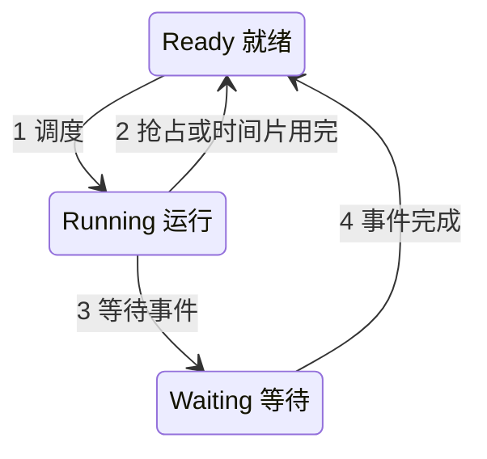

# 2016—2017 学年第一学期操作系统原理期末试卷（A 卷）

> 本文由《操作系统》期末考试原题转换而成，依据原 PDF 与 PaddleOCR 转写整理。原题题干、原有答案、公式、表格和计算过程均尽量保留；对无法可靠识别的内容不作无依据改写。

> [!tip] 真题导航
> 下一份：[[2017—2018 学年第一学期操作系统期中试卷（版本一）]]

## 主要内容

- 操作系统基础、进程与线程
- 处理机调度、同步互斥与死锁
- 存储管理、虚拟存储与地址转换
- 文件系统、输入输出与磁盘调度
- 原题答案、计算过程与图示转写

---

## 一、转写说明

| 项目 | 内容 |
|---|---|
| 课程 | 操作系统 |
| 资料类型 | 期末考试原题 |
| 整理日期 | 2026-08-12 |
| 转写原则 | 保留原题及原有答案；不擅自补写或修正知识性内容 |

> [!warning] OCR 与答案说明
> 文中可能保留原卷手写答案、原答案或 OCR 的拼写、符号问题；无答案处不自行补写。所有图片均已转换为 Mermaid、原生表格或完整文字描述，最终笔记不包含图片。

---

## 二、原题与参考答案

| 考试注意事项 | 一、学生参加考试须带学生证或学院证明，未带者不准进入考场。学生必须按照监考教师指定座位就坐。 |  |  |  |  |  |  |  |  |  |
|---|---|---|---|---|---|---|---|---|---|---|
| 二、书本、参考资料、书包等与考试无关的东西一律放到考场指定位置。学生不得另行携带、使用稿纸，要遵守《北京邮电大学考场规则》，有考场违纪或作弊行为者，按相应规定严肃处理。学生必须将答题内容写在试卷上，做在草稿纸上一律无效。 |  |  |  |  |  |  |  |  |  |  |
| 五、第1题须用英文应答，中文答对得一半分。 |  |  |  |  |  |  |  |  |  |  |
| 题号 | 一 | 二 | 三 | 四 | 五 | 六 | 七 | 八 | 总分 |  |
| 满分 | 10 | 13 | 27 | 12 | 16 | 12 | 10 |  | 100 |  |
| 得分 |  |  |  |  |  |  |  |  |  |  |
| 阅卷教师 |  |  |  |  |  |  |  |  |  |  |

### 1.FILL IN BLANKS (1*10 points)

(1) A time-shared computer system uses _____ scheduling scheme and multiprogramming to provide each user with a small portion of CPU time.

(2) To prevent users from performing illegal I/O, we define all I/O instruction to be _____ instructions, which can be executed only in monitor mode.

(3) Considering OS interfaces, an application program can utilize_____ to acquire services provided by OS.

(4) In operating systems, ___ is the basic unit of resource-allocation for programs executing in computer systems.

(5) If a system can deal with 3 real-time processes, 5 interactive processes and 2 batch processes in 400ms, then the throughput of this system is_____.

(6)_____ is a high level language construct for process synchronization, and is characterized by shared variables and a set of programmer-defined operations on the shared variables.

(7) With respect to deadlocks, a system is _____if the system can allocate resources to each process (up to its maximum) in some order and still avoid a deadlock.

(8) On a paging system with  $2^{32}$ bytes of physical memory,  $2^{11}$ 1024-byte pages of logical address space,___ bits in the physical address specify the frame number:

(9) The file system consists of two distinct parts: a collection of files and a ___, which organizes and provides information about all files in the system.

(10) Considering file access methods and file disk space allocation, access is adapted to the files of linked allocation

### 2. CHOICE  $1 \times 13$ points

(1) Which one is not the main task of an operating system? __

A. Process management B. Language translation

C. File management D. memory management

(2) Which of the following system has strict time constraint? _____

A. batch system B. time-sharing system C. real-time system D. interactive system

(3) A starvation-free job-scheduling policy guarantees that no job waits indefinitely for service. Which of the following job-scheduling policies is starvation free? _____

A. Round Robin B. Priority C. Shortest Job First D. None of the above

(4) In operating systems, the semaphore stands for instances of resource, it is a integer variable relevant to a queue, its value can only be changed by operation WAIT and SIGNAL. If a semaphore S is initialized to 5, now it's value is 2, how many processes is or are waiting in the queue relevant to S.

A.3 B.2 C.1 D.0

(5) The Banker Algorithm is used for_____.

A. deadlock avoidance B. deadlock prevention

C. deadlock detection. D. deadlock recovery

(6) With respect to binding of instructions and data to memory addresses, if address binding is done at _____, the hardware MMU is needed.

A. Coding time B. compile time C. load time D. execution time

(7) Considering the following memory management schemes, ___ will maximize memory utilization.

A. fixed-sized partitions (MVT). B. paging C. segmentation will

(8) Consider a machine in which all memory-reference instructions have only one memory address, and one-level indirect addressing is allowed, if an instruction is assumed to be stored in one frame, then the minimum number of frames per process is ___.

A. one B. two C. three D. four

(9) The file system itself is generally composed of several different levels. In these levels, the ___ manages metadata and is responsible for protection and security.

A. logical file system

B. file-organization module

C. basic file system

D. I/O control

(10) Which allocation scheme would work best for a file system implemented on a device (e.g. a tape drive) that can only be accessed sequentially? ___

A. linked allocation

B. contiguous allocation

C. index allocation

D. none of them

(11) The disk free-space list is implemented as a bitmap. If the size of the disk space is 128 blocks, and each block is of 512 bytes, then ___bytes are needed to store the bitmap.

A. 128 B. 512 C. 16 D. 8192

(12) With respect to disk 10 operations, the ___ executes 10 instructions to control the disk controller to access data on disks

A. file system B. kernel I/O subsystem C. application process D. driver

(13) The following characteristics except _____are correct for disks.

A. secondary storage B. read-write devices

C. random-access devices D. character-stream devices

### 3. ESSAY QUESTIONS (27 points)

3.1 (6 points) Explain the following terms

1) deadlock (3 points)

(2) demand paging (3 points)

3.2 (6 points) In a multiprogramming system, consider the following diagram of process state transitions,

> [!note] 图像转写：进程三状态转换

原图用编号 1～4 标示上述四条有向转换；后续小问均以这些编号为准。

1) Is it possible that the transition 2 of a process can cause the transition 1 for a process? If yes, give an example; I is not, why? (3 points)

2) Is it possible that the transition 4 of a process can cause the transition 1 for a process? If yes, give an example; If not, why? (3 points)

3.3 (4 points) In a paging system, the page table is stored in main memory, and the active page entries are also bold in high-speed associate memory TLB (translation look-aside buffer). If it takes 100 nanoseconds to search the TLB, and 180 nanoseconds to search page table in main memory. What must the TLB hit ratio be to achieve an effective access time (EAT) of 150ns?

3.4 (6 points) In the file system on a disk with physical block sizes of 512 bytes, a file is made up of 128-byte logical records, and each logical record cannot be separately stored in two different blocks. The disk space of the file is organized on the basis of indexed allocation, and a block address is stored in 4 bytes. Suppose that 2-level index blocks is used to manage the data blocks of the file, answer the following questions:

1) What is the largest size of the file? (3 points)

2) Given 2000, the number of a logical record the file, how to find out the physical address of the record 2000 in accordance with the 2-level index blocks (3 points)

3.5 (5 points) A file is made up of 128-byte fix-sized logical records and stored on the disk in the unit of the block that is of 1024 bytes. The size of the file is 1024 bytes. Physical I/O operations transfer data on the disk into an OS buffer in main memory, in terms of 1024-byte block. If a process issues read requests to read the file's records in the sequential access manner, what is the percentage of the read requests that will result in IO operations?

4. (12 points) Considering a real-time system, in which there are 4 real-time processes P1, P2, P3 and P4, that are aimed to react to 4 critical environmental events e1, e2, e3 and e4 in time respectively.

The arrival time of each event ei, $1 \leq i \leq 4$, (that is, the arrival time of the process Pi), the length of the CPU burst time of each process Pi, and the deadline for each event ei; are given below. Here, the deadline for ei is defined as the absolute time point before which the process Pi must be completed.

The priority for each event ei (also for Pi) is also given, and a smaller priority number implies a higher priority.

| Events | Process | Arrival Time | Burst Time | Priorities | Deadline |
|---|---|---|---|---|---|
| e1 | P1 | 0.00 | 4.00 | 3 | 7.00 |
| e2 | P2 | 3.00 | 2.00 | 1 | 5.50 |
| e3 | P3 | 4.00 | 2.00 | 4 | 12.01 |
| e4 | P4 | 6.00 | 4.00 | 2 | 11.00 |

(1) Suppose that priority-based preemptive scheduling is employed, (6 points)

a) Draw a Gantt chart illustrating the execution of these processes

b) What are the average waiting time and the average turnaround time

c) Which event will be treated with in time, that is the process reacting to this event will be completed before its deadline?

(2) Suppose that FCFS scheduling is employed, (6 points)

a) Draw a Gantt chart illustrating the execution of these processes

b) What are the average waiting time and the average turnaround time

c). Which event will be treated with in time?

5. (16 points) Here is a plate that can contain 3 fruits. The father puts apples and the mother puts oranges into the plate. The daughter takes apples and the son takes oranges from the plate to eat.  $\underline{\text{The father, mother, daughter and son are permitted only to operate on the plate in a mutually exclusive mode, and only one apple or one orange can be put into or taken from the plate each time.}}$

 $\underline{\text{Please design four semaphore-based processes for}}$ the father, mother, daughter and son-to correctly operate on the plate.

Requirements:.

1) Define the semaphores used to synchronize the processes, describe simply the role of each semaphore, and give their initial values. (4 points)

2) Illustrate the structures of, processes for the father, mother, daughter and son. (12 points)

6. (12 points) Considering a system with five processes P0 through P4 and three resource types A, B and C. Resource types A has 4 instances, B has 3 instances and C has 6 instances. Suppose that, at time T0, we have the following resource-allocation state, 

|  | Allocation |  |  | Request |  |  | Available |  |
|---|---|---|---|---|---|---|---|---|
|  | A | B | C | A | B | C | A | B |
| P0 | 1 | 0 | 0 | 2 | 3 | 2 | 1 | 1 |
| P1 | 2 | 1 | 1 | 1 | 0 | 2 |  |  |
| P2 | 0 | 1 | 1 | 1 | 0 | 3 |  |  |

| P3 | 0 0 2 | 4 2 0 |  |
|---|---|---|---|
| P4 | 0 0 0 | 1 0 6 |  |

Answer following questions by means of the deadlock-detection algorithm

.usts)

(2) If P0 requests one additional instance of type B; what is the Request Matrix? Is there a deadlock in the system? and why? (6 points)

7. (10 points) A cache is a region of faster memory that holds copies of data. Most systems have one or more high-speed data caches in the memory hierarchy. Information (e.g. the instruction or data) is normally kept in main memory. As it is used, it is copied into the cache. When a particular piece of information is needed, we first check whether it is in the cache. If it is, we use the information directly from the cache; if it is not, we use the information from the main memory and put a copy in the cache under the assumption that we will need it again soon.

In a paging system, the-main memory is divided into 1024 frames. Refer to the following figure. It is supposed that a cache in the system consists of 4 slots and each slot can hold only one frame. There is also a tag field in each slot to record the number of the frame kept in this slot.

slot

> [!note] 图像转写：四槽高速缓存与物理内存
> 原图左侧为 4 个槽位的缓存，每个槽位包含 `tag` 与 `data` 字段；右侧为编号 0～1023 的物理页框。缓存以页框号作为标记，将相应页框内容保存在数据字段中；图中没有给出各槽位的具体当前值。

| 缓存槽位 | 标记字段 | 数据字段 |
|---|---|---|
| 0 | 页框号 `tag` | 页框数据 `data` |
| 1 | 页框号 `tag` | 页框数据 `data` |
| 2 | 页框号 `tag` | 页框数据 `data` |
| 3 | 页框号 `tag` | 页框数据 `data` |

物理内存页框编号范围为 0～1023。

When a frame is needed to be copied to the cache but there is no free slot to hold it, slot replacement occurs. The system uses the slot replacement algorithm to select a victim frame already in the cache and then replace the victim by this frame.

Assuming that all of 4 slots in the cache are free initially, and CPU references the memory according to the following sequence of memory frame numbers

1, 0, 2, 1, 7, 6, 7, 0, 1, 2, 0, 4, 5, 1, 5

(1) If FIRO replacement algorithm is used, illustrate the frame number kept in each cache slot successively, and give the cache hit ratio (5 points)

(2) If LRU replacement algorithm is used, illustrate the frame number kept in each cache slot successively, and give the cache a hit ratio. (5 points)

Note:

1. The scheme of slot replacement between the cache and the main memory is similar to that of page replacement between the main memory and the disk

2. The cache hit ratio is defined as the percentage of times that the frames referenced by CPU can be found in the cache.

---

## 本章小结

| 复习维度 | 本卷覆盖内容 |
|---|---|
| 基础概念 | 操作系统服务、系统调用、进程与线程 |
| 核心算法 | 处理机调度、同步与死锁、存储与页面替换 |
| 系统资源 | 文件、I/O 设备、磁盘与资源分配 |
| 使用建议 | 先独立作答，再核对原卷已有答案与计算过程 |

> [!tip] 关联复习
> 可配合 [[操作系统/笔记/操作系统课程笔记|操作系统课程笔记]] 按章节回顾相关概念与算法。
