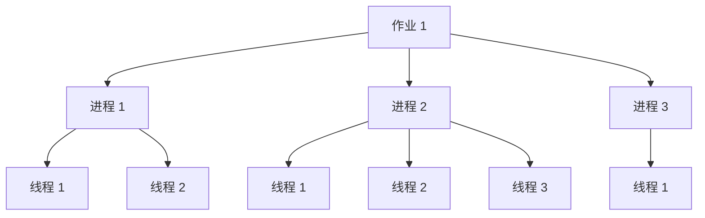

# 2018 年春季学期《操作系统》综合复习题

> 本文由 PDF 逐页转写，包含客观题、简答题、画图题和综合题。来源文件名写作“2016年秋季操作系统原理期末复习题”，但 PDF 内页标题和页脚均明确写作“2018 年春季学期《操作系统》综合复习题”，本文以文档内部标题为准。

## 主要内容

- 操作系统、进程与信号量基础
- 存储管理、I/O、文件与磁盘
- 进程状态图与作业—线程层次
- 生产者—消费者、银行家算法和页面置换

> [!warning] 标注答案待核验
> PDF 声明“不公开标准答案”，但部分选项以红字或黄色高亮标注。以下仅记录可辨标记；其中存在单选题多处同时标色等矛盾，不视为标准答案。

---

## 一、资料说明

原资料说明：

1. 复习题适配机器阅卷形式，可用于熟悉机阅卷题型。
2. 复习题和考试拟合度较高，要求认真准备。
3. 复习题不公开标准答案，需要自行完成所有题目。
4. 答案应以课程空间电子课件为依据；其他来源的表述若与课程答案不完全一致，可能不得分或少得分。

---

## 二、单项选择题

### 1. 操作系统与进程

1. 在操作系统的分类中，属于不同分类方法的有（　）。
   - A. 多道批处理操作系统
   - B. 分布式操作系统
   - C. 分时操作系统
   - D. 实时操作系统
   - 原资料标记：A 为红字，D 被黄色高亮，标记互相矛盾。
2. 中断是指（　）。
   - A. 操作者要求计算机停止
   - B. 操作系统停止了计算机运行
   - C. CPU 对系统中发生的异步事件的响应
   - D. 操作系统停止了某个进程的运行
   - 原资料红字：C。
3. 引入多道程序操作系统的主要目的是（　）。
   - A. 使不同程序都可以使用各种资源
   - B. 提高 CPU 和其他设备的利用率
   - C. 操作更方便
   - D. 使串行程序执行时间缩短
   - 原资料红字：B。
4. 计算机内存中按（　）编址。
   - A. 位
   - B. 块
   - C. 字
   - D. 字节
   - 原资料红字：D。
5. 进程中对互斥变量进行操作的代码段称为（　）。
   - A. 内存共享
   - B. 并行性
   - C. 同步
   - D. 临界段
   - 原资料红字：D。
6. 简单分页系统页面大小为 8 KB。逻辑地址 $A=2280H$，页表为 `[0,5 / 1,4 / 2,1 / 3,0 / …]`，对应物理地址 $A'$ 为（　）。
   - A. 0280H
   - B. D280H
   - C. 8280H
   - D. 7280H
   - 原资料红字：B。
7. 一个信号量被定义为一个（　）。
   - A. 字符
   - B. 整数
   - C. 任意型变量
   - D. 整型变量
   - 原资料红字：D。
8. 用信号量机制控制打印机共享。若系统有 2 台打印机，信号量初值应为（　）。
   - A. 0
   - B. 1
   - C. 2
   - D. -2
   - 原资料仅高亮题干，未见可靠答案标记。
9. I/O 系统层次模型中，处于最高层、负责所有设备 I/O 工作共同功能的模块是（　）。
   - A. I/O 子系统
   - B. 设备驱动程序接口
   - C. 系统服务接口
   - D. 设备驱动程序
   - 原资料红字：A。

### 2. 作业、进程与地址映射

10. 一个作业的进程处于阻塞状态，这时该作业处于（　）。
    - A. 提交状态
    - B. 后备状态
    - C. 运行状态
    - D. 完成状态
    - 原资料红字：C。
11. 关于进程概念，下面说法不对的是（　）。
    - A. 进程是程序的一次执行
    - B. 进程是动态的
    - C. 一个程序对应一个进程
    - D. 进程有生命周期
    - 原资料红字：C。
12. 进程间接通信中，端口代表（　）。
    - A. 进程
    - B. 计算机中的不同网卡
    - C. 服务器
    - D. 计算机终端在网络中的位置
    - 原资料红字：A。
13. 计算机数据总线宽度一般对应计算机的（　）。
    - A. 位
    - B. 块
    - C. 字长
    - D. 字节
    - 原资料红字：C。
14. 简单分页系统页面大小为 4 KB。逻辑地址 $A=3580H$，页表为 `[0,5 / 1,6 / 2,1 / 3,0 / …]`，对应物理地址 $A'$ 为（　）。
    - A. D580H
    - B. 0580H
    - C. 6580H
    - D. 7580H
    - 原资料红字：A。
15. CPU 在什么时候扫描是否有中断发生？
    - A. 开中断语句执行时
    - B. 每条程序执行结束后
    - C. 一个进程执行完毕时
    - D. 每个机器指令周期的最后时刻
    - 原资料红字：A。
16. 完成从逻辑地址到物理页架号的映射，速度最快的是（　）。
    - A. 页表
    - B. 反向页表
    - C. 多级页表
    - D. 快表
    - 原资料红字：B。
17. 计算机系统用（　）电路判断中断优先级，以确定响应哪个中断。
    - A. 中断扫描
    - B. 中断屏蔽
    - C. 中断逻辑
    - D. 中断寄存器
    - 原资料红字：C。
18. 下列实存管理技术中，同一进程在连续地址中存储的是（　）。
    - A. 可变分区多道管理技术
    - B. 多重分区管理
    - C. 简单分页
    - D. 简单分段
    - 原资料红字：A。
19. 不支持记录等结构的文件类型是（　）。
    - A. 哈希文件
    - B. 索引顺序文件
    - C. 索引文件
    - D. 顺序文件
    - 原资料红字：D。
20. 用信号量机制控制打印机共享。如果有进程释放了一台打印机，信号量值应该（　）。
    - A. 不变
    - B. 加一
    - C. 减一
    - D. 归零
    - 原资料高亮题干与全部选项，未见可靠单项标记。
21. 下列设备中，（　）为块设备。
    - A. 软盘驱动器
    - B. MODEM
    - C. 声卡
    - D. 鼠标
    - 原资料红字：A。
22. 在任务管理器中结束一个进程，实际是（　）。
    - A. 修改进程状态
    - B. 撤销进程控制块
    - C. 修改进程优先级
    - D. 进程控制块进入阻塞队列
    - 原资料红字：B。

---

## 三、多项选择题

23. 操作系统具有哪些基本功能？
    - A. 资源管理
    - B. 病毒查杀
    - C. 人机接口
    - D. 网络连接
    - 原资料红字：A、C。
24. 下面哪些软件属于操作系统？
    - A. Android
    - B. Windows XP
    - C. DOS
    - D. Linux
    - 原资料仅高亮题干，未见可靠答案标记。
25. 操作系统中，对目录的设计主要包括哪些内容？
    - A. 文件名规则
    - B. 扇区分配
    - C. 目录内容
    - D. 目录结构
    - 原资料红字：C、D。
26. 通常通过破坏哪些条件预防死锁？
    - A. 资源独占
    - B. 不可抢夺
    - C. 部分分配
    - D. 循环等待
    - 原资料红字：A、D。
27. 硬盘中定位一个数据需要哪些参数？
    - A. 类型
    - B. 磁头号
    - C. 磁道号
    - D. 扇区号
    - 原资料仅高亮题干，未见可靠答案标记。
28. 多道程序操作系统具有哪些特性？
    - A. 随机性
    - B. 并行性
    - C. 可扩充性
    - D. 共享性
    - 原资料红字：B、D。
29. 进程的基本状态有哪些？
    - A. 运行态
    - B. 阻塞态
    - C. 就绪态
    - D. 完成态
    - 原资料红字：A、B、C。
30. 根据执行程序的性质不同，处理器可分为哪些状态？
    - A. 管态
    - B. 目态
    - C. 阻塞态
    - D. 执行态
    - 原资料高亮全部选项，无法判断其标记含义。
31. 最常用的内存存储保护机制有哪些？
    - A. 校验码
    - B. 界地址寄存器
    - C. 存储键
    - D. 信号量机制
    - 原资料红字：B、C。
32. 关于重定位，哪些描述正确？
    - A. 重定位技术有静态重定位和动态重定位两种
    - B. 重定位把程序中的相对地址变换为绝对地址
    - C. 在程序运行时进行重定位是静态重定位
    - D. 对应用软件的重定位由操作系统实现
    - 原资料红字：A、C、D。
33. 实存管理技术具备哪些功能？
    - A. 主存分配
    - B. 地址转换和重定位
    - C. 存储保护和主存共享
    - D. 存储扩充
    - 原资料红字：A、B、C。

---

## 四、判断题

| 题号 | 题干 | 原资料标记 |
|---|---|---|
| 34 | 线程仅能由操作系统创建。 | 错误 |
| 35 | 计算机系统中，信息在主存中的最小单位是字节。 | 错误 |
| 36 | 银行家算法用于检测当前系统中是否有死锁发生。 | 正确 |
| 37 | 通过二级页表的地址映射访问主存，存取数据需要两次访问主存。 | 错误 |
| 38 | 段页式技术不会产生任何碎片。 | 错误 |
| 39 | 一个进程被挂起后，将不再参与对 CPU 的竞争。 | 正确 |
| 40 | 当作业全部信息已由操作系统存放到磁盘的某些盘区中等待运行时，称该作业处于提交状态。 | 错误 |
| 41 | 被汇编、编译或连接装配后的目标程序所限定的地址集合是逻辑地址空间。 | 正确 |
| 42 | 从缓存到外存，容量越来越大，访问数据速度越来越快。 | 错误 |
| 43 | 窃听属于被动攻击。 | 正确 |
| 44 | 磁盘中的各种可执行文件就是进程。 | 错误 |

> [!warning] 判断答案未核验
> 上表仅转写 PDF 的红字标记，其中个别结论可能与常见教材表述冲突。

---

## 五、简答题

### 1. 现代操作系统的主要特点

原资料答案：

1. 微内核结构
2. 多线程机制
3. 对称多处理器机制（SMP）
4. 分布式操作系统
5. 面向对象技术

### 2. 进程及其与程序的区别

进程是具有一定独立功能的程序在一组特定数据集上的一次运行活动。

1. 进程是动态的，程序是静态的。
2. 进程有自己的生命周期，具有建立、运行、停止、结束等阶段和状态。
3. 进程除与程序相关外，还与数据相关。
4. 一个进程可以包含多个程序。
5. 一个程序可以对应多个进程；程序每执行一次就是一个进程。

### 3. 计算机和网络的四项安全要求

1. 机密性
2. 完整性
3. 可用性
4. 可靠性

### 4. 死锁的必要条件

> 原资料定义：一组竞争系统资源或相互通信的进程，它们之间相互“永远阻塞”的状态称为死锁。

原资料列出的条件为：

1. 资源互斥使用
2. 资源不可抢占
3. 资源分次分配机制
4. 循环请求等待状态（原资料称“一个充分条件”）

> [!warning] 来源表述待核验
> 原资料写作“三个必要条件、一个充分条件”，与常见教材把四项均列为死锁必要条件的表述可能不一致。

### 5. 信号量的三个要素及使用方法

原资料把三个要素写作：整型变量（数字灯）、`wait` 操作（申请资源按钮）、`signal` 操作（释放资源按钮）。

1. 整型变量：
   称为信号量，其值表示当前可用资源数。值大于 0 表示有资源可供进程使用；值为 0 表示最后一个资源刚被取得；值小于 0 表示无可用资源且有进程等待，其绝对值表示等待进程数。
2. `wait` 操作：
   进程申请资源时先对信号量执行“减 1”。若结果大于等于 0，则取得资源继续执行；若结果小于 0，则没有立即可用资源，进程按“阻塞等待”方式进入阻塞态，并把控制块连接到该资源的等待队列，等待资源可用时被唤醒。
3. `signal` 操作：
   进程退出资源使用时对信号量执行“加 1”。若执行前的信号量值小于等于 0，表示有进程等待，需要通过操作系统唤醒等待队列中的一个进程；若值大于 0，表示没有进程等待，释放资源的进程可继续向前执行。

### 6. 多线程机制下进程的作用

进程概念仍然存在。线程是进程内部的调度实体，进程的主要功能是完成对资源的控制。

### 7. 多线程是否一定更高效

不是。只有当任务使用相同资源，或需要通过共享文件通信时，多线程机制才较容易发挥高效优势。

---

## 六、画图题

### 1. 进程基本状态转换


原图还给出英文三状态模型：`Ready` 经调度进入 `Running`；`Running` 因时间片用完返回 `Ready`，因等待事件进入 `Blocked`；事件发生后 `Blocked` 返回 `Ready`。

### 2. 作业到线程的层次关系

原图表示：一个作业可包含多个进程，每个进程又可包含一个或多个线程。示例中作业 1 含进程 1、进程 2、进程 3；进程 1 含 2 个线程，进程 2 含 3 个线程，进程 3 含 1 个线程。



### 3. 循环扫描磁盘调度

读写磁头位于 53 号磁道，请求序列为 `98, 183, 37, 122, 14, 124, 65, 67`，磁头正由外向里移动。原资料给出的循环扫描顺序为：

`65 → 67 → 98 → 122 → 124 → 183 → 14 → 37`

移动总道数：

$$
12+2+31+24+2+59+169+23=322
$$

---

## 七、综合题

### 1. 单缓冲区生产者—消费者补空

原题给出接收/打印字符的伪代码，要求补全 `[1]`～`[6]`，并说明缓冲区大小变为 10 时如何修改：

```text
Program producer-consumer
Int B
Semaphore [1], [2]      // 初始字符数为 0，缓冲区空间为 1

Producer() {
  while (true) {
    receive(C)
    [3]                  // 申请缓冲区空间
    B := C
    [4]                  // 释放一个字符资源
  }
}

consumer() {
  while (true) {
    [5]                  // 申请字符
    Print(B)
    [6]                  // 释放一个空间资源
  }
}

main() {
  Parbegin(Producer(), Consumer())
}
```

> [!note] 来源未给答案
> PDF 保留的是待填写编号，没有提供 `[1]`～`[6]` 的确定答案。

### 2. 银行家算法

系统有三类资源 $M1,M2,M3$，资源总数分别为 10、5、8。四个进程已分配资源和尚需资源如下：

| 进程 | 已分配 $M1$ | 已分配 $M2$ | 已分配 $M3$ | 尚需 $M1$ | 尚需 $M2$ | 尚需 $M3$ |
|---|---:|---:|---:|---:|---:|---:|
| P1 | 2 | 1 | 0 | 2 | 4 | 1 |
| P2 | 3 | 0 | 2 | 1 | 2 | 3 |
| P3 | 1 | 0 | 2 | 3 | 1 | 2 |
| P4 | 1 | 2 | 2 | 4 | 1 | 5 |

要求按银行家算法判断能否安全分配并说明过程。源 PDF 未提供计算答案。

### 3. 生产者—消费者说明行补空

```text
Program producer-consumer
Int B
Semaphore Sp = 0, Se = 1     // (1)

Producer() {
  while (true) {
    receive(C)
    Wait(Se)                 // (2)
    B := C
    Signal(Sp)               // (3)
  }
}

consumer() {
  while (true) {
    Wait(Sp)                 // (4)
    Print(B)
    Signal(Se)               // (5)
  }
}

main() {
  Parbegin(Producer(), Consumer())  // (6)
}
```

要求补全 `(1)`～`(6)` 的说明文字。源 PDF 未给出这些说明的标准答案。

### 4. LRU 页面置换

作业分配 3 个页架，访问串为：`7, 0, 1, 2, 0, 3, 0, 4, 2, 3`。采用最近未使用页面调度；页架空闲时初次装入不计入缺页次数。

原图中的 LRU 新旧次序转写如下：

| 访问页 | 7 | 0 | 1 | 2 | 0 | 3 | 0 | 4 | 2 | 3 |
|---|---:|---:|---:|---:|---:|---:|---:|---:|---:|---:|
| 最新使用页 | 7 | 0 | 1 | 2 | 0 | 3 | 0 | 4 | 2 | 3 |
| 次新页 |  | 7 | 0 | 1 | 2 | 0 | 3 | 0 | 4 | 2 |
| 最老页 |  |  | 7 | 0 | 1 | 2 | 1 | 3 | 0 | 4 |

原资料标注：有 6 次缺页中断。

### 5. 奇偶数单缓冲区同步补空

三个进程 $R$、$W1$、$W2$ 共享单缓冲器 $B$。$R$ 读入一个数存入 $B$；奇数由 $W1$ 取出打印，偶数由 $W2$ 取出打印；禁止重复打印和从空缓冲器取数。

```text
begin
  B: integer
  S, SO, SE: (1)
  S := (2); SO := 0; SE := 0
  cobegin
    PROCESS R
      x: integer
      begin
      L1: 从输入设备读一个数
          x := 读入的数
          (3)
          B := x
          if B 为奇数 then Signal(SO)
          else (4)
          goto L1
      end

    PROCESS W1
      y: integer
      begin
      L2: Wait(SO)
          y := B
          (5)
          打印 y
          goto L2
      end

    PROCESS W2
      z: integer
      begin
      L3: (6)
          z := B
          Signal(S)
          打印 z
          goto L3
      end
  coend
end
```

要求补全 `(1)`～`(6)`，并说明信号量 $S$、$SO$、$SE$ 的作用。源 PDF 的第 10 页为空白答题页，未给出答案。

---

## 本章小结

| 模块 | 内容 |
|---|---|
| 客观题 | 操作系统、进程、地址映射、I/O、文件与保护 |
| 简答题 | 现代 OS、进程程序、死锁、信号量、多线程 |
| 图形题 | 三状态模型、作业—进程—线程、循环扫描 |
| 综合题 | 生产者—消费者、银行家算法、LRU、奇偶同步 |
