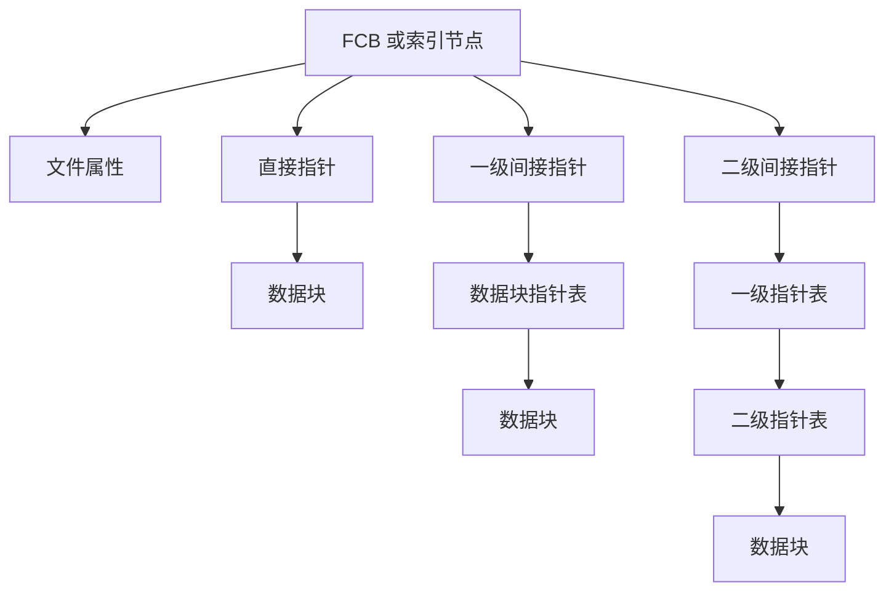

# 2022—2023 学年第一学期操作系统期末试卷（B 卷）

> 本文由《操作系统》期末考试原题转换而成，依据原 PDF 与 PaddleOCR 转写整理。原题题干、原有答案、公式、表格和计算过程均尽量保留；对无法可靠识别的内容不作无依据改写。

> [!tip] 真题导航
> 上一份：[[2022—2023 学年第一学期操作系统期中试卷（版本二）]]　|　下一份：[[2022—2023 学年第一学期操作系统期末试卷（A 卷）]]

## 主要内容

- 操作系统基础、进程与线程
- 处理机调度、同步互斥与死锁
- 存储管理、虚拟存储与地址转换
- 文件系统、输入输出与磁盘调度
- 原题答案、计算过程与图示转写

---

## 一、转写说明

| 项目 | 内容 |
|---|---|
| 课程 | 操作系统 |
| 资料类型 | 期末考试原题 |
| 整理日期 | 2026-08-12 |
| 转写原则 | 保留原题及原有答案；不擅自补写或修正知识性内容 |

> [!warning] OCR 与答案说明
> 文中可能保留原卷手写答案、原答案或 OCR 的拼写、符号问题；无答案处不自行补写。所有图片均已转换为 Mermaid、原生表格或完整文字描述，最终笔记不包含图片。

---

## 二、原题与参考答案

**原卷标题**：《操作系统》期末考试试题（B卷）

| 考试注意事项 | 一、学生参加考试须带学生证或学院证明，未带者不准进入考场。学生必须按照监考教师指定座位就坐。\n二、书本、参考资料、书包等物品一律放到考场指定位置。\n三、学生不得另行携带、使用稿纸，要遵守《北京邮电大学考场规则》，有考场违纪或作弊行为者，按相应规定严肃处理。\n四、学生必须将答题内容做在试题答卷上，做在试题及草稿纸上一律无效 |  |  |  |  |  |  |  |  |  |  |  |
|---|---|---|---|---|---|---|---|---|---|---|---|---|
| 考试课程 | 操作系统 |  |  |  | 考试时间 |  |  |  | 2023年2月15日9:00-11:00 |  |  |  |
| 题号 | 1 | 2 | 3 | 4 | 5 | 6 | 7 | 8 | 9 | 10 | 总分 |  |
| 满分 | 15 | 15 | 15 | 15 | 10 | 15 | 15 |  |  |  | 100 |  |
| 得分 |  |  |  |  |  |  |  |  |  |  |  |  |
| 阅卷教师 |  |  |  |  |  |  |  |  |  |  |  |  |

### 1. (15 points)

Suppose that there are 4 processes in a computer system, they are assumed to have arrived in order 1,2,3,4 at time 0 and the estimated Burst time of each process are shown in the following table. The scheduling algorithm uses round-robin Scheduling algorithm (quantum=2).

| Process | Burst Time |
|---|---|
| 1 | 8 |
| 2 | 4 |
| 3 | 9 |
| 4 | 5 |

(1) Draw Gantt charts that illustrate the execution of these processes.

(2) Calculate the turnaround time of each process.

(3) Calculate the average turnaround time.

### 2. (15 points)

There are two concurrent processes in a system that communicate through mailboxes. Each process receives the email from the other through its own mailbox, processes the email, and sends a new mail to the other's mailbox to answer questions and ask new questions.

When there is mail in the mailbox, the process can pick up the mail, otherwise it will wait; When the other's mailbox is not full, the process can send mail, otherwise it will wait.

The sending and receiving operations on the same mailbox should be mutually exclusive. Suppose that the mailbox of process P1 can store up to m messages, and the mailbox of process P2 can store up to n messages.

Initially, there are a messages (0 [!note] 图像转写：FCB／索引节点指针结构
> 原图上部记录文件属性（模式、所有者、时间戳、文件大小或块数等），下部包含直接、一级间接与二级间接索引指针。直接指针指向数据块；一级间接指针先指向一个“数据块指针表”；二级间接指针再多经过一级指针表。原图未给出每个数据块的实际内容。

Answer the following questions.

(1) What is the total size of disk space?

(2) How many bytes are there in the file with the maximum size that the file system can support?

(3) Given a file with the maximum size, if we want to retrieve a file record that may be located in an arbitrary data block of this file, how many disk blocks on average need

to be read from the disk?

7. (15 points) Suppose that a disk has 200 cylinders, numbered 0 to 199. The disk is currently serving a request at cylinder 43, and the previous request was at cylinder 25. The queue of pending requests in FIFO order is 115,65,107,158,194,5,193,68,21,Starting from the current head position, what is the scheduling order and the total distance (in cylinders) that the disk arm moves to satisfy all the pending requests, for each of the following disk-scheduling algorithms? The moving trajectory of the disk head should be given.

(1) FCFS

(2) C-LOOK

---

## 本章小结

| 复习维度 | 本卷覆盖内容 |
|---|---|
| 基础概念 | 操作系统服务、系统调用、进程与线程 |
| 核心算法 | 处理机调度、同步与死锁、存储与页面替换 |
| 系统资源 | 文件、I/O 设备、磁盘与资源分配 |
| 使用建议 | 先独立作答，再核对原卷已有答案与计算过程 |

> [!tip] 关联复习
> 可配合 [[操作系统/笔记/操作系统课程笔记|操作系统课程笔记]] 按章节回顾相关概念与算法。
