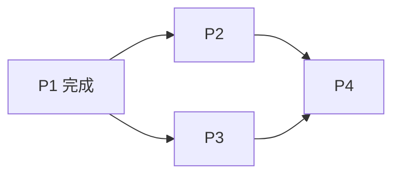

# 某某年《操作系统》期中试题（残缺扫描版）

> 本文由扫描版 PDF 转写。源文件未给出可辨识的学年标题，且存在大面积字符损坏和缺页；以下仅保留能够可靠辨识的题干、数据与表格。

## 主要内容

- 操作系统目标、进程特征与信号量
- 实时系统、多道程序与作业调度
- 进程调度、银行家算法与前驱关系
- 源文件残缺范围说明

> [!warning] 源文件严重残缺
> PDF 实际只有 4 页，但页脚标注“共 5 页”，第 5 页未收录。前 4 页又有多处黑色块状损坏，部分填空、答案和计算过程无法可靠恢复；本文不依据上下文猜造缺失内容。

---

## 一、填空题

> 每空 2 分，共 20 分。下列空缺符号代表原卷待填内容；“〔扫描缺失〕”代表源文件损坏。

1. 在计算机系统上配置操作系统的目标是〔扫描缺失〕、〔扫描缺失〕、可扩充性、开放性。
2. 进程的执行并不是“一气呵成”，而是走走停停的，这种特征称为进程的〔扫描缺失〕。
3. 在利用信号量实现进程互斥时，应将临界区置于〔扫描缺失〕和〔扫描缺失〕之间。
4. 死锁的 4 个必要条件中，无法破坏的是（〔扫描缺失〕）。
5. 用户为阻止进程继续执行，应利用（〔扫描缺失〕）原语；若进程正在执行，应转变为（〔扫描缺失〕）状态。以后若用户要恢复其运行，应利用（〔扫描缺失〕）原语，此时进程应转变为（〔扫描缺失〕）状态。

---

## 二、选择题

> 每题 4 分，共 20 分。

1. 实时操作系统必须在（　）处理来自外部的事件。
   - A. 一个机器周期
   - B. 被控制对象规定时间
   - C. 周转时间
   - D. 时间片
2. 提高单机资源利用率的关键技术是（　）。
   - A. 脱机技术
   - B. 虚拟技术
   - C. 交换技术
   - D. 多道程序设计技术
3. 单处理机系统中可并行的是（　）。
   - Ⅰ. 进程与进程
   - Ⅱ. 处理机与设备
   - Ⅲ. 处理机与通道
   - Ⅳ. 设备与设备
   - A. Ⅰ、Ⅱ、Ⅲ
   - B. Ⅰ、Ⅱ、Ⅳ
   - C. Ⅰ、Ⅲ、Ⅳ
   - D. Ⅱ、Ⅲ、Ⅳ
4. 进程的基本状态中，（　）可以由其他两种基本状态转变而来。
   - A. 新建状态
   - B. 就绪状态
   - C. 阻塞状态
   - D. 执行状态
5. 假设 4 个作业到达系统的时刻和运行时间如下：

| 作业 | 到达时刻 $t$ | 运行时间 |
|---|---:|---:|
| J1 | 0 | 3 |
| J2 | 1 | 3 |
| J3 | 1 | 2 |
| J4 | 3 | 1 |

系统在 $t=2$ 时开始作业调度。若分别采用先来先服务和短作业优先调度算法，则选中的作业分别是（　）。

- A. J2、J3
- B. J1、J4
- C. J2、J4
- D. J1、J3

---

## 三、判断题

> 每题 2 分，共 10 分。源文件未保留可辨识答案。

1. 进程和线程都是可独立调度和分派的基本单位。（　）
2. 计算机系统中判断是否有中断发生，是在由用户态转入核心态时。（　）
3. 对临界资源，应采用互斥访问方式来实现共享。（　）
4. 进程之间的通信，即管道、消息队列、共享内存、信号量等机制，必须借助于操作系统内核功能。（　）
5. 在理想条件下（作业长度已知且同时到达），短作业优先调度算法（非抢占式）具有最短的作业平均周转时间。（　）

---

## 四、综合应用题

> 每题 15 分，共 30 分。

### 1. 计算与 I/O 并行

一个多道批处理系统中仅有 $P1$ 和 $P2$ 两个作业，$P2$ 比 $P1$ 晚 10 ms 到达，其计算和 I/O 操作顺序如下：

- $P1$：计算 60 ms，I/O 80 ms，计算 20 ms。
- $P2$：计算 120 ms，I/O 20 ms，计算 30 ms。

不考虑调度和切换时间，计算完成两个作业需要的最少时间，并给出相应图示说明。

### 2. 银行家算法

系统中有 5 个进程 $P0$～$P4$ 和 4 种资源 $A,B,C,D$，资源状态如下：

| 进程 | 已分配资源 | 尚需资源 | 当前可用资源 |
|---|---|---|---|
| P0 | $(1,1,1,0)$ | $(0,3,3,1)$ | $(0,3,2,2)$ |
| P1 | $(0,2,3,1)$ | $(0,3,4,2)$ |  |
| P2 | $(0,2,1,2)$ | $(1,0,3,4)$ |  |
| P3 | $(0,3,1,0)$ | $(0,3,2,0)$ |  |
| P4 | $(1,0,2,1)$ | $(0,4,2,3)$ |  |

判断该状态是否安全。若安全，给出相应安全序列（优先选择进程号小的进程）；若不安全，说明原因，并给出详细计算过程。

> [!warning] 答案损坏
> 表格下方原有作答或计算痕迹，但已被扫描损坏为大面积黑块，无法可靠转写。

---

## 五、程序与算法题

> 共 1 题，20 分。

有 4 个进程 $P1$、$P2$、$P3$、$P4$。要求：

1. $P1$ 必须在 $P2$、$P3$ 开始前完成。
2. $P2$、$P3$ 必须在 $P4$ 开始前完成。
3. $P2$ 和 $P3$ 不能并发执行。

画出 4 个进程的前驱图，并写出相应的同步互斥算法。

图中前驱边仅表达题干明确给出的执行先后关系；$P2$ 与 $P3$ 的互斥约束还需在伪代码中通过互斥信号量实现。

> [!warning] 缺页
> 题目的作答页应在第 5 页，但源 PDF 未包含该页，因此无法转写原卷算法。

---

## 本章小结

| 项目 | 状态 |
|---|---|
| 可辨题干 | 已完整转写 |
| 受损文字 | 已逐处标明，不作猜测 |
| 银行家算法表 | 已重建为 Markdown 表格 |
| 原卷第 5 页 | 源文件缺失 |
