# 12.1 保护和安全

> 本笔记整理自《操作系统》第 12 章课件，覆盖安全环境、数据加密、用户认证、系统内外部攻击和可信系统。课件中的知识导图、密码模型、签名流程、认证示意、攻击过程、缓冲区布局、病毒结构和可信计算基结构均已转写为文字。

## 主要内容

- 安全目标与计算机安全等级
- 加密模型、基本密码方法、公钥/私钥体系、数字签名与证书
- 口令、物理标志和生物特征认证
- 逻辑炸弹、陷阱门、木马、登录欺骗与缓冲区溢出
- 病毒、蠕虫、移动代码及病毒检测
- 访问矩阵、信息流控制、可信计算基与安全 OS 设计原则

---

## 一、安全环境

### 1. 保护、安全与目标

> **保护（protection）**：能够防御或监视攻击、入侵及损害系统行为的设施和措施。

> **安全（security）**：对系统完整性和数据安全性可信程度的衡量。

实现“安全环境”是目标，保护则是实现目标的方法。安全环境有三项核心目标：

| 目标 | 含义 | 对应威胁 |
|---|---|---|
| 数据机密性 | 机密数据只允许授权用户访问 | 信息被窃取、暴露 |
| 数据完整性 | 未授权者不能擅自篡改系统数据 | 数据被修改、破坏 |
| 系统可用性 | 授权用户能够随时使用资源，系统不无故拒绝服务 | 系统受扰乱、瘫痪或拒绝服务 |

> **图片转写（目标与威胁）**：课件以三个并列图标分别表示机密性、完整性和可用性，并逐一连接到“泄密、篡改、拒绝服务”三类威胁，说明安全目标与攻击后果是一一对应的。

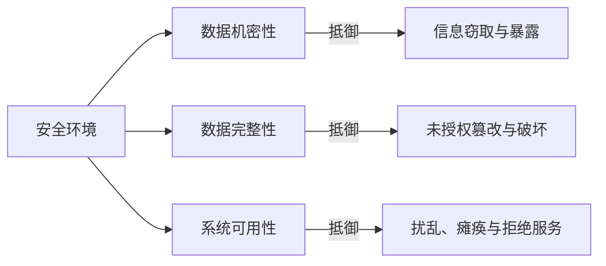

### 2. 系统安全等级

1983 年美国国防部发布 TCSEC，因核心文件为橙色封皮而称“橙皮书”；之后《信息技术安全评价通用准则》（CC）成为国际标准。TCSEC 将系统分为 D、C、B、A 四类、七级：

| 等级 | 主要要求 |
|---|---|
| D | 安全保护欠缺，未达到其他三类标准；课件以 MS-DOS 为例 |
| $C_1$ | 保护模式、用户登录验证和自主访问控制；用户能规定他人对自己文件的权限；多数 UNIX 系统属于此级 |
| $C_2$ | 在 $C_1$ 上增加个体层访问控制，称“受控存取控制级”；许多常用安全软件属于此级 |
| $B_1$ | 具有 $C_2$ 的全部属性，并为每个可控用户和对象附加安全标记 |
| $B_2$ | 在 $B_1$ 上要求自顶向下的结构化设计、设计验证及隐蔽信道分析 |
| $B_3$ | 在 $B_2$ 上要求用户/组访问控制表、充分的安全审计和灾难恢复能力 |
| $A_1$ | 采用强制访问控制和形式化模型；证明模型正确，并说明实现与保护模型一致 |

> **图示解读（安全等级阶梯）**：等级按 $D<C_1<C_2<B_1<B_2<B_3<A_1$ 逐级提高；C 类强调自主/受控访问，B 类加入安全标记、结构化验证和审计恢复，A 类达到形式化验证。

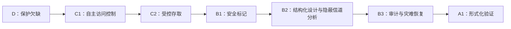

---

## 二、数据加密技术

### 1. 加密模型

加密是一门密写技术，把明文转为密文，使攻击者即使截获数据也不能理解其内容。相关技术包括数据加密与解密、数字签名、签名识别和数字证明。

数据加密模型的四个部分为：

1. **明文 $P$**：待加密的文本。
2. **密文 $Y$**：加密后的文本。
3. **算法**：加密算法 $E_{K_e}$ 或解密算法 $D_{K_d}$，规定明密文转换规则。
4. **密钥 $K$**：算法中的关键参数，分加密密钥 $K_e$ 和解密密钥 $K_d$。

基本关系可写为：

$$Y=E_{K_e}(P),\qquad P=D_{K_d}(Y)$$

设计密码的技术称**密码编码**，破译密码的技术称**密码分析**，二者合称**密码学**。

> **图示解读（加密模型）**：明文 $P$ 进入带加密密钥 $K_e$ 的加密算法，输出密文 $Y$；密文可能在传输中受到干扰或截获，接收端把 $Y$ 送入带解密密钥 $K_d$ 的解密算法，还原明文。图的重点是算法可以公开，而安全性依赖密钥。

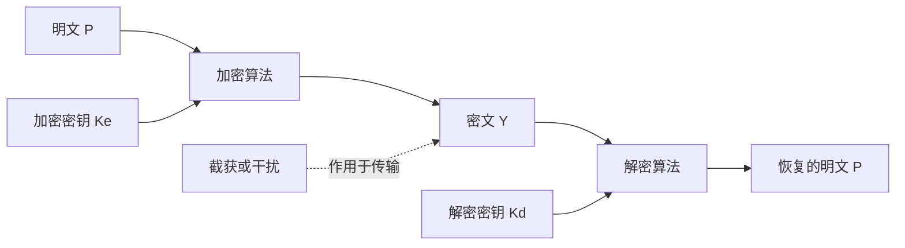

### 2. 两种基本方法

1. **易位法**：按规则重新排列明文的比特或字符，字符本身不变。
   - 比特易位：便于硬件实现。
   - 字符易位：可借助密钥规定列序，把明文填入矩阵后按密钥顺序读取各列。
2. **置换法**：把每个字符按映射替换成另一字符；例如以 26 个字母组成替换表，利用密钥确定原字母和密文字母的对应关系。

> **图片转写（易位示例）**：课件把英文明文写入字符矩阵，再按标号列顺序纵向读出密文；所有字母仍在，只是位置改变。

> **图片转写（置换示例）**：上下两排字母构成映射表，上排 `a…z` 与下排乱序字母逐一相连。加密沿上到下查表，解密反向查表。

### 3. 对称与非对称加密

| 比较 | 对称加密 | 非对称加密（公开密钥算法） |
|---|---|---|
| 密钥关系 | 加解密常用同一密钥，或由 $K_e$ 易推出 $K_d$ | $K_e$ 与 $K_d$ 不同，难以由一方推出另一方 |
| 速度 | 较快，适合大批量数据 | 较慢 |
| 密钥管理 | 分发和保管困难 | 可公开一个密钥，管理较简单 |
| 课件示例 | DES（课件另列“DEP”，按原文保留） | 公钥/私钥体系 |

实际系统常混合使用：以非对称算法安全传递对称密钥，再用对称算法加密大批量业务数据。

### 4. 数字签名

数字签名要满足：

1. 接收者能核实签名确由发送者产生。
2. 发送者事后不能否认签名。
3. 接收者不能伪造发送者的签名。

**简单数字签名**：发送者 A 用私钥 $K_{da}$ 处理明文 $P$，得到 $D_{K_{da}}(P)$；接收者 B 用 A 的公钥 $K_{ea}$ 验证：

$$E_{K_{ea}}\left[D_{K_{da}}(P)\right]=P$$

**保密数字签名**：A 先用自己的私钥签名，再用 B 的公钥加密；B 先以自己的私钥解密，再以 A 的公钥验证。这样同时获得身份确认、不可抵赖性与传输保密性。

> **图示解读（签名链路）**：简单签名图由“明文 → A 私钥处理 → 签名报文 → A 公钥验证 → 明文”组成；保密签名图在中间再包一层 B 的公钥/私钥加解密，形成“签名后加密、解密后验签”的双层链路。

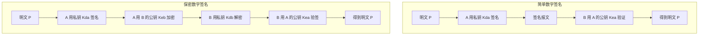

### 5. 数字证书

可信认证机构 CA 为公开密钥签发证明，即**数字证书**，用于证明通信者身份。ITU 的 X.509 标准规定证书应包含用户名称、发证机构、公开密钥、公开密钥有效期、证书编号及发证者签名。

> **图片转写（证书页）**：左侧设备照片用于象征网络终端；正文强调 CA 位于用户与公钥之间，以自身信誉绑定“身份—公钥”。照片不增加新的协议步骤。


---

## 三、用户验证

### 1. 三类认证依据

验证又称识别或认证，是网络安全的第一道防线。身份可依据：

1. **所知**：用户名、口令等只有用户知道的信息。
2. **所有**：磁卡、IC 卡等只有用户持有的物品。
3. **所是**：指纹、虹膜/眼纹、声音、DNA、人脸等生物特征。

### 2. 口令认证

普通登录程序用用户名和口令验证合法性。系统生成的口令通常难记，用户自选口令容易被猜中，因此应：适当加长、混合多种字符、失败后自动断开、不回显口令、记录并报告登录情况。

更强的方案包括：

- **一次性口令**：维护口令序列表与指针，每次登录只用一个口令。
- **口令文件保护**：口令文件保存合法口令和权限，应加密并妥善保管。
- **挑战—响应**：用户预先选定算法；服务器发送随机数，用户计算响应，服务器独立计算并比对，相同才允许登录，口令本身不在网络上传送。

> **图示解读（挑战—响应）**：流程是“服务器发随机挑战 → 客户端用约定算法计算 → 返回响应 → 服务器比较”，随机数使截获旧响应难以直接重放。

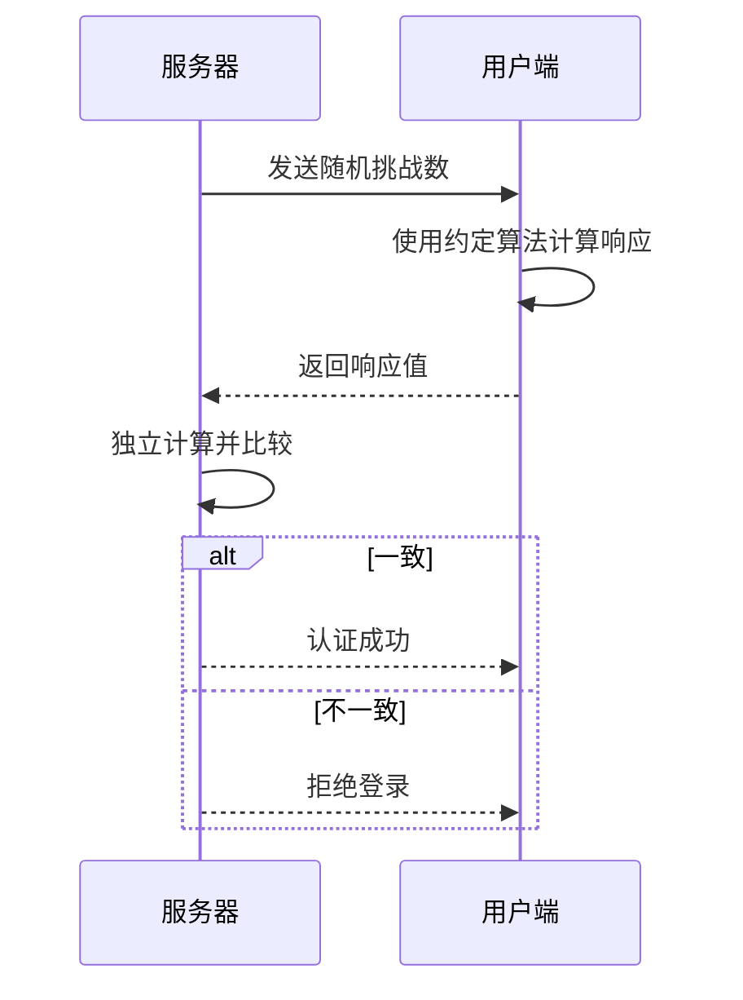

### 3. 基于物理标志的认证

- **磁卡**：读取磁条数据判断合法性，可再叠加口令。
- **IC 卡**：包括存储器卡、微处理器卡和密码卡，可采用挑战—验证等机制。

> **图片转写（卡片认证）**：课件以终端照片和卡片读取过程说明“持有物 + 可选口令”的双因素关系；装饰照片不增加数据字段。

### 4. 生物识别

生物特征应具备足够的个体差异、长期稳定和不易伪装三项条件。常见特征为指纹、眼纹、声音和人脸。系统由**生物特征采集器、注册部分、识别部分**组成，并应兼顾抗欺骗能力、用户接受度和成本。

指纹识别系统的关键硬件是指纹传感器；采集质量直接影响识别质量，课件列举光学式和压感式传感器，并指出指纹系统已逐步小型化，包含嵌入式实现。

> **图示解读（生物识别组成）**：用户特征先由采集器数字化；注册阶段建立模板，识别阶段把新样本与模板比较。课件的四个蓝色词点明可采集指纹、眼纹、声音和人脸。

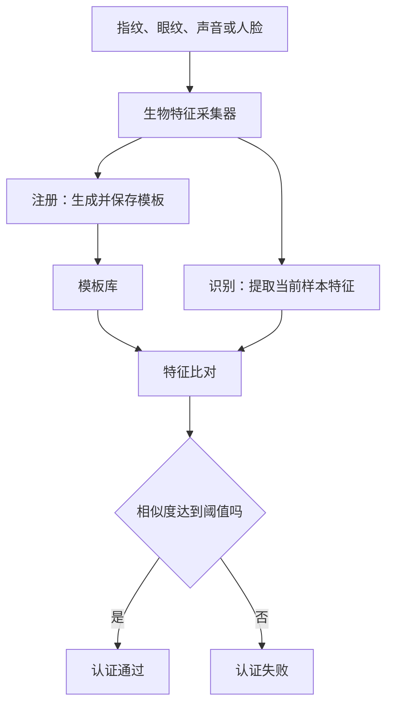

---

## 四、来自系统内部的攻击

### 1. 攻击路径与早期方式

内部攻击可由合法身份直接实施，也可通过置入应用的代理程序间接实施：前者利用已有权限读、改、删文件和破坏资源；后者等应用调用代理代码时执行预设任务。

早期常见方式：窃取尚未清除的信息、发起非法系统调用、使系统封杀口令校验程序、尝试规则禁止的操作、在 OS 中增加陷阱门、骗取口令。

课件把恶意软件分成：

- **独立运行类**：可由 OS 调度，如蠕虫、僵尸程序。
- **寄生类**：需寄生于应用，如逻辑炸弹、特洛伊木马、病毒。

### 2. 逻辑炸弹与陷阱门

**逻辑炸弹**在满足特定条件时执行破坏代码，触发可基于时间、事件或计数器。课件示例是程序员每天输入口令以抑制破坏程序；若被解雇而停止输入，程序随后“爆炸”。

**陷阱门（trap door/backdoor）**是程序中的隐蔽入口，使人可绕过正常安全检查。例如在登录程序中加入特殊用户名 `zzzzz`：无论口令为何均可进入系统。

```c
v = check_validity(name, password);
if (v || strcmp(name, "zzzzz") == 0) break; // 隐蔽绕过分支
```

> **图片转写（代码对照）**：正常代码只有 `v` 为真才退出验证循环；被植入陷阱门的代码多了“用户名等于特殊串”的或条件，形成肉眼不易发现的旁路。

### 3. 特洛伊木马与登录欺骗

**特洛伊木马**隐藏在有用程序中，运行外层功能的同时执行危害安全的代码。课件示例把木马藏入游戏；管理员以高权限运行游戏时，木马继承权限，将口令文件复制给攻击者。

**登录欺骗**过程：攻击者启动仿真的 `Login:` 程序 → 用户输入用户名和口令 → 假程序把凭据写入文件并退出/触发真正登录程序 → 屏幕再次出现 `Login:` → 用户误以为刚才输错而重试。攻击者由此获得凭据。

> **图示解读（登录欺骗三联图）**：三幅图按“显示伪登录界面—捕获输入—切回真登录界面”排列；键盘与人物照片只作场景提示，技术信息在三步文字链路中。

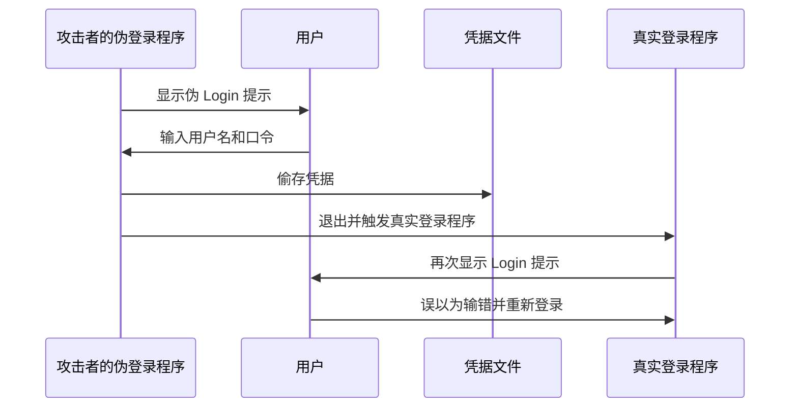

### 4. 缓冲区溢出

C 语言数组边界若未检查，越界写可覆盖相邻栈数据甚至返回地址。例如：

```c
int i;
char C[1024];
i = 12000;
C[i] = 0; // 严重越界
```

攻击者可精心构造输入，把恶意指令写入缓冲区并改写控制流，使函数返回时跳向攻击代码。

> **图示解读（栈布局三阶段）**：初始图显示调用者栈帧；调用函数 A 后，栈上新增局部缓冲区、保存寄存器和返回地址；溢出后，超长数据越过缓冲区覆盖保存信息与返回地址，因而能劫持后续执行。

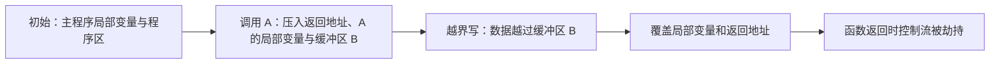

---

## 五、来自系统外部的攻击

### 1. 病毒、蠕虫与移动代码

| 类型 | 定义与特点 |
|---|---|
| 病毒 | 把自身附加在其他程序中并不断复制，借被感染程序和系统传播 |
| 蠕虫 | 可自我复制并传播，但自身是完整程序，可作为独立进程运行，不必寄生；由引导程序和蠕虫本体组成 |
| 移动代码 | 运行期间能在不同机器之间迁移；作为合法用户的一部分运行并继承其访问权，因而具有风险 |

课件称蠕虫传播性不如病毒强，这是课件原表述；实际判断具体恶意代码传播能力时应结合实现与网络环境。

**移动代码防护**：

1. **沙盒法**：把虚拟地址空间划为等大隔离区，不可信程序只能在所属沙盒运行；若访问或跳转至沙盒外，系统立即停止它。
2. **解释法**：以解释执行方式控制指令；可信的本地代码正常运行，来自互联网等不可信代码进入沙盒受限运行。

> **图示解读（沙盒）**：地址空间被画成多个相互隔离的矩形区，移动代码只能在一个区内访问和跳转，跨边界企图由运行时检查拦截。

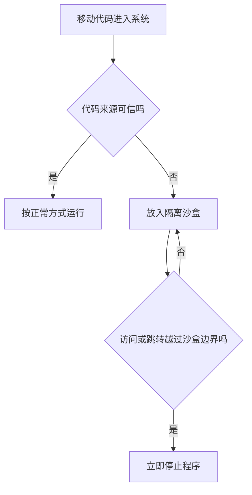

### 2. 病毒的特征、类型与隐藏

病毒有寄生性、传染性、隐蔽性和破坏性。课件列举文件型、内存驻留型、引导扇区型、宏病毒和电子邮件病毒。

常见隐藏方式：

- **伪装**：压缩；修改日期和时间。
- **隐藏**：藏于目录/注册表空间、程序页内零头；篡改磁盘分配数据结构或坏扇区列表。
- **多形态**：插入无用指令；加密病毒程序，使每次形态不同。

> **图示解读（感染与压缩）**：三幅竖向内存布局依次为正常程序、附加病毒后的程序、被压缩的感染程序；压缩后文件长度可能接近原文件，从而降低体积异常的可见性。

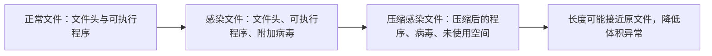

### 3. 预防与检测

预防措施：定期把重要软件和数据备份到外部介质；使用高安全性 OS 和正版软件；部署可靠反病毒软件；不轻易打开来历不明邮件；定期扫描硬盘和 U 盘。

检测方法：

1. **病毒库匹配**：建立病毒特征库并扫描磁盘可执行文件。
2. **完整性检测**：先确认基线环境干净，计算各文件及目录相关文件的校验和并保存；以后重新计算并比较，不一致说明文件可能被感染或篡改。

---

## 六、可信系统

### 1. 安全策略与安全模型

安全策略是根据系统安全需求制定的一组规则及描述；安全模型则精确表达需求和策略。模型应精确、简单、易懂，且不涉及具体实现细节。

**访问矩阵模型（保护矩阵）**：行对应主体/保护域，列对应程序、文件、设备等客体，交叉单元是主体对客体的权限集合；它决定某域内进程能执行哪些操作。

**信息流控制模型**补充访问矩阵，监管信息沿安全路径从一个实体流向另一个实体。

Bell–LaPadula 模型把信息分成无密、秘密、机密、绝密四级，并规定：

- **不能上读（no read up）**：密级 $k$ 的进程只能读同级或更低级对象。
- **不能下写（no write down）**：密级 $k$ 的进程只能写同级或更高级对象。

> **图示解读（信息流）**：密级沿纵轴向上升高；读箭头只能水平或向下，写箭头只能水平或向上，以阻止高密信息泄向低密层。

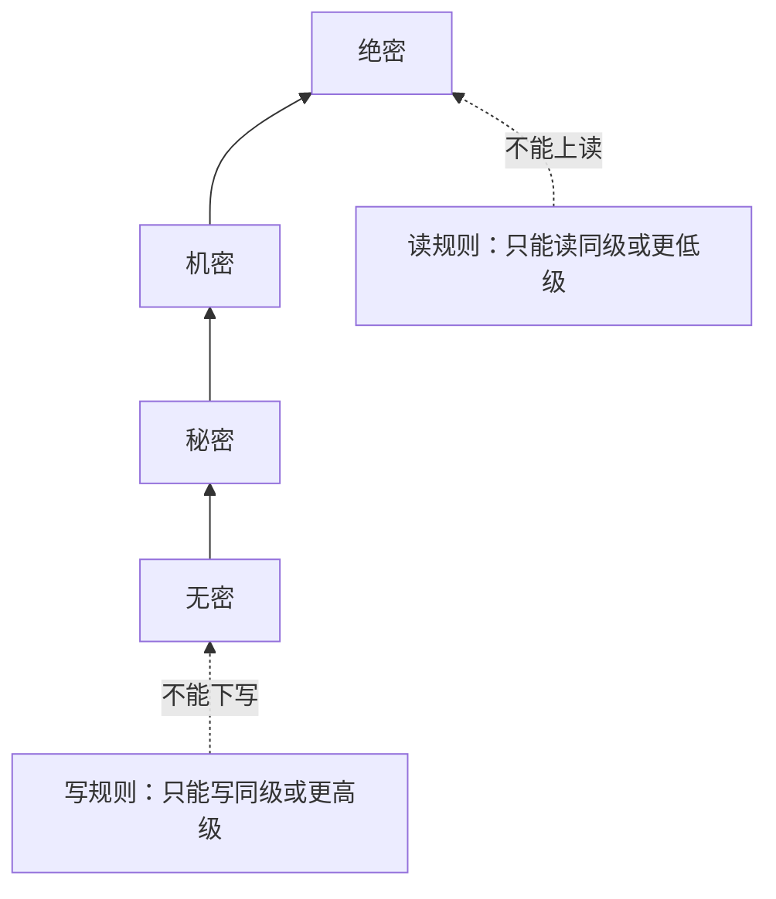

### 2. 可信计算基 TCB

可信系统的核心是**可信计算基（TCB）**，包括访问监视器和安全核心数据库，并承载进程创建/切换、内存映射、部分文件管理与设备管理等核心 OS 功能；硬件与普通系统相近，但可去除与安全无关的 I/O 设备。

- **安全核心数据库**：保存主体访问权限和对象保护属性，以及信息流控制信息。
- **访问监视器**：依据主体、对象的安全参数仲裁每次访问，要求完全仲裁、隔离和可证实。

> **图示解读（TCB 结构）**：主体通过访问监视器访问客体；监视器同时查询安全核心数据库，数据库又分访问控制模型与信息流控制模型。所有安全相关访问必须经过这一集中检查点。

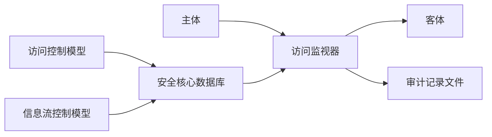

### 3. 设计安全操作系统的原则

1. 微内核（安全内核）原则。
2. 策略与机制分离原则。
3. 隔离原则。
4. 部分硬件实现原则。
5. 安全入口原则。
6. 分层设计原则。

> **图片转写（六项原则）**：课件用围绕笔记本的六个图标列出上述原则；中心设备仅为视觉中心，不表示额外组件或调用次序。

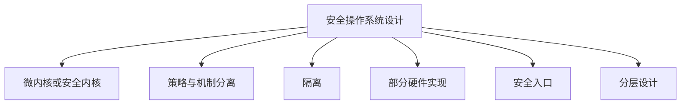

---

## 七、课程思政：国产操作系统的长期投入

课件回顾了国内从 20 世纪 70 年代参与 UNIX 研究，到 Linux 开源生态成为国产 OS 主流基础的过程。20 世纪 90 年代，Linuxfans 参与者黄建忠投身中科红旗，带队基于 Linux 二次开发，使国产系统在布局、操作与易用性上具备替代 Windows XP 的一定能力，但市场接受极为困难。

2009 年中国电子科技集团整合资源设立普华公司，黄建忠任研发总监；2014 年普华进入国产 OS 领域，当年 9 月发布普华操作系统 3.0，但用户习惯仍高度依赖 Windows。此后“棱镜门”和 WannaCry 等安全事件推动网络安全上升至国家战略，国产 OS 逐渐进入政府、金融、能源等关键领域。课件由此强调：操作系统自主可控是网络强国的重要基石。

---

## 本章小结

| 主题 | 核心结论 |
|---|---|
| 安全目标 | 机密性、完整性、可用性 |
| 加密 | 对称算法效率高，非对称算法便于密钥管理；实践中常混合使用 |
| 认证 | 所知、所有、所是三类凭据可组合成多因素认证 |
| 内部攻击 | 防范身份滥用、代理代码、后门、木马、登录欺骗和越界写 |
| 外部攻击 | 区分病毒、蠕虫、移动代码；结合隔离、特征检测和完整性校验 |
| 可信系统 | 用安全模型、TCB、访问监视器和安全核心数据库落实策略 |

> **知识导图转写**：第 12 章以“保护和安全”为中心，一级分支为安全环境、数据加密、用户验证、攻击和可信系统；攻击再分系统内部与外部，内部包含逻辑炸弹、陷阱门、木马、登录欺骗和缓冲区溢出，外部包含病毒、蠕虫和移动代码；可信系统包含访问矩阵、信息流控制、TCB 与安全 OS 设计原则。

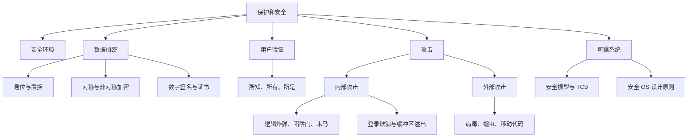

### 逐图覆盖审计

下表序号对应源课件中 71 个图片引用的出现顺序；所有结构图均已使用 Mermaid 重构，照片、图标等无法或无需重构的内容已完整文字化。

| 图片序号 | 主题 | 处理结果 |
|---|---|---|
| 1 | 本章知识导图 | Mermaid 重构安全环境、加密、验证、攻击和可信系统分支 |
| 2 | 计算机办公场景照片 | 装饰图，已说明不增加保护机制信息 |
| 3～6 | OS 标志 | 章节装饰；相邻正文完整转写机密性、完整性、可用性与威胁 |
| 7～10 | 用户确认与工具图标 | 章节导航装饰；保护、安全和等级知识由正文与表格承接 |
| 11～14 | 编号箭头图标 | 排版导航，不携带额外节点或连线语义 |
| 15 | 数据加密模型 | Mermaid 重构明文、密钥、加解密算法、密文与传输干扰 |
| 16～17 | 趋势图标 | 装饰图，易位法内容已文字化 |
| 18～20 | 置换法页面的办公场景照片 | 装饰背景；置换规则与字母映射已文字化 |
| 21～23 | 房屋、层次与锁图标 | 对称/非对称加密的章节导航，正文比较表完整承接 |
| 24 | 用户与工具双向箭头图 | 文字化为签名者、验证者及密码操作关系 |
| 25～26 | 趋势图标 | 装饰图，简单与保密数字签名由正文承接 |
| 27 | 两种数字签名流程 | Mermaid 分别重构简单签名和保密签名的密钥链路 |
| 28 | 数字证书场景照片 | 照片文字化；CA 签发和验证关系已 Mermaid 重构 |
| 29～32 | 房屋、层次、锁等章节图标 | 用户验证章节导航，无额外知识语义 |
| 33 | 物理标志认证场景照片 | 文字化磁卡、IC 卡及“持有物 + 口令”关系 |
| 34 | 蓝色强调圆点 | 纯排版装饰 |
| 35～36 | 目标图标 | 生物识别条件的装饰；三个条件已逐项文字化 |
| 37～38 | 房屋与层次图标 | 内部攻击章节导航，正文承接攻击路径与分类 |
| 39 | 笔记本及环绕功能图标 | 文字化恶意软件与攻击途径的概览关系 |
| 40 | 计算机办公场景照片 | 装饰图，不增加逻辑炸弹或陷阱门步骤 |
| 41～44 | 目标图标 | 章节装饰；逻辑炸弹、陷阱门和木马定义已完整转写 |
| 45～47 | 登录欺骗三幅场景照片 | Mermaid 时序图重构伪登录、窃取凭据和切回真登录全过程 |
| 48～50 | 房屋、层次与锁图标 | 缓冲区溢出章节导航，技术信息由代码与正文承接 |
| 51～53 | 栈布局三个阶段 | Mermaid 重构调用前、调用后、越界覆盖及控制流劫持 |
| 54～56 | 房屋、层次图标与办公照片 | 外部攻击章节导航；病毒、蠕虫、移动代码定义已文字化 |
| 57～58 | 趋势图标 | 移动代码防护章节装饰；沙盒判定过程已 Mermaid 重构 |
| 59 | 人物场景照片 | 装饰图，不增加病毒分类知识 |
| 60 | 正常、感染与压缩文件布局 | Mermaid 重构感染追加、压缩隐藏和长度变化关系 |
| 61～62 | 目标图标 | 病毒预防与检测章节装饰，方法已逐项文字化 |
| 63～64 | 趋势图标 | 信息流控制章节装饰；Bell–LaPadula 规则已 Mermaid 重构 |
| 65 | 人物场景照片 | 装饰图，不增加可信计算基信息 |
| 66～67 | 目标图标 | TCB 章节导航，其功能由正文承接 |
| 68 | TCB 体系结构 | Mermaid 重构主体、访问监视器、客体、审计与安全核心数据库 |
| 69～70 | 用户确认与工具图标 | 安全 OS 设计章节装饰，六项原则已 Mermaid 重构 |
| 71 | 本章知识导图 | Mermaid 重构为章末知识结构图 |
