# 2.1 进程的描述与控制

> 本笔记整理自《操作系统》第 2 章前、后两部分课件。内容覆盖前趋图与程序执行、进程描述、进程控制、进程通信、线程概念和线程实现。课件中的状态图、时间图、PCB 组织图、IPC 示意图、线程映射图、系统截图及历史照片均已转写为文字，不依赖原图片也可复习。

## 主要内容

- 前趋图、顺序执行、并发执行及其特征
- 进程的引入、定义、特征与进程实体
- 进程状态、挂起状态和状态转换
- PCB 的内容、作用与组织方式
- 进程创建、终止、阻塞、唤醒、挂起与激活
- 共享存储器、消息传递、管道和客户机—服务器通信
- 线程的概念、状态、TCB，以及线程与进程的比较
- 用户级线程、内核支持线程及多对一、一对一、多对多模型

---

## 一、并发、并行与前趋图

### 1. 冯·诺依曼体系结构与并发

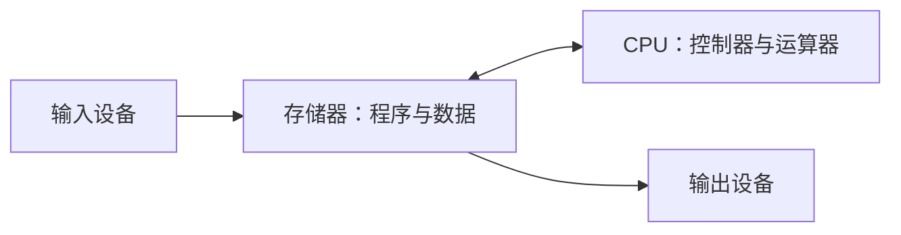

课件中的体系结构图表达“存储程序”：程序和数据统一进入存储器，CPU 取指并执行，结果再送往输出设备。

冯·诺依曼体系结构是**存储程序计算机**：输入设备把程序和数据送入存储器，CPU 中控制器和运算器按程序规定的时序逐条执行，再由输出设备给出结果。课件以约翰·冯·诺依曼及早期大型计算机照片说明这种“分解计算、按时序串行执行”的基础模型。

| 概念 | 典型硬件 | 含义 |
|---|---|---|
| 并发（concurrency） | 单核 CPU | 多个程序在一段时间内都向前推进，微观上交替使用 CPU |
| 并行（parallelism） | 多核/多处理机 | 多个程序在同一时刻分别占用不同 CPU，真正同时执行 |

> **图示解读（并行任务）**：双核 CPU 的 CPU 1、CPU 2 同时推进四个任务；每条任务线上若干彩色执行片段在时间上重叠，表示多核上的真正并行。单核虽不能让两个程序同时执行指令，但可通过快速切换产生并发。

计算机系统还可能通过总线、DMA 和不同设备控制器形成不同程度的并行：多道程序和时分复用提供并发；多处理器可并行；单 CPU 上普通程序不可并行，但 CPU 与 DMA/I/O 设备可并行工作。

### 2. 隐式并行性

为表达可并发计算的部分，可采用隐式并行性（implicit parallelism）：

1. **表达式**：在
   $$
   (u+v)(x+y)
   $$
   中，$u+v$ 与 $x+y$ 可同时计算。
2. **函数**：在
   $$
   z=f(x,u)+g(x)
   $$
   中，$f(x,u)$ 与 $g(x)$ 可同时计算。
3. **并行数据**：不同下标元素彼此独立，可并行计算。

```text
Z := for i in [1...n]
    z = X[i - 1] + Y[i + 1] * 2.0;
    returns array of z
end for;
```

### 3. 前趋图

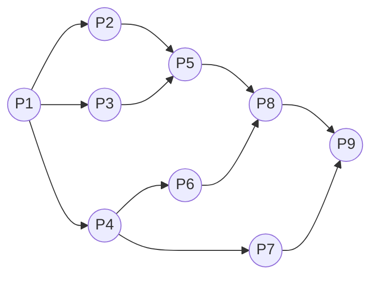

图中每条有向边都表示“起点必须先完成”；无环性保证先后约束不会自相矛盾。

> **定义：前趋图（Precedence Graph）**
> 前趋图是一个有向无循环图（Directed Acyclic Graph，DAG），用于描述程序段或进程之间执行的先后关系。

- 结点可表示一条语句、一个程序段或一个进程。
- 有向边表示两结点之间的偏序或前趋关系。
- 关系可写为
  $$
  \rightarrow=\{(P_i,P_j)\mid P_i\text{ 必须完成后 }P_j\text{ 才可开始}\}。
  $$
- 若 $(P_i,P_j)\in\rightarrow$，记作 $P_i\rightarrow P_j$；$P_i$ 是 $P_j$ 的直接前趋，$P_j$ 是 $P_i$ 的直接后继。
- 没有前趋的结点称**初始结点**，没有后继的结点称**终止结点**。
- 图中不能有环；课件用 $S_1\rightarrow S_2\rightarrow S_3\rightarrow S_2$ 的循环反例强调“有环图不是前趋图”。

九结点示例：

$$
P=\{P_1,P_2,P_3,P_4,P_5,P_6,P_7,P_8,P_9\}
$$

$$
\begin{aligned}
\rightarrow=\{&(P_1,P_2),(P_1,P_3),(P_1,P_4),\\
&(P_2,P_5),(P_3,P_5),(P_4,P_6),(P_4,P_7),\\
&(P_5,P_8),(P_6,P_8),(P_7,P_9),(P_8,P_9)\}。
\end{aligned}
$$

文字化执行关系如下：

- $P_1$ 完成后，$P_2、P_3、P_4$ 可并发开始；
- $P_2、P_3$ 都完成后才可执行 $P_5$；
- $P_4$ 完成后可并发执行 $P_6、P_7$；
- $P_5、P_6$ 都完成后才可执行 $P_8$；
- $P_7、P_8$ 都完成后才可执行 $P_9$。

### 4. 程序的顺序执行


一个大程序通常由若干程序段组成。顺序执行时，只有前一操作完成，后继操作才可执行。例如：

```c
int a = foo1();
int b = foo2();
int c = bar(a, b);
```

输入、计算、打印三个阶段在第 $i$ 批数据上顺序执行：

$$
I_i\rightarrow C_i\rightarrow P_i。
$$

若处理两批数据，完全串行的时间线为：

$$
I_1\rightarrow C_1\rightarrow P_1\rightarrow I_2\rightarrow C_2\rightarrow P_2。
$$

顺序执行具有：

1. **顺序性**：严格按规定次序执行。
2. **封闭性**：程序独占全机资源，执行结果不受外界影响。
3. **可再现性**：只要输入和初始条件相同，多次执行结果相同。

### 5. 程序的并发执行

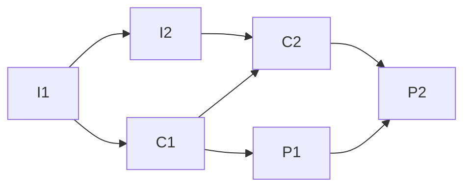

同一批次保持“输入→计算→输出”，相邻批次的同类阶段也保持顺序；不互相依赖的阶段可重叠。

多道程序技术把多个程序同时装入内存，使其交替或重叠运行。例如输入程序 $I$、计算程序 $C$、输出程序 $P$ 处理多批数据时，可形成流水式执行：

$$
I_1,I_2,I_3,I_4;\quad C_1,C_2,C_3,C_4;\quad P_1,P_2,P_3,P_4。
$$

其前趋关系是：

$$
I_i\rightarrow C_i,
\quad I_i\rightarrow I_{i+1},
\quad C_i\rightarrow P_i,
\quad C_i\rightarrow C_{i+1},
\quad P_i\rightarrow P_{i+1}。
$$

对于程序段：

$$
\begin{array}{ll}
S_1:&a:=x+2\\
S_2:&b:=y+4\\
S_3:&c:=a+b\\
S_4:&d:=c+b
\end{array}
$$

$S_1$ 与 $S_2$ 无数据依赖，可并发；$S_3$ 必须等二者完成，$S_4$ 必须等 $S_3$ 完成。

**并发执行的三个特征**

1. **间断性**：并发程序相互制约，呈现“执行—暂停—再执行”。
2. **失去封闭性**：多个程序共享全机资源，执行状态会受外部程序影响。
3. **不可再现性**：相同环境和初始条件下，多次执行可能得到不同结果。

**不可再现性例子**

程序 A、B 共享变量 $N$，某时刻 $N=n$：

```text
程序 A：N := N + 1;
程序 B：print(N); N := 0;
```

根据 `N := N + 1` 与 `print(N)`、`N := 0` 的相对次序，可出现：

| `N := N + 1` 的位置 | 打印值 | 最终值 |
|---|---:|---:|
| 在 `print(N)` 和 `N := 0` 之前 | $n+1$ | $0$ |
| 在二者之间 | $n$ | $0$ |
| 在二者之后 | $n$ | $1$ |

因此，普通程序直接参加并发执行会产生间断性、失去封闭性和不可再现性，必须引入**进程**来描述、管理和控制动态执行活动。

> **图示解读（CPU/I/O 重叠）**：程序 A 的执行序列为 CPU、设备 1、CPU、设备 2、CPU；程序 B 为设备 1、CPU、设备 2、CPU、设备 2。时间轴上的 CPU 段与设备段交错，表示一个程序等待 I/O 时，另一个程序可占用 CPU；图中的空白/青色片段表示等待或空闲区间。

该时间图的具体区间为：

| 程序 | 0～10 | 10～15 | 15～20 | 20～25 | 25～30 | 30～35 | 35～45 |
|---|---|---|---|---|---|---|---|
| A | CPU | DEV1 | 等待 | CPU | DEV2 | DEV2 | CPU |
| B | DEV1 | CPU | CPU | DEV2 | CPU | 等待 | DEV2 |

因此 0～10 只有 A 使用 CPU，10～20 由 B 使用 CPU，20～25 A 使用 CPU，25～30 B 使用 CPU，30～35 CPU 空闲，35～45 A 使用 CPU；I/O 设备与 CPU 可在许多区间重叠工作。

---

## 二、进程的引入、定义与特征

### 1. 为什么引入进程

假设编译程序 C 先编译源程序 1，执行到位置 `a` 时因某种原因暂停，CPU 转而编译源程序 2 并执行到 `b`。

未引入进程时：

- 真正占用 CPU 的都是同一个编译程序 C；源程序 1、2 只是它的数据对象。
- 很难说明程序计数器 PC 中究竟应保存 `a` 还是 `b`。

引入进程后：

- 两次编译活动分别作为进程 1、进程 2；源程序分别是各自的数据对象。
- 进程 1 运行时 PC 保存 `a`，切换到进程 2 时由进程 2 的上下文恢复 `b`。

进程把程序、数据和执行现场绑定成可独立管理的动态实体，使 OS 能识别“谁正在执行”、保存现场并在多个执行活动间切换。

### 2. 历史背景

- 1961 年，MIT 在 IBM 7094 上实现 CTSS（Compatible Time-Sharing System，相容分时系统），课件将其与进程概念的引入联系起来。
- 1963 年，MIT 启动 MAC 计划，以 IBM 大型机连接约 160 台终端，支持约 30 名用户同时使用。
- 1965 年，为扩大容量，MIT 启动 MULTICS（MULTiplexed Information and Computing System），目标是连接 1000 台终端、支持 300 名用户。
- 1969 年，贝尔实验室因性能未达预期退出；MULTICS 后在 GE 645 上使用。课件图片展示了参与 MULTICS 的科学家和 GE 645 大型计算机。

### 3. 进程的定义

课件列出三种典型表述：

1. 进程是程序的一次执行。
2. 进程是一个程序及其数据在处理机上顺序执行时发生的活动。
3. 进程是程序在一个数据集合上运行的过程，是系统进行资源分配和调度的独立单位。

> **本章定义**
> 进程是进程实体的运行过程，是系统进行资源分配和调度的一个独立单位。

进程实体通常由三部分组成：

$$
\boxed{\text{进程实体}=\text{程序段}+\text{相关数据段}+\text{PCB}}
$$

严格地说，“进程实体”是静态组成，“进程”是该实体的一次动态运行过程；课件常简写为“进程 = 程序 + 数据 + PCB”。

### 4. 进程与程序的区别和联系

| 比较项 | 进程 | 程序 |
|---|---|---|
| 性质 | 动态执行活动 | 静态指令集合 |
| 存放位置 | 运行时主要在内存 | 可长期存放于外存 |
| 存在时间 | 有创建、运行、消亡的生命期 | 可永久保存 |
| 组成 | 程序、数据、PCB 和执行现场 | 代码本身 |
| 对应关系 | 一个进程可在运行中调用多个程序 | 同一程序可被多次运行，形成多个进程 |

一个进程从用户态执行 `main()`，调用 `open()` 后进入内核态执行内核中的 `Open()`，再返回用户态。这说明“一个进程可跨越用户程序与内核程序”，但仍是同一个进程的执行过程。

课件的进程地址空间图从低地址到高地址依次画出代码段、数据段、只读数据段、BSS 段、堆以及位于高地址并向下增长的栈；中断或系统调用使同一进程从用户态进入内核态，并改用该进程的核心栈，返回后继续使用用户栈。图意强调：用户态/内核态是处理机特权级的变化，不等于换成另一个进程。

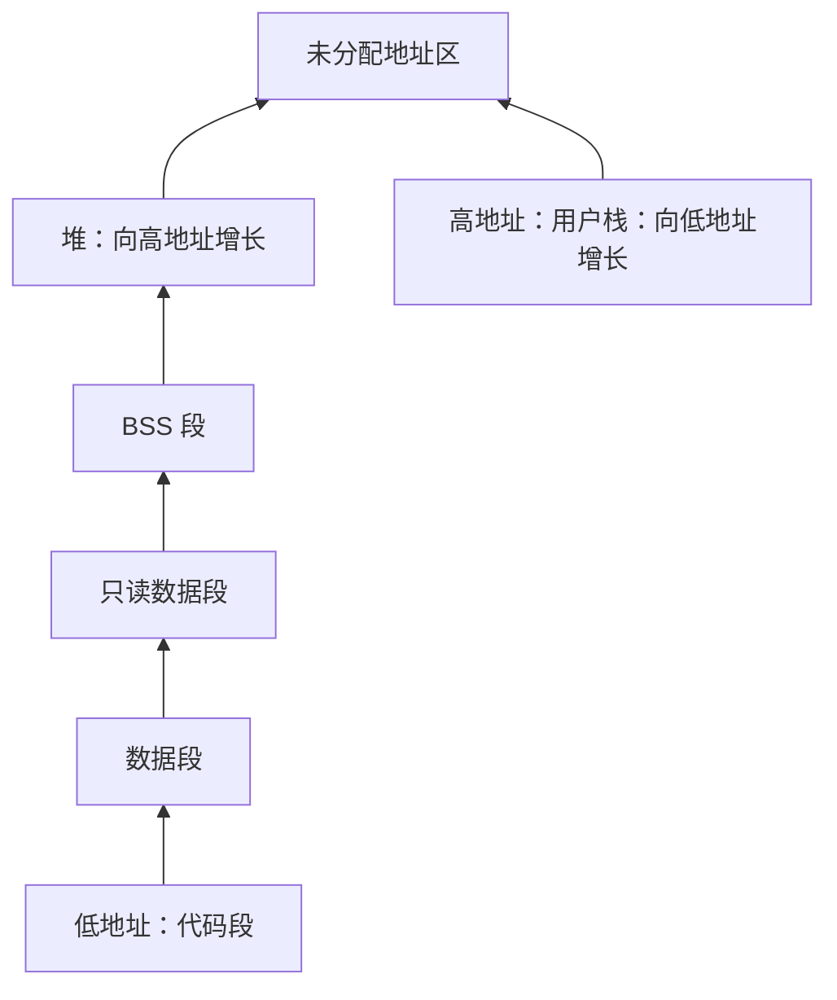

上图只表达地址高低和增长方向；进入内核态后使用核心栈，但进程身份不变。

> **生活类比**：菜谱/洗衣机手册相当于程序；原料或衣物相当于输入；烹饪或洗涤相当于进程；饭菜或干净衣服相当于输出。一个人可在等待洗衣机时烹饪，类似进程的分时切换。

### 5. 进程的基本特征

| 特征 | 含义 |
|---|---|
| 动态性 | 进程有创建、运行、暂停和消亡过程，是最基本特征 |
| 并发性 | 多个进程可在一段时间内同时存在、交替推进 |
| 独立性 | 进程是独立获得资源、独立接受调度的基本单位 |
| 异步性 | 各进程按独立、不可预知的速度向前推进 |

课件以 Windows 任务管理器和 SUSE Linux `ps` 输出说明：操作系统同时维护许多进程，每个进程有映像名/PID、用户、CPU 时间和内存占用等属性；同一系统中可同时出现大量 Oracle、系统服务和用户应用进程。

**课件中的系统进程实例**

SUSE Linux 终端输出列出的后台进程如下（`?` 表示未关联控制终端）：

| PID | TTY | 累计 CPU 时间 | 命令 |
|---:|---|---:|---|
| 868 | ? | 02:23:36 | oracle |
| 870 | ? | 00:00:35 | oracle |
| 872 | ? | 00:00:01 | oracle |
| 874 | ? | 00:18:38 | oracle |
| 876 | ? | 00:17:29 | oracle |
| 878 | ? | 00:17:28 | oracle |
| 880 | ? | 00:17:22 | oracle |
| 882 | ? | 00:16:25 | oracle |
| 884 | ? | 00:17:05 | oracle |
| 886 | ? | 00:17:52 | oracle |
| 888 | ? | 00:17:19 | oracle |
| 890 | ? | 00:16:41 | oracle |
| 892 | ? | 00:17:54 | oracle |
| 913 | ? | 02:49:25 | tnslsnr |
| 985 | ? | 00:00:37 | master |
| 999 | ? | 00:00:00 | atd |
| 1014 | ? | 00:00:07 | cron |
| 1030 | ? | 00:01:57 | nscd |
| 1031 | ? | 00:00:42 | nscd |
| 1032 | ? | 00:01:55 | nscd |
| 1033 | ? | 00:01:48 | nscd |
| 1034 | ? | 00:01:45 | nscd |
| 1035 | ? | 00:01:48 | nscd |
| 1036 | ? | 00:01:48 | nscd |

Windows 任务管理器实例显示进程数为 35、CPU 使用率为 38%、提交更改约为 `278000K / 886220K`；可见的进程如下：

| 映像名称 | 用户名 | CPU | 内存使用 |
|---|---|---:|---:|
| taskmgr.exe | Administrator | 38 | 5,212 K |
| mspaint.exe | Administrator | 00 | 23,480 K |
| conime.exe | Administrator | 00 | 2,476 K |
| TELNET.exe | Administrator | 00 | 2,908 K |
| POWERPNT.EXE | Administrator | 00 | 35,296 K |
| PROMon.exe | Administrator | 00 | 3,812 K |
| iexplore.exe | Administrator | 00 | 42,380 K |
| NPROTECT.EXE | SYSTEM | 00 | 7,364 K |
| CCAPP.EXE | Administrator | 00 | 8,988 K |
| Navapsvc.exe | SYSTEM | 00 | 2,648 K |
| HKCMD.EXE | Administrator | 00 | 4,456 K |
| IGFXTRAY.EXE | Administrator | 00 | 4,244 K |
| EXPLORER.EXE | Administrator | 00 | 14,340 K |
| mdm.exe | SYSTEM | 00 | 3,628 K |
| SPOOLSV.EXE | SYSTEM | 00 | 5,292 K |
| CCEVTMGR.EXE | SYSTEM | 00 | 2,872 K |
| SVCHOST.EXE | LOCAL SERVICE | 00 | 3,772 K |

---

## 三、进程状态及其转换

### 1. 五种基本状态

| 状态 | 英文 | 含义 |
|---|---|---|
| 创建 | new | 进程刚建立，正在创建 PCB、分配资源，尚未进入就绪队列 |
| 就绪 | ready | 除 CPU 外的必要资源已具备，只等待调度 |
| 执行 | running | 已获得 CPU，正在处理器上执行 |
| 阻塞/等待 | blocked/waiting | 因等待某事件暂不能继续，如等待 I/O、缓冲区或数据 |
| 终止 | terminated | 正常或异常结束，等待 OS 善后并回收 PCB 与资源 |

单处理机在任一时刻最多只有一个进程处于执行态；多处理机可有多个进程同时执行。根据阻塞原因，系统可以设置多个阻塞队列。

### 2. 基本状态转换

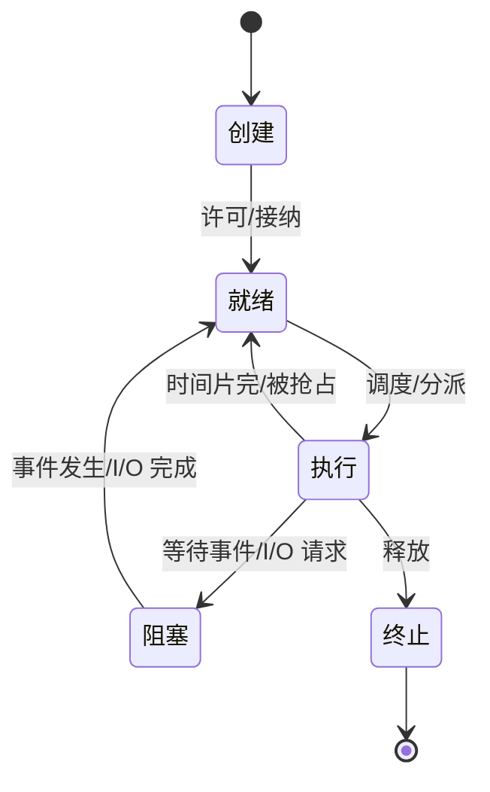

| 转换 | 原因 | 主动性 |
|---|---|---|
| 创建 → 就绪 | 创建工作完成，系统接纳该进程 | OS |
| 就绪 → 执行 | 调度程序选择并分派 CPU | OS |
| 执行 → 就绪 | 时间片用完、被更高优先级进程抢占或系统强制剥夺 | 被动 |
| 执行 → 阻塞 | 运行进程请求 I/O、资源失败或等待事件 | 进程主动 |
| 阻塞 → 就绪 | I/O 完成、资源可用或所等事件发生 | 相关进程/中断唤醒 |
| 执行 → 终止 | 正常结束、异常结束或外界终止 | 进程/OS |

**为什么通常没有“阻塞 → 执行”？** 阻塞解除后，进程只具备运行条件，仍需进入就绪队列竞争 CPU。

**为什么没有“就绪 → 阻塞”？** 就绪进程尚未执行，不能主动发起 I/O 或等待事件；只有处于执行态的进程才能因自身请求而阻塞。

> **课件讨论图解**：程序 A、B 的时间线上，CPU 区段对应执行态；等待设备区段对应阻塞态；所需设备已经完成但尚未再次占用 CPU 的间隔对应就绪态。多个程序的 CPU 和设备区段交错，体现状态不断转换。

### 3. 挂起操作

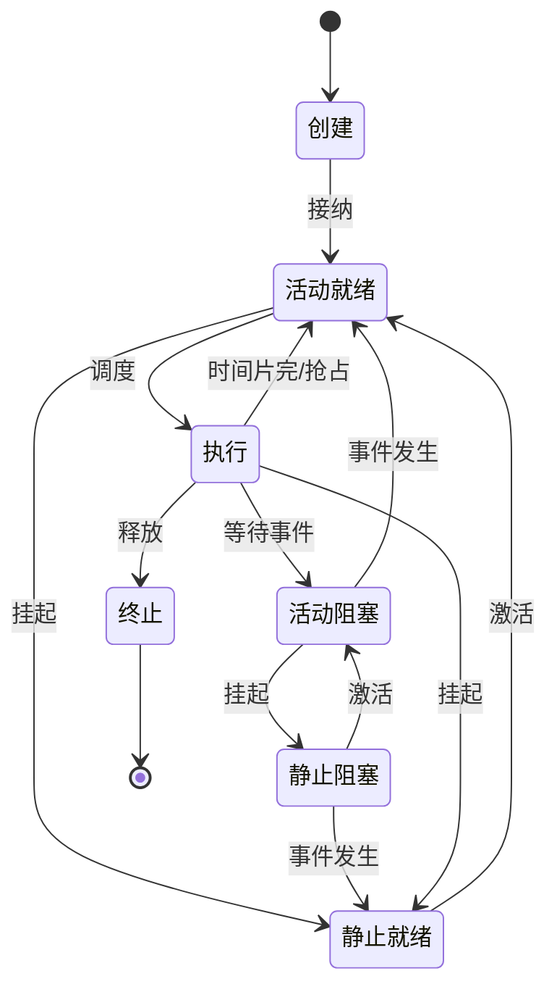

挂起（suspend）使进程暂时停止活动，通常还意味着将其程序和数据换出内存。引入挂起的原因包括：

1. 终端用户请求，例如调试时暂停程序。
2. 父进程请求，便于检查、协调或修改子进程。
3. 系统负荷调节，尤其是实时系统中减轻负荷。
4. 操作系统自身需要，例如检查资源使用或避免故障。

引入挂起后，就绪和阻塞各分成活动、静止两类：

| 状态 | 含义 |
|---|---|
| 活动就绪 | 在内存中，具备运行条件，等待 CPU |
| 静止就绪 | 已挂起/可能换出，具备逻辑运行条件但不能被调度 |
| 活动阻塞 | 在内存中，正等待事件 |
| 静止阻塞 | 已挂起，同时仍等待事件 |

主要转换：

- 活动就绪 → 静止就绪：挂起。
- 活动阻塞 → 静止阻塞：挂起。
- 静止就绪 → 活动就绪：激活。
- 静止阻塞 → 活动阻塞：激活。
- 静止阻塞 → 静止就绪：挂起期间等待的事件已经发生。
- 执行 → 静止就绪：运行进程被挂起；其 CPU 现场先保存。
- 静止就绪经激活后只能回到活动就绪，不能直接执行。

> **完整状态图转写**：创建状态经许可进入活动就绪；活动就绪经调度进入运行；运行因时间片完回到活动就绪，因等待事件进入活动阻塞，因释放进入终止；活动阻塞在事件发生后被唤醒为活动就绪。挂起把活动就绪/活动阻塞变成静止就绪/静止阻塞；激活进行逆转换；静止阻塞即便等到事件，也只是静止就绪，仍须激活才可参与调度。

---

## 四、进程控制块 PCB

### 1. PCB 的概念和作用

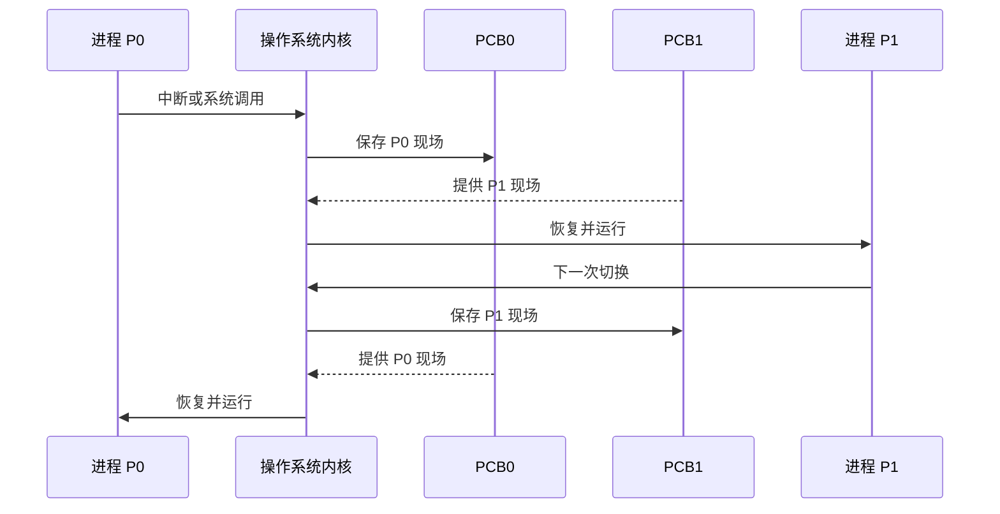

> **定义：进程控制块（Process Control Block，PCB）**
> OS 为每个进程设置的记录型数据结构，保存描述进程当前状况和控制其运行所需的全部信息，与进程一一对应并常驻内存。

PCB 是**进程存在的唯一标志**：创建进程时建立 PCB，OS 依靠 PCB 感知、管理和调度进程；撤销 PCB 后该进程即不再存在。

PCB 的作用：

1. 作为独立运行基本单位的标志。
2. 支持进程间断运行：切出时保存现场，切入时恢复现场。
3. 提供进程管理所需信息。
4. 提供调度与对换所需信息。
5. 支持与其他进程的同步和通信。

> **图示解读（上下文切换）**：进程 $P_0$ 执行时发生中断或系统调用，OS 把处理机状态保存到 $PCB_0$，再从 $PCB_1$ 恢复现场，$P_1$ 开始执行；下一次切换反向进行。保存/恢复期间 CPU 在内核态执行 OS 代码，不属于任一用户进程的有效工作。

### 2. PCB 中的信息

| 类别 | 典型内容 |
|---|---|
| 进程标识信息 | PID、父进程标识 PPID；内部数字标识符；创建者给出的外部标识符与家族关系 |
| 处理机状态信息 | 程序计数器 PC、程序状态字 PSW、通用寄存器、栈指针等 |
| 进程调度信息 | 当前状态、优先级、调度参数、阻塞原因/所等待事件、与对换有关的信息 |
| 进程控制信息 | 程序和数据地址、同步与通信机制、资源清单、链接指针 |

课件给出的简化 PCB 结构：

```c
struct pcb {
    int id;            // 进程序号
    int ra;            // 所需资源 A 的数量
    int rb;            // 所需资源 B 的数量
    int rc;            // 所需资源 C 的数量
    int ntime;         // 所需时间片个数
    int rtime;         // 已运行的时间片个数
    char state;        // 进程状态
    struct pcb *next;  // 链接指针
};
```

### 3. PCB 的组织方式

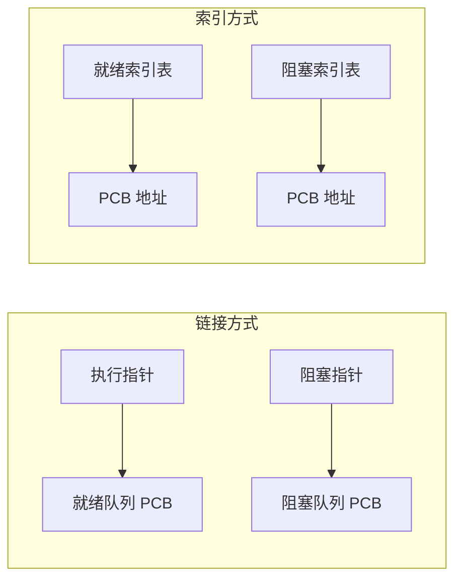

**线性方式**

把全部 PCB 放在连续线性表中，首址位于内存专用区域。

- 优点：实现简单。
- 缺点：查找时可能顺序扫描，效率较低。

**链接方式**

按进程状态建立链表：

- 执行指针指向当前运行进程的 PCB；
- 就绪队列指针指向就绪 PCB 链；
- 可按不同阻塞事件建立多个阻塞 PCB 队列；
- 空闲队列保存尚未分配的 PCB。

**索引方式**

建立就绪索引表、阻塞索引表等，每个表项指向 PCB 池中的一个 PCB；执行指针直接指向当前 PCB。

> **图示解读（索引组织）**：右侧 PCB 池依次存放 PCB1～PCB7；就绪索引表的若干表项指向其中处于就绪态的 PCB，阻塞索引表指向阻塞 PCB。状态表本身只保存索引/指针，PCB 无须物理移动。

---

## 五、进程控制

### 1. 内核与原语

进程控制是进程管理最基本的功能，通常由 OS 内核中的**原语**实现。

- **系统态/核心态/管态**：特权高，可执行全部指令，访问全部寄存器和存储区。
- **用户态/目态**：特权低，只能执行规定的非特权指令，访问指定区域。
- 用户程序运行在用户态，OS 内核运行在系统态。

内核是紧靠硬件、常驻内存的核心软件层，通常包含中断处理、时钟管理、进程调度、设备驱动、公用操作，以及进程、存储器、设备管理中的关键机制。

> **定义：原语（primitive）**
> 由若干机器指令构成、完成特定系统功能并且在执行期间不可分割的一段内核程序。

课件列举的原语包括：创建、撤销、挂起、激活（解挂）、阻塞、唤醒、调度运行、改变优先级。

### 2. 进程创建

**引起创建的事件**

- 用户登录。
- 作业调度。
- 系统为用户提供服务。
- 应用进程主动请求创建子进程。

进程具有层次结构，进程家族可用有向树表示。课件示例中 A 创建 B、C；B 创建 D、E；C 创建 F、G、H；D 创建 I、J；E 创建 K；G 创建 L、M。

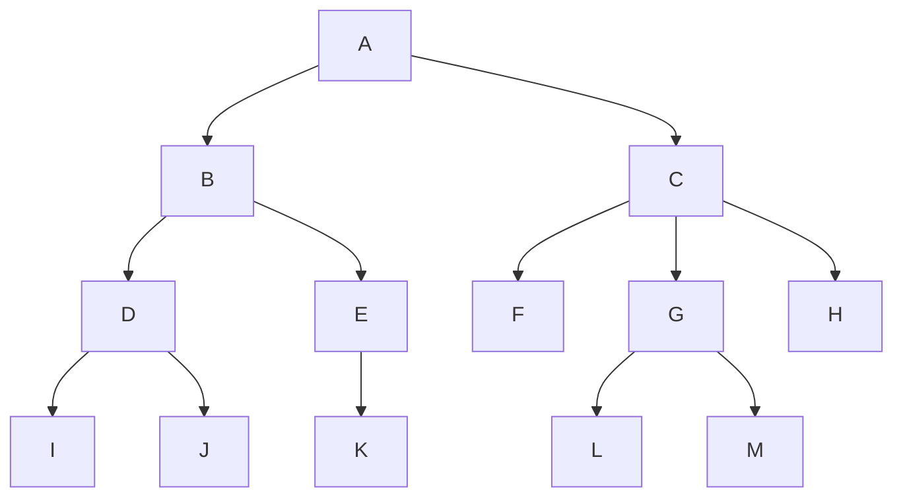

**创建原语的过程**

1. 申请空白 PCB，并获得唯一进程标识符。
2. 为新进程分配运行所需资源，包括内存等。
3. 初始化 PCB：标识、寄存器初值、优先级、状态、父子关系等。
4. 若就绪队列能够接纳，将新 PCB 插入就绪队列。

**UNIX `fork` 示例**

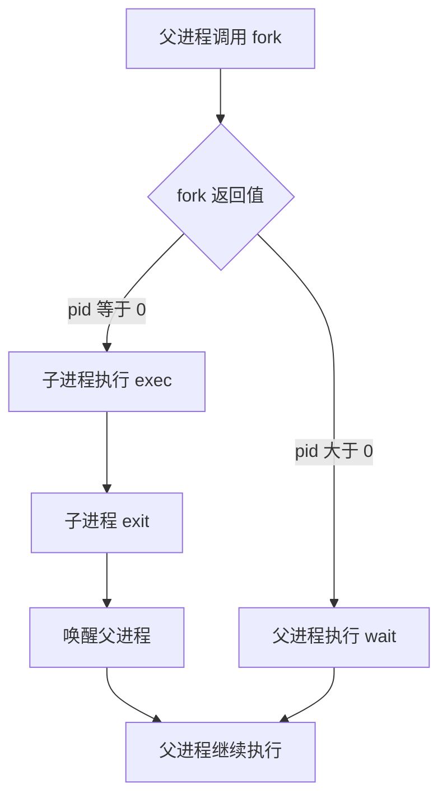

`fork()` 创建子进程，父进程得到大于 0 的子进程号，子进程得到 0；子进程常用 `exec()` 装入新程序，结束时 `exit()`；父进程可用 `wait()` 等待子进程。

### 3. 进程终止

终止原因分三类：

1. **正常结束**：任务完成后主动退出。
2. **异常结束**：越界、非法指令、保护错误、运算错误、I/O 故障等。
3. **外界干预**：OS 或其他有权限的进程终止、父进程结束、父进程请求等。

终止原语的一般过程：

1. 根据被终止进程标识符检索 PCB，并读出状态。
2. 若其处于执行态，立即终止执行，并置重新调度标志。
3. 若系统采用级联终止，终止它的全部子孙进程。
4. 将其全部资源归还父进程或系统。
5. 将 PCB 从所在队列移出并回收。

### 4. 阻塞与唤醒

可能引起阻塞/唤醒的事件：

- 请求共享资源失败。
- 等待某种操作完成。
- 新数据尚未到达。
- 等待新任务到达。

`Block()` 的过程：

1. 运行进程停止执行并保存现场。
2. 状态由执行改为阻塞。
3. PCB 插入相应事件的阻塞队列。
4. 转调度程序选择新的执行进程。

阻塞是运行进程的**主动行为**，因此 `Block()` 只能由当前运行进程自己调用。

`Wakeup()` 的过程：

1. 从相应阻塞队列移出 PCB。
2. 状态由阻塞改为就绪。
3. PCB 插入就绪队列，之后等待调度。

`Block()` 与 `Wakeup()` 必须成对使用；唤醒通常由合作进程或中断处理程序执行。

### 5. 挂起与激活

`Suspend()` 原语的典型过程：

1. 检查目标进程状态。
2. 活动就绪改为静止就绪，活动阻塞改为静止阻塞；若目标正在运行，先保存现场并改为静止就绪。
3. 必要时将地址空间换出，把 PCB 移入相应挂起队列。
4. 若挂起的是当前进程，重新调度。

`Active()` 原语的典型过程：

1. 将目标进程的程序和数据调入内存。
2. 静止就绪改为活动就绪，静止阻塞改为活动阻塞。
3. PCB 移入相应活动队列；若成为活动就绪，可触发调度判断。

---

## 六、进程通信 IPC

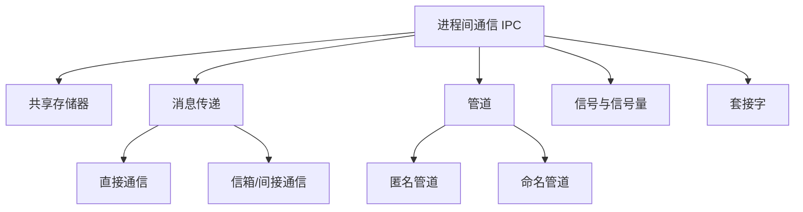

### 1. 协作进程与通信概念

操作系统中的并发进程可分为独立进程和协作进程。允许进程协作的理由有：

1. **信息共享**：多个用户或进程关心同一信息。
2. **提高运算速度**：把任务拆成子任务并行处理。
3. **模块化**：用相互协作的模块构造系统。
4. **方便性**：用户希望同时执行多个任务。

> **定义：进程通信（Inter-Process Communication，IPC）**
> 进程之间为保持联系而进行的信息交换。

| 类型 | 特点 |
|---|---|
| 低级进程通信 | 交换信息量较少，典型用途是同步与互斥；效率较低，且通信细节对用户不透明 |
| 高级进程通信 | 用户可直接使用 OS 的通信命令，方便、高效地传送大量数据 |

课件的 IPC 总览图列出 Linux 常见方式：管道、信号、消息队列、共享内存、信号量和套接字。

### 2. 生产者—消费者通用范例

生产者生成产品，消费者取走产品，中间用缓冲区解耦。共享缓冲区的基本定义：

```c
#define BUFFER_SIZE 10
typedef struct {
    /* item fields */
} item;

item buffer[BUFFER_SIZE];
int in = 0;
int out = 0;
```

环形缓冲区的核心逻辑：

```c
/* 生产者 */
while (true) {
    /* produce an item */
    while ((in + 1) % BUFFER_SIZE == out)
        ;                       // 缓冲区满，忙等
    buffer[in] = item;
    in = (in + 1) % BUFFER_SIZE;
}

/* 消费者 */
while (true) {
    while (in == out)
        ;                       // 缓冲区空，忙等
    item = buffer[out];
    out = (out + 1) % BUFFER_SIZE;
    /* consume item */
}
```

> 课件原 OCR 将“满”条件混入了多余的 `in =` 和 `count` 字样；这里按环形缓冲区含义校正为 `((in + 1) % BUFFER_SIZE == out)`。该示例仍只有忙等，没有解决多个生产者/消费者并发访问时的互斥问题，完整同步机制见后续进程同步章节。

### 3. 共享存储器系统

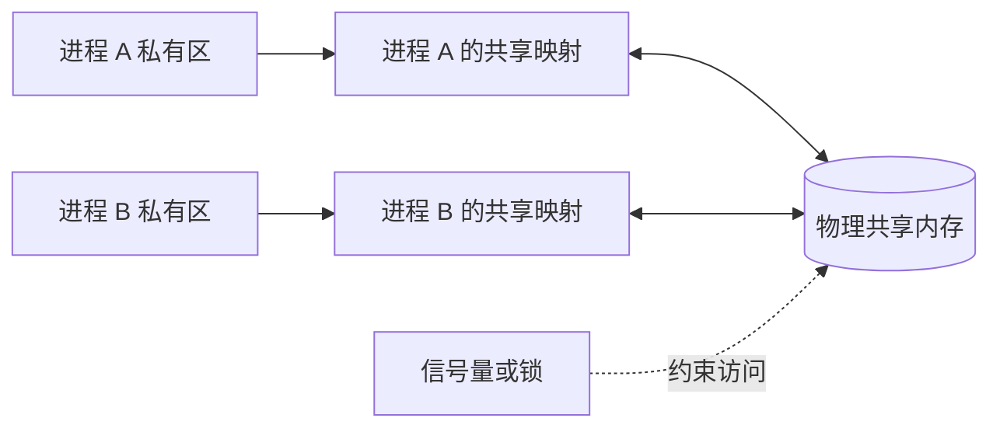

共享存储器（shared memory）的基本思想是：进程通过共同访问某些数据结构或存储区域交换信息。

**基于共享数据结构**

- 例如生产者—消费者问题的有界缓冲区。
- 共享范围和数据结构固定，通信量较小，属于低级通信。
- 通常需要程序员自己处理互斥和同步。

**基于共享存储区**

- OS 在内存中划出或映射一块共享区到多个进程地址空间。
- 各进程对共享区直接读写，可传输大量数据，属于高级通信。
- 建立映射后，数据通常不必反复经内核复制，效率较高。

> **图示解读（消息复制与共享映射）**：消息传递图中，进程 A 的消息先复制到内核，再由内核复制到进程 B，标为步骤 1、2；共享内存图中，A、B 的地址空间共同映射一段 `shared` 区域，两进程直接读写。共享内存减少复制，但同步需另行保证。

### 4. 消息传递系统

消息传递（message passing）以格式化消息为单位，不需要进程共享变量，是应用非常广泛的高级 IPC。

**直接通信**

通信双方显式给出对方标识符：

```text
send(P, message)       // 把消息发送给进程 P
receive(Q, message)    // 接收来自进程 Q 的消息
```

例如：`Send(P2, m1)` 与 `Receive(P1, m1)`。单机系统中，通信链路可由 OS 在调用原语时隐式建立。

若接收者可能接收任何发送者的消息，可写：

```text
Receive(id, message)
```

其中 `id` 在通信完成后返回实际发送进程的标识；打印服务进程接收任意客户的打印请求就是典型应用。

**消息格式**

一个消息通常分为消息头与消息正文：

| 部分 | 内容 |
|---|---|
| 消息头 | 发送进程名、接收进程名、消息长度、类型、编号、发送日期和时间、链指针等控制信息 |
| 消息正文 | 发送方实际传输的数据 |

课件示例记录：

```text
type Msg = record
    msgsender   // 消息发送者
    msgnext     // 下一消息的链指针
    msgsize     // 整个消息的字节数
    msgtext     // 消息正文
end
```

**通信链路**

按建立方式：

- **隐式链路**：发送者直接执行发送原语，系统自动建立，常见于单机系统。
- **显式链路**：通信前执行“建立连接”，使用后显式拆除，常见于计算机网络。

按方向：

- 单向链路：只允许 A 向 B 发送。
- 双向链路：A、B 可相互发送。

按容量：

- 无容量链路：无缓冲区，不能暂存消息，发送和接收必须直接会合。
- 有容量链路：配置一个或多个缓冲区，可暂存消息；缓冲区越多，容量越大。

**发送、接收的同步方式**

1. 发送者阻塞、接收者阻塞：同步会合。
2. 发送者不阻塞、接收者阻塞：常见的异步发送、同步接收。
3. 发送者和接收者均不阻塞：双方均异步，需要检查结果或稍后轮询。

利用直接通信解决生产者—消费者问题时，生产者用 `Send` 发送产品消息，消费者用 `Receive` 取得消息；若尚无产品，消费者阻塞，直到生产者发送消息后被唤醒。

### 5. 信箱通信（间接消息传递）


间接通信不把消息直接交给接收进程，而是放入双方共知的信箱（mailbox）：

```text
send(A, message)       // 发送到信箱 A
receive(A, message)    // 从信箱 A 接收
```

当不同进程共享同一信箱时，通信链路建立。系统需提供信箱创建、撤销、发送和接收原语。信箱既可实现实时通信，也可保存消息以实现非实时通信。

信箱类型：

| 类型 | 创建者与权限 |
|---|---|
| 私用信箱 | 用户进程为自己建立，是该进程的一部分；拥有者可读，其他进程只能发送 |
| 公用信箱 | OS 创建并供核准进程使用；核准进程既可发送，也可读取发给自己的消息 |
| 共享信箱 | 某进程创建并指定共享者；拥有者和共享者均可取走发给自己的消息 |

> **图示解读（邮箱）**：$P_1$ 从左侧把消息放入由多个格子组成的邮箱，$P_2$ 从右侧接收。发送者与接收者不必同时运行，由邮箱缓冲消息并实现间接联系。

**消息缓冲队列机制**

该机制最早由 Hansen 提出并在 RC 4000 系统上实现，后来广泛用于本地进程通信。发送进程用 `Send(message)` 把消息加入接收者的消息缓冲队列，接收进程用 `Receive(message)` 取出；无需共享用户变量，OS 隐藏队列管理与复制细节。

### 6. 管道通信

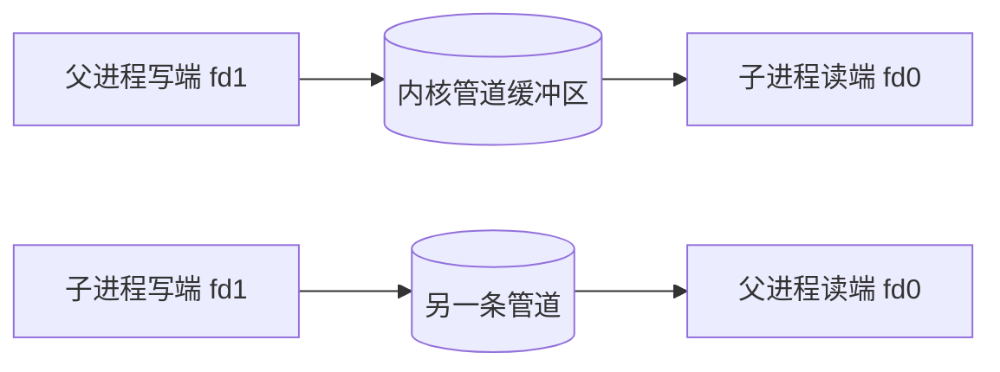

> **定义：管道（pipe）**
> 连接一个读进程与一个写进程、用于通信的共享文件，也称 pipe 文件。

- 写进程以字符流把大量数据写入管道。
- 读进程按先进先出顺序读出。
- 管道首创于 UNIX，因传输有效而被许多系统采用。

管道必须具备三方面协调能力：

1. **互斥**：一个进程读/写管道时，另一个相关进程不能同时破坏性访问。
2. **同步**：管道满时写者睡眠，读者取走数据后唤醒；管道空时读者睡眠，写者写入后唤醒。
3. **确认对方存在**：只有通信对端存在，通信才有意义。

**匿名管道示例**

```c
#define INPUT  0
#define OUTPUT 1

int file_descriptors[2];
pid_t pid;
char buf[256];
int returned_count;

pipe(file_descriptors);              // 创建匿名管道
if ((pid = fork()) == -1) {
    printf("Error in fork\n");
    exit(1);
}

if (pid == 0) {                      // 子进程：写
    close(file_descriptors[INPUT]);
    write(file_descriptors[OUTPUT], "test data", strlen("test data"));
    exit(0);
} else {                             // 父进程：读
    close(file_descriptors[OUTPUT]);
    returned_count = read(file_descriptors[INPUT], buf, sizeof(buf));
    printf("%d bytes received: %s\n", returned_count, buf);
}
```

课件图中父、子进程各保留 `fd(0)`、`fd(1)` 对管道两端的文件描述符；实际使用时，每方关闭不用的一端，形成单向数据流。匿名管道通常用于有亲缘关系的进程。

**命名管道示例**

```c
FILE *in_file, *out_file;
char buf[80];
int count;

in_file = fopen("mypipe", "r");     // 读命名管道
if (in_file == NULL) exit(1);
while ((count = fread(buf, 1, 80, in_file)) > 0)
    printf("received from pipe: %s\n", buf);
fclose(in_file);

out_file = fopen("mypipe", "w");    // 写命名管道
if (out_file == NULL) exit(1);
sprintf(buf, "this is test data for the named pipe example.\n");
fwrite(buf, 1, 80, out_file);
fclose(out_file);
```

命名管道在文件系统中有名字，因此没有亲缘关系的进程也可通过同一名字打开并通信。

### 7. 客户机—服务器通信

**套接字 Socket**

套接字用网络端点标识通信对象：

$$
\boxed{\text{Socket}=\text{IP 地址（主机）}+\text{端口号（主机上的程序）}}
$$

课件示例把主机 X 的 `146.86.5.20:1625` 与 Web 服务器的 `161.25.19.8:80` 连接起来；一次双向网络通信需要一对套接字端点。


**RPC 与 RMI**

- RPC（Remote Procedure Call）：客户进程可调用远程主机上的过程，使用方式类似本地调用；调用细节由存根、消息传输和服务器端处理隐藏。
- RMI（Remote Method Invocation）：Java 中面向对象的远程方法调用机制。

---

## 七、线程的基本概念

### 1. 引入线程的目的

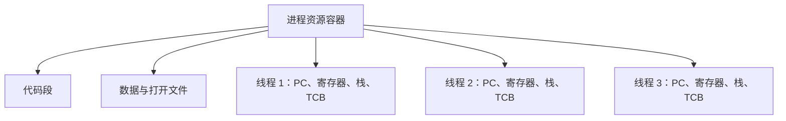

时间脉络：20 世纪 60 年代中期提出进程概念，80 年代中期提出线程概念，90 年代后多处理机系统广泛引入线程。

引入进程的目标是使多个程序并发执行，提高资源利用率和系统吞吐量。传统进程同时具有两个基本属性：

1. 可拥有资源的独立单位。
2. 可独立调度和分派的基本单位。

把这两个属性都交给进程会使创建、撤销和切换开销较大。线程把两者分离：

- **进程**继续作为拥有资源的基本单位，传统进程因此称重型进程。
- **线程**成为调度和分派的基本单位，又称轻型进程。

线程的目标是减少并发执行的时间、空间开销，并进一步提高 OS 的并发性。

> **图示解读（单线程与多线程进程）**：单线程进程拥有一份代码、数据、文件/打开资源、寄存器和栈；多线程进程仍共享一份代码、数据和文件，但每个线程各有寄存器、栈和执行序列。服务器还可在收到客户请求后创建新线程处理请求，主线程立即恢复监听其他客户。

### 2. 线程与进程的比较

| 方面 | 进程 | 线程 |
|---|---|---|
| 调度 | 传统 OS 中是调度单位；引入线程后主要是资源容器 | 引入线程后是 CPU 调度、分派的基本单位 |
| 资源 | 拥有地址空间、文件、设备等资源 | 只拥有独立运行所需的少量资源，共享所属进程资源 |
| 独立性 | 不同进程地址空间隔离，独立性高 | 同一进程线程共享范围大，独立性低 |
| 并发性 | 进程之间可并发 | 同进程的多个线程也可并发，多处理机上还可并行 |
| 创建/撤销开销 | 较大 | 较小 |
| 切换开销 | 常涉及地址空间、页表等切换，较大 | 同进程线程切换通常更快 |
| 同步通信 | 常需 IPC，机制较重 | 共享地址空间，通信较直接，但仍需同步 |

同一进程中线程间切换通常不引起进程切换；若从一个进程中的线程切换到另一个进程中的线程，则同时发生进程上下文切换。

> **图示解读（线程切换）**：时间轴上线程 1 与线程 2 交替运行，斜箭头表示每次保存当前线程寄存器/栈指针并恢复另一线程现场；切换间隔属于调度和上下文切换开销。

### 3. 线程状态与 TCB

线程也有执行、就绪、阻塞三种基本状态，转换规律与进程的三状态模型相同。

> **线程控制块（Thread Control Block，TCB）**保存：线程标识符、一组寄存器、运行状态、优先级、线程专有存储区、信号屏蔽和堆栈指针。

同一进程中的每个线程必须有自己的寄存器现场和栈，否则线程切换后无法从各自调用链继续运行。

---

## 八、线程的实现

### 1. 内核支持线程 KST/KLT

内核支持线程（Kernel-Supported/Kernel-Level Thread）在内核空间实现。每个线程的 TCB 存放在内核中，创建、撤销、阻塞和切换通过系统调用由内核完成。

优点：

1. 多处理机上，内核可把同一进程的多个线程调度到不同处理器并行运行。
2. 一个线程阻塞时，内核仍可调度同一进程或其他进程的线程。
3. 与进程切换相比，线程切换仍较快、开销较小。
4. 内核本身可采用多线程，提高执行速度和效率。

缺点：用户线程的操作需要进入内核，用户态/内核态转换使开销大于纯用户级线程。

### 2. 用户级线程 ULT

用户级线程（User-Level Thread）在用户空间由线程库/运行时管理。TCB 位于用户空间，内核可能只看到一个普通进程。

优点：

1. 线程切换不进入内核，速度快。
2. 调度算法可由应用按自身特点定制。
3. 实现可与 OS 平台相对独立，甚至可运行在不原生支持线程的 OS 上。

缺点：

1. 若某 ULT 执行阻塞系统调用，内核可能阻塞整个进程。
2. 在纯多对一实现中，内核只给进程一个执行实体，多个 ULT 不能利用多个处理器并行。

### 3. 用户级线程与内核线程考研比较

| 比较项 | 用户级线程 ULT | 内核支持线程 KST/KLT |
|---|---|---|
| 内核支持 | 可在不支持线程的 OS 上用线程库实现 | 必须有内核支持 |
| TCB 位置 | 用户空间 | 内核空间 |
| 操作方式 | 用户态线程库完成 | 系统调用进入内核完成 |
| 处理机分配 | 纯 ULT 模型中内核只给进程分配处理机 | 内核可把多个线程分配到多个处理机 |
| 内核调度单位 | 进程；进程内部再由用户线程库调度 | 线程 |
| CPU 时间 | 多个 ULT 分享该进程得到的 CPU 时间 | 各 KLT 可直接获得内核调度时间 |
| 切换速度 | 无须陷入内核，通常快很多 | 需要内核参与，较慢 |
| 阻塞调用 | 一个线程阻塞可能使整个进程阻塞 | 通常只阻塞调用线程 |

### 4. ULT 与 KLT 的映射模型

**多对一模型**

多个用户级线程映射到一个内核线程：

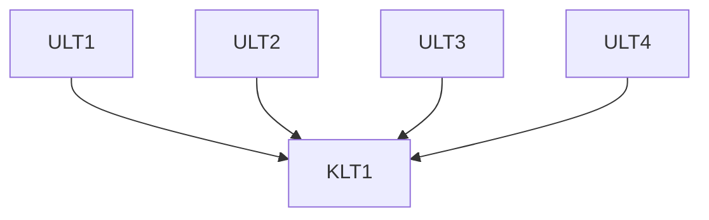

- 线程管理都在用户态，效率高。
- 任一线程发出阻塞系统调用，整个进程阻塞。
- 多个用户线程不能在多个处理器上并行。
- 可用于不支持内核线程的系统。
- 课件例子：Solaris Green Threads、GNU Portable Threads。

**一对一模型**

每个用户级线程映射到一个内核线程：

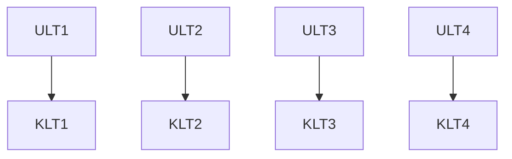

- 一个线程阻塞不妨碍其他线程。
- 并发性优于多对一，并允许在多个处理器上并行。
- 创建一个 ULT 就要创建一个 KLT，内核资源和管理开销较大，系统常限制线程总数。
- 课件例子：Windows 95/98/NT/XP/2000、Linux、Solaris 9 及以后版本、OS/2。

**多对多模型**

把多个用户级线程复用到数量相等或更少的内核线程：

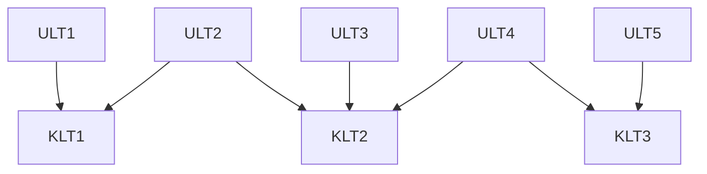

- 兼顾用户态线程管理的灵活性与内核线程的并行、非整体阻塞能力。
- OS 可按处理器数量和负荷创建足够数量的 KLT，不要求每个 ULT 对应一个 KLT。
- 课件例子：Solaris 9 以前版本；带 ThreadFiber 开发包的 Windows NT/2000。

### 5. POSIX 线程基本接口

创建线程：

```c
#include <pthread.h>
typedef void *(func)(void *);

int pthread_create(pthread_t *tid,
                   const pthread_attr_t *attr,
                   func *f,
                   void *arg);
// 成功返回 0，出错返回非 0 错误码
```

线程终止：

```c
#include <pthread.h>
void pthread_exit(void *thread_return);
```

> **勘误**：课件写成 `int pthread_exit(...)` 并称“成功返回 0”，但 POSIX 原型返回 `void`，调用后线程终止，不向调用点返回。线程函数正常 `return` 也可隐式终止线程。

---

## 九、重点辨析与速记

### 1. 程序、进程、线程

```text
程序：静态代码
进程：程序的一次动态执行；资源拥有的基本单位
线程：进程内部的执行流；CPU 调度和分派的基本单位
PCB：OS 识别和控制进程的唯一标志
TCB：保存线程自身执行现场和调度信息
```

### 2. 状态转换核心规则

- 只有**执行态**进程能主动阻塞。
- 阻塞解除只变为**就绪态**，不能直接运行。
- 就绪进程得到 CPU 才变为执行态。
- 时间片用完或被抢占是执行 → 就绪，不是阻塞。
- 挂起表示“暂不参与活动/可能不在内存”；阻塞表示“等待事件”，二者原因不同，可同时存在。

### 3. IPC 选择

| 需求 | 适合机制 |
|---|---|
| 同机大量数据、追求低复制 | 共享内存 + 同步机制 |
| 希望接口简单、隔离好 | 消息传递/消息队列 |
| 有亲缘关系、字符流、单向连接 | 匿名管道 |
| 无亲缘关系但在同机按名字连接 | 命名管道 |
| 跨主机客户机—服务器 | Socket |
| 以本地调用形式访问远程服务 | RPC/RMI |

### 4. 图示信息总括

- 进程状态图展示新建、就绪、运行、阻塞、终止，以及许可、调度、超时、等待、事件发生和释放。
- 扩展状态图增加活动就绪、静止就绪、活动阻塞、静止阻塞，并标出 suspend、active、wakeup。
- PCB 上下文切换图强调“先保存当前 PCB，再恢复下一 PCB”。
- 共享内存图强调共享映射，消息传递图强调经内核两次复制。
- 管道图强调父子进程文件描述符连接同一 pipe，数据先进先出。
- Socket 图强调一条连接由本地、远程两个 `IP:端口` 端点确定。
- 线程结构图强调代码、数据、文件属于进程共享资源，而寄存器和栈属于线程私有现场。
- 多对一、一对一、多对多图的本质是 ULT 与 KLT 的数量和映射关系。
- 课件还含 OS 徽标、章节编号、主页/目录/工具/用户/统计图标、办公场景与问号等装饰图；它们仅用于导航、分节或引出讨论，不承载额外知识点。

---

## 十、作业与课件附录

### 1. 第二次作业

课件列出教材题号：简答题 1～20、综合应用题 21～22，并注明“标黄色为本次作业”。经核对课件原页，**本次黄色题号为简答题 1、2、3、4**。

### 2. 第三次作业

课件同样列出简答题 1～20、综合应用题 21～22。经核对课件原页，**本次黄色题号为简答题 19、综合应用题 21、22**。

### 3. 课程思政：Linux 与 Windows

课件以“长期冷战之后，Linux 与 Windows 究竟谁会更胜一筹”为题讨论操作系统生态：

1. 20 世纪 90 年代初，借鉴 MINIX 和 UNIX 思想的开源 Linux 出现，支持多用户、多任务、多线程和多内核，可运行 UNIX 工具、应用与网络协议，后来形成上百种发行版。
2. Windows 持续完善功能、界面和版本，在 21 世纪初的个人计算机领域占据显著优势；垄断带来的安全与自主可控问题受到各国重视。
3. 2004 年德国慕尼黑政府尝试把办公计算机从 Windows 迁移到 Linux，希望降低成本；约十年后效果不及预期，并一度重新安装 Windows。课件据此指出，单纯采用“Linux + 开源软件”可能面临专业软件开发多、后期维护工作量大和产品化生态不足等风险。
4. 课件的落脚点不是放弃开源或反垄断，而是要求知识分子和科技人才思考如何突破操作系统垄断，发展产业生态并助力自主可控的国产操作系统。

> **复习提示**：该附录反映课件的观点和当时案例叙述；考试重点仍是进程、PCB、状态转换、进程控制、IPC 与线程模型。

---

## 本章小结

| 主题 | 核心结论 |
|---|---|
| 程序与进程 | 程序是静态代码，进程是一次动态执行；PCB 是进程存在和受控的唯一标志 |
| 状态转换 | 运行进程可阻塞或被抢占；阻塞解除只进入就绪态；挂起与等待事件是两个不同维度 |
| 进程控制 | 创建、终止、阻塞、唤醒、挂起和激活都由内核原语完成，并伴随 PCB 与队列更新 |
| 进程通信 | 共享内存适合大数据低复制；消息、信箱和管道更强调隔离；Socket/RPC 支持客户机—服务器通信 |
| 进程与线程 | 进程是资源拥有单位，线程是 CPU 调度单位；同进程线程共享资源但各有寄存器与栈 |
| 线程实现 | ULT 管理快但可能整体阻塞；KLT 可并行但内核开销大；多对多模型折中二者 |

## 逐图覆盖审计

以下编号按两份 MinerU `full.md` 中图片引用的出现顺序排列，连续区间覆盖全部引用；正文不保留图片文件或路径。

| 来源 | 引用序号 | 核查结果与知识库落点 |
|---|---:|---|
| 第 2 章前半 | 1 | 课程导航树，课程章节结构由总索引承担 |
| 第 2 章前半 | 2～4 | 人物史料、冯·诺依曼体系与并行时间图；体系重构为 Mermaid，史料文字化 |
| 第 2 章前半 | 5～8 | OS 圆环模板标志，无知识语义，已作装饰说明 |
| 第 2 章前半 | 9～16 | 顺序执行、九结点前趋图、循环反例与并发流水图；以公式和 Mermaid 重构 |
| 第 2 章前半 | 17～21 | 场景照片、CPU/I/O 时间线及进程交替图；数值转为原生表格，调度关系文字化 |
| 第 2 章前半 | 22～23 | MULTICS 人物及 GE 645 照片；历史信息文字化 |
| 第 2 章前半 | 24～32 | 模板图标、Windows 任务管理器、SUSE `ps` 与窗口截图；有效字段转为原生表格 |
| 第 2 章前半 | 33～43 | OS 标志、基本状态图、状态转换图、讨论问号及并发时间线；状态关系重构为 Mermaid |
| 第 2 章前半 | 44～47 | 活动/静止状态与完整挂起状态图；重构为 Mermaid 状态图 |
| 第 2 章前半 | 48～53 | 用户、工具、增长、办公场景及章节编号模板；无新增技术语义，已文字说明 |
| 第 2 章前半 | 54～60 | 基本状态图、进程控制、PCB 队列、地址空间、进程树与 Unix 生命周期；以 Mermaid、表格和文字重构 |
| 第 2 章前半 | 61～67 | 章节编号及主页/图层模板；无知识语义，已作装饰说明 |
| 第 2 章后半 | 1～5 | 问号、时间线、状态转换、生命周期与导航树；状态及控制关系在正文重构 |
| 第 2 章后半 | 6～9 | 圆形、主页、图层、锁模板图标；无新增知识语义 |
| 第 2 章后半 | 10～16 | 共享内存映射、内核参与方式及生产者—消费者框图；以 Mermaid、代码和文字重构 |
| 第 2 章后半 | 17～24 | 增长、茶壶、信箱、用户、工具模板以及父子管道、箭头；信箱和管道重构为 Mermaid |
| 第 2 章后半 | 25～33 | Socket 拓扑、IPC 类型、单线程/多线程进程结构及模板；技术关系重构为 Mermaid 与文字 |
| 第 2 章后半 | 34～49 | 章节编号、线程上下文切换、模板图标与 OS 标志；切换过程文字化 |
| 第 2 章后半 | 50～57 | 工作场景照片和章节编号模板；无新增技术语义 |
| 第 2 章后半 | 58～68 | 多对一、一对一、多对多线程模型及其章节编号/导航图标；三种模型重构为 Mermaid |
| 第 2 章后半 | 69～71 | 空白模板圆形与本章知识结构图；结构内容落实在正文目录及章节小结 |

审计结论：前半 67 个、后半 71 个，共 **138 个图片引用**已逐一核查；技术图均已转换为 Obsidian 原生 Mermaid、原生管道表格、LaTeX、代码块或完整文字描述，装饰图亦已说明。


