# 3.1 处理机调度与死锁

> 本笔记整合第 3 章前、中、后三份课件，覆盖处理机三级调度、常用与实时调度算法、Linux 调度、死锁的产生、预防、避免、检测和解除。课件引用的 218 幅知识导图、流程图、甘特图、资源分配图、截图和装饰图均已逐幅核查并转写为可检索文字，正文不再依赖原图。

## 主要内容

- 高级、中级和低级调度及其机制
- 调度目标、性能指标和抢占方式
- FCFS、SJF/SRTF、优先级、HRRN、RR、多级队列与多级反馈队列
- 实时调度、EDF、LLF、优先级倒置和多处理器调度
- Linux 的 O(1) 调度器、CFS 与实时调度策略
- 死锁定义、资源分类、必要条件和资源分配图
- 死锁预防、避免、银行家算法、检测与解除
- 课件例题、练习与第 4～6 次作业要求

课件首尾的知识导图可重构为以下原生结构图；它同时给出本章两条主线及各节依赖关系。

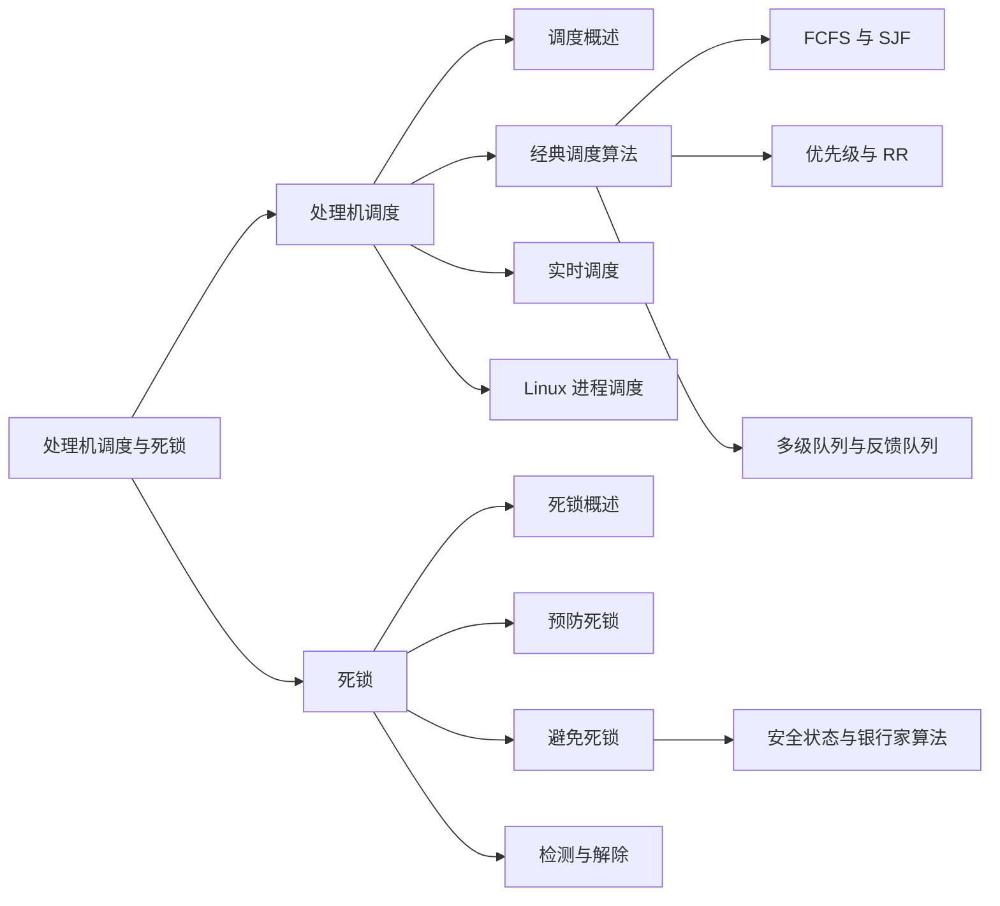

---

## 一、处理机调度概述

### 1. 调度的作用与层次

在多道程序系统中，一个作业从提交到执行通常要经历多级调度。系统吞吐量、周转时间、响应及时性和资源利用率都在很大程度上取决于调度，因此调度是多道程序系统的关键。

| 层次 | 别名 | 调度对象 | 核心任务 | 典型范围 | 频率 / 开销 |
|---|---|---|---|---|---|
| 高级调度 | 长程调度、作业调度、宏观调度 | 作业 | 从外存后备队列选择作业调入内存，创建进程、分配资源并送入就绪队列 | 多道批处理系统 | 频率低、运行时间长、算法复杂 |
| 中级调度 | 中程调度、内存调度 | 暂时不能运行的进程 | 在内外存之间换入换出，调整内存中的进程位置和状态 | 对换、短期负荷调整 | 频率中等、时间较短、复杂度中等 |
| 低级调度 | 短程调度、进程调度、微观调度 | 就绪进程 | 决定哪个就绪进程获得 CPU | 批处理、分时、实时系统 | 频率高、时间短、算法应简单 |

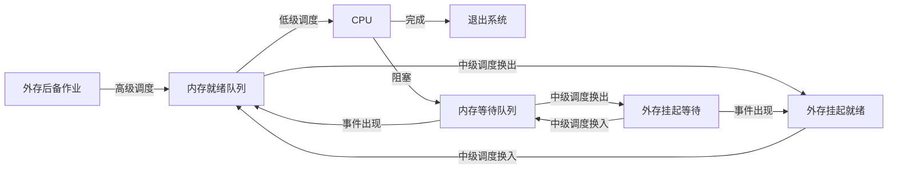

图中高级调度控制进入内存的作业数量，中级调度调节内存压力，低级调度则在最短时间尺度上决定 CPU 的归属。

高级调度必须回答两个问题：

1. **接纳多少作业**：由多道程序度决定；过少会降低资源利用率，过多会降低服务质量。
2. **接纳哪些作业**：可用 FCFS、SJF、优先级或 HRRN 等算法选择。

其一般步骤是：依据 JCB 审查资源需求 → 按算法选取后备作业 → 创建进程并分配资源 → 插入就绪队列。

> **图片转写（调度层次图）**：图中作业从外存后备队列经高级调度进入内存就绪队列；中级调度在内存与外存间移动挂起/就绪进程；低级调度在就绪队列与 CPU 之间频繁选择进程。另一幅完整队列图还画出挂起就绪、挂起等待和等待队列，事件出现使等待进程转就绪，超时或调度使 CPU 与就绪队列之间切换。

### 2. 作业、作业步与 JCB

**作业（Job）**是用户在一次算题或事务处理中要求计算机完成的工作集合。在批处理系统中，它以作业为单位从外存调入内存，内容不只是“程序 + 数据”，还包括用于控制运行的**作业说明书**。作业运行期间可分成若干相互独立又相互关联的顺序加工步骤，每一步称为**作业步**，例如编译、装入和链接。

**作业控制块（JCB）**是作业在系统中存在的唯一标志。作业注册程序在作业提交后建立 JCB 并放入后备队列。JCB 的信息来自作业控制卡/说明书及运行中的动态记录，主要包括：

| 类别 | 典型字段 |
|---|---|
| 标识 | 作业名、用户账户 |
| 资源要求 | 预计运行时间、最迟完成时间、内存量、外设类型与数量、文件量和输出量 |
| 资源使用情况 | 进入系统时间、开始运行时间、已运行时间、内存地址、外设台号 |
| 调度属性 | 控制方式、作业类型、优先级、状态 |

作业经历三个阶段和状态：收容阶段为**后备状态**，运行阶段为**运行状态**，完成阶段为**完成状态**。


> **图片转写（作业示意图）**：课件以成叠的 `$JOB`、`$FORTRAN`、`$LOAD`、`$RUN`、数据与 `$END` 卡片表示“程序 + 数据 + 作业说明书”；硬盘表示外存作业，内存条表示进程，CPU 表示执行。扩展图补上“完成阶段”，说明作业经调度、装入、运行后形成结果并退出。硬盘、内存条、CPU、思考人物、办公室照片和茶壶仅用于类比或章节装饰，不增加算法约束。

### 3. 中级调度与对换

中级调度为提高内存利用率和系统吞吐量，把暂时不能运行的进程移到外存，状态变为**就绪驻外存/挂起**；当进程具备条件且内存有空闲时再换入内存，改为就绪态并进入就绪队列。这就是对换功能，可短期调整系统负荷、平滑系统运行。

课件中的 Windows“性能选项”截图显示：可选择优先优化“程序”或“后台服务”，分页文件是硬盘上被 Windows 当作 RAM 使用的区域，示例总分页文件大小为 `6809 MB`。该截图是中级调度/虚拟内存的系统实例，不是新的调度算法。

### 4. 进程调度任务与机制

进程调度完成三项任务：

1. 保存当前进程的处理机现场，如 PC 和通用寄存器，写入该进程 PCB。
2. 按调度算法从就绪队列挑选进程，把其状态改为运行态。
3. 恢复所选进程现场，把 CPU 控制权交给它，使其从上次中断处继续运行。

调度机构包括：

1. **排队器**：按规定方式将就绪进程插入相应队列。
2. **调度器/选择器**：按算法确定下一个运行进程。
3. **分派器（dispatcher）**：移出被选进程，执行上下文切换、转入用户态并启动进程。
4. **上下文切换器**：保存旧进程上下文、装入分派程序上下文，再装入新进程上下文。

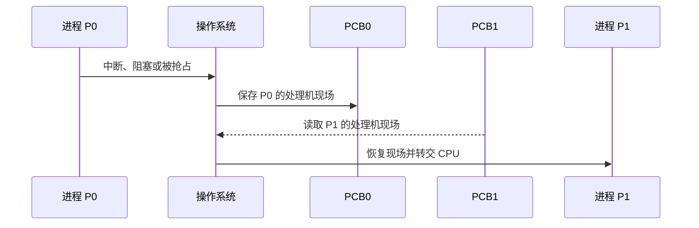


> **图片转写（上下文切换与调度器结构）**：时间轴上先把 $P_0$ 信息保存到 $PCB_0$，再从 $PCB_1$ 恢复 $P_1$ 信息，期间 CPU 执行的是操作系统代码。结构图中，就绪进程进入排队器和就绪队列，选择器将进程交给上下文切换器，后者连接 CPU；运行进程退出、阻塞或被抢占后又回到相应路径。工具、增长趋势、主页、分层与开锁图标均是版式导航图标，无额外技术信息。

### 5. 调度方式与时机

| 方式 | 含义 | 典型触发 |
|---|---|---|
| 非抢占式 | CPU 一旦分给某进程，就让其运行到完成或因事件阻塞，不允许别的进程强行夺取 | 进程完成、主动阻塞 |
| 抢占式 | 调度程序可暂停当前进程，把 CPU 重新分给另一进程；现代 OS 广泛采用 | 更高优先级进程到达、时间片耗尽、时钟中断 |

进程运行在 **CPU burst** 与 **I/O burst** 之间交替。课件的区间时间曲线显示：短 CPU 区间出现频率最高，区间越长频率迅速下降，约到 8 ms 后接近零；这说明许多交互/I/O 型进程具有大量短 CPU 区间。

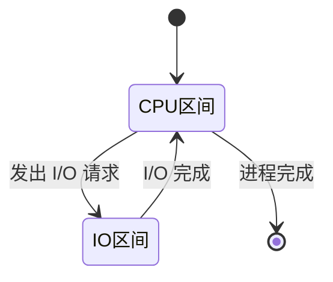

---

## 二、调度准则与评价指标

### 1. 系统目标

普遍目标包括资源利用率、公平性、平衡性、策略强制执行，以及最大 CPU 利用率和吞吐量、最小周转时间、等待时间与响应时间。

$$
U_{CPU}=\frac{\text{CPU 有效工作时间}}{\text{CPU 有效工作时间}+\text{CPU 空闲等待时间}}
$$

| 系统类型 | 主要目标 |
|---|---|
| 批处理系统 | 平均周转时间短、吞吐量高、处理机利用率高 |
| 分时系统 | 响应时间快、响应速度与请求复杂度相适应（均衡性） |
| 实时系统 | 保证截止时间、行为可预测 |

### 2. 时间指标

设作业 $i$ 的到达时间为 $A_i$，首次运行时间为 $S_i$，完成时间为 $F_i$，实际服务时间为 $T_{s_i}$，则：

$$
T_i=F_i-A_i,\qquad W_i=T_i-T_{s_i},\qquad R_i=S_i-A_i
$$

- **周转时间 $T_i$**：从提交到完成的时间。
- **等待时间 $W_i$**：进程在就绪队列中等待调度的时间总和。
- **响应时间 $R_i$**：用户提交请求到系统首次产生响应的时间；包括请求传给处理机、处理请求、结果返回终端三部分。
- **带权周转时间**：$T_i/T_{s_i}$。
- **吞吐量**：单位时间完成的作业数。

平均周转时间与平均带权周转时间为：

$$
\bar T=\frac1n\sum_{i=1}^{n}T_i,\qquad
\bar T_w=\frac1n\sum_{i=1}^{n}\frac{T_i}{T_{s_i}}
$$

> **课件勘误**：原课件把平均带权周转时间公式左侧写作 $W$，紧接着又写“吞吐量”，容易混淆；吞吐量并不是该比值的平均。

实时系统的**截止时间**是任务必须开始执行的最迟时刻，或必须完成的最迟时刻。

---

## 三、经典调度算法

### 1. 算法总览

| 算法 | 选择依据 | 抢占性 | 优点 | 主要问题 |
|---|---|---|---|---|
| FCFS | 到达先后 | 非抢占 | 简单、公平于到达顺序 | 护航效应；短作业和 I/O 型作业不利 |
| SJF | 最短预计服务时间 | 可非抢占 | 指定进程集合上平均等待时间最短 | 难准确估计时长；长作业饥饿；不顾紧迫性 |
| SRTF | 最短剩余时间 | 抢占 | SJF 的抢占版本 | 切换开销，仍可能使长作业饥饿 |
| PR | 最高优先级 | 可抢占或非抢占 | 能体现紧迫性、灵活通用 | 低优先级进程饥饿 |
| HRRN | 最大响应比 | 非抢占作业调度 | 兼顾等待与服务时间 | 每次调度都要计算响应比 |
| RR | 就绪队列轮转 | 时间片抢占 | 响应快、机会均等 | 时间片过小导致频繁切换 |
| 多级队列 | 固定队列类别 | 依队列定义 | 适合不同进程类型 | 固定优先级可使低队列饥饿 |
| 多级反馈队列 | 动态升降队列 | 通常抢占 | 无需预知服务时间，兼顾多类作业 | 参数多、实现复杂 |

### 2. FCFS

FCFS 按到达顺序调度
，既可用于作业也可用于进程，本质上是非抢占式。它有利于长作业和 CPU 繁忙型作业，不利于短作业及 I/O 繁忙型作业。

**例 1**：$J_1,J_2,J_3$ 同时按该顺序到达，服务时间为 24、3、3。

```text
0 ── J1 ── 24 ─ J2 ─ 27 ─ J3 ─ 30
```

$$
\bar W=\frac{0+24+27}{3}=17,\qquad
\bar T=\frac{24+27+30}{3}=27
$$

若到达顺序改为 $P_2,P_3,P_1$，甘特图为 `P2:0–3 → P3:3–6 → P1:6–30`，平均等待时间为 3，平均周转时间为 13。两图说明**短进程先到会显著改善 FCFS 的均值，但算法本身并未识别作业长短**。

**例 2**：A、B、C、D 的到达时间为 0、1、2、3，服务时间为 4、5、2、4，FCFS 为 `A(0–4) → B(4–9) → C(9–11) → D(11–15)`。

| 进程 | 完成 | 周转 | 带权周转 |
|---|---:|---:|---:|
| A | 4 | 4 | 1.00 |
| B | 9 | 8 | 1.60 |
| C | 11 | 9 | 4.50 |
| D | 15 | 12 | 3.00 |
| 平均 | — | 8.25 | 2.525 |

### 3. SJF 与 SRTF

SJF 对作业从后备队列中选预计运行时间最短者；对进程则选择下一个 CPU 区间最短者。若新到进程的预计运行时间小于当前进程的**剩余时间**，立即抢占，便是 SRTF。

**例**：$J_1(到达0,服务7)$、$J_2(2,4)$、$J_3(4,1)$、$J_4(5,4)$。

- 非抢占 SJF：`J1:0–7 → J3:7–8 → J2:8–12 → J4:12–16`，平均等待时间 4，平均周转时间 8。
- 抢占 SRTF：`P1:0–2 → P2:2–4 → P3:4–5 → P2:5–7 → P4:7–11 → P1:11–16`，平均等待时间 3，平均周转时间 7。

另一组 A～E 的到达时间为 0、1、2、3、4，服务时间为 4、3、5、2、4：

| 算法 | 执行顺序 | 平均周转 | 平均带权周转 |
|---|---|---:|---:|
| FCFS | A-B-C-D-E | 9.00 | 2.80 |
| 非抢占 SJF | A-D-B-E-C | 8.00 | 约 2.12 |

### 4. 优先级与 HRRN

优先级调度可用于作业和进程，可抢占也可非抢占。课件默认**优先数越小，优先级越高**。

- 静态优先级在创建时确定，运行期不变，简单且开销小，但低优先级进程可能长期得不到调度。
- 动态优先级随运行进度或等待时间变化。对长期等待进程逐渐提高优先级称为**老化**，可缓解饥饿。

**例**：五个进程均在 0 到达，`P1(优先级3,运行10)`、`P2(1,1)`、`P3(3,2)`、`P4(4,1)`、`P5(2,5)`。非抢占式顺序为 `P2 → P5 → P1 → P3 → P4`，平均等待时间 8.2，平均周转时间 12；同优先级的 $P_1,P_3$ 按原有队列次序处理。

HRRN 的响应比为：

$$
R_p=\frac{\text{等待时间}+\text{要求服务时间}}{\text{要求服务时间}}
=1+\frac{\text{等待时间}}{\text{要求服务时间}}
$$

等待时间相同时类似 SJF；服务时间相同时类似 FCFS；长作业的响应比会随等待增长，因此也能得到服务。

**例**：$J_1(8{:}00,2h)$、$J_2(8{:}30,1h)$、$J_3(9{:}30,0.25h)$，9:40 开始调度。9:40 时 $J_2$ 响应比最高，先运行；10:40 时 $J_3$ 响应比高于 $J_1$，所以顺序为 **$J_2 → J_3 → J_1$**。

### 5. 时间片轮转 RR

RR 专为分时系统设计：按 FIFO 维护就绪队列，每个进程最多执行一个时间片 $q$；时间片耗尽即被抢占并插入队尾，若在片内完成或阻塞则立即放弃剩余时间。若有 $n$ 个就绪进程，则每个进程约得到 $1/n$ 的 CPU，单次等待通常不超过 $(n-1)q$。

- $q$ 很大时退化为 FCFS。
- $q$ 太小时上下文切换过多。
- 课件经验准则：$q/10$ 应大于一次进程上下文切换时间。
- 选取 $q$ 还应考虑响应要求、就绪进程数和处理能力。

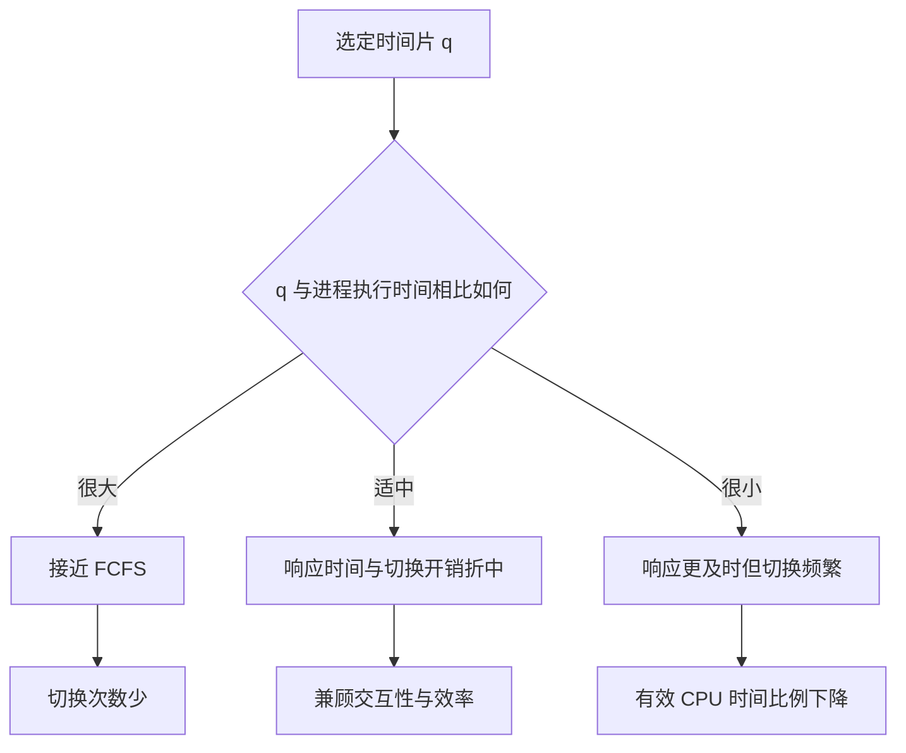

课件以服务时间为 10 的单进程说明：$q=12$ 时切换 0 次，$q=6$ 时切换 1 次，$q=1$ 时切换 9 次；另一曲线显示本例平均周转时间随 $q$ 增大先波动后趋于稳定，不能据此推出所有工作负载都有相同的最优时间片。

**例 1**：$q=20$，$P_1,P_2,P_3,P_4$ 服务时间为 23、17、46、24。

```text
P1 0–20 | P2 20–37 | P3 37–57 | P4 57–77 |
P1 77–80 | P3 80–100 | P4 100–104 | P3 104–110
```

平均等待时间为 55.25，平均响应时间为 28.5。RR 的平均周转时间通常比 SJF 长，但响应时间更短。

**例 2**：A～E 到达时间 0、1、2、3、4，服务时间 4、3、4、2、4。

| 时间片 | 完成时间 A/B/C/D/E | 平均周转 | 平均带权周转 |
|---|---|---:|---:|
| $q=1$ | 15 / 12 / 16 / 9 / 17 | 11.8 | 3.43 |
| $q=4$ | 4 / 7 / 11 / 13 / 17 | 8.4 | 2.7 |

> **图片转写（RR 图组）**：三条长度为 10 的时间轴分别展示 $q\ge10$ 时 0 次切换、$q=6$ 时 1 次切换、$q=1$ 时 9 次切换；另一曲线以 $P_1=6,P_2=3,P_3=1,P_4=7$ 展示平均周转时间随 $q=1\ldots7$ 并非单调变化。英文 *The Little Lost Robin* 封面、Robin Li 照片和古代环形签名文书只用于解释“round-robin”轮流/循环的词源与谐音，不引入新规则。

### 6. 多级队列与多级反馈队列

**多级队列**把单一就绪队列永久划成多个，例如系统进程、交互进程、交互编辑进程、批处理进程、学生进程，优先级依次降低；前台可用 RR，后台可用 FCFS。队列间可采用：

1. 固定优先级：高队列为空后才运行低队列，低队列可能饥饿。
2. 按比例分配 CPU：例如 80% 给前台 RR，20% 给后台 FCFS。

**多级反馈队列（MLFQ/FB）**允许进程在队列间移动，不必预先知道服务时间。完整定义需给出队列数、各队列算法、升降级条件及新进程初始队列。典型实现为高优先级队列时间片小、低优先级队列时间片大，$s_1<s_2<\cdots<s_n$；新进程进入最高队列，用完整时间片仍未完成就降级，等待过久可升级。最后一级常用 RR，部分课件图把前若干队列画作 FCFS 队列。

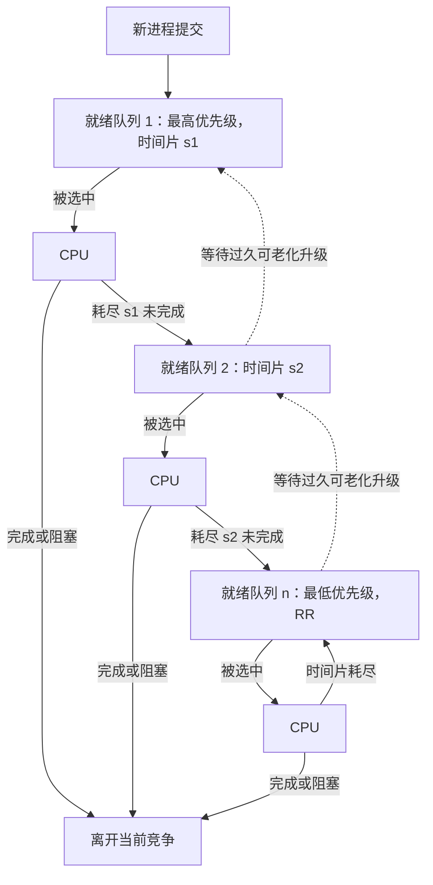

高优先级队列始终先于低优先级队列获得 CPU，且 $s_1<s_2<\cdots<s_n$。课件的另一版实现用 $q=8$、$q=16$、最终 FCFS 三层说明“逐级下降”；二者表达的共同原则是短交互作业优先，长作业逐步转入较低队列。

> **图片转写（MLFQ 流程）**：图中第 1 级时间片为 8，第 2 级为 16，最后一级为 FCFS；进程从上级耗尽时间片后逐级下降。另一图把就绪队列 1、2、…、$n$ 分别连到 CPU，并标出时间片 $s_1<s_2<\cdots<s_n$。这表达的是“短/交互作业优先、长作业逐渐获得更长时间片”，不是每级配置独立物理 CPU。

若进程需要 100 个基本时间片 $t$，各级配额依次为 $1,2,4,8,16,32,64$，最后一级只需运行 37 个 $t$ 即完成，共调度 7 次；相比 $q=1$ 的单纯 RR 节省 93 次切换。

**练习**：A～E 到达时间为 0、2、4、6、8，服务时间为 3、6、4、5、2。

| 方案 | A/B/C/D/E 完成时间 | 平均周转 | 平均带权周转 |
|---|---|---:|---:|
| FB，固定 $q=1$ | 4 / 20 / 16 / 19 / 11 | 10.00 | 2.29 |
| FB，$q=2^i$ | 4 / 17 / 18 / 20 / 14 | 10.60 | 2.63 |

课件两幅 0～20 的甘特图分别逐格画出固定 $q=1$ 与逐级增大 $q=2^i$ 时 A～E 的运行区间。终端型短作业常在第 1 队列完成；短批处理作业通常在前三队列完成；长批处理作业逐级下降后在末级轮转。

### 7. 公平调度

- **保证调度**保证性能份额而非保证优先运行，例如 $n$ 个进程各获得约 $1/n$ 的 CPU 时间。
- **公平分享调度**面向用户分配份额。若用户 1 有 A、B、C、D，用户 2 只有 E，为使两位用户各获一半 CPU，可强制序列 `AEBECDEAEBECDE`。

---

## 四、实时、多处理器与 Linux 调度

### 1. 实时调度条件

实时任务都有截止时间，可分为硬实时（HRT）和软实时（SRT）。实时调度应具备：

1. 提供就绪时间、开始/完成截止时间、处理时间、资源要求和优先级。
2. 处理能力足够。对单处理器上的 $m$ 个周期 HRT 任务，至少满足

$$
\sum_{i=1}^{m}\frac{C_i}{P_i}\le1
$$

3. 通常采用抢占机制；若小型系统能预知开始截止时间，也可非抢占，但任务应短并在离开关键区后及时阻塞让出 CPU。
4. 具备快速中断响应和快速任务分派能力，尽量缩短关中断区间和功能单元。

| 实时调度方式 | 典型响应时间 | 适用范围 |
|---|---|---|
| 非抢占轮转 | 数秒至数十秒 | 要求不严格的实时控制 |
| 非抢占优先级 | 数秒至数百毫秒 | 有一定实时要求 |
| 时钟中断触发的抢占优先级 | 几十毫秒至几毫秒 | 大多数实时系统 |
| 立即抢占优先级 | 几毫秒至几百微秒 | 严格时间要求 |

### 2. EDF 与 LLF

**EDF（最早截止时间优先）**按截止时间动态确定优先级，截止越早越优先；既可抢占也可非抢占。非抢占 EDF 常用于非周期实时任务，抢占 EDF 常用于周期实时任务。

**非抢占 EDF 例**：A、B、C、D 的到达时间为 0、2、3、6，开始截止时间为 2、15、6、10，执行时间为 4、5、5、4。运行顺序为 `A:0–4 → C:4–9 → D:9–13 → B:13–18`。

> **图片转写（抢占 EDF 时间图）**：周期任务 A 每 20 ms 到达并执行约 10 ms，任务 B 每 50 ms 到达并执行约 25 ms。正确时间图在 A 的每个更早截止期到来时抢占 B；图中另外两条“错过”时间线说明若只按固定连续执行而不在新截止期到来时重排，A 或 B 会越过截止线。

**LLF（最低松弛度优先）**通常用于抢占式调度：

$$
L=\text{必须完成时间}-\text{剩余运行时间}-\text{当前时间}
$$

松弛度越小，任务越紧急、优先级越高。课件例中 A 每 20 ms 执行 10 ms，B 每 50 ms 执行 25 ms，处理器利用率恰为 $10/20+25/50=1$；时间图按各时刻的剩余松弛度在 A、B 间切换，以刚好满足两者截止期。

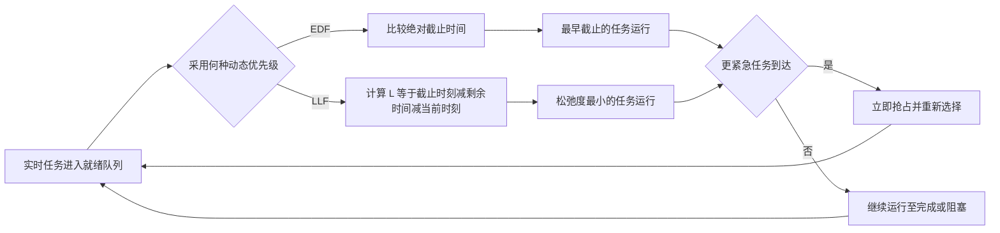

### 3. 优先级倒置

在抢占式优先级系统中，低优先级进程持有高优先级进程需要的资源时，高优先级进程会被间接延迟；若中优先级进程不断抢占低优先级进程，延迟会进一步放大，这就是**优先级倒置**。解决思路：

1. 在低优先级进程执行特定关键区时暂不允许抢占。
2. 采用**优先级继承**：持锁的低优先级进程临时继承等待者的高优先级，释放资源后恢复。

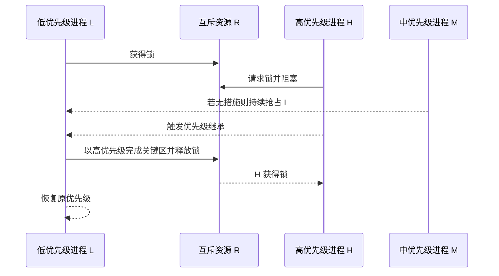

### 4. 多处理器与 Linux

对称多处理（SMP）中每个处理器可自调度，所有处理器共享就绪队列，或各自维护私有就绪队列。应考虑**处理器亲和性**：尽量让进程继续在原 CPU 上执行，以利用其缓存热数据。

Linux 2.5～2.6.23 前的调度器可在与任务数无关的 $O(1)$ 时间完成选择，是抢占式优先级算法，实时优先级范围 0～99，普通任务映射到 100～140。课件图以 0 为最高、140 为最低，并示意普通任务时间片从高优先级约 200 ms 降至低优先级约 10 ms。

现代默认普通调度采用 **CFS（完全公平调度器）**。其核心是让可运行任务的虚拟运行时间趋于公平：

$$
v_{runtime}=\text{实际运行时间}\times\frac{NICE\_0\_LOAD}{\text{任务权重}}
$$

权重越高，虚拟时间增长越慢，因而获得更多实际 CPU 时间。课件时间图显示 CPU 总选择虚拟运行时间较小的任务，使多个任务交替推进。


Linux 基于调度器类组织不同策略，总调度器按类优先级依次选择，默认顺序为 `Stop_Task > Real_Time > Fair > Idle_Task`。

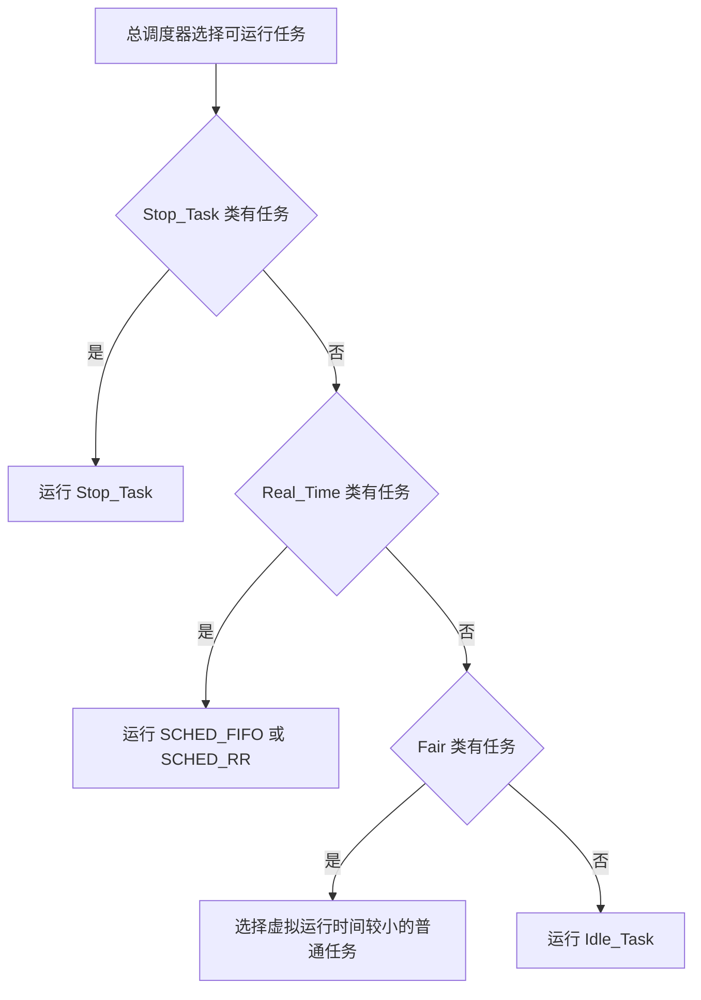

- 普通进程：`SCHED_NORMAL`；nice 值为 -20～+19，值越小优先级越高。
- 实时 `SCHED_FIFO`：进程只要可执行就一直运行，直到阻塞或主动让出 CPU。
- 实时 `SCHED_RR`：类似 FIFO，但时间片耗尽后必须重新参与调度。

---

## 五、死锁基础

### 1. 定义与直观例子

> **死锁**：一组进程中的每个进程都持有资源，又等待只能由该组中其他进程引发的事件或释放的资源；若无外力，所有进程都永远无法推进。

典型例子是系统有两台磁盘驱动器，$P_1,P_2$ 各占一台又各需另一台。桥梁图把单行桥段视为不可共享资源：两方向车辆各占部分桥段并等待对方释放；后退可解除死锁，但可能要倒退多辆车且会产生饥饿。十字路口照片和四个首尾相接箭头同样表示四路车辆互相等待；课件指出 Dijkstra 在 1965 年提出死锁问题，多数通用 OS 并不全面预防或处理所有死锁。


桥梁和十字路口图的共同抽象不是“车辆本身形成环”，而是每个参与者占有一个不可抢占资源，同时等待环中下一个参与者释放另一个资源。

### 2. 资源分类

资源类型记为 $R_1,R_2,\ldots,R_m$，$R_i$ 有 $W_i$ 个实例。进程按“申请 → 使用 → 释放”使用资源。

| 分类 | 含义 | 例子 |
|---|---|---|
| 可重用资源 | 一次通常只能分给一个进程，使用后释放，可再次使用 | 设备、存储空间、文件 |
| 可消耗资源 | 由进程动态创建并被其他进程消费 | 进程通信消息、信号 |
| 可抢占资源 | 系统可强行收回再分配 | CPU、主存区 |
| 不可抢占资源 | 只能由占有进程用完后主动释放 | 打印机、磁带机 |

死锁的直接原因包括竞争不可抢占资源、竞争可消耗资源，以及进程推进次序不当。课件的二维推进图以 $P_1,P_2$ 的申请/释放位置为坐标，中央区域 $D$ 是两进程分别占有一个资源并再申请另一资源的死锁区；不同折线路径表示合法推进、进入危险区或到达死锁点。

### 3. 四个必要条件

死锁发生时四个条件必须**同时成立**：

1. **互斥**：某资源一段时间只能被一个进程占有。
2. **请求并保持**：进程已持有至少一个资源，又等待其他进程占有的资源。
3. **不可抢占**：资源只能由占有者完成后主动释放。
4. **循环等待**：存在环 $P_0\to P_1\to\cdots\to P_n\to P_0$，每个进程等待下一个进程占有的资源。

四条件是必要而非充分：四条件可能成立但尚未必已经死锁；破坏任一条件则一定不会死锁。

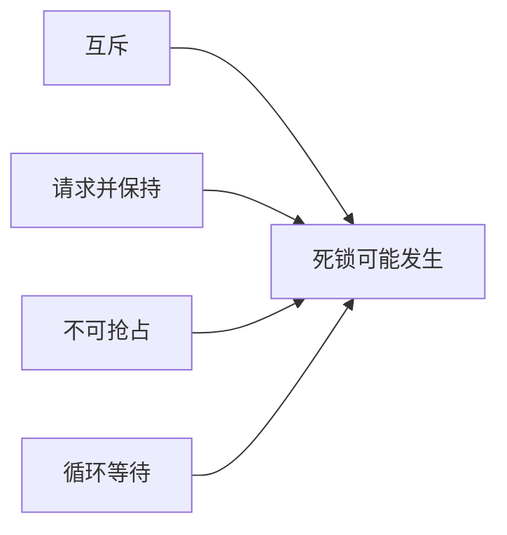

只有四个条件同时成立时才具备死锁的必要条件组合；上图中的汇合不表示任意单个条件足以导致死锁。

### 4. 资源分配图

资源分配图 $G=(V,E)$ 的结点分为进程集合 $P=\{P_1,\ldots,P_n\}$ 与资源集合 $R=\{R_1,\ldots,R_m\}$。圆表示进程，矩形表示资源类型，矩形内每个点表示一个实例。

- 请求边 $P_i\rightarrow R_j$：$P_i$ 正在申请 $R_j$ 的一个实例。
- 分配边 $R_j\rightarrow P_i$：$R_j$ 的一个实例已分配给 $P_i$。

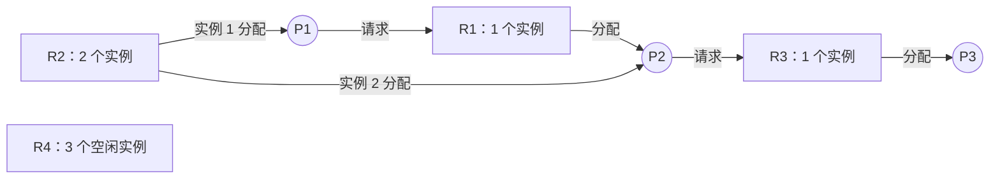

这幅 Mermaid 重构课件的基本资源分配实例：圆形结点表示进程，矩形结点表示资源类型；原图在资源矩形内部用圆点表示实例数，本图改在标签和边上明确写出实例数量。

> **图片转写（资源分配图实例）**：无死锁图含 $P_1,P_2,P_3$ 与 $R_1$～$R_4$；箭头同时展示申请和分配，$R_4$ 的三个实例未参与环。有环的另一图中，$P_1$ 申请 $R_1$、$R_1$ 的两个实例分给 $P_2,P_3$，$P_3$ 又申请 $R_2$，而 $R_2$ 的实例分给 $P_1,P_4$；因为资源类型有多个实例，有环只表示“可能死锁”，不能仅凭环下结论。

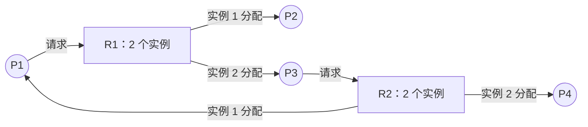

路径 $P_1\rightarrow R_1\rightarrow P_3\rightarrow R_2\rightarrow P_1$ 构成环；但 $R_1,R_2$ 都有多个实例，所以还要检查环外进程能否结束并释放实例。

基本事实：

- 图无环，一定无死锁。
- 若每类资源只有一个实例，图有环就发生死锁。
- 若某类有多个实例，图有环只表示可能死锁，还需简化或检测。

### 5. 资源分配图简化与死锁定理

图的简化过程：反复找一个**非阻塞且非孤立**的进程 $P_i$，假定其获得所需资源并运行完成，删除它的所有请求边和分配边，把其资源归还；继续处理其他进程。若最后所有边均能删除，图可完全简化；否则不可完全简化。

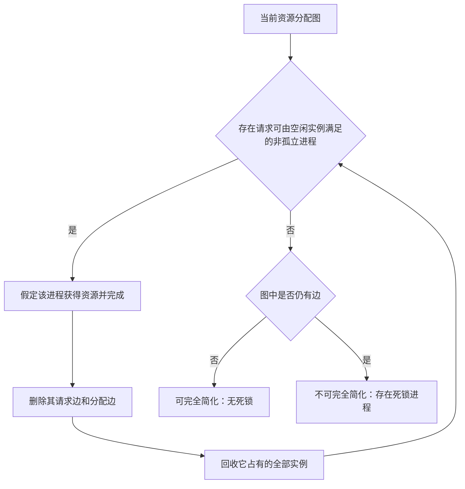

> **死锁定理**：系统状态 $S$ 为死锁状态，当且仅当 $S$ 的资源分配图不可完全简化。不同合法简化顺序最终得到同一个不可简化图。

课件简化图先消去 $P_1$ 的边并释放资源，再使 $P_2$ 获得资源、完成并释放；若所有进程最终成为孤立点，则无死锁。考研练习第 27 题给出图 I、II，要求依次划去已分配实例、寻找其全部请求边都能由当前空闲实例满足的进程并回收其资源，再判断选项“仅 I、仅 II、I 和 II、均不死锁”；判断不能只数环。

---

## 六、死锁处理策略与预防

### 1. 四类策略

| 策略       | 思想                     | 代价/特点                                   |
| -------- | ---------------------- | --------------------------------------- |
| 忽略（鸵鸟算法） | 假装不会发生死锁               | 实现简单；死锁发生后可能只能重启，UNIX/Windows 等会在部分场景采用 |
| 预防       | 静态破坏四个必要条件之一           | 限制强，资源利用率或并发度较低                         |
| 避免       | 动态检查分配后是否仍处于安全状态       | 需进程事先声明最大需求                             |
| 检测与解除    | 允许死锁，定期检测，发生后抢占资源或终止进程 | 需维护请求/分配信息和恢复机制                         |

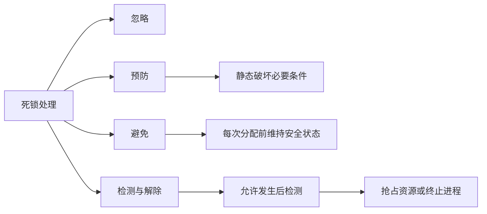

### 2. 预防方法

1. **互斥**：许多资源天然必须互斥，通常不能破坏，反而应保证。
2. **破坏请求并保持**：要求进程执行前一次申请全部资源，或仅在未占有任何资源时才能申请。缺点是资源利用率低且可能饥饿。
3. **破坏不可抢占**：新申请不能满足时，进程释放已占有资源；已释放资源进入其等待列表，待旧资源和新资源均可获得时重新开始。
4. **破坏循环等待**：对资源类型线性编号，只允许按递增序申请。难点是合理编号，会限制新设备加入、实际使用顺序和用户编程自由。

预防严格地让至少一个必要条件不成立；避免则允许必要条件存在，但在每次分配时阻止系统进入不安全状态，以换取更高利用率。

---

## 七、安全状态与银行家算法

### 1. 安全状态

若存在进程序列 $\langle P_1,P_2,\ldots,P_n\rangle$，使每个 $P_i$ 的剩余需求可由当前可用资源加上序列中此前进程释放的资源满足，则该序列是**安全序列**，系统处于安全状态。

> 安全状态一定无死锁；不安全状态表示**可能**死锁，不等于已经死锁。死锁避免的目标是永不进入不安全状态。

**单资源例**：12 台磁带机，$P_1,P_2,P_3$ 最大需求为 10、4、9，已分配为 5、2、2，可用 3。安全序列为 $\langle P_2,P_1,P_3\rangle$。若把剩余 3 台中的 1 台再分给 $P_3$，可用只剩 2，所有未完成进程的剩余需求均不能保证满足，状态变得不安全。

### 2. 数据结构

设有 $n$ 个进程、$m$ 类资源：

- `Available[m]`：每类当前可用实例数。
- `Max[n,m]`：各进程声明的最大需求。
- `Allocation[n,m]`：当前已分配量。
- `Need[n,m] = Max - Allocation`：尚需资源量。

### 3. 安全性算法

安全性算法的控制流程如下，比较运算均为对各资源分量逐项比较。

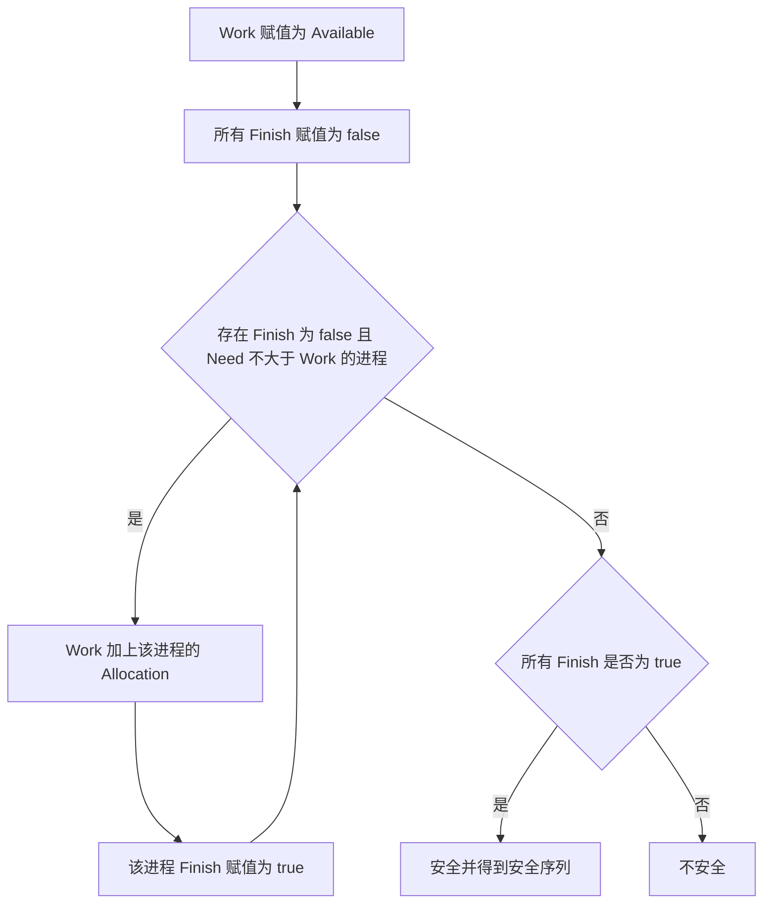

```text
Work := Available
对所有 i：Finish[i] := false
重复寻找 i，使 Finish[i] = false 且 Need[i] <= Work：
    Work := Work + Allocation[i]
    Finish[i] := true
直到找不到这样的 i
若所有 Finish[i] 都为 true，则安全；否则不安全
```

### 4. 资源请求算法

收到 $P_i$ 的请求向量 $Request_i$：

1. 若 $Request_i>Need_i$，说明超出声明的最大需求，报错。
2. 若 $Request_i>Available$，资源暂不可用，$P_i$ 等待。
3. 否则试分配：

$$
Available:=Available-Request_i
$$

$$
Allocation_i:=Allocation_i+Request_i,\qquad Need_i:=Need_i-Request_i
$$

4. 执行安全性算法。安全则正式分配；不安全则回滚状态并让 $P_i$ 等待。

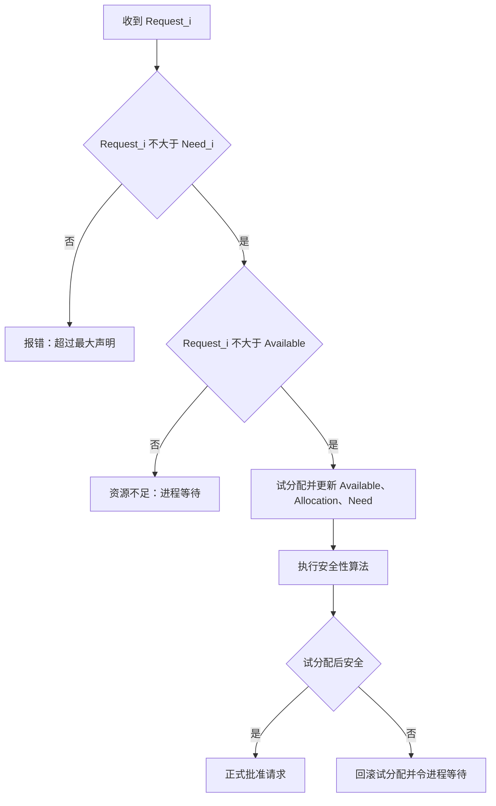

### 5. 银行家算法完整例题

系统有 A、B、C 三类资源，总实例数为 10、5、7，$T_0$ 时：

| 进程 | Allocation | Max | Need |
|---|---|---|---|
| $P_0$ | (0,1,0) | (7,5,3) | (7,4,3) |
| $P_1$ | (2,0,0) | (3,2,2) | (1,2,2) |
| $P_2$ | (3,0,2) | (9,0,2) | (6,0,0) |
| $P_3$ | (2,1,1) | (2,2,2) | (0,1,1) |
| $P_4$ | (0,0,2) | (4,3,3) | (4,3,1) |

$Available=(3,3,2)$，安全序列为：

$$
\langle P_1,P_3,P_4,P_2,P_0\rangle
$$

对应的 `Work` 依次为 `(3,3,2) → (5,3,2) → (7,4,3) → (7,4,5) → (10,4,7) → (10,5,7)`。

若 $P_1$ 请求 `(1,0,2)`：请求不超过 Need 和 Available；试分配后 $Available=(2,3,0)$，仍存在安全序列 $\langle P_1,P_3,P_4,P_0,P_2\rangle$，可以批准。

补充判断：$P_4$ 请求 `(3,3,0)` 时可用资源不足；$P_0$ 请求 `(0,2,0)` 虽有足够可用资源，但试分配后会进入不安全状态，不能批准。

---

## 八、死锁检测与解除

### 1. 检测算法

若分配时不做限制，系统必须保存资源请求和分配信息，并提供检测算法。检测数据结构与银行家算法相似，但使用当前 `Request` 而非最大剩余 `Need`：

```mermaid
flowchart TD
  A[Work 赋值为 Available] --> B[无占有者 Finish 为 true，其余为 false]
  B --> C{存在 Finish 为 false 且 Request 不大于 Work 的进程}
  C -->|是| D[Work 加上该进程的 Allocation]
  D --> E[该进程 Finish 赋值为 true]
  E --> C
  C -->|否| F{仍有 Finish 为 false}
  F -->|否| G[当前无死锁]
  F -->|是| H[这些进程构成死锁集合]
```

```text
Work := Available
若 Allocation[i] != 0，则 Finish[i] := false；否则 Finish[i] := true
重复寻找 i，使 Finish[i] = false 且 Request[i] <= Work：
    Work := Work + Allocation[i]
    Finish[i] := true
直到找不到这样的 i
若仍有 Finish[i] = false，则系统死锁，且这些 Pi 是死锁进程
```

### 2. 检测例题

系统有 A、B、C 三类资源各 7、2、6 个实例，五个进程当前状态为：

| 进程 | Allocation | Request |
|---|---|---|
| $P_0$ | (0,1,0) | (0,0,0) |
| $P_1$ | (2,0,0) | (2,0,2) |
| $P_2$ | (3,0,3) | (0,0,0) |
| $P_3$ | (2,1,1) | (1,0,0) |
| $P_4$ | (0,0,2) | (0,0,2) |

按序列 $\langle P_0,P_2,P_3,P_1,P_4\rangle$ 可使所有 `Finish=true`，所以无死锁。若再让 $P_2$ 请求/占用一个 C 实例，$P_0$ 虽可结束并归还资源，但余量仍不能满足其他进程，请求链不能继续简化；死锁进程为 $P_1,P_2,P_3,P_4$。

### 3. 解除死锁

1. **抢占资源**：从一个或多个进程抢占足够资源交给死锁进程。需要选择牺牲者、回滚到安全状态，并防止同一进程反复成为牺牲者而饥饿。
2. **终止进程**：可一次终止所有死锁进程，或逐个终止直到环消失。逐个终止时应综合优先级、已运行与剩余时间、已占及尚需资源、进程是交互式还是批处理式，尽量降低代价。

---

## 九、图片与补充材料核查

### 1. 图片信息汇总

三份课件中多次重复以下版式图片：章节知识导图、主页/分层/开锁/增长/工具图标、编号圆点、箭头步骤、OS 圆形标识、办公室背景、茶壶“休息”图和章节封面。它们用于导航、编号或装饰，不增加技术定义；知识导图的结构已展开为本笔记各节。

其他实质图均已在对应章节转写，包括：三级调度与队列关系、作业和进程转换、上下文切换、CPU/I/O 区间分布、FCFS/SJF/RR/MLFQ 甘特图、时间片与切换次数、EDF/LLF 实时时间线、Linux 优先级和 CFS 虚拟时间、交通/桥梁死锁、二维推进死锁区、资源图符号与实例、图的简化过程。课件中两枚纯蓝圆点、灰色编号圆点以及重复高亮版本只表示当前步骤，不带额外文字。

### 2. POSIX 与 Win32 补充页

课件开头附带上一章接口材料：POSIX 系统调用文档通常列名称、详细功能、返回值、错误和示例，适用于 UNIX、Linux 和 macOS 等 POSIX 系统；Windows 的系统调用未完全公开，Win16 用于 Windows 3.1，Win32 始于 Windows NT，64 位 Win32 的主要变化涉及内存指针类型。该内容与本章调度主线无直接关系，作为来源补充保留。

### 3. 课程思政材料

课件回顾中科红旗研发具自主知识产权的红旗 Linux、曾与金山等国产软件企业应对微软市场优势，并用于国家信息平台、中国科学院、国家外汇管理局等场景；中科红旗于 2014 年 2 月 10 日宣布解散。材料借此强调自主创新、完善国产软件生态和长期积累的重要性，并以 WPS 的发展鼓励持续挑战技术垄断。

### 4. 逐图覆盖审计

下列编号按三份 `full.md` 中图片引用的出现顺序编制；区间端点均包含在内，因此每个编号都能在表中找到唯一处置记录。三份源文件共有 218 次引用、202 个内容哈希不同的图片；16 次重复引用也保留编号并注明复核结果。

**中 3 课时：62 次引用**

| 图片序号 | 核查结果与承接位置 |
|---|---|
| 001 | 章节知识导图，已在“主要内容”后用 Mermaid 重构 |
| 002～004 | 书封、人物访谈和古代轮形资料属于“轮转”引题插图，不增加 RR 算法规则，已作文字判断 |
| 005～011 | 步骤箭头、主页和导航图标，不增加知识信息 |
| 012 | 时间片与上下文切换次数图，已在 RR 小节转写数值和结论 |
| 013 | 平均周转时间随时间片变化的折线图，已转写趋势并注明不能外推 |
| 014～018 | 分层、开锁、主页等导航图标，不增加知识信息 |
| 019 | Windows 性能选项截图，已在中级调度小节完整转写可见设置和数值 |
| 020～022 | 主页、分层和开锁图标，不增加知识信息 |
| 023～026 | 两种 MLFQ 和多级队列结构，已用 Mermaid 重构并补充 $s_1<s_2<\cdots<s_n$ |
| 027 | 两幅 MLFQ 甘特时间线，已在练习表和文字执行区间中承接 |
| 028～040 | 导航图标、办公室背景、茶壶和 OS 标识，不增加知识信息 |
| 041～042 | 非抢占/抢占 EDF 时间线，已在 EDF 小节转写到达、执行、截止和错过情形，并用 Mermaid 表达决策流程 |
| 043～045 | 主页、分层和开锁图标，不增加知识信息 |
| 046～047 | LLF 执行时间线与周期到达线，已转写周期、执行时长、利用率和抢占原则 |
| 048～052 | 增长图标、办公室背景及纯色圆点，不增加知识信息 |
| 053～054 | Linux 优先级/时间片和 CFS 虚拟时间图，已转为公式、文字和 Mermaid |
| 055～059 | 主页、分层、开锁和增长图标，不增加知识信息 |
| 060 | 作业题号高亮图，已转为原生 Markdown 作业表 |
| 061～062 | 十字路口照片与循环箭头，已抽象为互相占有并等待的 Mermaid 等待环 |

**前 3 课时：81 次引用**

| 图片序号 | 核查结果与承接位置 |
|---|---|
| 001～002 | 纯色圆点，不增加知识信息 |
| 003 | 与中 3 课时 001 内容重复的知识导图，已复核并由同一 Mermaid 承接 |
| 004 | 高、中、低三级调度体系图，已在“调度的作用与层次”用 Mermaid 重构 |
| 005 | 办公室背景装饰，不增加知识信息 |
| 006 | 作业、外存、内存与 CPU 的关系图，已用作业生命周期 Mermaid 和文字说明承接 |
| 007～008 | 思考人物和内存条实物图，仅用于类比，不增加调度约束 |
| 009 | 含完成阶段的作业转换图，已由作业生命周期 Mermaid 承接 |
| 010～014 | 思考人物、开锁、主页和分层图标，不增加知识信息 |
| 015～016 | 上下文切换时序和完整队列体系，已分别用 sequenceDiagram 与 flowchart 重构 |
| 017～019 | CPU/内存示意、茶壶和增长图标，只作说明或装饰，语义已写入作业与进程段落 |
| 020 | 排队器、分派器、上下文切换器结构图，已用 Mermaid 重构 |
| 021～023 | 增长、用户和工具图标，不增加知识信息 |
| 024 | CPU 区间频率曲线，已转写坐标、趋势和约 8 ms 后接近零的结论 |
| 025～034 | 增长、主页、分层和开锁导航图标，不增加知识信息 |
| 035 | FCFS 甘特图，已转为明确的运行区间、公式和结果 |
| 036～042 | 编号圆点和步骤箭头，只表示讲解进度，不增加知识信息 |
| 043 | SJF 调度甘特图，已转为 `P2:0–3 → P3:3–6 → P1:6–30` 及均值结论 |
| 044～059 | 茶壶、导航图标、OS 标识、用户/工具图标和办公室背景，不增加知识信息 |
| 060～062 | 章节步骤箭头，只表示讲解顺序，不增加知识信息 |
| 063～065 | 计时、主页和分层图标，不增加知识信息；063 与中 3 课时同类计时图重复复核 |
| 066 | 时间片与切换次数图，已在 RR 小节转写并由 Mermaid 表达取值权衡 |
| 067～070 | 开锁、主页和分层图标，不增加知识信息 |
| 071 | Windows 性能选项截图，与中 3 课时同类截图逐项复核后合并转写 |
| 072～074 | 主页、分层和开锁图标，与中 3 课时对应图重复复核 |
| 075～077 | MLFQ 与多级队列结构，与中 3 课时对应图重复或同义，已由 MLFQ Mermaid 统一承接 |
| 078 | 两幅 MLFQ 甘特图，已转写完成时间、平均周转和平均带权周转 |
| 079～081 | 主页、分层和开锁导航图标，不增加知识信息 |

**后 3 课时：75 次引用**

| 图片序号 | 核查结果与承接位置 |
|---|---|
| 001～003 | 知识导图、交通死锁照片和循环箭头分别与前两份课件同图重复，已逐一复核 |
| 004～005 | 独木桥和十字路口示意，已完整文字描述占有、等待、后退与饥饿风险 |
| 006～009 | 增长图标和章节编号，不增加知识信息 |
| 010 | $P_1,P_2$ 二维推进图，已文字说明坐标事件、路径和中央死锁区 $D$，因折线路径和坐标细节不宜用流程图猜测而未强行重绘 |
| 011～018 | 章节步骤箭头、主页、分层和开锁图标，不增加知识信息；018 为重复图标 |
| 019～020 | 进程圆形与多实例资源矩形符号，已在资源分配图定义和 Mermaid 标签中承接 |
| 021 | 分层导航图标，不增加知识信息 |
| 022 | 请求边 $P_i\rightarrow R_j$，已在资源分配图 Mermaid 中重构 |
| 023 | 开锁导航图标，不增加知识信息 |
| 024 | 分配边 $R_j\rightarrow P_i$，已在资源分配图 Mermaid 中重构 |
| 025～028 | 无环图和有环多实例图的原始/强调版本，已用两幅 Mermaid 及环判定文字承接 |
| 029～032 | 工具图标和编号圆点，不增加知识信息 |
| 033～034 | 资源分配图练习及 $R_2$ 实例局部图，已转写为简化要求和“不能只数环”的判断原则 |
| 035～059 | 主页、分层、开锁、步骤圆点、增长图标和办公室背景，不增加知识信息 |
| 060 | 资源分配图简化前后对照，已用 Mermaid 重构完整简化算法 |
| 061～066 | 编号圆点和 OS 标识，不增加知识信息 |
| 067～072 | 练习图 I、II、资源实例局部图及教师标注版本，已逐一复核；标注只演示划去实例和回收顺序，规则已写入简化算法 |
| 073～074 | 编号圆点，不增加知识信息 |
| 075 | 章末知识导图，与中 3 课时 001 同义，已由章首 Mermaid 统一承接 |

---

## 十、课后练习与作业

### 1. 课件练习

1. 完成五进程 MLFQ 练习：分别画固定 $q=1$ 与 $q=2^i$ 的执行时间线，计算完成、周转和带权周转时间。
2. 对资源分配图题第 27 题分别简化图 I、II，判断哪一状态死锁，并写出可消去进程的顺序或最终不可简化子图。
3. 用银行家算法验证 $P_1$ 请求 `(1,0,2)`，并判断 $P_4(3,3,0)`、$P_0(0,2,0)` 请求能否批准。

### 2. 课件标黄作业

| 次数 | 简答题 | 计算题 | 综合应用题 |
|---|---|---|---|
| 第四次作业 | 1、2 | 19、20 | 无标黄题 |
| 第五次作业 | 3、6 | 21、22 | 无标黄题 |
| 第六次作业 | 无标黄题 | 无标黄题 | 23、24、25 |

> 题号来自各作业页的黄色高亮；原课件只列题号，题目正文需结合课程配套习题册。

---

## 本章小结

| 主题 | 核心结论 |
|---|---|
| 调度层次 | 高级选作业，中级做内外存对换，低级把 CPU 分给就绪进程 |
| 调度选择 | 批处理重周转与吞吐，分时重响应，实时重截止期与可预测性 |
| 经典算法 | FCFS 简单；SJF 均值优；PR 表达紧迫性；HRRN 兼顾等待；RR 保证响应；MLFQ 动态兼顾多类任务 |
| 实时调度 | EDF 选最早截止期，LLF 选最小松弛度；优先级继承缓解倒置 |
| Linux | CFS 用虚拟运行时间逼近公平，实时类优先于普通公平类 |
| 死锁条件 | 互斥、请求并保持、不可抢占、循环等待必须同时成立 |
| 图论判断 | 单实例资源有环即死锁；多实例必须执行图简化/检测 |
| 预防与避免 | 预防破坏必要条件；避免以安全状态为门槛，银行家算法先试分配再检查 |
| 检测与恢复 | 检测用当前 Request；解除靠抢占资源或终止进程，并控制恢复代价 |
