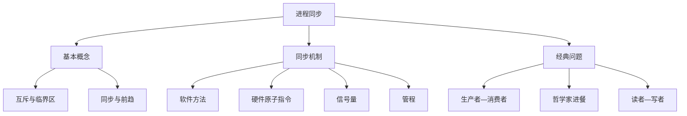
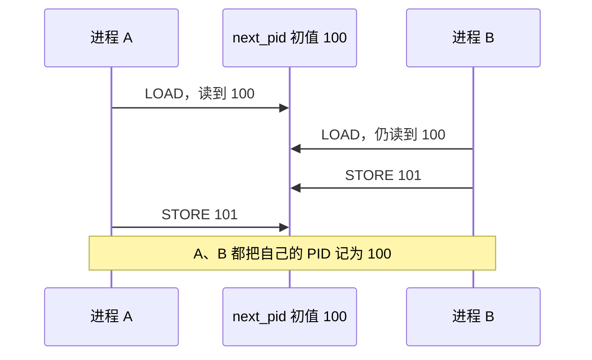
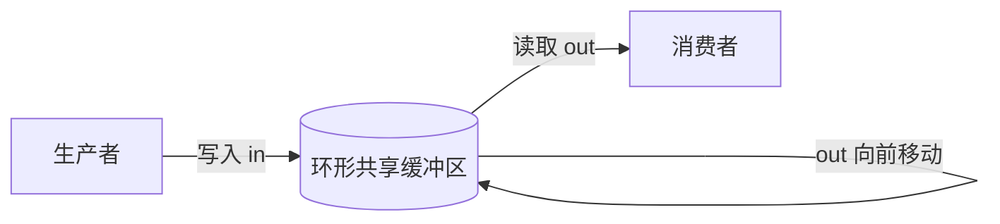
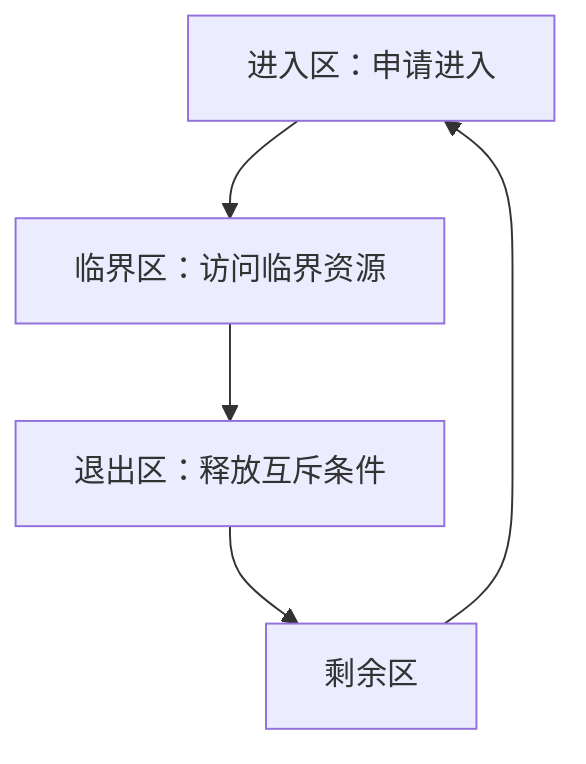
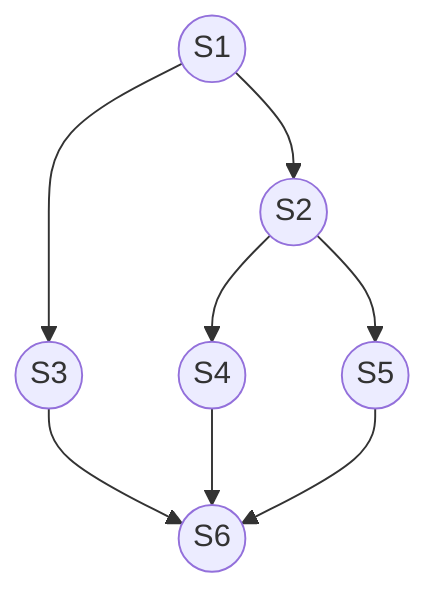
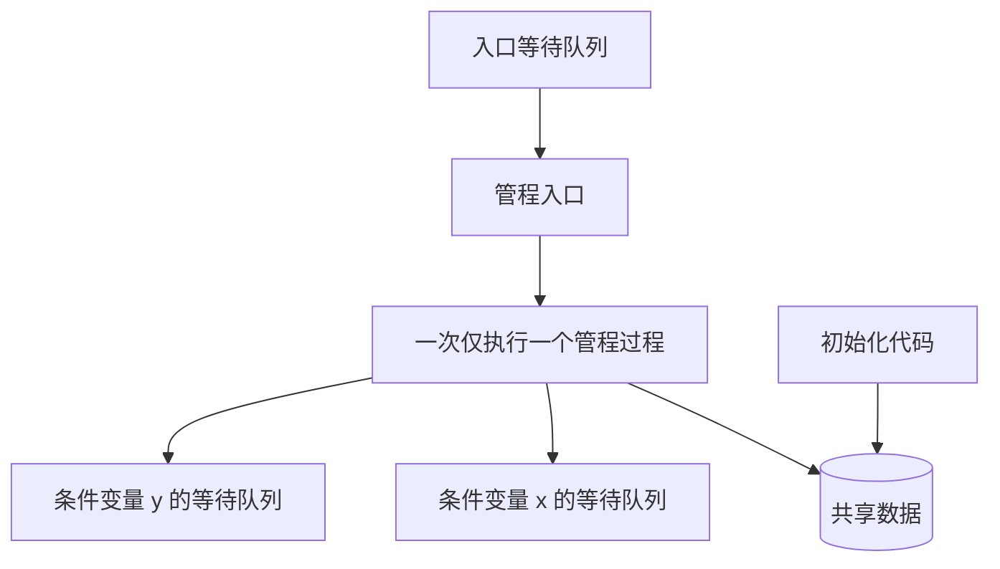
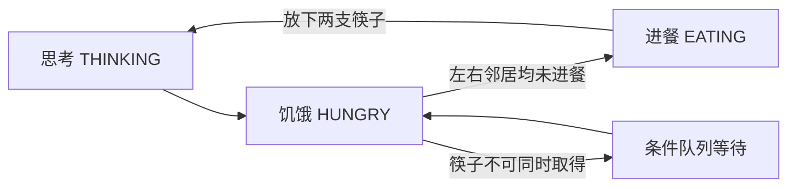
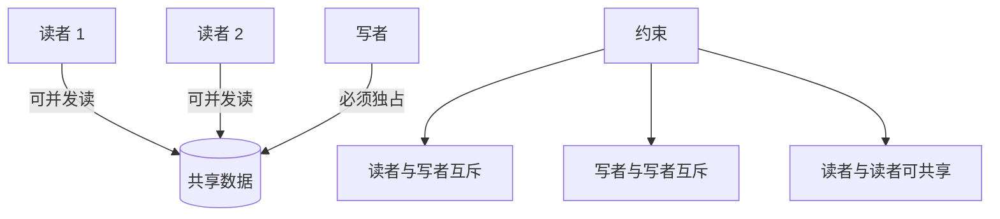
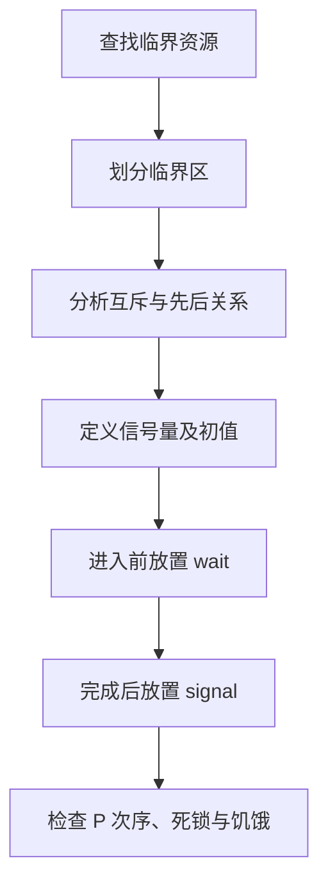

# 4.1 进程同步

> 本笔记整理自《操作系统》第 4 章课件。课件中的知识导图、并发交错图、缓冲区图、前趋图、管程结构图、哲学家圆桌图等均已转写为文字；纯模板图标与照片不承载额外技术信息，笔记无需依赖原图即可复习。

## 主要内容



- 并发进程的制约关系、临界资源与临界区
- Peterson 软件方案与硬件原子指令
- 整型、记录型、AND 型信号量与信号量集
- 用信号量实现互斥、同步和前趋关系
- 管程与条件变量
- 生产者—消费者、哲学家进餐、读者—写者问题
- 死锁、饥饿、PV 操作原则与 Linux 同步机制

---

## 一、进程同步的基本概念

### 1. 任务与两类制约关系

进程同步的主要任务是：使并发执行的进程能有效共享资源、相互合作，使程序执行具有**可再现性**。

| 制约关系     | 含义                           | 典型来源                     |
| -------- | ---------------------------- | ------------------------ |
| 间接制约（互斥） | 多个进程竞争同一临界资源，同一时刻只允许一个使用     | 共享变量、打印机、缓冲区指针           |
| 直接制约（同步） | 合作进程之间有明确的先后关系，一个事件须等待另一事件发生 | “先生产、后消费”“C1 完成后才能执行 C2” |

- **同步**：两个或多个事件具有某种时序关系（先—后）。
- **互斥**：资源必须排他使用，进程之间没有固定先后，只要求不能同时进入。互斥可视作一种特殊同步。
- **临界资源**：一次只允许一个进程使用的资源，也称互斥资源；共享变量也可能成为临界资源。

### 2. 竞态条件：`next_pid` 例



两个进程都执行“读取 `next_pid`、保存为自己的新 PID、递增并写回”。若初值为 100，交错如下：

1. A 读取 100，并把自己的 `new_pid` 置为 100；
2. 切换到 B，B 也读取 100，把自己的 `new_pid` 置为 100，并把全局值写为 101；
3. 回到 A，A 再把自己寄存器中的 101 写回。

结果：两个进程都得到 PID 100，虽全局 `next_pid` 最终为 101，数据已不一致。这说明一条高级语言语句往往由多条机器指令组成，线程切换可能发生在中间。

### 3. 有界缓冲区与竞争



图示为环形共享缓冲区：多个生产者从生产指针 `in` 投放，多个消费者从消费指针 `out` 取走，指针按同一方向循环移动。黑格表示满缓冲区，白格表示空缓冲区。共享数据包括：

```c
#define BUFFER_SIZE 10
item buffer[BUFFER_SIZE];
int in = 0, out = 0, count = 0;
```

- `buffer`：含 $n$ 个单元的缓冲池；
- `in`：下一个可投放位置，投放后执行 `in=(in+1)%n`；
- `out`：下一个可取出位置，取出后执行 `out=(out+1)%n`；
- `count`：当前产品数，初值为 0。

仅以忙等判断满/空的基本版本为：

```c
// producer
while (true) {
    produce(nextProduced);
    while (count == BUFFER_SIZE) ;
    buffer[in] = nextProduced;
    in = (in + 1) % BUFFER_SIZE;
    count++;
}

// consumer
while (true) {
    while (count == 0) ;
    nextConsumed = buffer[out];
    out = (out + 1) % BUFFER_SIZE;
    count--;
    consume(nextConsumed);
}
```

`count++` 与 `count--` 都不是原子操作。若 `count=5`：

```text
S0 producer: r1=count       -> r1=5
S1 producer: r1=r1+1        -> r1=6
S2 consumer: r2=count       -> r2=5
S3 consumer: r2=r2-1        -> r2=4
S4 producer: count=r1       -> count=6
S5 consumer: count=r2       -> count=4
```

正确结果应仍为 5，实际却是 4；交换最后两步还可能得到 6。这就是**丢失更新**。

### 4. 临界区及一般结构



- **临界区**：进程中访问临界资源的代码段。
- **进入区**：检查能否进入并建立“正在访问”状态。
- **退出区**：撤销访问状态或释放锁。
- **剩余区**：其他代码。

```text
do {
    entry section;
    critical section;
    exit section;
    remainder section;
} while (TRUE);
```

同步机制应满足：

1. **空闲让进**：临界区空闲时，应允许某个申请者立即进入；
2. **忙则等待**：已有进程在临界区时，其他申请者必须等待；
3. **有限等待**：申请进入后，等待时间应有上界，不能“死等”或饥饿；
4. **让权等待（可选准则）**：暂不能进入者应释放 CPU、转入阻塞，而不是持续忙等。

同步机制可分为软件同步、硬件同步、信号量和管程。软件方法编程困难且局限较多；硬件原子指令能有效实现互斥；信号量和管程则提供更高层抽象。

---

## 二、软件同步：Peterson 算法

Peterson 算法解决**两个进程**的临界区问题。共享变量：

```c
boolean flag[2] = {false, false}; // flag[i] 表示 Pi 想进入
int turn;                         // 冲突时把机会让给谁
```

进程 $P_i$（$j=1-i$）：

```c
do {
    flag[i] = true;
    turn = j;
    while (flag[j] && turn == j) ;
    /* critical section */
    flag[i] = false;
    /* remainder section */
} while (true);
```

理解：`flag` 表达意愿，`turn` 在双方同时竞争时裁决优先者；退出时清除自己的意愿。该方案满足互斥、前进和有限等待，但依赖共享内存读写顺序的假设，现代系统通常采用硬件原子操作与更高层同步原语。

---

## 三、硬件同步机制

### 1. 关中断

进入锁测试之前关闭中断，完成测试并上锁后再打开中断，可避免当前 CPU 在关键步骤被抢占。但它不适合用户进程，临界区过长会降低响应性；多处理器中关闭一个 CPU 的中断也不能阻止其他 CPU 并发访问。

### 2. `TestAndSet`

`TestAndSet` 原子地读取旧值并把锁置为真：

```c
boolean TestAndSet(boolean *lock) {
    boolean old = *lock;
    *lock = true;
    return old;
}

boolean lock = false;
do {
    while (TestAndSet(&lock)) ;
    /* critical section */
    lock = false;
    /* remainder section */
} while (true);
```

只有读到旧值 `false` 的进程获得锁；其他进程自旋。

### 3. `Swap`

```c
void Swap(boolean *a, boolean *b) {
    boolean temp = *a; *a = *b; *b = temp;
}

boolean lock = false;
do {
    boolean key = true;
    while (key) Swap(&lock, &key);
    /* critical section */
    lock = false;
    /* remainder section */
} while (true);
```

`Swap` 必须由硬件保证原子性。以上锁都可能忙等，适合等待很短的场景。

---

## 四、信号量机制

### 1. 概念与发展

信号量由 Dijkstra 于 1965 年提出。P、V 来自荷兰语 *Proberen*（测试）和 *Verhogen*（增加），常写作 `wait` / `signal`。进程进入关键代码前必须取得信号量，结束后释放。信号量只允许初始化及 P、V 原语访问，原语作为操作系统核心代码执行，不可被调度打断。

课件补充：Dijkstra（1930—2002）还提出最短路径算法、银行家算法，解决哲学家进餐问题，设计 THE 操作系统，并推动结构化程序设计；相关人物照与模板照片不增加算法信息。

信号量的发展类型：**整型信号量 → 记录型信号量 → AND 型信号量 → 信号量集**。

### 2. 整型与记录型信号量

整型信号量直接用整数表达资源数量，传统 `wait` 会忙等。记录型信号量增加等待队列以去除忙等：

```c
typedef struct {
    int value;
    struct process_control_block *list;
} semaphore;

wait(semaphore *S) {
    S->value--;
    if (S->value < 0) block(S->list);
}

signal(semaphore *S) {
    S->value++;
    if (S->value <= 0) wakeup(S->list);
}
```

物理意义：

- $S>0$：有 $S$ 个资源可用；
- $S=0$：无空闲资源，但暂无线程欠账；
- $S<0$：有 $|S|$ 个进程在该信号量队列等待；
- `P(S)` 申请一个资源，`V(S)` 释放一个资源；初值必须非负。

### 3. AND 型信号量

进程若同时需要多类资源，逐个申请可能“占一等一”并引发死锁。AND 同步把整个运行阶段需要的资源一次性原子分配，使用后一起释放：

```text
Swait(S1, S2, ..., Sn):
    仅当每个 Si >= 1 时，原子地令所有 Si--；
    否则在第一个不足的 Si 等待队列阻塞，重新执行 Swait。

Ssignal(S1, S2, ..., Sn):
    原子地令所有 Si++，并把相应等待进程移到就绪队列。
```

### 4. 信号量集

记录型信号量一次只能申请或释放一个单位。信号量集扩展 AND 机制，使多类资源及每类的多个单位在一个原语中完成：

$$
Swait(S_1,t_1,d_1,\ldots,S_n,t_n,d_n)
$$

对资源 $S_i$，$t_i$ 是允许分配的测试下限；仅当 $S_i\ge t_i$ 时才分配，分配量为 $d_i$，即 $S_i\leftarrow S_i-d_i$。释放写作：

$$
Ssignal(S_1,d_1,\ldots,S_n,d_n)
$$

### 5. 实现互斥

```c
semaphore mutex = 1;
while (true) {
    wait(&mutex);
    /* critical section */
    signal(&mutex);
    /* remainder section */
}
```

互斥 P/V 位于**同一进程**，且必须包围临界区。

### 6. 实现同步

若要求 $C_1$ 先于 $C_2$：

```c
semaphore s = 0;
P1: { C1; signal(&s); }
P2: { wait(&s); C2; }
```

同步信号量初值常为 0，用于传递“事件已发生”的消息；同步 P/V 分布在**不同进程**。

### 7. 实现前趋图



课件前趋图关系为：

$$
S_1\to\{S_2,S_3\},\quad S_2\to\{S_4,S_5\},\quad \{S_3,S_4,S_5\}\to S_6
$$

```c
semaphore a=0,b=0,c=0,d=0,e=0,f=0,g=0;
cobegin
{ S1; signal(a); signal(b); }
{ wait(a); S2; signal(c); signal(d); }
{ wait(b); S3; signal(e); }
{ wait(c); S4; signal(f); }
{ wait(d); S5; signal(g); }
{ wait(e); wait(f); wait(g); S6; }
coend
```

---

## 五、管程机制

### 1. 为什么需要管程



信号量同步分散在各进程中，程序员容易把 `wait/signal` 写错位置、漏写或不配对，且维护困难。Hoare 与 Hansen 在 20 世纪 70 年代提出管程，将同步逻辑集中管理。

**管程**定义一个共享数据结构和一组可由并发进程调用、操作该数据结构的过程；这些过程既能改变数据，也能同步进程。

```text
monitor monitor_name {
    shared-variable declarations;
    condition declarations;
public:
    void P1(...) { ... }
    void P2(...) { ... }
    initialization_code { ... }
}
```

结构图转写：管程内部从下到上依次为初始化代码、针对共享数据的一组操作、共享数据和条件变量/条件等待队列；外部进程从入口队列排队进入。任一时刻仅允许一个进程在管程内执行，互斥由编译器保证；共享变量只能通过管程操作访问。

### 2. 条件变量

```text
condition x, y;
x.wait()   // 当前进程阻塞，直到别的进程对 x 执行 signal
x.signal() // 唤醒在 x 上等待的一个进程
```

实体图表明：每个条件变量（如 `x`、`y`）有独立等待队列，管程还有统一入口队列。

当进程 P 在管程内 `signal` 唤醒 Q 时，若二者都继续执行便破坏管程互斥。可选语义：

1. **Hoare 语义**：P 立即等待，Q 先执行；直至 Q 离开管程或再次等待，P 才恢复；
2. **Mesa/通知式语义**：Q 等待，P 先继续，P 离开或等待后 Q 再竞争管程。

---

## 六、经典同步问题

### 1. 生产者—消费者问题


**问题与同步关系**

$M$ 个等价生产者向 $N$ 个缓冲区投放产品，若干消费者取走产品。图中生产指针、消费指针沿环形缓冲区移动。需要保证：

- 生产者之间对 `in` 互斥；消费者之间对 `out` 互斥；所有进程对缓冲区及计数互斥；
- 缓冲池满时生产者等待，空时消费者等待；
- 投入产品后通知消费者，取走产品后通知生产者。

三个信号量：

```c
semaphore mutex = 1; // 缓冲池互斥
semaphore empty = N; // 空缓冲区数
semaphore full  = 0; // 满缓冲区数
```

**记录型信号量解法**

```c
producer() {
    while (true) {
        produce(nextp);
        wait(&empty);      // 先同步：取得空槽
        wait(&mutex);      // 后互斥：进入临界区
        buffer[in] = nextp;
        in = (in + 1) % N;
        signal(&mutex);
        signal(&full);     // 满槽增加，必要时唤醒消费者
    }
}

consumer() {
    while (true) {
        wait(&full);       // 先同步：取得满槽
        wait(&mutex);
        nextc = buffer[out];
        out = (out + 1) % N;
        signal(&mutex);
        signal(&empty);    // 空槽增加，必要时唤醒生产者
        consume(nextc);
    }
}
```

> **顺序重点**：必须先 `wait(empty/full)`，再 `wait(mutex)`。若先占有 `mutex` 后因无资源而阻塞，对方无法进入临界区改变资源数，会死锁。两个 `signal` 的先后通常不影响正确性。

**AND 信号量解法**

```c
int in=0, out=0; item buffer[N];
semaphore mutex=1, empty=N, full=0;

producer() {
    while (true) {
        produce(nextp);
        Swait(empty, mutex);
        buffer[in]=nextp; in=(in+1)%N;
        Ssignal(mutex, full);
    }
}
consumer() {
    while (true) {
        Swait(full, mutex);
        nextc=buffer[out]; out=(out+1)%N;
        Ssignal(mutex, empty);
        consume(nextc);
    }
}
```

**管程解法**

```c
monitor ProducerConsumer {
    item buffer[N]; int in=0, out=0, count=0;
    condition notFull, notEmpty;
public:
    void put(item x) {
        if (count >= N) notFull.wait();
        buffer[in]=x; in=(in+1)%N; count++;
        notEmpty.signal();
    }
    item get() {
        if (count <= 0) notEmpty.wait();
        item x=buffer[out]; out=(out+1)%N; count--;
        notFull.signal(); return x;
    }
} PC;
```

生产者调用 `PC.put(x)`，消费者调用 `x=PC.get()`；管程自动保证二者不会并发修改内部共享数据。

### 2. 哲学家进餐问题



五位哲学家围圆桌而坐，桌上有五只碗和五支筷子；哲学家交替思考和进餐，只有同时拿到左右两支筷子才能吃饭。圆桌图只是在相邻座位之间各放一支筷子，中央标有米饭。

**直接记录型信号量方案及死锁**

```c
semaphore chopstick[5] = {1,1,1,1,1};
philosopher(i) {
    while (true) {
        wait(&chopstick[i]);
        wait(&chopstick[(i+1)%5]);
        eat();
        signal(&chopstick[i]);
        signal(&chopstick[(i+1)%5]);
        think();
    }
}
```

若五人同时拿起左筷子，则五个信号量均为 0，每人都永久等待右筷子，形成死锁。可采取：

1. 最多只允许 4 位哲学家同时尝试取筷子；
2. 仅在左右筷子都可用时才原子地取得二者；
3. 破坏对称性：奇数号先取左筷，偶数号先取右筷。

AND 信号量方案：

```c
while (true) {
    think();
    Swait(chopstick[i], chopstick[(i+1)%5]);
    eat();
    Ssignal(chopstick[i], chopstick[(i+1)%5]);
}
```

**管程方案**

```c
monitor DP {
    enum {THINKING, HUNGRY, EATING} state[5];
    condition self[5];

    void test(int i) {
        if (state[(i+4)%5] != EATING && state[i] == HUNGRY &&
            state[(i+1)%5] != EATING) {
            state[i] = EATING;
            self[i].signal();
        }
    }
    void pickup(int i) {
        state[i] = HUNGRY; test(i);
        if (state[i] != EATING) self[i].wait();
    }
    void putdown(int i) {
        state[i] = THINKING;
        test((i+4)%5); test((i+1)%5);
    }
    initialization_code { for (int i=0;i<5;i++) state[i]=THINKING; }
}
```

哲学家循环执行 `dp.pickup(i) → eat → dp.putdown(i)`。

### 3. 读者—写者问题



读者和写者共享一组数据：允许多个读者同时读；读写不能同时；多个写者不能同时写。分为：

- **第一类（读者优先）**：只要已有读者在读，新读者可以插队，写者可能饥饿；
- **第二类（写者优先）**：一旦有写者等待，后续读者等待，优先让写者，需额外机制。

**读者优先解法**

```c
int readcount = 0;
semaphore mutex = 1; // 保护 readcount
semaphore wrt = 1;   // 保护共享数据

reader() {
    while (true) {
        wait(&mutex);
        readcount++;
        if (readcount == 1) wait(&wrt); // 第一个读者锁住数据
        signal(&mutex);
        read();
        wait(&mutex);
        readcount--;
        if (readcount == 0) signal(&wrt); // 最后一个读者释放
        signal(&mutex);
    }
}

writer() {
    while (true) {
        wait(&wrt); write(); signal(&wrt);
    }
}
```

到达规则：无读写者时读者可读；已有读者时新读者仍可读，即便已有写者等待；写者正在写时读者等待。写者只有在无读者、无其他写者时才能写。

**写者优先**

要求：写者彼此互斥，也与所有读者互斥；一旦有写者到达，后续读者必须等待；唤醒时优先写者。课件把“如何用 PV 操作实现”列为思考题。

**信号量集思路**

课件给出用 `L` 控制允许进入的读者数、`mx` 保证写者独占的框架：读者先申请 `L` 的一个单位并检查 `mx`，读完释放 `L`；写者以信号量集操作原子取得 `mx`，并测试读者数为 0，写完释放 `mx`。其核心仍是“多个读者共享、写者取得全局独占”。

---

## 七、常见错误、死锁与饥饿

### 1. 死锁与饥饿

- **死锁**：两个或多个进程无限等待某事件，而该事件只能由这些等待进程之一引起。
- **饥饿**：进程无限期阻塞，可能永远不能从信号量等待队列中移出。

若信号量 `S=Q=1`：

```text
P0: P(S); P(Q); ... V(S); V(Q)
P1: P(Q); P(S); ... V(Q); V(S)
```

当 P0 获得 S、P1 获得 Q 后，双方等待对方持有的资源，形成循环等待。

### 2. PV 使用原则

1. 信号量恰好初始化一次，且初值非负；其后只能通过 P/V 访问。
2. P、V 必须逻辑配对：互斥对在同一进程，同步对常分属不同进程。
3. 多个 P 连用时次序很重要；**同步 P 应先于互斥 P**，避免持锁等待。
4. 多个 V 的次序一般不影响正确性。
5. 检查遗漏、重复、错位会导致死锁、越界进入或资源计数错误。

### 3. 互斥/同步题的分析流程



课件流程图转写：

1. 查找临界资源；
2. 划分临界区（找出关键代码片段）；
3. 分析关键代码之间所需的互斥或先后次序；
4. 定义相应互斥/同步信号量并赋初值；
5. 在关键代码前加 `wait`，完成后加 `signal`；
6. 检查 P 的次序、死锁与饥饿。

### 4. 信号量机制的局限

- 同步操作分散于各进程，次序错误、重复或遗漏容易造成死锁；
- 模块独立性差，修改共享变量或代码段可能影响全局；
- 可读性差，验证某组共享变量是否操作正确往往要通读整个并发程序；
- 大型系统难以保证无逻辑错误。管程的集中封装可改善这些问题。

---

## 八、Linux 同步机制

Linux 内核并发主要来自：**中断处理、内核态抢占、多处理器并发**。课件列出的机制有：

- 原子操作；
- 自旋锁（spin lock）；
- 信号量（semaphore）；
- 互斥锁（mutex）；
- 禁止中断（仅适合单处理器、不可抢占等特定范围）。

选择原则：等待极短且不能睡眠时可自旋；允许睡眠、临界区较长时采用阻塞式锁；中断上下文还须遵守不能睡眠等限制。

---

## 九、复习速记

| 场景 | 信号量初值 | 关键模式 |
|---|---:|---|
| 一份临界资源互斥 | `mutex=1` | `P(mutex) → 临界区 → V(mutex)` |
| 事件 A 先于 B | `s=0` | A 后 `V(s)`；B 前 `P(s)` |
| $N$ 槽缓冲区 | `empty=N, full=0, mutex=1` | 先资源 P，后互斥 P |
| 哲学家两支筷子 | 每支为 1 | 原子申请两支或破坏环路/对称性 |
| 读者优先 | `mutex=1,wrt=1,readcount=0` | 首读者锁写，末读者解写 |

知识结构图转写：本章由“基本概念（互斥与同步、临界区）—同步机制（软件、硬件、信号量、管程）—经典问题（生产者—消费者、哲学家进餐、读者—写者）”三条主线构成；信号量部分又分“机制介绍”和“应用（互斥、同步/前趋）”。

---

## 十、作业与课程思政

### 作业

第七次作业（原 PDF 第 88 页，黄色标注）：

- **简答题**：1、2、3、4；
- **计算题**：13、14、15；
- **综合应用题**：16、17、18。

### 课程思政：国产操作系统机遇

Windows XP 于 2001 年 10 月 25 日发布，以界面、兼容性、功能和管理体验著称，名称 XP 源于 *experience*；微软于 2014 年 4 月 8 日终止技术支持。课件指出，该事件虽影响部分用户和单位，也提醒我们基础软件受制于人的风险，并为自主可控国产操作系统带来机遇。应持续投入人才与资源，提升核心系统软件自主研发能力。

## 逐图覆盖审计

以下编号按 MinerU `full.md` 中图片引用的出现顺序排列，连续区间覆盖全部 72 个引用；正文不保留图片文件或路径。

| 引用序号 | 核查结果与知识库落点 |
|---:|---|
| 1 | 本章知识结构图，重构为 Mermaid 知识关系图 |
| 2～4 | OS 圆环模板标志，无知识语义，已作装饰说明 |
| 5 | `next_pid` 竞态交错图，重构为 Mermaid 时序图并保留逐步结果 |
| 6 | 多生产者、多消费者环形缓冲区，重构为 Mermaid 并辅以代码说明 |
| 7～8 | 增长与通用循环模板图标，无新增技术语义 |
| 9～10 | `in/out` 缓冲位置示意，合并到环形缓冲区 Mermaid 与变量说明 |
| 11 | 进入区—临界区—退出区—剩余区结构，重构为 Mermaid 循环流程 |
| 12～20 | 章节编号模板及临界区结构重复图；编号无语义，结构已重构 |
| 21～23 | OS 圆环模板标志，无知识语义 |
| 24～32 | 茶壶、办公照片、桥梁/红旗互斥类比、Dijkstra 照片及导航图标；算法含义文字化，装饰内容已说明 |
| 33～34 | `C1→C2` 同步关系和六结点前趋图，重构为 Mermaid |
| 35～37 | 工具图标与 OS 标志，无新增技术语义 |
| 38～40 | 管程结构、工具图标和管程实体/等待队列图；管程图重构为 Mermaid |
| 41～46 | 用户、工具、茶壶、OS 标志等模板元素，无新增技术语义 |
| 47～50 | 生产者—消费者环形缓冲区、用户/工具模板及代码关系图；重构为 Mermaid、代码和文字 |
| 51～55 | 增长图标，属于章节模板，无新增知识语义 |
| 56～60 | 哲学家圆桌、编程插画、增长图标及圆桌重复图；状态与资源约束重构为 Mermaid，场景文字化 |
| 61～64 | 工作照片与章节编号箭头，无新增技术语义 |
| 65～68 | OS 圆环模板标志，无知识语义 |
| 69 | PV 解题流程图，重构为 Mermaid 分析流程 |
| 70～71 | 增长与通用循环模板图标，无新增技术语义 |
| 72 | 本章知识结构图重复页，已由开篇 Mermaid 完整覆盖 |

审计结论：**72 个图片引用**已逐一核查；技术图均已转换为 Obsidian 原生 Mermaid、原生管道表格、LaTeX、代码块或完整文字描述，装饰图亦已说明。
