# 5.1 存储器管理

> 本笔记合并第 5 章前、后两份课件，覆盖存储层次、装入与链接、对换与覆盖、连续分配、分页、分段、段页式及 x86 内存管理。所有结构图、地址图、流程图和例题图均已转写为文字；模板图标、背景照片等不含额外技术信息。

## 主要内容

- 存储层次、内存管理的对象与功能
- 逻辑地址、物理地址、地址绑定和保护
- 绝对/静态重定位/动态重定位装入，三种链接方式
- 对换、覆盖与连续分配
- 动态分区的数据结构、分配算法、回收与紧凑
- 分页地址结构、页表、TLB、多级页表、反置页表
- 分段、共享、段页式管理
- IA-32 与 x86-64 分段分页结构

---

## 一、存储器层次与管理目标

### 1. 存储层次

由高到低：**CPU 寄存器 → 高速缓存 → 主存 → 磁盘缓存 → 固定磁盘/可移动介质**。越靠上，速度越快、单位价格越高、容量越小；寄存器、Cache 和主存通常易失，辅存非易失。任一时刻，第 $k$ 层缓存保存第 $k+1$ 层部分数据块的副本。

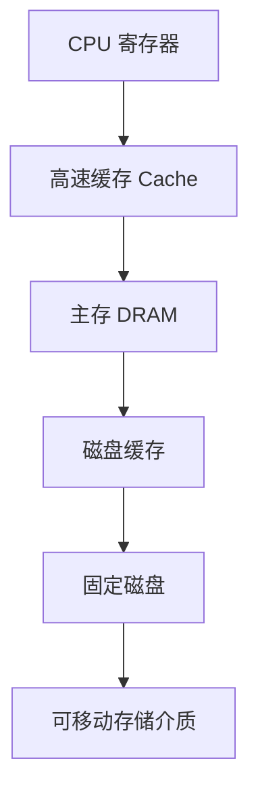

图中越向上越接近 CPU，速度越快、容量越小、单位成本越高；越向下容量越大、速度越慢，且更适合持久保存。

| 层次 | 说明 |
|---|---|
| 寄存器 | CPU 可直接使用，按字组织，最快且昂贵；微机/大型机可有几十至上百个，嵌入式系统较少 |
| Cache | 容量通常几十 KB～若干 MB，比主存快；保存主存热点，缓解 CPU—主存速度矛盾 |
| 主存 | 保存运行中进程的程序和数据；CPU 取指、取数以及与外设交换都依托主存 |
| 磁盘缓存 | 不是独立介质，而是主存中的缓冲区；暂存频繁磁盘数据，减少磁盘访问 |
| 辅存 | 固定磁盘、可移动介质；容量大、长期保存，但 CPU 不能用磁盘地址直接执行指令 |

CPU 可直接访问的存储器只有寄存器和内存，机器指令可带内存地址而不能带磁盘地址，所以程序执行前必须进入内存。

### 2. 管理对象与功能

本章管理的是内存中的 **RAM**；ROM 固化只读，外存管理见设备和文件管理。内存可视为按字/字节编址的一维单元数组。

1. **分配与回收**：静态分配在运行前一次完成；动态分配可在运行前及运行中逐步完成。
2. **内存保护**：规定读/写/执行权限并越界检查，防止进程互扰。
3. **地址映射**：把逻辑地址变换为物理地址。
4. **逻辑扩充**：借助外存，在不增加实际 RAM 的情况下提供更大地址空间。


### 3. 地址概念与 MMU

- **物理地址**：内存单元的实际编号，也称绝对/实地址；其集合为一维物理地址空间。
- **逻辑地址**：源程序经编译、链接后通常从 0 开始的相对地址，也称虚地址；其集合为逻辑地址空间，可为一维或按段组织的二维空间。
- **地址映射/重定位**：将逻辑地址转换成 CPU 最终访问的物理地址。
- **MMU**：硬件内存管理单元，运行时执行地址变换和访问检查。

最简单的基址—限长保护：基址寄存器存合法物理起点，限长寄存器存范围大小，仅当

$$
base\le physical\_address<base+limit
$$

时允许访问，否则产生地址越界中断。

---

## 二、程序的装入与链接

### 1. 从源程序到运行

图示流水线为：


### 2. 三种装入方式

| 方式 | 地址与时机 | 优点 | 局限 |
|---|---|---|---|
| 绝对装入 | 编译/程序员给出绝对地址，逻辑地址=物理地址 | 简单 | 需预知连续位置，不适合多道；位置变动须重编译 |
| 可重定位装入 | 目标模块为相对地址，装入时一次性加装入基址，即**静态重定位** | 无需专门地址变换硬件 | 装入后不能移动，不利于共享 |
| 动态运行时装入 | 模块原样装入，每次访存时由硬件动态重定位 | 可移动、可离散放置、便于共享，支持运行时地址引用 | 需要重定位寄存器/MMU，系统复杂 |

静态重定位在装入时修改指令和数据地址，一经装入不再变化。动态重定位可表达为：

$$
physical=relocation\_register+logical
$$

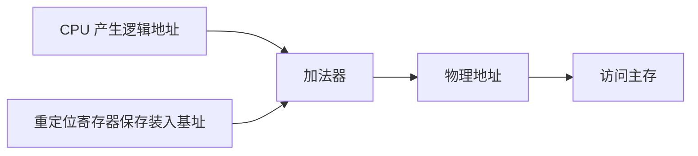

### 3. 三种链接方式

- **静态链接**：运行前把目标模块和所需库合成一个完整装入模块，修改模块间相对地址并解析外部符号；以后不拆分。
- **装入时动态链接**：装入内存时边装入边链接；模块容易修改、更新和共享。
- **运行时动态链接**：执行到尚未装入的调用模块时才寻找、装入并链接；从未执行的模块不进入内存，装入快且节省空间。

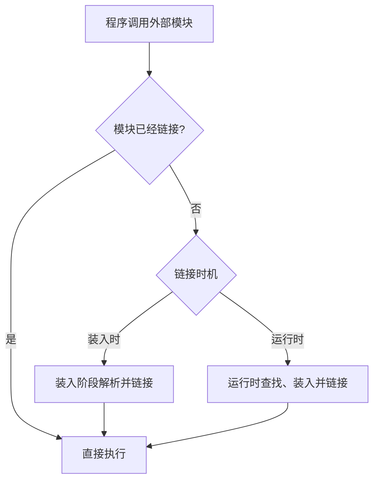

动态库（DLL/shared library）的优点：多个进程可共享同一代码副本，应用目标文件较小；接口不变时库升级可不重编应用；不同开发工具可调用统一库；运行时只链接实际用到的函数。缺点是运行时链接开销和多文件管理复杂度；装入时链接缺库常直接失败，而运行时链接可由程序按需处理失败。

---

## 三、对换与覆盖

### 1. 对换（swapping）

多道环境中，阻塞进程占用大量内存，而外存作业又因无内存不能进入，会浪费 CPU、降低吞吐量。**对换**把暂时不能运行的进程/程序/数据换出到外存，腾出空间后再换入具备条件的对象。

- **整体对换**：以整个进程为单位，也称进程对换、中级调度。
- **部分对换**：以页或段为单位，为虚拟存储提供基础。

实现进程对换要完成：对换空间管理、进程换出、进程换入。对换区强调换入/换出速度，空间利用率次之，通常连续分配，较少考虑碎片；用记录首址和大小的空闲分区表/链，分配回收类似动态分区。


对换改变进程是否驻留内存：换出释放用户区，换入则需要重新取得足够空间并恢复运行映像。

### 2. 覆盖（overlaying）

覆盖用于“程序总大小超过物理内存”的早期场景：常驻部分一直留在内存，彼此不会同时执行的模块共用同一覆盖区，需要时相互替换。覆盖树/结构由程序员声明，不需 OS 特别支持，但设计复杂，主要见于早期系统。

---

## 四、连续分配存储管理

连续分配要求一个进程的全部空间位于一段连续物理内存。依次发展为单一连续、固定分区、动态分区和动态可重定位分区。


### 1. 单一连续分配

低地址系统区供 OS 使用，其余用户区仅装一个程序，由该程序独占。管理简单、利用率低，常见于 CP/M、MS-DOS、RT11 等单用户单任务系统；为节省硬件，早期方案可能不设保护。

### 2. 固定分区分配

启动前把用户内存划为若干固定连续分区，每区只能装一个作业，是早期最简单的多道方案。

- 等大分区：小作业造成内部浪费，大作业可能装不下；适于多个同类控制任务。
- 不等大分区：配置多个小区、适量中区、少量大区，灵活性更好。

**分区使用表**记录分区号、大小、起址和是否分配。课件例：OS 占低端 20K；分区分别为 12K@20K、32K@32K、64K@64K、128K@128K，前三个已分配、最后一个空闲。装入时找满足大小的空闲分区并置为已分配；撤销时改回空闲。

### 3. 动态分区的数据结构和操作

动态/可变分区按进程实际需要划区，分区数和大小可变。

- **空闲分区表**：每个空闲区一项，含序号、起址、大小、状态；表长难预定且需额外内存。
- **空闲分区链**：在空闲区头部存控制信息、前向指针，尾部存后向指针，组成双向链；节省单独表空间但操作较慢。

分配步骤：按算法找大小不小于请求的空闲区；若剩余部分足够大则切分，若余量不超过系统阈值 `size`，则整个分区交付，避免不可用小碎片。

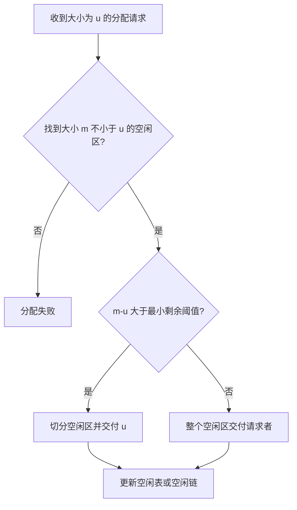

回收区 $R$ 的四种情况：

| 邻接情况 | 操作 |
|---|---|
| 仅前邻 `f1` 空闲 | `f1.size += R.size` |
| 仅后邻 `f2` 空闲 | 以 `R.addr` 为新起址，大小 `R.size+f2.size` |
| 前后都空闲 | 合并 `f1+R+f2`，删除 `f2` 项 |
| 均不空闲 | 把 R 作为新空闲区按序插入 |

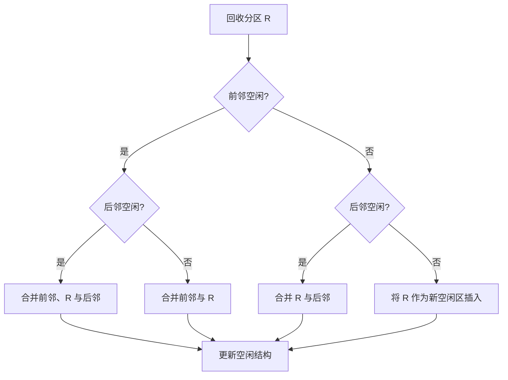

### 4. 顺序搜索分配算法

| 算法           | 空闲链组织/查找       | 特点                    |
| ------------ | -------------- | --------------------- |
| 首次适应 FF      | 地址顺序，从头取第一个可用区 | 快，保留高端大块；低端逐渐积累小碎片    |
| 循环首次/下次适应 NF | 从上次位置的下一项循环找   | 空闲区分布较均匀、查找开销小；可能缺少大块 |
| 最佳适应 BF      | 按大小升序，取第一个满足者  | 保留大块，但常产生极小而不可用的剩余区   |
| 最坏适应 WF      | 按大小降序，总取最大块    | 剩余区仍较大；可能过早消耗最大的连续空间  |

### 5. 索引搜索算法

1. **快速适应/分类搜索**：按常用容量分类，每类建立一条同尺寸空闲链，管理索引表保存各链表头。查找快、分配时不切分，不产生外部切割碎片；但按类别给整块会产生内部浪费，回收合并复杂，以空间换时间。
2. **伙伴系统**：可分配总空间 $2^m$，块大小为 $2^k$。请求 $n$ 时找 $i$ 使 $2^{i-1}<n\le2^i$；若无 $2^i$ 块，就把更大块反复均分为一对“伙伴”。回收时若伙伴也空闲则递归合并。时间优于顺序搜索、逊于分类搜索；空间优于分类搜索、略逊于顺序搜索，早期 Linux/多处理机常用。
3. **哈希算法**：以空闲区大小为关键字计算哈希位置，表项指向对应空闲链，避免类别过多造成线性查找，速度快。

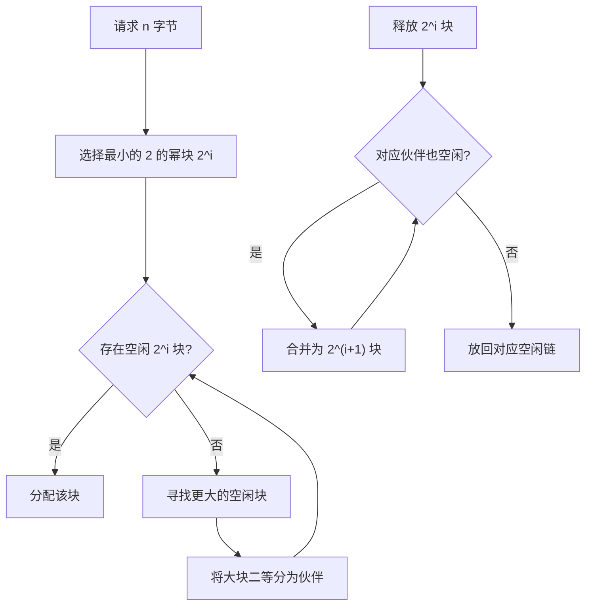

### 6. 碎片、紧凑和动态重定位

- **内部碎片**：已分配区内部未被进程利用的部分，固定分区、分页等会产生。
- **外部碎片**：分散在已分配区之间、不连续而难以利用的小空闲区，动态分区会产生；即使总量足够，也可能无法满足大请求。
- **紧凑/拼接**：把已分配作业向一端移动，将零散空闲区拼成一个大区；耗时且要求程序能移动。

动态可重定位分区在运行时用重定位寄存器加逻辑地址。紧凑后只需更新寄存器中的新基址，不必修改程序。其分配算法相当于动态分区算法加“空间总量足够但不连续时执行紧凑”。

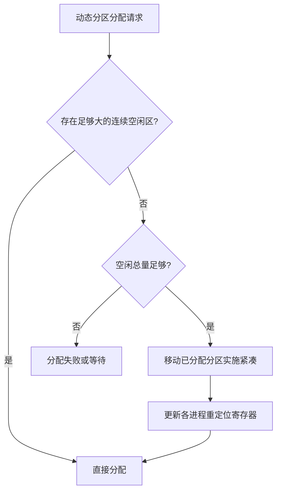

连续分区保护方式：

1. 上、下界寄存器：对每个物理地址 $D$ 检查 $lower\le D<upper$；
2. 基址、限长寄存器：先检查逻辑地址小于限长，再加基址；基址也完成重定位；
3. 保护键：内存块带“锁”键，当前作业 PSW 中带“钥匙”，不匹配则保护违例中断。

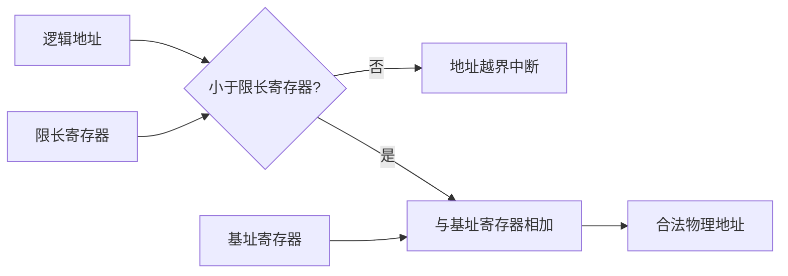

---

## 五、分页存储管理

### 1. 基本概念与碎片

分页把逻辑空间等分为固定大小的**页**，把物理内存等分为同样大小的**块/页框**，进程各页可离散装入任意空闲块。页大小由系统决定，一般为 2 的幂。

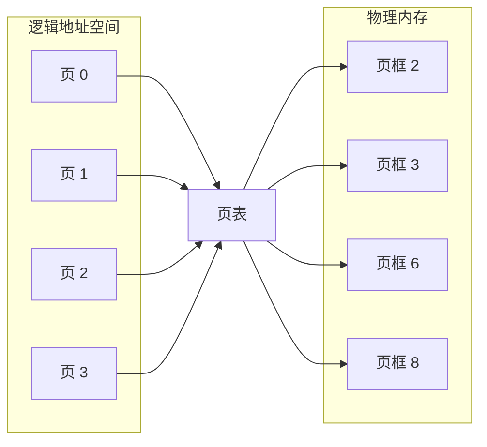

逻辑页连续编号，但可以通过页表离散映射到任意空闲页框；图中的页框编号仅用于说明离散映射，不代表固定映射规则。

- 页内仍可能有内部碎片，平均约半页；
- 不产生外部碎片，无需紧凑；
- 课件碎片图表示：连续分配中多个孔洞可经紧凑合成大孔，而分页直接利用分散页框。

### 2. 地址结构与计算

若逻辑地址空间为 $2^m$ 字节、页大小为 $2^n$ 字节，则：

$$
logical\ address=(p,d),\quad p=m-n\text{ 位},\ d=n\text{ 位}
$$

对十进制逻辑地址 $A$、页大小 $L$：

$$
p=\left\lfloor\frac A L\right\rfloor,\qquad d=A\bmod L
$$

若页 $p$ 位于块 $f$，物理地址为：

$$
PA=f\times L+d
$$

例：每块 128B=$2^7$，逻辑地址 $(357101)_8$。低 7 位为页内偏移，得到 $d=(101)_8$，高位页号 $p=(1674)_8$。

另有两组课件例题：

- 页大小 1KB、逻辑地址 `3BADH`：$3BAD_H=14\times400_H+3AD_H$，故页号 $P=0E_H$，页内位移 $W=3AD_H$；
- 页大小 2KB、同一地址 `3BADH`：$3BAD_H=7\times800_H+3AD_H$，故 $P=07_H$，$W=3AD_H$；
- 页大小 1KB、十进制地址 5168B：$P=5$，$d=48$。

课件另一例：每页 1K，页表给出第 2 页在第 8 块，偏移 452，则

$$
PA=8\times1024+452=8644
$$

### 3. 页表与基本地址变换

每个进程一张页表，页表位置记录于 PCB；第 $p$ 项保存逻辑页 $p$ 所在物理块号。调度进程时，把页表始址和长度装入**页表寄存器 PTR/PTBR**。

访问步骤：

1. CPU 产生 $(p,d)$，先检查页号是否超过页表长度；
2. 用 `PTBR + p × 页表项大小` 访问内存页表，取得块号 $f$；
3. 拼成 $(f,d)$，即 $fL+d$；
4. 再访问目标指令或数据。


基本分页因此每次逻辑访存需两次主存访问：一次查页表，一次访问数据。

### 4. TLB/快表

TLB（translation look-aside buffer，联想寄存器/快表）是小容量、按内容并行查找的高速硬件，保存近期页号—块号映射。若命中直接得块号；未命中再查内存页表并把表项装入 TLB。课件示例快表含 `3→8, 4→10, 6→5, 10→7`。

设 TLB 查询时间 $\lambda$、内存访问时间 $t$、命中率 $\alpha$，忽略其他开销：

$$
EAT=\alpha(\lambda+t)+(1-\alpha)(\lambda+2t)
=\lambda+(2-\alpha)t
$$

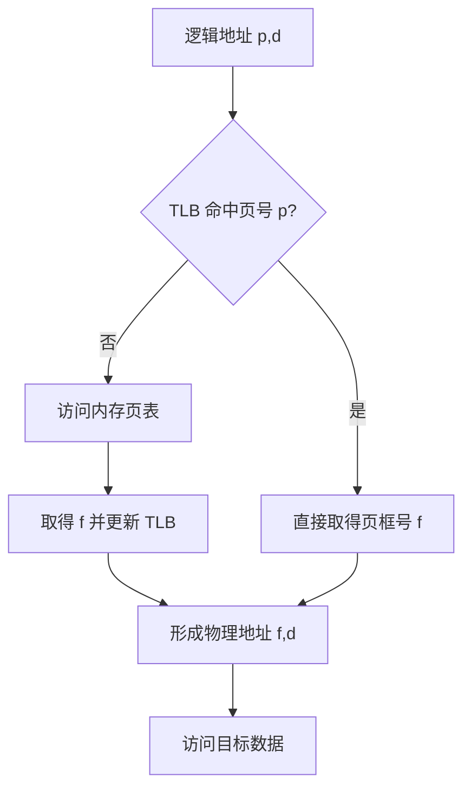

课件给出的常见 TLB 容量约 16～512 项，利用局部性命中率可达约 90%。

### 5. 两级与多级页表

大地址空间的一张线性页表会很大，可把页表本身分页，只调入需要的部分。

32 位示例：若页 4KB（偏移 12 位），页号 20 位，一级页表有 $2^{20}$ 项。若每张内层页表含 $2^{10}$ 项，可将页号分成外层 $p_1$ 10 位、内层 $p_2$ 10 位、偏移 $d$ 12 位（课件某图标注次序有 OCR 错位，应以 10/10/12 为准）。地址转换：外层页表找内层页表 → 内层页表找页框 → 拼接偏移。


64 位下若页仍为 4KB，仅两级会使外层表极大，因此需更多级。课件演算指出若内层索引 10 位，余下外层索引可达 42 位，外层可能有 4096G 项，占 16384GB 连续空间，显然不可行。

### 6. 反置页表

整个系统只建一张表，**每个物理页框一个表项**，表项保存当前驻留页的虚拟页号和所属进程标识。它把页表空间从“随虚拟空间增长”变成“随物理内存增长”，但由虚拟页寻找页框较慢；通常用哈希把搜索限制到一个或少数候选项。AS/400、IBM RISC System、IBM RT 采用过此方案。


---

## 六、分段存储管理

### 1. 引入目的与基本原理

段是有意义的逻辑单位，如主程序、子程序、数据、栈、符号表。分段便于编程、逻辑单位共享与保护、动态增长和动态链接。

每段从 0 开始、长度不等；逻辑地址为二维的 $(s,w)$（段号、段内偏移）。各段在物理内存中彼此离散，但**一个段内部连续**。

### 2. 段表与地址变换

每进程有段表，每项保存段长 `limit` 和物理基址 `base`；段表寄存器保存段表始址和长度。

1. 检查 $s<段表长度$；
2. 取第 $s$ 项，检查 $w<limit_s$；
3. 物理地址 $PA=base_s+w$；
4. 任一检查失败则越界中断。

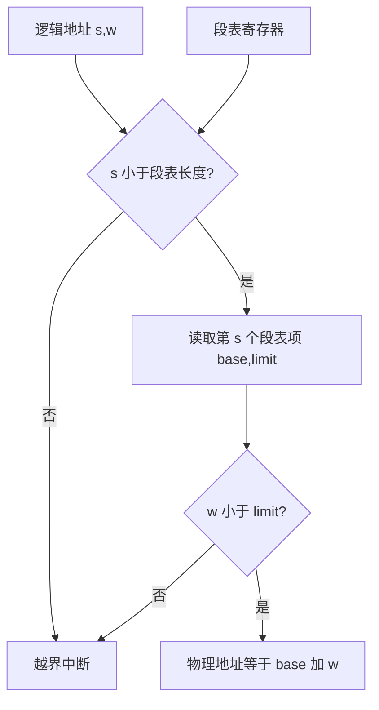

### 3. 分页与分段比较

| 比较项 | 分页 | 分段 |
|---|---|---|
| 单位意义 | 页是系统划分的物理单位，无完整逻辑意义 | 段是程序员可见的逻辑单位 |
| 大小 | 固定，由系统定 | 不固定，由逻辑信息决定 |
| 地址空间 | 一维 | 二维 `(段号,段内位移)` |
| 碎片 | 内部碎片，无外部碎片 | 外部碎片，段内无固定页造成的内部碎片 |
| 共享/保护 | 可实现但按页不自然 | 按完整逻辑段实现，方便 |

**可重入代码/纯代码**不在执行中自修改，多个进程可共享。分页共享时，各进程页表的若干项指向相同代码页框，但若程序跨页，共享需多项对应；分段共享只需各自段表的共享段项指向同一物理段。课件示例为多个进程共享 `editor` 代码，而各自拥有独立 `data`。

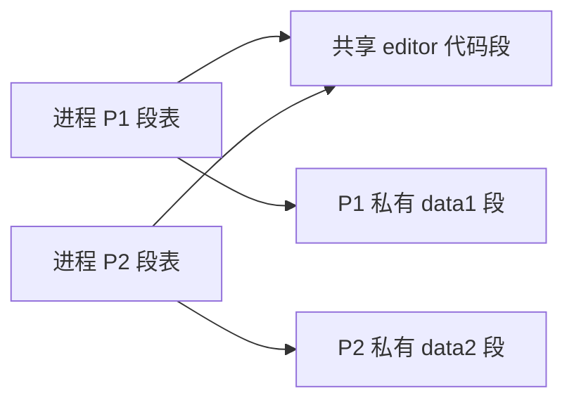

---

## 七、段页式存储管理

先把程序按逻辑划成段，再把每段划成固定大小的页。逻辑地址为：

$$
(S,P,W)=\text{段号、段内页号、页内位移}
$$

地址转换：段表项先给出该段页表的始址和段内页数 → 用 $P$ 查该段页表得到页框 $f$ → 拼接 $W$ 得物理地址。若无 TLB，通常需三次主存访问（段表、页表、数据）。


优点：保留分段的逻辑组织、共享、保护、动态链接/增长优势，又用分页消除外部碎片；代价是管理表和地址转换更复杂。

---

## 八、IA-32 / x86-64 内存管理

IA-32 的路径分两阶段：

1. CPU 生成逻辑地址（选择子+偏移）交给分段单元；
2. 分段单元产生线性地址；
3. 分页单元把线性地址映射为物理地址。

```mermaid
flowchart LR
  CPU[CPU 逻辑地址：选择子与偏移] --> SEG[分段单元]
  SEG --> LIN[线性地址]
  LIN --> PAGE[分页单元]
  PAGE --> PHY[物理地址]
  PHY --> MEM[物理内存]
```

经典 IA-32 使用二级分页；为访问大于 4GB 的物理地址可用 PAE。课件还介绍适配 32/64 位的多级模式。x86-64 实际不直接使用全部 64 位：课件给出四级分页、常用 48 位虚拟地址和至多 52 位物理地址，支持 4KB、2MB、1GB 页。48 位地址按 9/9/9/9/12 位拆成 PML4、页目录指针表、页目录、页表和页内偏移；高 16 位是规范地址的符号扩展。

```mermaid
flowchart LR
  VA[48 位规范虚拟地址] --> L4[PML4 索引 9 位]
  L4 --> L3[页目录指针表索引 9 位]
  L3 --> L2[页目录索引 9 位]
  L2 --> L1[页表索引 9 位]
  L1 --> OFF[页内偏移 12 位]
  OFF --> PA[物理地址]
```

---

## 九、复习公式与易错点

1. $p=\lfloor A/L\rfloor,\ d=A\bmod L$；物理地址 $=fL+d$。
2. 页面 $2^n$ 字节意味着低 $n$ 位是页内偏移。
3. 基本一级分页：一次逻辑访问通常两次主存；多级页表再增加逐级访存，TLB 可显著降低平均时间。
4. 页固定、段可变；页是物理划分，段是逻辑划分。
5. 固定分区主要产生内部碎片；动态连续分区主要产生外部碎片；分页消除外部碎片但最后一页仍有内部碎片。
6. 静态重定位后不能移动；紧凑必须依赖动态重定位。
7. 分配算法中的“最佳”指剩余最小，不代表整体性能最佳。

知识结构图转写：本章从存储层次和地址绑定出发，依次讨论程序装入/链接、连续分配和离散分配；离散分配分为分页、分段及二者结合，并以 IA-32/x86-64 为实际体系结构案例。

---

## 十、作业与课程思政

第八次作业（后半课件原 PDF 第 57 页，黄色标注）：

- **简答题**：1、2、3、4；
- **计算题**：12、13、14；
- **综合应用题**：18、19。

课程思政材料回顾 Windows 10：微软 2014 年 10 月展示系统，2015 年 7 月 29 日发布正式版。课件以网络安全审查及源代码不可完全审计为例，强调国外基础软件必须可控，操作系统是安全可控信息技术体系核心；我国可结合开源 Linux 生态，坚持自主创新，发展安全可靠、自主可控的国产操作系统。

## 图片信息转写审计

> 两份 MinerU 课件共包含 **155 个图片引用**，且均指向不同文件。以下编号分别按两份 `full.md` 中的出现顺序计算；所有编号都已纳入 Mermaid、原生表格、公式或文字说明，最终笔记不保留图片。

### 1. 前 3 课时：图片 1～45

| 编号 | 原图内容 | 原生承接方式 |
|---|---|---|
| 1 | 本章知识结构树 | “存储器管理”思维导图及主要内容 |
| 2 | 多层存储器金字塔 | 存储层次 Mermaid 与层次表 |
| 3～5 | 重复 OS 标志 | 装饰图，不增加知识信息 |
| 6～7 | 缓存分块示例与 CPU/主存/辅存层次 | 存储层次 Mermaid、缓存文字说明 |
| 8～12 | 章节数字圆形图标 | 导航装饰，不增加知识信息 |
| 13～16 | CPU/内存照片、字节位图、动态重定位布局与重定位寄存器 | 地址概念、重定位公式和 Mermaid |
| 17～19 | 步骤数字菱形图标 | 导航装饰，不增加知识信息 |
| 20 | 编译、链接、装入三阶段流程 | “从源程序到运行”Mermaid |
| 21～23 | 趋势图标与办公场景照片 | 装饰图，不增加知识信息 |
| 24 | OS、进程和基址/界限布局 | 基址—限长保护公式与说明 |
| 25 | 工具图标 | 装饰图，不增加知识信息 |
| 26～29 | 静态重定位、装入链接与动态地址重定位实例 | 三种装入方式表、重定位公式和 Mermaid |
| 30～32 | 主页、层次、锁图标 | 导航装饰，不增加知识信息 |
| 33～36 | 模块 A/B/C 的静态链接、装入时链接与运行时链接 | 链接方式说明和运行时链接 Mermaid |
| 37～44 | 人物、工具、主页、层次和锁图标 | 导航装饰，不增加知识信息 |
| 45 | 内存与对换区之间的换出、换入 | 对换 Mermaid |

### 2. 前 3 课时：图片 46～90

| 编号 | 原图内容 | 原生承接方式 |
|---|---|---|
| 46～50 | 步骤数字菱形图标 | 导航装饰，不增加知识信息 |
| 51 | OS、公用程序、驻留监控与两个分批的内存布局 | 单一连续和固定分区文字说明 |
| 52～54 | 锁、主页、层次图标 | 导航装饰，不增加知识信息 |
| 55 | DOS 低端内存映像 | 单一连续分配与系统区说明 |
| 56～59 | 箭头编号装饰 | 导航装饰，不增加知识信息 |
| 60 | 连续分区随进程装入、释放发生变化 | 连续分配演进及碎片说明 |
| 61 | 空闲分区双向链 | 空闲分区链结构文字说明 |
| 62～63 | 动态分区查找、切分与回收流程 | 分配流程 Mermaid |
| 64～68 | 回收区前后邻接的四种情况 | 回收表和回收决策 Mermaid |
| 69～71 | 趋势图标和办公照片 | 装饰图，不增加知识信息 |
| 72～74 | 碎片化内存、空闲分区链和空闲分区表 | 动态分区数据结构与碎片说明 |
| 75 | 伙伴系统 256KB 递归二分 | 伙伴系统 Mermaid 与算法说明 |
| 76～81 | 设备/办公照片、主页/层次/锁图标 | 装饰图，不增加知识信息 |
| 82～85 | 进程释放后孔洞分散及紧凑后的连续大孔 | 紧凑流程 Mermaid 与文字说明 |
| 86～87 | 紧凑后的动态重定位与动态分区算法 | 重定位公式和动态可重定位 Mermaid |
| 88～90 | 上下界、基址限长与保护键示意 | 连续分区保护说明和 Mermaid |

### 3. 后 3 课时：图片 1～32

| 编号    | 原图内容                    | 原生承接方式                      |
| ----- | ----------------------- | --------------------------- |
| 1     | 本章知识结构树                 | 主要内容与存储器管理思维导图              |
| 2～4   | 连续分区释放、移动与紧凑布局          | 碎片和紧凑说明                     |
| 5～9   | 菱形和 OS 标志               | 导航装饰，不增加知识信息                |
| 10    | CPU、页号/偏移、页表与物理内存       | 基本分页地址转换 Mermaid            |
| 11～12 | 重复 OS 标志                | 装饰图，不增加知识信息                 |
| 13～15 | 逻辑内存、页表与 16 位地址拆分例题     | 地址结构公式及 `3BADH` 例题          |
| 16～18 | 设备和办公照片                 | 装饰图，不增加知识信息                 |
| 19    | 逻辑页到离散页框的映射             | 分页映射 Mermaid                |
| 20～23 | 页表寄存器、页表、TLB 命中/未命中地址转换 | 页表与 TLB 两个 Mermaid、EAT 公式   |
| 24～29 | 主页、层次、锁、数据库、扩展与统计图标     | 导航装饰，不增加知识信息                |
| 30～31 | 两级页表与外层页表结构             | 多级页表 Mermaid 与 10/10/12 位说明 |
| 32    | `pid,p,d` 经反置页表得到物理地址   | 反置页表 Mermaid                |

### 4. 后 3 课时：图片 33～65

| 编号 | 原图内容 | 原生承接方式 |
|---|---|---|
| 33～35 | 由主程序、子程序、栈、符号表组成的分段逻辑空间及离散装入 | 分段原理和二维地址说明 |
| 36～45 | 主页、层次、锁、人物与工具图标 | 导航装饰，不增加知识信息 |
| 46～47 | 作业各段经段表映射到物理内存及越界检查 | 分段地址转换 Mermaid |
| 48～50 | 设备和办公照片 | 装饰图，不增加知识信息 |
| 51～57 | 两个进程共享 editor、各自保留 data 段及段表指向 | 共享代码 Mermaid 与文字说明 |
| 58～60 | 趋势图标和办公照片 | 装饰图，不增加知识信息 |
| 61～62 | 分段单元、分页单元及段页式地址转换细节 | 段页式与 IA-32 地址路径 Mermaid |
| 63～64 | x86 多级页目录、页表和页框 | x86-64 四级分页 Mermaid 与位数说明 |
| 65 | 本章知识结构树 | 与图片 1 对照，内容由主要内容和思维导图承接 |

审计结果：**155/155 个图片引用均已处理**；本章共有 22 个 Mermaid 图，所有表格均为 Obsidian 原生 Markdown 管道表格，最终文件不存在图片语法、HTML 表格、Dataview 或 MinerU 图片路径。
