# 6.1 虚拟存储器

> 本笔记合并第 6 章 Part I、II，系统整理局部性、请求分页、页面置换、抖动与工作集、请求分段及 Windows/Linux 实例。缺页流程图、置换过程图、Clock 环、利用率曲线、共享段和保护环图均已转写，内容不依赖原图。

## 主要内容

- 局部性原理、虚拟存储器的定义与特征
- 请求分页的页表、缺页中断、地址变换与调页
- 驻留集分配策略和物理块分配算法
- OPT、FIFO、LRU、Clock、LFU、PBA
- Belady 异常、有效访问时间
- 抖动、工作集和缺页率控制
- 请求分段、共享段和分段保护
- Windows XP 与 32 位 Linux 虚拟存储实例

课件章末知识导图可用下列 Obsidian 原生 Mermaid 重构：

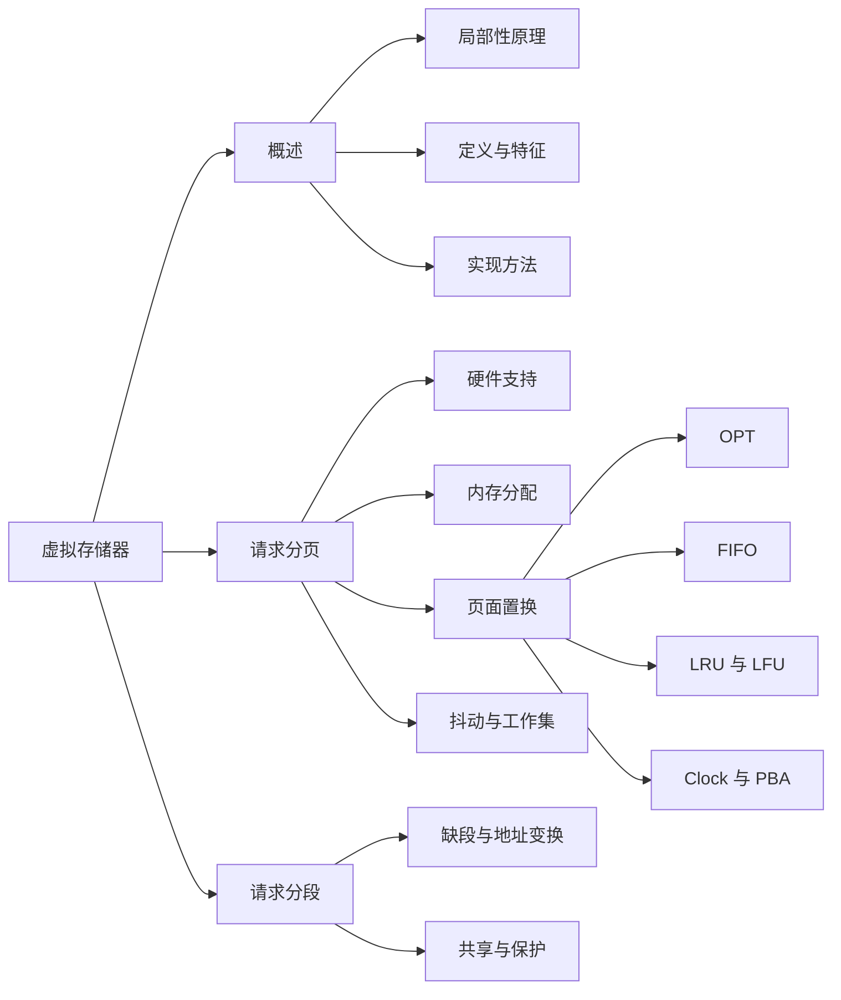

---

## 一、虚拟存储器概述

### 1. 为什么需要虚拟存储

常规管理要求作业**一次性全部装入**且运行期间**一直驻留**：大作业可能装不下，内存中暂不用的代码/数据又挤占空间，只能运行少量作业。物理扩容成本高，更普遍的办法是借助外存逻辑扩充内存。

### 2. 局部性原理

Denning 指出，程序多数时间顺序执行；过程调用虽会转移执行区域，但深度通常有限；循环会反复执行；数据结构访问也往往集中在小范围。

- **时间局部性**：刚执行的指令/访问的数据不久可能再次使用。
- **空间局部性**：访问某单元后，邻近单元近期可能被访问。

Peter J. Denning 的工作集模型把进程最近使用的页面集合用于动态内存分配，为虚拟存储资源管理提供基础。人物照片和论文页面截图只说明此历史背景，无额外算法信息。

局部性的直接应用：

1. **部分装入**：只装入当前要执行的页/段即可启动；
2. **请求调页/段**：访问不在内存的内容时由 OS 调入；
3. **置换**：无空闲空间时换出某页/段；
4. 使大程序能在小内存运行，同时提高并发度。

### 3. 定义和特征

**虚拟存储器**是具有请求调入和置换功能、从逻辑上扩充内存容量的存储系统。完整程序保存在外存，当前局部驻留内存。其逻辑容量受处理器地址空间和外存容量约束，并非简单无限；理想效果是速度接近主存、单位成本接近外存。

四个特征：

- **多次性**：程序、数据可分多次调入；
- **对换性**：运行时可换入、换出，不必常驻；
- **虚拟性**：用户看到的地址空间远大于实际内存；
- **离散性**：物理内存通常离散分配。

实现方式：请求分页（页表+缺页中断+地址变换；调页和页面置换软件）、请求分段（段表+缺段中断+地址变换；调段和段置换软件）、段页式虚存（在段页式上增加请求调页/置换，Intel 80386 以后体系结构支持类似组合）。

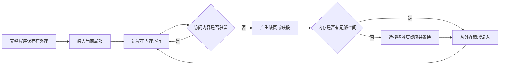

---

## 二、请求分页的硬件与缺页处理

### 1. 请求页表项

普通页表上扩展：

| 字段 | 作用 |
|---|---|
| 页号、物理块号 | 完成页到页框映射 |
| 存在/状态位 `P` | 1 表示在内存，0 表示不在 |
| 访问字段 `A/R` | 记录是否/多少次被访问，为置换提供依据 |
| 修改/脏位 `M` | 1 表示调入后修改过，换出前须写回 |
| 外存地址 | 该页在文件区或交换区的位置 |

### 2. 缺页中断特点

地址转换发现 `P=0` 时产生缺页异常，OS 根据外存地址调页。它与普通外部中断不同：

- 发生在**一条指令执行期间**；
- 同一指令可能产生多次缺页，如跨页复制指令的源、目的和指令本身可涉及多页；
- 处理后要精确回到引发缺页的指令重新执行，硬件/OS 必须保存足够状态。

课件跨页图：`COPY A TO B` 指令自身跨两个页，源区 A、目的区 B 又各跨两个页，极端情况下可涉及 6 个缺页事件。

### 3. 地址变换与缺页流程

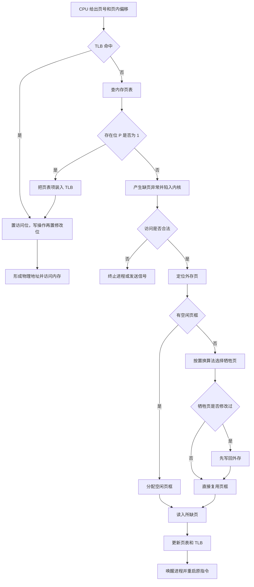

地址变换图与缺页中断图在课件中分开绘制；上图将两者按实际控制流合并，同时保留非法访问、脏页写回和重启原指令三个关键分支。

1. CPU 给出页号与偏移，先检索 TLB；命中则置访问位，写操作再置修改位，直接形成物理地址。
2. TLB 未命中，访问内存页表。
3. 若 `P=1`，把映射装入 TLB（必要时替换 TLB 项），形成物理地址。
4. 若 `P=0`，硬件陷入内核，保存现场并进入缺页处理程序。
5. 检查引用是否合法；非法则终止/发信号。合法则定位外存页。
6. 有空闲页框就直接分配；否则运行置换算法选牺牲页，把其页表项置无效。若牺牲页 `M=1`，先写回磁盘。
7. 从外存读入所缺页，更新页表/TLB中的块号、P/A/M，唤醒进程并重启原指令。

流程图还强调：调页 I/O 期间当前进程阻塞，CPU 可调度其他就绪进程；磁盘完成中断后该进程才恢复。

---

## 三、驻留集、物理块分配与调页策略

### 1. 最小物理块数

进程至少要有足够页框使一条最复杂指令能够执行。下限取决于指令格式、功能和寻址方式：例如指令页、源操作数页、目的操作数页可能同时需要驻留。

### 2. 分配与置换范围

| 组合 | 做法 | 特点 |
|---|---|---|
| 固定分配+局部置换 | 运行前给固定页框，缺页只能换本进程页 | 隔离性好；固定值难选 |
| 可变分配+全局置换 | 先分一定页框，缺页优先取系统空闲框；耗尽后可换任意进程页 | 灵活但进程互相影响 |
| 可变分配+局部置换 | 按缺页率动态增减本进程页框，置换限于本进程 | 能让多数进程维持近似性能 |

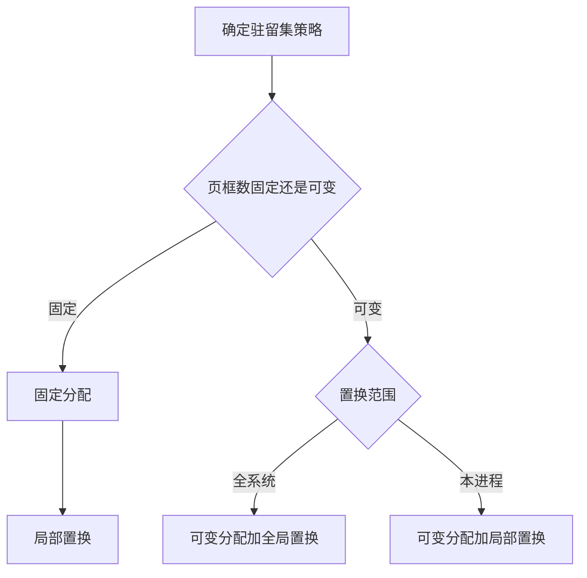

固定分配与全局置换的组合在课件中未列为实用策略，因为“固定”与可从其他进程抢页框的“全局”语义冲突。

### 3. 物理块分配算法

- **平均分配**：$m$ 个可用块平均给 $n$ 个进程；未考虑大小，例如 200 页进程与 10 页进程同得 20 块显然不合理。
- **按比例分配**：若进程大小 $S_i$，总页数 $S=\sum S_i$，则

$$
b_i=\frac{S_i}{S}m
$$

取整且不得低于最小物理块数。
- **考虑优先权**：一部分按大小比例分配，另一部分按优先级追加；实时系统也可主要按优先级。

### 4. 页面调入策略

- **预调页**：预测后一次调入若干相邻/相关页，命中预测可减少中断，预测错会浪费 I/O 和内存。
- **请求调页**：真正访问缺失页时才调，精确但每次缺页有停顿。

来源选择：交换区足够时可统一从交换区调；交换区不足时，未修改文件页直接从文件区读，换出时无需写；UNIX 常把从未运行过的页从文件区调入，运行后换出的匿名/修改页从交换区调入。

### 5. 缺页率与代价

若成功访问 $S$ 次、失败 $F$ 次，总数 $A=S+F$：

$$
f=\frac{F}{A}
$$

影响因素：页大小、分配页框数、置换算法和程序局部性。若牺牲页被修改概率为 $\beta$，缺页服务时间可写成：

$$
t_{pf}=\beta t_{dirty}+(1-\beta)t_{clean}
$$

课件例：普通内存访问 200ns，平均缺页处理 8ms，缺页概率 $p$：

$$
EAT=(1-p)\cdot200+p\cdot8{,}000{,}000
=200+7{,}999{,}800p\ \text{ns}
$$

若每 1000 次一次缺页，即 $p=0.001$，$EAT\approx8.2\mu s$，约慢 40 倍，说明缺页即使很少也很昂贵。

请求分页的优点是虚拟空间大、内存利用率与并发度高、用户无需手工覆盖；缺点是中断与磁盘 I/O 开销、页表管理空间和页内碎片。

---

## 四、页面置换算法

目标是换出未来不再或较晚使用的页；未来不可知，只能按局部性用历史近似预测。

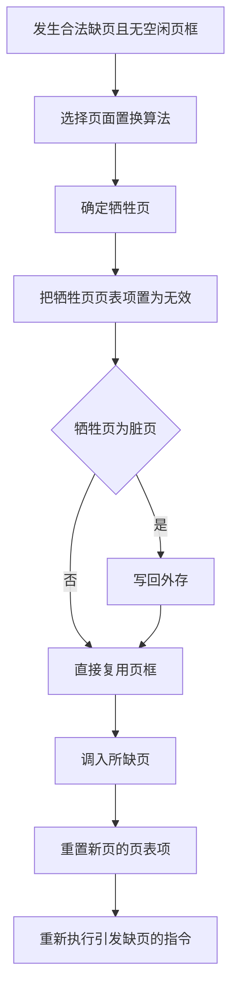

### 1. OPT（最佳）

换出未来永不使用或下一次使用距现在最远的页，缺页数最低，但实际不能预知，只作理论下界和评价基准。

课件引用串：

```text
7,0,1,2,0,3,0,4,2,3,0,3,2,1,2,0,1,7,0,1
```

三个页框初装 `7,0,1`，访问 2 时，OPT 淘汰 7，因为其下一次使用最远；图中随后按同样原则比较未来距离。

### 2. FIFO 与 Belady 异常

换出进入内存最早的页，可用队列实现。简单但老页可能正是热点，会反复换入换出。

引用串 `A B C D A B E A B C D E`：

- 3 个页框：缺页 9 次，缺页率 $9/12=75\%$；
- 4 个页框：缺页反而 10 次，缺页率 $10/12\approx83\%$。

页框更多而 FIFO 缺页更多称 **Belady 异常**。FIFO 不具有栈算法的包含性质；OPT、LRU 不会出现该异常。

### 3. LRU（最近最久未使用）

淘汰过去最长时间未使用的页，以“最近的过去”近似“最近的将来”，通常接近 OPT，但精确记录访问先后开销大。

- **时间戳/计数寄存器**：每页记录最近访问时间；选最小者。
- **栈**：访问页移到栈顶，栈底即 LRU；每次引用需调整结构。
- **老化近似**：每页一移位寄存器，周期性右移并把本周期访问位移入最高位，数值最小者最久未用。课件 8 页、8 位寄存器表即比较二进制历史值。

对同一 `A...E` 引用串、4 页框，课件 LRU 示例缺页 10 次，缺页率约 83%。

课件的 FIFO、LRU 置换图使用另一条 20 次引用串。为避免宽达 20 列的图片式表格造成 Obsidian 卡顿，下面按访问顺序纵向重建三种算法；“缺”表示本次产生缺页。

| 次序 | 引用页 | OPT 页框 / 结果 | FIFO 页框 / 结果 | LRU 页框 / 结果 |
|---:|---:|---|---|---|
| 1 | 7 | `7/—/—`，缺 | `7/—/—`，缺 | `7/—/—`，缺 |
| 2 | 0 | `7/0/—`，缺 | `7/0/—`，缺 | `7/0/—`，缺 |
| 3 | 1 | `7/0/1`，缺 | `7/0/1`，缺 | `7/0/1`，缺 |
| 4 | 2 | `2/0/1`，缺 | `2/0/1`，缺 | `2/0/1`，缺 |
| 5 | 0 | `2/0/1` | `2/0/1` | `2/0/1` |
| 6 | 3 | `2/0/3`，缺 | `2/3/1`，缺 | `2/0/3`，缺 |
| 7 | 0 | `2/0/3` | `2/3/0`，缺 | `2/0/3` |
| 8 | 4 | `2/4/3`，缺 | `4/3/0`，缺 | `4/0/3`，缺 |
| 9 | 2 | `2/4/3` | `4/2/0`，缺 | `4/0/2`，缺 |
| 10 | 3 | `2/4/3` | `4/2/3`，缺 | `4/3/2`，缺 |
| 11 | 0 | `2/0/3`，缺 | `0/2/3`，缺 | `0/3/2`，缺 |
| 12 | 3 | `2/0/3` | `0/2/3` | `0/3/2` |
| 13 | 2 | `2/0/3` | `0/2/3` | `0/3/2` |
| 14 | 1 | `2/0/1`，缺 | `0/1/3`，缺 | `1/3/2`，缺 |
| 15 | 2 | `2/0/1` | `0/1/2`，缺 | `1/3/2` |
| 16 | 0 | `2/0/1` | `0/1/2` | `1/0/2`，缺 |
| 17 | 1 | `2/0/1` | `0/1/2` | `1/0/2` |
| 18 | 7 | `7/0/1`，缺 | `7/1/2`，缺 | `1/0/7`，缺 |
| 19 | 0 | `7/0/1` | `7/0/2`，缺 | `1/0/7` |
| 20 | 1 | `7/0/1` | `7/0/1`，缺 | `1/0/7` |

结果为 OPT 9 次缺页、FIFO 15 次缺页、LRU 12 次缺页。OPT 只作为理论下界；FIFO 与 LRU 的页框排列位置仅表示三个物理框中的内容，不表示队列或栈的逻辑先后。

### 4. 简单 Clock / Second Chance

课件称最近未使用 NRU，是 FIFO 与 LRU 的折衷：所有驻留页组成环形队列，每页访问位置 `A`；页被访问置 1。

置换时从时钟指针开始：遇 `A=1` 清零并前进，给第二次机会；首次遇 `A=0` 就淘汰，指针停到下一项。课件实例的原环为 `23(1) → 12(1) → 6(1) → 36(0) → 25(1) → 2(1) → 11(0) → 8(0) → 23(1)`。指针从页面 12 开始，新页 9 到来后依次把 12、6 的访问位清 0，再用 9 替换首次遇到的 `36(0)`，指针移到页面 25。


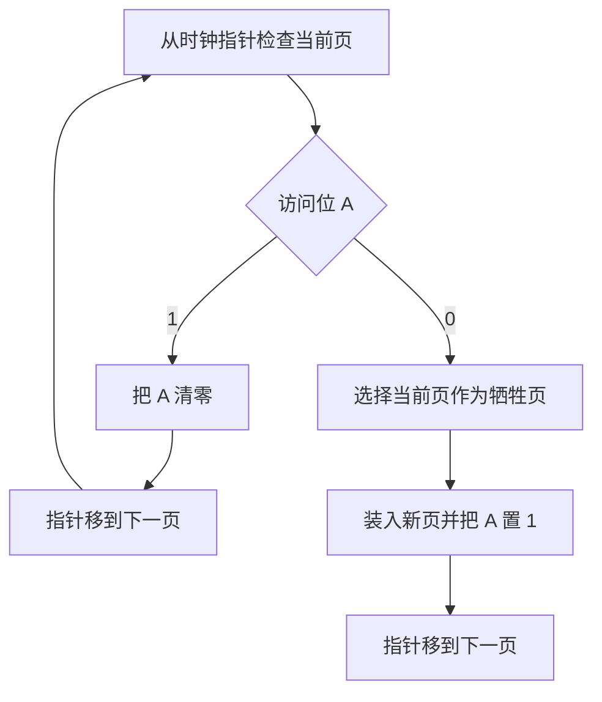

### 5. 改进型 Clock

同时考虑访问位 A 和修改位 M，按淘汰优先级分四类：

1. `(0,0)` 未访问、未修改——最佳；
2. `(0,1)` 未访问、已修改——可选但需写回；
3. `(1,0)` 已访问、未修改；
4. `(1,1)` 已访问、已修改。

算法：第一轮找 `(0,0)`；没有则第二轮找 `(0,1)`，沿途把 A 清 0；仍无则回到起点，重复第一轮。这样兼顾近期使用和写回成本。

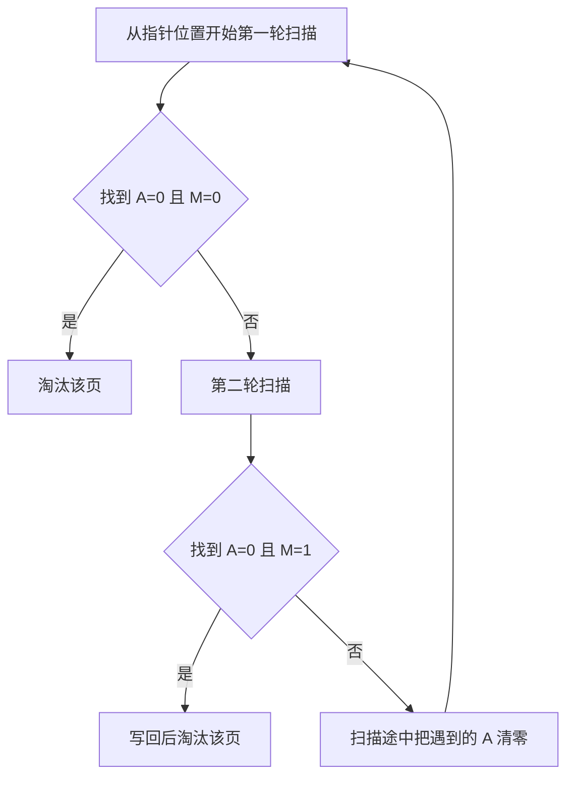

### 6. LFU（最不常用）

选择累计/近期访问次数最少的页。实现可为每页访问计数器，访问即加一，缺页时淘汰最小者后重置；或用移位历史并比较位和/权值。问题是旧历史可能压过新阶段的局部性，因此常配合衰减。

### 7. 页面缓冲算法 PBA

PBA 采用可变分配、局部置换和 FIFO，但把“换出”分成逻辑淘汰与物理复用：

- 未修改页放入**空闲页面链表**末尾，内容暂保留；
- 修改页放入**已修改页面链表**，可成批写回；
- 若刚淘汰页很快又被引用且尚未复用，可直接从链表找回，无需磁盘读。

它降低换入换出频率和 I/O 开销，实现简单、无需复杂硬件，VAX/VMS 曾采用。页面效率还取决于置换算法、写回磁盘频率、预读频率。

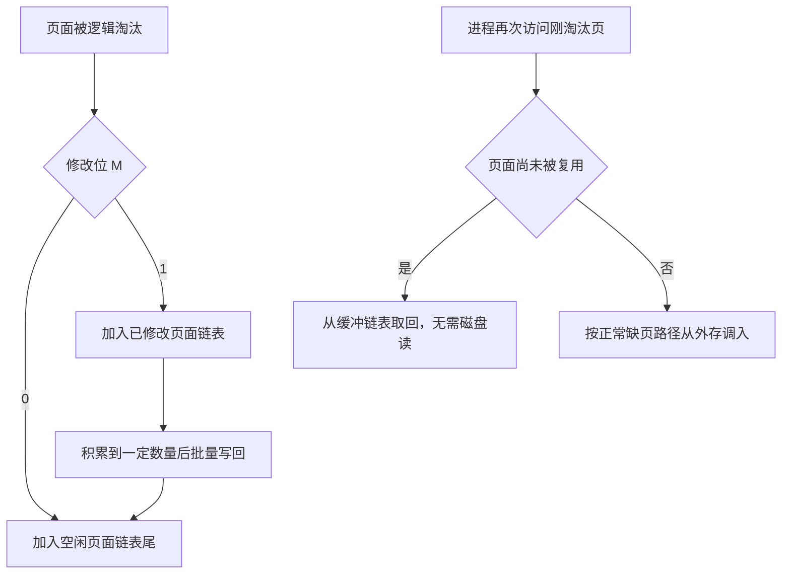

### 8. 有效访问时间

课件在本节用 $\lambda$ 表示一次 TLB/页表相关查询时间、$t$ 表示实际内存访问、$\varepsilon$ 表示缺页处理时间，列出三种路径：

$$
\begin{aligned}
TLB命中 &: \lambda+t\\
页在内存但TLB未命中 &: 2(\lambda+t)\\
页不在内存 &: \varepsilon+2(\lambda+t)
\end{aligned}
$$

实际 EAT 应再按各路径概率加权，且精确式取决于硬件是否并行查 TLB、页表层级和 Cache。

---

## 五、抖动与工作集

### 1. 抖动原因

**抖动（thrashing）**是进程的页面频繁换入换出，系统多数时间用于分页而非执行。反馈链：页框不足 → 缺页率高、CPU 利用率低 → OS 误以为并发度不足而加入新进程 → 每进程页框更少 → 缺页更严重。


处理机利用率曲线转写：随进程数增加，利用率先上升到 $N_{max}$ 附近；超过内存可支持的并发度后迅速下降进入抖动区。图中的 CPU 饱和线只是理论上界。缺页率—页框数曲线则单调下降，可设上、下阈值动态调节驻留集。

根因是同时运行的进程过多，使每个进程分得物理块少于当前局部性所需集合。

### 2. 工作集

在时刻 $t$ 前长度为 $\Delta$ 的窗口内实际访问过的不同页集合：

$$
W(t,\Delta)=\{\text{最近 }\Delta\text{ 次/时间内访问的页}\}
$$

$\Delta$ 为工作集窗口，工作集随 $t$ 变化；对固定 $t$，它关于窗口非降：

$$
W(t,\Delta)\subseteq W(t,\Delta+1)
$$

课件序列 `24,15,18,23,24,17,18,24,18,17,17,15,24,17,24,18` 的表逐项展示窗口 3/4/5 中的去重页面。例如前四次访问后：窗口 3 为 `{23,18,15}`，窗口 4 为 `{23,18,15,24}`；窗口越大，集合只会相同或扩大。

```mermaid
flowchart LR
  A[页面引用流] --> B[取时刻 t 前长度为 Delta 的窗口]
  B --> C[去除窗口中的重复页号]
  C --> D[得到工作集 W(t, Delta)]
  D --> E[以工作集大小估计所需驻留页框]
  E --> F{系统能否容纳各进程工作集之和}
  F -->|是| G[允许进程继续运行]
  F -->|否| H[暂停或换出部分进程]
```

### 3. 预防抖动

1. 采用局部置换，避免一个进程抢走其他进程的工作集；
2. 把工作集大小纳入处理机调度，仅当总工作集可装入时接纳/唤醒进程；
3. 用缺页率上下限动态增减页框；
4. 用 `L=S` 准则：$L$ 为两次缺页平均间隔，$S$ 为一次缺页平均服务时间。$L>S$ 表示缺页较少；$L<S$ 表示分页设备跟不上、应暂停部分进程；$L\approx S$ 时磁盘和 CPU 可接近协调利用。

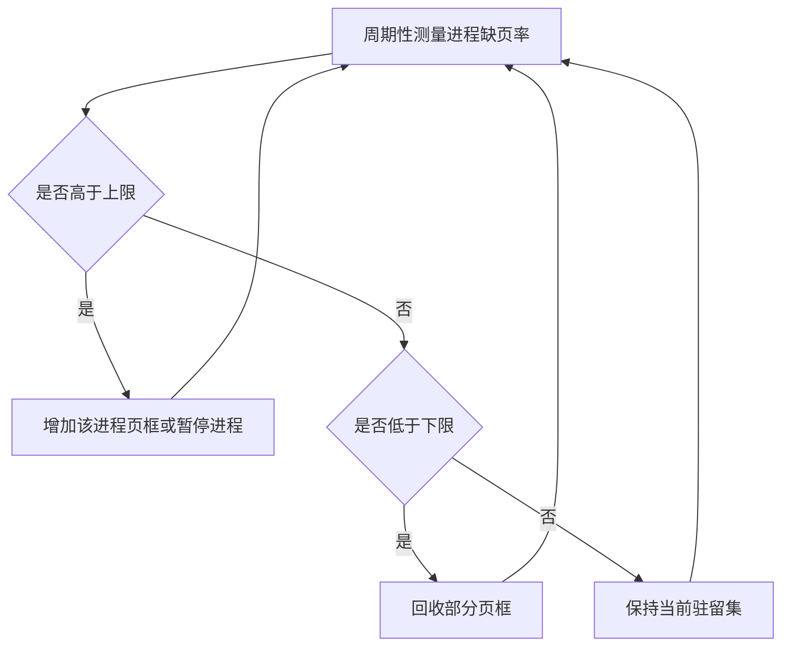

---

## 六、分页实现中的系统问题

OS 在不同生命周期执行：

- **创建**：建并初始化页表，分配交换区；
- **运行/切换**：装载 MMU 上下文，刷新或按 ASID 管理 TLB；
- **页面失效**：由故障地址/PC 判断页，分配页框并调页；
- **终止**：释放页表、私有页和交换区，共享页按引用计数保留。

**指令备份**：精确保存 PC 和相关状态，确保缺页处理后重启正确。**页面锁定/pinning**：DMA 与 CPU 并行时，正在作为 I/O 缓冲的物理页不能被换出，否则设备会写入错误页框。

后备存储是页面置换时保存内容的交换区，可在进程创建时固定预留，也可在换出时动态分配；可由专用交换分区或临时磁盘文件实现，并记录空间增长和页位置。

---

## 七、请求分段、共享与保护

### 1. 请求段表与缺段

请求分段以整个逻辑段为换入换出单位，只预装必要段。段表除基址、长度外还含：存取属性（只执行/只读/读写）、访问字段 A、修改位 M、存在位 P、增补/增长位、外存始址。

访问 $(s,w)$ 时：检查段号、段内位移和权限；若 P=0，触发缺段。由于段长不固定，调入时需要寻找足够大的连续区：若无合适空闲区，检查空闲总量；总量够则紧凑，不够则置换一个或多个段，再调入并更新段表。因此缺段处理比缺页复杂。流程图依次为“合法/权限检查 → 是否驻留 → 分配/紧凑/淘汰 → 调段 → 更新段表 → 重启”。

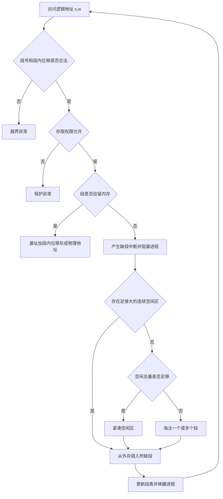

### 2. 共享段表

系统共享段表记录：段名、段长、内存始址、状态位、外存始址、共享进程计数 `count`、存取控制，以及每个共享者的进程名/号、该进程中的段号和权限。

- 首个进程请求：分配内存、调入共享段、建立其段表项和系统共享段项，`count=1`；
- 后续进程：只建立本进程段表映射和共享者记录，`count++`；
- 释放：删除本进程段表项，`count--`；若变 0 才回收内存并删系统共享段项，否则只删本进程记录。

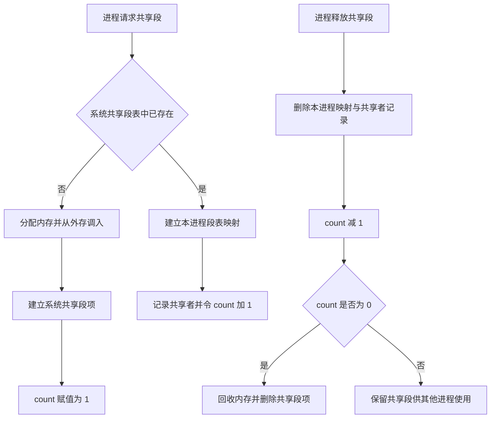

### 3. 分段保护

1. **越界**：比较段号与段表长度，再比较 $w$ 与该段长度（课件一句“段内地址与段表长度”应理解为段内地址与段长）。
2. **存取控制**：按段的读/写/执行字段由硬件检查。
3. **环保护**：编号越小特权越高。程序可访问相同环或更外层（较低特权）数据；可调用同环或更内层（较高特权）服务，但跨环调用须经受控入口。图中左图表示外环经门调用内环服务并返回，右图表示内环可向外访问数据。

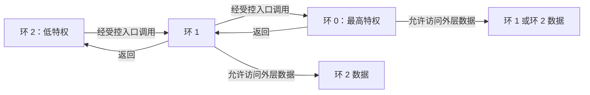

普通数据访问不能从外环越权读取内环数据；跨环调用也不是任意跳转，而必须通过系统规定的门或受控入口。

---

## 八、系统实例

### 1. Windows XP

采用请求调页和**簇式调页**：缺页时不仅调故障页，也调其邻近页。创建进程时设工作集最小、最大值：驻留时保证最小值，内存充足可增长至最大值；维护带阈值的空闲页框链表，采用局部置换。80x86 上课件列出改进型 Clock。

### 2. 32 位 Linux

4GB 线性虚拟空间典型划分：用户空间 `0～3GB`（到 `0xC0000000`），由各用户进程通过 MMU 使用请求分页；内核空间 `3～4GB`，所有进程映射内核部分，物理页由 zoned buddy 管理，小对象由 slab 分配器管理。

虚存子系统结构图转写：应用经 glibc/系统调用进入内核；内核子系统与 slab、kswapd、bdflush 等协作；zoned buddy 提供物理页，MMU 映射物理内存；磁盘驱动连接磁盘/交换区。`kswapd` 回收页，`bdflush` 类机制负责回写脏数据（具体线程名随现代内核演进，课件讲的是经典结构）。

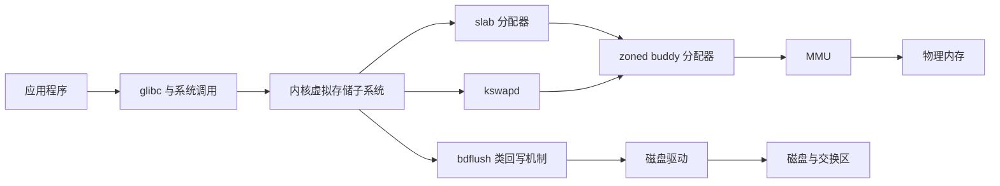

---

## 九、复习对比

| 算法 | 淘汰依据 | 实现性/特点 |
|---|---|---|
| OPT | 未来最晚使用 | 不可实现，性能基准 |
| FIFO | 最早进入 | 简单，可能 Belady 异常 |
| LRU | 过去最久未用 | 近似 OPT，精确实现昂贵 |
| Clock | 首个访问位 0 | 第二次机会，性价比高 |
| 改进 Clock | 优先 `(A,M)=(0,0)` | 兼顾访问局部性与写回 |
| LFU | 访问次数最少 | 需衰减旧历史 |
| PBA | FIFO+被淘汰页缓冲 | 可快速找回、批量写脏页 |

知识结构图转写：第 6 章以“局部性→定义/特征/实现”为基础；请求分页部分包括硬件、内存分配和调页；置换算法包括 OPT、FIFO、LRU、LFU、Clock、PBA；性能控制以抖动和工作集为核心；另一分支为请求分段及实际系统案例。

---

## 十、作业与课程思政

第九次作业（后半课件原 PDF 第 27 页，黄色标注）：

- **简答题**：1、2；
- **计算题**：13、14、15、16；
- **综合应用题**：18、20、21。

课程思政材料讨论国产 Linux 产品化：大数据、云计算与 Arm64 平台促进开源 Linux 服务器方案落地，但服务器使用并未自然形成成熟操作系统销售市场；桌面应用仍受 Windows 生态、学习成本、技术支持和维护成本影响。推进国产操作系统需要建立产品服务与用户预期的反馈渠道，并形成稳定、一致、跨平台的开发接口，减少应用重复开发测试，构建成熟产业生态。

---

## 本章小结

| 主线 | 核心结论 |
|---|---|
| 虚拟存储基础 | 局部性使“部分装入、请求调入、必要时置换”成为可能 |
| 请求分页 | 地址变换先查 TLB 和页表；合法缺页由 OS 调页，脏牺牲页须先写回 |
| 置换算法 | OPT 是下界；FIFO 可能出现 Belady 异常；LRU、Clock 用历史访问近似未来 |
| 性能控制 | 缺页代价极高；驻留集不足会形成抖动，工作集和缺页率可用于动态控制 |
| 请求分段 | 段长不固定，缺段可能需要紧凑或淘汰多个段；共享用计数管理，保护按段和特权环实施 |
| 系统实现 | Windows XP 使用工作集和簇式调页；经典 32 位 Linux 划分用户/内核空间并组合 buddy、slab、MMU 和回写机制 |

---

## 十一、逐图覆盖审计

下列编号按两个 MinerU `full.md` 中图片引用的出现顺序编制，区间端点均包含在内。两份源文件共有 65 次图片引用、64 个内容哈希不同的图片；唯一一次内容重复也保留原编号并单独说明。

### 1. 前 3 课时：41 次引用

| 图片序号 | 核查结果与承接位置 |
|---|---|
| 001～006 | OS 标识、用户、工具、主页和分层图标，只用于课件导航，不增加知识信息 |
| 007 | Peter J. Denning 人物照，历史背景和工作集贡献已转成文字 |
| 008～009 | 办公室模板背景，不增加虚拟存储定义或特征 |
| 010～015 | 主页、分层和开锁导航图标，不增加知识信息 |
| 016 | 内存与外存间换入换出示意，已由虚拟存储运行 Mermaid 和定义文字承接 |
| 017～019 | 逻辑页、请求页表、物理页框和外存页映射，已转为请求页表原生表格、字段解释和地址变换 Mermaid |
| 020 | `COPY A TO B` 跨页指令图，已完整转写指令页、源区、目的区合计最多 6 次缺页的原因 |
| 021～022 | 地址变换与完整请求分页处理流程，已合并重构为带合法性、空闲页框和脏页分支的 Mermaid |
| 023 | 橡果装饰图，不增加知识信息 |
| 024～032 | 开锁、主页、分层和 OS 标识等导航图标，不增加知识信息 |
| 033～034 | 页表项失效与牺牲页换出/所需页换入示意，已由通用页面置换 Mermaid 承接 |
| 035～036 | FIFO 与 LRU 的 20 次访问置换图，已纵向重建为 Obsidian 原生管道表格并核算缺页次数 |
| 037 | LRU 栈变化图，已转写“访问页移至栈顶、栈底为牺牲页”及精确实现开销 |
| 038 | LRU 老化寄存器图，已转写周期右移、访问位进入最高位和比较最小历史值的规则 |
| 039～041 | Clock 循环队列、指针扫描和置换前后对照，已按页面 23、12、6、36、25、2、11、8 的访问位用两幅 Mermaid 重构 |

### 2. 后 3 课时：24 次引用

| 图片序号 | 核查结果与承接位置 |
|---|---|
| 001～002 | OS 标识，不增加知识信息 |
| 003 | CPU 利用率随进程数变化及抖动区曲线，已完整转写上升、峰值、下降、$N_{max}$ 和 CPU 饱和线含义 |
| 004～007 | OS 标识，不增加知识信息 |
| 008 | 缺页率随物理块数下降并带上下限的曲线，已转写趋势并用缺页率控制 Mermaid 承接 |
| 009 | OS 标识，不增加知识信息 |
| 010 | 灰色步骤编号 04，只表示讲解进度，不增加知识信息 |
| 011 | 请求分段的缺段处理流程，已用含连续区、紧凑和多段淘汰分支的 Mermaid 重构 |
| 012 | 请求分段地址变换流程，已合并进同一 Mermaid 并保留越界、权限和驻留检查 |
| 013 | 主页导航图标，不增加知识信息 |
| 014 | 系统共享段表结构，字段已转为文字，首次共享、追加共享者和释放过程已用 Mermaid 重构 |
| 015～016 | 分层和开锁导航图标，不增加知识信息 |
| 017 | 与 013 内容完全相同的主页图标，已复核为重复装饰图 |
| 018～019 | 分层和开锁导航图标，不增加知识信息 |
| 020 | 三个特权环的控制传递和数据访问图，已用 Mermaid 重构受控调用、返回和向外层访问数据的规则 |
| 021～022 | OS 标识，不增加知识信息 |
| 023 | 经典 Linux 虚拟存储子系统结构图，已用 Mermaid 重构 glibc、内核、slab、kswapd、bdflush、buddy、MMU、内存与磁盘关系 |
| 024 | 章末知识导图，已在“主要内容”后用 Mermaid 重构 |
