# 7.1 输入输出系统

> 本笔记合并第 7 章前、后两份课件，覆盖 I/O 层次、设备与控制器、中断、驱动、设备无关软件、SPOOLing、缓冲和磁盘调度。全部课件图已转写为文字，包括总线/层次图、控制器结构、通道拓扑、DMA 流程、数据结构、缓冲时序、磁盘布局与调度轨迹。

## 主要内容

- I/O 系统功能、软件层次与接口
- I/O 设备、控制器、端口映射、内存映射和通道
- 轮询、中断、DMA、通道四种控制方式
- 中断处理、设备驱动和与设备无关软件
- SPOOLing、缓冲区、缓冲池与缓存
- 磁盘结构、访问时间和调度算法

---

## 一、I/O 系统的功能、模型和接口

### 1. 基本任务与功能

管理对象是 I/O 设备及对应控制器，任务是完成用户 I/O 请求、提高 I/O 速率并改善设备利用率。基本功能包括：

1. 隐藏物理设备细节。
2. 向上层提供统一、与设备无关的接口。
3. 控制 I/O 设备并保证正确共享。
4. 提高处理机与设备并行度。
5. 处理 I/O 错误。

> **图片转写（功能环形图）**：笔记本位于中心，外围六个图标分别表示设备控制、设备无关性、共享、并行、错误处理和细节隐藏，说明这些能力围绕统一 I/O 管理共同工作；中心照片不表示额外硬件层。

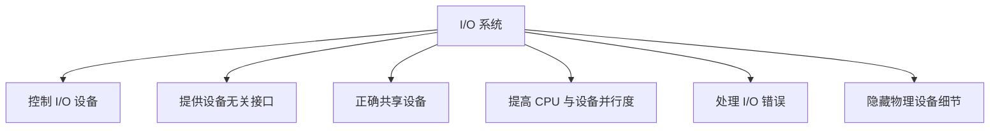

### 2. I/O 软件层次

自下而上为：

| 层次 | 主要工作 |
|---|---|
| 硬件 | 执行物理 I/O 操作 |
| 中断处理程序 | 响应设备中断，完成底层收尾 |
| 设备驱动程序 | 设置设备寄存器、检查状态、发出具体操作命令 |
| 与设备无关的 I/O 软件 | 命名、保护、分块、缓冲、分配等通用功能 |
| 用户层软件 | 产生请求、格式化 I/O、库函数与 SPOOLing |

请求自上而下逐层具体化，完成结果自下而上返回。系统上下接口包括 I/O 系统接口和软硬件接口，中间层由驱动、中断与设备无关软件隔离差异。

> **图示解读（层次展开图）**：应用层的文件系统、虚拟存储等通过统一接口进入块设备、字符设备或网络软件；再落到对应驱动、中断处理器、控制器及 CD-ROM、磁盘、打印机、网络等物理设备。图中多列表示不同设备路径共享相同层次模式，而非每类设备完全独立。

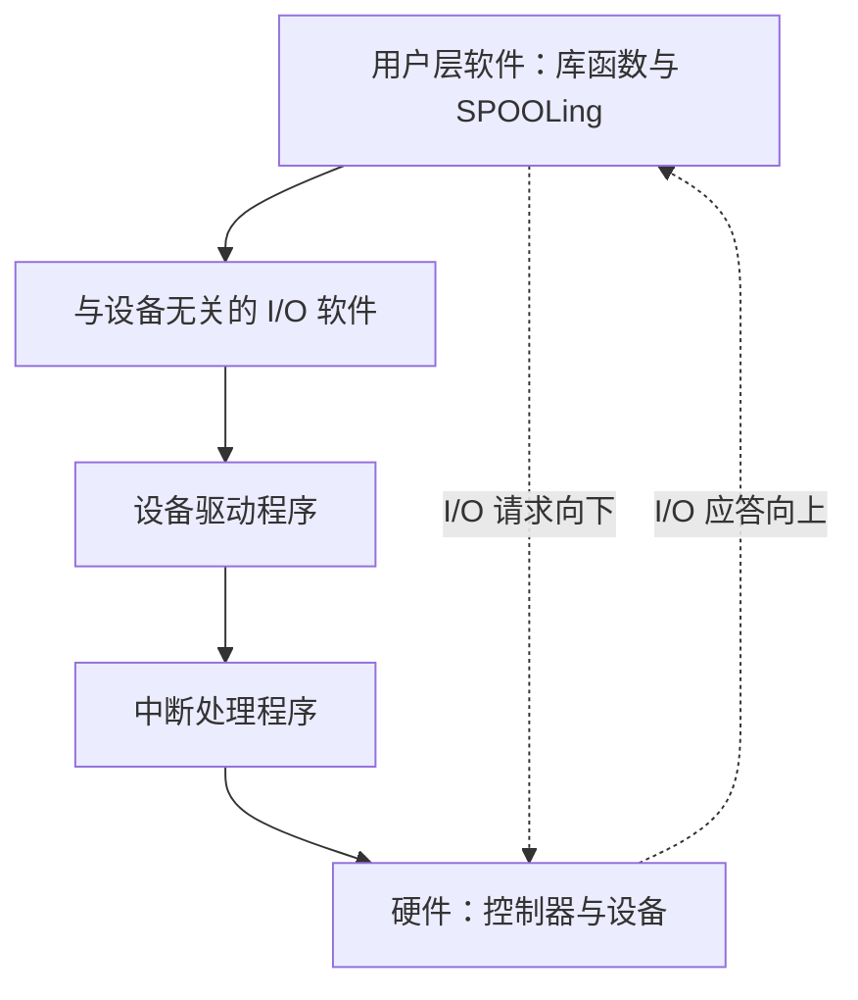

块设备、字符设备和网络设备均遵循这一分层路径，只是在驱动、控制器和具体物理设备处发生分化。

### 3. 三类接口

1. **块设备接口**：以固定大小数据块为存取与传输单位，如磁盘、光盘；常用 DMA，能隐藏磁盘二维位置并把逻辑块号映射为盘面、磁道和扇区。
2. **流/字符设备接口**：以字符为单位、通常不可寻址，如键盘和打印机；常用中断驱动。`get` 从字符缓冲区取字符，`put` 写入缓冲区；`ioctl`（课件写作 in-control）以参数指定设备特有操作。
3. **网络通信接口**：OS 提供网络软件与通信接口，使计算机经网络与其他节点通信或访问网络信息。

> **图片转写（块设备/字符设备/网络）**：四幅小照片分别作为存储、磁盘逻辑结构、命令映射和网络场景的视觉提示；实质关系是“块号→物理位置”“字符顺序流”和“网络端点通信”，照片不引入新步骤。

---

## 二、I/O 设备、控制器与通道

### 1. I/O 设备分类

- 按用途：存储设备、输入/输出设备。
- 按传输速率：低速（键盘、鼠标）、中速（行式打印机、激光打印机）、高速（磁带机、磁盘机、光盘机）。
- 按信息交换单位：块设备、字符设备。
- 按共享属性：独占设备、共享设备、虚拟设备。

### 2. 设备—控制器接口

设备通常不直接与 CPU 通信，而连接设备控制器。二者接口包含：

1. **数据信号线**：经缓冲器/转换器传递数据。
2. **状态信号线**：向控制器报告忙、就绪、错误等状态。
3. **控制信号线**：控制器向设备发命令。

> **图示解读（设备接口）**：设备内部上方是缓冲/转换器，下方是控制逻辑；数据线双向穿过缓冲器，状态线由设备指向控制器，控制线由控制器指向设备。

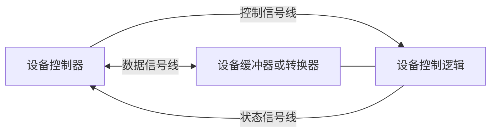

### 3. 设备控制器

控制器是 CPU 与 I/O 设备间的接口，可编址；一个地址对应一个设备，或以多个地址控制多台设备。功能包括接收识别命令、地址识别、数据交换、数据缓冲、差错控制以及标识/报告设备状态。

组成：

- 与处理机接口：数据线、地址线、控制线；含数据/控制/状态寄存器。
- 与设备接口：一个控制器可接多个设备，每个接口包含数据、状态和控制信号。
- I/O 逻辑：解释命令、选择设备并控制操作。

> **图示解读（控制器结构）**：CPU 侧寄存器和控制逻辑接入 I/O 逻辑，右侧扇出多个设备接口；I/O 逻辑把 CPU 的地址/命令选择成某条设备连接，并汇总返回状态。

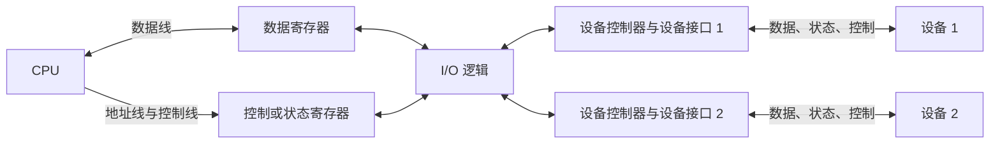

### 4. 端口映射与内存映射 I/O

- **端口映射 I/O**：I/O 寄存器占独立端口地址空间，以专用 I/O 指令访问。课件示例表把十六进制端口范围分给 DMA、串口、键盘、硬盘和并口等控制器。
- **内存映射 I/O**：I/O 寄存器与内存统一编址，使用普通访存指令即可访问；统一地址空间简化编程，但必须妥善处理缓存和保护属性。

> **图示解读（主板总线）**：CPU 通过北桥/内存总线连接内存和高速图形，通过南桥连接 PCI、磁盘、USB、音频、网络等低速设备，表明 I/O 经分层总线和控制器而非直接挂到 CPU。

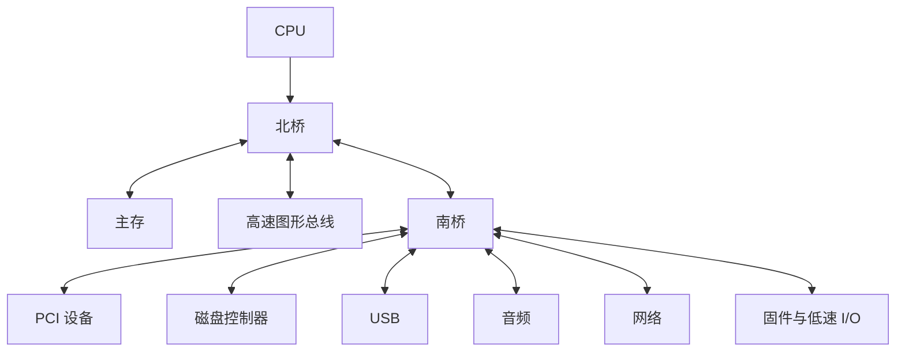

### 5. I/O 通道

通道是具有特殊指令集的专用处理机，用于承担原由 CPU 执行的 I/O 任务。它与普通 CPU 的区别是指令类型单一、没有独立内存（与 CPU 共享内存）。

通道类型：

1. **字节多路通道**：按字节交叉服务多台低速设备。
2. **数组选择通道**：可接多台高速设备，但一段时间只为一台传送，传输率高。
3. **数组多路通道**：结合前两者，含多个非分配型子通道。

通道昂贵且数量不足会形成瓶颈。解决方法是在不增加通道的情况下，增加设备到 CPU 的通路，让控制器、通道之间建立多路连接。

> **图示解读（单/多通道拓扑）**：单通路图为 CPU→通道→控制器→设备的树形结构，任一上游故障会阻断分支；多通路图让两个通道交叉连接多个控制器，控制器再共享设备路径，提高吞吐和可靠性。

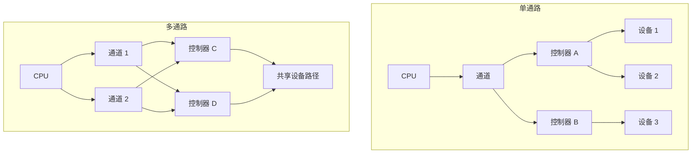

### 6. I/O 控制方式演进

| 方式 | CPU 参与 | 数据单位 | 并行程度 |
|---|---|---|---|
| 轮询的可编程 I/O | CPU 反复查询设备，忙等待 | 字/字符 | 低 |
| 中断驱动 I/O | CPU 发命令后继续工作，设备完成时中断 | 字/字符 | CPU 与设备并行 |
| DMA | CPU 只在数据块传输开始/结束时介入，设备与内存直传 | 数据块 | 更高 |
| 通道控制 | CPU 只对一组数据块的操作与管理介入，由通道程序控制 | 多块/一组操作 | CPU、通道、设备并行 |

DMA 控制器负责内存地址、字节计数和读写方向；通道程序由通道指令组成，包含操作码、内存地址、计数、程序结束位 $P$ 和记录结束位 $R$。


演进方向是 CPU 干预频率逐步降低、数据单位逐步增大、CPU 与设备并行度逐步提高。

> **图示解读（DMA）**：CPU 先设置 DMA 寄存器，DMA 随后在设备控制器与内存之间直接搬运块；仅在开始和结束通知 CPU。图中粗数据箭头绕过 CPU，体现“直接存储器访问”。

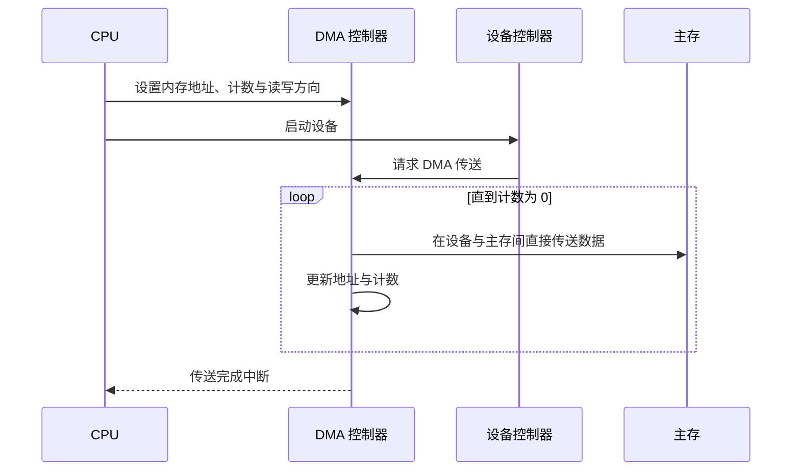

---

## 三、中断及中断处理

### 1. 概念

- **中断（interrupt）**：CPU 对 I/O 设备发来的中断信号作出的响应。
- **陷入（trap）**：CPU 内部事件引起的中断。
- **中断向量表**：保存各设备中断处理程序入口地址，每个设备有唯一中断号。
- **中断优先级**：不同中断源具有不同优先级。

处理多中断可：

1. **屏蔽/禁止中断**：处理当前中断时不再响应其他中断。
2. **嵌套中断**：高优先级中断可打断低优先级处理程序。

> **图示解读（屏蔽与嵌套）**：屏蔽图的用户程序进入中断处理 X 后必须完成才处理 Y；嵌套图中 X 处理途中被更高优先级 Y 打断，Y 返回后再继续 X。

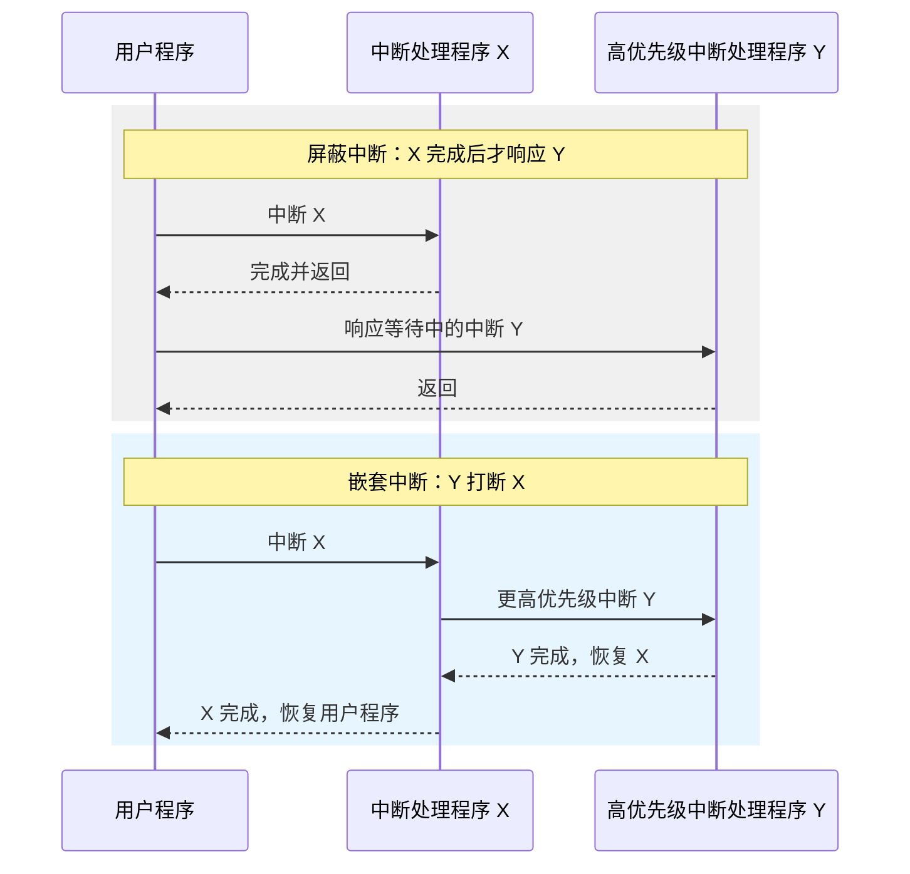

### 2. 通用中断流程

1. 检测有无未响应中断。
2. 保存被中断进程的 CPU 现场。
3. 根据中断号转入相应设备处理程序。
4. 执行中断服务。
5. 恢复 CPU 现场并退出中断。

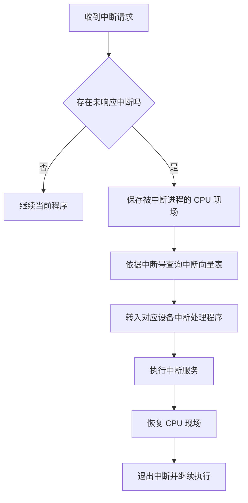

### 3. Linux 上半部/下半部

- **上半部**即硬中断处理程序，应短小快速，执行期间禁止部分或全部中断。
- **下半部**完成不必立即执行的工作，稍后运行并可响应其他中断。
- 处理器设计阶段包括注册中断、处理中断、注销中断。

---

## 四、设备驱动程序

设备驱动把上层抽象 I/O 请求转换为设备可执行的命令，启动设备。它与具体硬件/控制器和控制方式密切相关，基本部分常驻 ROM/内核，并允许重入。

处理方式可为每类设备设置专用 I/O 进程、按设备类型设置进程，或不设专门进程而由用户进程/系统调用直接进入驱动。

典型流程：

1. 把抽象要求转换为具体命令。
2. 校验服务请求。
3. 检查设备状态。
4. 传递地址、长度、方向等参数。
5. 启动 I/O 设备。

驱动对外接口包括内核接口、系统引导接口和设备接口；内部包括注册/注销、打开/释放、读/写、控制操作、中断与轮询。

> **图示解读（驱动框架）**：左侧三类外部接口连接右侧驱动组成模块；接口规定“谁调用驱动”，组成模块规定“驱动提供哪些生命周期和 I/O 操作”。

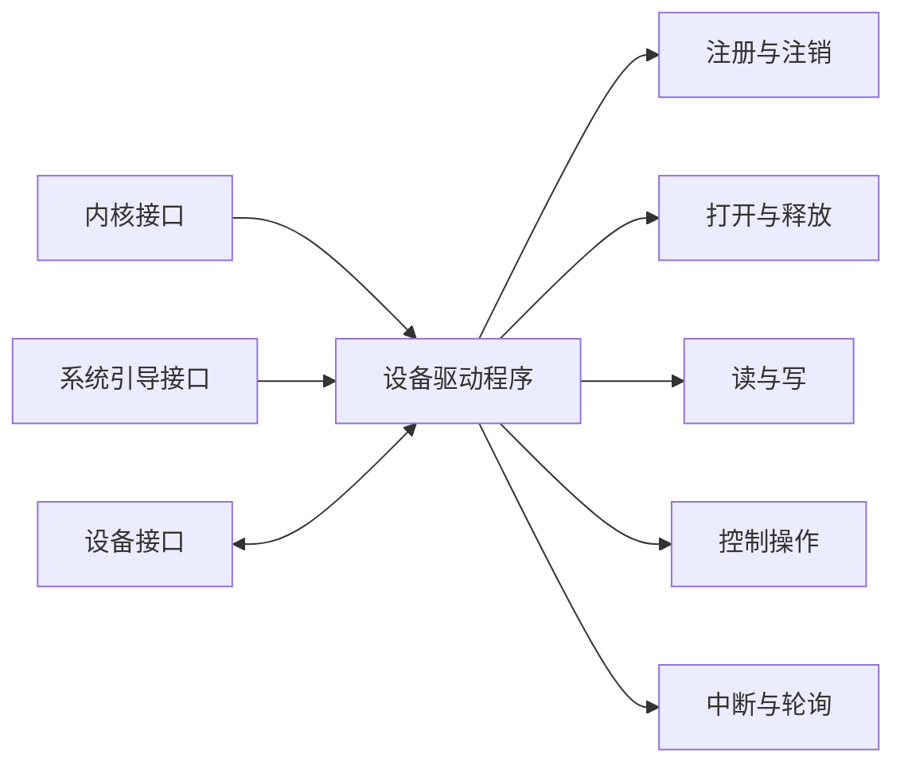

驱动处理单次请求时，依次把抽象要求转换为命令、校验请求、检查设备、装入参数并启动 I/O。

---

## 五、与设备无关的 I/O 软件

### 1. 设备独立性

直接使用物理设备名不灵活。引入逻辑设备名后，应用只请求逻辑设备，OS 再把它映射到具体物理设备，从而支持 I/O 重定向，提升适应性与可扩展性。

通用操作包括：统一驱动接口、缓冲管理、差错控制、独占设备分配与回收，以及提供与设备无关的逻辑块大小。

### 2. 设备分配数据结构

- **DCT（设备控制表）**：设备类型、`deviceid`、等待/不等待与忙/闲状态、控制器表指针、重试次数/时间、设备等待队列首指针。
- **COCT（控制器控制表）**：控制器标识、忙闲状态、通道表指针、控制器队列首尾指针。
- **CHCT（通道控制表）**：通道标识、忙闲状态、所连控制器表首址、通道队列首尾指针。
- **SDT（系统设备表）**：每个表目给出设备类型、设备标识、DCT 指针和驱动入口。

设备分配需考虑独占/共享/虚拟属性，采用 FCFS 或优先级算法，并权衡安全分配与不安全分配。独占设备基本分配顺序是：**设备 → 控制器 → 通道**。

> **图示解读（四表链路）**：SDT 表目指向 DCT，DCT 指向 COCT，COCT 指向 CHCT；每层表还连接自己的等待队列。这一链式关系支持逐级查找可用设备、控制器与通道。

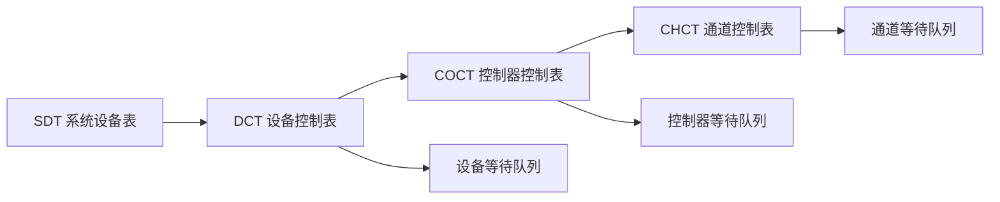

### 3. 逻辑设备表 LUT 与 I/O 调度

LUT 把逻辑设备名映射为物理设备名或 SDT 指针，并记录驱动入口。可全系统共用一张，或每用户一张。例如 `/dev/tty`、`/dev/printer` 映射到设备号或 SDT 表项。

I/O 调度为每个设备维护请求队列，按确定顺序执行请求，可改善整体性能、在进程间公平共享设备并缩短平均等待时间。

> **图片转写（LUT 两种格式）**：格式一直接保存“逻辑名—物理设备号—驱动入口”；格式二保存“逻辑名—SDT 指针”，由 SDT 再找到驱动，减少重复信息。

格式一：

| 逻辑设备名 | 物理设备号 | 驱动程序入口 |
|---|---|---|
| `/dev/printer` | 打印设备号 | 打印机驱动入口 |

格式二：

| 逻辑设备名 | SDT 表项指针 |
|---|---|
| `/dev/printer` | 指向对应系统设备表项 |


---

## 六、用户层 I/O 与 SPOOLing

### 1. 系统调用与库函数

应用通过系统调用进入内核 I/O 过程；库函数位于用户态，提供更方便的封装。Windows 典型接口是 Win32 API；C/UNIX 中常见库函数与系统调用近似一一对应。

> **图示解读（态转换）**：用户程序先调用用户态库/系统调用包装，执行系统调用后跨越边界进入内核 I/O 例程，服务完成后再返回用户态。

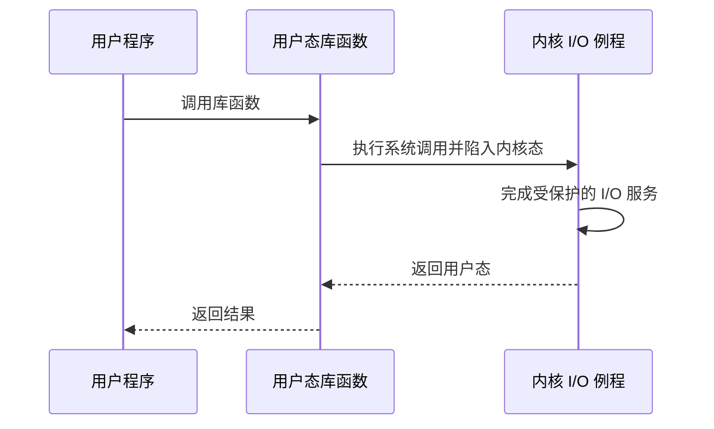

### 2. SPOOLing 原理与组成

SPOOLing（Simultaneous Peripheral Operations On-Line，同时外设联机操作）用软件模拟脱机输入/输出：

- 磁盘设置**输入井、输出井**，分别暂存输入数据和程序输出。
- 内存设置**输入缓冲区、输出缓冲区**，缓和 CPU 与磁盘速度差。
- 输入进程 $Sp_i$：输入设备 → 输入缓冲 → 输入井；CPU 需要时从输入井读入内存。
- 输出进程 $Sp_o$：内存 → 输出井；设备空闲时经输出缓冲送到输出设备。
- 井管理程序：控制作业与磁盘井的信息交换。

> **图示解读（SPOOLing 流程）**：输入设备、输入缓冲、输入井、用户作业形成输入链；用户作业、输出井、输出缓冲、输出设备形成输出链。输入/输出进程与 CPU 可并行，磁盘井把低速独占设备虚拟成可排队共享的逻辑设备。

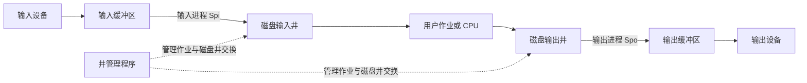

### 3. 共享打印机与守护进程

打印机本为独占设备，SPOOLing 可把它改造成共享设备。每个打印请求先在磁盘缓冲区建立假脱机文件并加入文件队列；打印缓冲区位于内存；打印进程依次取队列文件并打印。

改进方案是使用打印**守护进程（daemon）**自行执行部分原由假脱机管理进程承担的工作；守护进程是唯一直接使用打印机的进程。空闲块队列与满盘块队列管理磁盘缓冲块。

SPOOLing 的效果：提高 I/O 速度、把独占设备改造成共享设备、实现虚拟设备。

> **图示解读（打印系统）**：多个假脱机文件进入队列，经内存打印缓冲送到共享打印机；管理/打印进程分别负责接收请求和顺序输出，用户不直接占有物理打印机。

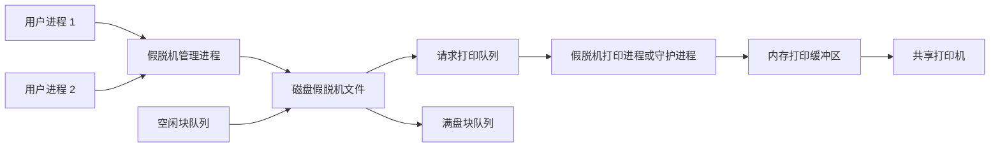

---

## 七、缓冲区管理

### 1. 引入原因

缓冲区是内存中的数据暂存区，用于缓和 CPU 与 I/O 速度不匹配、减少中断频率、协调数据粒度差异并提高并行性。

### 2. 单缓冲与双缓冲

块输入中设：设备输入一块时间为 $T$，缓冲区复制到工作区为 $M$，CPU 处理为 $C$。

- 单缓冲每块时间：

$$T_{single}=\max(C,T)+M$$

- 双缓冲：设备填充一个缓冲时 OS/CPU 可处理另一个，粗略为：

$$T_{double}\approx\max(C,T)$$

若 $C>T$，双缓冲可基本避免 CPU 等待设备。

> **图示解读（时序）**：单缓冲的 $T$ 与上一块的 $C$ 可部分重叠，但中间复制 $M$ 仍串行；双缓冲在缓冲 1、2 间交替，使下一次输入与上一次复制/计算交叠。

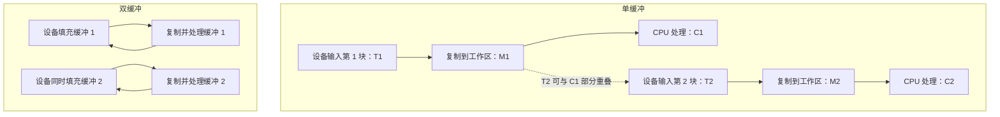

### 3. 环形缓冲

速度差很大时使用多个等大缓冲构成环。输入缓冲分为：空缓冲 `R`、满缓冲 `G`、计算进程当前使用的 `C`。三个指针：

- `Nexti`：输入进程下一个空缓冲 R。
- `Nextg`：计算进程下一个满缓冲 G。
- `Current`：当前工作缓冲 C。

`Getbuf` 取得 `Nextg` 或 `Nexti` 指向的缓冲并推进相应指针；`Releasebuf` 将计算完的 C 释放为 R，或把输入装满的缓冲变为 G。`Nexti` 追上 `Nextg` 表示可能无空缓冲；`Nextg` 追上 `Nexti` 表示可能无满缓冲，需要同步。

> **图示解读（六格环形缓冲）**：六个缓冲按圆环相连，R/G/C 标明状态；`Nexti`、`Nextg` 和 `Current` 分别指向下次写入、下次读取与正在处理的位置，指针沿同一方向循环前进。

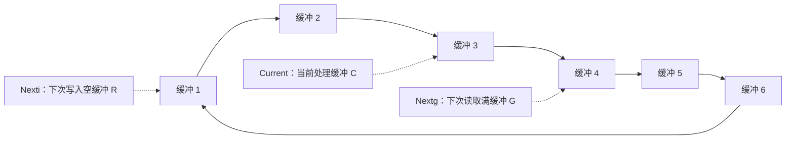

输入进程通过 `Getbuf` 取得 `Nexti` 指向的 R，装满后用 `Releasebuf` 把它变为 G；计算进程取得 `Nextg` 指向的 G，处理后释放为 R。

### 4. 缓冲池

大量独立环形缓冲会浪费内存，故建立供多个进程共享的公用缓冲池。它有三个队列：空闲队列 `emq`、输入队列 `inq`、输出队列 `outq`；四类工作缓冲区为收容输入、提取输入、收容输出、提取输出。

`Getbuf`/`Putbuf` 操作队列并保证互斥与同步；数据流程在 `hin/sin/sout/hout` 四种缓冲角色之间转换。

> **图示解读（缓冲池）**：设备侧的输入/输出箭头连接缓冲池，池内四个框 `hin、sin、sout、hout` 再连接用户程序，表示同一物理缓冲可随工作阶段改变角色而非固定归某进程。

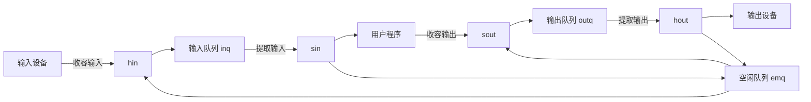

### 5. 缓存与缓冲的区别

缓存（Cache）保存数据副本，如 CPU 缓存、磁盘缓存、光驱缓存。CPU 缓存为解决处理器与主存速度差，命中时直接返回；未命中则从主存取并留下副本。

- 缓冲通常保存数据在传输过程中的**唯一现有版本**。
- 缓存保存可在其他位置找到的**副本**。
- 同一内存区在不同语境下可以既是缓冲又是缓存。

---

## 八、磁盘性能与调度

### 1. 结构、容量与格式

- 盘片有一个或两个盘面，每面一个读写磁头。
- 每面分磁道，相同半径的磁道构成柱面；磁道又分扇区，扇区通常对应盘块。
- 各磁道可存相同位数，因此内层位密度通常更高。

容量：

$$容量=柱面数\times磁头数\times每道扇区数\times每扇区字节数$$

课件示例：

- `19710 × 16 × 255 × 512 B = 41173401600 B ≈ 40 GB`。
- `2 面 × 80 磁道 × 18 扇区 × 512 B ≈ 1.44 MB`。

格式化后每扇区除 512 B 数据外还有间隙与控制字段。标识字段含同步字节、磁道号、磁头号、扇区号和 CRC；数据字段含数据与 CRC。课件示例每扇区总长 600 B，其中 512 B 为有效数据。

| 扇区组成 | 主要字段 | 作用 |
|---|---|---|
| 前间隙 | 填充字节 | 分隔相邻物理扇区 |
| 标识字段 | 同步字节、磁道号、磁头号、扇区号、CRC | 标识扇区并校验地址信息 |
| 数据间隙 | 填充字节 | 分隔标识字段和数据字段 |
| 数据字段 | 同步字节、512 B 数据、CRC | 保存用户数据并进行差错校验 |
| 后间隙 | 填充字节 | 为下一扇区留出间隔 |

> **图示解读（磁盘几何）**：左图将多张盘面垂直叠放，共用移动磁臂；右图俯视盘面，以同心圆表示磁道、径向分割表示扇区，同半径各面磁道组成柱面。

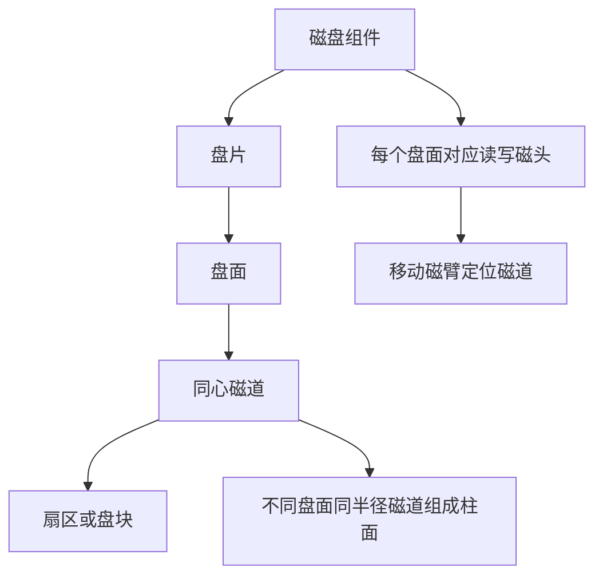

Mermaid 不能忠实绘制课件的同心圆盘面，因此以层次关系重构，并由正文保留盘面、磁道、扇区、柱面和磁臂的空间关系。

磁盘可分硬盘/软盘、单片/多片、固定磁头/移动磁头。固定磁头每道一磁头、并行读写快但主要用于大容量磁盘；移动磁头每面一个磁头，串行寻道，广泛用于中小型设备。

### 2. 访问时间

访问时间由寻道、旋转延迟和传输组成：

$$T_a=T_s+\frac{1}{2r}+\frac{b}{rN}$$

其中：

- $T_s=m\times n+k$：寻道时间，$n$ 为跨越磁道数，$m$ 是每道时间，$k$ 为启动常数。
- $r$：每秒转数；平均旋转延迟为半圈 $1/(2r)$。
- $b$：读取字节数；$N$：一条磁道字节数；$T_t=b/(rN)$。

课件例：5400 rpm、平均寻道 5 ms、传输 4 KB、速率 1 Gb/s、控制开销 0.1 ms，则平均旋转延迟约 5.56 ms，总访问约 10.7 ms。访问时间通常主要由寻道和旋转延迟决定。

### 3. 调度算法

磁盘调度目标是使平均寻道时间最小。

| 算法 | 规则 | 优缺点 |
|---|---|---|
| FCFS | 按请求到达顺序 | 公平、简单、无饥饿；平均寻道可能很长 |
| SSTF | 每次选离当前磁头最近的请求 | 性能优于 FCFS；远端请求可能饥饿 |
| SCAN | 按当前方向沿途服务，到端点后反向 | “电梯算法”，兼顾方向与距离，等待较均衡 |
| C-SCAN | 只沿一个方向服务，到另一端后快速返回且返回途中不服务 | 把柱面视作环，等待时间更均匀 |
| C-LOOK | C-SCAN 变体，只走到该方向最远请求，不走到物理端点 | 减少无请求区移动 |
| N-Step-SCAN | 将队列切为长度 $N$ 的子队列，子队列间 FCFS、内部 SCAN | 减轻磁臂粘着 |
| FSCAN | 使用两个队列；扫描当前队列时，新请求进入另一队列等待下一轮 | N-Step-SCAN 的简化 |

**课件例题**：请求序列为 `55, 58, 39, 18, 90, 160, 150, 38, 184`，磁头从 100 开始。

| 算法 | 服务次序 | 总移动 | 平均寻道长度 |
|---|---|---:|---:|
| FCFS | 55→58→39→18→90→160→150→38→184 | 498（课件图另标“640 柱面”，与表内距离求和不一致） | 55.3 |
| SSTF | 90→58→55→39→38→18→150→160→184 | 248（课件图另标“236 柱面”，与表内距离求和不一致） | 27.6 |
| SCAN（初始向增大方向） | 150→160→184→90→58→55→39→38→18 | 250（课件图另标“208 柱面”，与表内距离求和不一致） | 27.8 |
| C-SCAN（向增大方向） | 150→160→184→18→38→39→55→58→90 | 322 | 35.8 |

> **课件数据提示**：以上平均值等于表内移动距离之和除以 9；三幅图旁标注的 FCFS/SSTF/SCAN 总移动数与表格求和不一致。本笔记同时保留并明确区分，答题时应以给定请求序列自行逐段求和。

> **图示解读（调度轨迹）**：横轴为柱面号，折线按服务先后连接请求。FCFS 折线跨越大；SSTF 在局部邻近点间移动；SCAN 先单向再反向；C-SCAN 单向服务后以一条长回跳线回到低柱面；C-LOOK 的回跳发生在最远请求而非物理端点。

课件例题的四条轨迹可按服务次序重构如下：

```mermaid
flowchart TD
  subgraph F[FCFS]
    F0[100] --> F1[55] --> F2[58] --> F3[39] --> F4[18] --> F5[90] --> F6[160] --> F7[150] --> F8[38] --> F9[184]
  end
  subgraph S[SSTF]
    S0[100] --> S1[90] --> S2[58] --> S3[55] --> S4[39] --> S5[38] --> S6[18] --> S7[150] --> S8[160] --> S9[184]
  end
  subgraph A[SCAN，初始向增大方向]
    A0[100] --> A1[150] --> A2[160] --> A3[184] --> A4[90] --> A5[58] --> A6[55] --> A7[39] --> A8[38] --> A9[18]
  end
  subgraph C[C-SCAN，向增大方向]
    C0[100] --> C1[150] --> C2[160] --> C3[184] -->|回跳且不服务| C4[18] --> C5[38] --> C6[39] --> C7[55] --> C8[58] --> C9[90]
  end
```

折线图的几何斜率只用于显示磁头移动方向，知识含义由上述柱面访问次序和表中逐段距离完整表达。

---

## 九、作业与课程思政

第十次作业中黄色标注为：简答题 1、2、4；计算题 18；综合应用题 19。

课件以 Windows 10 安全审查为例，强调引入国外 OS 需要安全可控、可重构代码和可验证性；若存在不可见的黑盒代码，就难以进行白盒测试与准确安全评估。课件进一步提出结合 Linux 开源基础与国内实践，发展安全可靠、自主可控的国产操作系统。该部分属于课程思政材料，核心观点是关键基础软件的透明、可验证与自主创新。

---

## 本章小结

| 主题 | 核心结论 |
|---|---|
| I/O 分层 | 用户层、设备无关层、驱动、中断和硬件逐层屏蔽差异 |
| 设备控制 | 轮询→中断→DMA→通道，CPU 干预逐步减少 |
| 设备独立性 | 逻辑名、LUT 和统一驱动接口把应用与物理设备解耦 |
| 虚拟设备 | SPOOLing 用磁盘井与进程把独占设备改造成共享设备 |
| 缓冲 | 单缓冲、双缓冲、环形缓冲、缓冲池依次提升并行与利用率 |
| 磁盘调度 | 在公平性、平均寻道和饥饿风险之间权衡 |

> **知识导图转写**：第 7 章以“输入/输出系统”为中心，分为 I/O 功能与模型、设备与控制器、I/O 软件和缓冲管理/磁盘调度。I/O 软件继续分中断、驱动、设备无关层和用户层；用户层包含系统调用、库函数与 SPOOLing；磁盘部分包含结构、性能、FCFS、SSTF、SCAN、C-SCAN、C-LOOK、N-Step-SCAN 和 FSCAN。

```mermaid
flowchart TD
  O[输入输出系统]
  O --> F[I/O 功能、模型与接口]
  O --> H[设备、控制器与通道]
  H --> H1[轮询、中断、DMA、通道]
  O --> S[I/O 软件]
  S --> S1[中断处理与设备驱动]
  S --> S2[设备无关软件]
  S --> S3[用户层、系统调用与 SPOOLing]
  O --> B[缓冲管理]
  B --> B1[单缓冲、双缓冲、环形缓冲与缓冲池]
  O --> D[磁盘]
  D --> D1[结构、格式与访问时间]
  D --> D2[FCFS、SSTF、SCAN、C-SCAN、C-LOOK、N-Step-SCAN、FSCAN]
```

### 逐图覆盖审计

两个源文件分别编号，避免把前、后课件中的同号图片混淆。“文字化”表示已把不能或无需图形化的信息转为可检索正文；“Mermaid”表示已可靠重构图中结构或流程。

**前 2 课时课件：69 个图片引用**

| 图片序号 | 主题 | 处理结果 |
|---|---|---|
| 1 | 本章知识导图 | Mermaid 重构为章末知识结构图 |
| 2 | 章节编号箭头 | 纯排版导航，无额外知识信息 |
| 3 | 五层 I/O 软件模型 | Mermaid 重构请求向下、应答向上的分层路径 |
| 4～5 | 用户确认与工具图标 | 章节装饰；上下接口与 I/O 系统边界已文字化 |
| 6～7 | 多设备 I/O 层次展开图 | 合并为一幅 Mermaid 分层结构，正文说明不同设备路径 |
| 8 | CPU、北桥、南桥和外设总线 | Mermaid 重构高速与低速设备的分层连接 |
| 9～11 | 块设备接口的办公场景照片 | 文字化逻辑块到盘面、磁道和扇区的映射 |
| 12～16 | 数据库、网络、趋势等章节图标 | 文字化块、字符和网络三类接口；图标本身无额外语义 |
| 17 | 人物场景照片 | 装饰图，不增加接口技术信息 |
| 18～21 | 设备分类的编号箭头 | 正文按用途、速率、交换单位和共享属性逐项转写 |
| 22 | 设备—控制器三类信号线 | Mermaid 重构数据、状态与控制信号方向 |
| 23 | 重复 I/O 层次图 | 已由前述五层 Mermaid 与文字说明覆盖 |
| 24～26 | 房屋、层次、锁图标 | 控制器章节导航，图标无技术连线 |
| 27 | 控制器五项功能环图 | 正文完整转写并由控制器结构 Mermaid 承接 |
| 28～30 | 房屋、层次、锁图标 | 控制器组成导航，正文承接三个组成部分 |
| 31 | 设备控制器内部结构 | Mermaid 重构 CPU 接口、寄存器、I/O 逻辑及设备接口 |
| 32～38 | 用户、工具、房屋、层次、锁图标 | 端口映射、内存映射和通道类型均已文字化 |
| 39 | 字节多路通道的子通道关系 | 文字化各子通道按字节交叉服务设备的结构 |
| 40 | 计算机办公场景照片 | 装饰图，不增加通道瓶颈信息 |
| 41 | CPU—通道—控制器—设备树 | Mermaid 重构单通路并扩展呈现多通路冗余 |
| 42 | 计算机办公场景照片 | 装饰图，不增加 I/O 控制步骤 |
| 43～44 | DMA 控制器与系统总线结构 | Mermaid 时序图重构寄存器设置、块传输、计数更新和完成中断 |
| 45～47 | 房屋、层次、锁图标 | 中断章节导航，定义、向量表和优先级已文字化 |
| 48～49 | 顺序与嵌套中断时间图 | Mermaid 时序图对比屏蔽中断和高优先级嵌套 |
| 50 | 通用中断处理流程 | Mermaid 重构判断、现场保护、向量分派、服务与恢复 |
| 51～52 | 用户确认与工具图标 | Linux 中断上下半部的章节装饰，正文完整承接 |
| 53～55 | OS 标志 | 设备驱动章节装饰，不增加技术信息 |
| 56～57 | 目标图标 | 驱动接口与组成导航，Mermaid 重构外部接口和内部操作 |
| 58 | 计算机办公场景照片 | 装饰图，不增加设备无关性信息 |
| 59～69 | 房屋、层次、锁等章节图标 | 设备独立性、四表链路、LUT 和 I/O 调度已由正文、原生表格与 Mermaid 承接 |

**后 1 课时课件：88 个图片引用**

| 图片序号 | 主题 | 处理结果 |
|---|---|---|
| 1 | 本章知识导图 | Mermaid 重构为章末知识结构图 |
| 2 | 库函数与 SPOOLing 双向导航图 | 文字化用户层 I/O 的两类组成 |
| 3 | 用户态—内核态系统调用图 | Mermaid 时序图重构调用、陷入、服务与返回 |
| 4 | OS 标志 | 章节装饰，无额外知识信息 |
| 5 | SPOOLing 输入/输出井结构 | Mermaid 重构设备、缓冲区、磁盘井和作业链路 |
| 6～7 | 趋势图标 | 装饰图，输入井和输出井定义已文字化 |
| 8 | 人物场景照片 | 装饰图，不增加 SPOOLing 机制 |
| 9～11 | 房屋、层次、锁图标 | SPOOLing 组成导航，正文承接输入/输出缓冲和进程 |
| 12 | SPOOLing 完整工作原理 | Mermaid 重构输入链、输出链与井管理程序 |
| 13～15 | 三幅办公场景照片 | 装饰图；提高速度、共享设备和虚拟设备效果已文字化 |
| 16 | 共享打印机系统 | Mermaid 重构用户、管理进程、假脱机文件、队列、缓冲和打印机 |
| 17～19 | 趋势图标与人物照片 | 打印管理、打印进程、守护进程内容已文字化 |
| 20～22 | 房屋、层次、锁图标 | 缓冲区管理章节导航，无额外关系 |
| 23 | 逐位、逐字符和块缓冲示意 | 文字化缓冲降低中断频率和协调数据粒度的作用 |
| 24～25 | 单缓冲结构与时序 | Mermaid 重构输入、复制、计算及可重叠关系 |
| 26～27 | 双缓冲结构与时序 | Mermaid 重构两缓冲交替和输入/计算并行 |
| 28～30 | 趋势图标与人物照片 | 环形缓冲章节装饰，正文说明引入原因 |
| 31～32 | OS 标志 | 环形缓冲组成导航，无额外知识信息 |
| 33～34 | 六格环形缓冲的两个状态 | Mermaid 重构环路、R/G/C 状态与三个指针 |
| 35～37 | 房屋、层次、锁图标 | `Getbuf`、`Releasebuf` 与同步问题已文字化 |
| 38～45 | 趋势、照片与编号箭头图标 | 缓冲池的三队列和四类工作缓冲已文字化 |
| 46 | 缓冲池数据流 | Mermaid 重构 `hin`、`sin`、`sout`、`hout` 与三个队列 |
| 47～49 | 房屋、层次、锁图标 | 缓存章节导航，缓存与缓冲差异已文字化 |
| 50～51 | 磁盘立体结构与盘面俯视图 | Mermaid 层次图加文字描述重构盘片、盘面、磁道、扇区、柱面和磁臂 |
| 52～57 | 房屋、层次、锁图标 | 容量、格式和磁盘类型的章节导航，公式与正文承接 |
| 58 | 物理扇区格式图 | 原生 Markdown 管道表格重构间隙、标识、数据和 CRC 字段 |
| 59～61 | OS 标志 | 磁盘类型章节装饰，无额外知识信息 |
| 62～72 | 房屋、层次、趋势与人物图标 | 寻道、旋转、传输时间及调度目标已由公式和正文承接 |
| 73～74 | 人物照片与 OS 标志 | FCFS 章节装饰，无额外知识信息 |
| 75 | FCFS 调度轨迹 | Mermaid 重构例题完整柱面服务次序 |
| 76～78 | 趋势图标与人物照片 | SSTF 章节装饰，规则与饥饿风险已文字化 |
| 79 | SSTF 调度轨迹 | Mermaid 重构例题完整柱面服务次序 |
| 80～81 | OS 标志 | 扫描算法章节装饰，无额外知识信息 |
| 82 | SCAN 调度轨迹 | Mermaid 重构向高柱面后反向的服务次序 |
| 83～85 | 办公场景照片 | C-SCAN 章节装饰，单向服务和无服务回跳已文字化 |
| 86 | C-LOOK/C-SCAN 回跳轨迹 | Mermaid 重构 C-SCAN 例题次序，正文说明 C-LOOK 只到最远请求 |
| 87 | 计算机办公场景照片 | 装饰图，不增加 N-Step-SCAN 信息 |
| 88 | 本章总结知识导图 | Mermaid 重构章节主干与调度算法分支 |
