# 8.1 文件管理

> 本笔记整理自《操作系统》第 8 章课件，涵盖文件与文件系统、逻辑结构、目录、共享、保护、Linux VFS 和 ext2。课件中的数据层次、顺序/索引文件、目录树、共享图、访问矩阵和 ext2 布局均已完整转写为文字。

## 主要内容

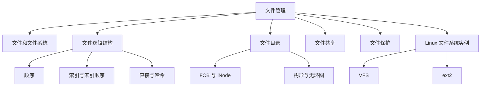

- 数据项、记录、文件及文件系统层次
- 顺序、索引、索引顺序、直接与哈希文件
- FCB、iNode 和目录组织/查询
- 基于硬链接与符号链接的文件共享
- 保护域、访问矩阵、ACL 与能力表
- Linux VFS 对象和 ext2 磁盘布局

---

## 一、文件和文件系统

### 1. 数据项、记录与文件

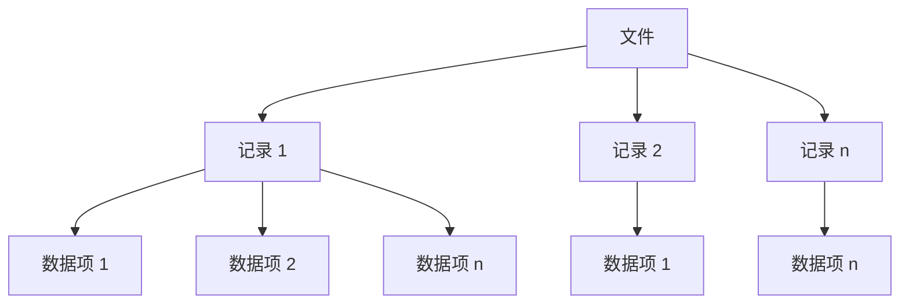

该层次只表达组成关系：多个相关数据项构成记录，多条相关记录构成有结构文件；无结构文件则作为字符流处理。

- **基本数据项**：描述对象某种属性的最小字段。
- **组合数据项**：由若干基本数据项组成。
- **记录**：一组相关数据项的集合，描述一个对象某方面的属性。
- **关键字**：唯一标识记录的数据项，如学号，或“学号 + 课程号”的组合。
- **文件**：有文件名的一组相关元素，是文件系统中的最大数据单位，用于描述对象集合。

文件可由记录组成（有结构文件），也可视为字符流（无结构文件）；主要属性有类型、长度、物理位置和创建时间。

> **图示解读（数据层次）**：树形图自上而下是“文件 → 多个记录 → 每条记录的多个数据项”，说明数据项组成记录、记录组成文件；记录 1 至记录 n 和数据项 1 至 n 表示数量可变。

### 2. 文件名与类型

扩展名是文件名后的附加字符，可提示类型。课件从四个角度分类：

| 分类依据 | 类型 |
|---|---|
| 用途 | 系统文件、用户文件、库文件 |
| 数据形式 | 源文件、目标文件、可执行文件 |
| 存取控制 | 只执行、只读、读写 |
| 组织/处理方式 | 普通文件、目录文件、特殊文件 |

常见扩展名：可执行文件 `.exe/.com/.bin`，目标文件 `.obj/.o`，源代码 `.c/.cc/.java/.pas/.asm`，批处理 `.bat/.sh`，文本/文档 `.txt/.doc`，库 `.lib/.a/.so/.dll`，打印/查看 `.ps/.pdf/.jpg`，归档 `.zip/.tar`，多媒体 `.mpeg/.mov/.mp3/.avi` 等。

### 3. 文件系统层次

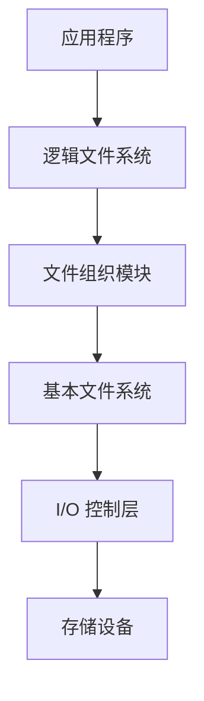

越靠上越接近名字、目录和权限等逻辑抽象，越靠下越接近块请求、设备驱动和具体硬件。

文件系统模型包含：

1. **对象及属性**：文件、目录、磁盘存储空间。
2. **对象操纵与管理的软件集合**：文件管理的核心。
3. **接口**：命令接口与程序接口。

文件系统负责空间管理、目录管理、逻辑地址到物理地址转换、读写、共享和保护。典型软件层次自上而下为：应用程序 → 逻辑文件系统 → 文件组织模块 → 基本文件系统 → I/O 控制层 → 设备。

> **图示解读（层次模型）**：用户在顶层通过接口进入文件系统；中部由对象操作软件与对象属性构成；另一张纵向栈图把逻辑文件系统、组织模块、基本文件系统和 I/O 控制逐层连接到底层设备，表明文件读写会逐步转成块 I/O。

### 4. 文件操作

基本操作有创建、删除、读、写和设置读写位置。`open` 把文件属性从外存目录复制到内存打开文件表；`close` 删除对应打开表项。其他操作包括重命名、改变所有者、查询状态以及创建/删除目录。

---

## 二、文件的逻辑结构

### 1. 逻辑结构与物理结构

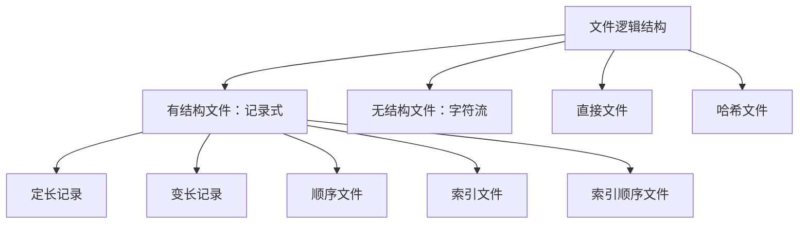

- **逻辑结构**：用户视角下文件的组织形式。
- **物理结构**：文件在存储介质上的布局，与外存性能和分配方式有关。

按是否有结构：有结构文件（记录式，含定长/变长记录）和无结构文件（流式，如程序、可执行文件、库函数）。记录式文件按组织可分顺序、索引和索引顺序文件。

### 2. 顺序文件


定长记录的边界可由记录号直接计算；变长记录必须读取或累计前置长度字段，不能仅做一次乘法定位。

排列方式：

1. **串结构**：按存入时间先后排列，与关键字无关。
2. **顺序结构**：按指定关键字段排序，检索可用二分、插值、跳步等方法。

优点是批量读写效率高、存取率高、适合磁带；缺点是查找/修改单条记录较差，插入和删除困难。

**记录寻址**

隐式顺序访问中：

- 定长记录：$Rptr\leftarrow Rptr+L$，$Wptr\leftarrow Wptr+L$。
- 变长记录：$Rptr\leftarrow Rptr+L_i$，$Wptr\leftarrow Wptr+L_i$。

显式随机访问可按记录位置或关键字定位。定长记录 $R_i$ 起始地址为 $iL$；变长记录需累加前面记录长度，并通常保存长度字段。

> **图示解读（定长/变长布局）**：定长图中各记录等长 $L$，地址为 $0,L,2L,…,iL$；变长图在每条记录前存长度 $L_i$，第 $i$ 条起始位置由前面各 $(L_k+1)$ 累加得到。

### 3. 索引文件

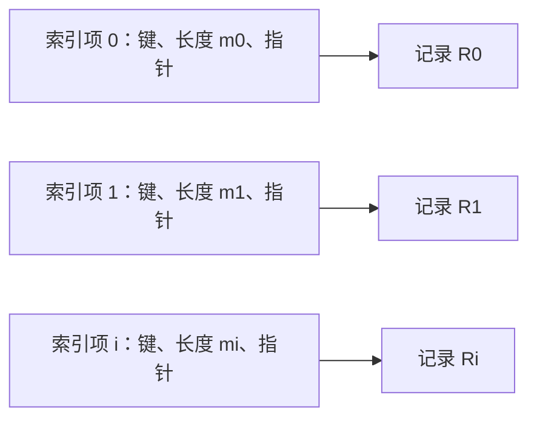

索引项与记录分离；索引按关键字排序，而指针直接定位实际记录，因此适合变长记录的随机访问。

为变长记录建立按关键字排序的索引表，每个索引项保存记录长度与指针，从而直接定位记录；若多个字段都可能作为检索条件，可分别建立多个索引。

> **图示解读（索引表）**：左侧索引项含“索引号、长度 $m_i$、指针 `ptr`”，每个指针跨到右侧逻辑文件中的 $R_i$。索引与实际记录分离，允许记录变长而仍可随机访问。

### 4. 索引顺序文件

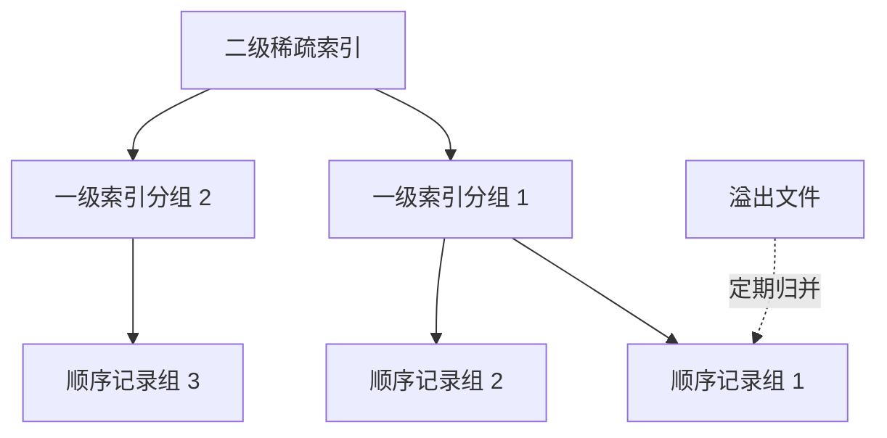

检索先在高层索引缩小范围，再进入低层索引和记录组；新增、删除或修改的记录可暂存于溢出文件，整理时再归并。

它保留记录按关键字顺序排列的特征，同时新增索引表支持随机访问，并设置溢出文件暂存新增、删除或修改记录。

- 普通顺序文件平均比较约 $N/2$ 次。
- 一级索引把记录分组，平均约查找 $\sqrt N$ 条，效率约提高 $\sqrt N/2$ 倍。
- 两级索引继续为索引建立索引，课件给出平均查找量约 $\frac{3}{2}N^{1/3}$。

> **图示解读（一级/两级索引）**：一级图由索引键指向一个记录分组，再在组内顺序查找；两级图先查上层稀疏索引，再查下层索引，最后进入记录区，逐级缩小范围。

### 5. 直接文件与哈希文件

- **直接文件**：关键字本身决定物理地址，需要键值到地址的转换。
- **哈希文件**：用哈希函数把记录键值转换为记录地址，并处理冲突。

> **图片转写（键—地址关系）**：直接文件强调可由键推算位置；哈希文件在键与地址间增加 Hash 函数。课件的键名/逻辑地址表说明索引文件保存显式映射，而哈希方法通过计算得到映射。

---

## 三、文件目录

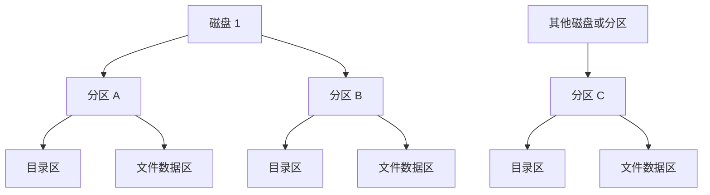

课件的磁盘布局图强调：目录结构和文件数据都持久化在磁盘分区内；目录项负责定位文件，而目录本身也以文件形式占用存储空间。

### 1. FCB 与索引结点

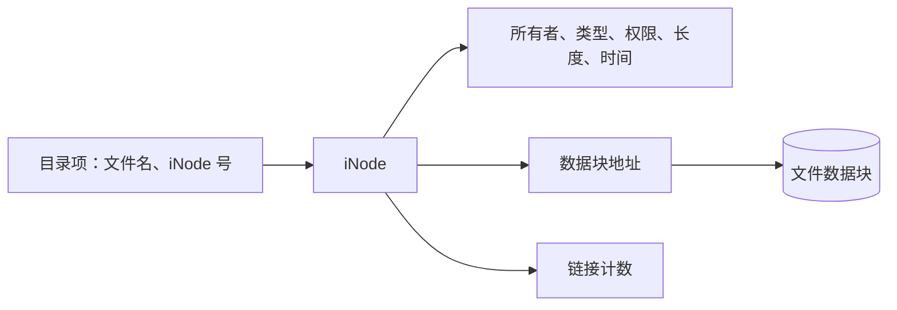

目录检索先在紧凑目录项中按名找到 iNode 号，再读取 iNode 的完整元数据和数据块地址，因而能显著减少查目录所需的磁盘块数。

目录是一种标识文件及其物理地址的数据结构，应支持按名存取、快速检索、共享、重名。**文件控制块 FCB** 与文件一一对应；FCB 集合就是目录，目录本身也可作为目录文件。

FCB 信息：

- 基本信息：文件名、物理位置、逻辑/物理结构。
- 存取控制：所有者、核准用户和一般用户权限。
- 使用信息：建立/修改时间及当前使用状态。

为减少目录查找磁盘访问，UNIX 把文件名与其余描述信息分开，后者保存在 **iNode**：

- 磁盘 iNode：所有者、类型、权限、物理地址、长度、链接计数、访问时间。
- 内存 iNode：iNode 编号、状态、访问计数、所属文件系统逻辑设备号、链接指针等运行态信息。

**课件计算例**

FCB 为 64 B，块为 1 KB，每块容纳 16 个 FCB。640 个 FCB 占 40 块，平均查找约启动磁盘 20 次。若目录项缩为 16 B（14 B 文件名 + 2 B iNode 指针），每块 64 项，640 项占 10 块，平均约 5 次，降为原来的 $1/4$。

> **图示解读（目录项/iNode 分离）**：目录只保留短文件名和 iNode 号，详细元数据转入 iNode 区；查找阶段能在同一盘块比较更多目录项，命中后再读取对应 iNode。

### 2. 单级和两级目录

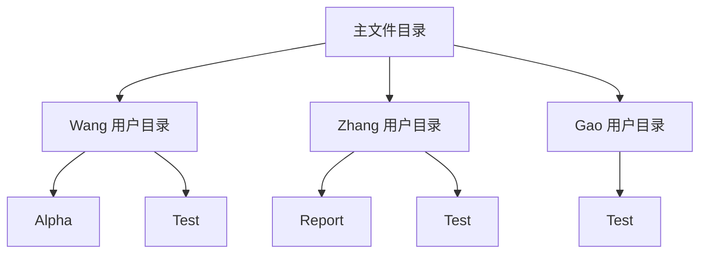

两级目录允许不同用户使用相同文件名；主目录项保存用户名和指向该用户目录的指针。

- **单级目录**：所有用户文件放在一个目录；简单，但查找慢、不允许重名、不便共享。
- **两级目录**：主目录按用户名指向各用户目录；提高检索速度并允许不同用户同名，但跨用户共享仍不方便。

> **图示解读（两级目录）**：主目录的 Wang、Zhang、Gao 表项分别指向各自子目录；每个子目录独立保存 Alpha、Test、Report 等文件名，因此同名不会冲突。

### 3. 树形目录

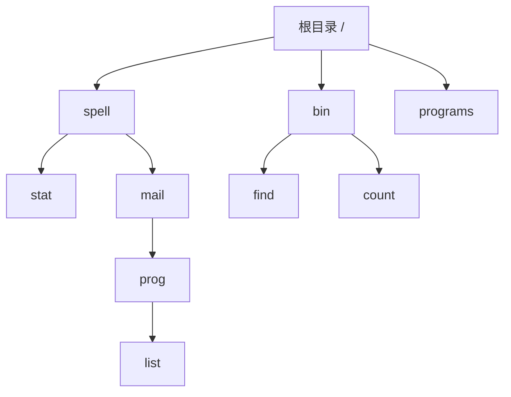

从根到节点的唯一路径构成绝对路径；当前工作目录确定后，可用相对路径缩短名字解析。

树形目录从根目录逐层组织子目录与文件。路径分：

- 绝对路径：从根目录开始。
- 相对路径：从当前工作目录开始。

课件例：`cd /spell/mail/prog` 改变当前目录，随后 `type list` 访问该目录中的 `list`。目录操作包括创建、删除（是否允许删除非空目录取决于系统）、改变、移动、链接和查找。

> **图示解读（目录树）**：根下有 `spell/bin/programs` 等分支，继续展开 `stat/mail/dist/find/count/...`，叶节点为文件；任意节点的唯一路径给出其绝对路径，当前目录则作为相对路径起点。

### 4. 无环图目录

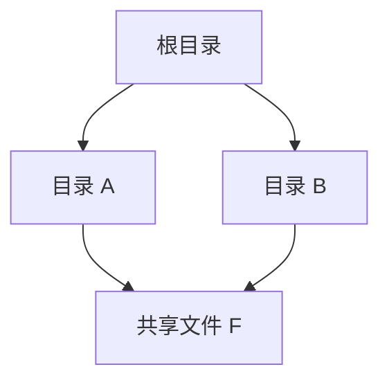

多个目录入口可以指向同一对象，但所有有向边不能构成环，否则目录遍历、引用计数与回收会失去明确终点。

无环图目录允许同一文件或子目录拥有多个父目录，从而实现共享，但禁止形成环。图中不同目录分支共同指向同一叶文件，表示共享对象只有一份，而入口可以有多个。

### 5. 目录查询


课件示例中的目录块号依次为：根目录开始检索，`/usr` 对应的目录内容位于 132 号盘块，`/usr/ast` 对应的目录内容位于 496 号盘块，最后命中 `mbox`。

- **线性检索**：逐层顺序查目录项。例如查 `/usr/ast/mbox`：根目录找 `usr` → 读 `/usr` 目录找 `ast` → 读 `/usr/ast` 找 `mbox`。
- **Hash**：将文件名转换成目录索引值，再到相应位置查找；若目录项定长效果较好，需用规则处理冲突。

> **图示解读（逐层查找）**：三个目录块表依次给出根、`/usr`、`/usr/ast` 的“iNode 号—名字”，箭头由 `usr` 的编号指向下一块，再由 `ast` 指向第三块，最终命中 `mbox`。

---

## 四、文件共享

### 1. 基于有向无环图/硬链接

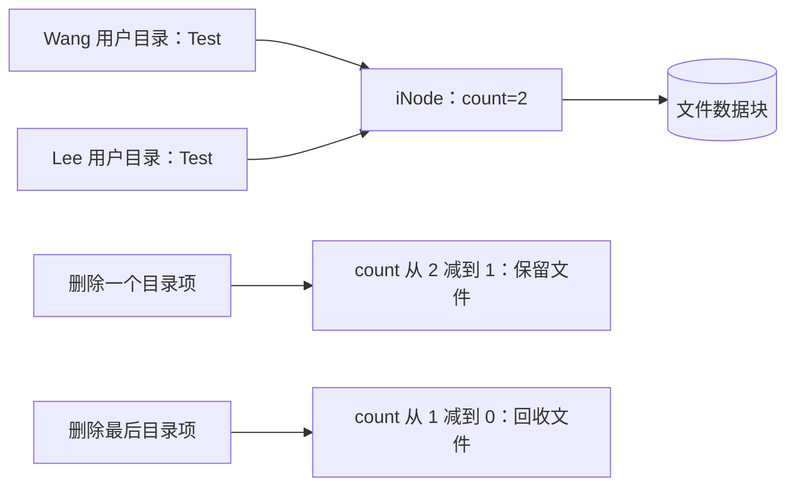

树形目录中允许文件有多个父目录即可共享。基于 iNode 的实现让多个目录项指向同一 iNode，并用链接计数 `count` 记录引用数：新增链接时加一，删除目录项时减一，只有计数为零才释放文件。

> **图示解读（链接计数）**：两个用户目录中的 `Test` 项共同指向同一 iNode；删除其中一项只让 `count:2→1`，文件仍存在；删除最后一项使 `count:1→0`，才回收 iNode 和数据块。

### 2. 符号链接


硬链接直接共享 iNode；符号链接保存路径名。前者不能随意跨文件系统，后者可以跨文件系统但访问时需要再次解析路径。

符号链接允许多个父入口，但只有一个是真正主目录项，其他入口保存源文件的路径名。Linux 命令 `ln -s 源文件 目标文件` 创建符号链接。

- 优点：删除源目录项时不会留下悬空 iNode 指针；可跨文件系统。
- 缺点：访问共享文件时要按路径重新查找，增加磁盘访问；符号链接文件本身也占空间。

> **图示解读（共享方式对比）**：硬链接图中多个目录直接连同一节点；符号链接图中辅助文件保存路径，再沿路径到主文件。前者共享 iNode，后者共享名字解析结果。

---

## 五、文件保护

文件安全受人为、系统和自然因素影响，可采用访问控制、系统容错与后备/恢复系统。这里重点是访问控制。

### 1. 访问权与保护域

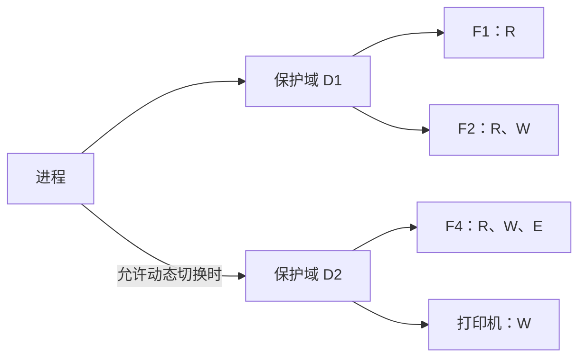

静态域表示进程始终绑定一个域；动态域表示同一进程可依据访问矩阵中的切换权进入另一个域。

访问权是进程对对象执行操作的权利，写成“对象名 + 权集”，如 $(F_1,\{R,W\})$。进程拥有的一组访问权构成**保护域**。

- 进程与域一一对应：静态联系/静态域。
- 进程可在多个域间切换：动态联系。

> **图示解读（域的集合）**：三个椭圆表示域，内部列出文件和打印机的 R/W/E 权限；域可相交，交叠处对象同时属于多个域但权限可不同。

### 2. 访问矩阵

访问矩阵以行表示域、列表示文件/设备等对象，单元格保存 R（读）、W（写）、E（执行）等权集。把域也作为对象列后，可用 S（switch）表示域切换权；若 `access(D1,D2)` 有 S，则 D1 中进程可切到 D2。

> **图示解读（矩阵）**：$D_1,D_2,D_3$ 三行分别对 $F_1…F_6$、打印机和绘图仪给出权集；加入域列后，S 出现在域对域的格子，形成受控的状态转换边。

课件基础访问矩阵转写如下：

| 域/对象 | $F_1$ | $F_2$ | $F_3$ | $F_4$ | $F_5$ | $F_6$ | 打印机 1 | 绘图仪 2 |
|---|---|---|---|---|---|---|---|---|
| $D_1$ | R | R、W |  |  |  |  |  |  |
| $D_2$ |  |  | R | R、W、E | R、W |  | W |  |
| $D_3$ |  |  |  |  |  | R、W、E | W | W |

加入域对象列后的切换权为：$D_1\rightarrow D_2$、$D_2\rightarrow D_3$。它只授权进程切换保护域，不等同于对普通文件的读写权。

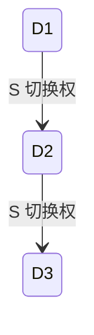

### 3. 矩阵的动态修改

1. **复制权**：带复制标记的权可沿同一对象列授予其他域。
2. **所有权 O**：对象所有者可增加或删除该对象列中的访问权。
3. **控制权 Control**：控制另一域对应的行，可改变该域对不同对象的权。

课件示例中，D1 利用所有权删除 D3 对 $F_1$ 的执行权；D2 为 D3 增加对 $F_2,F_3$ 的写权；若 `access(D2,D3)` 含 Control，则 D2 可修改 D3 整行权限。

> **图示解读（修改前后矩阵）**：每组左右表只改变同列或同行的少量格子，撇号标识可复制的权，`O` 标识所有权，`Control` 位于域列；对比说明“复制改同列、所有者管对象列、控制权管目标域行”。

### 4. 稀疏矩阵的实现

完整访问矩阵大多为空，通常压缩为：

- **ACL（访问控制表）**：按对象列保存非空 `(域/用户, 权集)`；文件 ACL 放在 FCB/iNode 中。
- **访问权限表/能力表**：按域行保存对象及权集，描述某用户/进程可对哪些对象做什么。

Windows XP 权限界面展示按用户/组设置 Allow/Deny 的完全控制、修改、读与执行、读、写及特殊权限；UNIX `ls -l` 则用类型位和所有者/组/其他三组三位 `rwx` 表示权限，并同时显示链接数、属主、组、大小、时间和文件名。

Windows 权限编辑器中可配置的项目为：

| 权限项目 | Allow | Deny |
|---|---|---|
| Full Control | 可选 | 可选 |
| Modify | 可选 | 可选 |
| Read & Execute | 可选 | 可选 |
| Read | 可选 | 可选 |
| Write | 可选 | 可选 |
| Special Permissions | 可选 | 可选 |

课件中的部分 UNIX 权限行转写如下：

| 权限与类型 | 链接数、属主 | 组 | 大小 | 时间 | 名称 |
|---|---|---|---:|---|---|
| `-rw-rw-r--` | `1 pbg` | `staff` | 31200 | Sep 3 08:30 | `intro.ps` |
| `drwx------` | `5 pbg` | `staff` | 512 | Jul 8 09:33 | `private/` |
| `drwxrwxr-x` | `2 pbg` | `staff` | 512 | Jul 8 09:35 | `doc/` |
| `-rw-r--r--` | `1 pbg` | `staff` | 9423 | Feb 24 2003 | `program.c` |
| `-rwxr-xr-x` | `1 pbg` | `staff` | 20471 | Feb 24 2003 | `program` |

> **图片转写（Windows 与 UNIX）**：Windows 图是对象的 ACL 编辑器，先选用户/组再勾选允许或拒绝；UNIX 图每行开头如 `-rw-rw-r--`，首字符表示类型，后三组三位分别对应 owner/group/others。

---

## 六、Linux 文件系统实例

### 1. 虚拟文件系统 VFS

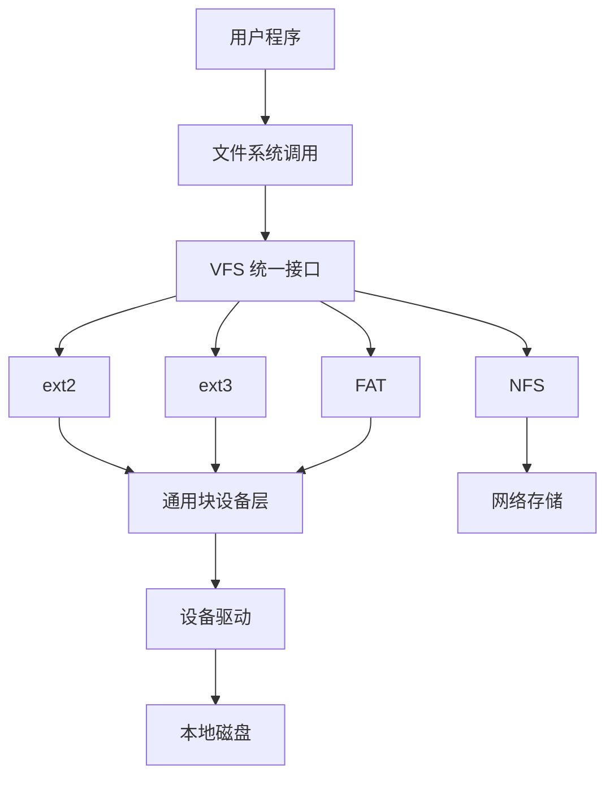

VFS 位于系统调用与具体文件系统之间，通过统一操作集屏蔽本地磁盘格式和远程文件系统的实现差异。


VFS 隐藏本地存储和远程网络存储的硬件细节，把统一操作与具体文件系统实现分离，使 Linux 能同时支持多种文件系统。

四个主要对象：

1. **superblock**：描述一个已安装文件系统的整体信息。
2. **iNode**：描述文件的物理属性。
3. **dentry**：目录项，描述名字到 iNode 的逻辑关联。
4. **file**：描述某进程当前打开的文件实例及状态。

> **图示解读（VFS 层次）**：用户程序经系统调用进入 VFS；VFS 下方并列 ext2、ext3、FAT、NFS 等具体实现，再经通用块层/设备驱动到本地磁盘或网络设备。统一接口使上层不依赖具体格式。

### 2. ext2 文件系统


```mermaid
flowchart LR
    SB[超级块] --> GD[组描述符] --> BB[数据块位图] --> IB[iNode 位图] --> IT[iNode 表] --> DB[数据块]
```

上图第一层表示整盘划分，第二层展开一个块组内部的顺序布局。位图分别管理数据块和 iNode 的分配状态。

磁盘整体为“引导块 + 多个块组”。每个块组依次含：

- 超级块：整个文件系统信息。
- 组描述符：块组起止块号等。
- 数据块位图：每位标识数据块是否空闲。
- iNode 位图：每位标识 iNode 是否使用。
- iNode 表：每个 iNode 固定 128 B，每个文件占一个 iNode，iNode 数量限制可创建文件数。
- 数据块：只存一个文件的数据，课件列出 1 KB、2 KB、4 KB 三种块大小。

> **图示解读（ext2 布局）**：上层长条把磁盘切成引导块和块组 0…n；下层放大单个块组，严格按“超级块—组描述符—两种位图—iNode 表—数据块”排列，位图分别管理两类资源的空闲状态。

---

## 七、练习与课程思政

课件给出两页“无需提交”的黄色练习标注：

- 第一页：简答 1、2；计算 13、14；综合应用 18。
- 第二页：简答 3、4、11、12；计算 15、16；综合应用 20。

课程思政材料从中兴、华为等事件谈核心技术受制风险，并提到“核高基”等专项对核心电子器件、高端通用芯片和基础软件的推动。课件认为国产 OS 的成功不仅取决于技术，还需要政策、市场、生态、人才、软硬件适配与用户共同参与；应在开放生态中增强自主创新并形成良性循环。

---

## 本章小结

| 主题 | 核心结论 |
|---|---|
| 文件抽象 | 数据项组成记录，记录组成有结构文件；流式文件无记录结构 |
| 逻辑组织 | 顺序适合批量，索引便于随机，索引顺序兼顾二者，哈希按键计算地址 |
| 目录 | FCB/iNode 管元数据，树和无环图支持层次与共享 |
| 共享 | 硬链接共享 iNode 与计数；符号链接保存路径 |
| 保护 | 保护域和访问矩阵描述权限，ACL/能力表压缩稀疏矩阵 |
| Linux | VFS 提供统一抽象，ext2 以块组、位图、iNode 表和数据块组织磁盘 |

> **知识导图转写**：第 8 章以“文件管理”为中心，分文件和文件系统、文件逻辑结构、文件目录、文件共享与文件保护。逻辑结构包含顺序、索引、索引顺序、直接和哈希文件；目录包含 FCB/iNode、单级、两级、树形和无环图；共享包含有向无环图/硬链接与符号链接；保护包含保护域和访问矩阵。

## 逐图覆盖审计

以下编号按源 `full.md` 中图片引用的出现顺序排列，连续区间覆盖全部引用；正文不保留图片文件或路径。

| 引用序号 | 核查结果与知识库落点 |
|---:|---|
| 1 | 本章知识结构图，重构为开篇 Mermaid 知识关系图 |
| 2～4 | 增长图标与办公场景照片，无新增知识语义，已作装饰说明 |
| 5 | 文件—记录—数据项层次图，重构为 Mermaid |
| 6～11 | OS、用户和工具模板图标，无新增知识语义 |
| 12 | 文件系统接口—软件集合—对象属性三层模型，结合纵向软件栈重构为 Mermaid |
| 13～24 | 主页、锁、图层、用户、工具及办公照片等章节模板，无新增知识语义 |
| 25 | 定长记录地址和记录指针图，转换为 Mermaid、公式与文字说明 |
| 26～34 | 索引、索引顺序、直接与哈希文件段落中的模板图；相邻技术结构已按源表格和文字重构为 Mermaid、公式及原生表格 |
| 35 | 磁盘、分区、目录区与文件区布局，重构为 Mermaid |
| 36～46 | 文件目录段落的照片和主页/图层/锁模板，无新增知识语义 |
| 47 | 分区内目录与文件布局的重复图，已由“文件目录”开篇 Mermaid 覆盖 |
| 48 | OS 圆环模板标志，无知识语义 |
| 49～51 | 两级目录、目录项指向对象和树形目录图，重构为 Mermaid 并补充路径说明 |
| 52～57 | 目标、组织、工具、对话及目录操作场景图标；目录操作已文字化，图标无新增语义 |
| 58 | 共享子目录和文件的无环图，重构为 Mermaid |
| 59 | 目标模板图标，无新增知识语义 |
| 60～61 | 根目录、`/usr`、`/usr/ast` 目录块逐层查询图，重构为 Mermaid 并保留 iNode 与盘块号 |
| 62～64 | 目标与 OS 模板图标，无新增知识语义 |
| 65～66 | 两个目录项共享 iNode、链接计数变化和删除过程，重构为 Mermaid |
| 67～68 | OS 圆环模板标志，无知识语义 |
| 69 | 符号链接目录关系图，重构为 Mermaid 并与硬链接对比 |
| 70～73 | 数据库/连接/统计图标与工作照片，属于章节装饰，无新增知识语义 |
| 74 | 三个保护域及其访问权集合，重构为 Mermaid，并用原生表格保存访问矩阵 |
| 75～77 | OS 圆环模板标志，无知识语义 |
| 78 | Windows ACL 权限界面，权限项目转为原生管道表格，界面操作文字化 |
| 79～80 | 用户与工具模板图标，无新增知识语义 |
| 81 | VFS 层次与具体文件系统关系，重构为 Mermaid |
| 82～85 | 章节编号箭头模板，无新增知识语义；四类 VFS 对象由 Mermaid 与文字说明覆盖 |
| 86 | ext2 整盘和块组内部布局，重构为两个 Mermaid 流程图 |
| 87 | 本章知识结构总结图，与图片 1 重复，已由开篇 Mermaid 完整覆盖 |

审计结论：**87 个图片引用**已逐一核查；技术图均已转换为 Obsidian 原生 Mermaid、原生管道表格、LaTeX、代码块或完整文字描述，装饰图亦已说明。
