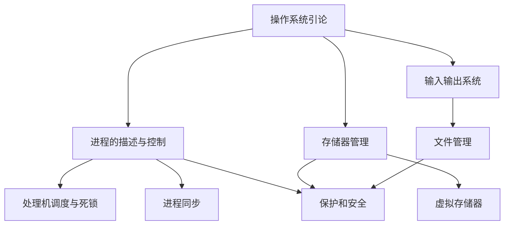

# 操作系统课程笔记

> 本课程笔记依据 `操作系统/课件` 中 15 份 MinerU 转换结果重构。课件文字、公式、表格以及 1082 个图片引用承载的信息均已转换为 Obsidian 原生 Mermaid、Markdown 管道表格、LaTeX、代码块或文字描述，章节笔记不依赖任何图片。

## 主要内容

- 操作系统基本概念、结构、运行环境和系统调用
- 进程、线程、处理机调度、死锁与进程同步
- 连续分配、分页、分段和虚拟存储
- I/O 系统、设备控制、缓冲与磁盘调度
- 文件系统、目录、共享、保护与 Linux 文件系统实例
- 保护机制、访问控制、安全威胁与系统安全

---

## 一、章节导航

| 章节 | 笔记 | 核心问题 |
|---|---|---|
| 第 1 章 | [[操作系统/笔记/1.1 操作系统引论\|操作系统引论]] | 操作系统是什么，如何组织和管理计算机资源 |
| 第 2 章 | [[操作系统/笔记/2.1 进程的描述与控制\|进程的描述与控制]] | 进程、线程如何表示、切换、通信和控制 |
| 第 3 章 | [[操作系统/笔记/3.1 处理机调度与死锁\|处理机调度与死锁]] | 如何分配处理机并避免、检测和解除死锁 |
| 第 4 章 | [[操作系统/笔记/4.1 进程同步\|进程同步]] | 并发进程如何互斥、同步和协作 |
| 第 5 章 | [[操作系统/笔记/5.1 存储器管理\|存储器管理]] | 如何完成内存分配、地址转换、分页和分段 |
| 第 6 章 | [[操作系统/笔记/6.1 虚拟存储器\|虚拟存储器]] | 如何利用局部性、请求调页和置换扩充地址空间 |
| 第 7 章 | [[操作系统/笔记/7.1 输入输出系统\|输入输出系统]] | 设备、中断、DMA、缓冲和磁盘调度如何协同 |
| 第 8 章 | [[操作系统/笔记/8.1 文件管理\|文件管理]] | 文件、目录、共享、保护和具体文件系统如何组织 |
| 第 12 章 | [[操作系统/笔记/12.1 保护和安全\|保护和安全]] | 系统如何限制访问、隔离风险并抵御安全威胁 |

> `操作系统/课件` 当前没有第 9、10、11 章的 MinerU 课件目录，因此本轮没有生成这三章笔记。

---

## 二、知识结构

学习主线可概括为：先建立操作系统整体模型，再学习 CPU、内存和 I/O 三类资源的管理机制，最后从文件抽象和保护安全角度理解系统如何提供可靠服务。

---

## 三、课件与图片覆盖

| 章节 | MinerU 课件 | 图片引用 | Mermaid |
|---|---:|---:|---:|
| 第 1 章 | 1 | 119 | 21 |
| 第 2 章 | 2 | 138 | 20 |
| 第 3 章 | 3 | 218 | 21 |
| 第 4 章 | 1 | 72 | 10 |
| 第 5 章 | 2 | 155 | 22 |
| 第 6 章 | 2 | 65 | 16 |
| 第 7 章 | 2 | 157 | 22 |
| 第 8 章 | 1 | 87 | 21 |
| 第 12 章 | 1 | 71 | 15 |
| **合计** | **15** | **1082** | **168** |

- 每篇章节笔记末尾均有图片转写审计，覆盖对应 `full.md` 的全部图片编号。
- 能可靠重构的流程、状态、时序、层次、体系结构和关系图均已转换为 Obsidian 原生 Mermaid。
- 图中的表格全部使用 Obsidian 原生 Markdown 管道表格，公式使用 LaTeX。
- 无法可靠重构的复杂图、界面截图、照片和装饰元素均已转换为文字说明；没有凭空猜测图中语义。
- 9 篇章节笔记共有 168 个 Mermaid，本总索引另含 1 个知识结构图。

---

## 四、建议学习顺序

1. [[操作系统/笔记/1.1 操作系统引论|操作系统引论]]：建立操作系统功能、结构和运行环境的总体认识。
2. [[操作系统/笔记/2.1 进程的描述与控制|进程的描述与控制]] → [[操作系统/笔记/4.1 进程同步|进程同步]] → [[操作系统/笔记/3.1 处理机调度与死锁|处理机调度与死锁]]：掌握并发活动的表示、协作和资源竞争。
3. [[操作系统/笔记/5.1 存储器管理|存储器管理]] → [[操作系统/笔记/6.1 虚拟存储器|虚拟存储器]]：从物理内存管理过渡到按需调页和页面置换。
4. [[操作系统/笔记/7.1 输入输出系统|输入输出系统]] → [[操作系统/笔记/8.1 文件管理|文件管理]]：理解设备数据如何最终形成持久文件抽象。
5. [[操作系统/笔记/12.1 保护和安全|保护和安全]]：综合进程、内存和文件机制理解系统保护与安全。

---

## 本章小结

| 学习维度 | 核心内容 |
|---|---|
| 抽象 | 进程、虚拟地址、文件和设备接口 |
| 资源管理 | CPU 调度、内存分配、I/O 调度和存储组织 |
| 并发控制 | 互斥、同步、通信与死锁处理 |
| 性能 | 局部性、缓存、页面置换、缓冲和磁盘调度 |
| 可靠性 | 隔离、访问控制、保护域和安全机制 |
