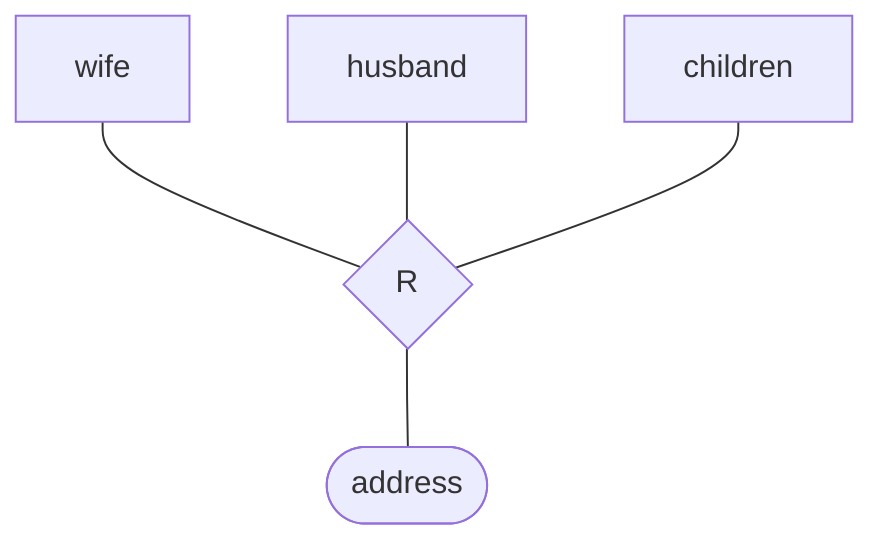

# 2015 数据库系统原理试卷

> 本文由《数据库系统原理》试卷原题转换而成，依据原 PDF、PaddleOCR 转写或原始 HTML 页面整理。原题中的题干、参考答案、关系模式、公式与代码均尽量保留；OCR 疑似错误不作无依据改写。

> [!tip] 真题导航
> 下一份：[[2015—2016 学年第二学期数据库系统原理期末试卷（A 卷）]]

## 主要内容

- 数据库系统基本概念与数据模型
- 关系代数、SQL 与完整性约束
- E-R 模型与数据库设计
- 关系规范化与函数依赖
- 事务、并发控制、恢复与索引

---

## 一、转写说明

| 项目 | 内容 |
|---|---|
| 课程 | 数据库系统原理 |
| 资料类型 | 试卷真题 |
| 整理日期 | 2026-08-12 |
| 转写原则 | 保留原题与原答案；不擅自修正知识性内容 |

> [!warning] OCR 与答案说明
> 文中可能保留原卷或 OCR 的拼写、符号与答案问题。无答案处不自行补写；图片信息已改为 Mermaid、原生表格或完整文字描述，最终笔记不保留图片。

---

## 二、原题与参考答案

Test One

Class___No___Name___

### 1. (2 x 3 points) Given a table Employees and some SQL queries on it, why are these queries wrong?

Employees(employee-id, employee-name, company-id, employee-city, age, salary)

It is assumed that each employee has an unique id and name.

(1) create table Employees

( employee-id char(20),

employee-name char(20),

company-id char(20),

employee-city char(20),

age integer,

salary integer,

primary key (employee-id), primary key (employee-name),

check (age >0)

)

(2) select employeeid, sum(salary)

    from Employees

    group by company-id

    having avg(salary)>1000

2. （6 points）给出下列关系代数操作对应的 SQL 语句

(1)  $\sigma_{p}(r)$ (2)  $\Pi_{A1,A2,...,Am}(r)$

(3)  $r \infty s$,

，假设 r(A, B, C), s(C, E, F)

Answers:

3. （6 points）给出下列 SQL 语句对应的关系代数表达式

(1) select branch-name, max (salary)

from pt-works

group by branch-name

假设 pt-works(employee-name, branch-name, salary)

(2) insert into r

select  $A_{1}, A_{2}, \ldots, A_{m}$

from  $r_{1}, r_{2}, \ldots, r_{n}$

where P

(3) update loan

set amount = amount  $*1.2$

where amount > 1000

Answers:

4. (10 points)Given two tables branch ( $\underline{\text{branch-name}}$, branch-city, assets) and Account( $\underline{\text{account-number}}$, branch-name, balance) as follows,

| - dbo. branch | 摘要 | 对象资 |
|---|---|---|
| branch-name | branch-city | assets |
| Brighton | Brooklyn | 7100000 |
| Downtown | Brooklyn | 9000000 |
| Mianus | Horseneck | 400000 |
| North Town | Rye | 3700000 |
| Perryridge | Horseneck | 1700000 |
| Pownal | Bennington | 300000 |
| Redwood | Palo Alto | 2100000 |
| Round Hill | Horseneck | 8000000 |
| NULL | NULL | NULL |

### - dbo.account 摘要 对象资源

| account-number | branch-name | balance |
|---|---|---|
| A-101 | Downtown | 500 |
| A-102 | Perryridge | 400 |
| A-201 | Brighton | 900 |
| A-215 | Mianus | 700 |
| A-217 | Brighton | 750 |
| A-222 | Redwood | 700 |
| A-305 | Round Hill | 350 |
| NULL | NULL | NULL |

(1) If the table account is defined as :

create table account

(account_number char(10),

branch_name char(15),

balance integer,

primary key (account_number),

foreign key (branch name) references branch )

whether or not the following SQL statements are permitted to be executed, and why?

(i) Update account

set branch-name='Haidian'

where account-number='A-101'

(ii) delete

from branch

where branch-name='Pownal'

Answers:

(2) If the table account is defined as :

create table account

(account_number char(10),

branch_name char(15),

balance integer,

primary key (account_number),

foreign key (branch_name) references branch

on delete cascade

on update cascade

)

whether or not the following SQL statements are permitted to be executed, and why?

(iii) Update branch

set branch-name='Haidian'

where branch-name='Brighton'

(iv) Update account

set branch-name='Haidian'

where account-number='A-101'

Answers:

5. (4 points) For the entity sets A and B and the relationship set R among them in the following figure,

(1) point out the participation constraints of A and B in R

(2) what is the mapping cardinality form A to B

> [!note] 原图转写：联系的基数约束
> 实体集 A 通过联系 R 与实体集 B 相连；A 端标注 `1…*`，B 端标注 `0…1`。

Answers:

6. (6 points) Reduce entity set customer into two relational tables:

| $\underline{\text{c-id}}$ | c-name | d-names | street | city |
|---|---|---|---|---|
| 321-12-2 | John | {Hayes, Adams} | North | Rye |
| 322-10-4 | Smith | {Mary, Elice} | Spring | Princeton |

Answers:

7. (6 points) Convert the following E-R diagram into a diagram that contains only binary relationships, and give the definitions of the entities and relationships in this diagram

> [!note] 原图转写：三元联系
> 实体 `wife`、`husband`、`children` 共同参与三元联系 `R`，联系具有属性 `address`。

Answers:

8. (20 points) Consider the following relations in an enterprise database, where the primary keys are underlined.

Employee(employeeID), employeename, age, address, sex, salary, deptID)

Department(deptID, deptname, managerID, managername)

DepartLocations(deptID, deptlocation)

Project(projectID, projectname, projectlocation, deptID)

Workson(employeeID, projectID, hours)

Dependent(employeeID, dependentname, sex, Birthdate, Relationship)

1) (5 points) Use a SQL statement to define the relational table Employee, in which {employeeID} is the primary key, and {employee-name} is the candidate key and is not permitted to be null; there also exists the referential integrity between the table Employee and Department. It is also required that the value of an employee's salary is between 2000 and 10000.

Answer:

create table employee

(employeeID integer,

employeename varchar(50), /*也可以采用其它长度的 varchar、char 类型 age int,
address varchar(50),
sex varchar(50)

salary int;  /其它数值类型也可以
primary key (employeeID),
unique (employeename), not null,
foreign key (deptID) references Department,
check (salary between 2000 and 10000)
)
4 个完整性约束，每个 1 分。

2) (5 points) For each department which has at least 10 employees, list its deptID, and calculate the total number of the employees who work in this department and whose salaries are more than 4000. Give one or more SQL statements to list the query result in descending order of the attribute deptID.

（检索出至少有 10 名员工的部门的部门号，并统计出这些部门中收入超过 4000 元的员工数目，并以部门号降序列出查询结果（部门号，统计出的员工数目））Answer:

3) (5 points) Use a SQL statement to add a new attribute city into the table. DepartLocations. It is assumed that the data type of city is varchar(50).

Answer:

4) (5 points) A new project is started, and its information is as follows: projectID=1021, projectname='Building', projectlocation='Shanghai', deptID='201'. Find out from the department '201' all employees who currently do not work for any projects, and assign to them to this new project '1021'. It is assumed that these selected employees will work for the new project for 500 hours.

Give SQL statements to modify the tables in the database, so as to record all the information about the new project '1021' and the employees working on this project.

Answer:

9. (10 points) Given  $R$ (A, B, C, D, E, F, G, H), and  $F = \{A \to F, B \to E, BE \to F, E \to C, A \to G, G \to CD\}$ holding on  $R$, find out all candidate keys of  $R$

(利用求候选键算法，给出计算过程)

Answers:

10. (8 points) Given a schema R (A, B, C) and F = {A → B, B → C} holds on Student, and the decomposition {R1(A, B); R2(A, C)} on R, is this decomposition lossy or lossless? Why? is this decomposition dependency preserving? Why?.

Answers:

11. (6 points) For the following schema R and F holding on it, list all the candidate keys, give the highest normal form it belongs to, and explain why  $\text{R(A,B,C,D,E),}\quad\text{F} = \{\text{A} \rightarrow \text{BC}, \text{CD} \rightarrow \text{E}, \text{B} \rightarrow \text{D}, \text{E} \rightarrow \text{A}\}$

12. (12 points) Considering the schema R=(athlete-id, game-event, grade, category of games, manger of games) that describes the sports meeting. It is assumed that

● for each athlete, if he takes part in a game event, he will achieve one and only one grade

each game event belongs to one and only one category

each category is managed by one and only one manager

(1) According to the descriptions mentioned above, list the functional dependency set F that holds on R ___ (3 points)

(2) List all the candidate keys of R. (2 points)

(3) Give a lossless and dependency-preserving decomposition of R into 3NF. (5 points)

答案：

---

## 本章小结

| 模块 | 主要考查内容 |
|---|---|
| 基础理论 | 数据库体系结构、数据模型、完整性与数据独立性 |
| 查询语言 | 关系代数、SQL 定义与数据操纵 |
| 数据库设计 | E-R 建模、模式转换、函数依赖与规范化 |
| 系统实现 | 索引、事务、并发控制、日志与故障恢复 |

> [!tip] 真题导航
> 下一份：[[2015—2016 学年第二学期数据库系统原理期末试卷（A 卷）]]
