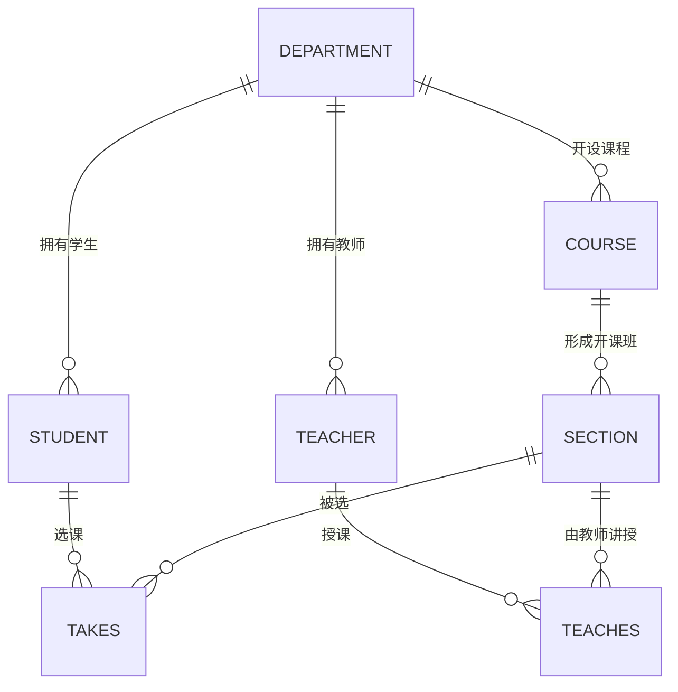
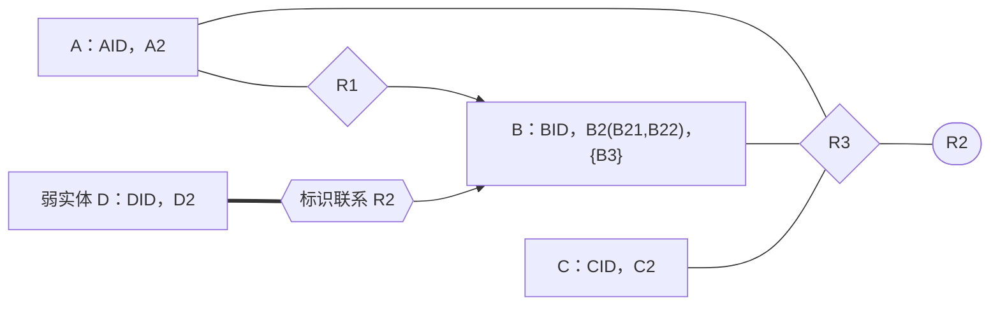

# 2015—2016 学年第二学期数据库系统原理期末试卷（A 卷）

> 本文由《数据库系统原理》期末考试原题转换而成，依据原 PDF、PaddleOCR 转写或原始 HTML 页面整理。原题中的题干、参考答案、关系模式、公式与代码均尽量保留；OCR 疑似错误不作无依据改写。

> [!tip] 真题导航
> 上一份：[[2015 数据库系统原理试卷]]；下一份：[[2016 年数据库系统原理期中试卷]]

## 主要内容

- 数据库系统基本概念与数据模型
- 关系代数、SQL 与完整性约束
- E-R 模型与数据库设计
- 关系规范化与函数依赖
- 事务、并发控制、恢复与索引

---

## 一、转写说明

| 项目 | 内容 |
|---|---|
| 课程 | 数据库系统原理 |
| 资料类型 | 期末考试真题 |
| 整理日期 | 2026-08-12 |
| 转写原则 | 保留原题与原答案；不擅自修正知识性内容 |

> [!warning] OCR 与答案说明
> 文中可能保留原卷或 OCR 的拼写、符号与答案问题。无答案处不自行补写；图片信息已改为 Mermaid、原生表格或完整文字描述，最终笔记不保留图片。

---

## 二、原题与参考答案

| 考试注意事项 | 一、学生参加考试须带学生证或学院证明，未带者不准进入考场。学生必须按照监考教师指定座位就坐。二、书本、参考资料、书包等物品一律放到考场指定位置。三、学生不得另行携带、使用稿纸，要遵守《北京邮电大学考场规则》，有考场违纪或作弊行为者，按相应规定严肃处理。四、学生必须将答题内容做在试题答卷上，做在试题及草稿纸上一律无效。五、填空题用英文答，中文答对得一半分。 |  |  |  |  |
|---|---|---|---|---|---|
| 考试课程 | 数据库系统原理 |  |  | 考试时间 |  |
| 题号 | 一 | 二 | 三 | 四 | 五 |
| 满分 | 10 | 18 | 8 | 10 | 12 |
| 得分 |  |  |  |  |  |
| 阅卷教师 |  |  |  |  |  |

| 考试注意事项 |  |  |  |  |  |
|---|---|---|---|---|---|
| 考试课程 |  |  |  | 2016年6月21日 |  |
| 题号 | 六 | 七 | 八 | 九 | 十 |
| 满分 | 6 | 10 | 4 | 4 | 8 |
| 得分 |  |  |  |  |  |
| 阅卷教师 |  |  |  |  |  |

| 考试注意事项 |  |  |  |  |
|---|---|---|---|---|
| 考试课程 |  |  |  |  |
| 题号 | 十一 |  | 总分 |  |
| 满分 | 10 |  | 100 |  |
| 得分 |  |  |  |  |
| 阅卷教师 |  |  |  |  |

1. Fill in blanks.  $(1 \times 10 \text{ points})$

(1) Nowadays, there are several commonly-used database system products. Among the following statements, the correct one/ones is/are _____.

A. SQL Server is Microsoft Corp's product, and Oracle and DB2 are developed by IBM.

B. MySQL belongs to open-source database systems.

C. SQL Server and Sybase are based on the relational model, Oracle and DB2 are based on the E-R model, and MySQL are based on the object-oriented model.

D. In a SQL Server database application system programmed in C, the application program can access SQL Server via application program interface, such as ODBC.

E. As a large scale database application system, 12306 Railway Ticket Booking System has a three-tier Browser-Server(B/S)-like architecture.

(2) The ability to modify the physical schema without changing the logical

schema or the views is _____data Independence, that is application programs need not be rewritten if the physical schema changes.

(3) The foreign key values in any tuple of relation  $r_{1}$ are either null or must appear as the _____ values of a tuple of the referenced relation  $r_{2}$.

(4) The six fundamental operations in the relational algebra are select, project, ___, set difference, Cartesian product, and rename.

(5) Given  $R(U)$,  $X$,  $Y \subseteq U$, and the functional dependency  $X \to Y$ holds on  $R$. If there is a subset  $X' \subset X$ and  $X' \to Y$ holds on  $R$, then  $X \to Y$ is a _____ dependency.

(6) There are three possible ways of organizing records in files: heap file organization, ___, and hashing file organization.

(7) Query processing refers to the range of activities involved in extracting data from a database. The basic steps in processing a query are parsing and translation,_____, and evaluation.

(8) Transaction _____ property means that after a transaction completes successfully, the changes it has made to the database persist, even if there are system failures.

(9) The _____ two-phase locking protocol requires that all S-locks and X-locks are held until the transaction commits.

(10) _____, also called system catalog, stores metadata, e.g. data about data, such as names and types of attributes of each relation, number of tuples in each relation, names and definitions of views.

2. (18 points) The schema diagram in the database University is given below,

the primary keys in the relational tables are underlined. The table

Department, Student, Teacher and Course describe the four data objects in

A teacher in a department teaches a course in a class, and a student to learn a course, in the Spring or Fall Semester in a year.

Section maintains the information on all classes (sections) taught. Class is identified by a course_id, sec_id, year, and semester, is taught in a class/section in the Spring or Fall semester in a year. The location and time of the course offering in a section are given by building room no. and time slot.

> [!note] 原图转写：University 关系模式
> 图中包含 `Student`、`Department`、`Teacher`、`Course`、`Section`、`Takes` 与 `Teaches`。学生和课程属于院系；`Section` 由课程号、班号、学期、年份等标识；`Takes` 连接学生与开课班并记录成绩，`Teaches` 连接教师与开课班。

Figure 1

(1) Use a SQL statement to find the names of all students who are in CS department and have  $\underline{\text{tot_cred}}$ values greater than that of some one student in EE department. (5 points)

at, if the total number of the courses he takes in the 2016 Spring

er than 2, then give a SQL statement or SQL statements to

red (i.e. the total credits hours the student earned so far) by 10

(6 points)

(3) Give a relational algebra expression, to find the names of all teachers belonging to the departments located in Building3. (3 points)

(4) To speed up the query in (3), use SQL statements to define some indexes on the tables involved in this query. (4 points)

3. (8 points) Convert the following E-R diagram to the proper relation schemas and identify the primary key of each relation.

> [!note] 原图转写：含弱实体与复合属性的 E-R 图
> A 的属性为主键 `AID` 与 `A2`；B 的属性为主键 `BID`、复合属性 `B2(B21,B22)` 和多值属性 `B3`；C 的属性为主键 `CID` 与 `C2`；D 是弱实体，具有部分键 `DID` 和属性 `D2`。`R1` 连接 A、B 并指向 B；`R3` 是 A、B、C 的三元联系且具有属性 `R2`；弱实体 D 通过双菱形标识联系依赖 B。

Figure 2

4. (10 points) Consider the following information about the pharmacies, patients and drugs:

(1) Patients are identified by an SSN, and their names, addresses, and ages must be recorded.

(2) Doctors are identified by an SSN. For each doctor, the name, specialty, and years of experience must be recorded.

(3) Each pharmaceutical company (制药公司) is identified by name and has a phone number.

(4) For each drug, the trade name and formula (成份) must be recorded. Each drug is produced by a given pharmaceutical company, and the trade name identifies a drug uniquely from among the products of that company.

(5) Each pharmacy(药房) has a name, address, and phone number. Each pharmacy is identified by ID.

(6) Every patient has a primary doctor. Every doctor has at least one patient.

(7) Each pharmacy sells several drugs and has a price for each. A drug could be sold at several pharmacies, and the price could vary from one pharmacy to another.

(8) Doctors prescribe drugs for patients. A doctor could prescribe one or more drugs for several patients, and a patient could obtain prescriptions from several doctors. Each prescription has a date and a quantity associated with it.

(9) Pharmaceutical companies have long term contracts with pharmacies. A pharmaceutical company can contract with several pharmacies, and a pharmacy can contract with several pharmaceutical companies. For each contract, you have to store a start date, an end date.

Design the E-R Diagram on the basis of the information above.

5. (12 points) The functional dependency set  $F = \{AB \rightarrow C, A \rightarrow DEI, B \rightarrow FH, F \rightarrow GH, D \rightarrow IN\}$ holds on the relation schema R = (A, B, C, D, E, F, G, H, I, N),

(1) Compute  $(AD)^{+}$

(2) List all the candidate keys of R.

(3) What is the highest normal form of R? Why?

(4) Compute the canonical cover  $F_{c}$

(5) Give a lossless and dependency-preserving decomposition of R into 3NF. (3 points)

6. (6 points) Give the data file student(student_dept, student_ID, student_name) as shown below, which is organized as a sequential file, taking the attribute student_dept as the search key.

(1) The index a dense or sparse index, why?

(2) If a tuple (IS, 0430, Zhu) is deleted from the indexed file, depict the indexed file and the index file.

(3 points)

> [!note] 原图转写：按院系建立的索引文件
> 索引文件保存院系代码并指向按 `student_dept` 排列的学生记录。原图中的记录依次为：`(ED,0120,Wang)`、`(ED,0150,Zhao)`、`(GS,0260,Li)`、`(GS,0280,Zhang)`、`(HD,0360,Yang)`、`(HD,0390,Liu)`、`(IS,0430,Zhu)`、`(SD,0580,Chen)`。索引项指向相应院系的首条记录，数据记录之间按顺序链接。

Figure 3

7. (10 points) Consider the database University given in Figure 1.

(1) Give a SQL statement to find some students and list their names and departments that they belong to. It is required that their total credits (presented by total credit) are more than 40, their departments are located in Building 3, and they take the course identified by '2016CSDBS'. (3 points)

(2) For the SQL statement in (1), give an optimized query tree. (7 points)

8. (4 points) Is the concurrent schedule S2 a recoverable schedule, and why?

S2:

| $T_{1}$ | $T_{2}$ | $T_{3}$ |
|---|---|---|
| read(A)A: = A - 1write(A) |  |  |
|  | read(B) |  |
| commit |  |  |
|  |  | read(A)A: = A + 1write(A) |
|  | B: = B - 1write(B) |  |
|  | read(A) |  |
|  |  | commit |
|  | A: = A + 1write(A)commit |  |

9. (4 points) Is S3 a cascadeless schedule, and why?

| $T_{1}$ | $T_{2}$ | $T_{3}$ | $T_{4}$ |
|---|---|---|---|
| read(X) X: =X-10 write(X) |  |  |  |
|  |  | read(Y) Y: =Y-10 |  |
|  |  |  | read(Z) Z: =Z+10 |
|  | Read(W) |  |  |
|  |  | Write(Y) commit |  |
| read(Y) Y: =Y+50 write(Y) |  |  |  |
|  | W:=W-20 write(W) commit |  |  |
| commit |  |  |  |
|  |  |  | write(Z) read(W) W:=W+10 write(W) commit |

(8 points) In the University database system, it is assumed that multiple

varity locks are granted on three-level data items, i.e. the database, tables,

les.

If a transaction  $T_{1}$ is now modifying the table Course by,

update Course

set credits=credits+1

where title='DBS'

, then what types of locks on the database, tables and tuples should it hold?

(2) When  $T_{1}$ is modifying Course, transaction  $T_{2}$ wants to access Course by select *

from Course

where title in {‘OS’, ‘DBS’, ‘Compiler’}

, then what types of three-level locks should  $T_{2}$ request? Among these lock requests, which will be granted, and which will be refused? (5 points)

11. (10 points) Considering the concurrent schedule S4 for transactions $T_{1}, T_{2}$, $T_{3}$and$T_{4}$, and the data items A, B, C, D modified by these transactions. It is assumed that the initial values of these data items are A=4, B=0, C=30, D=10. When a failure occurs, the log-based recovery scheme consults the log to determine the recovery operations (i.e. redo, undo, ignore) done on $T_{1}, T_{2}, T_{3}$and$T_{4}$.

(1) Write the log file records for schedule S4.

(2) After recovery operations on  $T_{1}$,  $T_{2}$,  $T_{3}$ and  $T_{4}$ are completed, what are the values of the data items A, B, C, D in the database? (4 points)

(3) Write down the redo, undo, ignore list of transactions respectively. (2 points) S4:

| $T_{1}$ | $T_{2}$ | $T_{3}$ | $T_{4}$ | recovery |
|---|---|---|---|---|
| begin transaction read(A) |  |  |  |  |
| A:=A+6 write(A) |  |  |  |  |
| begin transaction read(D) |  |  |  |  |
| commit |  |  |  |  |
|  | D:=D+10 write(D) |  |  |  |
|  |  | begin transaction read(B) |  |  |
|  |  | B:=B+5 write(B) |  |  |
| checkpoint |  |  |  |  |
|  |  |  | begin transaction read(C) |  |
|  | read(A) |  |  |  |
|  | A:=A+10 write(A) |  |  |  |
|  | commit |  |  |  |
|  |  |  | C:=C+10 write(C) |  |
|  |  | read(A) |  |  |
|  |  | A:=A+30 write(A) |  |  |
|  |  | commit |  |  |
|  |  |  | read(D) |  |
|  |  |  | D:=D-10 write(D) |  |
|  | ***Failure**** |  |  |  |

---

## 本章小结

| 模块 | 主要考查内容 |
|---|---|
| 基础理论 | 数据库体系结构、数据模型、完整性与数据独立性 |
| 查询语言 | 关系代数、SQL 定义与数据操纵 |
| 数据库设计 | E-R 建模、模式转换、函数依赖与规范化 |
| 系统实现 | 索引、事务、并发控制、日志与故障恢复 |

> [!tip] 真题导航
> 上一份：[[2015 数据库系统原理试卷]]；下一份：[[2016 年数据库系统原理期中试卷]]
