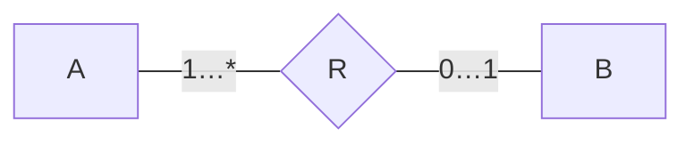

# 2016 年数据库系统原理期中试卷

> 本文由《数据库系统原理》期中考试原题转换而成，依据原 PDF、PaddleOCR 转写或原始 HTML 页面整理。原题中的题干、参考答案、关系模式、公式与代码均尽量保留；OCR 疑似错误不作无依据改写。

> [!tip] 真题导航
> 上一份：[[2015—2016 学年第二学期数据库系统原理期末试卷（A 卷）]]；下一份：[[2016—2017 学年第二学期数据库系统原理期末试卷（B 卷）]]

## 主要内容

- 数据库系统基本概念与数据模型
- 关系代数、SQL 与完整性约束
- E-R 模型与数据库设计
- 关系规范化与函数依赖
- 事务、并发控制、恢复与索引

---

## 一、转写说明

| 项目 | 内容 |
|---|---|
| 课程 | 数据库系统原理 |
| 资料类型 | 期中考试真题 |
| 整理日期 | 2026-08-12 |
| 转写原则 | 保留原题与原答案；不擅自修正知识性内容 |

> [!warning] OCR 与答案说明
> 文中可能保留原卷或 OCR 的拼写、符号与答案问题。无答案处不自行补写；图片信息已改为 Mermaid、原生表格或完整文字描述，最终笔记不保留图片。

---

## 二、原题与参考答案

Test One

Class___No___Name___

### 1. ((10 points) Fill in blanks)

(1)The collection of information stored in the database at a particular moment is called an  $\underline{\text{instance}}$ of the database.

(2)The database system provides users with three levels of data abstraction, the  $\underline{\text{view}}$ level of abstraction describes only part of the entire database.

(3) Database design involves the following phases: requirements analysis,  $\underline{\text{Conceptual}}$ schema design, logical design and physical design.

(4)  $\underline{\text{Data model}}$ is a collection of conceptual tools for describing data, data relationships, data semantics, and data constraints.

(5) As human-machine interfaces, the database language consists of two parts, i.e the data definition language (DDL) and  $\underline{\text{DML}}$ (data manipulation language)____.

(6) With respect to integrity mechanisms in DBS, the  $\underline{\text{trigger}}$ defines actions to be executed automatically when some events occur and corresponding conditions are satisfied.

(7) An entity set that does not have a primary key is referred to as a  $\underline{\text{weak entity set}}$.

(8) For a relation r(R), among schema, the attributes the values of which can be used to uniquely identify the tuples in r(R) is called the  $\underline{\text{key/superkey/primarykey/candidate key}}$ of R.

(9) The six fundamental operations in the relational algebra are select, project, union, set difference, ___, and rename.

(10) Let  $r_{1}(R_{1})$ and  $r_{2}(R_{2})$ be relations with primary keys  $K_{1}$ and  $K_{2}$ respectively, the subset  $\alpha$ of  $R_{2}$ is called the \_\_\_\_\_\_ foreign key \_\_\_\_\_\_ referencing  $K_{1}$ in relation  $r_{1}$, if for every  $t_{2}$ in  $r_{2}$ there must be a tuple  $t_{1}$ in  $r_{1}$ such that  $t_{1}[K_{1}] = t_{2}[\alpha]$

2. (5 points) Given a table Employees and some SQL queries on it, why are these queries wrong?

Employees(employee-id, employee-name, company-id, employee-city, age, salary)

It is assumed that each employee has an unique id and name.

(1) create table Employees

(employee-id char(20),

employee-name char(20),

company-id char(20),

employee-city char(20),

age integer,

salary integer,

primary key (employee-id),

primary key (employee-name),

check (age >0)

)

不能有2个主键

(2) select employeeid, sum(salary)

    from Employees

    group by company-id

    having avg(salary) > 1000

employeeid 不是分组属性，不能出现在 select 子句中

3. （10 points）给出下列关系代数操作对应的 SQL 语句

(1)  $\sigma_{p}(r)$ (2)  $\Pi_{A1,A2, ..., Am}(r)$

(3) roos

(3)  $r \infty s$,

，假设 r(A, B, C), s(C, E, F)
Answers:
(1) select * from r where P
(2) select A1, A2, ..., Am from r
(3) select * from r natural join s
或者：
select * from r where r.C = s.C

4.（10 points）给出下列 SQL 语句对应的关系代数表达式

(1) select branch-name, max (salary)

from pt-works

group by branch-name

假设 pt-works(employee-name, branch-name, salary)

(2) insert into $r$select$A_{1}, A_{2}, ..., A_{m}$from$r_{1}, r_{2}, ..., r_{n}$

where P

(3) update loan

set amount = amount * 1.2

where amount > 1000

Answers:

(1) branch_name  $G_{max(salary)}$ (pt-works)

(2)  $\mathrm{r} \leftarrow \mathrm{r} \cup \pi_{\mathrm{A}1,\mathrm{A}2,\ldots,\mathrm{Am}}(\sigma_{\mathrm{p}}(\mathrm{r}_{1} \times \mathrm{r}_{2} \times \ldots \times \mathrm{r}_{\mathrm{n}}))$

(3) T1 ←  $\Pi_{loan-number, branch\_name, amount \times 1.2} \sigma_{amount} > 1000$ (loan)

T2  $\leftarrow \sigma_{amount} \leq 1000$ (loan)

loan ← T1 ∪ T2

5. (5 points) For the entity sets A and B and the relationship set R among them in the following figure,

(1) point out the participation constraints of A and B in R

(2) what is the mapping cardinality form A to B

> [!note] 原图转写：联系的基数约束
> 实体集 A 通过联系 R 与实体集 B 相连；A 端标注 `1…*`，B 端标注 `0…1`。

Answers:

(1) A: total B: partial

(2) one-to-many

6. (5 points) Convert the entity set “学生”, of which the attribute “老乡” is a multivalued attribute, in Fig.4 into relational tables

| student-id | 籍贯 | 老乡 | 性别 | 年龄 |
|---|---|---|---|---|
| 07494 | 北京 | 07596, 07611 | 男 | 20 |
| 07498 | 河北 | 07320, 07321 | 女 | 19 |

Fig.4

Answers:

| $\underline{\text{student-id}}$ | 籍贯 | 性别 | 年龄 |
|---|---|---|---|
| 07494 | 北京 | 男 | 20 |
| 07498 | 河北 | 女 | 19 |

| $\underline{\text{student-id}}$ | $\underline{\text{老乡}}$ |
|---|---|
| 07494 | 07596 |
| 07494 | 07611 |
| 07498 | 07320 |
| 07498 | 07321 |

7. (20 points) There are four relations in a Student database.
Student(studentID, studentname, sex, age, birthday, schoolID)
Teacher(teacherID, teachername, sex, birthday, schoolID)
Course(courseID, coursename, teacherID)
Score(studentID, courseID, grade)
School(SchoolID, schoolname, dean, location)
Give SQL statements for the following queries:
(1) (5 points) Use a SQL statement to define the relational table Student, in which {studentID} is the primary key, and {studentname} is the candidate key and is not permitted to be null; there are no exists the referential integrity between the table and the student's age is larger than 10.
Student and School. It is required that the student's age is larger than 10.
create table student
(studentID integer primary key /*也可以放在后面用单独 primary key语句定义
studentname varch(50) /*也可以采用其它长度的 varch、char 类型
sex varch(50)
age int,
birthday date /*或：varch(50),
schoolID integer
primary key (studentID) /*也可以在前面 studentID 处定义主键 unique (studentname), not null,
foreign key (schoolID) references School,
check (age>10)
)
主键、候选键、外键、check 定义，每个 0.5 分。其它 1 分。

(2) (5 points) Find the student who takes a course and the grade he gets on this course is higher than the average grade of this course. List the student's name, the name of the course he takes and gets higher grade, and his grade on this course.

Select studentname, coursename, grade

From Score as A, Student, Course

Where A.studentID=Student.studentID and A.courseID=Course.courseID

A. grade >

(Select avg(grade))

From Score as B

Where A.courseID=B.courseID

关键部分答出，2分。

(3) (5 points) Find the courses that are taught by the teachers in School of Computer Science (its SchoolID is SCS) and are taken by at least 5 students. For these courses, list their  $\underline{\text{courseIDs}}$, coursenames, average grades maximal grades and minimal grades, in descending order of the average grades.

Select courseID, coursename, avg(grade) as avggrade, max(grade) as maxgrade, min(grade) as min(grade) as mingrade

From Course Natural Join Score

Where courseID in

{Select courseID

From Teacher Natural Join Course

Where schoolID=SCS

Group by courseID

Having count(studentID)>=5

关键部分答出，2分。

(4) (5 points) Find all students who take the course “Database System Principles”, and increase their scores on this course by 5 points.

Update Score as A

Set grade=grade+5

From Course as B

Where A.CourseID=B.CourseID and B.coursename= Database System Principles

或者：

Update Score as A

Set grade=grade+5

Where CourseID in

{
    Select courseID
    From Course
    Where coursename=Database System Principles
}

8. (5 points) Given  $R(A, B, C, D, E, F, G, H, I)$, and  $F = \{A \to F, B \to E, BE \to F, E \to C, A \to G, G \to CD, I \to E\}$ holding on  $R$, find out all candidate keys of  $R$.

(利用求候选键算法，给出计算过程)

Answers:

参见讲义附录部分的解法

9. (10 points) The relation schema R(U,F),U=(A,B,C,D,E,F,G), The functional dependencies set F={E→G, AC→D,FG→E,AFG→B}:

(1) Compute (ACF) $^+$ (2 points)

(ACF) $^+$={A, C, F, D} 一个 0.5

(2) Consider the decompositionp={R1(A,C,D), R2(A,B,C,E,F,G)}, is this decomposition lossless or lossy? Why? (4points)

是 lossless。 (2分)

因为 R1∩R2 →R1 (2分)

10. (20 points) The functional dependency set  $F = \{A \rightarrow C, C \rightarrow A, B \rightarrow A, D \rightarrow AC, B \rightarrow E\}$ holds on the relation schema R = (A, B, C, D, E),

(1) Compute  $(AB)^{+}$ (3 points)

(2) List all the candidate keys of R. (5 points)

(3) What is the highest normal form of R, and why? (2 points)

(4) Compute the canonical cover  $F_{c}$ (5 points)

(5) Give a lossless and dependency-preserving decomposition of R into 3NF. (5 points)

### Answers:

(1)  $(AB)^{+} = ABCE$

(2) 唯一候选键 BD

(3) R 所属最高范式为 1NF （1 point）

因为：

存在非主属性 A 对候选键 BD 的部分依赖 B→A（或 D→A），

或者：非主属性 E 对键 BD 的部分依赖 B→E；

非主属性 C 对键 BD 的部分依赖 D→C

(4)  $\mathrm{Fc}=\{\mathrm{A}\rightarrow\mathrm{C},\mathrm{C}\rightarrow\mathrm{A},\mathrm{B}\rightarrow\mathrm{AE},\mathrm{D}\rightarrow\mathrm{A}\}$

或者： $\mathrm{Fc} = \{ \mathrm{A} \to \mathrm{C}, \mathrm{C} \to \mathrm{A}, \mathrm{B} \to \mathrm{AE}, \mathrm{D} \to \mathrm{C} \}$

答对 1 个即可，Fc 不完全正确，扣 1 分

(5) 分解 1: 根据  $\mathrm{Fc} = \{ \mathrm{A} \rightarrow \mathrm{C}, \mathrm{C} \rightarrow \mathrm{A}, \mathrm{B} \rightarrow \mathrm{AE}, \mathrm{D} \rightarrow \mathrm{A} \}$

 $\mathrm{R}1(\mathrm{AC}), \mathrm{R}2(\mathrm{ABE}), \mathrm{R}3(\mathrm{AD}), \mathrm{R}4(\mathrm{BD})$

分解2：根据  $\mathrm{Fc}=\left\{\mathrm{A}\rightarrow\mathrm{C},\mathrm{C}\rightarrow\mathrm{A},\mathrm{B}\rightarrow\mathrm{AE},\mathrm{D}\rightarrow\mathrm{C}\right\}$

R1(AC), R2(ABE), R3(CD), R4(BD)

---

## 本章小结

| 模块 | 主要考查内容 |
|---|---|
| 基础理论 | 数据库体系结构、数据模型、完整性与数据独立性 |
| 查询语言 | 关系代数、SQL 定义与数据操纵 |
| 数据库设计 | E-R 建模、模式转换、函数依赖与规范化 |
| 系统实现 | 索引、事务、并发控制、日志与故障恢复 |

> [!tip] 真题导航
> 上一份：[[2015—2016 学年第二学期数据库系统原理期末试卷（A 卷）]]；下一份：[[2016—2017 学年第二学期数据库系统原理期末试卷（B 卷）]]
