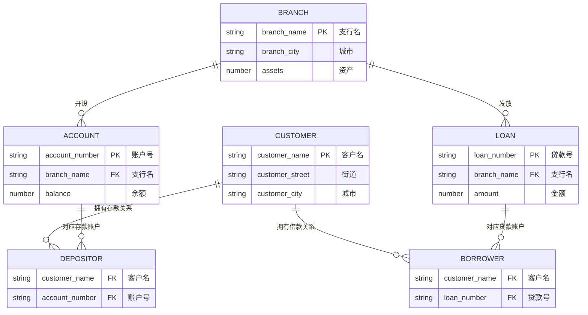
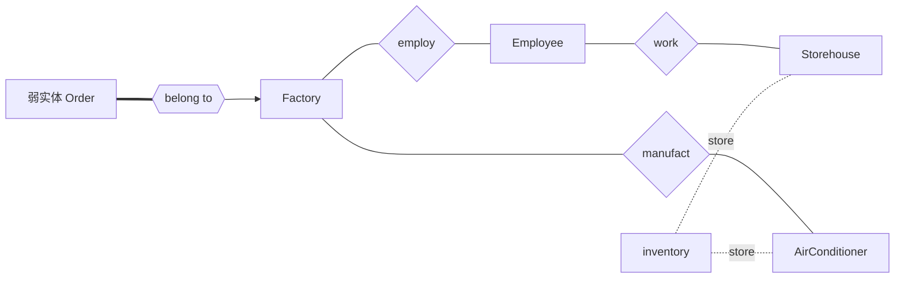

# 2016—2017 学年第二学期数据库系统原理期末试卷（B 卷）

> 本文由《数据库系统原理》期末考试原题转换而成，依据原 PDF、PaddleOCR 转写或原始 HTML 页面整理。原题中的题干、参考答案、关系模式、公式与代码均尽量保留；OCR 疑似错误不作无依据改写。

> [!tip] 真题导航
> 上一份：[[2016 年数据库系统原理期中试卷]]；下一份：[[2019 年数据库系统原理期中试卷]]

## 主要内容

- 数据库系统基本概念与数据模型
- 关系代数、SQL 与完整性约束
- E-R 模型与数据库设计
- 关系规范化与函数依赖
- 事务、并发控制、恢复与索引

---

## 一、转写说明

| 项目 | 内容 |
|---|---|
| 课程 | 数据库系统原理 |
| 资料类型 | 期末考试真题 |
| 整理日期 | 2026-08-12 |
| 转写原则 | 保留原题与原答案；不擅自修正知识性内容 |

> [!warning] OCR 与答案说明
> 文中可能保留原卷或 OCR 的拼写、符号与答案问题。无答案处不自行补写；图片信息已改为 Mermaid、原生表格或完整文字描述，最终笔记不保留图片。

---

## 二、原题与参考答案

| 考试注意事项 | 一、学生参加考试须带学生证或学院证明，未带者不准进入考场。学生必须按照监考教师指定座位就坐。二、书本、参考资料、书包等物品一律放到考场指定位置。三、学生不得另行携带、使用稿纸，要遵守《北京邮电大学考场规则》，有考场违纪或作弊行为者，按相应规定严肃处理。四、学生必须将答题内容做在试题答卷上，做在试题及草稿纸上一律无效。五、填空题用英文答，中文答对得一半分。 |  |  |  |  |
|---|---|---|---|---|---|
| 考试课程 | 数据库原理 | 考试时间 | 2017年6月20日 |  |  |
| 题号 | 一 | 二 | 三 | 四 | 五 |
| 满分 | 10 | 16 | 10 | 10 | 6 |
| 得分 |  |  |  |  |  |
| 阅卷教师 |  |  |  |  |  |

| 考试注意事项 |  |  |  |  |  |
|---|---|---|---|---|---|
| 考试课程 |  |  |  |  |  |
| 题号 | 六 | 七 | 八 | 九 | 十 |
| 满分 | 8 | 6 | 11 | 6 | 11 |
| 得分 |  |  |  |  |  |
| 阅卷教师 |  |  |  |  |  |

1. Fill in blanks. (1×10 points)

(1) Among the following statements, the correct one/ones is/are ___.

A. As a type of open-source database systems, SQL Server is developed and distributed by IBM.

B. MySQL and PostgreSQL are two typical open-source database systems.

C. The relational model is applicable to managing structured data such as the table data, while XML provides a way to represent semi-structured data, e.g. the data with nested structures.

D. A on-line shopping site has a three-tier Browser-Server(B/S)-like architecture. Its application programs are programmed in Java, and access Oracle database server via the ODBC interface.

E. Big Data is now a buzzword, and relational databases are able to efficiently manage various types of big data in the forms of tables, texts, web pages, voices, images and videos.

(2) The _____ defines the specification of managing data items in database. It is a collection of conceptual tools for describing data structure, data relationships, data semantics, data operations and consistency constraints.

(3) Heap file, sequential file, hashing file organization and clustering file are commonly-used ways of organizing data records in database files. If we first use SQL statement create table to create a empty table instructor(ID, name, dept-name, salary), assuming that no primary key and index are defined on this table; Then, we add into instructor three instructor's information by three sequential insert into SQL statements. After these insert operations, the data in instructor are organized as a _____ file on disk.

(4) Query processing refers to the range of activities involved in extracting data from a database. DBMS processes a submitted SQL statement in three sequential steps: parsing and translation, query optimization, and evaluation. In the _____step, the submitted SQL statement is converted to an initial relational algebra expression.

(5) Cconcurrent schedule S is_____ if it is conflict equivalent to a serial schedule S'.

(6)The designing of database schemas is in accordance with the three-level of data abstract, including conceptual schema design, design, _____ and physical schema design.

(7) In two phase locking (2PL) protocol, the ordering of ___ of each transactions in a concurrent schedule S is the same as the ordering of transactions in its equivalent serial schedule S'.

(8) If in a schedule S, a transaction $T_{j}$reads a data items previously written by a transaction$T_{i}$, the commitment operation of $T_{i}$appears ___ (before/after) the commitment operation of$T_{j}$, the schedule S is recoverable schedule.

(9) Transactions are required to have the ACID properties. _____ ensures that, once a transaction has been committed, that transaction's updates do not get lost, even if there is a system failure.

(10) Consider the relation schema R(A,B,C) and the functional dependency set F hold on R. We can compute closure of F as: For each  $\gamma \subseteq \{$ ___, we find the closure  $\gamma^{+}$, and for each  $S \subseteq \gamma^{+}$, we output a functional dependency  $\gamma \to S$.

2. (16 points) Here is the schema diagram for the Banking database. The table branch describes information on the name, the city located and the assets(资产) of the branches(支行). The customers of the branches are represented as the table customer. A customer may have an account(存款账户) in a branch. His account is uniquely identified by account_number, and balance records the amount of money in this account; A customer may also have a loan(借款账户) in a branch. His loan is solely identified by loan_number, and the amount of money he loans is given by amount. The relationships between customers and accounts or loans are modeled as depositor or borrower respectively.

> [!note] 原图转写：Banking 数据库模式图
> 主键分别为 `branch.branch_name`、`account.account_number`、`loan.loan_number`、`customer.customer_name`；`depositor` 连接客户与存款账户，`borrower` 连接客户与贷款账户。

Fig.1 Schema diagram for the Banking database

For the following queries, give SQL statements for (1)~(3), and relational algebra expressions for (4)~(5).

(1) (3 points) Create the table loan, in which {loan_number} is the primary key, and {branch_name} is not permitted to be null; there exists a referential integrity constraint from loan to branch. It is also required that the loan's amount is not below 0.

A for control. Consider the following reduction of the database of a variable:

The function  $f(x) = \log(x + 1)$ is a function.

The Company category is identified by a company_id and has a name

and name

(2) (3 points) Increase their balance by 5 percentage for all accounts that are opened at the banks locating in Beijing and their balances are larger than 10,000.

(3) (5 points) For each branch, find the accounts that are opened in this branch and have the maximum balance among all the accounts in the same branch. For these accounts with maximum balances, list their account number, the names of the branches they locate in and their balances, in a descending order of the balance values.

(4) (2 points) Find the average account balance of every customer. List customer name and average balance.

(5) (3 points) Find the names of all customers who have a loan at the “Beijing Beatty” branch but do not have an account at any branch of the bank.

3. (10 points) Convert the following E-R diagram to the proper relation schemas and identify the primary key of each relation.

> [!note] 原图转写：工厂业务 E-R 图
> 实体包括 `Factory(factoryID,name,account,phone)`、`Employee(employeeID,name(first_name,middle_name,last_name),email,{phonenumber})`、`Storehouse(houseID,size,phone,addr)`、`AirConditioner(serial_id,name,model,unitprice)`、弱实体 `Order(orderID,sum_price,payer,delivery_date)` 与 `inventory`。联系包括工厂雇用员工、员工在仓库工作、工厂生产空调、仓库存放库存，以及订单通过标识联系从属于工厂。

Fig. 2 E-R diagram

(1) In order to use this function, please specify the `defext` function.

(2) In order to use this function, please specify the `defext` function.

(3) In order to use this function, please specify the `defext` function.

27. Cres a losos ajores en el que se presentes Interpretión de R. I. 2

27. (4 polos)

4. (10 points) Consider the following information of the database of a school sport-meeting management system:

(1) Every Competition category is identified by a category_id and has a name and a manager.

(2) Competition events are identified by event_id. For each event, the name,

competition time and level must be recorded.

(3) Department teams are identified by team_number. Every team has a name, a leader.

(4) Players are identified by player_id. For each player, the name, age, sex and phone_number must be recorded.

(5) Referees are identified by referee_id. For each referee, the name, sex and department must be recorded.

(6) Every competition category has several competition events. Each event belongs to a unique category.

(7) Every team has several players. Each player belongs to a unique team.

(8) Each player could attend different competition events. And each event can be attended by more than one player. Players have their grades in different events.

(9) Each competition event has a referee, who judges the result. Design the E-R Diagram on the basis of the information above.

(1) Which query can be intended up by the ladies on the table it access

(2) pre(s)

5. (6 points) Consider the following relation schema Employee and the functional dependency set F hold on Employee:

Employee (ID, Name, Department, Dependent_name, Dependent_birthday, Dependent_sex)

F={ID→Name, ID→Department,

(ID, Dependent_name)→Dependent_birthday, (ID, Dependent_name)→sex}

(1) List all the candidate keys of R. (2 points)

(2) What is the highest normal form of R? Why? (4 points)

6. (8 points) The functional dependency set $F=\left\{\begin{array}{l}A\rightarrow D, E\rightarrow D, D\rightarrow B, BC\rightarrow D, \end{array}\right.$CD→A} holds on the relation schema$R=(A, B, C, D, E)$(1) Is the decomposition$\rho=\{R1(A,C,D), R2(B,C,D,E)\}$ on R lossless-join and dependency preserving? Why? (4 points)

(2) Give a lossless-join and dependency-preserving decomposition of R into 3NF. (4 points)

7. (6 points) Indexing aims to speed up accessing data items in database. For the following three SQL queries and the indices defined on the tables.

(I) select Student.ID, instructor.name, instructor.dept_name, from instructor, student

where salary>2000 and instructor.dept_name=student.dept_name

A nonclustered index defined on salary in the table instructor(ID, name, dept_name, salary), and a nonclustered index defined on dept_name in student(name, ID, dept_name, age, sex, birthdate);

(II) insert into student

values('Wang', 2113456, 'CS', 22, male, 19950505)

A clustered index on ID in the table student(name, ID, dept_name, age, sex, birthdate);

(III) update student

set age=age+1;

where birthdate between 19950619 and 19951022

A clustered index on ID in student(name, ID, dept_name, age, sex, birthdate);

(1) Which query can be speeded up by the index on the table it accesses? Why?

(2 points)

(2) Which one will not benefit from the index at all, and why? (2 points)

(3) Which one is even slowed down by the index, and why ?(2 points)

8. (11 points) Consider the Banking database given in Question Two.

| (1) Give a SQL statement to find all customers, and list their names and the cities they reside in. It is required that the customer has account at the branches that are located in Beijing and have assets more than USD 200,000, and the account is deposited before 20160101 and its balance is more than USD 2000" |
|---|
| (3 points) |
| (2) For the SQL statement in (1), give an optimized query tree by heuristic optimization. (8 points) |

(2) In S a verindspritt erwähnt? If not, give the reason. If n is, give a written

subjective regulation to S. (3 column)

9. (6 points) Is S3 a cascadeless schedule? why?

S3:

| $T_{1}$ | $T_{2}$ | $T_{3}$ | $T_{4}$ |
|---|---|---|---|
|  | Read(Y) |  |  |
|  |  | read(M) |  |
|  |  | M:=M+20 |  |
|  |  |  | read(R) |
|  |  |  | R:=R-20 |
|  |  |  | read(Z) |
|  |  |  | Z:=Z-30 |
|  | Y:=Y-20 |  |  |
|  | write(Y) |  |  |
|  | commit |  |  |
| read(X) |  |  |  |
| X:=X-20 |  |  |  |
| write(X) |  |  |  |
|  |  |  | write(R) |
|  |  |  | write(Z) |
|  |  |  | commit |
|  |  | write(M) |  |
|  |  | read(Y) |  |
|  |  | Y:=Y+5 |  |
|  |  | write(Y) |  |
|  |  | commit |  |
| read(Z) |  |  |  |
| Z:=Z+10 |  |  |  |
| write(Z) |  |  |  |
| commit |  |  |  |

10. (6 points) Concurrent schedule S is shown below.

(1) Construct the precedence graph for it. (3 points)

| $T_{1}$ | $T_{2}$ | $T_{3}$ | $T_{4}$ | $T_{5}$ |
|---|---|---|---|---|
|  |  |  |  | read(Z) |
|  |  |  |  | Z:=Z-10 |
|  |  | read(Y) |  |  |
|  |  | Y:=Y*10 |  |  |
|  |  | Write(Y) |  |  |
| read(X) |  |  |  |  |
| X:=X+50 |  |  |  |  |
|  |  |  |  | write(Z) |
| Write(X) |  |  |  |  |
|  |  | read(X) |  |  |
|  | X:=X-500 |  |  | read(D) |
|  |  |  |  |  |
|  | Write(X) |  |  |  |
|  |  | read(X) |  |  |
|  |  | X:=X+50 |  |  |
|  |  |  | read(Z) |  |
|  |  | Write(X) |  |  |
|  |  |  | Z:=Z*10 |  |
|  |  |  | D:=D+10 |  |
|  |  |  | write(D) |  |
|  |  |  | write(Z) |  |
| read(D) |  |  |  |  |
| D:=D/5 |  |  |  |  |
|  |  |  | read(Y) |  |
|  |  |  | Y:=Y+20 |  |
| write(D) |  |  |  |  |
|  |  |  | Write(Y) |  |
|  |  |  |  |  |
|  | read(Q) |  |  |  |
|  | Q:=Q+20 |  |  |  |
|  | Write(Q) |  |  |  |

(2) Is S a serializable schedule? If not, give the reason. If it is, give a serial schedule equivalent to S. (3 points)

11.(11 points) (1) and (2) given below are about the database recovery.

(1) Fig.3 is the log of the concurrent executing of T1, T2, T3 and T4. It is assumed that the initial values of these data items in database are A=0, B=10, C=100, D=350.

(a) After every checkpoint, what are the values of the data items A,B,C,D in the database?(4 points)

|  |
|---|
|  |
|  |
|  |
|  |
|  |
|  |
|  |
|  |
|  |
|  |
|  |
|  |
|  |
|  |
|  |
| **failure** |

Fig.3 Log of the concurrent executing of T1, T2, T3 and T4

(b) After recovery operations on T_{1}, T_{2}, T_{3} and T_{4} are completed, what are the values of the data items A, B, C, D in the database? (4 points)

(2) Fig. 4 is about a concurrent schedule of transactions T1, T2, T3, T4, T5 and T6. Tc1, Tc2 and Tc3 are the time of three times of checkpoint, Tf is the time of system failure. After the failure occurred, what recovery actions (i.e. redo, undo, ignore) should be conducted respectively for T1, T2, T3, T4, T5 and T6.? (3 points)

> [!note] 原图转写：检查点与事务时间线
> 时间轴依次经过 `Checkpoint1`、`Checkpoint2`、`Checkpoint3` 和系统故障 `Tf`。T1 在 Checkpoint1 前开始并结束；T2 在 Checkpoint1 前开始、在 Checkpoint2 前结束；T3 在 Checkpoint1 后开始、在 Checkpoint3 前结束；T4 在 Checkpoint2 后开始并持续到故障；T5 在 Checkpoint2 后开始、越过 Checkpoint3 后结束但早于故障；T6 在 Checkpoint1 后开始并持续到故障。

Fig.4 Concurrent schedule of transactions

---

## 本章小结

| 模块 | 主要考查内容 |
|---|---|
| 基础理论 | 数据库体系结构、数据模型、完整性与数据独立性 |
| 查询语言 | 关系代数、SQL 定义与数据操纵 |
| 数据库设计 | E-R 建模、模式转换、函数依赖与规范化 |
| 系统实现 | 索引、事务、并发控制、日志与故障恢复 |

> [!tip] 真题导航
> 上一份：[[2016 年数据库系统原理期中试卷]]；下一份：[[2019 年数据库系统原理期中试卷]]
