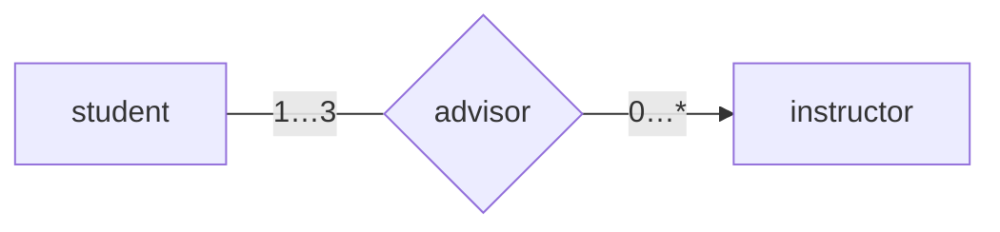
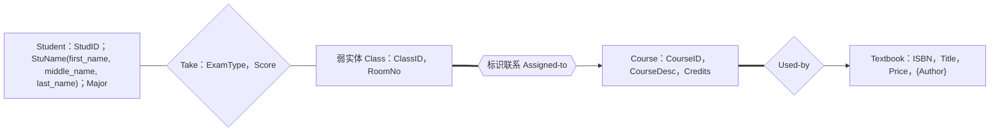
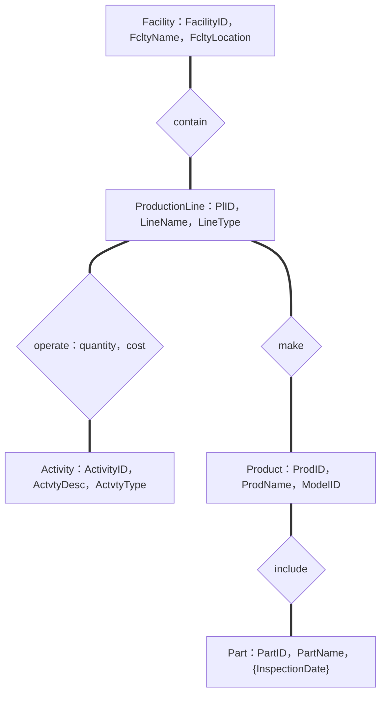

# 2019 年数据库系统原理期中试卷

> 本文由《数据库系统原理》期中考试原题转换而成，依据原 PDF、PaddleOCR 转写或原始 HTML 页面整理。原题中的题干、参考答案、关系模式、公式与代码均尽量保留；OCR 疑似错误不作无依据改写。

> [!tip] 真题导航
> 上一份：[[2016—2017 学年第二学期数据库系统原理期末试卷（B 卷）]]；下一份：[[2019 年数据库系统原理试卷]]

## 主要内容

- 数据库系统基本概念与数据模型
- 关系代数、SQL 与完整性约束
- E-R 模型与数据库设计
- 关系规范化与函数依赖
- 事务、并发控制、恢复与索引

---

## 一、转写说明

| 项目 | 内容 |
|---|---|
| 课程 | 数据库系统原理 |
| 资料类型 | 期中考试真题 |
| 整理日期 | 2026-08-12 |
| 转写原则 | 保留原题与原答案；不擅自修正知识性内容 |

> [!warning] OCR 与答案说明
> 文中可能保留原卷或 OCR 的拼写、符号与答案问题。无答案处不自行补写；图片信息已改为 Mermaid、原生表格或完整文字描述，最终笔记不保留图片。

---

## 二、原题与参考答案

### 2019 Database System Principles Test One

Class___No___Name___

1. (22 points) Fill in blanks

(1) Among the following statements, the correct one/ones is/are  $\underline{\text{B,C/BC E}}$.

A. As a type of open-source database systems, SQL Server is developed and distributed by IBM.

B. MySQL and PostgreSQL are two typical open-source database systems.

C. The relational model is applicable to managing structured data such as the table data, while XML provides a way to represent semi-structured data, e.g. the data with nested structures.

D. A on-line shopping site has a three-tier Browser-Server(B/S)-like architecture. Its application programs are programmed in Java, and access Oracle database server via the ODBC interface.

E. Big Data is now a fashionable term, and the relational databases are able to efficiently manage various types of big data in the forms of tables, texts, web pages, voices, images and videos.

(2) The  $\underline{\text{data model}}$ defines the specification of managing data items in database. It is a collection of conceptual tools for describing data structure, data relationships, data semantics, data operations and consistency constraints.

(3) Database design involves the following phases: requirements analysis, conceptual schema design,  $\underline{\text{logical}}$ design and physical design.

(4) Here is an example of  $\underline{logical}$ data Independence. A transaction T accesses a relational table Student(SID, SName, Age, Department) by the SQL query:

update Student

set age = age + 1

where department='CS'

The table Student is then renamed as StudentNew and its schema is changed to StudentNew (s#, name, age, college, sex), to enable T to remain unchanged and need not be rewritten, a view Student is created as,

create view (SID, SName, Age, Department) as

select s#, sname, age, college

from StudentNew

, and T access this view to accomplish its query.

(5)The collection of information stored in the database at a particular moment is called an  $\underline{\text{instance}}$ of the database.

(6) As human-machine interfaces, the database language consists of two parts, i.e. the data definition language (DDL) and  $\underline{\text{DML}}$ (data manipulation language) .

(7) DBMS can be divided into two main parts, that is  $\underline{\text{query processor}}$ and transaction manager.

(8) (2 points) For the entity set Student(\#student, sname, department,  $\underline{\text{course}}$, grade), the primary key is  $\underline{C}$____, the primary attributes are  $\underline{D}$____.

A. #student B. {\#student} C. {\#student, course} D. #student, course E. #student F. course

(9) The six fundamental operations in the relational algebra are select, $\underline{\text{project}}$, union , set difference, Cartesian-Product, and rename.

(10) A  $\underline{key/ superkey/primary key/ candidate key}$ is a set of one or more attributes that, taken collectively, can be used to identify uniquely a tuple in the relation.

(11) An entity set that does not have a primary key is referred to as a  $\underline{\text{weak entity set}}$.

(12) If X is one or more attributes in relation R1, and X is also the primary-key of another relation schema R2, X is called a  $\underline{\text{foreign key}}$ from R1 referencing R2.

(13) (2 points)For the entity sets student and instructor and the relationship set advisor among them in the following figure, the mapping cardinality from student to instructor is  $\underline{\text{many-to-many}}$ , and the participation constraints of instructor in advisor is  $\underline{\text{partial}}$ .

> [!note] 原图转写：student—advisor—instructor
> `student` 端基数为 `1…3`，`instructor` 端基数为 `0…*`；原图箭头指向 `instructor`。

(14) (2 points) Convert the entity set “学生”, in which the attribute “老乡” is a multivalued attribute, into two relational tables

| student-id | 籍贯 | 老乡 | 性别 | 年龄 |
|---|---|---|---|---|
| 07494 | 北京 | 07596, 07611 | 男 | 20 |

答案：

| student-id | 籍贯 | 性别 | 年龄 |
|---|---|---|---|
| 07494 | 北京 | 男 | 20 |

注意：主键下的的下划线，如缺少下划线，扣0.5分

| student-id | $\underline{\text{老乡}}$ |
|---|---|
| 07494 | 07596 |
| 07494 | 07611 |

(15) There are three types of pure query languages related to the relational model, that is,  $\underline{\text{relational algebra}}$ , tuple relational calculus, and domain relational calculus.

(16) (2 points) The relational algebra expression corresponding to the following SQL statement is:

loan  $\rightarrow$ loan -  $\sigma$ (amount>=0 and amount=3)

)

And pilot_id not in

(select Pilot_id

From certified, aircraft

Where certified.aircraft_id= aircraft.aircraft_id

And aname='boeing')

(3) Find the flightno of the flight that can be piloted by every pilot whose salary is more than USD 400,000. (6 points)

Select flightno

From flights, aircraft, pilots, certified (2分)

Where salary>=400000 and certified.aircraft_id= aircraft.aircraft_id

And certified. Pilot_id= pilots. Pilot_id

And cruisingrange>distance （4个条件每个1分）

(4) Create the table \textit{Flights}, in which  $\{flightno\}$ is the primary key, and  $\{from, to\}$ are not permitted to be null; It is also required that the distance is not below 0. (5 points)

create table Flights
(flightno char(20) primary key,
From varchar(20) not null,
to varchar(20) not null,
distance integer,
departs_time time,
arrives_time time,
check (distance>0)
)

数据类型取合适的就行。

表定义语法 1 分，属性及定义 1 分，约束定义 1 分。

(5) 针对 Pilots(pilot_id, name, salary)，使用 SQL 语句，判断 name 是否为表 Pilots 的 super_key.

要求：如果 name 不是 super_key，找出表中导致 name 不是 super_key 的元组

(6 points)

3. (25 points) Convert the following E-R diagram to the relation schemas and identify the primary key of each relation by underlining the primary attributes.

> [!note] 原图转写：课程教学 E-R 图
> `Class` 是由 `ClassID` 与 `RoomNo` 标识的弱实体，通过标识联系 `Assigned-to` 依赖 `Course`；`Student` 与 `Class` 通过 `Take` 联系，联系属性为 `ExamType`、`Score`；`Course` 通过 `Used-by` 使用 `Textbook`，其中 `Textbook.Author` 为多值属性。

Figure 1 E-R diagram

Student(StudID, first_name, middle_name, last_name, Major)

(4分，没有正确标注主键，扣1分)

Class( $\underline{\text{ClassID}}$,  $\underline{\text{CourseID}}$, RoomNo)

(4分，没有正确标注主键，扣1分)

Take( $\underline{\text{StudID}}$,  $\underline{\text{ClassID}}$,  $\underline{\text{CourseID}}$, ExamType, Score)

(4分，没有正确标注主键，扣1分)

Course(CourseID, ISBN, CourseDesc, Credits)

(4分，没有正确归并联系 Used-by，扣1分)

TextbookAuthor( $\underline{\text{ISBN}}$,  $\underline{\text{Author}}$) (3分)

4. (24 points) Consider the following information on the production procedure in facilities.

(1) A production facility（制造工厂）is uniquely identified by a FacilityID and described by FcltyName and FcltyLocation.

(2) Every production line (生产线) is identified by a PIID and described by LineName and LineType.

(3) Each line activity (生产线活动) is identified by ActivityID. It also has descriptive attributes ActvtyDesc and ActvtyType.

(4) A product (产品) is distinguished by its ProdID, and has attributes ProdName and ModelID.

(5) An assembly part (零部件) in a product is recognized by its PartID and has attributes Partname and InspectionDate. A part may be inspected several times and thus have several inspection dates.

(6) Every production facility contains several production lines, and each line must belong to a unique facility.

(7) Each production line operates more than one line activity, and an activity has to be attached to a unique line.

(8) A production line can make several products, but a product can be produced by only a production line. The quantity of the product made by the line and the production cost must be recorded.

(9) A product includes one or more assembly parts, and a part can also be used for several products.

Construct an E-R diagram to depict the above mentioned data items and the associations among them.

> [!note] 原图转写：生产系统 E-R 图
> `Facility` 包含 `ProductionLine`；生产线执行 `Activity`，该联系具有数量与成本属性；生产线制造 `Product`；产品由一个或多个 `Part` 组成，零件可被多个产品使用，`Part.InspectionDate` 为多值属性。

Part 实体 4 分，没有标注多值属性 {InspectionDate}，扣 1 分。其余 4 个 entity 各 3 分，共 12 分；

4个 relationship各2分，共8分。

make 联系没有标注属性扣1分；

联系中映射基、完全/部分参与有误，酌情扣分。

---

## 本章小结

| 模块 | 主要考查内容 |
|---|---|
| 基础理论 | 数据库体系结构、数据模型、完整性与数据独立性 |
| 查询语言 | 关系代数、SQL 定义与数据操纵 |
| 数据库设计 | E-R 建模、模式转换、函数依赖与规范化 |
| 系统实现 | 索引、事务、并发控制、日志与故障恢复 |

> [!tip] 真题导航
> 上一份：[[2016—2017 学年第二学期数据库系统原理期末试卷（B 卷）]]；下一份：[[2019 年数据库系统原理试卷]]
