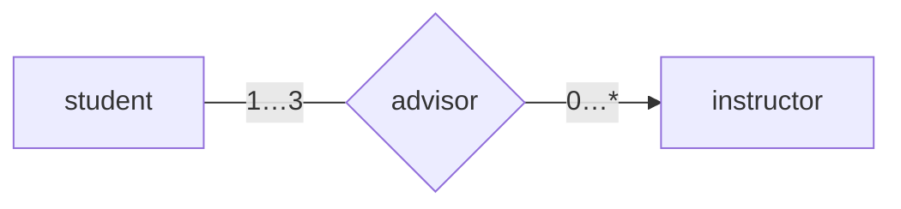
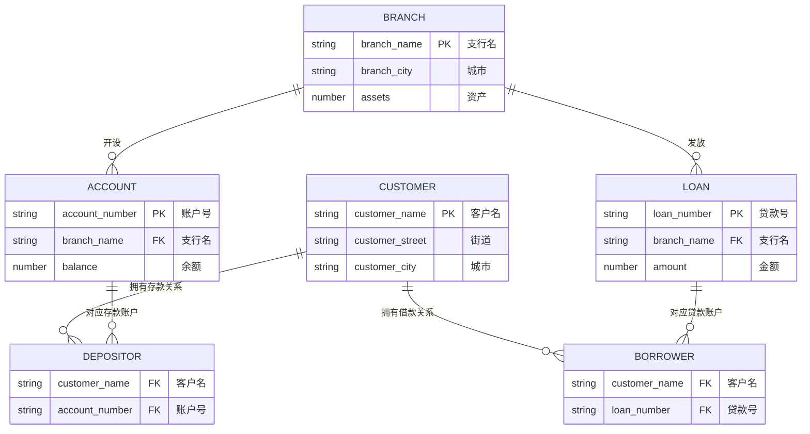
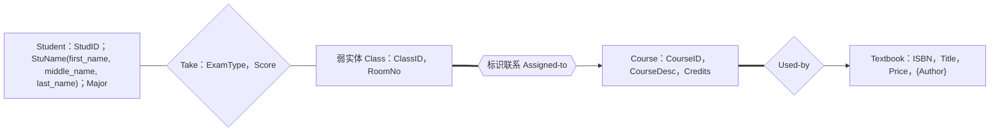

# 2020 年数据库系统原理期中试卷

> 本文由《数据库系统原理》期中考试原题转换而成，依据原 PDF、PaddleOCR 转写或原始 HTML 页面整理。原题中的题干、参考答案、关系模式、公式与代码均尽量保留；OCR 疑似错误不作无依据改写。

> [!tip] 真题导航
> 上一份：[[2019 年数据库系统原理试卷]]；下一份：[[2020—2021 学年第一学期数据库系统原理期末试卷（A 卷）]]

## 主要内容

- 数据库系统基本概念与数据模型
- 关系代数、SQL 与完整性约束
- E-R 模型与数据库设计
- 关系规范化与函数依赖
- 事务、并发控制、恢复与索引

---

## 一、转写说明

| 项目 | 内容 |
|---|---|
| 课程 | 数据库系统原理 |
| 资料类型 | 期中考试真题 |
| 整理日期 | 2026-08-12 |
| 转写原则 | 保留原题与原答案；不擅自修正知识性内容 |

> [!warning] OCR 与答案说明
> 文中可能保留原卷或 OCR 的拼写、符号与答案问题。无答案处不自行补写；图片信息已改为 Mermaid、原生表格或完整文字描述，最终笔记不保留图片。

---

## 二、原题与参考答案

### 2020 Database System Principles Test One

Class___ No___ Name___

1. (20 points) Fill in blanks

(1) Among the following statements, the correct one/ones is/are  $\underline{C}$____.

I. OpenGauss database, derived from PostgreSQL, is developed and distributed by Huawei.

II. MySQL and PostgreSQL are two typical open-source database systems.

III. A on-line shopping site has a three-tier Browser-Server(B/S) architecture. Its application programs are programmed in Java, and these programs access MySQL database server via the ODBC interface.

IV. The relational model is applicable to managing structured data such as the table data, while XML provides a way to represent semi-structured data, e.g. the data with nested structures.

A. I, II, III, IV B. I, II, III C. I, II, IV D. II, III, IV

(2) The  $\underline{\text{data model}}$ defines the specification of managing data items in database. It is a collection of conceptual tools for describing data structure, data relationships, data semantics, data operations and consistency constraints.

(3) Database design involves the following phases: requirements analysis, conceptual schema design,  $\underline{\text{logical}}$ design and physical design.

(4) As human-machine interfaces, the pure database language consists of two parts, i.e. the data manipulation language and the  $\underline{\text{data definition language}}$ (或：DDL) that is for specifying the database schema and as well as other properties of the data.

(5) A  $\underline{\text{key/ superkey/primary key/ candidate key}}$ is a set of one or more attributes that, taken collectively, can be used to identify uniquely a tuple in the relation.

(6) (2 points) For the entity set instructor $\underline{\text{instructor_id}}$, name, age,  $\underline{\text{department}}$, building, salary), the primary key is  $\underline{C}$____, the primary attributes are  $\underline{D}$____.

A. instructor_id B.\{instructor_id\} C. \{instructor_id, department\} D. instructor_id, department

(7) (2 points)For the entity sets student and instructor and the relationship set advisor among them in the following figure, the mapping cardinality from student to instructor is  $\underline{\text{many-to-many}}$ , and the participation constraints of instructor in advisor is  $\underline{\text{partial}}$ .

> [!note] 原图转写：student—advisor—instructor
> `student` 端基数为 `1…3`，`instructor` 端基数为 `0…*`；原图箭头指向 `instructor`。

(8) There are three types of pure query languages related to the relational model, that is, relational algebra, tuple relational calculus, and  $\underline{\text{domain relational calculus}}$ .

(9) The six fundamental operations in the relational algebra are select, project, union, set difference,  $\underline{\text{Cartesian-Product}}$ , and rename.

(10) (2 points) Convert the entity set “instructor”, in which the attribute “phone_number” is a multivalued attribute, into two relational tables

| $\underline{\text{instructor-id}}$ | name | phone_number | department | salary |
|---|---|---|---|---|
| 201081 | Wang | 13912345, 15854321 | Comp.Sci. | 2000 |

答案：

| $\underline{\text{instructor-id}}$ | name | department | salary |
|---|---|---|---|
| 201081 | Wang | Comp.Sci. | 2000 |

### 注意：主键下的的下划线，如缺少下划线，扣0.5分

| $\underline{\text{instructor-id}}$ | $\underline{\text{phone_number}}$ |
|---|---|
| 201081 | 13912345, |
| 201081 | 15854321 |

(11) If X is one or more attributes in relation R1, and X is also the primary-key of another relation schema R2, X is called a  $\underline{\text{foreign key}}$ from R1 referencing R2.

(12) In SQL language, the statement that can be used for security control is  $\underline{D}$

A. insert B. update C. commit D. grant

(13) Consider the relation schema Student-schema(studentID, sname, department, location) and relation Student, which one is not the metadata stored in data dictionary?

D___

A. the name of the relation student

B. the domain and length of attribute studentID

C. the number of tuples in Student

D. a tuple

(14) Consider the relation schema R(A,B,C,D), if each attribute A,B,C,D is contained in a candidate key for R, R at least is in  $\underline{3}$ normal forms.

(15) Let $r_1(R_1)$and$r_2(R_2)$be relations with primary keys$K_1$and$K_2$respectively, the subset$\alpha$of$R_2$is$\underline{\text{foreign key}}$referencing$K_1$in relation$r_1$, if for every $t_2$in$r_2$there must be a tuple$t_1$in$r_1$such that$t_1[K_1] = t_2[\alpha]$(16) With respect to integrity constraints in DBS,$ \underline{\text{reference integrity(或：foreign key)}} $ constraints ensures that a value appearing in a relation for a given set of attributes also appears for a certain set of attributes in another relation.

(17) SQL queries can be invoked from host languages, e.g. C++, via  $\underline{\text{embedded SQL}}$ and dynamic SQL.

2. (9 points) 给出下列关系代数操作对应的 SQL 语句

(1)  $\sigma_{p}(r)$

(2)  $\Pi_{A1,A2,...,Am}(r)$

(3)  $r \infty s$,

, 假设  $r(A, B, C), s(C, E, F)$

Answers:

(1) select * from r where P

(2) select A1, A2, ..., Am from r

(3) select * from r natural join s

或者：

select * from r where r.C = s.C

3. (9 points) 给出下列 SQL 语句对应的关系代数表达式

(1) select department, avg(salary)

from instructor

group by department

假设 instructor(instructor_id, name, department, salary)

(2) update instructor

set salary = salary  $*1.1$

where salary > 10000

(3) insert into r

select  $A_{1}, A_{2}, \ldots, A_{m}$

from  $r_{1}, r_{2}, \ldots, r_{n}$

where P

Answers:

(1) department G $_{avg(salary)}$ (instructor)

(2) T1 ←  $\Pi_{\text{instructor\_id, name, department, salary}} \times 1.2 \sigma_{\text{salary}} > 10000$ (instructor)

 $$\mathrm{T2}\leftarrow\sigma_{a m o u n t\leq10000}\mathrm{(i n s t r u c t o r)}$$$$\mathrm{i n s t r u c t o r}\gets\mathrm{T1}\cup\mathrm{T2}$$(3)$ \mathrm{r} \leftarrow \mathrm{r} \cup \Pi_{\mathrm{A}1,\mathrm{A}2,\ldots,\mathrm{Am}}(\sigma_{\mathrm{p}}(\mathrm{r}_{1} \times \mathrm{r}_{2} \times \ldots \times \mathrm{r}_{\mathrm{n}})) $

4. (14 points) Consider the following relations in banking enterprise database, where the primary keys are underlined.

> [!note] 原图转写：Banking 数据库模式图
> 主键分别为 `branch.branch_name`、`account.account_number`、`loan.loan_number`、`customer.customer_name`；`depositor` 连接客户与存款账户，`borrower` 连接客户与贷款账户。

branch  $\underline{\text{(branch-name}}$, branch-city, assets),

loan (  $\underline{\text{loan-number}}$, branch-name, amount)

borrower( $\underline{\text{customer-name}}$,  $\underline{\text{loan-number}}$)

customer  $\underline{\text{(customer-name}}$, customer-street, customer-city)

account ( $\underline{\text{account-number}}$, branch-name, balance)

depositor ( $\underline{\text{customer-name}}$,  $\underline{\text{account-number}}$)

employee( $\underline{\text{employee-ID}}$, employee-name, branch-name, job-title)

(1) (7 points) Use a SQL statement to define the relational table employee, in which {employee-ID} is the primary key, {employee-name} is the candidate key and not permitted to be null, and there exists referential integrity between the table employee and branch. It is also required that an employee's job-tile must be one of manager, teller, officer, or secretary.

### Answer:

wer:
create table employee
(employee-ID integer,
employee-name varchar(50), /*也可以采用其它长度的 varchar、char 类型
branch-name varchar(50),
job-title varchar(50),
primary key (employee-ID),
unique (employee-name),
foreign key (branch-name) references branch,
check (job-title in ('manager', 'teller', 'officer', 'secretary'))
4 个完整性约束，每个 1 分。

(2) (7 points) Give a SQL statement to find the customer's name who has one or more accounts at the branches located in Brooklyn district, and the total sum of the balances of his these accounts in Brooklyn is more than USD 10,000. It is required to list in alphabetic descending order the customer's name, and his total balances in the branches in Brooklyn.

### Answer:

Select customer-name, sum(balance)

From branch Natural Join account Natural Join depositor

Where branch-district=Brooklyn

Group by customer-name

Having sum(balance)>10,000

Order by customer-name desc

group by 和 having 子句占 2 分，其余部分 3 分。

4. (20 points) Convert the following E-R diagram to the relation schemas and identify the primary key of each relation by underlining the primary attributes.

> [!note] 原图转写：课程教学 E-R 图
> `Class` 是由 `ClassID` 与 `RoomNo` 标识的弱实体，通过标识联系 `Assigned-to` 依赖 `Course`；`Student` 与 `Class` 通过 `Take` 联系，联系属性为 `ExamType`、`Score`；`Course` 通过 `Used-by` 使用 `Textbook`，其中 `Textbook.Author` 为多值属性。

Figure 1 E-R diagram

Student(StudID, first_name, middle_name, last_name, Major)

(4分，没有正确标注主键，扣1分)

Class( $\underline{\text{ClassID}}$,  $\underline{\text{CourseID}}$, RoomNo)

(4分，没有正确标注主键，扣1分)

Take( $\underline{\text{StudID}}$,  $\underline{\text{ClassID}}$,  $\underline{\text{CourseID}}$, ExamType, Score)

(4分，没有正确标注主键，扣1分)

Course(CourseID, ISBN, CourseDesc, Credits)

(4分，没有正确归并联系 Used-by，扣1分)

Textbook( $\underline{\text{ISBN}}$, Title, Price) (3分)

TextbookAuthor(\underline{\text{ISBN}},\underline{\text{Author}}) (3分)

注意：take 必须转换为独立的表，used-by 不能转化为独立表

5. (8 points) Given R = {A, B, C, D, E, F} and F = {A → B, C → D, D → E, E → F, F → C} that holds on R. List all the candidate keys of R. (8 points)

(利用求候选键算法，给出计算过程)

### Answers:

只出现在左端 L 类属性：A，

只出现在右端 R 类属性：B

出现在左右端的 LR 类属性：C, D, E, F

左右端均不出现的 N 类属性：无

X-set={A}，Y-set={C, D, E, F}。

由于闭包 X-set⁺ = AB，并不等于 R，故从 Y_set 中分别取出 C、D、E、F 与 X-set={A}组合在一起，计算其闭包

 $$(\mathrm{A C})^{+}=(\mathrm{A D})^{+}=(\mathrm{A E})^{+}=(\mathrm{A F})^{+}=\mathrm{R},$$

故 R 的候选键为：AC, AD, AE, AF

判卷标准：

（1）四个候选键，每个2分；

（2） 没有将属性分类，即没有 L、R、LR、N 类属性划分，扣 2 分。

6.(20 points) The functional dependency set F={AB→C, A→DEI, B→FH, F→GH, D→IJ} holds on the relation schema R = (A, B, C, D, E, F, G, H, I, J), 2008?

(1) Compute  $(AF)^{+}$ (3 points)

(2) List all the candidate keys of R. (4 points)

(3) Compute the canonical cover  $F_{c}$ (5 points)

(4) (8 points) Give a lossless and dependency-preserving decomposition of R into 3NF.

(1)  $(AF)^{+} = AFDEIGHJ$

(2) 因为(AB) $^{+}$=ABCDEFGHIJ=R，所以 AB 是 R 的唯一候选键

(3)  $\mathrm{F}_{\mathrm{c}} = \{ \mathrm{AB} \to \mathrm{C}, \mathrm{A} \to \mathrm{DE}, \mathrm{B} \to \mathrm{F}, \mathrm{F} \to \mathrm{GH}, \mathrm{D} \to \mathrm{IJ} \}$

(4) R1(A, B, C)

R2(A, D, E)

R4(B, F)

R5(F, G, H)

R3(D, I, J)

---

## 本章小结

| 模块 | 主要考查内容 |
|---|---|
| 基础理论 | 数据库体系结构、数据模型、完整性与数据独立性 |
| 查询语言 | 关系代数、SQL 定义与数据操纵 |
| 数据库设计 | E-R 建模、模式转换、函数依赖与规范化 |
| 系统实现 | 索引、事务、并发控制、日志与故障恢复 |

> [!tip] 真题导航
> 上一份：[[2019 年数据库系统原理试卷]]；下一份：[[2020—2021 学年第一学期数据库系统原理期末试卷（A 卷）]]
