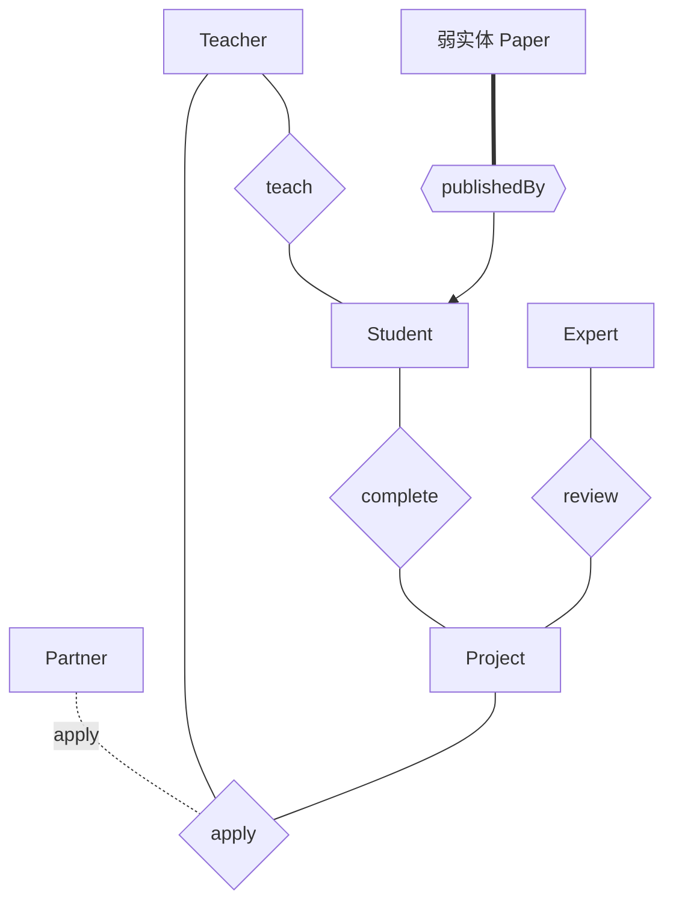

# 2020—2021 学年第一学期数据库系统原理期末试卷（A 卷）

> 本文由《数据库系统原理》期末考试原题转换而成，依据原 PDF、PaddleOCR 转写或原始 HTML 页面整理。原题中的题干、参考答案、关系模式、公式与代码均尽量保留；OCR 疑似错误不作无依据改写。

> [!tip] 真题导航
> 上一份：[[2020 年数据库系统原理期中试卷]]；下一份：[[2021—2022 学年第一学期数据库系统原理期中测验]]

## 主要内容

- 数据库系统基本概念与数据模型
- 关系代数、SQL 与完整性约束
- E-R 模型与数据库设计
- 关系规范化与函数依赖
- 事务、并发控制、恢复与索引

---

## 一、转写说明

| 项目 | 内容 |
|---|---|
| 课程 | 数据库系统原理 |
| 资料类型 | 期末考试真题 |
| 整理日期 | 2026-08-12 |
| 转写原则 | 保留原题与原答案；不擅自修正知识性内容 |

> [!warning] OCR 与答案说明
> 文中可能保留原卷或 OCR 的拼写、符号与答案问题。无答案处不自行补写；图片信息已改为 Mermaid、原生表格或完整文字描述，最终笔记不保留图片。

---

## 二、原题与参考答案

| 考试注意事项 | 一、学生参加考试须带学生证或学院证明，未带者不准进入考场。学生必须按照监考教师指定座位就坐。 |  |  |  |  |
|---|---|---|---|---|---|
| 考试注意事项 | 二、书本、参考资料、书包等物品一律放到考场指定位置。 |  |  |  |  |
| 考试注意事项 | 三、学生不得另行携带、使用稿纸，要遵守《北京邮电大学考场规则》，有考场违纪或作弊行为者，按相应规定严肃处理。 |  |  |  |  |
| 考试注意事项 | 四、学生必须将答题内容做在答题纸上，做在试题及草稿纸上一律无效。 |  |  |  |  |
| 考试课程 | 数据库系统原理 |  |  |  | 考试时间 |
| 题号 | 一 | 二 | 三 | 四 | 五 |
| 满分 | 10 | 18 | 10 | 10 | 14 |
| 得分 |  |  |  |  |  |
| 阅卷教师 |  |  |  |  |  |

| 考试注意事项 |  |  |  |  |  |
|---|---|---|---|---|---|
| 考试注意事项 |  |  |  |  |  |
| 考试注意事项 |  |  |  |  |  |
| 考试注意事项 |  |  |  |  |  |
| 考试课程 |  |  |  | 2021年 2月 24日\n09:00 ~ 11:00 |  |
| 题号 | 六 | 七 | 八 | 九 | 十 |
| 满分 | 6 | 10 | 6 | 6 | 10 |
| 得分 |  |  |  |  |  |
| 阅卷教师 |  |  |  |  |  |

| 考试注意事项 |  |  |
|---|---|---|
| 考试注意事项 |  |  |
| 考试注意事项 |  |  |
| 考试注意事项 |  |  |
| 考试课程 |  |  |
| 题号 | 总分 |  |
| 满分 | 100 |  |
| 得分 |  |  |
| 阅卷教师 |  |  |

### 1. Choice.（$1\times10$ points）

(1) Application programs are said to exhibit ___independence, if they do not depend on the logical schema, and thus need not be rewritten if the logical schema changes.

A. view B. logical C. network D. physical

(2) With respect to DBS design, a relational table's primary key is defined at the ___Phase.

A. requirement analysis

B. conceptual design

C. logical design

D. physical design

(3) With respect to the relation schema Branch-schema(branch-name, branch-city, assets) and the relation branch, which one is not the metadata stored in system catalog: ___

A. names of the relation branch

B. domain and length of attribute assets

C. number of tuples in branch

D. the tuple

(4) In SQL language, the statement that can be used for security control is_____.

A. insert B. rollback C. revoke D. update

(5) For the entity sets A and B and the relationship set R among them, if the cardinality limit of A is $2\ldots*$, and the cardinality limit of B is $0\ldots1$, then the mapping cardinality from A to B is ___.

A. one to one

B. many to one

C. many to many

D. one to may

(6) In the _____ file organization, records of several different relations can be stored in the same file.

A. sequential B. multitable clustering C. hashing D. heap

(7) The functional dependency set F={ A→D, E→D, D→B, BC→D, CD→A } holds on the relation schema R = (A, B, C, D, E) （ADE）⁺ = ___

A. {A, D, E}

B. {A, D, B}

C. {A, D, B, E}

D. {A, B, C, D, E}

(8) Which of the following statements is correct:___

A. the two-phase locking protocol ensures conflict serializability and freedom from deadlock;

B. the two-phase locking protocol ensures conflict serializability, but does not ensure freedom from deadlock;

C. the two-phase locking protocol does not ensure conflict serializability, but ensure freedom from deadlock;

D. the two-phase locking protocol does not ensure conflict serializability and does not ensure freedom from deadlock;

(9) Transactions are required to have the ACID properties.___ ensures that either all operations of the transaction are properly reflected in the database or none are.

A. Atomicity    B. Consistency    C. Isolation    D. Durability

(10)As for the following equivalence rules for transformation of relational expressions, which one is not right:

___

A.  $\prod_{\mathrm{L}}(\mathrm{E}1 \cup \mathrm{E}2) = (\prod_{\mathrm{L}}(\mathrm{E}1)) \cup \mathrm{E}2$

B.  $\sigma_{\theta} (\mathrm{E}1 - \mathrm{E}2) = \sigma_{\theta} (\mathrm{E}1) - \sigma_{\theta}(\mathrm{E}2)$

C.  $\mathrm{E}1 \cap \mathrm{E}2 = \mathrm{E}2 \cap \mathrm{E}1$

D.  $\sigma_{\theta} (\mathrm{E}1 \times \mathrm{E}2) = \mathrm{E}1 \propto_{\theta} \mathrm{E}2$

2. (18 points) Consider the following relations in an enterprise database, where the primary keys are underlined.

Employee(employeeID, employeename, age, address, sex, salary, deptID)

Department(  $\underline{\text{deptID}}$, deptname, managerID, managername)

DepartLocations(  $\underline{\text{deptID}}$,  $\underline{\text{deptlocation}}$)

Project (projectID, projectname, projectlocation, deptID)

Workson(  $\underline{\text{employeeID}}$, projectID, hours)

Dependent(  $\underline{\text{employeeID}}$,  $\underline{\text{dependentname}}$, sex, Birthdate, Relationship)

(1) Use a relational algebras expression to delete from the table Department all departments that have some projects at Beijing. (4 points).

(2) For each department which has at least 10 employees, list its  $deptID$, and calculate the total number of the employees who work in this department and whose salaries are more than 4000. Give one or more SQL statements to list the query result in descending order of the attribute  $deptID$. (5 points)

(3) Use SQL statements to 1) add a new attribute city into the table DepartLocations. It is assumed that the data type of city is varchar(50); 2) and then define a nonclustered index on attribute city. (4 points)

(4) A new project is started, and its information is as follows: projectID=1021, projectname='Building', projectlocation='Shanghai', deptID='201'. Find out from the department '201' all employees who currently do not work for any projects, and assign to them this new project '1021'. It is assumed that these selected employees will work for the new project for 500 hours. (5 points)

Give SQL statements to modify the tables in the database, so as to record all the information about the new project '1021' and the employees working on this project.

3. (10 points) Convert the following E-R diagram to the proper relation schemas and identify the primary key of each relation.

> [!note] 原图转写：项目申报与论文 E-R 图
> 实体包括 `Partner`、`Teacher`、`Project`、`Student`、`Expert` 与弱实体 `Paper`。教师参与项目申报；学生完成项目；专家评审项目；教师指导学生；论文通过标识联系 `publishedBy` 依赖学生。

Fig. 1 E-R diagram

4. (10 points) A hospital database needs to store information about doctors, patients, sickroom (病房), and departments (科室). Consider the following information:

Each doctor has descriptive attributes of identifier number, name, age, and technical title.

Each patient has descriptive attributes of the number of medical records(病历), name, age, and sex.

Each sickroom has descriptive attributes of the number of sickroom, and address.

Each department has descriptive attributes of name, address, and telephone-number.

Integrity constraints:

a. Each doctor must belong to one (and only one) department; and for each department, there are more than one doctors belonging to it.

b. Each patient is taken care of by one and only one responsible doctor; a doctor may be responsible for no patients, or only one patients, or more than one patients.

c. Each patient lives in one and only one sickroom; a sickroom may contain more than one patient.

d. Each sickroom can be managed by more than one department; but for some departments, there are no sickrooms managed by them, while for other departments, there are more than one managed sickroom.

Design the E/R diagram for hospital database on basis of the information mentioned above.

Note: mapping cardinality of each relationship and participation of each entity to the relationship should be described in the diagram.

5. (14 points) Consider the following relation schema Employee and the functional dependency set F hold on Employee:

Employee (ID, Name, Department, Dependent_name, Dependent_birthday, Dependent_sex)

F={ ID→Name, ID→Department,

(ID, Dependent_name) →Dependent_birthday, (ID, Dependent_name) →Dependent_sex}

(1) List all the candidate keys of Employee. (2 points)

(2) What is the highest normal form of Employee? Why? (4 points)

(3) Is the decomposition  $\rho = \{R1(\text{ID}, \text{Name}, \text{Department}), R2(\text{Dependent\_name}, \text{Dependent\_birthday}, \text{Dependent\_sex})\}$ on Employee dependency-preserving? Why? (4 points)

(4) Give a lossless-join and dependency-preserving decomposition of Employee into 3NF. (4 points)

6. (6 points) Given the data file account(account_number, branch_name, balance) and the index defined on balance, as shown in the following figure,

(1) Is the index a dense or sparse index, why? (3 points)

(2) Is the index a clustering or non-clustering index, why? (3 points)

> [!note] 原图转写：余额辅助索引
> 左侧索引键为 `350、400、500、600、700、750、900`，通过指针或桶连接右侧账户记录。右侧记录按图示顺序为：`(A-101,Downtown,500)`、`(A-217,Brighton,750)`、`(A-110,Downtown,600)`、`(A-215,Mianus,700)`、`(A-102,Perryridge,400)`、`(A-201,Brighton,900)`、`(A-218,Perryridge,700)`、`(A-222,Redwood,700)`、`(A-305,Round Hill,350)`；相同余额通过桶或链连接到多条记录。

7. (10 points) There are three relations in the database, describing the employees and the companies that the employees work at.

Employee( $\underline{\text{employee-id}}$, name, age, sex, e-city)

Company $\underline{\text{company-id}}$, company-name, company-city)

Works( $\underline{\text{employee-id}}$,  $\underline{\text{company-id}}$, salary)

(1) Give an SQL statement to find out the name and id of all the employees, who are male, work at the company named SHOUGANG, and whose salaries are below USD 2000. (3 points)

(2) Translate the SQL statement in (1) into an initial query tree, and give an optimized query tree for it, by means of heuristic query optimization. (7 points)

8. （6 points）Consider the concurrent transactions T1, T2, and T3 under the schedule S1:

(1) Is the concurrent schedule S1 a recoverable schedule, and why? (3 points)

(2) Is S1 a Cascading or Cascadeless schedule? and why? (3 points)

S1:

| T1 | T2 | T3 |
|---|---|---|
| read(X)\nX := X +50 write(X) |  |  |
|  | read(Y) |  |
| commit |  |  |
|  |  | read(X)\nX := X -100 write(X) |
|  | Y := Y -1 write(Y) |  |
|  | read(X) |  |
|  |  | commit |
|  | X := X * 2 write(X) commit |  |

(1) Construct the precedence graph for it. (3 points)

(2) Is S2 a serializable schedule? If not, give the reason. If it is, give a serial schedule equivalent to S2. (3 points)

S2:

| $T_1$ | $T_2$ | $T_3$ | $T_4$ | $T_5$ |
|---|---|---|---|---|
|  |  |  |  | read(E)\nE := E +25 |
|  |  | read(B)\nB := B+90\nWrite(B) |  |  |
| read(A)\nA := A*5 |  |  |  |  |
|  |  |  |  | write(E) |
| Write(A) |  |  |  |  |
|  | read(A)\nA := A+1 |  |  |  |
|  |  |  |  | read(D) |
|  | Write(A) |  |  |  |
|  |  | read(A)\nA := A/3 |  |  |
|  |  |  | read(C) |  |
|  |  | Write(A) |  |  |
|  |  |  | C := C+100 |  |
|  |  |  |  | D := D*5\nwrite(D) |
|  |  |  | write(C) |  |
| read(D)\nD := D+2 |  |  |  |  |
|  |  |  | read(B)\nB := B*100 |  |
| write(D) |  |  |  |  |
|  |  |  | Write(B) |  |
|  | read(W)\nW := W+30\nWrite(W) |  |  |  |

10. (10 points) Considering the concurrent schedule S3 for transactions  $T_1, T_2, T_3$ and  $T_4$, and the data items A, B, C, D modified by these transactions. It is assumed that the initial values of these data items are A=4, B=0, C=30, D=10. When a failure occurs, the log-based recovery scheme consults the log to determine the recovery operations (i.e. redo, undo, ignore) done on  $T_1, T_2, T_3$ and  $T_4$.

(1) Write the log file records for schedule S. (4 points)

(2) After recovery operations on  $T_{1}$,  $T_{2}$,  $T_{3}$ and  $T_{4}$ are completed, what are the values of the data items A, B, C, D in the database? (4 points)

(3) Write down the redo, undo, ignore list of transactions respectively. (2 points)

| $T_1$ | $T_2$ | $T_3$ | $T_4$ | recovery |
|---|---|---|---|---|
| begin transaction |  |  |  |  |
| read(A)\nA:=A+6 write(A) |  |  |  |  |
|  | begin transaction read(D) |  |  |  |
| commit |  |  |  |  |
|  | D:=D+10 write(D) |  |  |  |
|  |  | begin transaction read(B)\nB:=B+5 write(B) |  |  |
|  |  |  |  | checkpoint |
|  |  |  | begin transaction read(C) |  |
|  | read(A)\nA:=A+10 write(A) |  |  |  |
|  | commit |  |  |  |
|  |  |  | C:=C+10 write(C) |  |
|  |  | read(A)\nA:=A+30 write(A) |  |  |
|  |  | commit |  |  |
|  |  |  | read(D)\nD:=D-10 write(D) |  |
| ****Failure**** |  |  |  |  |

---

## 本章小结

| 模块 | 主要考查内容 |
|---|---|
| 基础理论 | 数据库体系结构、数据模型、完整性与数据独立性 |
| 查询语言 | 关系代数、SQL 定义与数据操纵 |
| 数据库设计 | E-R 建模、模式转换、函数依赖与规范化 |
| 系统实现 | 索引、事务、并发控制、日志与故障恢复 |

> [!tip] 真题导航
> 上一份：[[2020 年数据库系统原理期中试卷]]；下一份：[[2021—2022 学年第一学期数据库系统原理期中测验]]
