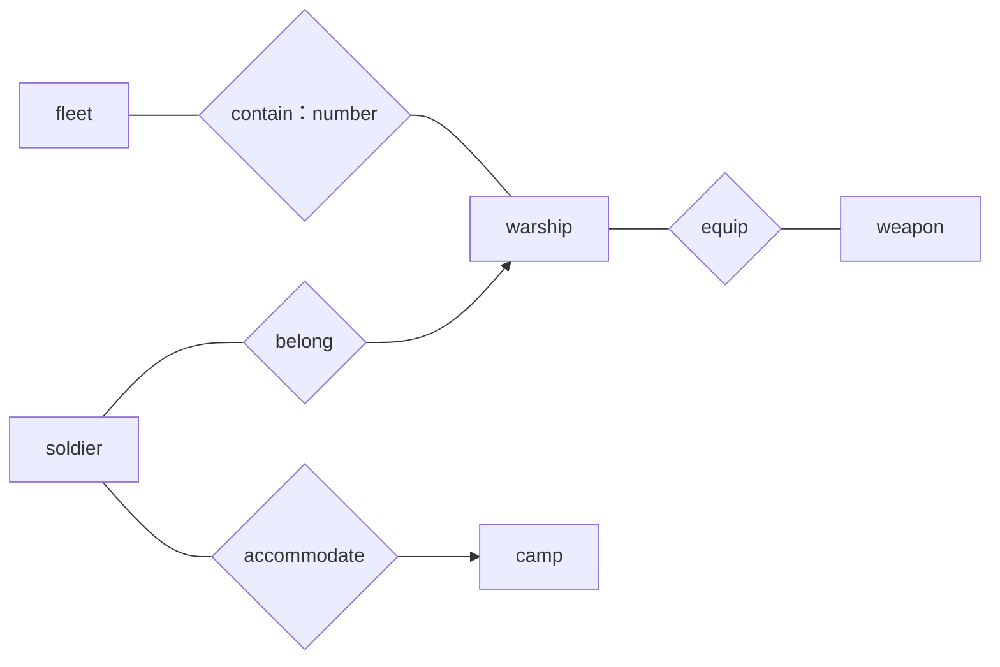
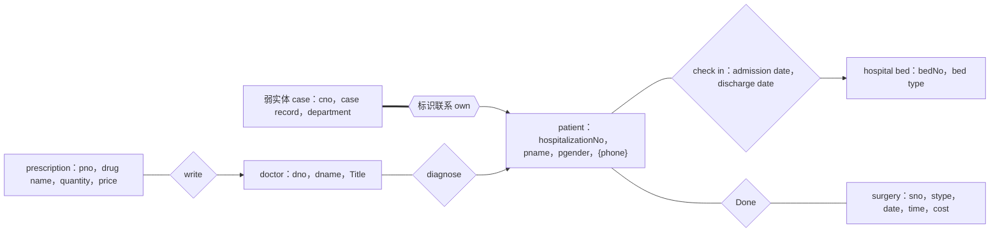

# 2021—2022 学年第一学期数据库系统原理期中测验

> 本文由《数据库系统原理》期中考试原题转换而成，依据原 PDF、PaddleOCR 转写或原始 HTML 页面整理。原题中的题干、参考答案、关系模式、公式与代码均尽量保留；OCR 疑似错误不作无依据改写。

> [!tip] 真题导航
> 上一份：[[2020—2021 学年第一学期数据库系统原理期末试卷（A 卷）]]；下一份：[[2022 年数据库系统原理期中测验]]

## 主要内容

- 数据库系统基本概念与数据模型
- 关系代数、SQL 与完整性约束
- E-R 模型与数据库设计
- 关系规范化与函数依赖
- 事务、并发控制、恢复与索引

---

## 一、转写说明

| 项目 | 内容 |
|---|---|
| 课程 | 数据库系统原理 |
| 资料类型 | 期中考试真题 |
| 整理日期 | 2026-08-12 |
| 转写原则 | 保留原题与原答案；不擅自修正知识性内容 |

> [!warning] OCR 与答案说明
> 文中可能保留原卷或 OCR 的拼写、符号与答案问题。无答案处不自行补写；图片信息已改为 Mermaid、原生表格或完整文字描述，最终笔记不保留图片。

---

## 二、原题与参考答案

| 考试注意事项 | 一、学生参加考试须带学生证或学院证明，未带者不准进入考场。学生必须按照监考教师指定座位就坐。\n二、书本、参考资料、书包等物品一律放到考场指定位置。\n三、学生不得另行携带、使用稿纸，要遵守《北京邮电大学考场规则》，有考场违纪或作弊行为者，按相应规定严肃处理。\n四、学生必须将答题内容做在试题答卷上，做在试题及草稿纸上一律无效。\n五、填空题用英文答，中文答对得一半分。 |  |  |  |  |
|---|---|---|---|---|---|
| 考试课程 | 数据库系统原理 |  |  |  | 考试时间 |
| 题号 | 一 | 二 | 三 | 四 | 五 |
| 满分 | 16 | 14 | 30 | 20 | 20 |
| 得分 |  |  |  |  |  |
| 阅卷教师 |  |  |  |  |  |

| 考试注意事项 |  |  |  |  |  |
|---|---|---|---|---|---|
| 考试课程 |  |  |  |  |  |
| 题号 | 六 | 七 | 八 | 九 |  |
| 满分 |  |  |  |  |  |
| 得分 |  |  |  |  |  |
| 阅卷教师 |  |  |  |  |  |

| 考试注意事项 |  |  |
|---|---|---|
| 考试课程 |  |  |
| 题号 | 总分 |  |
| 满分 | 100 |  |
| 得分 |  |  |
| 阅卷教师 |  |  |

### 1. (16 points) Choices

(1) In the following statements, the correct ones are  $\underline{C}$

I. The data model defines the specification of managing data items in database. It is a collection of conceptual tools for describing data structure, data relationships, data semantics, data operations and consistency constraints.

II. In relational model, as human-machine interfaces, the pure database language consists of two parts, i.e. the data manipulation language and the data definition language that is for specifying the database schema and as well as other properties of the data.

III. A foreign key is a set of one or more attributes that, taken collectively, can be used to identify uniquely a tuple in the relation.

IV. A C++ application program can access database via embedded SQL.

A. I, II, III, IV          B. I, II, III

C. I, II, IV                 D. II, III, VI

(2) In the relational model, there are pure query languages defining operating on relational data, that is  $\underline{A}$

A. relational algebra, tuple relational calculus, and domain relational calculus

B. relational algebra and tuple relational calculus

C. relational algebra and domain relational calculus

D. relational algebra, tuple relational calculus, and SQL

(3) Among the following groups of database products, which one is completely developed and distributed by domestic companies and manufactures? ___ C

A. Oracle, OceanBase, OpenGauss, TiDB

B. SQL Server, MySQL, PostgreSQL, DB2

C. TiDB, 达梦, openGauss, OceanBase, PolarDB, 人大金仓,

D. Oracle, DB2, Sybase, SQL Server

(4) Among the following statements, the correct one/ones is/are  $\underline{C}$____.

I. OpenGauss database, derived from PostgreSQL, is developed and distributed by Huawei

II. MySQL and PostgreSQL are two typical open-source database systems.

III. A on-line shopping site has a three-tier Browser-Server(B/S) architecture. Its application programs are programmed in Java, and these programs access MySQL database server via the ODBC interface.

IV. The relational model is applicable to managing structured data such as the table data, while XML provides a way to represent semi-structured data, e.g. the data with nested structures.

A. I, II, III, IV B. I, II, III C. I, II, IV D. II, III, IV

(5) In the relational data model,  $\underline{B}$ is a language for specifying the database

schema as well as other properties of the data.

A DML B DDL C relational algebra D DSL

(6) With respect to DBS design, a relational table's primary key is defined at the  $\underline{C}$ Phase.

A. requirement analysis B. conceptual design

C. logical design D. physical design

(7) Data independence means that  $\underline{B}$ and  $\underline{}$are independent and unaffected.

A. view level, logical level B. data, applications

C. data, DBMS D. conceptual model, physical model

(8) With respect to DBS design, the index is defined on the table and the database file is determined at the  $\underline{\text{D}}$ phase.

A. requirement analysis B. conceptual design

C. logical design D. physical design

(9) The  $\underline{A}$ describes the global logical structure of the database's total data, that is, how the data items are stored in DBS, and what relationships exist among those data.

A. logical schema B. internal schema

C. external schema D. user schema

(10) In relational databases, referential integrity can be ensured by defining  $\underline{C}$ on tables.

A. primary key B. candidate key

C. foreign key D. not null constraint

(11) At the conceptual design stage for the database design,  $\underline{D}$ is used to describe the data objects in the world and the associations among the objects.

A. Relational model B. Hierarchical model

C. Network model D. Entity-Relationship data model

(12) Considering the University Database given in the textbook. For the following SQL queries, which one will use the relational algebra operator Cartesian product?

A___

A. select name, course_id          B. insert into student

from instructor, teaches          values('3003', 'Green', 'Finance', 'null')

where name='Crick'

C. update course               D. select name, building

set credits=3                 from instructor natural join department

where title=Database

(13) In SQL language, the statement that can be used for security control is  $\underline{D}$

A. insert B. update C. commit D. grant

(14) Consider the relation schema Department-schema(department-name, building, budget) and relation department, which one is not the metadata stored in data dictionary?  $\underline{\text{D}}$

A. the name of the relation department

B. the domain and length of attribute building

C. the number of tuples in department

D. a tuple

(15) Given the cardinalities of the entity sets A and B with respect to the relationship set R, the participation constraints of A can be decided by  $\underline{A}$ ;

A. l $_A$ B. h $_A$ C. l $_B$ D. h $_B$

> [!note] 原图转写：一般化基数约束
> A 端标注下界与上界 `l_A…h_A`，B 端标注 `l_B…h_B`，二者通过联系 R 相连。

The mapping cardinality from A to B can be decided by  $\underline{C}$____.

A. [l $\underline{a}$, l $\underline{b}$] B. [h $\underline{a}$, h $\underline{b}$] C. [h $\underline{b}$, h $\underline{a}$] D. [l $\underline{a}$, h $\underline{b}$]

2. (14 points) Suppose there are the following relations:

Book( $\underline{\text{BookNum}}$, BookName, Author, PublishingHouse)

Reader( $\underline{\text{BorrowCardNum}}$, ReaderName, ReaderAddress)

Borrowing(  $\underline{\text{BorrowCardNum}}$,  $\underline{\text{BookNum}}$, BorrowDate, ReturnDueDate)

Returning(  $\underline{\text{BorrowCardNum}}$,  $\underline{\text{BookNum}}$, ReturnDate)

Please use relational algebra to write the following queries.

(1) Find the book names that Andy borrowed, published by the “POSTS & TELECOMM PRESS” and already returned. (4 points)

(2) Find the reader names and book names that have not returned the books before 31, Dec, 2020. (5 points)

(3) Find the reader names that have not borrowed any books before. (5 points)

### Answers:

(1)  $\Pi_T(\sigma_{N='Andy'}(\sigma_{P='人民邮电'}(L\infty R\infty B\infty LA)))$ (4 points)

(2) `\Pi_{N,T}((\Pi_{C#,B#}(\sigma_{LD85`（OCR 公式残缺）

关联查询涉及到的每个表1分，聚集操作1分，每个连接条件和查询条件1分，group by子句1分，having 子句1分。

(3) Use one or more SQL statements to verify whether or not cname is the candidate key in the table competition_category( $\underline{\text{category_id}}$, cname, manager), i.e. the functional dependency cname  $\rightarrow$ $\underline{\text{category_id}}$, manager is satisfied by the table, according to the query results of one or more SQL statements. (10 points)

答案：

方案1：

select max(count(*))

from customer

group by customerID
或者：
select max(numTuple)
from {
select customerID, count(*) as numTuple
from customer
group by customerID
}

如果查询结果大于1，则customerID不是主键。

主键customerID进行group by运算，4分；利用count统计相同customerID的元组总数2分；用max取最大值，根据结果判断主键是否成立，2分；

方案2：

利用下述语句
select *
from customer as A, customer as B
where A.customerID = B.customerID
and (A.name<>B.name OR A.address<>B.address)

如果该语句查询结果为空，则 customerID 是主键。

正确写出 where 中的判断条件，4分；
说明根据查询结果是否为空，判断主键是否成立，2分。

4.(20 points) A naval base (海军基地) is preparing to set up a fleet (舰队) management information system, which gives the following information.

(1) A fleet is uniquely identified by a FleetName and described by FleetLocation and FleetState.

(2) Every warship (舰艇) is identified by a ShipID and described by ShipName and ShipType.

(3) Each weapon (武器) is identified by WeaponID. It also has descriptive attributes ProductionTime and StorageAddress.

(4) A soldier (士兵) is distinguished by its SoldierID. For each soldier, the SoldierName, Age, Sex and Rank should be recorded.

(5) A camp (军营) is recognized by its CampName and has attributes CampLocation and Capacity.

(6) Each fleet contains more than one warship, and every warship belongs to a unique fleet. The number of warships contained by each fleet must be recorded.

(7) Each warship is equipped with several weapons, and a weapon can be used on different warships.

(8) A soldier belongs to a unique warship, but a warship has more than one soldier.

(9) A camp can accommodate many soldiers, but a soldier can only belong to a unique camp.

Construct an E-R diagram to depict the above mentioned data items and the associations among them.

> [!note] 原图转写：舰队管理 E-R 图
> 舰队 `fleet` 包含军舰 `warship`，联系具有 `number` 属性；士兵 `soldier` 属于军舰；军舰配备武器 `weapon`；营地 `camp` 容纳士兵。

5 个实体各 2 分；3 个联系（belong、accommodate、equip）各 2 分；contain 联系正确标注 number 属性得 2 分，没有标注 number 属性得 1 分；联系的映射基数有误，酌情扣分。

5. (20 points) Convert the following E-R diagram about the hospital management information system to the relation schemas, and identify the primary key of each relation by underlining the primary attributes.

> [!note] 原图转写：医院管理 E-R 图
> `case` 为依赖 `patient` 的弱实体；`patient` 与 `hospital bed` 通过 `check in` 联系，联系属性为入院日期与出院日期；`doctor` 诊断患者并开具处方，手术信息通过 `Done` 与患者关联。

### 答案：

弱实体集 case: case( $\underline{\text{hospitalizationNo}}$,  $\underline{\text{cno}}$, case record, department) (3分)

方案 1：实体 patient、一对一联系 check-in、hospital bed，check-in 归并到一端 patient

patient ( $\underline{\text{hospitalizationNo}}$, pname, pgender, bedNo, discharge date, admission date)

(3分)

hospital bed (  $\underline{\text{bedNo}}$, bed type) （2分）

方案2：实体 patient、一对一联系 check-in、hospital bed，check-in 归并到一端 hospital bed

patient ( $\underline{\text{hospitalizationNo}}$, pname, pgender) (2分)

hospital bed ( $\underline{\text{bedNo}}$, bed type, hospitalizationNo, discharge date, admission date) (3分)

patient 的多值属性 patientphone:

patientphone ( $\underline{\text{hospitalizationNo}}$,  $\underline{\text{phone}}$) （2分）

实体 doctor: doctor(  $\underline{dno}$, dname, title) (2分)

多对多联系 diagnose: diagnose(  $\underline{dno}$,  $\underline{\text{hospitalizationNo}}$ ) (2分)

处方 prescription: prescription(p $\underline{no}$, drug name, quantity, price, dno) (3分)

手术 surgery: surgery(  $\underline{sno}$, stype, date, time, cost, hospitalizationNo) (3分)

注：没有正确标注主键，扣1分。没有正确归并联系Patient、Case、Prescription、Surgery，分别扣1分。

此外，多对一联系 Done、write 由于多端非完全参与，这 2 个联系也可以单独转换为关系表。

---

## 本章小结

| 模块 | 主要考查内容 |
|---|---|
| 基础理论 | 数据库体系结构、数据模型、完整性与数据独立性 |
| 查询语言 | 关系代数、SQL 定义与数据操纵 |
| 数据库设计 | E-R 建模、模式转换、函数依赖与规范化 |
| 系统实现 | 索引、事务、并发控制、日志与故障恢复 |

> [!tip] 真题导航
> 上一份：[[2020—2021 学年第一学期数据库系统原理期末试卷（A 卷）]]；下一份：[[2022 年数据库系统原理期中测验]]
