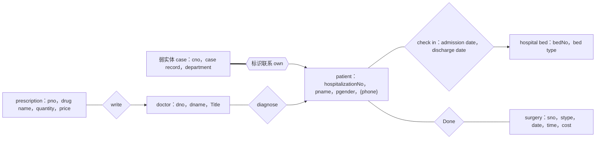

# 2022 年数据库系统原理期中测验

> 本文由《数据库系统原理》期中考试原题转换而成，依据原 PDF、PaddleOCR 转写或原始 HTML 页面整理。原题中的题干、参考答案、关系模式、公式与代码均尽量保留；OCR 疑似错误不作无依据改写。

> [!tip] 真题导航
> 上一份：[[2021—2022 学年第一学期数据库系统原理期中测验]]；下一份：[[2022—2023 学年第一学期数据库系统原理期末试卷（A 卷）]]

## 主要内容

- 数据库系统基本概念与数据模型
- 关系代数、SQL 与完整性约束
- E-R 模型与数据库设计
- 关系规范化与函数依赖
- 事务、并发控制、恢复与索引

---

## 一、转写说明

| 项目 | 内容 |
|---|---|
| 课程 | 数据库系统原理 |
| 资料类型 | 期中考试真题 |
| 整理日期 | 2026-08-12 |
| 转写原则 | 保留原题与原答案；不擅自修正知识性内容 |

> [!warning] OCR 与答案说明
> 文中可能保留原卷或 OCR 的拼写、符号与答案问题。无答案处不自行补写；图片信息已改为 Mermaid、原生表格或完整文字描述，最终笔记不保留图片。

---

## 二、原题与参考答案

班级: ___ 学号: ___ 姓名: ___

### 【考试交卷时，试题连同答题纸一起上交】

1.(35 points). A travel agency management database contains the following tables.

tourist (tid, tname, sex, age, telephone, email, address, registration_time, team_id)

tourism_team (team_id, team_name, start_date, end_date, line_id)

tourism_line (line_id, line_name, start_city, description)

scenic_spot (spot_id, spot_name, city, price)

spot_line (spot_id, line_id)

(1) A tourist (游客) is identified by tid, and has attributes tname, sex, age, telephone, email,

address, registration time. Each tourist participates in a tourism team with team id.

(2) Each tourism_team（旅行团）is identified by team_id, and has attributes team_name, start_date, end_date. Each tourism_team only travels a tourism_line with line_id.

(3) Each tourism_line（旅游线路）is identified by line_id, and has attributes line_name, start_city, line_description.

(4) A scenic spot（景点）is identified by a spot_id, and has attributes spot_name, city, price.

(5) Each scenic_spot with spot_id can belong to multiple tourism lines with line_id, and each tourism_line with line_id consists of multiple scenic spots with spot_id.

For the following queries, give relational algebra expressions for (1), and SQL statements for (2)~(6).

(1) Find the tourists who are male and participate in the tourism team from “2021-5-1” to “2021-5-3”, and they travel the tourism line with the name “Hangzhou-Shanghai”. List the tourists' name and the description of the tourism line they have travelled.

 $$\underset{(end\_date="2021-5-3")}{\Pi_{t n a m e,d e s c r i p t i o n}[\sigma}\quad(s e x=m a l e")a n d(s t a r t\_d a t e="2021-5-1")a n d$$

tourist ✗ tourism_team ✗ tourism_line)]

(2) Find the name and price of the scenic_spot and the name of the tourism_line. It is required that the price of the scenic_spot is below USD 50, the start_city of tourism_line is “Beijing”, and the tourism_team starts on “2021-8-1” and ends on “2021-8-10”.

答案：

select spot_name, price, line_name

from scenic spot natural join spot line natural join tourism line natural join

tourism $\underline{_}$team

where start_date="2021-8-1" and end_date="2021-8-10" and price20)

)

(4) Delete all the information of the tourism spots whose price are more than USD 100.

答案：

delete from spot_line

where spot\_{id} in

(select spot_id from scenic_spot

where price>100);

delete from scenic_spot

where price>100;

(5) Find the tourism-line meeting the following requirements: the tourism_team starts on “2021-10-1” and ends on “2021-10-5”, the start_city of the tourism-line is “Beijing”, and the total number of the tourism_team which travels this line is more than 150. List the line_id of the tourism_line and the total number of the tourism_team in a descending order.

谷来：
select line_id, count(team_id) as teamnumber
from tourism_team natural join tourism_line
where start_date = "2021-10-1" and end_date = "2021-10-5" and start_city = "Beijing"
group by line_id
having count(team_id) > 150
order by teamnumber desc

(6) Use one or more SQL statements to verify on the table scenic_spot ( $spot\_id$, spot_name, city, price), whether or not the functional dependency spot_name→city holds on the table, according to the query results of one or more SQL statements.

答案 1：判断下述语句是否为真

create assertion spotname2city check
(
    not exists
    (select spot_name
        from scenic_spot
        group by spot_name
        having count(distinct city) > 1
)

方法2：如果查询结果大于1，则函数依赖不成立

select max(count(distinct city))
from scenic_spot
group by spot_name
select max(numTuple)
from {
    select spot_name, count(city) as numTuple
    from scenic_spot
    group by spot_name
}

方法3：下述查询语句为空，则函数依赖成立
select *
    from scenic_spot as A, scenic_spot as B
where A.spot_name=B.spot_name

2. (20 points) Convert the following E-R diagram about the hospital management information system to the relation schemas, and identify the primary key of each relation by underlining the primary attributes.

> [!note] 原图转写：医院管理 E-R 图
> `case` 为依赖 `patient` 的弱实体；`patient` 与 `hospital bed` 通过 `check in` 联系，联系属性为入院日期与出院日期；`doctor` 诊断患者并开具处方，手术信息通过 `Done` 与患者关联。

### 答案：

弱实体集 case: case( $\underline{\text{hospitalizationNo}}$,  $\underline{\text{cno}}$, case record, department)

方案1：实体 patient、一对一联系 check-in、hospital bed，check-in 归并到一端 patient patient ( $\underline{\text{hospitalizationNo}}$，pname，pgendar，bedNo，discharge date，admission date) hospital bed (bedNo，bed type)

方案2：实体 patient、一对一联系 check-in、hospital bed，check-in 归并到一端 hospital bed

patient  $\underline{\text{hospitalizationNo}}$, pname, pgendar)

hospital bed ( $\underline{\text{bedNo}}$, bed type, hospitalizationNo, discharge date, admission date)

patient 的多值属性 patientphone:

patientphone  $\underline{\text{hospitalizationNo}}$, phone)

实体 doctor: doctor(  $\underline{\text{dno}}$, dname, title)

多对多联系 diagnose: diagnose(  $\underline{\text{dno}}$,  $\underline{\text{hospitalizationNo}}$)

处方 prescription: prescription(  $\underline{\text{pno}}$, drug name, quantity, price, dno)

手术 surgery: surgery(  $\underline{\text{sno}}$, stype, date, time, cost, hospitalizationNo)

多对一联系 Done、write，由于多端非完全参与，这 2 个联系可以单独转换为关系表 Done(hospitalizationNo, Sno)

Write(pno, dno)

3. (15 points) Given $R$(A, B, C, D, E, H), and$F=\{\mathrm{A} \rightarrow \mathrm{BC}, \mathrm{CD} \rightarrow \mathrm{E}, \mathrm{B} \rightarrow \mathrm{D}, \mathrm{C} \rightarrow \mathrm{AB}\}$,

(1) find out all candidate keys of $R$(2) what is the highest normal form of$R$? Why?

答案:

(1)

Step1.

$L = \{\}$$R = \{E\}$$N = \{H\}$$LR = \{A, B, C, D\}$$X_{set} = L \cup N = \{H\}$$X_{set^t} = H < R$, H 不是候选键。

Step2. 由于 H 没有出现在依赖的左部、右部，下面针对 R1=(A, B, C, D, E) 和 F，找出 R1 的候选键，该候选键加上属性 H，就是 R 的候选键。

2.1 从 LR = {A, B, C, D} 中挑出一个属性，判断是否为 R1 的候选键。

A⁺=R1，A 是 R1 的候选键，其它包含 A 的属性集都不是 R1 的候选键。

B⁺=BD，B 不是 R1 的候选键。

C⁺=R1，C 是 R1 的候选键，其它包含 C 的属性集都不是 R1 的候选键。

D⁺=D，D 不是 R1 的候选键。

2.2 从 LR = {A, B, C, D} 中拿出 2 个属性，且不包含 A 或 C，判断是否为 R1 的候选键。

(BD)⁺=BD, BD 不是 R1 的候选键。

2.3 从 LR = {A, B, C, D} 中拿出 3 个属性，且不包含 A 或 C，判断是否为 R1 的候选键。找不到满足条件的个属性。

因此，A、C 是 R1 的两个候选键，AH、CH 是 R 的两个候选键。

(2) R 最高满足  $1NF$ (4分)。

在非主属性 B、D、E 中，对 B，从 A→BC 可知 A→B，非主属性 B 部分依赖于候选键 AH，不满足非主属性完全依赖于候选键的 2NF 要求。(3 分)

（或：从 C→AB，可知 C→B，非主属性 B 部分依赖于候选键 CH）

4. (30 points) The functional dependency set  $F = \{AB \rightarrow C, A \rightarrow DEI, B \rightarrow FH, F \rightarrow GH, D \rightarrow IJ\}$ holds on the relation schema R = (A, B, C, D, E, F, G, H, I, J),

(1) Compute  $(AF)^{+}$

(2) List all the candidate keys of R.

(3) Compute the canonical cover  $F_{c}$

(4) Give a lossless and dependency-preserving decomposition of R into 3NF. (10 points)

(1)  $(AF)^{+} = ADEFGHIJ$

(2) L-set={A, B}

R-set={C, E, G, H, I, J}

N-set={}

LR-set={D, F}

因为 $(AB)^{+}=ABCD$

为  $(AB)^{+}=ABCDEFGHIJ=R$，所以 AB 为 R 的唯一候选键。

(3)  $\mathrm{Fc}=\{\mathrm{AB}\rightarrow\mathrm{C}, \mathrm{A}\rightarrow\mathrm{DE}, \mathrm{B}\rightarrow\mathrm{F}, \mathrm{F}\rightarrow\mathrm{GH}, \mathrm{D}\rightarrow\mathrm{IJ}\}$

(4) 针对 Fc 中 5 条函数依赖，构造 5 个子模式。

 $R_{1}(A, B, C)$

 $R_{2}(A, D, E)$

 $R_{3}(B, F)$

 $R_{4}(F, G, H)$

 $R_{5}(D, I, J)$

由于候选键 AB 已经包含在 R1 中，因此以上 5 个子模式构成 R 的 3NF 分解。

---

## 本章小结

| 模块 | 主要考查内容 |
|---|---|
| 基础理论 | 数据库体系结构、数据模型、完整性与数据独立性 |
| 查询语言 | 关系代数、SQL 定义与数据操纵 |
| 数据库设计 | E-R 建模、模式转换、函数依赖与规范化 |
| 系统实现 | 索引、事务、并发控制、日志与故障恢复 |

> [!tip] 真题导航
> 上一份：[[2021—2022 学年第一学期数据库系统原理期中测验]]；下一份：[[2022—2023 学年第一学期数据库系统原理期末试卷（A 卷）]]
