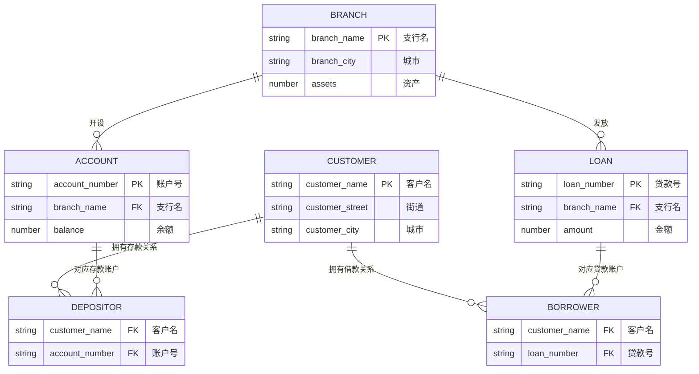

# 2022—2023 学年第一学期数据库系统原理期末试卷（A 卷）

> 本文由《数据库系统原理》期末考试原题转换而成，依据原 PDF、PaddleOCR 转写或原始 HTML 页面整理。原题中的题干、参考答案、关系模式、公式与代码均尽量保留；OCR 疑似错误不作无依据改写。

> [!tip] 真题导航
> 上一份：[[2022 年数据库系统原理期中测验]]；下一份：[[2024—2025 学年第一学期数据库系统原理期末试卷（A 卷）]]

## 主要内容

- 数据库系统基本概念与数据模型
- 关系代数、SQL 与完整性约束
- E-R 模型与数据库设计
- 关系规范化与函数依赖
- 事务、并发控制、恢复与索引

---

## 一、转写说明

| 项目 | 内容 |
|---|---|
| 课程 | 数据库系统原理 |
| 资料类型 | 期末考试真题 |
| 整理日期 | 2026-08-12 |
| 转写原则 | 保留原题与原答案；不擅自修正知识性内容 |

> [!warning] OCR 与答案说明
> 文中可能保留原卷或 OCR 的拼写、符号与答案问题。无答案处不自行补写；图片信息已改为 Mermaid、原生表格或完整文字描述，最终笔记不保留图片。

---

## 二、原题与参考答案

| 考试注意事项 |  | 一、学生参加考试须带学生证或学院证明，未带者不准进入考场。学生必须按照监考教师指定座位就坐。 |  |  |  |
|---|---|---|---|---|---|
| 考试注意事项 |  | 二、书本、参考资料、书包等物品一律放到考场指定位置。 |  |  |  |
| 考试注意事项 |  | 三、学生不得另行携带、使用稿纸，要遵守《北京邮电大学考场规则》，有考场违纪或作弊行为者，按相应规定严肃处理。 |  |  |  |
| 考试注意事项 |  | 四、学生必须将答题内容做在试题答卷上，做在试题及草稿纸上一律无效。 |  |  |  |
| 考试注意事项 |  | 五、填空题用英文答，中文答对得一半分。 |  |  |  |
| 考试课程 |  | 数据库系统原理 |  |  |  |
| 考试课程 |  | 数据库系统原理 |  |  |  |
| 题号 |  | 一 | 二 | 三 | 四 |
| 满分 |  | 22 | 20 | 15 | 13 |
| 得分 |  |  |  |  |  |
| 阅卷教师 |  |  |  |  |  |

| 考试注意事项 |  |  |  |  |  |
|---|---|---|---|---|---|
| 考试注意事项 |  |  |  |  |  |
| 考试注意事项 |  |  |  |  |  |
| 考试注意事项 |  |  |  |  |  |
| 考试注意事项 |  |  |  |  |  |
| 考试课程 | 考试时间 |  |  |  | 2022年12月20日 |
| 考试课程 | 考试时间 |  |  |  | 13:30~15:30 |
| 题号 | 五 | 六 | 七 | 八 | 九 |
| 满分 | 12 | 18 |  |  |  |
| 得分 |  |  |  |  |  |
| 阅卷教师 |  |  |  |  |  |

| 考试注意事项 |  |  |  |
|---|---|---|---|
| 考试注意事项 |  |  |  |
| 考试注意事项 |  |  |  |
| 考试注意事项 |  |  |  |
| 考试注意事项 |  |  |  |
| 考试课程 |  |  |  |
| 考试课程 |  |  |  |
| 题号 |  | 总分 |  |
| 满分 |  | 100 |  |
| 得分 |  |  |  |
| 阅卷教师 |  |  |  |

1. (22 points) Here is the schema diagram for the Banking database(银行数据库). The table branch describes the name, the city located and the assets(资产) of the bank's branches (支行). The customers of branches are represented in the table customer. A customer may have an account (存款账户) in a branch. His account is uniquely identified by the attribute account_number, and the attribute balance (存款额) records the amount of money in this account; A customer may also have a loan (借款账户) in a branch. His loan is solely identified by loan_number, and the amount of money he loans is given by the attribute amount (借款额). The relationships between customers and their accounts or loans are modelled as depositor or borrower respectively.

> [!note] 原图转写：Banking 数据库模式图
> 主键分别为 `branch.branch_name`、`account.account_number`、`loan.loan_number`、`customer.customer_name`；`depositor` 连接客户与存款账户，`borrower` 连接客户与贷款账户。

Figure 1 Schema diagram for Banking database

For the following queries, give relational algebra expressions for (1), and SQL statements for (2)~(5)

(1) Find the names of all customers who have an account at the “Haidian” branch, but at any branch have no loan whose amount is greater than 1000. (4 points)

(2) Create the table account, in which account_number is the primary key, branch_name is a foreign key that defines a referential integrity constraint from account to branch. It is also required that branch_name is not permitted to be null, and the balance of an account is not below 0. (5 points)

(3) Use one or more SQL statements to verify whether or not the functional dependency account number→balance is satisfied by the table account. (4 points)

(4) A customer BUPT paid off all of his loans in Haidian branch, and accordingly, use SQL statements to delete related information in database. (4 points)

(5) For each branch located in Beijing, calculate the total number of the customers who have accounts in the branch. For the branch that have more than 100 account customers (i.e. depositors), list its name, the total number of the depositors, as well as the sum of the balances, in descending order of balance sum. (5 points)

2.(20 points) A cake chain store(蛋糕连锁店) needs to manage its stores, products(cakes), employees and customers, and needs to manage the following information:

(1) Stores（店铺）: including Store_ID, Address （including province, city, street, zip code), Contact telephone number and other information. Store_ID is unique, and a Store can have multiple contact numbers;

(2) Cakes（蛋糕）: including Cakes\_\_ID , Name, Price, and the Cakes\_\_ID is unique;

(3) Employees(员工): including Employee_ID, Name, Gender, Age, Telephone Number and Employment Date, and the Employee_ID is unique;

(4) Customers(客户): including the Customer\_\_ID, Name, Gender, Age, Contact number. The Customer\_\_ID is unique;

(5) Customer types: including the Type ID, Type Description. The Type ID is unique;

(6) One store has many employees, and one employee can only work in one store;

(7) A customer can only belong to one customer type, and one customer type can contain multiple customers;

(9) Sales information: Record the information about customers' purchase of cakes in a store, including the date and quantity of purchase.

Design a relational database to managing the information mentioned above:

(1) Design the E/R diagram. It is required that mapping cardinality of each relationship and participation of each entity to the relationship should be given in the diagram. (10 points)

(2) Convert the E-R diagram to the proper relational schemas, and give the primary key of each relation schema by underlines. (10 points)

3. (15 points) The functional dependency set  $F = \{A \rightarrow C, B \rightarrow A, C \rightarrow DE, D \rightarrow AC, B \rightarrow E\}$ holds on the relation schema R = (A, B, C, D, E),

(1) Compute  $(AB)^{+}$. (2 points)

(2) List all the candidate keys of R. (1 points)

(3) What is the highest normal form of R, and why? (3 points)

(4) Is R1=(A, B, C) and R2=(C, D, E) a lossless-join decomposition of R, and Why? (3 points)

(5) Compute the canonical cover  $F_{c}$. (2 points)

(6) Give a lossless-join and dependency-preserving decomposition of R into 3NF. (4 points)

4. (13 points) Considering the Banking database in Figure 1, answer the following questions. (1) The attribute account_number in the table account is defined as the primary key and a clustering index is created on it. Some tuples/records are then inserted into the table account, the records in data file storing account are organized as a heap file, sequential file, or multitable clustering file, and why? (3 points)

(2) For the table account, after account number has been defined as the primary key, another index BNIdx is defined on the attribute branch name and organized as a B+-tree. Then, the index BNIdx is a primary/clustering index or secondary/non-clustering index, and why? (3 points)

(3) For the following SQL query, in addition to the existing primary indices on the primary keys of the tables, on which attributes the indices can be further defined to speed up the query? (3 points)

select branch_city, sum(amount)

from branch inner join loan on branch_name

where  $assets>1000$

group by branch_city

(4) Give a SQL statement to define a composite index on combined search key  $(branch\_name, amount)$ on the table loan.

Can this index be efficiently used for the following query, and why? (4 points)

select *

from loan

where amount>100

5. (12 points) Consider the Banking database given in Figure 1.

(1) Give a SQL statement to find the customer meeting the following requirements, and list his name: (i) the customer lives in Beijing; and (ii) he has an account that is with the balance more than 100 and belongs to a branch located in Tianjing. (3 points)

(2) For the SQL statement in (1), use heuristic optimization scheme to give an optimized query tree. (9 points)

6. (18 points) Consider the concurrent transactions  $T_{1}$,  $T_{2}$,  $T_{3}$ and  $T_{4}$ under the schedule S

(1) Construct the precedence graph for S. Is S a serializable schedule? If not, give the reason.

If it is, give all serial schedules that are equivalent to S. (5 points)

(2) Is S a recoverable schedule? and why? (3 points)

(3) Is S a cascading or cascadeless schedule? and why? (3 points)

(4) Does S obey the two-phase locking protocol? and why? (3 points)

(5) Does S obey the strict two-phase locking protocol? and why? Does S obey the rigorous

two-phase locking protocol? and why? (4 points)

| $T_{1}$ | $T_{2}$ | $T_{3}$ | $T_{4}$ |
|---|---|---|---|
|  |  |  | Lock_X(A)\nLock_X(C)\nRead(A)\nA:=A-100\nWrite(A)\nUnlock(A) |
| Lock_S(B)\nRead(B)\nLock_S(Q) |  |  |  |
|  | Lock_S(A)\nLock_X(B)\nRead(A)\nRead(B)\nB:=B-A\nWrite(B)\nLock_S(Q)\nUnlock(B) |  |  |
|  |  | Lock_S(B)\nRead(B)\nLock_S(A) |  |
|  |  |  | Read(C)\nC:=C+100\nWrite(C) |
|  | Read(Q)\nUnlock(A)\nUnlock(Q) |  |  |
|  |  | Read(A)\nLock_X(C)\nRead(C)\nC:=A+B\nWrite(C)\nUnlock(B)\nUnlock(C) |  |
| Read(Q)\nLock_X(C)\nRead(C)\nC:=C+Q\nUnlock(Q) |  |  |  |
|  |  |  | Unlock(C)\ncommit |
|  | commit |  |  |
| Write(C)\nUnlock(C)\nUnlock(B)\nCommit |  |  |  |
|  |  | Unlock(A)\ncommit |  |

---

## 本章小结

| 模块 | 主要考查内容 |
|---|---|
| 基础理论 | 数据库体系结构、数据模型、完整性与数据独立性 |
| 查询语言 | 关系代数、SQL 定义与数据操纵 |
| 数据库设计 | E-R 建模、模式转换、函数依赖与规范化 |
| 系统实现 | 索引、事务、并发控制、日志与故障恢复 |

> [!tip] 真题导航
> 上一份：[[2022 年数据库系统原理期中测验]]；下一份：[[2024—2025 学年第一学期数据库系统原理期末试卷（A 卷）]]
