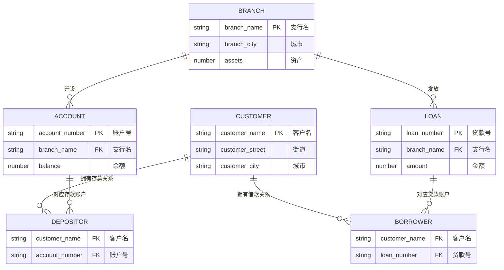

# 2025—2026 学年第二学期数据库系统原理期中试卷（计算机学院）

> 本文由《数据库系统原理》期中考试原题转换而成，依据原 PDF、PaddleOCR 转写或原始 HTML 页面整理。原题中的题干、参考答案、关系模式、公式与代码均尽量保留；OCR 疑似错误不作无依据改写。

> [!tip] 真题导航
> 上一份：[[2024—2025 学年第一学期数据库系统原理期末试卷（A 卷）]]；下一份：[[2025—2026 学年第二学期数据库系统原理期中试卷（软件学院）]]

## 主要内容

- 数据库系统基本概念与数据模型
- 关系代数、SQL 与完整性约束
- E-R 模型与数据库设计
- 关系规范化与函数依赖
- 事务、并发控制、恢复与索引

---

## 一、转写说明

| 项目 | 内容 |
|---|---|
| 课程 | 数据库系统原理 |
| 资料类型 | 期中考试真题 |
| 整理日期 | 2026-08-12 |
| 转写原则 | 保留原题与原答案；不擅自修正知识性内容 |

> [!warning] OCR 与答案说明
> 文中可能保留原卷或 OCR 的拼写、符号与答案问题。无答案处不自行补写；图片信息已改为 Mermaid、原生表格或完整文字描述，最终笔记不保留图片。

---

## 二、原题与参考答案

### 1. (15 points)

1. Database (DB) is a collection of 【暂无答案】 stored in systems as files
2. A 【暂无答案】 is a set of one or more attributes that, taken collectively, can be used to identify uniquely a tuple in the relation
3. 【暂无答案】 semi-quantitatively express the number of entities to which another entity can be associated via a relationship set.
4. Domain is 【暂无答案】 if its elements are considered to be indivisible units.
5. DBS design can be divided into three stages, at the 【暂无答案】 stage, the E-R model is used to describe the data objects in the world and the associations among the objects.
6. An entity set that does not have sufficient attributes to form a primary key is termed a 【暂无答案】.
7. SQL queries can be invoked from host languages, e.g. C++, via 【暂无答案】and dynamic SQL.
8. In referencing relation and referenced relation, the value of a foreign key is either null or equal to the value of the 【暂无答案】 in another relation.
9. From the entity sets A and B, the relationship set R among them, if the cardinality limit of A is 2…\*, and the cardinality limit of B is 0 …1, then the mapping cardinality from A to B is: 【暂无答案】.
10. The three levels of data abstractions are physical level, 【暂无答案】 level and view level.
11. An 【暂无答案】 of the database is the collection of information stored in the database at a particular moment
12. Query is a a statement requesting the 【暂无答案】 of information.
13. The 【暂无答案】 clause causes the tuples in the result of query to appear in sorted order.
14. A 【暂无答案】 provides a mechanism to hide certain data from the view of certain users.
15. The 【暂无答案】 of a weak entity set is the set of attributes that distinguishes among all those entities in the weak entity set that depending on a particular strong entity

### 2. (22 points)

Here is the schema diagram for the **Banking** database(银行数据库). The table *branch* describes the name, the city located and the assets(资产) of the bank’s branches (支行). The customers of branches are represented in the table *customer*. A customer may have an *account* (存款账户) in a branch. His account is uniquely identified by the attribute *account\_number*, and the attribute *balance* (存款额) records the amount of money in this account; A customer may also have a *loan* (借款账户) in a branch. His loan is solely identified by *loan\_number*, and the *amount* (借款额) of money he loans is given by *amount*. The relationships between customers and their accounts or loans are modelled as *depositor* or *borrower* respectively.

> [!warning] 原题图缺失
> 原始 HTML 将第 2 题的 Banking 数据库模式图标为“图片暂缺”。根据同题文字可确定涉及 `branch`、`customer`、`account`、`loan`、`depositor`、`borrower` 六个关系；其标准连接关系如下。

> [!note] 原图转写：Banking 数据库模式图
> 主键分别为 `branch.branch_name`、`account.account_number`、`loan.loan_number`、`customer.customer_name`；`depositor` 连接客户与存款账户，`borrower` 连接客户与贷款账户。

For the following queries, give **relational algebra** expressions for (1), and **SQL statements** for (2)~(5)

1. Find the names of all customers who have an account at the “Haidian” branch, but at any branch have no loan whose amount is greater than 1000. (4 points)
2. Create the table *account*, in which *account\_number* is the primary key, *branch\_name* is a foreign key that defines a referential integrity constraint from *account* to *branch*. It is also required that *branch\_name* is not permitted to be null, and the account’s balance is not below 0. (5 points)
3. Use one or more SQL statements to verify whether or not the functional dependency *account\_number*→*balance* is satisfied by the table *account*. (4 points)
4. A customer BUPT paid off all of his loans in Haidian branch, and accordingly, use SQL statements to delete related information in database. (4 points)
5. For each branch located in Beijing, count the total number of the customers who have accounts in the branch. For the branch that have more than 100 account customers (i.e. depositors), list its name, the total number of the depositors, as well as the sum of the balances, in descending order of balance sum. (5 points)

### 3. (23 points)

In the Company database, there are six relational tables as follows.

*employee*(*eID*, *ename*, *birthdate*, *sex*, *salary*, *deptID*)

*department*(*deptID*, *deptname*, *mgr\_ID*)

*departlocation*(*deptID*, *dept\_location*)

*workson*(*eID*, *prj\_ID*, *hours*)

*project*(*prj\_ID*, *prj\_name*, *prj\_location*, *deptID*)

*dependent*(*eID*, *dependent\_name*, *sex*, *birthdate*)

The three data objects employee, department and project are modeled as the relational table *employee*, *department*, and *project*, respectively. Each employee *eID* belongs to a department *deptID*, this department’s manager is identified by *mgr\_ID*, and its location is given in the table *depart\_location*; The employee *eID* works on a project recognized by *prj\_ID*, this project is managed by the department *deptID*, and the times he spends on this project is given by the attribute *hours*; An employee *eID* may have one or more dependents, and the dependent’s information such as name, sex and birthdate is given in the table *dependent*.

For the following queries, give **SQL statements** for (1)~(3), and **relational algebra** expressions for (4).

1. Create the table *employee*, in which (*eID*) is the primary key, and (*ename*) is not permitted to be null; there exists a referential integrity constraint from *employee* to *department*, and it is also required that the employee’s salary is not below 0. (6 points)
2. For the female employees who work in the department *deptname*=‘EE’, increase their salaries by ten percent. (6 points)
3. Among all the departments, find the department that has the largest number of the employees in it. List the department’s ID, name and the number of the employees belonging to this department. (6 points)
4. Find the average age of the female employees in the department that is located in ‘Building 4’. (5 points)

### 4.(20 points)

Consider the following E/R diagram. Create the relational schema that captures this E/R diagram. For every relation in your schema, specify the primary key of that relation.

> [!warning] 第 4 题题图缺失
> 原始 HTML 未包含本题所指的 E-R 图，也没有足以唯一恢复实体、属性和联系的文字信息，因此不作推测性重绘。

### 5. (20 Points)

Consider the data requirements which DVD rental company needs to record.

* This rental companies have several branches. The data of each branch include: address (consist of the city, street and zip code), telephone number (each branch can have several phone numbers), branch number, this number is unique.
* The staff. Each employee has a unique number, as well as the names, positions and salaries.
* The DVD. The following data should be saved, including DVD number, title, the daily rental price, status, and the names of the main actors and directors, among which the number is unique, but the major actors and directors in each DVD can be more than one.
* The classification of DVD. Including the classification number, name and description, classification number must be unique.
* The customers. Including customer number, name, address and date of registration, the customer number is unique.
* A branch may contain many employees, but an employee only belongs to one branch.
* A branch may have many DVDs, but each DVD belongs to one branch.
* Each DVD can belong to more than one classification, but a classification may have no DVDs.
* The record that customer rented DVD. A customer can rent more than one DVD, and a DVD may be rented by more than one customer. The rental date and the return date must be recorded.

Draw the E/R diagram for the database based on the information mentioned above.

---

## 本章小结

| 模块 | 主要考查内容 |
|---|---|
| 基础理论 | 数据库体系结构、数据模型、完整性与数据独立性 |
| 查询语言 | 关系代数、SQL 定义与数据操纵 |
| 数据库设计 | E-R 建模、模式转换、函数依赖与规范化 |
| 系统实现 | 索引、事务、并发控制、日志与故障恢复 |

> [!tip] 真题导航
> 上一份：[[2024—2025 学年第一学期数据库系统原理期末试卷（A 卷）]]；下一份：[[2025—2026 学年第二学期数据库系统原理期中试卷（软件学院）]]
