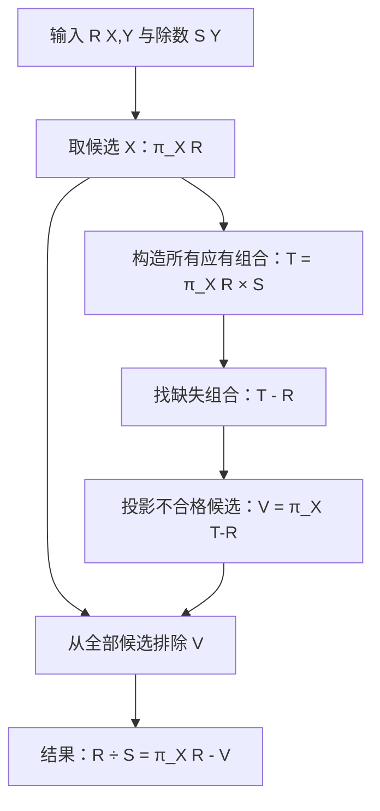

# 2.1 关系数据库

> 本章从关系的数据结构与形式化定义出发，依次讨论关系操作、关系代数和三类完整性约束。关系代数是 SQL 的理论核心；关系完整性则规定了数据更新时必须保持的不变条件。

## 主要内容

- 关系模型、域、笛卡尔积、关系与关系模式
- 码、基本关系性质与关系数据库的型和值
- 关系操作及关系数据库语言分类
- 集合运算、选择、投影、连接、除与重命名
- 实体完整性、参照完整性与用户定义完整性

---

## 一、关系模型概述

### 1. 发展简史

- 1962 年，CODASYL 发表“信息代数”。
- 1968 年，David Child 在 IBM 7090 上实现集合论数据结构。
- 1970 年，IBM 的 E. F. Codd 在论文 *A Relational Model of Data for Large Shared Data Banks* 中系统、严格地提出关系模型。
- 此后 Codd 提出关系代数和关系演算；1972 年提出第一、第二、第三范式，1974 年提出 BC 范式。

### 2. 关系模型的基本特点

1. **单一数据结构**：现实世界的实体以及实体间的联系都用关系表示。
2. **二维表逻辑结构**：从用户角度看，关系就是二维表。
3. **集合论基础**：关系及其查询建立在集合代数之上。

---

## 二、关系数据结构及形式化定义

### 1. 域

> **域（Domain）**是一组具有相同数据类型的值的集合。

域可以是整数、实数、某个范围内的整数、指定长度的字符串，或有限集合，如 `{男, 女}`。

### 2. 笛卡尔积

> 给定一组域 $D_1,D_2,\ldots,D_n$（允许其中有相同的域），它们的笛卡尔积为所有域取值组合的集合：
> $$D_1\times D_2\times\cdots\times D_n=\{(d_1,d_2,\ldots,d_n)\mid d_i\in D_i,\ i=1,2,\ldots,n\}.$$
> 集合中的组合不重复。

- **元组（Tuple）**：笛卡尔积中的一个元素 $(d_1,d_2,\ldots,d_n)$，也称 $n$ 元组。
- **分量（Component）**：元组中的每一个值 $d_i$。
- **基数（Cardinality）**：若有限域 $D_i$ 的基数为 $m_i$，则笛卡尔积的基数为

$$
M=\prod_{i=1}^{n}m_i.
$$

**例**：教师域 $T=\{t_1,t_2\}$，专业域 $S=\{s_1,s_2,s_3\}$，研究生域 $P=\{p_1,p_2\}$，则 $T\times S\times P$ 有 $2\times3\times2=12$ 个三元组。

| 教师 $T$ | 专业 $S$ | 研究生 $P$ |
|---|---|---|
| $t_1$ | $s_1$ | $p_1$ |
| $t_1$ | $s_1$ | $p_2$ |
| $t_1$ | $s_2$ | $p_1$ |
| $ldots$ | $ldots$ | $ldots$ |
| $t_2$ | $s_3$ | $p_2$ |

### 3. 关系

> $D_1\times D_2\times\cdots\times D_n$ 的一个**子集**称为域 $D_1,D_2,\ldots,D_n$ 上的关系，记作 $R(D_1,D_2,\ldots,D_n)$。$R$ 是关系名，$n$ 是关系的目或度（Degree）。

笛卡尔积包含全部可能组合，只有其具有实际含义的子集才构成业务关系。例如：

$$
SAP(\text{SUPERVISOR},\text{SPECIALITY},\text{POSTGRADUATE})
$$

若假设导师与专业为 $n:1$、导师与研究生为 $1:n$，且研究生不重名，则 `POSTGRADUATE` 可作为主码；关系可以包含：

```text
(张清玫, 计算机专业, 李勇)
(张清玫, 计算机专业, 刘晨)
(刘逸, 信息专业, 王敏)
```

- 关系中的每个元素是一个元组，通常记作 $t$。
- $n=1$ 时称一元关系（Unary Relation），$n=2$ 时称二元关系（Binary Relation）。
- 二维表的一行对应一个元组，一列对应一个域。
- 不同列可以来自同一个域，必须用**属性名（Attribute）**区分；$n$ 目关系具有 $n$ 个属性。

### 4. 码与属性分类

> **候选码（Candidate Key）**：其值能够唯一标识关系中一个元组的最小属性组。
>
> **主码（Primary Key）**：从多个候选码中选定的一个候选码。
>
> **全码（All-key）**：关系模式的全部属性共同构成候选码。

- 候选码中的属性称为**主属性（Prime Attribute）**。
- 不属于任何候选码的属性称为**非主属性（Non-prime Attribute）**或非码属性。

**思考题及结论**（假设学生姓名不重复）：

| 关系 | 候选码 | 可选主码 | 主属性 | 非主属性 |
|---|---|---|---|---|
| 学生（学号，姓名，性别，班号） | `{学号}`、`{姓名}` | 学号 | 学号、姓名 | 性别、班号 |
| 选课（学号，课程号，成绩） | `{学号, 课程号}` | `{学号, 课程号}` | 学号、课程号 | 成绩 |

### 5. 三类关系

1. **基本关系（基本表、基表）**：实际存在并存储数据的逻辑表示。
2. **查询表**：查询结果对应的表。
3. **视图表**：由基本表或其他视图导出的虚表，不对应独立存储的数据。

### 6. 基本关系的性质

1. 列是同质的（Homogeneous），同一列的分量来自同一域。
2. 不同列可以来自同一域，用属性名区分。
3. 列的顺序无关紧要，可以交换。
4. 任意两个元组的候选码值不能相同。
5. 行的顺序无关紧要，可以交换。
6. 分量必须取原子值。

课件中的示意表还展示了二维关系中可以存在“小表”式表头：`POSTGRADUATE` 下分为 `PG1`、`PG2` 两列，每列存研究生姓名。该图用来反衬上述第 6 条：如果把这组嵌套列作为一个分量，则它不是原子值，因而不符合基本关系的要求。原图数据为：

| SUPERVISOR | SPECIALITY | POSTGRADUATE-PG1 | POSTGRADUATE-PG2 |
|---|---|---|---|
| 张清玫 | 信息专业 | 李勇 | 刘晨 |
| 刘逸 | 信息专业 | 王敏 |  |

### 7. 关系模式

> **关系模式（Relation Schema）**是关系的型，是对关系的静态、稳定描述，包括元组集合结构、元组语义、完整性约束及属性间的数据依赖。

形式化表示为：

$$
R(U,D,DOM,F),
$$

其中：

| 符号 | 含义 |
|---|---|
| $R$ | 关系名 |
| $U$ | 组成关系的属性名集合 |
| $D$ | 属性来自的域集合 |
| $DOM$ | 属性到域的映射集合 |
| $F$ | 属性间的数据依赖集合 |

例如导师和研究生都来自 `PERSON` 域，但可通过不同属性名区分：

$$
DOM(\text{SUPERVISOR})=PERSON,
\quad DOM(\text{POSTGRADUATE})=PERSON.
$$

关系模式通常简记为 $R(U)$ 或 $R(A_1,A_2,\ldots,A_n)$，域及映射常直接用属性的数据类型和长度说明，例如：`学生（学号，姓名，性别，班号）`。

### 8. 关系数据库的型和值

- **关系数据库的型**：关系数据库模式，包括若干域的定义以及这些域上的若干关系模式。
- **关系数据库的值**：各关系模式在某一时刻对应的关系集合，即某一时刻的数据库实例。

学生选课数据库模式：

```text
Student(学号, 姓名, 性别, 班号)
SC(学号, 课程号, 成绩)
Course(课程号, 课程名, 学分)
```

---

## 三、关系操作与关系语言

### 1. 基本关系操作

- 查询操作：选择、投影、连接、除、并、交、差。
- 更新操作：插入、删除、修改。
- 五种基本关系代数操作：**选择、投影、并、差、笛卡尔积**；交、连接、除都可以由它们表达。

关系操作具有两个特点：

1. **一次一集合**：操作对象和结果都是关系集合，而不是逐记录操作。
2. **高度非过程化**：用户指出“做什么”，不必描述“怎么做”。

### 2. 关系数据库语言分类

| 类型 | 表达方式 | 代表语言 |
|---|---|---|
| 关系代数语言 | 用关系运算表达查询 | ISBL |
| 元组关系演算语言 | 谓词变元是元组变量 | ALPHA、QUEL |
| 域关系演算语言 | 谓词变元是域变量 | QBE |
| 兼具代数与演算特点 | 综合表达 | SQL |

关系代数和关系演算在表达能力上相互等价。RDBMS 通常会把 SQL 查询翻译为关系代数或类似的内部表示，再进行优化和执行。

---

## 四、关系代数基础

### 1. 运算符总览

| 类别 | 运算符 | 含义 |
|---|---|---|
| 集合运算 | $\cup, -, \cap, \times$ | 并、差、交、笛卡尔积 |
| 专门关系运算 | $\sigma, \pi, \bowtie, \div$ | 选择、投影、连接、除 |
| 比较运算 | $>,\ge,<,\le,=,\ne$ | 大于、大于等于、小于、小于等于、等于、不等于 |
| 逻辑运算 | $\neg,\land,\lor$ | 非、与、或 |

### 2. 并、交、差

并、交、差要求 $R$、$S$ 具有相同的目 $n$，相应属性来自同一域。

> **并**：$R\cup S=\{t\mid t\in R\lor t\in S\}$。
>
> **交**：$R\cap S=\{t\mid t\in R\land t\in S\}$。
>
> **差**：$R-S=\{t\mid t\in R\land t\notin S\}$。

课件图片中的输入关系与结果已转写如下：

| $R.A$ | $R.B$ | $R.C$ |
|---|---|---|
| $a_1$ | $b_1$ | $c_1$ |
| $a_1$ | $b_2$ | $c_2$ |
| $a_2$ | $b_2$ | $c_1$ |

| $S.A$ | $S.B$ | $S.C$ |
|---|---|---|
| $a_1$ | $b_2$ | $c_2$ |
| $a_1$ | $b_3$ | $c_2$ |
| $a_2$ | $b_2$ | $c_1$ |

| $R\cap S:A$ | $B$ | $C$ |
|---|---|---|
| $a_1$ | $b_2$ | $c_2$ |
| $a_2$ | $b_2$ | $c_1$ |

| $R-S:A$ | $B$ | $C$ |
|---|---|---|
| $a_1$ | $b_1$ | $c_1$ |

由上两表还可直接得到：$R\cup S$ 包含两表所有不同元组，共 4 个。

### 3. 示例数据库

后续例题统一使用学生—课程数据库：

| Student.Sno | Sname | Ssex | Sage | Sdept |
|---|---|---|---:|---|
| 95001 | 李勇 | 男 | 20 | CS |
| 95002 | 刘晨 | 女 | 19 | IS |
| 95003 | 王敏 | 女 | 18 | MA |
| 95004 | 张立 | 男 | 19 | IS |

| Course.Cno | Cname | Cpno | Ccredit |
|---|---|---|---:|
| 1 | 数据库 | 5 | 4 |
| 2 | 数学 |  | 2 |
| 3 | 信息系统 | 1 | 4 |
| 4 | 操作系统 | 6 | 3 |
| 5 | 数据结构 | 7 | 4 |
| 6 | 数据处理 |  | 2 |
| 7 | PASCAL语言 | 6 | 4 |

| SC.Sno | Cno | Grade |
|---|---|---:|
| 95001 | 1 | 92 |
| 95001 | 2 | 85 |
| 95001 | 3 | 88 |
| 95002 | 2 | 90 |
| 95002 | 3 | 80 |

### 4. 选择

> **选择（Selection）**从关系 $R$ 中选出使条件 $F$ 为真的元组：
> $$\sigma_F(R)=\{t\mid t\in R\land F(t)=\text{true}\}.$$

$F$ 由比较表达式通过 $\land,\lor,\neg$ 连接而成。比较表达式形如 $X\theta Y$，其中 $X,Y$ 是属性名、常量或简单函数，$\theta\in\{>,\ge,<,\le,=,\ne\}$。

**例**：

- 年龄不小于 20 岁的男生：$\sigma_{Sage\ge20\land Ssex='男'}(Student)$，结果只有李勇。
- 信息系全体学生：$\sigma_{Sdept='IS'}(Student)$，结果为刘晨、张立。

数值关系例：若 $R=\{(3,6,7),(2,5,7),(7,2,3),(4,4,3)\}$，则

$$
\sigma_{A<5}(R)=\{(3,6,7),(2,5,7),(4,4,3)\},
$$

$$
\sigma_{A<5\land C=7}(R)=\{(3,6,7),(2,5,7)\}.
$$

### 5. 投影

> **投影（Projection）**从关系 $R$ 中选取指定属性列，并自动去除重复元组：
> $$\pi_A(R)=\{t[A]\mid t\in R\},\quad A\subseteq \operatorname{attr}(R).$$

**例**：

- 所有学生的姓名和年龄：$\pi_{Sname,Sage}(Student)$。
- 95001 号学生选修的课程号：$\pi_{Cno}(\sigma_{Sno='95001'}(SC))=\{1,2,3\}$。

选择从**行**的角度运算，投影从**列**的角度运算。

### 6. 广义笛卡尔积

> 若 $R$ 为 $n$ 目、含 $k_1$ 个元组，$S$ 为 $m$ 目、含 $k_2$ 个元组，则 $R\times S$ 为 $(n+m)$ 目、含 $k_1k_2$ 个元组：
> $$R\times S=\{t_rt_s\mid t_r\in R\land t_s\in S\}.$$

结果元组前 $n$ 列来自 $R$，后 $m$ 列来自 $S$。

### 7. 连接、等值连接与自然连接

> **连接（Join）**从 $R\times S$ 中选择连接属性满足条件的元组：
> $$R\bowtie_{R.A\theta S.B}S=\sigma_{R.A\theta S.B}(R\times S).$$

- 当 $\theta$ 为 `=` 时称**等值连接**。
- 当两关系在同名、同域且同义的属性组上等值连接，并去掉重复属性列时，称**自然连接**，记作 $R\bowtie S$。
- 若 $R$、$S$ 无公共属性，则 $R\bowtie S=R\times S$。

一般连接从行角度运算；自然连接还取消重复列，兼有行、列两个角度。

**例**：查询每个学生所在系，可将 `Student.Sdept` 与 `Dept.DeptID` 连接；查询每个学生所选课程，可将 `Student.Sno` 与 `SC.Sno` 连接。

| DeptID | DeptName | NumStu |
|---|---|---:|
| CS | 计算机科学系 | 107 |
| IS | 信息系统系 | 219 |
| MA | 数学系 | 93 |

### 8. 外连接

普通连接会舍弃不满足条件的元组；外连接保留这些元组，并在另一侧属性上填 `NULL`。

| 类型 | 记号 | 保留内容 |
|---|---|---|
| 左外连接 | $R$ ⟕ $S$ | 连接结果及 $R$ 中未匹配元组 |
| 右外连接 | $R$ ⟖ $S$ | 连接结果及 $S$ 中未匹配元组 |
| 全外连接 | $R$ ⟗ $S$ | 两边所有未匹配元组 |

> **连接与集合并/交的区别**：集合并、交要求两个关系并相容且纵向合并元组；连接把两个关系按条件横向拼接属性，通常不要求同目。

### 9. 综合例题

**例 8**：查询选修 2 号课程的学生学号。

$$
\pi_{Sno}(\sigma_{Cno='2'}(SC))=\{95001,95002\}.
$$

**例 9**：查询至少选修了一门先修课为 5 号课程的学生姓名。

$$
\pi_{Sname}(\sigma_{Cpno='5'}(Course\bowtie SC\bowtie Student)).
$$

等价的逐步写法包括：

$$
\pi_{Sname}(\sigma_{Cpno='5'}(Course)\bowtie SC\bowtie\pi_{Sno,Sname}(Student)),
$$

$$
\pi_{Sname}(\pi_{Sno}(\sigma_{Cpno='5'}(Course)\bowtie SC)\bowtie\pi_{Sno,Sname}(Student)).
$$

**课堂练习**：

1. 查询每个同学的基本信息、选修课程号和成绩：$Student\bowtie SC$。
2. 查询刘晨选修的课程号：$\pi_{Cno}(\sigma_{Sname='刘晨'}(Student)\bowtie SC)$。
3. 查询刘晨没有选修的课程号：$\pi_{Cno}(SC)-\pi_{Cno}(\sigma_{Sname='刘晨'}(Student)\bowtie SC)$。

---

## 五、象集与除运算

### 1. 象集

> 对关系 $R(X,Y)$，$X,Y$ 为属性组，$x$ 是 $X$ 上一个取值，则 $x$ 在 $R$ 中的象集定义为：
> $$Y_x=\{t[Y]\mid t\in R\land t[X]=x\}.$$

即先选择 $X=x$ 的元组，再去掉 $X$ 分量，只保留 $Y$ 分量。

| 姓名 $X$ | 课程 $Y$ |
|---|---|
| 张军 | 物理 |
| 王红 | 数学 |
| 张军 | 数学 |

当 $x=张军$ 时，$Y_x=\{数学,物理\}$。象集是理解除运算及“至少/全部”类查询的关键。

### 2. 除运算定义

> 给定 $R(X,Y)$ 和 $S(Y,Z)$，其中两者的 $Y$ 属性组可以异名，但必须同域。$R\div S$ 得到关系 $P(X)$，其中每个 $x$ 在 $R$ 中的象集 $Y_x$ 都包含 $S$ 在 $Y$ 上的投影：
> $$R\div S=\{t_r[X]\mid t_r\in R\land\pi_Y(S)\subseteq Y_x\}.$$

直观上，除法回答“哪些 $X$ 与给定集合中的**全部** $Y$ 都建立了关系”。

**例**：

| 姓名 | 课程 |
|---|---|
| 张军 | 物理 |
| 张军 | 数学 |
| 王红 | 数学 |
| 王红 | 物理 |
| 李铭 | 数学 |

除数为 `{数学, 物理}`，结果为 `{张军, 王红}`；李铭缺少“物理”，不在结果中。

**例 10**：查询选修全部课程的学生学号和姓名。

$$
(\pi_{Sno,Cno}(SC)\div\pi_{Cno}(Course))\bowtie\pi_{Sno,Sname}(Student).
$$

**例 7**：至少选修 1 号和 3 号课程的学生。令临时关系 $K=\{1,3\}$，则：

$$
\pi_{Sno,Cno}(SC)\div K.
$$

若 200215121 的象集是 `{1,2,3}`、200215122 的象集是 `{2,3}`，则结果仅有 200215121。

### 3. 计算机产品数据库例题

模式：

```text
Product(maker, model, type)
PC(model, speed, ram, hd, price)
Laptop(model, speed, ram, hd, screen, price)
```

| maker | model | type |
|---|---:|---|
| A | 1001 | pc |
| A | 1002 | pc |
| A | 2004 | laptop |
| B | 1003 | pc |
| B | 2005 | laptop |
| C | 1004 | pc |

| PC.model | speed | ram | hd | price |
|---|---:|---:|---:|---:|
| 1001 | 2.66 | 1024 | 250 | 2114 |
| 1002 | 2.10 | 512 | 250 | 995 |
| 1003 | 1.42 | 512 | 80 | 478 |
| 1004 | 2.80 | 1024 | 250 | 649 |

| Laptop.model | speed | ram | hd | screen | price |
|---|---:|---:|---:|---:|---:|
| 2004 | 2.00 | 512 | 60 | 13.3 | 1150 |
| 2005 | 2.16 | 1024 | 120 | 17.0 | 2500 |

- 速度不小于 2.8 的 PC 型号：$\pi_{model}(\sigma_{speed\ge2.8}(PC))$。
- 硬盘不小于 100GB 的笔记本制造商：$\pi_{maker}(Product\bowtie\sigma_{hd\ge100}(Laptop))$。
- 销售所有 PC 型号的制造商：$\pi_{maker,model}(Product)\div\pi_{model}(PC)$。
- **课堂实验**：查询销售所有内存容量 PC 的制造商。

### 4. 用基本运算表达除法

课件图片用“完成(Student, Task)”与“DB项目(Task)”说明：结果是完成了 DB 项目中**所有**任务的学生。图片数据转写如下：

| 完成.Student | 完成.Task |
|---|---|
| Fred | Database1 |
| Fred | Database2 |
| Fred | Compiler1 |
| Eugene | Database1 |
| Eugene | Compiler1 |
| Sara | Database1 |
| Sara | Database2 |

| DB项目.Task |
|---|
| Database1 |
| Database2 |

结果为 `{Fred, Sara}`。若 $R(X,Y)$ 除以 $S(Y)$，则除法可由基本运算表达：

$$
T=\pi_X(R)\times S,
$$

$$
V=\pi_X(T-R),
$$

$$
R\div S=\pi_X(R)-V.
$$

含义依次是：构造所有候选 $X$ 与全部要求 $Y$ 的组合；找出在 $R$ 中缺失过某个要求的 $X$；从全部出现过的 $X$ 中排除这些不合格者。

该“用基本运算表达除法”的操作过程可重绘为：



文字解读：从 `R` 中出现过的全部候选 $X$ 出发，把每个候选与除数要求的全部 $Y$ 配对；凡是某个应有组合不在 $R$ 中，该候选就进入不合格集合 $V$；最后取差得到完成全部要求的候选。

> **思考**：交也可以用差表达为 $R\cap S=R-(R-S)$。

---

## 六、重命名与复杂查询

### 1. 重命名运算

> $\rho_x(E)$ 把关系代数表达式 $E$ 的结果命名为 $x$；若 $E$ 是 $n$ 元关系，则
> $$\rho_{x(A_1,A_2,\ldots,A_n)}(E)$$
> 还会同时把属性重命名为 $A_1,A_2,\ldots,A_n$。

重命名适合自连接及需要多次引用同一关系的复杂查询。

### 2. 典型自连接表达式

- 查询比 1002 型号便宜的 PC 型号：

$$
\pi_{PC2.model}(\rho_{PC1}(PC)\bowtie_{PC1.model=1002\land PC1.price>PC2.price}\rho_{PC2}(PC)).
$$

- 查询至少出现在两款 PC 中的硬盘容量：

$$
\pi_{PC1.hd}(\rho_{PC1}(PC)\bowtie_{PC1.hd=PC2.hd\land PC1.model\ne PC2.model}\rho_{PC2}(PC)).
$$

- **课堂实验**：查询至少生产两款不同速度 PC 的制造商。
- 查询至少生产两款速度不小于 2.80 的计算机（PC 或笔记本）的制造商：先令

$$
R=\rho_R\left(\pi_{maker,model}\left(\sigma_{speed\ge2.8}\left(Product\bowtie(\pi_{model,speed}(PC)\cup\pi_{model,speed}(Laptop))\right)\right)\right),
$$

再求

$$
\pi_{maker}(\rho_{R1}(R)\bowtie_{R1.maker=R2.maker\land R1.model\ne R2.model}\rho_{R2}(R)).
$$

### 3. 运算优先级

| 优先级 | 运算 | 算术类比 |
|---|---|---|
| 高 | $\sigma$、$\pi$、括号 | 函数、括号 |
| 中 | $\bowtie$、$\times$、$\div$ | 乘、除 |
| 低 | $\cup$、$-$、$\cap$ | 加、减 |

> **助记**：先函数，再乘除，后加减。

---

## 七、关系完整性

### 1. 三类完整性约束

- **实体完整性**与**参照完整性**是关系模型必须满足的两个不变性，应由关系系统自动支持。
- **用户定义完整性**反映具体应用领域的语义约束。

### 2. 实体完整性

> **实体完整性规则**：若属性 $A$ 是基本关系 $R$ 的主属性，则 $A$ 不能取空值。

例如 `SAP` 的主码 `POSTGRADUATE` 不能取空值；`SC(Sno,Cno,Grade)` 的复合主码由 `Sno`、`Cno` 共同构成，二者都不能取空值。

规则理由：基本表通常对应实体集；现实实体必须可区分；关系模型以主码作为唯一标识；主属性为空就会出现不可标识、不可区分的实体。

### 3. 外码与关系间引用

> 设 $F$ 是基本关系 $R$ 的一个或一组属性，但不是 $R$ 的码；若 $F$ 与基本关系 $S$ 的主码 $K_s$ 相对应，则 $F$ 是 $R$ 的**外码（Foreign Key）**。$R$ 是参照关系，$S$ 是被参照关系或目标关系。

1. `学生(学号, 姓名, 性别, 专业号, 年龄)` 的 `专业号` 引用 `专业(专业号, 专业名)` 的主码。
2. `选修(学号, 课程号, 成绩)` 的 `学号`、`课程号` 分别引用学生、课程关系。
3. `学生(学号, ..., 班长)` 中的 `班长` 可以引用本关系的 `学号`；此时同一关系既是参照关系也是被参照关系。

关系 $R$、$S$ 不一定不同；外码与目标主码必须定义在同一个或一组域上，但不必同名。

计算机产品数据库中，`PC.model`、`Laptop.model` 都应引用 `Product.model`。

### 4. 参照完整性

> **参照完整性规则**：若 $F$ 是 $R$ 的外码，与 $S$ 的主码 $K_s$ 对应，则 $R$ 中每个元组在 $F$ 上的值必须满足二者之一：
> 1. $F$ 的每个属性都为空；
> 2. 等于 $S$ 中某个元组的主码值。

例如学生的 `专业号` 可为空（尚未分配专业），非空时必须是已经存在的专业号；`SC` 的 `Sno`、`Cno` 同时也是主属性，不能取空，只能引用已存在的学生和课程；学生的 `班长` 可为空，非空时必须是本表已有学生的学号。

### 5. 用户定义完整性

> **用户定义完整性**针对具体数据库，规定数据必须满足的业务语义；关系模型应提供统一的定义和检验机制，而非全部交给应用程序。

课程表示例：

- `课程号` 唯一；
- `课程名` 不能取空；
- `学分` 只能取 `{1,2,3,4,5}`。

计算机产品数据库可定义：

```text
price > 0
ram IN (512, 1024, 2048)
screen IN (13.3, 14.0, 15.0, 17.0)
```

---

## 八、实验与作业

### 1. 分组实验

1. 查询销售所有内存容量 PC 的制造商。
2. 查询至少生产两款不同速度 PC 的制造商。
3. 自拟查询及关系代数表达式，至少使用集合、选择、投影、连接、除、重命名中的三种运算。

### 2. 关系代数作业

基于计算机产品数据库，写出关系代数表达式和查询结果，并可用 RelaX 验证：

1. 查询制造商 B 生产的所有类型产品的型号和价格。
2. 查询所有速度在 2.0 以上的产品（PC 与笔记本）的型号和价格。
3. 查询只卖笔记本而不卖 PC 的制造商。
4. 查询 CPU 速度和内存容量都相同的 PC 型号对，每对只列一次；提示使用重命名并比较型号大小。
5. 查询速度最快的 PC 型号；可从“找出所有小于某一 PC 速度的 PC”反向求解。

---

## 九、图片转写与重绘审计

本章对两个唯一来源中的 **11 个 MinerU 图片引用**逐一核对，并对照原 PPTX 第 18、29、30、31、13、14 页确认图义；最终未保留图片链接。

`关系数据库(1-2)(4) (1).ppt-.../full.md` 与采用的 `关系数据库(1-2)(4).ppt-.../full.md` 的 SHA-256 均为 `EE6D8D3743E27F90C2991B5C3B4101BE02A1A84342E065F0493C560CAE0394E5`，是完全相同的重复转换，故只处理一次；重复目录中的 9 个引用不另行计数。

| 来源 | 引用数 | 原图内容 | 笔记中的承接方式 |
|---|---:|---|---|
| 关系数据库（1-2） | 1 | 基本关系性质中的嵌套“小表”示意 | 转为 `SUPERVISOR/SPECIALITY/PG1/PG2` Markdown 表，并解释其违反原子性 |
| 关系数据库（1-2） | 8 | 并、交、差三页反复引用 $R$、$S$ 与运算结果表 | 转为 $R$、$S$、$R\cap S$、$R-S$ Markdown 表，并在文字中补全 $R\cup S$ |
| 关系数据库（3） | 2 | 同一“完成任务 ÷ DB 项目”表格在相邻两页重复出现 | 转为“完成”和“DB项目”表；结果 `{Fred, Sara}`；另用 Mermaid 重绘基本运算实现除法的流程 |

其中 11 次引用对应 6 个不同图片文件；重复引用按其所在页语义逐次核查，而不是只按文件名去重。

---

## 本章小结

| 主题 | 核心结论 |
|---|---|
| 数据结构 | 关系是笛卡尔积中有意义的子集，逻辑表现为二维表 |
| 模式与实例 | 关系模式是型，关系是某一时刻的值 |
| 基本运算 | 选择、投影、并、差、笛卡尔积 |
| 派生运算 | 交、连接、除可由五种基本运算表达 |
| 除法 | 用象集包含关系回答“与全部要求都关联”的查询 |
| 完整性 | 实体完整性保证实体可标识，参照完整性保证引用有效，用户定义完整性保证业务语义 |
