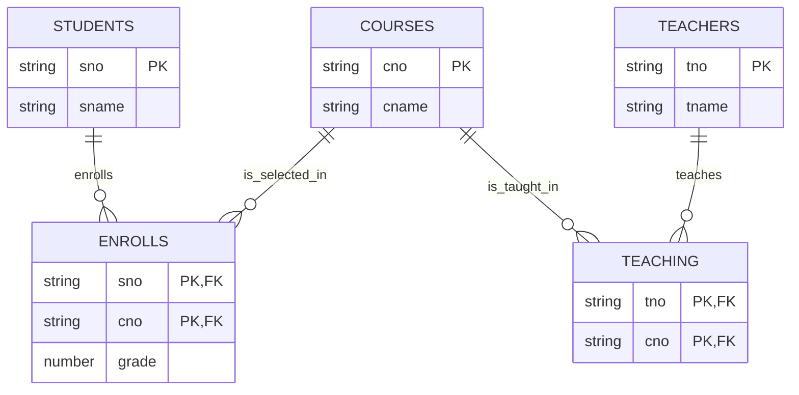
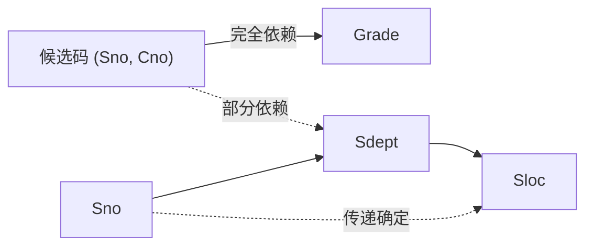
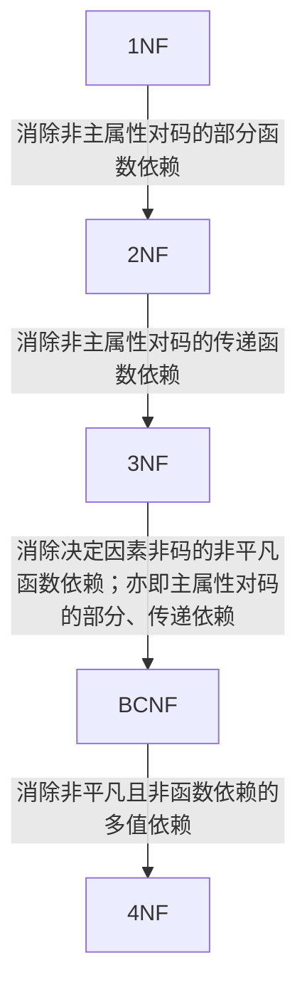
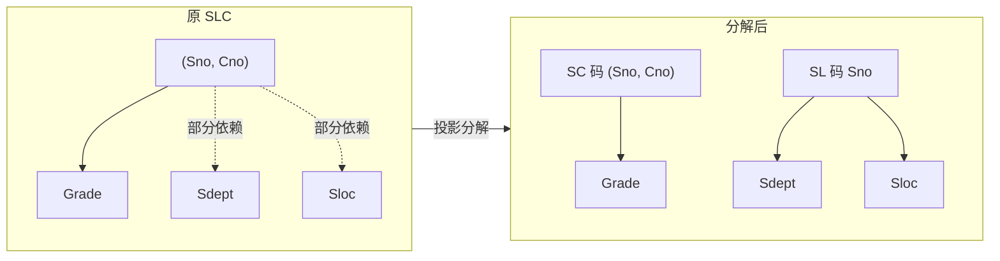
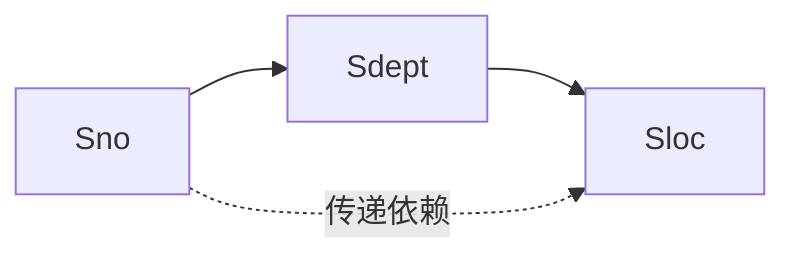
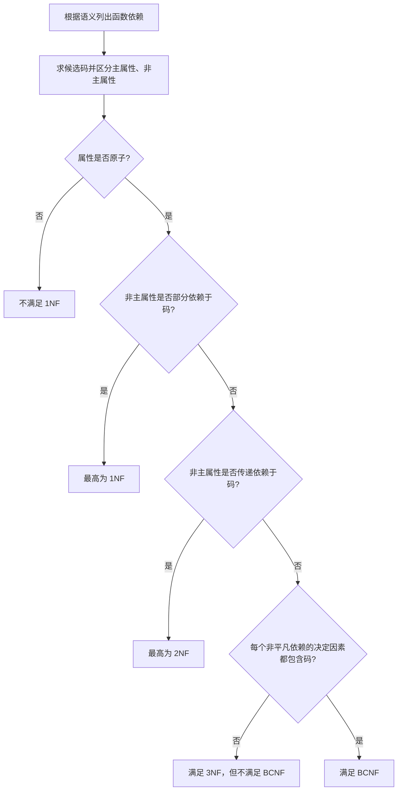
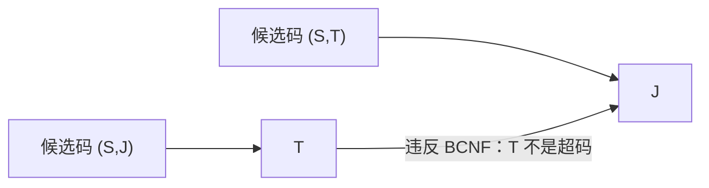
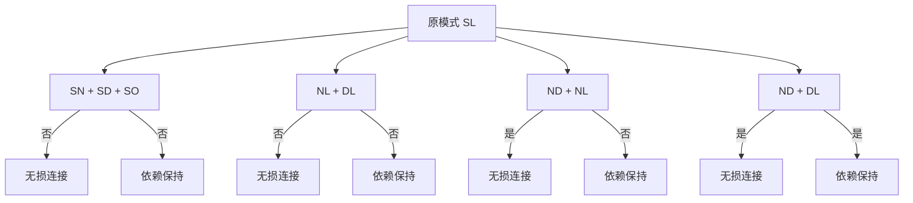
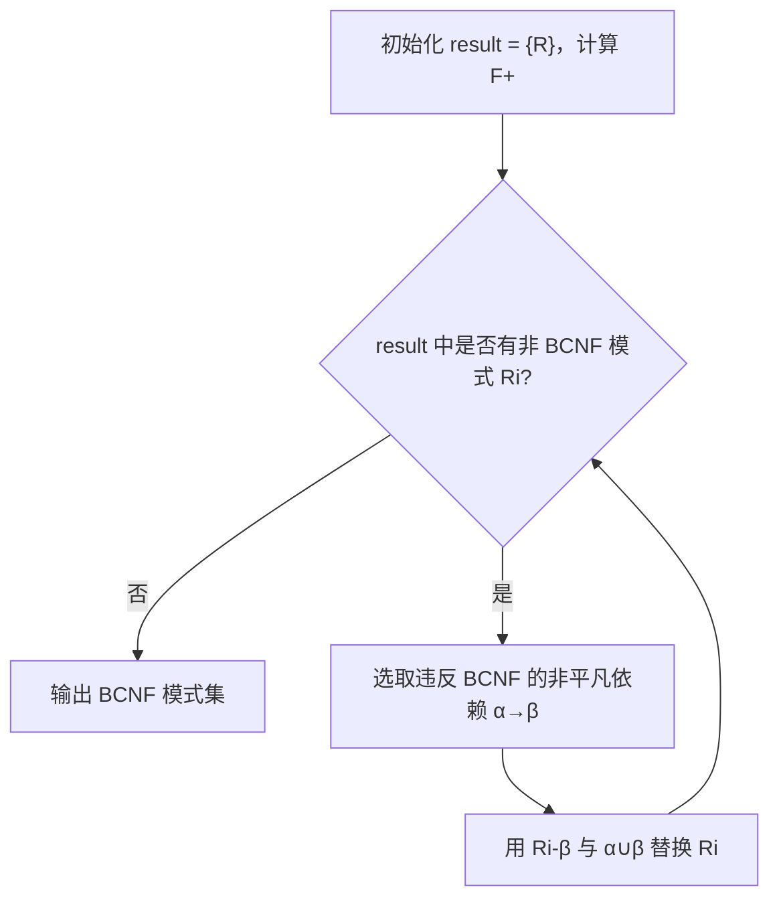

# 4.1 关系数据理论

> 本笔记依据两份“关系数据理论”课件整理，围绕函数依赖、码、1NF～BCNF、规范化与模式分解建立完整知识链。课件中的 E-R 图、函数依赖图和规范化步骤均已转写为 Mermaid 或原生表格，并保留全部例题、练习与分解算法。

## 主要内容

- 关系模式质量与更新异常
- 函数依赖、完全依赖、部分依赖和传递依赖
- 候选码、主码、主属性与全码
- 1NF、2NF、3NF、BCNF 及规范化步骤
- 无损连接与函数依赖保持
- 函数依赖闭包和 BCNF 分解算法
- 课件例题、课堂练习与作业

课件原章目录列为“问题的提出、规范化、数据依赖的公理系统、模式的分解、小结”。本批两份课件没有单独展开“数据依赖的公理系统”，只在模式分解部分给出函数依赖闭包及其使用；本笔记据现有页面完整整理，不凭空补写缺失课页。

## 一、问题的提出

### 1. 关系模式的评价

关系数据库设计的核心是**关系模式设计**：从数量众多且相互关联的数据中，构造一组既能较好反映现实世界、又有良好操作性能的关系模式。评价一个关系模式，重点考察数据冗余以及插入、删除、修改时是否出现异常。

**例：教学管理数据的三种组织方式。**

1. 解法一：把所有信息放进一个关系：  
   $SCT(\underline{Sno,Cno,Tno},Sname,Grade,Cname,Tname)$。这种设计冗余度高，修改困难，存在插入异常和删除异常；根源是属性之间的数据依赖过强。
2. 解法二：分成 $Students(\underline{Sno},Sname)$、$Courses(\underline{Cno,Tno},Cname)$、$Teachers(\underline{Tno,Cno},Tname)$、$Enrolls(\underline{Sno,Cno},Grade)$。该方案仍把教师与课程的联系嵌入双方的复合码中。
3. 解法三：分成 $Students(\underline{Sno},Sname)$、$Courses(\underline{Cno},Cname)$、$Teachers(\underline{Tno},Tname)$、$Enrolls(\underline{Sno,Cno},Grade)$、$Teaching(\underline{Tno,Cno})$。实体和联系各自单一，课件指出冗余、修改困难、插入问题和删除问题均已消除。

原课件 E-R 图表示：学生与课程之间是 $M:N$ 的 `enrolls` 联系，联系属性为 `grade`；课程与教师之间是 $M:N$ 的 `teach` 联系。关系化后可重建如下：



图中两个桥接实体分别承接原 E-R 图中的两个多对多联系；`grade` 是选课联系的属性，而不是学生或课程自身的属性。

### 2. 关系数据理论的目标

1. 判断关系模式 $R$ 是否是“好”模式。
2. 若 $R$ 不是好模式，将其分解为 $\{R_1,R_2,\ldots,R_n\}$，使各子模式质量更好，并尽可能保证无损连接和依赖保持。
3. 理论依据包括数据依赖（函数依赖、多值依赖）、范式与规范化理论，其目的在于消除不合适的数据依赖，解决更新异常与数据冗余。

---

## 二、关系模式与数据依赖

### 1. 关系模式的形式化定义

> 关系模式可表示为五元组 $R(U,D,DOM,F)$：$R$ 是关系名，$U$ 是属性名集合，$D$ 是属性所来自的域，$DOM$ 是属性到域的映射集合，$F$ 是属性间数据依赖的集合。研究规范化时通常简化为 $R(U,F)$。

客观世界中的联系包括实体之间的联系（由数据模型描述）和实体内部属性之间的联系（数据依赖）。属性之间可以表现为 $1:1$、$1:N$、$M:N$；常见数据依赖类型是**函数依赖**和**多值依赖**。

### 2. 函数依赖

> **定义 6.1**：设 $R(U)$ 是属性集 $U$ 上的关系模式，$X,Y\subseteq U$。若对于 $R(U)$ 的任意可能关系 $r$，不存在两个元组在 $X$ 上取值相等而在 $Y$ 上取值不等，则称 $X$ 函数确定 $Y$，或 $Y$ 函数依赖于 $X$，记作 $X\to Y$。

- $X$ 称为决定属性组或决定因素（determinant）。
- 若 $X\to Y$ 且 $Y\to X$，记作 $X\leftrightarrow Y$。
- 若 $Y$ 不函数依赖于 $X$，记作 $X\nrightarrow Y$。
- 函数依赖必须由关系的现实语义确定，并要求所有合法关系实例满足；数据库设计者也可以对现实世界作强制规定。例如 $R(\underline{Sno},Sname,Sdept,Sage)$ 中通常规定 $Sno\to Sname,Sdept,Sage$。

### 3. 平凡与非平凡函数依赖

> 在 $R(U)$ 中，若 $X\to Y$ 且 $Y\nsubseteq X$，称为**非平凡函数依赖**；若 $X\to Y$ 且 $Y\subseteq X$，称为**平凡函数依赖**。

**例**：在 $SC(Sno,Cno,Grade)$ 中，$(Sno,Cno)\to Grade$ 是非平凡依赖；$(Sno,Cno)\to Sno$ 和 $(Sno,Cno)\to Cno$ 是平凡依赖。

### 4. 根据属性联系确定依赖

| 语义联系 | 可推出的函数依赖 |
|---|---|
| $1:1$ | $X\to Y$ 且 $Y\to X$，即 $X\leftrightarrow Y$ |
| $1:M$ | 多方能确定一方。例如“班主任：学生”为 $1:M$，故学生 $\to$ 班主任，而班主任 $\nrightarrow$ 学生 |
| $M:N$ | 单独的 $X$ 与 $Y$ 之间通常不存在函数依赖 |

### 5. 完全、部分与传递函数依赖

> **定义 6.2**：若 $X\to Y$，且对 $X$ 的任一真子集 $X'\subset X$ 都有 $X'\nrightarrow Y$，则称 $Y$ **完全函数依赖**于 $X$，记作 $X\xrightarrow{F}Y$；否则称 $Y$ **部分函数依赖**于 $X$，记作 $X\xrightarrow{P}Y$。

> **定义 6.3**：在 $R(U)$ 中，若 $X\to Y$、$Y\nsubseteq X$、$Y\nrightarrow X$ 且 $Y\to Z$，则称 $Z$ 传递函数依赖于 $X$。若 $Y\to X$ 也成立，即 $X\leftrightarrow Y$，则 $Z$ 是直接依赖于 $X$，不称为这里的传递依赖。

**思考**：平凡依赖看的是 $Y$ 是否包含于 $X$；部分依赖看的是复合决定因素中是否存在真子集仍能决定 $Y$。二者判断对象和含义不同。

### 6. 学生关系示例与依赖图

设 $Student(U,F)$：

$$
U=\{Sno,Sdept,Sloc,Cno,Grade\}
$$

$$
F=\{Sno\to Sdept,\ Sdept\to Sloc,\ (Sno,Cno)\to Grade\}
$$

其中 $(Sno,Cno)\xrightarrow{F}Grade$；由于 $Sno\to Sdept$ 且 $Sno\subset(Sno,Cno)$，故 $(Sno,Cno)\xrightarrow{P}Sdept$；又由 $Sno\to Sdept\to Sloc$ 得到 $Sloc$ 对 $Sno$ 的传递依赖。



可把原模式分成：$S(Sno,Sdept)$、$SC(Sno,Cno,Grade)$、$DEPT(Sdept,Sloc)$。

教学管理关系 $SCT(Sno,Cno,Tno,Sname,Grade,Cname,Tname)$ 的依赖为：

$$
F=\{Sno\to Sname,\ Cno\to Cname,\ Tno\to Tname,\ (Sno,Cno)\to Grade,\ (Sno,Cno)\to Tno\}
$$

---

## 三、码与范式

### 1. 码的概念

> **候选码**：设 $K$ 是 $R(U,F)$ 中的属性或属性组合，若 $K\xrightarrow{F}U$，即 $K$ 能完全函数确定 $U$，则 $K$ 是候选码。候选码有多个时，选定一个作为主码。

- 包含在任一候选码中的属性称为**主属性**。
- 不包含在任何候选码中的属性称为**非主属性**或非码属性。
- 若整个属性组才构成码，则称为**全码（All-key）**。

**例 2**：$S(\underline{Sno},Sdept,Sage)$ 的码是 $Sno$；$SC(\underline{Sno,Cno},Grade)$ 的码是 $(Sno,Cno)$。

**例 3**：$R(P,W,A)$ 中 $P$ 为演奏者、$W$ 为作品、$A$ 为听众。演奏者可演奏多部作品，作品可由多人演奏，听众可欣赏不同演奏者的不同作品，因此码是 $(P,W,A)$，即全码。

### 2. 范式体系

范式是符合某一级别要求的关系模式的集合。Codd 于 1971～1972 年提出 1NF、2NF、3NF，Codd 与 Boyce 于 1974 年提出 BCNF，Fagin 于 1976 年提出 4NF，之后又出现 5NF。

$$
1NF\supset 2NF\supset 3NF\supset BCNF\supset 4NF\supset 5NF
$$

把低一级范式分解为若干高一级范式的过程称为**规范化**。



课件只在目录和规范化小结中点出多值依赖与 4NF，未进一步展开正式定义；其定位如上图所示。

---

## 四、1NF 与 2NF

### 1. 第一范式

> 若关系模式 $R$ 的所有属性都是不可分的基本数据项，则 $R\in1NF$。

1NF 是关系数据库的最低要求，但满足 1NF 不代表模式质量良好。

### 2. 2NF 的定义

> **定义 6.6**：若 $R\in1NF$，且每一个非主属性都完全函数依赖于每一个候选码，则 $R\in2NF$。

**例 4**：$SLC(\underline{Sno,Cno},Sdept,Sloc,Grade)$ 的依赖为：

$$
(Sno,Cno)\xrightarrow{F}Grade,quad Sno\to Sdept,quad Sno\to Sloc,quad Sdept\to Sloc
$$

因此 $(Sno,Cno)\xrightarrow{P}Sdept$，$(Sno,Cno)\xrightarrow{P}Sloc$。该模式属于 1NF，但不属于 2NF，会产生：

1. 插入异常：学生尚未选课时无法仅插入学生信息。
2. 删除异常：删除学生唯一一条选课记录会同时丢失学生信息。
3. 数据冗余：学生选修 $k$ 门课时，$Sdept$、$Sloc$ 重复存储 $k$ 次。

消除部分依赖的投影分解为：

$$
SC(\underline{Sno,Cno},Grade),\qquad SL(\underline{Sno},Sdept,Sloc)
$$



分解后非主属性对码都是完全依赖，$SC,SL\in2NF$。不过，把 1NF 分成多个 2NF 只能在一定程度上减轻插入、删除、修改异常和冗余，不能保证完全消除。

---

## 五、3NF

### 1. 定义与判定

> **定义 6.7**：关系模式 $R(U,F)$ 中，不存在候选码 $X$、属性组 $Y$ 和非主属性 $Z$，使 $X\to Y$、$Y\to Z$、$Y\nrightarrow X$ 成立，则 $R\in3NF$。等价地，3NF 中每个非主属性既不部分依赖于码，也不传递依赖于码。

### 2. S-L 模式的传递依赖

$SL(\underline{Sno},Sdept,Sloc)$ 已是 2NF，但有 $Sno\to Sdept$、$Sdept\to Sloc$，故 $Sno\to Sloc$ 是传递依赖。若一个系更换宿舍楼，需要修改该系全部学生记录。



分解为 $SD(\underline{Sno},Sdept)$ 和 $DL(\underline{Sdept},Sloc)$ 后，两个模式均为 3NF，原传递依赖被消除。

### 3. 范式判断流程



### 4. 课堂练习

1. $W(工号,姓名,工种,定额)$，每个工种有一个定额。  
   应根据语义列出 $工号\to 姓名,工种$ 与 $工种\to 定额$，再分析传递依赖并分解。
2. $R(材料号,材料名,生产厂)$ 的示例数据：

| 材料号 | 材料名 | 生产厂 |
|---|---|---|
| M1 | 线材 | 武汉 |
| M2 | 型材 | 武汉 |
| M3 | 板材 | 广东 |
| M4 | 型材 | 武汉 |

需结合业务语义判断“材料名是否唯一决定生产厂”，不能仅凭当前实例臆断函数依赖。

### 5. 商业集团练习及答案

关系 $R(商店编号,商品编号,商品库存数量,部门编号,负责人)$ 满足：每店每种商品只在一个部门销售；每店每部门只有一个负责人；每店每种商品只有一个库存量。

$$
\begin{aligned}
(商店编号,商品编号)&\to 部门编号\\
(商店编号,部门编号)&\to 负责人\\
(商店编号,商品编号)&\to 商品库存数量
\end{aligned}
$$

主码为 $(商店编号,商品编号)$。非主属性不存在对码的部分依赖，因此属于 2NF；但负责人经由部门编号传递依赖于码，所以不属于 3NF，可能出现负责人冗余及更新、插入、删除异常。分解为：

- $R_1(商店编号,商品编号,商品库存数量,部门编号)$
- $R_2(商店编号,部门编号,负责人)$

---

## 六、BCNF

### 1. 定义与性质

> **定义 6.8**：若 $R(U,F)\in1NF$，且每个非平凡函数依赖 $X\to Y$ 的决定因素 $X$ 都包含候选码，则 $R\in BCNF$。简言之：**每一个决定因素都是超码**。

BCNF 消除了任何属性（包括主属性）对码的部分依赖和传递依赖。若 $R\in BCNF$，则：

1. 所有非主属性对每个码都是完全函数依赖。
2. 所有主属性对每个不包含它的码也是完全函数依赖。
3. 没有属性完全函数依赖于任何不含码的属性组。

$BCNF\Rightarrow3NF$，反向一般不成立；课件指出当关系只有一个候选码时，两者的差异通常不再由“主属性间依赖”引起。

### 2. 例 5～例 8

- **例 5**：$C(Cno,Cname,Pcno)$，课件结论为 $C\in3NF$ 且 $C\in BCNF$。
- **例 6**：$S(Sno,Sname,Sdept,Sage)$，假定候选码为 $Sno$ 和 $Sname$，课件结论为 $S\in3NF$ 且 $S\in BCNF$。
- **例 7**：$SJP(S,J,P)$，$S$ 为学生、$J$ 为课程、$P$ 为名次；有 $(S,J)\to P$、$(J,P)\to S$，候选码为 $(S,J)$ 和 $(J,P)$，故 $SJP\in BCNF$，自然也属于 3NF。
- **例 8**：$STJ(S,T,J)$，$S$ 为学生、$T$ 为教师、$J$ 为课程；有 $(S,J)\to T$、$T\to J$，候选码为 $(S,J)$ 和 $(S,T)$。所有属性都是主属性，所以不存在非主属性的部分或传递依赖，$STJ\in3NF$；但 $T\to J$ 的决定因素 $T$ 不含候选码，故 $STJ\notin BCNF$（MinerU 原文此处漏掉“不”字，已据定义和原页语义校正）。



将其分解为 $ST(S,T)$ 和 $TJ(T,J)$，两者均为 BCNF。

---

## 七、规范化小结

### 1. 基本思想

关系数据库规范化理论是数据库逻辑设计的工具，目标是尽量消除插入、删除异常、修改复杂和数据冗余。其基本思想是逐步消除数据依赖中不合适的部分，实质是**概念单一化**。

> 规范化程度并非越高越好。设计者还必须分析现实语义和应用需求，选择合适模式；规范化过程可在任何合适阶段停止。

### 2. 各范式对比

| 范式 | 核心条件 | 主要消除的问题 |
|---|---|---|
| 1NF | 属性值不可再分 | 保证关系模型基本结构 |
| 2NF | 非主属性完全依赖于码 | 非主属性对码的部分依赖 |
| 3NF | 非主属性不部分、也不传递依赖于码 | 非主属性的传递依赖 |
| BCNF | 每个非平凡依赖的决定因素均为超码 | 包括主属性在内的不适当函数依赖 |
| 4NF | 消除非平凡且非函数依赖的多值依赖 | 多值依赖导致的冗余 |

---

## 八、模式分解

### 1. 分解的定义与等价标准

> **定义 6.16**：关系模式 $R(U,F)$ 的一个分解为 $\rho=\{R_1(U_1,F_1),R_2(U_2,F_2),\ldots,R_n(U_n,F_n)\}$，其中 $U=\bigcup_{i=1}^{n}U_i$，不存在 $U_i\subseteq U_j$，$F_i$ 是 $F$ 在 $U_i$ 上的投影。

分解方法不唯一。课件给出三类等价要求：具有无损连接性、保持函数依赖、同时满足二者。

### 2. SL 的原始关系

$SL(Sno,Sdept,Sloc)$，$F=\{Sno\to Sdept,Sdept\to Sloc,Sno\to Sloc\}$，属于 2NF，但有插入、删除、修改异常和冗余。

| Sno | Sdept | Sloc |
|---|---|---|
| 95001 | CS | A |
| 95002 | IS | B |
| 95003 | MA | C |
| 95004 | IS | B |
| 95005 | PH | B |

### 3. 四种分解比较

1. $SN(Sno)$、$SD(Sdept)$、$SO(Sloc)$：  
   三个单属性关系完全丢失学生、系和宿舍之间的对应关系，无法查询 95001 所在系或宿舍；既不无损，也不保持依赖。
2. $NL(Sno,Sloc)$、$DL(Sdept,Sloc)$：  
   自然连接通过共享的 $Sloc$ 组合。由于宿舍 B 对应 IS、PH 两个系，会产生 95002、95004、95005 与两个系的错误组合，连接结果比原关系多 3 个元组，信息失真；也未保持全部依赖。

| Sno | Sloc | Sdept（错误连接结果） |
|---|---|---|
| 95001 | A | CS |
| 95002 | B | IS |
| 95002 | B | PH |
| 95003 | C | MA |
| 95004 | B | IS |
| 95004 | B | PH |
| 95005 | B | IS |
| 95005 | B | PH |

3. $ND(Sno,Sdept)$、$NL(Sno,Sloc)$：  
   通过 $Sno$ 自然连接可恢复原关系，具有无损连接性；但 $Sdept\to Sloc$ 没有投影到任一子模式中，故不保持函数依赖，插入、删除异常仍可能存在。课件重建表中 95004 一行曾 OCR 为 `CS/A`，依据原始 $SL$ 与“连接结果一样”的结论，应为 `IS/B`。
4. $ND(Sno,Sdept)$、$DL(Sdept,Sloc)$：  
   连接属性 $Sdept$ 能决定 $DL$，既无损连接，又保留 $Sno\to Sdept$ 与 $Sdept\to Sloc$，是等价分解。



### 4. 无损连接性

> 若 $R$ 与 $R_1\Join R_2\Join\cdots\Join R_n$ 相等，则分解 $\rho$ 具有**无损连接性（lossless join）**。无损连接保证不丢失信息，但不必然消除异常和冗余。

对二元分解 $R_1,R_2$，若 $F^+$ 中至少包含以下依赖之一，则分解无损：

$$
(R_1\cap R_2)\to R_1
\quad\text{或}\quad
(R_1\cap R_2)\to R_2
$$

应用于 $SL$：

- $ND(Sno,Sdept)$ 与 $NL(Sno,Sloc)$ 的交集是 $Sno$，且 $Sno\to ND,NL$，无损。
- $ND(Sno,Sdept)$ 与 $DL(Sdept,Sloc)$ 的交集是 $Sdept$，且 $Sdept\to DL$，无损。
- $NL(Sno,Sloc)$ 与 $DL(Sdept,Sloc)$ 的交集是 $Sloc$，$Sloc$ 不能决定任一完整子模式，非无损。

### 5. 保持函数依赖

> 若 $F$ 所逻辑蕴含的依赖也能由各子模式投影依赖 $F_i$ 的并集逻辑蕴含，则称分解**保持函数依赖（dependency preserving）**。

保持依赖意味着检查约束时不必连接多个子关系，通常能减轻或解决异常。无损连接与依赖保持是相互独立的标准。

### 6. 函数依赖闭包

> **定义 6.12**：在 $R(U,F)$ 中，所有由 $F$ 逻辑蕴含的函数依赖构成 $F$ 的闭包，记作 $F^+$。

**例**：$SL$ 中 $F=\{Sno\to Sdept,Sdept\to Sloc\}$，由传递性可推出 $Sno\to Sloc$；$F^+$ 还包含由反身性、增广性和传递性得到的全部依赖。

---

## 九、BCNF 分解算法

### 1. 无损分解算法

```text
result := {R}
done := false
计算 F+
while result 中存在不属于 BCNF 的模式 Ri do
    选择 Ri 上违反 BCNF 的非平凡依赖 α → β，并令 α ∩ β = ∅
    result := (result - {Ri}) ∪ {Ri - β} ∪ {α ∪ β}
end while
```

等价地，每次把 $R_i$ 分为 $R_i-\beta$ 与 $\alpha\cup\beta$。该步骤以共同属性 $\alpha$ 连接，而 $\alpha\to\beta$，故保证无损；不断执行直至各子模式均为 BCNF。



### 2. Lending-scheme 分解

原模式：

$$
LendingScheme(branchName,branchCity,assets,customerName,loanNumber,amount)
$$

依赖与候选码：

$$
branchName\to assets,branchCity
$$

$$
loanNumber\to amount,branchName
$$

候选码是 $\{loanNumber,customerName\}$。

1. 按 $branchName\to assets,branchCity$ 分成：  
   $BranchSchema(branchName,branchCity,assets)$ 与 $LoanInfoSchema(branchName,customerName,loanNumber,amount)$。
2. 再按 $loanNumber\to amount,branchName$ 分成：  
   $LoanSchema(loanNumber,amount,branchName)$ 与 $BorrowerSchema(customerName,loanNumber)$。
3. 最终三个模式均为 BCNF，且课件要求继续检验依赖保持；本例原两条函数依赖分别完整保留在 `BranchSchema` 与 `LoanSchema` 中。

### 3. BCNF 不一定保持依赖

$BankerSchema(branchName,customerName,bankerName)$ 的语义是：一个客户在某一分行有一个银行账户负责人。

$$
bankerName\to branchName
$$

$$
(branchName,customerName)\to bankerName
$$

BCNF 分解为 $BankerBranch(bankerName,branchName)$ 与 $CustomerBanker(customerName,bankerName)$。该分解无损，但原依赖 $(branchName,customerName)\to bankerName$ 无法在单个子模式中直接检查，因而不保持依赖；原模式属于 3NF。

> 若只要求无损连接，分解总能达到 BCNF；若同时要求无损连接与依赖保持，分解一定能达到 3NF，但不一定达到 BCNF。实践中通常倾向于选择保持依赖的 3NF。

---

## 十、综合课堂练习

### 1. Teaching 模式

$Teaching(Course,Teacher,Time,Room,Student,Grade)$，函数依赖为：

$$
\begin{aligned}
Course&\to Teacher\\
(Time,Room)&\to Course\\
(Time,Teacher)&\to Room\\
(Time,Student)&\to Room\\
(Course,Student)&\to Grade
\end{aligned}
$$

课件答案：候选码为 $(Time,Student)$，原模式既不是 BCNF，也不是 3NF。一种 BCNF 分解为：

- $(Course,Teacher)$
- $(Course,Student,Grade)$
- $(Time,Room,Course)$
- $(Time,Room,Student)$

该分解不保持 $(Time,Teacher)\to Room$，且分解答案不唯一。

### 2. 作业

- 教材第六章习题 2。
- 课件要求文件命名：`作业_函数依赖_学号_姓名.docx/pdf`。

---

## 本章小结

| 主题 | 核心结论 |
|---|---|
| 函数依赖 | 由现实语义决定，描述属性值之间的确定关系 |
| 2NF | 消除非主属性对复合码的部分依赖 |
| 3NF | 继续消除非主属性对码的传递依赖 |
| BCNF | 每个决定因素都必须是超码，约束强于 3NF |
| 无损连接 | 分解后自然连接能精确恢复原关系 |
| 依赖保持 | 原依赖可由子模式中的依赖独立检查 |
| 分解取舍 | BCNF 可保证无损但可能不保持依赖；无损且依赖保持至少可达 3NF |

## 图片转写审计

| 来源 | 原图片引用 | 核查结果 | 笔记承接位置 |
|---|---:|---|---|
| 关系数据理论（1） | `49f041...936f7.jpg`（首次，原 PPTX 第 3 页） | 教学管理 E-R 图：学生—选课—课程、课程—授课—教师，两个联系均为 $M:N$，选课含成绩属性 | “一、问题的提出”中的 `erDiagram` 与文字解读 |
| 关系数据理论（1） | `49f041...936f7.jpg`（重复引用，原 PPTX 第 21 页） | 与首次引用为同一 E-R 图；第二处用于提出 SCT 函数依赖问题 | 同一 E-R 重建图，以及“学生关系示例与依赖图”中的 SCT 依赖全集 |
| 关系数据理论（2） | 0 幅 | `full.md` 无图片引用；规范化步骤原为文本排版图 | “范式体系”的规范化 Mermaid 流程图 |

已核查本组课件全部 **2 个 Markdown 图片引用（1 个唯一图像，引用 2 次）**，并对照原 PPTX 页面确认节点、联系、基数和属性；本笔记不残留 MinerU 图片链接。
