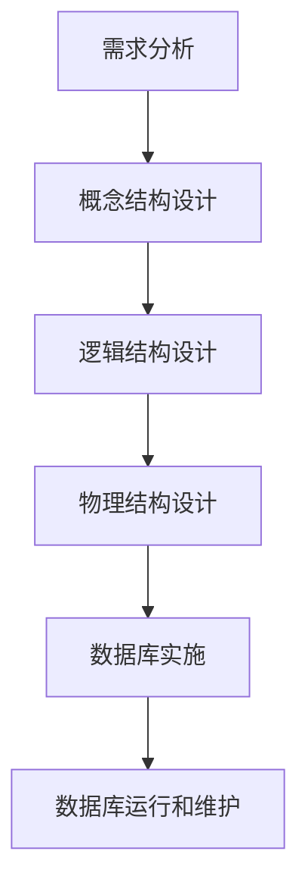
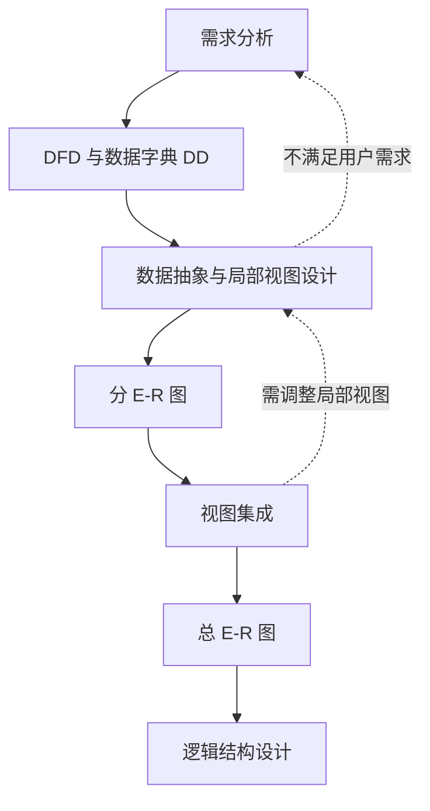
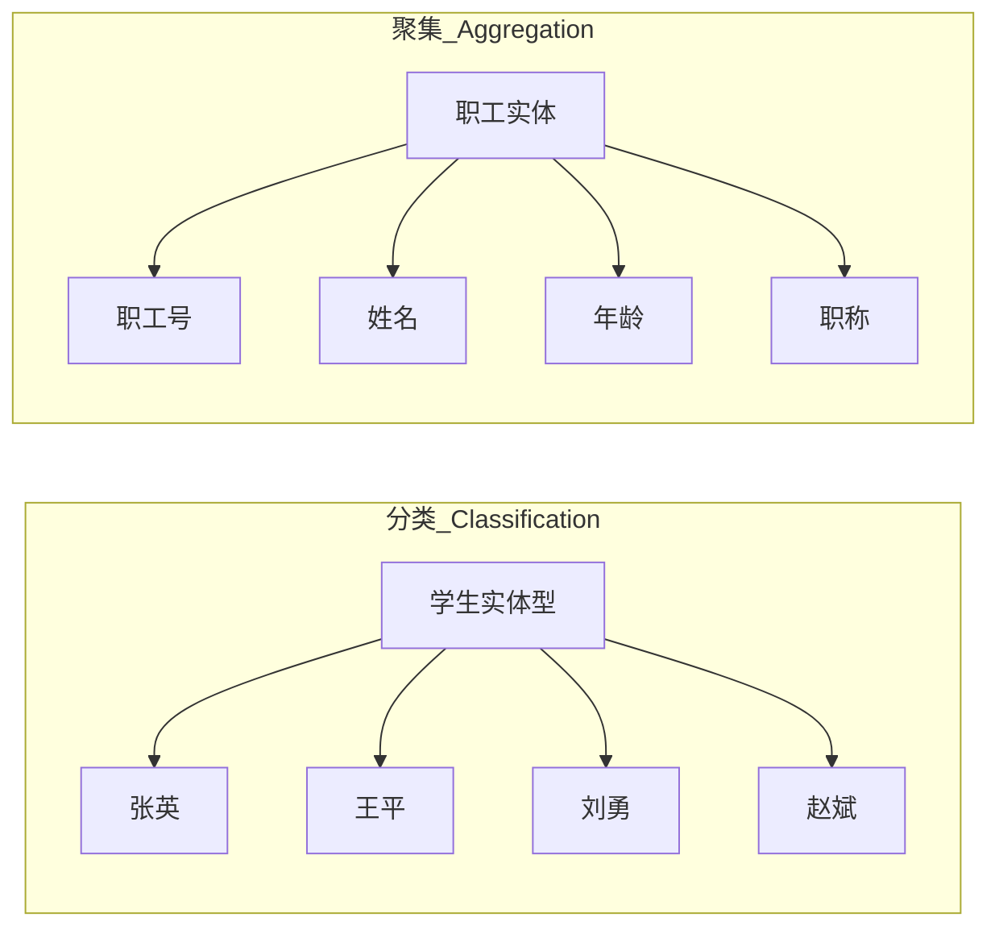
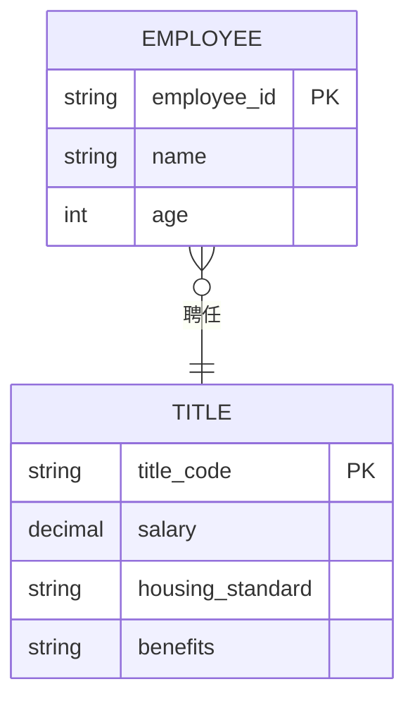
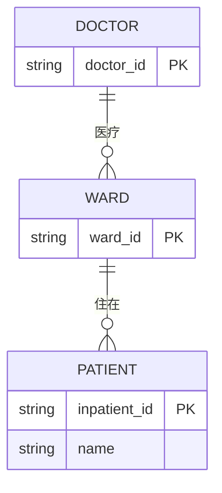
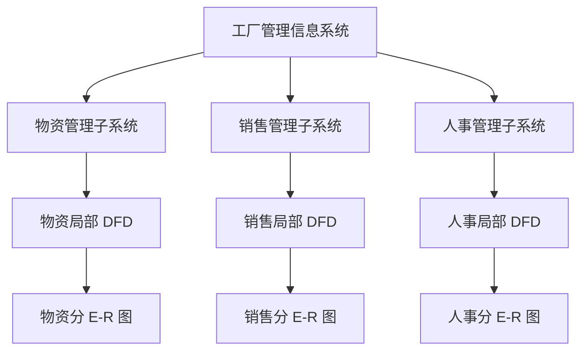
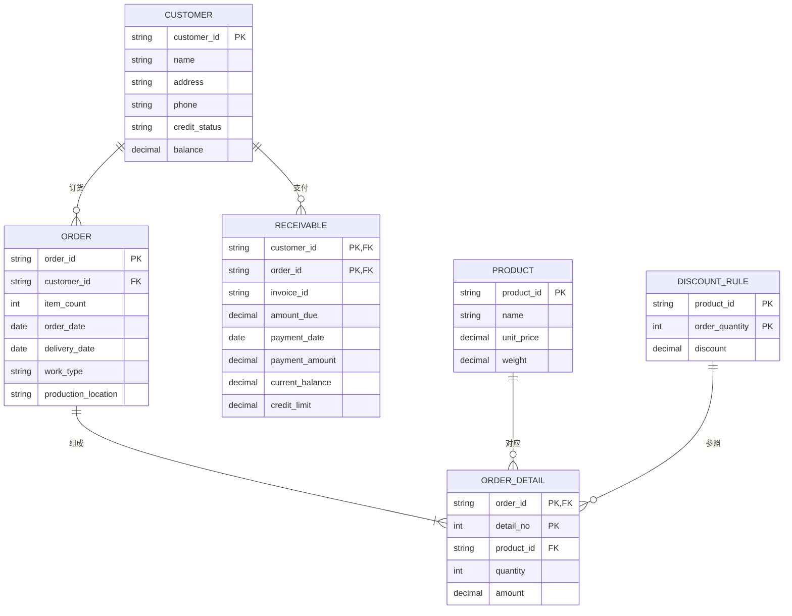
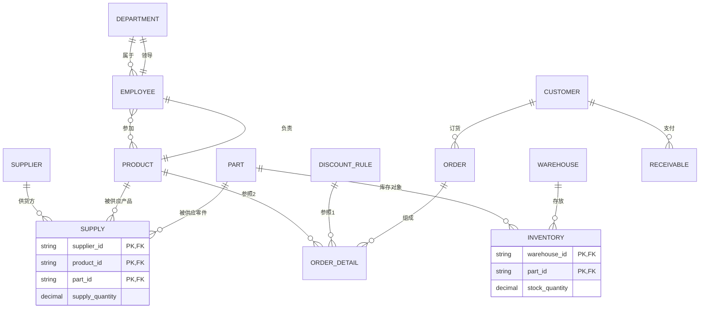
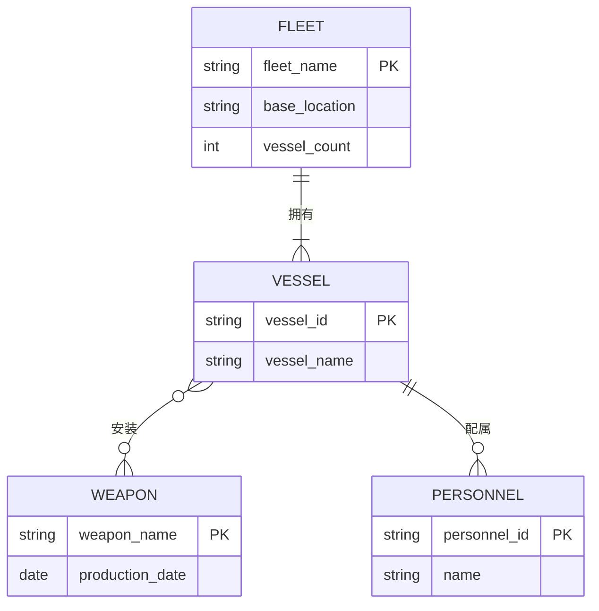
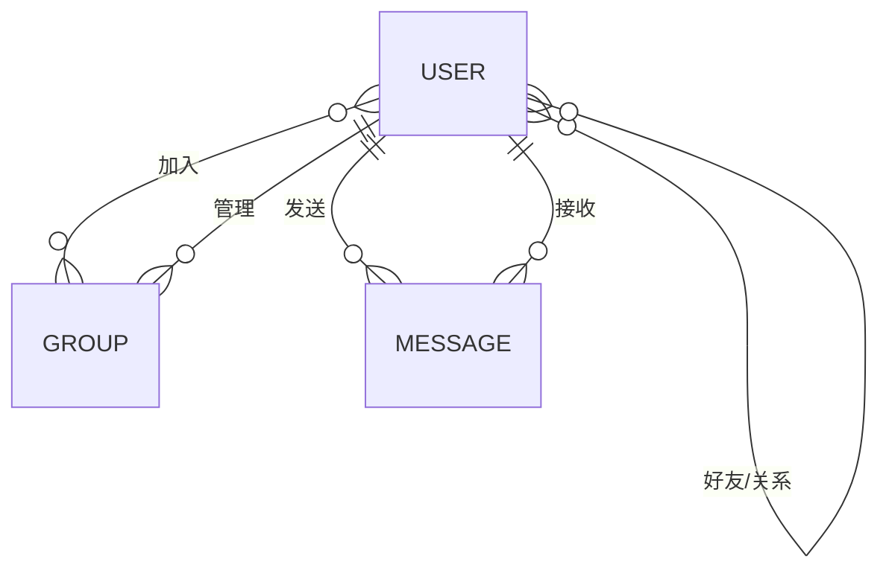

# 5.1 数据库设计

> 本笔记整理自第 7 章“数据库设计”课件，重点说明数据库设计流程、概念结构设计、局部 E-R 图集成及 E-R 图到关系模式的转换。课件中的流程图、数据抽象图和 E-R 图均已重绘或转写，不依赖原始图片即可复习。

## 主要内容

- 数据库设计的目标和六个阶段
- 概念结构及自底向上的设计策略
- 分类、聚集与实体/属性判定
- 局部 E-R 图设计和视图集成
- 冲突、冗余的识别与消除
- E-R 图向关系模式的转换规则
- 工厂、舰队和 QQ 系统设计实例

---

## 一、数据库设计概述

### 1. 定义与目标

> **数据库设计**：针对给定应用环境，构造优化的数据库逻辑模式和物理结构，并据此建立数据库及应用系统，使其能有效存储、管理数据，满足信息管理与数据操作需求。

设计结果不仅是若干数据表，还包括概念结构、逻辑模式、物理结构，以及能够使用这些结构的应用系统。

### 2. 六个阶段

1. 需求分析：  
   调查用户的信息需求、处理需求、安全性和完整性要求，形成数据流图 DFD、数据字典 DD 等成果。
2. 概念结构设计：  
   将需求抽象为独立于具体机器和 DBMS 的概念模型，通常使用 E-R 模型。
3. 逻辑结构设计：  
   把概念模型转换成目标 DBMS 支持的关系、网状或层次模型。
4. 物理结构设计：  
   选择存储结构、存取路径和其他与性能有关的物理方案。
5. 数据库实施：  
   定义模式、装载数据、编制和调试应用程序。
6. 运行和维护：  
   监控、备份、恢复、性能调整，并根据新需求修改系统。

需求分析和概念设计基本独立于具体 DBMS；逻辑设计和物理设计则与目标 DBMS 密切相关。

---

## 二、概念结构设计

### 1. 概念结构

> **概念结构设计**：把需求分析得到的用户需求抽象为信息结构，即概念模型。它是各种数据模型的共同基础，也是数据库设计的关键环节。

良好的概念结构应：真实、充分反映现实世界；易于用户理解；易于修改；易于转换为关系、网状、层次等数据模型。主要描述工具是 E-R 模型。

### 2. 设计策略

常用策略是“自顶向下做需求分析，自底向上设计概念结构”。自底向上的概念设计包含两步：

> **流程图解读**：需求分析为局部视图提供 DFD、DD；每个局部应用先产生分 E-R 图，再经视图集成得到全局概念结构。用户反馈可能使设计返回前面的分析或局部设计阶段。

---

## 三、数据抽象

### 1. 抽象任务

抽象是从现实中的人、物、事和概念提取共同特性，忽略非本质细节，并用概念精确描述。概念结构就是对现实世界的抽象。设计者需要：

1. 从数据字典抽取局部应用涉及的数据。
2. 结合数据流图确定实体、属性和标识实体的码。
3. 确定实体间的联系及其 `1:1`、`1:N`、`M:N` 类型。

### 2. 分类与聚集

- **分类**：定义某一类概念作为一组对象的类型，表达对象与类型之间的 `is member of`。
- **聚集**：定义对象类型的组成成分，表达成分与整体之间的 `is part of`。

### 3. 实体与属性的判定

- 一组具有共同特性和行为的对象可抽象为实体，如张三、李四等对象抽象成“学生”。
- 对象的组成成分可抽象为属性，如学生的学号、姓名、专业、年级，学号可作为码。
- 实体与属性具有相对性：同一概念在一个系统中是属性，在另一个系统中可能需要成为实体。

判定原则：

1. 属性不应再具有需要描述的内部性质，即应是不可分数据项。
2. 属性不能与其他实体发生联系，因为联系只发生在实体间。
3. 在不损失语义的前提下，能够作为属性的现实事物尽量作为属性，以简化 E-R 图。

**职称例**：若只记录文字职称，可把职称作为职工属性；若还需记录职称代码、工资、住房标准、附加福利，并表达“职工—聘任—职称”的关系，则应把职称提升为实体。

**病房例**：若“病房号”只是病人的标识信息，可作病人属性；若还要表示病人与病房的“住在”联系、病房与医生的“医疗”联系，则病房必须建成实体。

---

## 四、局部 E-R 图设计

### 1. 选择局部应用

应从多层数据流图中选择合适层次作为分 E-R 图的起点，通常采用中层 DFD。每个局部应用形成一个局部视图，之后再集成。

### 2. 销售管理子系统

主要功能：处理顾客和销售员送来的订单；根据订货安排生产；交货时开票；收到付款后，依据发票存根和信贷情况处理应收账款。

最初框架包含：顾客订货形成订单，顾客支付应收账款，订单与产品发生明细联系。进一步分析后应把“订单细节”提升为实体，因为一个订单含多条明细，每条明细对应一种产品；折扣规则也与订单明细关联。

> **E-R 图解读**：顾客与订单、应收账款均为 `1:N`；订单与订单细节为 `1:N`；产品、折扣规则分别可被多条订单细节引用。订单细节通过复合码“订单号 + 细则号”唯一标识。

---

## 五、视图集成

### 1. 集成过程

分 E-R 图之间不可避免存在不一致。合并的关键是合理处理三类冲突：

1. 属性冲突：同一属性的类型、取值范围、单位或约束不同。
2. 命名冲突：同名异义或异名同义。
3. 结构冲突：同一对象在不同视图中被建模成实体/属性，或实体间联系结构不同。

### 2. 工厂系统的冗余消除

物资、销售和劳动人事三个子系统合并时，课件指出：

- “项目”和“产品”异名同义，应统一。
- 库存管理中“职工—仓库—工作”可由人事视图中的部门归属关系导出，可按具体业务判断是否取消。
- “职工之间领导/被领导”可由“部门—经理的领导关系”和“部门—职工的从属关系”导出，因此可删除直接领导联系。

集成后的主要关系可重建为：

> **图片转写说明**：原图还给出了各实体属性。仓库含仓库号、面积、电话；零件含零件号、名称、规格、单价、描述；项目/产品含项目号、预算、开工日期；职工含职工号、姓名、年龄、职称；供应商含供应商号、姓名、地址、电话和账号。三元“供应”联系有供应量属性，“库存”联系有库存量属性，“参加”联系有天数属性。

---

## 六、逻辑结构设计

### 1. 任务与转换链

逻辑结构设计把基本 E-R 图转换为目标 DBMS 支持的数据模型，并确定关系模式的属性和码。

### 2. 联系转换规则

| E-R 联系 | 关系模型转换 |
|---|---|
| `1:1` | 可建立独立关系，也可把联系属性和另一端主码合并到任一端关系 |
| `1:N` | 可建立独立关系；更常见的是把 1 端主码作为外码放到 N 端，并加入联系属性 |
| `M:N` | 必须建立独立关系，包含两端主码及联系属性，两端主码通常组成复合码 |
| 三元及更多元联系 | 建立独立关系，包含各参与实体主码和联系属性；码由业务约束确定 |

**例：选修**是学生与课程的 `M:N` 联系：

`选修(学号, 课程号, 成绩)`，其中“学号 + 课程号”为复合主码。

**例：讲授**是课程、职工、教材之间的三元联系：

`讲授(课程号, 职工号, 书号)`，课件以三者组合为码。

具有相同码的关系模式可合并：把一个模式的属性加入另一个模式，删除同义属性，并调整属性顺序，以减少关系数量。

### 3. 工厂实例的关系模式

- `部门(部门号, 部门名, 经理职工号, …)`：已吸收“领导”联系。
- `职工(职工号, 部门号, 职工名, 职务, …)`：已吸收“属于”联系。
- `产品(产品号, 产品名, 产品组长职工号, …)`。
- `供应商(供应商号, 姓名, …)`。
- `零件(零件号, 零件名, …)`。
- `职工工作(职工号, 产品号, 工作天数, …)`：复合码为“职工号 + 产品号”。
- `供应(产品号, 供应商号, 零件号, 供应量)`：三元联系转成独立关系，前三项组成复合码。

---

## 七、舰队管理实例

### 1. 需求与全局 E-R 图

- 一个舰队拥有多艘舰艇，一艘舰艇只属于一个舰队。
- 一艘舰艇安装多种武器，一种武器可安装于多艘舰艇。
- 一艘舰艇有多个官兵，一个官兵只属于一艘舰艇。

### 2. 转换结果

- `舰队(舰队名称, 基地地点, 舰艇数量)`。
- `舰艇(舰艇编号, 舰艇名称, 舰队名称, 官兵数量)`，舰队名称为外码。
- `官兵(官兵证号, 姓名, 舰艇编号)`，舰艇编号为外码。
- `武器(武器名称, 武器生产时间)`。
- `安装(舰艇编号, 武器名称)`，两项组成复合主码。

---

## 八、练习与作业

### 1. QQ 数据库练习

应至少包含用户、群和聊天记录，并考虑：用户之间的关系、用户间聊天、用户加入群和管理群。

- `用户(qq号, 昵称, …)`。
- `群(群号, 群名称, 管理员qq号, …)`。
- `关系(用户A_qq号, 用户B_qq号, 关系类型, …)`。
- `聊天(发送用户qq号, 接收用户qq号, 发送时间, 消息内容, …)`。
- `加入(用户qq号, 群号, …)`。

### 2. 课程作业

从淘宝、微信或知乎中任选一个简化系统，设计数据库核心模式，包括 E-R 图和关系表。文件命名为：

`作业_数据库设计_学号_姓名.docx` 或 `.pdf`。

---

## 本章小结

| 阶段 | 核心产物 |
|---|---|
| 需求分析 | 用户需求、DFD、数据字典 |
| 概念设计 | 分 E-R 图、基本 E-R 图 |
| 视图集成 | 冲突处理与冗余消除后的全局概念结构 |
| 逻辑设计 | 目标 DBMS 可实现的关系模式及键/外键 |
| 物理设计 | 存储结构、存取路径和性能方案 |
| 实施维护 | 模式创建、数据装载、应用调试、运行优化 |

> **图片核查说明**：源 `full.md` 共 16 个图片引用，对应 12 个唯一图片文件，已逐一核查。设计流程、分类/聚集、实体属性、局部视图、销售/工厂 E-R 图及逻辑转换链已用 Mermaid 或文字重建；最终笔记不依赖 MinerU 图片。
