# 6.1 数据库保护

> 本笔记依据“数据库保护”和“数据库恢复技术”课件整理，覆盖安全性、完整性、事务与并发问题、故障恢复、检查点和数据库镜像。六幅 MinerU 图片及原 PPTX 对应页面均已核查，分别重建为 Mermaid、Markdown 表格或完整文字说明。

## 主要内容

- 数据库安全威胁、用户鉴别与存取控制
- DAC、MAC、GRANT、REVOKE 与数据库角色
- SQL Server 安全体系、用户、权限与角色
- 实体完整性、参照完整性和用户定义完整性
- 事务、ACID 与并发丢失修改
- 故障分类、数据转储、日志与写前日志
- UNDO、REDO、检查点、介质恢复与数据库镜像
- 数据控制与备份恢复实验

## 一、数据库安全性概述

### 1. 安全性问题

数据库的一大特点是数据共享，但共享不能无条件进行。军事秘密、国家机密、新产品实验数据、市场需求分析、营销策略、销售计划、客户档案、医疗档案和银行储蓄数据都需要受控访问。

数据库的不安全因素主要有：

1. 非授权用户对数据库的恶意存取和破坏。
2. 重要或敏感数据泄露。
3. 整体安全环境脆弱。

### 2. 计算机系统的分层安全模型

原图从用户到数据逐层设置安全措施，交互路径为“用户 ↔ DBMS ↔ OS ↔ DB”。

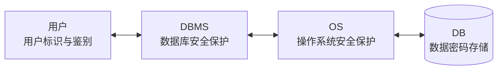

外层先确认用户身份，DBMS 再进行对象与操作级授权，操作系统保护进程和文件，数据库数据还可采用密码存储；任何一层薄弱都可能影响整体安全。

---

## 二、用户鉴别与存取控制

### 1. 用户标识与鉴别

用户标识与鉴别（Identification & Authentication）是系统最外层的安全保护措施。

- 用户标识通常是用户名或用户标识号。
- 系统核对口令以鉴别身份。
- 用户名和口令可能被窃取，可与用户预先约定计算过程或函数，提高鉴别强度。

### 2. 存取控制机制

存取控制由两部分组成：**定义用户权限**与**合法权限检查**。二者共同构成 DBMS 安全子系统。用户权限是“数据对象 + 操作类型”的组合，定义谁能对何对象执行何操作。

| 对象类型 | 对象 | 操作类型 |
|---|---|---|
| 数据库模式 | 模式 | `CREATE SCHEMA` |
| 数据库模式 | 基本表 | `CREATE TABLE`、`ALTER TABLE` |
| 数据库模式 | 视图 | `CREATE VIEW` |
| 数据库模式 | 索引 | `CREATE INDEX` |
| 数据 | 基本表和视图 | `SELECT`、`INSERT`、`UPDATE`、`DELETE`、`REFERENCES`、`ALL PRIVILEGES` |
| 数据 | 属性列 | `SELECT`、`INSERT`、`UPDATE`、`REFERENCES`、`ALL PRIVILEGES` |

数据库权限比文件系统权限更细，可以控制到表、视图、列和具体操作。

### 3. DAC 与 MAC

| 方法 | 级别与特点 | 核心机制 |
|---|---|---|
| 自主存取控制（DAC） | C2 级，灵活 | 不同用户对不同对象可有不同权限；用户可以把其拥有的权限转授他人 |
| 强制存取控制（MAC） | B1 级，严格 | 主体和客体带敏感度标记，只有满足固定密级规则才允许访问 |

---

## 三、自主存取控制：授权与回收

### 1. GRANT

```sql
GRANT <权限> [, <权限>] ...
  [ON <对象类型> <对象名>]
  TO <用户> [, <用户>] ...
  [WITH GRANT OPTION];
```

语义是把指定对象上的指定操作权限授予用户。可发出 `GRANT` 的主体包括 DBA、对象创建者（属主）和拥有相应授权权的用户；接收者可以是一个或多个用户，也可以是 `PUBLIC`。`WITH GRANT OPTION` 允许继续转授，不指定则不能传播。

**例 1：授予 U1 查询 Student 表的权限。**

```sql
GRANT SELECT
ON TABLE Student
TO U1;
```

**例 2：授予 U2、U3 对 Student 和 Course 的全部权限。**

```sql
GRANT ALL PRIVILEGES
ON TABLE Student, Course
TO U2, U3;
```

**例 3：把 SC 的查询权授给所有用户。**

```sql
GRANT SELECT
ON TABLE SC
TO PUBLIC;
```

**例 4：授予 U4 查询 Student 和修改学号列的权限。**

```sql
GRANT UPDATE(Sno), SELECT
ON TABLE Student
TO U4;
```

列级授权必须明确列名。

**例 5～7：传播 SC 的插入权限。**

```sql
-- DBA → U5，允许转授
GRANT INSERT ON TABLE SC TO U5 WITH GRANT OPTION;

-- U5 → U6，允许继续转授
GRANT INSERT ON TABLE SC TO U6 WITH GRANT OPTION;

-- U6 → U7，不允许继续转授
GRANT INSERT ON TABLE SC TO U7;
```

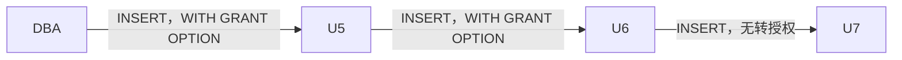

### 2. REVOKE

```sql
REVOKE <权限> [, <权限>] ...
  [ON <对象类型> <对象名>]
  FROM <用户> [, <用户>] ...
  [CASCADE];
```

**例 8：收回 U4 修改学号的权限。**

```sql
REVOKE UPDATE(Sno)
ON TABLE Student
FROM U4;
```

**例 9：收回所有用户对 SC 的查询权限。**

```sql
REVOKE SELECT
ON TABLE SC
FROM PUBLIC;
```

**例 10：级联收回 U5 对 SC 的插入权限。**

```sql
REVOKE INSERT
ON TABLE SC
FROM U5 CASCADE;
```

系统只级联收回直接或间接从 U5 获得的权限，因此 U6、U7 的该条授权链也被撤销。

### 3. 例 1～7 执行后的权限定义表

| 授权者 | 被授权者 | 数据库对象 | 操作 | 可转授权 |
|---|---|---|---|---|
| DBA | U1 | Student | SELECT | 否 |
| DBA | U2 | Student | ALL | 否 |
| DBA | U2 | Course | ALL | 否 |
| DBA | U3 | Student | ALL | 否 |
| DBA | U3 | Course | ALL | 否 |
| DBA | PUBLIC | SC | SELECT | 否 |
| DBA | U4 | Student | SELECT | 否 |
| DBA | U4 | Student.Sno | UPDATE | 否 |
| DBA | U5 | SC | INSERT | 是 |
| U5 | U6 | SC | INSERT | 是 |
| U6 | U7 | SC | INSERT | 否 |

课件“例 8～10 后”的 OCR 表重复了上表，未反映已收回行；按这些语句的实际语义，`U4/UPDATE(Sno)`、`PUBLIC/SELECT(SC)` 以及 U5→U6→U7 插入授权链均应从有效权限集中消失，其余授权保持。

### 4. 自主控制的应用场景与局限

应用场景包括：

1. 为每个终端用户创建独立数据库用户，但用户多时管理开销大。
2. 为查询、写入等系统模块或微服务设置独立账户，只授予所需权限。例如查询模块仅有 `SELECT`，即使出现 SQL 注入，攻击者也只能利用有限权限，符合最小特权原则。
3. 临时授权导出敏感数据，任务完成后立即撤销。
4. 员工离职或微服务被入侵时撤销全部权限。

```sql
GRANT SELECT ON sensitive_table TO temp_user;
REVOKE SELECT ON sensitive_table FROM temp_user;

REVOKE ALL PRIVILEGES ON *.* FROM ex_employee;
REVOKE ALL PRIVILEGES ON *.* FROM compromised_service;
```

DAC 只控制访问权，数据本身没有安全标记，可能发生“无意泄露”，因此高安全场景还需 MAC。

---

## 四、数据库角色与模式权限

### 1. 数据库角色

> 数据库角色是命名的一组与数据库操作相关的权限。角色把权限集合赋给一组职责相同的用户，可显著简化授权，类似操作系统用户组。

```sql
CREATE ROLE <角色名>;

GRANT <权限> [, <权限>] ...
ON <对象类型> <对象名>
TO <角色> [, <角色>] ...;

GRANT <角色1> [, <角色2>] ...
TO <角色3> [, <用户>] ...
[WITH ADMIN OPTION];

REVOKE <权限> [, <权限>] ...
ON <对象类型> <对象名>
FROM <角色> [, <角色>] ...;
```

**例 11：通过角色 R1 批量授权。**

```sql
CREATE ROLE R1;

GRANT SELECT, UPDATE, INSERT
ON TABLE Student
TO R1;

GRANT R1 TO 王平, 张明, 赵玲;

REVOKE R1 FROM 王平;
```

**例 12、13：修改角色权限。**

```sql
GRANT DELETE ON TABLE Student TO R1;
REVOKE SELECT ON TABLE Student FROM R1;
```

### 2. 创建用户与数据库模式权限

```sql
CREATE USER <username>
[WITH] [SUPERUSER | CREATEDB | CONNECT];
```

| 权限 | CREATE USER | CREATE SCHEMA | CREATE TABLE | 登录后查询和操纵 |
|---|---|---|---|---|
| SUPERUSER | 可以 | 可以 | 可以 | 可以 |
| CREATEDB | 不可以 | 不可以 | 可以 | 可以 |
| CONNECT | 不可以 | 不可以 | 不可以 | 可以，但还须拥有对象权限 |

SQL 授权机制的要点：DBA 拥有全部对象的全部权限；用户拥有自建对象的全部操作权；获准继续授权的用户可以传播权限；已授出的权限可用 `REVOKE` 收回。用户能自主决定把权限给谁、是否允许转授，故称“自主存取控制”。

---

## 五、强制存取控制

### 1. 主体、客体和敏感度标记

MAC 面向军事、政府等对密级有严格固定分类的场景，安全程度更高，用户不能直接控制其策略。

- **主体**：系统中的活动实体，如 DBMS 管理的实际用户和代表用户的进程。
- **客体**：被主体操作的被动实体，如文件、基表、索引和视图。
- **许可证级别**：主体的敏感度标记。
- **密级**：客体的敏感度标记。

课件列出的敏感度从高到低为：绝密（Top Secret）、机密（Secret）、可信（Confidential）、公开（Public）。

### 2. 控制规则

1. 当主体许可证级别 $\ge$ 客体密级时，主体才能读客体，即“向下读”。
2. 课件先给出基本写规则“主体级别等于客体密级时可写”，随后给出修正规则：主体许可证级别 $\le$ 客体密级时可写，即“向上写”。
3. 两种写规则的共同目标是禁止高许可证主体更新低密级对象，避免高密级信息向低密级泄露。

支持标签或行级强制控制的产品示例：Oracle Label Security、IBM DB2 LBAC、Microsoft SQL Server Row-Level Security。课件举例说明其可用于国防、金融客户隔离和医疗研究组患者数据隔离。

---

## 六、SQL Server 安全性管理

### 1. 四层安全防线

1. Windows NT 操作系统安全：网络管理员建立用户组和账户，并控制系统资源访问级别。
2. SQL Server 运行安全：通过 SQL Server 登录账户增加一层控制。
3. 数据库安全：每个数据库有独立用户和角色，非数据库用户不得访问。
4. 数据库对象安全：DCL 保证进入数据库的合法用户也只能在授权范围内操作。

### 2. 用户认证

SQL Server 支持 Windows 认证和混合认证：

- **Windows 认证**：利用 Windows 登录和身份验证；连接 SQL Server 时通常无需再次输入账号密码。课件列出安装后的预设账户 `BUILTIN\Administrators` 与 `sa`。
- **混合认证**：也允许 SQL Server 自身验证。SQL Server 认证要求登录名和密码，课件指出登录信息存于系统表 `syslogins`，匹配即登录成功。
- SQL Server 中“登录名”不等于“数据库用户”，二者由不同语句创建，需显式建立映射。

### 3. 对象权限与语句权限

| 对象 | 对象权限 |
|---|---|
| 表 | SELECT、INSERT、UPDATE、DELETE、REFERENCES |
| 视图 | SELECT、UPDATE、INSERT、DELETE |
| 存储过程 | EXECUTE |
| 列 | SELECT、UPDATE |

| 语句权限 | 功能 |
|---|---|
| CREATE DATABASE | 创建数据库 |
| CREATE TABLE | 创建表 |
| CREATE VIEW | 创建视图 |
| CREATE RULE | 创建规则 |
| CREATE DEFAULT | 创建默认值 |
| CREATE PROCEDURE | 创建存储过程 |
| BACKUP DATABASE | 备份数据库 |
| BACKUP LOG | 备份日志 |

### 4. dbo 与 guest

- `dbo` 是数据库所有者/创建者，拥有该库全部操作权限；其身份可重新分配，系统管理员 `sa` 可作为任一数据库的 `dbo`。
- 若数据库中存在 `guest`，没有映射为数据库用户的合法登录者仍能以 `guest` 访问。除 `master`、`tempdb` 的 `guest` 不能删除外，其他数据库可删除 `guest` 以拒绝非数据库用户访问。

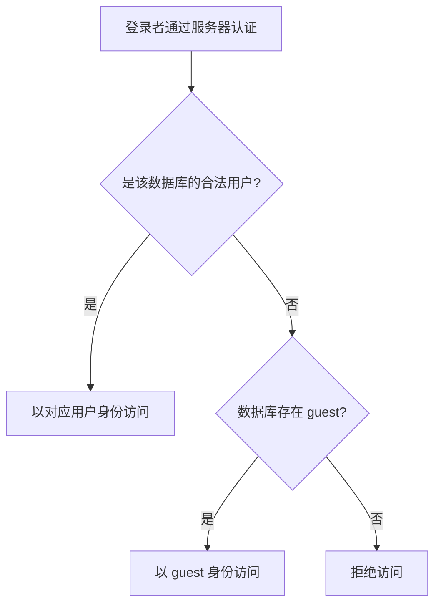

### 5. 固定服务器角色

| 角色 | 权限 |
|---|---|
| sysadmin | 可执行任何 SQL Server 操作 |
| serveradmin | 配置服务器范围选项 |
| setupadmin | 增删连接服务器并执行部分系统存储过程 |
| securityadmin | 管理数据库登录 |
| processadmin | 管理 SQL Server 进程 |
| dbcreator | 创建和修改数据库 |
| diskadmin | 管理磁盘文件 |
| bulkadmin | 执行 `BULK INSERT` |

课件使用以下存储过程管理服务器角色成员：

```sql
EXEC sp_addsrvrolemember 'FirstUser', 'sysadmin';
EXEC sp_dropsrvrolemember 'FirstUser', 'sysadmin';
```

### 6. 固定数据库角色

| 角色 | 权限 |
|---|---|
| db_owner | 数据库所有者，可管理并操作库内任意对象 |
| db_accessadmin | 增删 Windows 用户/组登录者及 SQL Server 用户 |
| db_datareader | 对所有表执行 SELECT |
| db_datawriter | 对所有表执行 INSERT、UPDATE、DELETE，但不能 SELECT |
| db_ddladmin | 新建、删除、修改数据库对象（课件 OCR 为 `db_addladmin`，已按角色语义校正） |
| db_securityadmin | 管理 GRANT、DENY、REVOKE 及角色权限 |
| db_backupoperator | 备份数据库 |
| db_denydatareader | 禁止对任何表 SELECT |
| db_denydatawriter | 禁止对任何表 UPDATE、DELETE、INSERT |

---

## 七、数据库完整性概述

### 1. 完整性与安全性的区别

> 数据库完整性是数据的**正确性**和**相容性**，防止出现不符合现实语义的数据；数据库安全性防止非法用户和非法操作造成恶意破坏或非法存取。

例如，更新“学生选课.成绩”后检查成绩是否 $\ge0$，不满足就进行违约处理。完整性规则（完整性约束）由语言描述，编译后存入数据库，可修改和删除。DBMS 必须提供约束定义机制、检查方法和违约处理。

数据库完整性包括：实体完整性、参照完整性、用户定义完整性和完整性约束命名子句。

---

## 八、实体完整性

### 1. 定义主码

实体完整性用 `PRIMARY KEY` 定义。单属性码可写为列级或表级约束；复合码只能写成表级约束。

**例 1：列级定义 Student 主码。**

```sql
CREATE TABLE Student (
  Sno   CHAR(9) PRIMARY KEY,
  Sname CHAR(20) NOT NULL,
  Ssex  CHAR(2),
  Sage  SMALLINT,
  Sdept CHAR(20)
);
```

**例 2：表级定义 SC 的复合主码。**

```sql
CREATE TABLE SC (
  Sno   CHAR(9) NOT NULL,
  Cno   CHAR(4) NOT NULL,
  Grade SMALLINT,
  PRIMARY KEY (Sno, Cno)
);
```

### 2. 检查与违约处理

插入元组或更新主码列时，RDBMS 自动检查：主码是否唯一、主码各属性是否非空；任一条件不满足即拒绝操作。

课件给出两种唯一性检查方式：

1. **全表扫描**：把待插入记录的主码 `Keyi` 依次与基本表中的 `Key1`、`Key2`、`Key3`……比较。若发现相同值就拒绝；否则扫描到表尾后允许插入。原图基本表的非码字段依次表示为 `F21…F51`、`F22…F52` 等。
2. **索引检查**：沿主码索引树查找新主码。原图示例查找值 `25`：从根键 `51` 进入左子树，经内部节点 `12、30` 到叶节点 `15、20、25`，发现重复后拒绝插入。叶节点按 `3、7 → 15、20、25 → 30、41 → 51、54、65 → 68、69、71、76 → 79、84、93` 有序链接。

全表扫描图中的待插入记录为：

| 主码 | 字段 2 | 字段 3 | 字段 4 | 字段 5 |
|---|---|---|---|---|
| Keyi | F2i | F3i | F4i | F5i |

被扫描的基本表结构为：

| 主码 | 字段 2 | 字段 3 | 字段 4 | 字段 5 |
|---|---|---|---|---|
| Key1 | F21 | F31 | F41 | F51 |
| Key2 | F22 | F32 | F42 | F52 |
| Key3 | F23 | F33 | F43 | F53 |
| … | … | … | … | … |

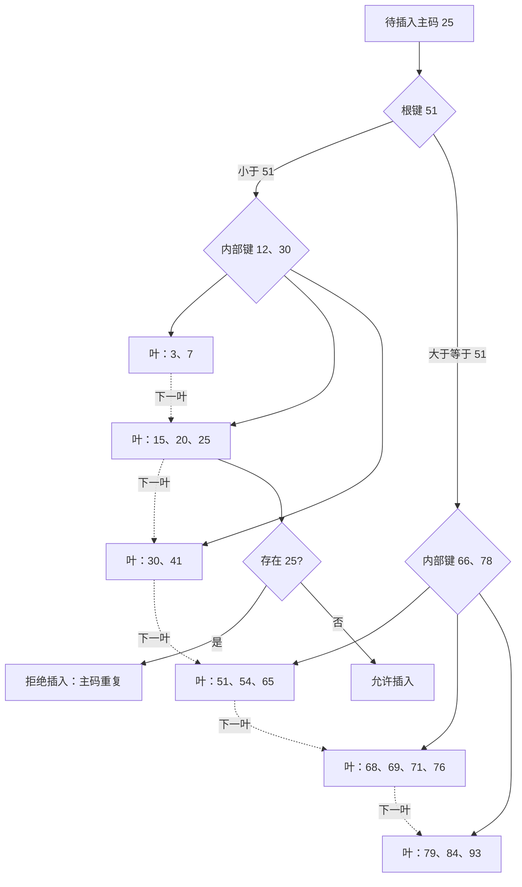

索引把全表逐行比较转化为树高范围内的路径查找；图中叶结点还通过链指针相连，便于顺序访问。

---

## 九、参照完整性

### 1. 外码定义

在 `CREATE TABLE` 中用 `FOREIGN KEY` 指定外码，用 `REFERENCES` 指明被参照表的主码。

**例 3：SC 同时参照 Student 和 Course。**

```sql
CREATE TABLE SC (
  Sno   CHAR(9) NOT NULL,
  Cno   CHAR(4) NOT NULL,
  Grade SMALLINT,
  PRIMARY KEY (Sno, Cno),
  FOREIGN KEY (Sno) REFERENCES Student(Sno),
  FOREIGN KEY (Cno) REFERENCES Course(Cno)
);
```

### 2. 可能破坏参照完整性的操作

| 被参照表操作 | 参照表操作 | 典型处理 |
|---|---|---|
| 无 | 插入元组 | 外码无匹配主码时拒绝 |
| 无 | 修改外码 | 新外码无匹配主码时拒绝 |
| 删除被参照元组 | 可能留下悬空外码 | 拒绝、级联删除或把外码置空 |
| 修改被参照主码 | 可能留下悬空外码 | 拒绝、级联修改或把外码置空 |

**例 4：显式定义违约处理。**

```sql
CREATE TABLE SC (
  Sno   CHAR(9) NOT NULL,
  Cno   CHAR(4) NOT NULL,
  Grade SMALLINT,
  PRIMARY KEY (Sno, Cno),
  FOREIGN KEY (Sno) REFERENCES Student(Sno)
    ON DELETE CASCADE
    ON UPDATE CASCADE,
  FOREIGN KEY (Cno) REFERENCES Course(Cno)
    ON DELETE NO ACTION
    ON UPDATE CASCADE
);
```

删除 Student 时级联删除相应 SC 元组；修改 Student 学号时级联更新。删除 Course 若会造成不一致则拒绝，修改课程号时级联更新。

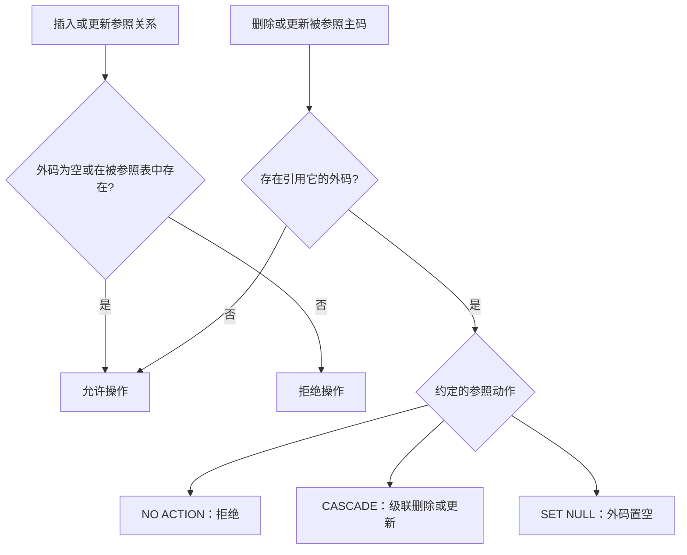

---

## 十、用户定义完整性与命名约束

### 1. 属性约束

用户定义完整性表达特定应用的语义要求，由 RDBMS 统一执行。列级常用 `NOT NULL`、`UNIQUE`、`CHECK`。

**例 5：SC 的学号、课程号、成绩均非空。**

```sql
CREATE TABLE SC (
  Sno   CHAR(9) NOT NULL,
  Cno   CHAR(4) NOT NULL,
  Grade SMALLINT NOT NULL,
  PRIMARY KEY (Sno, Cno)
);
```

表级主码已隐含 `Sno`、`Cno` 非空，因此其列级 `NOT NULL` 可省略。

**例 6：部门名称唯一。**

```sql
CREATE TABLE DEPT (
  Deptno  NUMERIC(2),
  Dname   CHAR(9) UNIQUE,
  Location CHAR(10),
  PRIMARY KEY (Deptno)
);
```

**例 7：性别只能取“男”或“女”。**

```sql
CREATE TABLE Student (
  Sno   CHAR(9) PRIMARY KEY,
  Sname CHAR(8) NOT NULL,
  Ssex  CHAR(2) CHECK (Ssex IN ('男', '女')),
  Sage  SMALLINT,
  Sdept CHAR(20)
);
```

### 2. 元组约束

`CHECK` 还能表达同一元组中不同属性之间的条件。

**例 8：男生姓名不能以 `Ms.` 开头。**

```sql
CREATE TABLE Student (
  Sno   CHAR(9) PRIMARY KEY,
  Sname CHAR(8) NOT NULL,
  Ssex  CHAR(2),
  Sage  SMALLINT,
  Sdept CHAR(20),
  CHECK (Ssex = '女' OR Sname NOT LIKE 'Ms.%')
);
```

### 3. CONSTRAINT 命名子句

```sql
CONSTRAINT <约束名>
  [PRIMARY KEY (...) | FOREIGN KEY (...) REFERENCES ... | CHECK (...)]
```

**例 10：为 Student 的五个约束命名。**

```sql
CREATE TABLE Student (
  Sno NUMERIC(6)
    CONSTRAINT C1 CHECK (Sno BETWEEN 90000 AND 99999),
  Sname CHAR(20)
    CONSTRAINT C2 NOT NULL,
  Sage NUMERIC(3)
    CONSTRAINT C3 CHECK (Sage < 30),
  Ssex CHAR(2)
    CONSTRAINT C4 CHECK (Ssex IN ('男', '女')),
  CONSTRAINT StudentKey PRIMARY KEY (Sno)
);
```

### 4. ALTER TABLE 修改约束

**例 13**：学号范围改为 900000～999999，年龄限制由小于 30 改为小于 40。先删旧约束，再增加同名新约束。

```sql
ALTER TABLE Student DROP CONSTRAINT C1;
ALTER TABLE Student
  ADD CONSTRAINT C1 CHECK (Sno BETWEEN 900000 AND 999999);

ALTER TABLE Student DROP CONSTRAINT C3;
ALTER TABLE Student
  ADD CONSTRAINT C3 CHECK (Sage < 40);
```

---

## 十一、事务与并发一致性

### 1. 事务的定义

> 事务（Transaction）是一个数据库操作序列，是不可分割的逻辑工作单位：其中操作要么全做，要么全不做。事务是数据库恢复和并发控制的基本单位。

一个事务可由一条或多条 SQL 语句构成，也可包含一个或多个程序片段；一个程序通常包含多个事务。

```sql
BEGIN TRANSACTION;
-- SQL 语句 1
-- SQL 语句 2
COMMIT;       -- 成功提交

BEGIN TRANSACTION;
-- SQL 语句
ROLLBACK;     -- 失败撤销
```

未显式定义时，DBMS 按默认规则自动划分事务。

### 2. 银行转账例

从账户甲向乙转 10000 元必须作为一个事务：先从甲扣款，再给乙加款。若只完成前半段，数据库总金额不一致，因此两条更新必须原子提交或一起回滚。

```sql
UPDATE account
SET balance = balance - 10000
WHERE account_num = (
  SELECT account_num FROM depositor WHERE customer_name = '甲'
);

UPDATE account
SET balance = balance + 10000
WHERE account_num = (
  SELECT account_num FROM depositor WHERE customer_name = '乙'
);
```

### 3. 并发导致的丢失修改

飞机票余额初值 $A=16$，两个售票事务都读到 16，分别售出一张并写回 15，导致明明卖出两张却只减少一张，$T_1$ 的修改被 $T_2$ 覆盖。

| 时序 | $T_1$ | $T_2$ |
|---|---|---|
| 1 | `R(A)=16` |  |
| 2 |  | `R(A)=16` |
| 3 | `A←A-1; W(A)=15` |  |
| 4 |  | `A←A-1; W(A)=15` |

这是典型的**丢失修改（lost update）**，说明并发事务必须由隔离/并发控制机制协调。

### 4. ACID

| 特性 | 含义 |
|---|---|
| 原子性 Atomicity | 事务操作要么全部执行，要么全部不执行 |
| 一致性 Consistency | 事务前数据库一致，则正确事务完成后仍一致 |
| 隔离性 Isolation | 并发执行时，每个事务感觉不到其他事务的中间状态 |
| 持续性 Durability | 提交后的修改永久保存，即使随后发生故障 |

---

## 十二、数据库恢复与故障分类

### 1. 恢复的目标

系统故障、软硬件错误、操作员失误和恶意破坏不可避免。数据库恢复是把数据库从错误状态恢复到某个已知的正确状态，也称一致状态或完整状态。恢复子系统是 DBMS 中庞大而关键的组成部分。

### 2. 四类故障

| 故障 | 典型原因 | 主要后果 | 基本恢复 |
|---|---|---|---|
| 事务故障 | 运算溢出、死锁、违反完整性等非预期错误 | 单个事务未到正常终点 | UNDO 该事务 |
| 系统故障（软故障） | CPU 故障、OS 故障、DBMS 错误、断电 | 所有运行事务异常终止，内存缓冲丢失，但磁盘数据库通常未物理破坏 | UNDO 未提交事务，REDO 已提交事务 |
| 介质故障（硬故障） | 磁盘损坏、磁头碰撞、系统潜在错误、瞬时强磁场 | 外存数据库被破坏 | 重装备份并 REDO 后续成功事务 |
| 计算机病毒 | 可繁殖传播的恶意程序 | 破坏/盗窃数据和系统文件 | 依损坏范围恢复并清除恶意程序 |

事务内部的银行转账可显式判断余额不足并 `ROLLBACK`；课件后文所称“事务故障”特指应用程序无法预先处理的非预期故障。

各类故障对数据库有两种影响：数据库本身被物理破坏；或数据库未被物理破坏，但事务异常终止使数据不正确。

---

## 十三、恢复技术：数据转储

### 1. 冗余原则

恢复的基本原理是**冗余**：利用存储在其他位置的冗余数据重建已损坏或不正确的数据。关键问题是如何建立冗余（数据转储、日志）以及如何用冗余恢复。

### 2. 静态与动态转储

| 方式 | 过程 | 优点 | 缺点/恢复要求 |
|---|---|---|---|
| 静态转储 | 无运行事务时转储，期间禁止存取和修改 | 实现简单，副本必然一致 | 可用性低；须等待事务结束，转储期间新事务等待 |
| 动态转储 | 与用户事务并发，允许访问和修改 | 不阻塞已有和新事务 | 副本未必是单一时刻的一致状态，必须结合日志恢复 |

动态转储例：$T_c$ 时把 $A=100$ 复制到磁带，$T_d$ 时事务把 $A$ 改为 200，副本中的 100 已过时。因此需记录转储期间的修改，使用“后备副本 + 日志”恢复到正确状态。

### 3. 海量与增量转储

- **海量转储（完全转储）**：每次复制全部数据库，恢复方便，但大型高频事务库的转储成本高。
- **增量转储**：只复制上次转储后更新过的数据，转储更实用有效，但恢复时要组合多个增量。

---

## 十四、日志与写前日志

### 1. 日志的作用和内容

> 日志文件（log）记录事务对数据库的更新操作，用于事务故障恢复、系统故障恢复，并辅助后备副本进行介质恢复。

以记录为单位的日志包含：

1. 各事务的 `BEGIN TRANSACTION`。
2. 各事务的结束标记 `COMMIT` 或 `ROLLBACK`。
3. 每次更新的事务标识、操作类型、操作对象、旧值和新值；插入的旧值为空，删除的新值为空。

```text
[START T1]
T1 UPDATE 用户余额 SET 余额: 500 -> 400 WHERE UID=101
T1 INSERT 订单表 VALUES(订单ID=789, UID=101, 金额=100)
[COMMIT T1]
```

以数据块为单位的日志，每条记录至少包含事务标识和被更新的数据块。

**转账日志问题**：事务 $T$ 把 50 元从 $A=1000$ 转到 $B=2000$。若 $A$ 的新值已写磁盘、$B$ 的新值尚未写入就故障，既不能简单“重新执行全部事务”也不能什么都不做，必须根据日志对未提交事务 UNDO，或对已提交但未落盘操作 REDO。

### 2. 登记原则：先日志、后数据库

日志必须按并发事务实际执行的时间顺序登记，并遵守写前日志（Write-Ahead Logging，WAL）：**先把修改日志写入稳定存储，再把数据页写入数据库**。

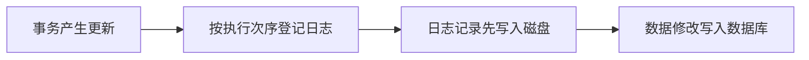

若先写数据库、日志尚未登记就故障，该修改无法恢复；若先写日志但数据库尚未修改，恢复时最多多做一次不必要的 UNDO，不影响正确性。

---

## 十五、UNDO 与 REDO 恢复策略

### 1. 事务故障

事务在正常终止点前被终止，恢复子系统自动利用日志撤销该事务，对用户透明：

1. 反向扫描日志，找到该事务的更新。
2. 执行逆操作，把旧值写回。插入的逆操作是删除；删除的逆操作是插入；修改则用旧值替代新值。
3. 继续反向扫描和撤销，直到读到事务开始标记。

### 2. 系统故障

系统故障可能使未完成事务的部分更新已经落盘，也可能使已提交事务的更新仍在缓冲区。重启时自动恢复：

1. 正向扫描日志。既有 `BEGIN` 又有 `COMMIT` 的事务进入 `REDO` 队列；只有 `BEGIN` 而没有 `COMMIT` 的事务进入 `UNDO` 队列。
2. 反向扫描，对 `UNDO` 队列写回旧值。
3. 正向扫描，对 `REDO` 队列写回新值。

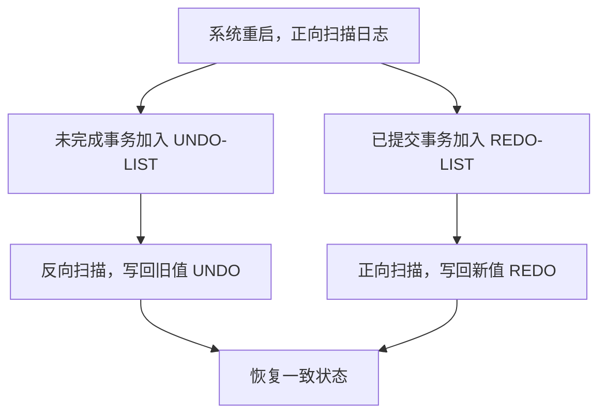

课件系统恢复例中，$T_0$ 从 $A=1000$ 向 $B=2000$ 转 50 元，$T_1$ 从 $C=700$ 取 100 元；具体执行时应根据二者是否出现提交标记分别放入 UNDO/REDO 队列。

---

## 十六、检查点恢复

### 1. 检查点的必要性和结构

每次恢复都搜索整个日志、重做大量已落盘事务会浪费时间。检查点技术在日志中加入检查点记录，增加重新开始文件，并由恢复子系统动态维护。

检查点记录包含：建立时所有正在执行的事务清单，以及这些事务最近一条日志记录的地址；重新开始文件保存各检查点记录在日志中的地址。原图结构如下：

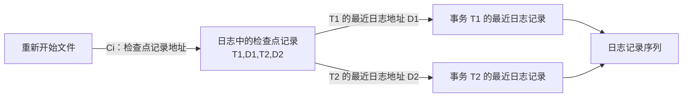

其中 `T1,D1,T2,D2` 表示检查点时活跃事务及其最近日志地址。恢复先从重新开始文件定位最后一个检查点，再由这些地址追踪事务历史。

### 2. 动态建立检查点

周期性执行：

1. 把当前日志缓冲区全部写到磁盘日志。
2. 在日志中写入检查点记录。
3. 把当前数据缓冲区的所有数据写到磁盘数据库。
4. 把检查点记录地址写入重新开始文件。

检查点可定期建立（如每小时一次），也可按规则不定期建立（如日志写满一半时）。

### 3. 按事务状态选择恢复动作

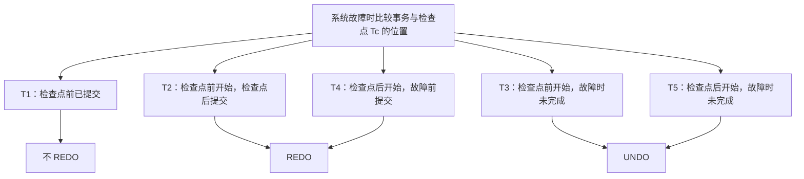

这里把 $T_c$ 视为位置 3、$T_f$ 视为位置 8：$T_1$ 在检查点前提交，无需重做；$T_2,T_4$ 在检查点后才提交，修改可能尚在缓冲区，需 REDO；$T_3,T_5$ 在故障时仍未完成，需 UNDO。

### 4. 利用检查点恢复的步骤

1. 从重新开始文件找到最后检查点的日志地址，读取该检查点记录。
2. 取得检查点时活跃事务清单 `ACTIVE-LIST`；初始化 `UNDO-LIST=ACTIVE-LIST`，`REDO-LIST=∅`。
3. 从检查点正向扫描到日志末尾：遇到新事务开始就加入 `UNDO-LIST`；遇到事务提交就从 `UNDO-LIST` 移至 `REDO-LIST`。
4. 对 `UNDO-LIST` 中事务执行 UNDO，对 `REDO-LIST` 中事务执行 REDO。

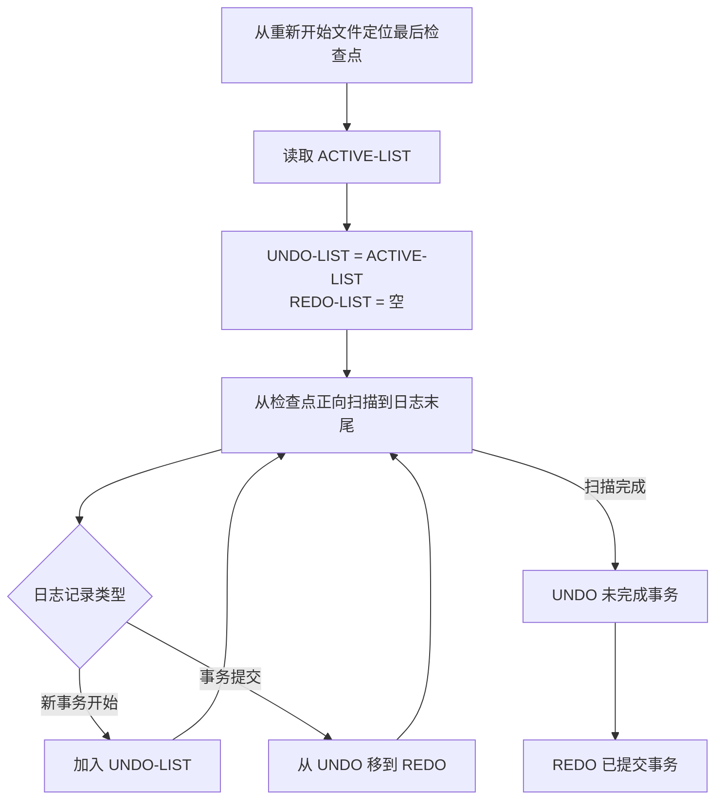

### 5. 课堂练习图片转写与答案

原图给出 $T_c$（检查点）和 $T_f$（系统故障）两条竖线，以及六个事务的起止区间：

- $T_1$ 在检查点前开始、检查点后提交。
- $T_2$ 在检查点前开始并在检查点前提交。
- $T_3$ 在检查点前开始，故障时尚未提交。
- $T_4$ 在检查点后开始，故障时尚未提交。
- $T_5,T_6$ 均在检查点后开始并在故障前提交。

由此：

- 检查点时 `ACTIVE-LIST={T1,T3}`。
- `UNDO-LIST={T3,T4}`。
- `REDO-LIST={T1,T5,T6}`。
- $T_2$ 在检查点前已经提交，其修改在建立检查点时已落盘，既不 UNDO 也不 REDO。
- 日志中的开始/结束标记应包含：$T_1,T_2,T_3$ 的 `BEGIN` 在检查点前，$T_2$ 的 `COMMIT` 在检查点前；检查点后有 $T_1$ 的 `COMMIT`，$T_4,T_5,T_6$ 的 `BEGIN`，以及 $T_5,T_6$ 的 `COMMIT`；$T_3,T_4$ 到故障时无 `COMMIT`。

---

## 十七、介质故障恢复

### 1. 恢复步骤

1. 装入离故障最近的后备副本，使数据库回到最近转储时的一致状态。静态副本装入后即一致；动态副本还需结合转储期间日志，以系统故障恢复方式（UNDO+REDO）恢复一致。
2. 装入转储结束后的日志，找出故障前已提交事务，加入 REDO 队列；正向扫描并把新值写回。

介质恢复需要 DBA 重装最近的数据库副本和日志副本、执行恢复命令，具体 UNDO/REDO 操作由 DBMS 完成。

### 2. 静态转储与日志的时间线

课件图中 $T_a$ 开始静态转储，$T_b$ 转储结束并得到一致副本，系统运行到 $T_f$ 发生故障。恢复先把 $T_b$ 副本装回，再利用 $T_b$ 到 $T_f$ 的日志重做更新事务，然后继续运行。

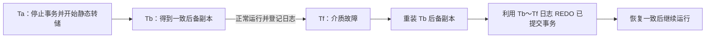

---

## 十八、数据库镜像

### 1. 结构与用途

介质故障影响最严重且恢复耗时。数据库镜像由 DBMS 自动把整个数据库或关键数据复制到另一磁盘，并维护主库和镜像的一致性。

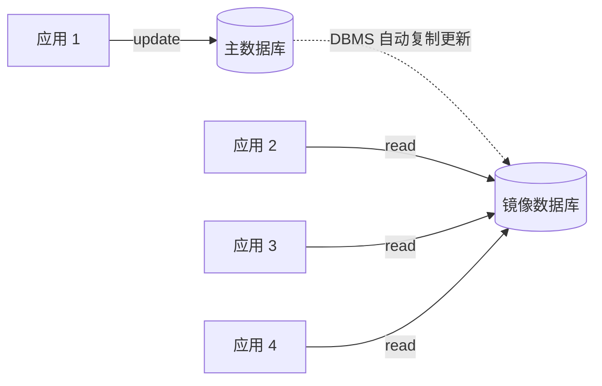

主库发生介质故障时，可由镜像继续服务，并由 DBMS 用镜像自动恢复，无需关闭系统和手工重装副本。正常时，若主库数据被排他锁修改，其他用户可读镜像而无需等待锁释放。

频繁复制会降低系统运行效率，实际往往只镜像关键数据和日志，而非整个数据库。

---

## 十九、实验 2：数据控制

### 1. 实验目标与环境

- 熟悉用 SQL 控制数据库安全性、完整性和恢复。
- 使用 SQL Server/MySQL 交互查询工具。
- 使用交互式 SQL 数据库或自设计至少三个表的数据库。

### 2. 安全性实验

由 DBA 创建若干用户，权限选为 `CONNECT`（课件对应 SQL Server `db_accessadmin` 角色），仿照授权与回收例 1～10 完成至少 4 个用例并观察效果；注意 SQL Server 登录名与数据库用户的区别。

### 3. 完整性实验

用实际违约操作观察 DBMS 处理：

- 实体完整性：仿例 1、2，1 组。
- 参照完整性：仿例 3，4 组。
- 用户定义完整性：仿例 5、6，1 组。
- `CHECK`：仿例 7、8（课件还提到例 9），1 组。
- `CONSTRAINT`：仿例 10、13，1 组。

---

## 二十、实验 3：备份和恢复

### 1. 操作要求

1. 创建备份设备。
2. 把实验数据库完整备份到设备。
3. 向某表插入若干记录。
4. 备份事务日志并查看日志格式。
5. 利用完整备份恢复到插入前状态。
6. 利用事务日志恢复到插入后状态。

课件列出的命令：SQL Server 使用 `sp_addumpdevice`、`BACKUP DATABASE/LOG`、`RESTORE DATABASE/LOG`（MinerU 将 `DATABASE` 误识别为 `DATABASSE`，已校正）；MySQL 使用 `mysqldump`、`source`、`mysqlbinlog`。

### 2. 提交要求

- 安全性、完整性、备份和恢复合并提交。
- 课件截止时间为“本周日晚 8 点前”（属于原课程相对时间，执行时应以教师当前通知为准）。
- 文件名：`实验_数据库保护_学号_姓名.docx/pdf`。

---

## 本章小结

| 方面 | 核心结论 |
|---|---|
| 安全性 | 用户鉴别、DAC/MAC、角色和分层防护共同限制非法访问 |
| 完整性 | 主码、外码、NOT NULL、UNIQUE、CHECK 和命名约束维护正确性 |
| 事务 | 是恢复和并发控制基本单位，必须满足 ACID |
| 并发 | 无隔离可发生丢失修改等不一致现象 |
| 日志 | 按执行次序登记并遵循先日志、后数据的 WAL 原则 |
| 事务故障 | 反向扫描日志并 UNDO |
| 系统故障 | UNDO 未完成事务，REDO 已提交事务 |
| 介质故障 | 重装备份，结合日志恢复，再 REDO 已提交事务 |
| 检查点 | 缩小扫描范围，根据事务状态建立 UNDO/REDO 队列 |
| 镜像 | 提高可用性并辅助恢复，但持续复制有性能成本 |

## 图片转写审计

| 来源 | 原图片引用 | 原图信息 | 笔记承接位置 |
|---|---|---|---|
| 数据库保护（1） | `e98040...9c4609.jpg`（原 PPTX 第 5 页） | 用户 ↔ DBMS ↔ OS ↔ DB 四层安全模型，分别对应鉴别、数据库保护、OS 保护和密码存储 | “计算机系统的分层安全模型” Mermaid |
| 数据库保护（1） | `853c68...6872d6.jpg`（原 PPTX 第 63 页） | 主码唯一性的全表扫描：待插入 `Keyi` 与基本表 `Key1、Key2、Key3…` 逐行比较 | “实体完整性—检查与违约处理”的完整文字转写 |
| 数据库保护（1） | `afd031...5cd7e.jpg`（原 PPTX 第 64 页） | 用 B+ 树索引检查新主码 25；根 51、内部键 12/30 和 66/78、六个有序叶结点及叶链 | “实体完整性—检查与违约处理”的 Mermaid 与叶结点序列说明 |
| 数据库保护（2） | `b08fac...b6c21d.jpg`（原 PPTX 第 44 页） | 重新开始文件保存检查点地址；检查点记录含活跃事务 `T1,D1,T2,D2` 并指向各自最近日志 | “检查点的必要性和结构” Mermaid 与解读 |
| 数据库保护（2） | `ac7cf2...6d150.png`（原 PPTX 第 52 页） | $T_c$、$T_f$ 间 $T_1$～$T_6$ 的起止时间；透明 PNG 已在白底核查 | “课堂练习图片转写与答案”，完整列出 ACTIVE/UNDO/REDO 集合和日志标记 |
| 数据库保护（2） | `fb1dc6...b22f1.jpg`（原 PPTX 第 62 页） | 应用 1 更新主库，DBMS 复制至镜像，应用 2～4 从镜像读取 | “数据库镜像—结构与用途” Mermaid |

已核查本组课件全部 **6 个 Markdown 图片引用（6 个唯一图像）**，并对照原 PPTX 对应页确认箭头、键值、事务区间和数据流；本笔记不残留 MinerU 图片链接。
