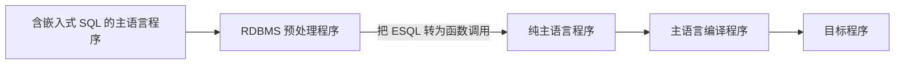
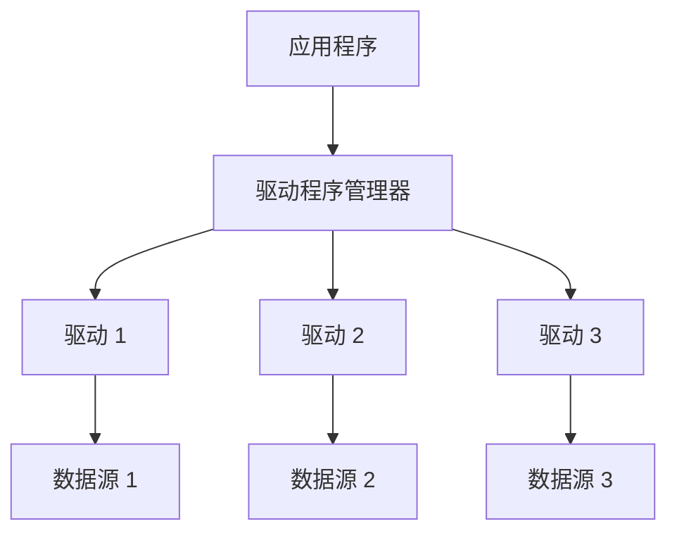
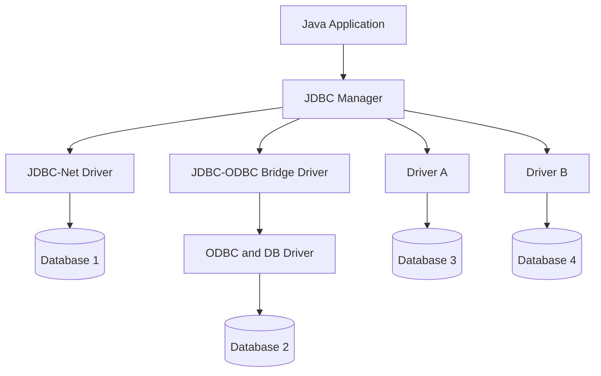
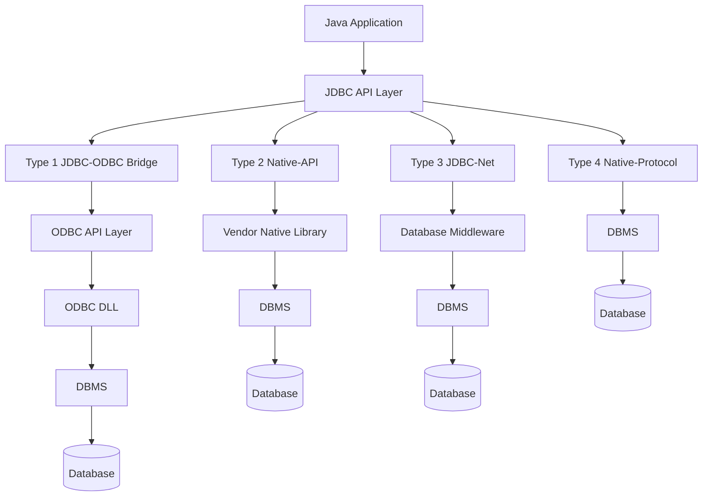
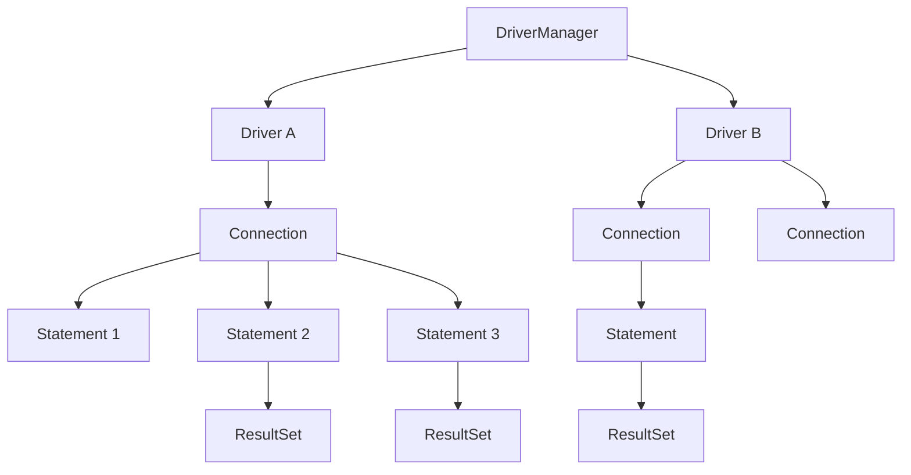
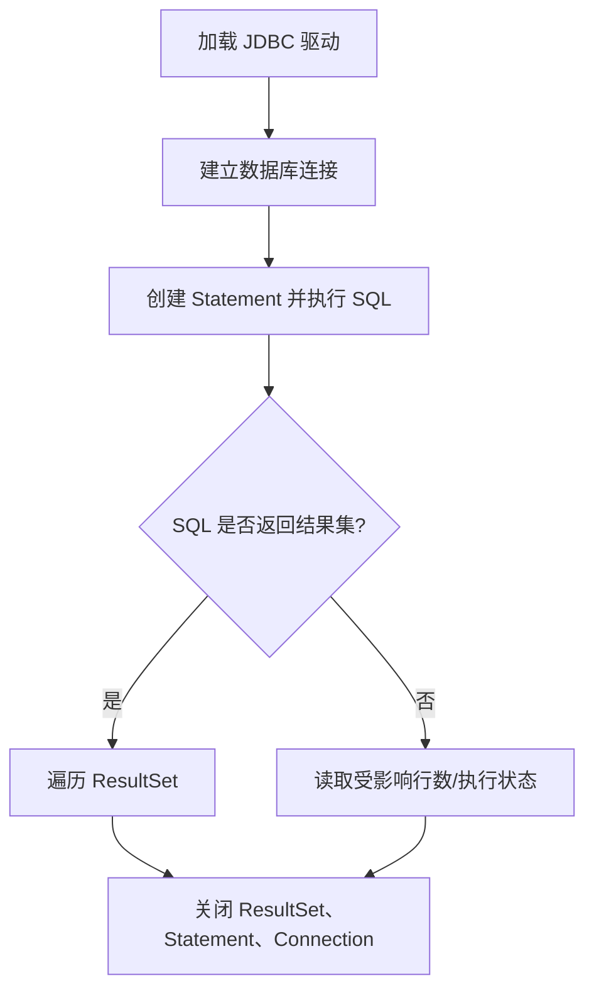
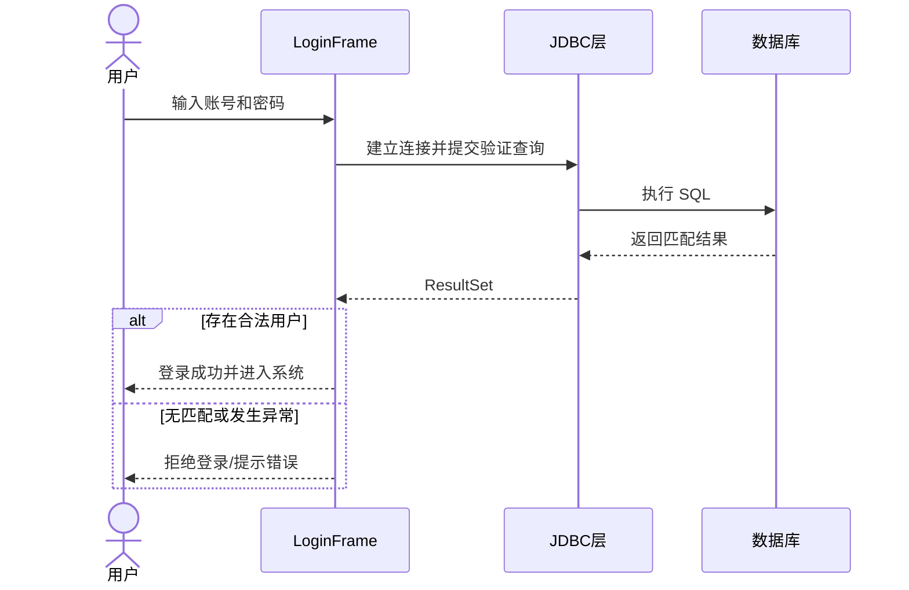

# 7.1 数据库编程——JDBC

> 本笔记整理自第 8 章“数据库编程”课件，涵盖嵌入式 SQL、ODBC/JDBC 架构、四类 JDBC 驱动、核心接口和完整编程流程。课件中的架构图、对象关系图、工作步骤图和方法表均已转为 Mermaid、Markdown 表格或文字。

## 主要内容

- 交互式 SQL 与嵌入式 SQL
- 嵌入式 SQL 的预编译处理
- ODBC 与 JDBC 的目标和体系结构
- JDBC 四类驱动程序
- DriverManager、Connection、Statement 与 ResultSet
- 驱动加载、连接、执行 SQL、处理结果和关闭资源
- ResultSet/DatabaseMetaData 元数据
- 学生选课系统实验与 SQL 注入思考

---

## 一、嵌入式 SQL

### 1. 两种使用方式

SQL 有交互式和嵌入式两种使用方式。SQL 是非过程语言，而事务处理应用通常还需要高级程序设计语言完成分支、循环、界面和业务控制，因此要把 SQL 嵌入 C、C++、Java 等宿主语言中。被嵌入的语言称为**宿主语言**或**主语言**。

### 2. 预编译处理



> **流程图解读**：普通编译器不直接理解嵌入式 SQL，因此先由 DBMS 预处理器识别 SQL 语句并替换为运行库调用，再交给宿主语言编译器。

课件列出本章三个主题：嵌入式 SQL、存储过程和触发器、JDBC 编程；本份精简课件主要展开嵌入式 SQL 处理过程和 JDBC。

---

## 二、ODBC 与 JDBC

### 1. JDBC 定义和目标

> **JDBC（Java Database Connectivity）**：独立于特定 DBMS 的通用 SQL 数据库存取接口，是 `java.sql` 包中的一组标准 Java API。

JDBC 为不同数据库提供统一访问方式，屏蔽具体 DBMS 的部分差异。只要数据库厂商提供 JDBC 驱动，应用即可用相近代码连接和操作该系统，从而减少对特定数据库内部特点的依赖。

### 2. ODBC 架构

ODBC 是 Microsoft 为异构数据库互连提出的公共编程接口。其四个部件为：

1. 应用程序：调用 ODBC 函数、提交 SQL 并处理结果。
2. 驱动程序管理器：为应用装载和选择驱动。
3. 驱动程序：实现 ODBC 调用，与特定数据源交互；必要时转换请求以适应 DBMS 语法。
4. 数据源：数据以及相关操作系统、DBMS 和网络平台的组合。



### 3. JDBC 的两层 API

- **面向应用的 JDBC API**：供应用开发者连接数据库、执行 SQL 和取得结果。
- **面向数据库的 Java Driver API**：供厂商实现数据库驱动。



> **架构图解读**：Java 应用只面对 JDBC API；JDBC Manager 把连接请求交给合适驱动。驱动层可以通过网络、ODBC 桥或厂商本地协议连接数据库。与 ODBC 相比，课件强调 JDBC 不再依赖预先定制的“数据源”概念，而是在应用中加载驱动并连接指定数据库。

---

## 三、JDBC 驱动程序

### 1. 四种类型



| 类型 | 转换路径 | 特点 |
|---|---|---|
| Type 1 | JDBC → ODBC → 本地 API | 最简单；需安装 ODBC 驱动并配置数据源；只在缺少专用 JDBC 驱动时使用 |
| Type 2 | JDBC → 厂商本地库 | 部分 Java；必须安装厂商二进制库 |
| Type 3 | JDBC → 通用网络协议 → 中间件 → DBMS 协议 | 纯 Java 客户端，可通过中间件访问多种 DBMS |
| Type 4 | JDBC → DBMS 本地协议 | 纯 Java，直接通信，无桥接/中间件转换，通常性能较好 |

课件给出的 Type 1 驱动类为 `sun.jdbc.odbc.JdbcOdbcDriver`，它属于旧版 JDK 中的桥接方案；实验使用的具体驱动应以课程提供环境为准。

---

## 四、JDBC 核心对象

### 1. 主要概念

| 对象 | Java 类型 | 作用 |
|---|---|---|
| DriverManager | `java.sql.DriverManager` | 装载/管理驱动并建立连接 |
| Driver | 厂商驱动实现 | 把统一 API 请求转换成特定 DBMS 请求 |
| Connection | `java.sql.Connection` | 表示应用与特定数据库的会话连接 |
| Statement | `java.sql.Statement` | 在连接上执行静态 SQL |
| ResultSet | `java.sql.ResultSet` | 保存查询返回的行和列，并维护游标 |
| DatabaseMetaData | `java.sql.DatabaseMetaData` | 提供数据库与驱动信息 |
| ResultSetMetaData | `java.sql.ResultSetMetaData` | 提供结果列名称、类型、数量等信息 |

### 2. 对象创建与使用关系



> **对象图解读**：一个驱动可建立多个连接，一个连接可创建多个 Statement；执行查询的 Statement 可产生 ResultSet。DriverManager 位于最上层，负责在多个驱动中选择可处理给定 URL 的实现。

---

## 五、JDBC 基本编程流程

### 1. 四个步骤



### 2. 加载驱动

课件列出三种方式：

```java
// 1. 设置 jdbc.drivers 系统属性
System.setProperty("jdbc.drivers", "sun.jdbc.odbc.JdbcOdbcDriver");

// 2. 通过反射加载，课件推荐
Class.forName("oracle.jdbc.driver.OracleDriver");

// 3. 直接创建驱动对象
new sun.jdbc.odbc.JdbcOdbcDriver();
```

### 3. 建立连接

```java
Connection conn = DriverManager.getConnection(source);
Connection conn = DriverManager.getConnection(source, user, pass);
```

JDBC URL 的一般形式：

```text
jdbc:driverType:dataSource
```

JDBC-ODBC Bridge 示例为 `jdbc:odbc:myDSN`；其他驱动的 `driverType` 与 `dataSource` 由数据库厂商定义。

### 4. 执行 SQL

每次执行 SQL 前，通过连接创建 Statement：

```java
Statement stmt = conn.createStatement();
```

| 方法 | 适用语句 | 返回值 |
|---|---|---|
| `executeUpdate(String sql)` | `INSERT`、`UPDATE`、`DELETE` 等 | 受影响的行数 |
| `executeQuery(String sql)` | `SELECT` | `ResultSet` |
| `execute(String sql)` | 可能返回多个结果的 SQL | 是否存在结果集，需要配合其他方法读取 |

### 5. 遍历结果集

ResultSet 保存查询行列，并通过游标定位。课件表述“最初定位在第一行”与 JDBC 常见用法中的“最初位于第一行之前”不一致；其示例正确地先调用 `next()` 再读数据，因此编程时应按示例流程处理。

```java
ResultSet rs = stmt.executeQuery("SELECT name, amt FROM myTable");
while (rs.next()) {
    String name = rs.getString("name");
    int amount = rs.getInt("amt");
}
```

`getXXX` 的参数可以是从 1 开始的列序号 `int colIndex`，也可以是列名 `String colName`。

| 返回类型 | 常用方法 |
|---|---|
| `boolean` | `getBoolean()` |
| `byte` | `getByte()` |
| `byte[]` | `getBytes()` |
| `java.sql.Date` | `getDate()` |
| `double` | `getDouble()` |
| `float` | `getFloat()` |
| `int` | `getInt()` |
| `long` | `getLong()` |
| `Object` | `getObject()` |
| `short` | `getShort()` |
| `String` | `getString()` |
| `java.sql.Time` | `getTime()` |

### 6. 完整骨架

```java
Class.forName("driverName");

Connection conn = DriverManager.getConnection(
    "jdbc:xxx:datasource", "user", "password"
);
Statement stmt = conn.createStatement();
ResultSet rs = stmt.executeQuery("SELECT * FROM myTable");

while (rs.next()) {
    String name = rs.getString("name");
}

rs.close();
stmt.close();
conn.close();
```

---

## 六、元数据

### 1. ResultSetMetaData

`ResultSet.getMetaData()` 返回 `ResultSetMetaData`，可获得结果字段的数量、名称、类型、显示标签和来源表等：

- `getColumnCount()`：列数。
- `getColumnName(i)`：列名。
- `getColumnType(i)`：列的数据类型。
- `getColumnLabel(i)`：建议显示标签。
- `getTableName(i)`：该列所属表名。

先读取列类型，再选择相应 `getXXX()` 方法，可编写适应不同查询结构的通用结果展示程序。

### 2. DatabaseMetaData

`Connection.getMetaData()` 返回 `DatabaseMetaData`，可获得数据库及驱动信息：

- `getDatabaseProductName()`。
- `getDatabaseProductVersion()`。
- `getDriverName()`。
- `getTables()`。

---

## 七、实验：学生选课管理系统

### 1. 环境准备

1. 安装 Java 和 JDBC 驱动，运行 `JdbcDemo1-4`。课件推荐 JDK 8，以及 `mssql-jdbc-9.4.1.jre8` 或 `mysql-connector-java-8.0.27`。
2. 手工创建“学生选课管理系统”数据库，运行 SQL Server/MySQL 导入脚本。
3. 修改 `db.properties`。
4. 在命令行进入 Java 程序目录，执行 `java Main`，查询数据库中的账号密码并以教师身份登录。

### 2. 实验任务

- 搭建并跑通 `Java_学生选课管理系统`。
- 分析 `LoginFrame.java` 从取得用户输入到访问数据库、判断合法用户的完整逻辑及 SQL 操作。
- 尝试针对登录逻辑进行 SQL 注入，并思考防御方法。
- 课件提示 VSCode 打开部分源文件可能乱码，可改用记事本或 Notepad++ 查看。

登录逻辑可概括为：



> **实验思考**：若程序直接拼接用户输入生成 SQL，输入可能改变查询语义。分析报告应明确指出输入如何流入 SQL、查询如何执行，以及应在哪一层进行参数化和权限控制。

实验报告分组提交，每组一份，命名为：

`实验_数据库编程_学号_姓名[_学号_姓名].docx` 或 `.pdf`。

---

## 本章小结

| 主题 | 核心结论 |
|---|---|
| 嵌入式 SQL | 先由 DBMS 预处理器转成宿主语言函数调用，再进行普通编译 |
| JDBC 目标 | 用统一 Java API 屏蔽不同 DBMS 的驱动细节 |
| 驱动类型 | Type 1 依赖 ODBC，Type 2 依赖本地库，Type 3 依赖中间件，Type 4 直连 DBMS 协议 |
| 对象链 | DriverManager → Driver → Connection → Statement → ResultSet |
| 编程步骤 | 加载驱动、建立连接、执行 SQL、处理结果、关闭资源 |
| 元数据 | ResultSetMetaData 描述结果列，DatabaseMetaData 描述数据库和驱动 |

> **图片核查说明**：源 `full.md` 的 4 个图片引用均已核查。JDBC 总体架构、四类驱动、对象调用关系和 `ResultSet.getXXX()` 方法表已分别重绘为 Mermaid 或 Markdown 表格；最终笔记不依赖 MinerU 图片。
