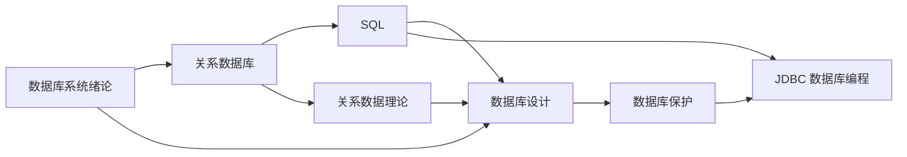

# 数据库课程笔记

> [!abstract] 学习主线
> 从“数据库系统为什么存在”出发，依次掌握关系模型、SQL、关系规范化、数据库设计、数据库保护与 JDBC 编程。

## 一、章节导航

| 章节 | 笔记 | 核心问题 |
|---|---|---|
| 第 1 章 | [[数据库/笔记/1.1 数据库系统绪论]] | 数据库系统是什么，数据模型与体系结构如何组织 |
| 第 2 章 | [[数据库/笔记/2.1 关系数据库]] | 关系模型如何表达数据，关系代数如何完成查询 |
| 第 3 章 | [[数据库/笔记/3.1 SQL]] | 如何用 SQL 定义、查询、更新与控制数据 |
| 第 4 章 | [[数据库/笔记/4.1 关系数据理论]] | 如何依据函数依赖判断并改进关系模式 |
| 第 5 章 | [[数据库/笔记/5.1 数据库设计]] | 如何从需求分析逐步得到概念、逻辑和物理结构 |
| 第 6 章 | [[数据库/笔记/6.1 数据库保护]] | 如何通过事务、并发控制、恢复与安全机制保护数据 |
| 第 7 章 | [[数据库/笔记/7.1 数据库编程——JDBC]] | Java 程序如何连接并操作关系数据库 |

## 二、知识结构

## 三、建议学习顺序

1. 先阅读[[数据库/笔记/1.1 数据库系统绪论|数据库系统绪论]]，建立数据、数据库、DBMS、数据库系统和数据模型等基本概念。
2. 学习[[数据库/笔记/2.1 关系数据库|关系数据库]]，重点理解关系、候选码、外码、完整性约束和关系代数。
3. 学习[[数据库/笔记/3.1 SQL|SQL]]，把关系模型中的概念落实为数据库操作语句。
4. 学习[[数据库/笔记/4.1 关系数据理论|关系数据理论]]，掌握函数依赖、范式、模式分解及其判定方法。
5. 学习[[数据库/笔记/5.1 数据库设计|数据库设计]]，串联需求分析、E-R 模型、关系模式转换和优化。
6. 学习[[数据库/笔记/6.1 数据库保护|数据库保护]]，理解事务的 ACID 特性、并发异常、封锁、恢复和安全性。
7. 最后阅读[[数据库/笔记/7.1 数据库编程——JDBC|JDBC 数据库编程]]，把 SQL 应用于 Java 程序。

## 四、课件覆盖说明

- 笔记依据 `数据库/课件` 中的 MinerU 转换结果整理。
- “关系数据库(1-2)(4)”存在两份内容完全相同的转换结果，整理时按一份课件处理，避免重复内容。
- 课件中的文字、表格、公式和图片均纳入整理；流程图、E-R 图、体系结构图等尽量使用 Mermaid 重绘，并配有文字说明。
- 笔记不再依赖 MinerU 的 `images` 路径，可单独阅读和检索。

### 整理统计

| 项目 | 数量 | 说明 |
|---|---:|---|
| MinerU 课件目录 | 13 | 其中 1 份为完全重复转换结果 |
| 有效课件来源 | 12 | 去除重复后实际整理的来源数 |
| 有效图片引用 | 96 | 每次引用均按其所在课件语境核查 |
| 唯一图片文件 | 86 | 重复出现的图片仍逐处确认上下文 |
| 章节笔记 | 7 | 不含本总索引 |
| Mermaid 图 | 63 | 分布于 7 篇章节笔记，另有本页知识结构图 1 幅 |

## 五、复习抓手

> [!tip] 三条贯穿课程的线索
> 1. **抽象层次**：现实世界 → 概念模型 → 逻辑模型 → 物理存储。
> 2. **操作语言**：关系代数提供理论基础，SQL 提供工程表达，JDBC 提供程序接口。
> 3. **质量保障**：规范化减少数据冗余，完整性保证正确性，事务、恢复与安全机制保证可靠运行。
