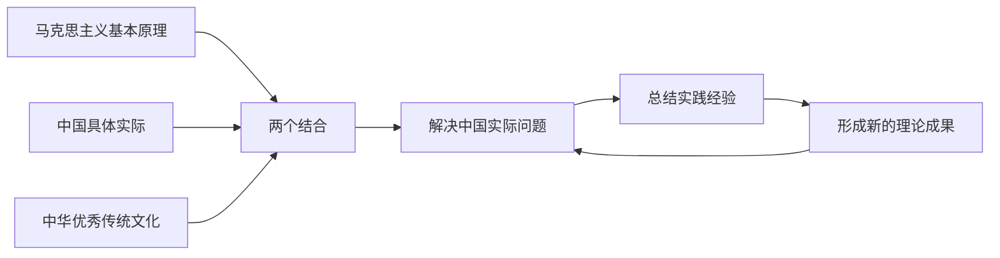
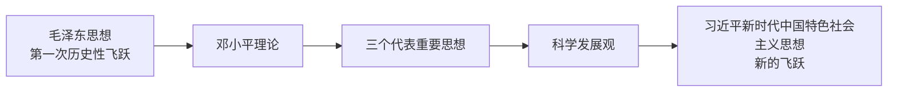

# 0.1 导论——马克思主义中国化时代化的历史进程与理论成果

> 本章依据导论课件，梳理马克思主义中国化时代化的提出背景、科学内涵、历史进程和理论成果关系。重点在于理解“两个结合”如何把马克思主义基本原理转化为解决中国问题、回应时代课题的理论力量。

## 主要内容

- 马克思主义中国化时代化的提出及其必然性  1
- 马克思主义中国化时代化的科学内涵 2
- 理论成果的历史进程与相互关系
- 课程学习要求与方法

---

## 一、核心问题

马克思主义中国化时代化，就是立足中国国情和时代条件，把马克思主义基本原理同中国具体实际相结合、同中华优秀传统文化相结合，在解决中国问题的实践中形成具有中国特色、中国风格、中国气派的理论成果。

---

## 二、马克思主义中国化时代化的提出

### 1. 历史背景

- 1840年鸦片战争以后，中国逐步沦为半殖民地半封建社会。太平天国运动、洋务运动、戊戌变法、义和团运动和辛亥革命等探索均未能改变中国命运。
- 十月革命给中国送来了马克思列宁主义。五四运动推动马克思主义广泛传播，并促进其同中国工人运动结合。
- 1921年中国共产党成立后，以马克思列宁主义为指导探索中国革命道路，但实践证明，照搬马克思主义经典作家的个别论断或外国经验不能解决中国问题。
- 1938年，毛泽东在党的六届六中全会上所作的《论新阶段》中明确提出“马克思主义的中国化”命题。1945年，刘少奇在党的七大报告中进一步阐述这一思想。

、
### 2. 提出的现实必然性 4点

1. **解决中国实际问题的需要**：马克思主义只有同中国具体实际相结合，才能指导中国革命、建设和改革。
2. **马克思主义理论发展的内在要求**：马克思主义不是封闭僵化的教条，而是在实践中不断发展的开放理论。
3. **总结中国经验并使之理论化的需要**：把实践经验上升为理论，才能揭示规律并指导新的实践。
4. **使理论为人民掌握的需要**：必须以中国人民熟悉的民族形式和语言表达马克思主义。

---

## 三、马克思主义中国化时代化的内涵 3点

| 层面 | 主要内容 |
| --- | --- |
| 解决中国问题 | 运用马克思主义立场、观点和方法观察时代、把握时代、引领时代，研究和解决中国革命、建设、改革中的实际问题 |
| 总结中国经验 | 总结和提炼中国实践中的新鲜经验，使之上升为理论，丰富和发展马克思主义理论宝库 |
| 植根中国文化 | 把马克思主义植根于中华优秀传统文化，以具有中国特色、中国风格、中国气派的话语表达出来 |

这一过程是追求真理、揭示真理、笃行真理的过程，也是坚持和发展马克思主义相统一的过程。既要反对把马克思主义当作僵化教条的**教条主义**，也要反对只顾眼前功利、割裂理论指导的**实用主义**。

---

## 四、历史进程与理论成果

| 历史时期 | 理论成果 | 回答的主要问题 | 历史意义 |
| --- | --- | --- | --- |
| 新民主主义革命、社会主义革命和建设时期 | 毛泽东思想 | 中国革命走什么道路，如何进行社会主义革命和建设 | 实现马克思主义中国化时代化第一次历史性飞跃，推动中国人民“站起来” |
| 改革开放和社会主义现代化建设新时期 | 邓小平理论 | 什么是社会主义、怎样建设社会主义 | 开创中国特色社会主义 |
| 中国特色社会主义进入新世纪 | “三个代表”重要思想 | 建设什么样的党、怎样建设党 | 推动中国特色社会主义跨世纪发展 |
| 新形势下坚持和发展中国特色社会主义 | 科学发展观 | 实现什么样的发展、怎样发展 | 推动中国特色社会主义理论和实践继续发展 |
| 中国特色社会主义新时代 | 习近平新时代中国特色社会主义思想 | 新时代坚持和发展什么样的中国特色社会主义、怎样坚持和发展中国特色社会主义等重大时代课题 | 实现马克思主义中国化时代化新的飞跃，推动中华民族迎来从站起来、富起来到强起来的伟大飞跃 |

---

## 五、理论成果之间的关系

### 1. 共同基础

- 都以马克思列宁主义为理论基础。
- 都坚持马克思主义立场、观点和方法。
- 都是党领导人民在不同历史时期实践经验的理论总结。
- 都以实现民族独立、人民解放、国家富强、人民幸福和中华民族伟大复兴为价值追求。

### 2. 历史联系与阶段差异

- 毛泽东思想与中国特色社会主义理论体系一脉相承又与时俱进。
- 毛泽东思想为中国特色社会主义理论体系的形成奠定理论基础、提供宝贵经验和物质基础。
- 中国特色社会主义理论体系是在新的历史条件下对马克思列宁主义、毛泽东思想的坚持和发展。
- 各理论成果产生于不同历史条件，回答不同重大时代课题，不能脱离具体历史阶段简单等同。

---

## 六、学习要求与方法

1. 掌握基本概念、基本观点和各理论成果之间的逻辑关系。
2. 坚持理论联系实际，把理论放回其形成的历史条件和实践背景中理解。
3. 把握马克思主义中国化时代化的历史逻辑、理论逻辑和实践逻辑。
4. 运用马克思主义立场、观点和方法分析现实问题，避免死记硬背和断章取义。
5. 坚定历史自信、理论自信和实践自觉，在新的实践中坚持和发展马克思主义。

---

## 相关笔记

- [[毛概/笔记/1.3 毛泽东思想的历史地位]]
- [[毛概/笔记/6.1 邓小平理论首要的基本的理论问题和精髓]]
- [[毛概/笔记/7.1 三个代表重要思想的核心观点]]
- [[毛概/笔记/8.1 科学发展观的科学内涵]]

---

## 本章小结

- **提出时间**：1938年，毛泽东在《论新阶段》中明确提出“马克思主义的中国化”。
- **根本方法**：把马克思主义基本原理同中国具体实际相结合、同中华优秀传统文化相结合。
- **主要内涵**：解决中国问题、总结中国经验、形成民族化时代化表达。
- **发展特征**：一脉相承、与时俱进；守正创新、不断发展。
- **成果谱系**：毛泽东思想、中国特色社会主义理论体系、习近平新时代中国特色社会主义思想。
