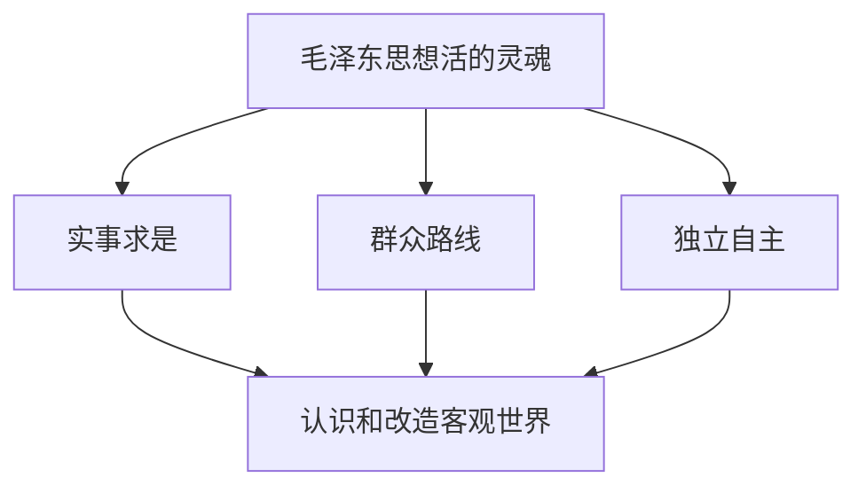

# 1.3 毛泽东思想的历史地位

> 本节依据第一章第三节课件，说明毛泽东思想在马克思主义中国化时代化进程、中国革命和建设实践以及党和人民精神谱系中的地位。重点是掌握毛泽东思想活的灵魂，并形成科学评价毛泽东和毛泽东思想的方法。

## 主要内容

- 马克思主义中国化时代化的第一个重大理论成果
- 毛泽东思想活的灵魂与理论品格
- 中国革命和建设的科学指南
- 精神财富与科学评价原则

---

## 一、基本定位

毛泽东思想是马克思主义中国化时代化的第一个重大理论成果，是马克思列宁主义在中国的运用和发展，是被实践证明了的关于中国革命和建设的正确理论原则和经验总结，是中国共产党集体智慧的结晶，是党必须长期坚持的指导思想。

---

## 二、马克思主义中国化时代化的第一个重大理论成果

### 1. 理论贡献

毛泽东是马克思主义中国化时代化的伟大开拓者和毛泽东思想的主要创立者。他明确提出马克思主义中国化的重大任务，并在以下领域形成独创性理论：

- 新民主主义革命；
- 社会主义革命和社会主义建设；
- 革命军队建设和军事战略；
- 政策和策略；
- 思想政治工作和文化工作；
- 党的建设；
- 国际战略和外交工作。

### 2. 活的灵魂 3点

| 内容   | 基本含义                            | 方法论地位  |
| ---- | ------------------------------- | ------ |
| 实事求是 | 从实际出发，理论联系实际，在实践中检验和发展真理        | 根本思想路线 |
| 群众路线 | 一切为了群众，一切依靠群众，从群众中来，到群众中去       | 根本工作路线 |
| 独立自主 | 坚持把国家和民族发展放在自己力量的基点上，同时学习一切有益经验 | 根本立足点  |
|      |                                 |        |

### 3. 理论品格

- 用通俗语言阐释深刻道理，使理论为人民群众理解和掌握。
- 以民族形式表现马克思主义，形成新鲜活泼、为中国人民喜闻乐见的中国作风和中国气派。
- 确立了推进马克思主义中国化时代化的前进方向、基本原则和基本方法。
- 特别是关于社会主义建设的思想，为开创中国特色社会主义作了重要理论准备。

---

## 三、中国革命和建设的科学指南

### 1. 实践成就 4点

1. 指引党和人民找到新民主主义革命的正确道路，推翻帝国主义、封建主义和官僚资本主义的统治，建立中华人民共和国，实现从封建专制政治向人民民主的伟大飞跃。
2. 指引党和人民找到从新民主主义向社会主义过渡的道路，确立社会主义基本制度，实现中华民族历史上最广泛、最深刻的社会变革。
3. 指导社会主义建设探索，建立独立的、比较完整的工业体系和国民经济体系，为社会主义现代化建设奠定重要物质技术基础。
4. 为改革开放新时期创立中国特色社会主义提供宝贵经验、理论准备和物质基础。

### 2. 仍有现实指导意义的思想

- 正确认识和处理社会主义社会基本矛盾；
- 区分和处理敌我矛盾与人民内部矛盾；
- 调动一切积极因素为社会主义事业服务；
- 走中国工业化道路；
- 完善社会主义政治制度、扩大社会主义民主；
- 实行“百花齐放、百家争鸣”；
- 从思想上建党、加强执政党建设。

---

## 四、中国共产党和中国人民宝贵的精神财富

毛泽东思想形成的历史条件与今天不同，但其科学价值并未降低。它所蕴含的远大理想、实事求是的思想路线、全心全意为人民服务的根本宗旨、自力更生和艰苦奋斗的革命精神，仍是中国人民不断前进的强大精神动力。

---

## 五、科学评价毛泽东和毛泽东思想

### 1. 两种错误倾向

| 错误倾向      | 具体表现                      | 问题所在                 |
| --------- | ------------------------- | -------------------- |
| “两个凡是”式态度 | 认为毛泽东作出的一切决策和指示都必须维护、始终遵循 | 把领袖神化，忽视认识和实践受时代条件限制 |
| 历史虚无主义    | 借毛泽东晚年错误全面否定其历史地位和毛泽东思想   | 抹杀历史功绩，混淆科学理论与个人晚年错误 |

### 2. 正确评价原则

- 革命领袖是人不是神，既不能因其伟大而拒绝纠正错误，也不能因其错误而全盘否定历史功绩。
- 毛泽东的功绩是第一位的，错误是第二位的。
- 必须把经过长期历史检验形成的科学理论——毛泽东思想，同毛泽东晚年所犯的错误区别开来。
- 《关于建国以来党的若干历史问题的决议》对毛泽东和毛泽东思想作出了科学、实事求是的评价，统一了全党认识。
- 应完整准确地理解毛泽东思想，并在新的历史条件和实践中坚持、运用和发展。

---

## 相关笔记

- [[毛概/笔记/0.1 导论——马克思主义中国化时代化的历史进程与理论成果]]
- [[毛概/笔记/2.2 新民主主义革命的总路线和基本纲领]]
- [[毛概/笔记/2.3 新民主主义革命的道路和基本经验]]

---

## 本章小结

- **一个成果**：马克思主义中国化时代化第一次历史性飞跃的理论成果。
- **一个指南**：中国革命和建设的科学指南。
- **一种财富**：党和人民宝贵的精神财富。
- **三个灵魂**：实事求是、群众路线、独立自主。
- **评价原则**：功绩第一、错误第二；区分毛泽东思想与毛泽东晚年错误。
