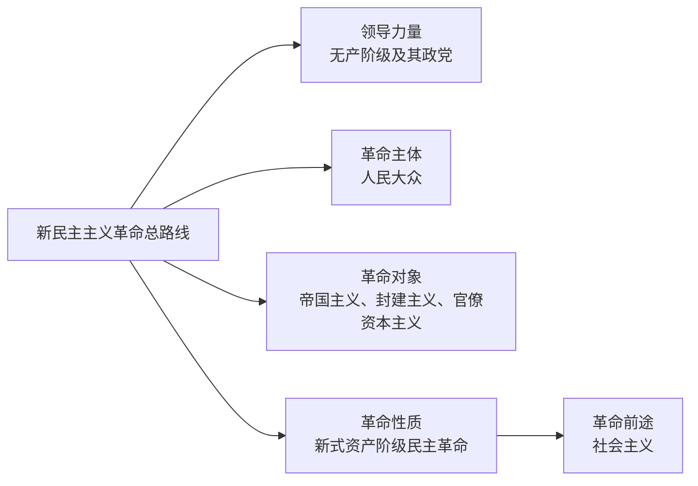

# 2.2 新民主主义革命的总路线和基本纲领

> 本节依据第二章第二节课件，系统回答新民主主义革命“革谁的命、依靠谁、由谁领导、属于什么性质、走向何处”等基本问题，并概括政治、经济、文化三方面基本纲领。

## 主要内容

- 新民主主义革命总路线
- 革命的对象、动力和领导力量
- 革命性质、前途及两个阶段关系
- 新民主主义政治、经济和文化纲领

---

## 一、总路线

新民主主义革命的总路线是：**无产阶级领导的，人民大众的，反对帝国主义、封建主义和官僚资本主义的革命。**

这条总路线集中回答了革命的对象、动力、领导力量、性质和前途等基本问题。

---

## 二、革命对象

| 对象     | 地位与危害                                 | 革命任务                |
| ------ | ------------------------------------- | ------------------- |
| 帝国主义   | 中国人民第一个和最凶恶的敌人；控制中国政治、经济和军事，阻碍中国独立发展  | 推翻帝国主义压迫，实现民族独立     |
| 封建主义   | 帝国主义统治中国和封建军阀专制统治的社会基础；束缚生产力          | 推翻封建地主阶级统治，完成土地革命   |
| 官僚资本主义 | 同外国帝国主义、本国地主阶级和旧式富农密切结合的买办性、封建性、垄断性资本 | 没收官僚资本，使之归新民主主义国家所有 |

不同历史阶段的主要对象会随主要矛盾变化而变化，但帝国主义、封建主义和官僚资本主义构成新民主主义革命的总体对象。

---

## 三、革命动力

| 阶级或阶层   | 革命地位        | 主要特点                                     |
| ------- | ----------- | ---------------------------------------- |
| 无产阶级    | 最基本的动力和领导力量 | 受压迫深、革命性强、组织纪律性强，与先进生产方式相联系              |
| 农民阶级    | 革命主力军       | 人数最多，受封建主义和帝国主义压迫最深；农民问题首先是土地问题          |
| 城市小资产阶级 | 可靠同盟者       | 包括知识分子、小商人、手工业者和自由职业者，受帝国主义、封建主义和大资产阶级压迫 |
| 民族资产阶级  | 动力之一，具有两面性  | 受压迫时有革命性；同帝国主义、封建主义又有联系，经济政治上软弱，容易妥协动摇   |

---

## 四、领导力量

新民主主义革命必须由无产阶级及其政党中国共产党领导，这是新民主主义革命区别于旧民主主义革命的根本标志。

无产阶级领导权不是天然实现的，必须：

1. 率领被领导者向共同敌人作坚决斗争并取得胜利；
2. 给被领导者以物质利益，至少不损害其利益；
3. 对被领导者进行政治教育；
4. 建立以工农联盟为基础的广泛统一战线；
5. 建设坚强的马克思主义政党和党领导的人民军队。

---

## 五、革命性质和前途

### 1. 性质

新民主主义革命仍属于资产阶级民主主义革命，因为它的任务是反帝反封建，而不是一般地消灭资本主义。但它已经不是旧式民主革命，而是发生在世界无产阶级社会主义革命时代、由无产阶级领导、以马克思主义为指导、以社会主义为前途的**新式资产阶级民主革命**。

| 比较项 | 旧民主主义革命 | 新民主主义革命 |
| --- | --- | --- |
| 领导阶级 | 资产阶级 | 无产阶级及其政党 |
| 指导思想 | 资产阶级民主主义思想 | 马克思列宁主义 |
| 群众基础 | 相对狭窄 | 人民大众，尤其是工农联盟 |
| 革命前途 | 资本主义共和国 | 经新民主主义走向社会主义 |
| 世界革命范畴 | 旧的资产阶级世界革命 | 世界无产阶级社会主义革命的一部分 |

### 2. 前途与两阶段关系

中国革命必须分两步走：第一步完成新民主主义革命，建立新民主主义社会；第二步进行社会主义革命，建立社会主义社会。

- 两个阶段性质不同，但相互衔接：民主主义革命是社会主义革命的必要准备，社会主义革命是民主主义革命的必然趋势。
- 要反对把两个阶段割裂的“二次革命论”，也要反对混淆两个阶段、企图一次完成的“一次革命论”。

---

## 六、新民主主义基本纲领

### 1. 政治纲领

推翻帝国主义和封建主义的统治，建立一个无产阶级领导的、以工农联盟为基础的、各革命阶级联合专政的新民主主义共和国。

这一国家既不同于欧美式资产阶级专政共和国，也不同于苏联式无产阶级专政共和国；其国体是各革命阶级联合专政，政体实行民主集中制的人民代表大会制度。

### 2. 经济纲领

| 内容 | 对象 | 目的 |
| --- | --- | --- |
| 没收封建地主阶级的土地归农民所有 | 封建土地所有制 | 解决农民土地问题，解放农村生产力 |
| 没收官僚资产阶级的垄断资本归新民主主义国家所有 | 官僚资本 | 建立国营经济并使之成为领导力量 |
| 保护民族工商业 | 有利于国计民生的民族资本主义经济 | 利用其积极作用，发展社会生产力 |

保护民族工商业不是无条件保护所有私人资本，而是在新民主主义国家政策和法令范围内，保护有利于国计民生、不能操纵国计民生的资本主义经济。

### 3. 文化纲领

新民主主义文化是**无产阶级领导的、人民大众的、反帝反封建的文化**，具有以下特征：

- **民族的**：反对帝国主义压迫，主张中华民族的尊严和独立，吸收外国进步文化但不盲目照搬。
- **科学的**：反对封建思想和迷信，坚持实事求是、客观真理和理论联系实际。
- **大众的**：服务工农大众并逐渐成为人民群众的文化，依靠人民群众建设。

---

## 相关笔记

- [[毛概/笔记/1.3 毛泽东思想的历史地位]]
- [[毛概/笔记/2.3 新民主主义革命的道路和基本经验]]

---

## 本章小结

- **总路线关键词**：无产阶级领导、人民大众、反帝反封建反官僚资本主义。
- **革命主力军**：农民；农民问题的核心是土地问题。
- **根本标志**：无产阶级领导权。
- **革命性质**：新式资产阶级民主革命。
- **革命前途**：社会主义。
- **基本纲领**：政治上联合专政，经济上“没收地主土地、没收官僚资本、保护民族工商业”，文化上民族的科学的大众的文化。
