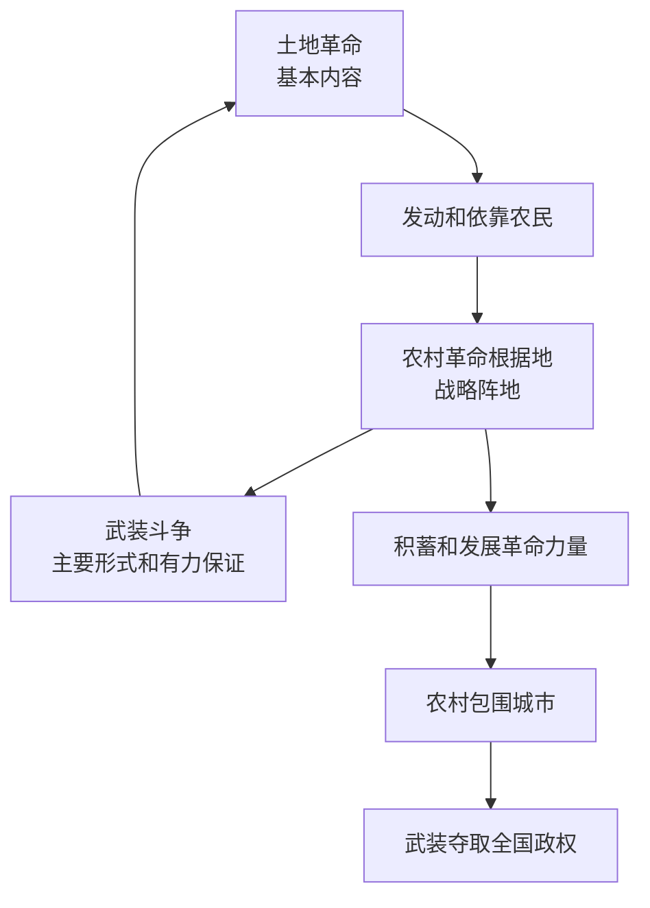
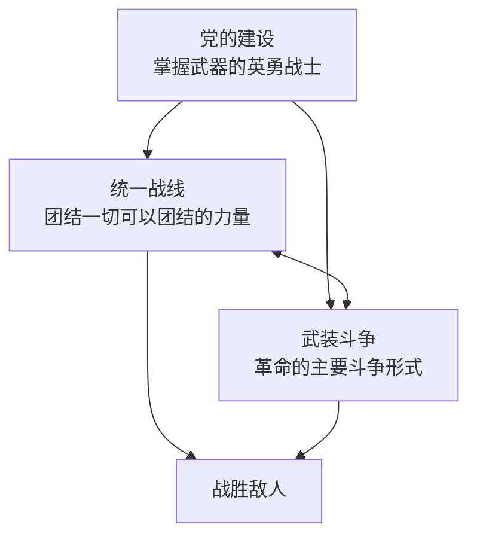

# 2.3 新民主主义革命的道路和基本经验

> 本节依据第二章第三节课件，梳理农村包围城市、武装夺取政权道路的形成条件和基本内容，并总结统一战线、武装斗争、党的建设三大法宝及其相互关系。

## 主要内容

- 农村包围城市道路的探索、必要性和可能性
- 土地革命、武装斗争与根据地建设
- 统一战线、武装斗争、党的建设三大法宝
- 新民主主义革命理论的历史意义

---

## 一、农村包围城市、武装夺取政权的道路

### 1. 道路的探索

- 大革命失败后，党先后发动南昌起义、秋收起义等武装起义，并在八七会议上确定土地革命和武装反抗国民党反动派的总方针。
- 毛泽东在秋收起义后率部向井冈山进军，把工作重心由城市转向农村，开辟第一个农村革命根据地。
- 《中国的红色政权为什么能够存在？》《井冈山的斗争》《星星之火，可以燎原》等著作初步形成农村包围城市、武装夺取政权的理论。
- 1938年党的六届六中全会以后，这一道路理论逐步成为全党的共识。

### 2. 必要性

1. **中国没有资产阶级民主制度**：帝国主义和封建势力实行专制统治，革命不能通过合法议会斗争取得胜利，只能以武装革命反对武装反革命。
2. **中国是农业大国**：农民占人口绝大多数，是革命主力军；无产阶级必须深入农村，解决农民土地问题。
3. **敌人长期占据中心城市**：革命力量必须到敌人统治薄弱的农村积蓄和发展力量，最后夺取全国政权。

### 3. 可能性

- 中国政治经济发展不平衡，反动统治集团内部存在矛盾和战争，为农村革命根据地提供生存缝隙。
- 广大农村深受压迫，群众革命愿望强烈，经历过大革命洗礼的地区具备较好群众基础。
- 全国革命形势继续向前发展，为根据地提供客观条件。
- 相当力量的正式红军存在，是红色政权存在的必要条件。
- 共产党组织坚强有力、政策正确，是红色政权长期存在和发展的主观条件。

### 4. 三者关系

| 要素 | 地位 | 相互作用 |
| --- | --- | --- |
| 土地革命 | 民主革命的基本内容 | 发动农民、建立群众基础，为战争和根据地提供人力物力 |
| 武装斗争 | 中国革命的主要形式 | 为土地革命和根据地建设提供强有力保证 |
| 农村革命根据地 | 革命的战略阵地 | 保存和发展革命力量，是土地革命和武装斗争的依托 |

### 5. 理论意义

这条道路从中国实际出发，独创性地解决了在半殖民地半封建的东方大国如何开展革命的问题，是马克思主义基本原理同中国革命具体实际相结合的典范，丰富和发展了马克思列宁主义关于革命道路的理论。

---

## 二、新民主主义革命的三大法宝

毛泽东在《〈共产党人〉发刊词》中总结中国革命经验，指出**统一战线、武装斗争、党的建设**是中国共产党在中国革命中战胜敌人的三大法宝。

### 1. 统一战线

建立统一战线的必要性来自中国社会“**两头小、中间大**”的阶级结构，以及中国革命长期性、残酷性和发展不平衡性。

| 联盟 | 构成 | 地位 |
| --- | --- | --- |
| 第一个联盟 | 工人阶级同农民阶级、广大知识分子及其他劳动者 | 统一战线的基础和主要依靠 |
| 第二个联盟 | 工人阶级同可以合作的非劳动人民，主要是民族资产阶级 | 不可缺少的重要联盟 |

主要经验：

- 坚持以工农联盟为基础并扩大统一战线；
- 对资产阶级实行又联合又斗争的政策；
- 区分进步势力、中间势力和顽固势力，发展进步势力、争取中间势力、孤立顽固势力；
- 坚持无产阶级及其政党在统一战线中的独立自主原则和领导权。

### 2. 武装斗争

- 中国革命的特点和优点之一，是武装的革命反对武装的反革命。
- 必须坚持党对人民军队的绝对领导，使军队成为执行革命政治任务的武装集团，全心全意为人民服务。
- 人民军队政治工作的基本原则包括官兵一致、军民一致、瓦解敌军和优待俘虏。
- 必须根据敌强我弱和战争长期性的特点，形成符合人民战争规律的战略战术。

### 3. 党的建设

- **思想建设**：把思想建设放在首位，以无产阶级思想克服各种非无产阶级思想。
- **组织建设**：贯彻民主集中制，严明纪律，建设坚强组织。
- **作风建设**：形成理论联系实际、密切联系群众、批评与自我批评三大优良作风。
- **政治建设**：党的建设必须同党的政治路线紧密联系，围绕正确政治路线加强党。

### 4. 三大法宝的关系

统一战线和武装斗争是战胜敌人的两个基本武器；党的组织则是掌握这两个武器、实行对敌冲锋陷阵的英勇战士。三者必须相互联系，不能割裂。

---

## 三、新民主主义革命理论的意义

1. 科学回答了中国革命的对象、动力、领导力量、性质、前途、道路和基本经验等根本问题。
2. 形成完整的新民主主义革命理论，丰富和发展了马克思主义革命理论。
3. 指导党领导人民取得新民主主义革命胜利，建立中华人民共和国，实现民族独立和人民解放。
4. 改变世界政治力量对比，鼓舞殖民地半殖民地人民争取民族独立和解放。
5. 为社会主义革命和建设创造必要前提，也为当代处理统一战线、群众工作、党的建设等问题提供重要方法论启示。

---

## 相关笔记

- [[毛概/笔记/2.2 新民主主义革命的总路线和基本纲领]]
- [[毛概/笔记/1.3 毛泽东思想的历史地位]]

---

## 本章小结

- **革命道路**：农村包围城市、武装夺取政权。
- **道路内容**：土地革命、武装斗争、农村革命根据地建设。
- **三大法宝**：统一战线、武装斗争、党的建设。
- **统一战线基础**：工农联盟。
- **人民军队根本原则**：党对军队的绝对领导。
- **党的三大优良作风**：理论联系实际、密切联系群众、批评与自我批评。
