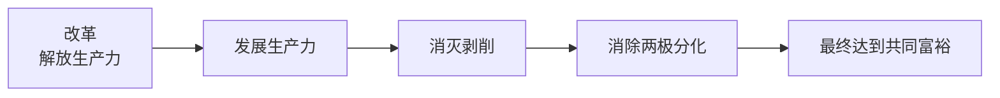
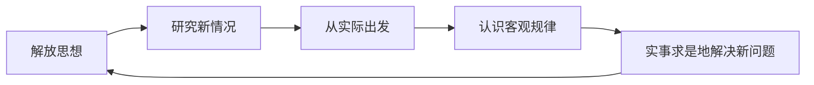

# 6.1 邓小平理论首要的基本的理论问题和精髓

> 本节依据第六章第一节课件，围绕“什么是社会主义、怎样建设社会主义”这一首要理论问题，阐释社会主义本质的科学概括，并说明解放思想、实事求是作为邓小平理论精髓的方法论意义。

## 主要内容

- 邓小平理论首要的基本理论问题
- 社会主义本质的形成、内容与意义
- 解放思想和实事求是的辩证统一
- 三个有利于标准与实践方法

---

## 一、首要的基本理论问题

邓小平理论围绕“**什么是社会主义、怎样建设社会主义**”这一首要的基本理论问题展开。问题的关键，是在坚持社会主义基本制度的基础上进一步认清社会主义本质，摆脱对社会主义的僵化理解。

### 1. 社会主义本质认识的发展

| 时间 | 认识发展 |
| --- | --- |
| 1980年 | 提出社会主义要发展生产力，并逐步改善人民物质文化生活 |
| 1985年 | 强调贫穷不是社会主义，社会主义要消灭贫穷 |
| 1986年 | 强调社会主义原则首先是发展生产，其次是共同富裕 |
| 1990年 | 从生产力和共同富裕角度继续概括社会主义本质 |
| 1992年南方谈话 | 对社会主义本质作出完整概括 |

### 2. 社会主义本质

> 社会主义的本质，是解放生产力，发展生产力，消灭剥削，消除两极分化，最终达到共同富裕。

| 层次 | 内容 | 含义 |
| --- | --- | --- |
| 生产力 | 解放生产力、发展生产力 | 揭示社会主义的根本任务和发展动力 |
| 生产关系 | 消灭剥削、消除两极分化 | 体现社会主义制度区别于剥削制度的根本要求 |
| 价值目标 | 最终达到共同富裕 | 体现社会主义发展的根本目的 |

这一概括把生产力发展与社会主义生产关系、发展手段与发展目标统一起来，突破了只从具体模式和制度特征理解社会主义的局限，为判断改革开放和现代化建设方向提供根本尺度。

---

## 二、邓小平理论的精髓

邓小平理论的精髓是**解放思想、实事求是**。

### 1. 形成与作用

- 党的十一届三中全会重新确立实事求是的思想路线，实现思想路线上的拨乱反正。
- 邓小平在《解放思想，实事求是，团结一致向前看》中强调，只有解放思想，才能正确解决历史遗留问题和现实新问题。
- 解放思想使党突破僵化社会主义模式，从中国国情出发探索中国特色社会主义道路。
- 实事求是要求从社会主义初级阶段这一最大实际出发制定路线方针政策。
- “三个有利于”标准把实践作为判断改革和各方面工作是非得失的根本尺度。

### 2. 辩证统一关系

| 解放思想 | 实事求是 |
| --- | --- |
| 在马克思主义指导下，打破习惯势力和主观偏见束缚，研究新情况、解决新问题 | 从客观实际出发，找出事物固有规律，以此作为行动向导 |
| 是实事求是的前提 | 是解放思想的目的和归宿 |
| 不是脱离实际的任意想象 | 不是因循守旧或照搬既有结论 |

---

## 三、方法论意义

1. 坚持马克思主义基本原理，又不拘泥于个别现成结论。
2. 从中国国情和时代条件出发，把实践作为检验真理的唯一标准。
3. 用发展的眼光认识社会主义，在改革实践中不断总结新经验。
4. 以是否有利于发展社会主义社会生产力、增强社会主义国家综合国力、提高人民生活水平检验工作成效。

---

## 相关笔记

- [[毛概/笔记/6.2 邓小平理论的主要内容]]
- [[毛概/笔记/0.1 导论——马克思主义中国化时代化的历史进程与理论成果]]

---

## 本章小结

- **首要问题**：什么是社会主义、怎样建设社会主义。
- **社会主义本质**：解放和发展生产力，消灭剥削、消除两极分化，最终达到共同富裕。
- **理论精髓**：解放思想、实事求是。
- **判断标准**：三个有利于。
- **逻辑关系**：解放思想是实事求是的前提，实事求是是解放思想的目的和归宿。
