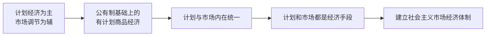
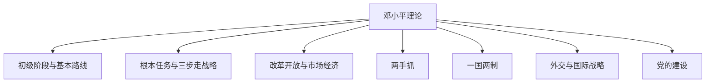

# 6.2 邓小平理论的主要内容

> 本节依据第六章第二节课件，从社会主义初级阶段和基本路线出发，系统整理发展战略、改革开放、市场经济、文明建设、祖国统一、外交战略和党的建设等邓小平理论的主要内容。

## 主要内容

- 社会主义初级阶段理论和党的基本路线
- 社会主义根本任务与三步走发展战略
- 改革开放和社会主义市场经济理论
- 两手抓与一国两制
- 外交国际战略和党的建设理论

---

## 一、社会主义初级阶段理论和党的基本路线

### 1. 社会主义初级阶段理论

社会主义初级阶段包括两层含义：

1. 我国已经进入社会主义社会，必须坚持而不能离开社会主义；
2. 我国社会主义还处于并将长期处于初级阶段，必须从这一实际出发，不能超越阶段。

这一阶段特指我国在生产力落后、商品经济不发达条件下建设社会主义必然经历的阶段，既不同于社会主义经济基础尚未奠定的过渡时期，也不同于已经实现社会主义现代化的阶段。人口多、底子薄、生产力落后决定了阶段的长期性、复杂性和艰巨性。“社会主义初级阶段”是当代中国的基本国情和最大实际，是制定路线方针政策的总依据。

### 2. 党的基本路线

党的十三大提出社会主义初级阶段基本路线，核心可概括为“**一个中心、两个基本点**”。

| 构成 | 内容 | 地位 |
| --- | --- | --- |
| 领导力量和依靠力量 | 领导和团结全国各族人民 | 中国共产党领导，依靠人民群众 |
| 一个中心 | 以经济建设为中心 | 回答根本任务，是最根本的拨乱反正 |
| 两个基本点之一 | 坚持四项基本原则 | 立国之本和政治保证 |
| 两个基本点之二 | 坚持改革开放 | 强国之路、发展动力和外部条件 |
| 根本立足点 | 自力更生、艰苦创业 | 实现目标的基本方针 |
| 奋斗目标 | 建设社会主义现代化国家 | 后续拓展为富强民主文明和谐美丽的社会主义现代化强国 |

四项基本原则是坚持社会主义道路、人民民主专政、中国共产党领导、马克思列宁主义毛泽东思想。经济建设、四项基本原则和改革开放必须统一于中国特色社会主义实践。

---

## 二、社会主义根本任务和发展战略

### 1. 根本任务

- 社会主义的根本任务是发展生产力，党和国家工作重点是经济建设。
- 社会主义制度优越性最终要体现为生产力更快发展、国家富强和人民生活改善。
- 科学技术是第一生产力，四个现代化的关键是科学技术现代化；科技发展离不开教育和人才。
- “863计划”体现了跟踪世界先进水平、发展中国高技术的战略部署。

### 2. “三步走”发展战略

| 步骤 | 时间目标 | 主要任务 |
| --- | --- | --- |
| 第一步 | 20世纪80年代末 | 国民生产总值比1980年翻一番，解决人民温饱问题 |
| 第二步 | 20世纪末 | 国民生产总值再翻一番，人民生活达到小康水平 |
| 第三步 | 21世纪中叶 | 人均国民生产总值达到中等发达国家水平，人民生活比较富裕，基本实现现代化 |

实现战略还需要：

- 抓住农业、能源和交通、教育和科学三个战略重点；
- 实行台阶式发展，抓住机遇，同时讲求效益、稳步协调；
- 农业经历家庭联产承包责任制和适度规模经营、发展集体经济“两个飞跃”；
- 允许一部分地区、一部分人通过诚实劳动和合法经营先富，先富带动后富，最终实现共同富裕；
- 正确处理沿海先发展与带动内地发展的“两个大局”。

---

## 三、社会主义改革开放和社会主义市场经济

### 1. 改革开放理论

- 改革是中国的第二次革命，是社会主义社会发展的直接动力，是社会主义制度的自我完善和发展，而不是否定社会主义基本制度。
- 改革的实质是改变束缚生产力发展的体制，建立充满生机和活力的新体制，并相应改革政治体制和其他体制。
- 改革要“胆子要大、步子要稳”，以“三个有利于”判断是非得失。
- 对外开放是基本国策。世界是开放的世界，中国的发展离不开世界；开放必须同独立自主、自力更生相结合。
- 改革从农村家庭联产承包责任制突破，逐步推进城市改革；开放从经济特区扩展到沿海、沿边、沿江和内陆，最终形成全方位开放格局。

### 2. 社会主义市场经济理论

理论突破在于：计划和市场不是区分社会主义与资本主义的本质标志，而都是经济手段。社会主义也可以发展市场经济，并使市场机制同社会主义基本制度相结合。

---

## 四、“两手抓，两手都要硬”

| 两手 | 内在关系 |
| --- | --- |
| 物质文明与精神文明 | 相辅相成；物质文明提供条件，精神文明提供精神动力、智力支持和方向保证 |
| 建设与法制 | 推进现代化必须同步发展社会主义民主法制 |
| 改革开放与惩治腐败 | 激发活力的同时防止权力腐败和社会风气恶化 |

精神文明重在建设。只重经济而忽视精神文明，会形成“一手硬、一手软”，最终反过来破坏现代化成果。“两手抓”体现两点论和重点论的统一。

---

## 五、“一国两制”与祖国统一

“一国两制”是在坚持一个中国和国家主体实行社会主义制度的前提下，为和平解决台湾问题并进一步解决香港、澳门问题提出的科学构想。

| 基本内容 | 说明 |
| --- | --- |
| 一个中国 | 世界上只有一个中国，港澳台都是中国不可分割的组成部分 |
| 两种制度 | 大陆实行社会主义制度，港澳台原有社会制度和生活方式长期不变 |
| 高度自治 | 统一后设立特别行政区，在中央政府全面管治下依法享有高度自治权 |
| 和平统一为主 | 尽最大努力争取和平统一，但不承诺放弃使用武力 |
| 寄希望于台湾人民 | 依靠包括台湾同胞在内的全体中华儿女推进统一 |

这一构想把坚持国家主权和统一的原则性同照顾历史与现实的灵活性结合起来，创造性发展了马克思主义国家学说。其实施成功解决香港、澳门回归问题，并为推进祖国完全统一提供基本方针。

---

## 六、中国特色社会主义外交和国际战略

### 1. 时代主题判断

- 世界大战在较长时期内可以避免，可以争取和平环境；
- 和平与发展是当今世界两大带有全球性的战略问题；
- 和平是发展的前提，发展是维护和平的基础；
- 和平与发展成为主题，不等于两大问题已经解决。

### 2. 外交原则

- 维护国家独立和主权，促进世界和平与发展；
- 奉行独立自主的和平外交政策和真正的不结盟政策；
- 反对霸权主义和强权政治；
- 以和平共处五项原则为基础发展同各国关系，推动建立和平、稳定、公正、合理的国际新秩序；
- 不以社会制度和意识形态异同决定国家关系亲疏；
- 对复杂国际局势保持冷静观察、稳住阵脚、沉着应付，集中力量办好自己的事。

---

## 七、党的建设理论

建设中国特色社会主义，关键在坚持、加强和改善党的领导。

| 建设领域 | 主要要求 |
| --- | --- |
| 理论建设 | 学习马克思主义，增强工作的原则性、系统性、预见性和创造性 |
| 组织建设 | 坚持民主集中制，加强基层组织，选拔德才兼备干部 |
| 干部队伍 | 推进革命化、年轻化、知识化、专业化，选拔坚持改革开放且实绩突出的人才 |
| 作风建设 | 发扬理论联系实际、密切联系群众、批评与自我批评作风，反对腐败和特殊化 |
| 制度建设 | 党在宪法和法律范围内活动，健全党内民主、干部、人事和监督制度；制度更具根本性、全局性、稳定性和长期性 |

此外，邓小平理论还强调依靠工人、农民、知识分子和各族人民，巩固最广泛的爱国统一战线；坚持党对人民军队的绝对领导，加强军队革命化、现代化、正规化建设。

---

## 八、内容体系

---

## 相关笔记

- [[毛概/笔记/6.1 邓小平理论首要的基本的理论问题和精髓]]
- [[毛概/笔记/7.1 三个代表重要思想的核心观点]]
- [[毛概/笔记/0.1 导论——马克思主义中国化时代化的历史进程与理论成果]]

---

## 本章小结

- **总依据**：社会主义初级阶段。
- **基本路线**：一个中心、两个基本点。
- **根本任务**：发展生产力；科学技术是第一生产力。
- **发展战略**：三步走、台阶式发展、先富带后富并走向共同富裕。
- **改革性质**：社会主义制度的自我完善和发展。
- **市场经济突破**：计划和市场都是经济手段。
- **文明建设**：两手抓、两手都要硬。
- **国家统一**：一国两制。
- **时代主题**：和平与发展。
- **事业关键**：坚持、加强和改善党的领导。
