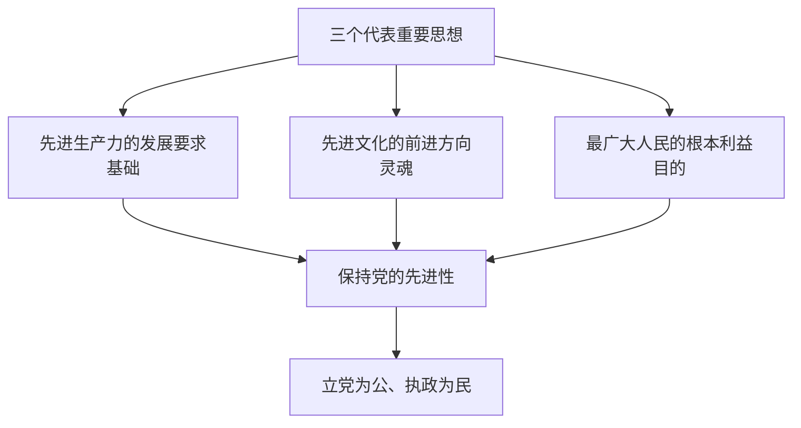

# 7.1 三个代表重要思想的核心观点

> 本节依据第七章第一节课件，分别阐释党始终代表先进生产力发展要求、先进文化前进方向和最广大人民根本利益的内涵，揭示三者作为基础、灵魂和目的的统一关系。

## 主要内容

- 代表先进生产力发展要求
- 代表先进文化前进方向
- 代表最广大人民根本利益
- 三个代表之间的内在联系

---

## 一、核心内容

中国共产党必须始终：

1. 代表中国先进生产力的发展要求；
2. 代表中国先进文化的前进方向；
3. 代表中国最广大人民的根本利益。

三者相互联系、相互促进。发展先进生产力是基础，发展先进文化是灵魂，实现最广大人民根本利益是目的；关键在坚持与时俱进，核心在坚持党的先进性，本质在坚持执政为民。

---

## 二、始终代表中国先进生产力的发展要求

### 1. 基本含义

党的理论、路线、纲领、方针、政策和各项工作，必须符合生产力发展规律，推动先进生产力解放和发展，并通过发展生产力不断提高人民生活水平。

### 2. 主要要求

- 社会主义的根本任务是发展生产力，促进先进生产力发展是党保持先进性的根本体现。
- 革命、建设和改革都要调整不适应生产力发展的生产关系和上层建筑，为生产力发展开辟道路。
- 对落后生产方式既不能脱离实际简单排斥，也不能保护落后，而应创造条件逐步改造、改进和提高。
- 工人、农民和知识分子是根本力量；改革开放后出现的新的社会阶层也是中国特色社会主义事业建设者。
- 人是生产力中最活跃的因素，必须把人才资源作为第一资源，抓住培养、吸引和使用人才三个环节。
- 发展生产力必须依靠知识创新和科技创新，建设国家创新体系，掌握核心技术和自主知识产权，促进科技成果转化。
- 生产关系和上层建筑必须随先进生产力发展不断完善。

---

## 三、始终代表中国先进文化的前进方向

### 1. 基本定位

先进文化是面向现代化、面向世界、面向未来的，民族的科学的大众的社会主义文化。发展先进文化就是发展中国特色社会主义文化、建设社会主义精神文明，为现代化建设提供精神动力和智力支持。

### 2. 方向和方针

| 方面 | 要求 |
| --- | --- |
| 指导思想 | 坚持马克思主义在意识形态领域的指导地位 |
| 服务方向 | 为人民服务、为社会主义服务 |
| 基本方针 | 百花齐放、百家争鸣 |
| 育人要求 | 以科学理论武装人、正确舆论引导人、高尚精神塑造人、优秀作品鼓舞人 |
| 文化生态 | 弘扬主旋律与提倡多样化统一，支持健康文化、改造落后文化、抵制腐朽文化 |

### 3. 重点任务

- 弘扬以爱国主义为核心，包含团结统一、爱好和平、勤劳勇敢、自强不息的民族精神，并同党领导人民形成的时代精神结合。
- 加强社会主义思想道德建设，以为人民服务为核心、集体主义为原则、诚实守信为重点，加强社会公德、职业道德和家庭美德。
- 改进思想政治工作，把解决思想问题同解决实际问题结合，增强针对性和实效性。
- 把教育置于优先发展战略地位，培养德智体美全面发展的社会主义建设者和接班人。
- 繁荣哲学社会科学和社会主义文艺，发挥新闻媒体正确舆论导向作用。
- 推进文化体制改革，坚持社会效益优先，实现社会效益与经济效益统一；一手抓繁荣，一手抓管理。

---

## 四、始终代表中国最广大人民的根本利益

### 1. 基本含义

党的全部工作必须以最广大人民的根本利益为出发点和归宿，发挥人民积极性、主动性、创造性，使人民在社会发展基础上不断获得切实的经济、政治和文化利益。

### 2. 理论依据

- 人民是历史创造者，是决定国家前途和命运的根本力量。
- 党来自人民、植根人民、服务人民，除了人民利益没有自己的特殊利益。
- 人心向背是决定一个政党、一个政权兴亡的根本性因素。
- 尊重社会发展规律与尊重人民历史主体地位、为崇高理想奋斗与为人民谋利益、完成党的工作与实现人民利益必须相统一。

### 3. 实践要求

1. 实现好、维护好、发展好最广大人民的根本利益。
2. 兼顾不同阶层和群体的具体利益，使全体人民朝共同富裕方向前进。
3. 让工人、农民、知识分子和其他群众共同享有改革发展成果。
4. 正确处理个人与集体、局部与整体、当前与长远等利益关系，最大多数人的利益始终是最紧要、最具决定性的因素。
5. 从群众最关心、最迫切的问题入手，解决生产生活困难，特别关心困难群众。
6. 坚持发展为了人民、发展依靠人民、发展成果由人民共享。

---

## 相关笔记

- [[毛概/笔记/7.2 三个代表重要思想的主要内容]]
- [[毛概/笔记/6.2 邓小平理论的主要内容]]
- [[毛概/笔记/8.1 科学发展观的科学内涵]]

---

## 本章小结

| 内容 | 关键词 |
| --- | --- |
| 先进生产力 | 基础、根本任务、人才第一资源、科技创新 |
| 先进文化 | 灵魂、社会主义精神文明、民族科学大众、思想道德建设 |
| 人民根本利益 | 目的、人心向背、共同富裕、执政为民 |
