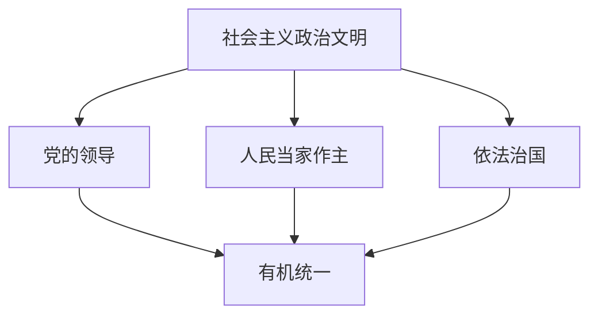

# 7.2 三个代表重要思想的主要内容

> 本节依据第七章第二节课件，梳理发展第一要务、社会主义市场经济、全面小康、政治文明、对外开放和党的建设新的伟大工程，展现“三个代表”重要思想的完整理论体系。

## 主要内容

- 发展是党执政兴国的第一要务
- 社会主义市场经济体制和全面建设小康社会
- 社会主义政治文明建设
- 引进来与走出去相结合的开放战略
- 党的建设新的伟大工程

---

## 一、发展是党执政兴国的第一要务

### 1. 为什么必须抓发展

- 中国特色社会主义依靠发展巩固和推进，社会主义制度优越性必须通过发展体现。
- 发展关系人心向背、事业兴衰，是增强综合国力、应对国际竞争的根本途径。
- 提高人民生活水平、实现民族复兴和祖国统一、促进世界和平与发展，都要依靠发展。
- 必须用发展的眼光、思路和办法解决前进中的问题。

### 2. 怎样理解发展

- 发展不是单纯经济增长，而是物质文明、政治文明、精神文明协调发展。
- 物质文明提供物质条件，政治文明提供政治保证和法律保障，精神文明提供思想保证、精神动力和智力支持。
- 发展既要满足人民现实物质文化需要，也要促进人的全面发展；社会发展与人的全面发展相互促进、永无止境。
- 必须正确处理改革、发展、稳定关系：**改革是动力，发展是目的，稳定是前提**；把改革力度、发展速度和社会可承受程度统一起来，以改善人民生活为结合点。
- 坚持发展必须毫不动摇地坚持社会主义初级阶段基本路线，尤其坚持以经济建设为中心。

---

## 二、建立社会主义市场经济体制

### 1. 基本定位

社会主义市场经济同社会主义基本制度结合，既发挥市场经济长处，也发挥社会主义制度优越性。党的十四大确立建立社会主义市场经济体制的改革目标，党的十四届三中全会勾画其基本框架。

### 2. 主要制度建设

| 领域 | 主要要求 |
| --- | --- |
| 所有制实现形式 | 探索公有制特别是国有制多种有效实现形式，推进股份制和现代企业制度，做到产权清晰、权责明确、政企分开、管理科学 |
| 市场与调控 | 发挥市场配置资源的基础性作用，建设统一开放竞争有序的市场体系，同时完善宏观调控 |
| 政府职能 | 加强经济调节、市场监管、社会管理和公共服务，主要运用经济和法律手段调控 |
| 分配制度 | 坚持按劳分配为主体、多种分配方式并存，允许劳动、资本、技术、管理等按贡献参与分配 |
| 效率与公平 | 初次分配注重效率，再分配注重公平；规范秩序、调节过高收入、取缔非法收入，走向共同富裕 |
| 社会保障 | 建立与经济发展水平相适应的养老、医疗、失业、最低生活保障等制度，并逐步覆盖农村 |

---

## 三、全面建设小康社会

20世纪末人民生活总体达到小康，但仍是**低水平、不全面、不平衡**的小康，表现为生产率和人均财富不高、精神与发展性消费不足、城乡区域差距较大、就业社保和资源环境压力突出、制度建设仍不完善。

党的十五大对第三步战略目标作出规划；党的十六大提出在21世纪头20年集中力量建设惠及十几亿人口的更高水平小康社会，使经济更加发展、民主更加健全、科教更加进步、文化更加繁荣、社会更加和谐、人民生活更加殷实。

全面建设小康社会是现代化第三步战略承上启下的发展阶段，也是完善社会主义市场经济和扩大开放的关键阶段。

---

## 四、建设社会主义政治文明

社会主义现代化要实现物质文明、政治文明、精神文明全面发展。政治文明建设最根本的是坚持**党的领导、人民当家作主、依法治国有机统一**。

| 原则 | 地位 |
| --- | --- |
| 党的领导 | 人民当家作主和依法治国的根本保证 |
| 人民当家作主 | 社会主义民主政治的本质要求 |
| 依法治国 | 党领导人民治理国家的基本方略 |

主要任务：

- 坚持人民代表大会制度、中国共产党领导的多党合作和政治协商制度、民族区域自治制度，扩大基层民主；
- 建设社会主义法治国家，使民主制度化、法律化；
- 积极稳妥推进政治体制改革，使社会主义民主政治制度化、规范化、程序化，不照搬西方政治制度模式；
- 推进决策科学化民主化，转变政府职能，提高行政效率，深化干部人事制度改革；
- 尊重和保障人权，把人权普遍性原则同本国国情结合；对发展中国家，生存权、发展权是最基本最重要的人权，维护人权不能脱离国家主权。

---

## 五、实施“引进来”和“走出去”相结合的开放战略

- 对外开放是长期基本国策，要利用国内国际两个市场、两种资源，以开放促改革、促发展。
- 坚持全方位、多层次、宽领域开放，提高开放质量和水平。
- 2001年中国加入世界贸易组织，标志对外开放进入新阶段；加入原则包括中国和世贸组织相互需要、以发展中国家条件加入、权利义务平衡。
- 经济特区和浦东新区要继续发挥技术、管理、知识和对外政策窗口作用。
- “引进来”和“走出去”是对外开放的两个轮子：既利用外国资金、技术和管理经验，也支持有条件企业对外投资、开拓国外市场、形成跨国企业和品牌。
- 学习人类优秀文明成果要坚持两点论：大胆学习有益成果，同时抵制腐朽内容。
- 扩大开放必须维护国家主权和经济社会安全，防范国际风险，坚持独立自主、自力更生。

---

## 六、推进党的建设新的伟大工程

### 1. 总体要求

围绕“建设什么样的党、怎样建设党”，以改革精神研究解决党的建设问题，使党始终保持先进性和纯洁性，充满创造力、凝聚力和战斗力。坚持党的领导，核心是坚持党的先进性；重点是加强党的执政能力建设。

### 2. 执政能力与两大课题

- 提高科学判断形势、驾驭市场经济、应对复杂局面、依法执政、总揽全局的能力。
- 解决提高党的领导水平和执政水平、提高拒腐防变和抵御风险能力两大历史性课题。

### 3. 建设任务

| 方面 | 主要内容 |
| --- | --- |
| 理论武装 | 用马克思主义武装全党，在改造客观世界同时改造主观世界 |
| 纲领统一 | 把共产主义最高纲领同社会主义初级阶段最低纲领统一于中国特色社会主义实践 |
| 民主集中制 | 保障党员民主权利，完善党代会和党委制度，坚持集体领导、民主集中、个别酝酿、会议决定 |
| 干部人才 | 坚持革命化、年轻化、知识化、专业化和德才兼备、群众公认、注重实绩的用人导向 |
| 领导干部修养 | 讲学习、讲政治、讲正气，树立正确世界观、人生观、价值观和权力观、地位观、利益观 |
| 基层组织 | 扩大党的工作覆盖面，提高农村、企业、社区及新社会组织基层党组织凝聚力和战斗力 |
| 管党治党 | 坚持党要管党、从严治党，把思想、政治、组织、作风和制度建设贯通起来 |
| 联系群众 | 最大政治优势是密切联系群众，最大危险是脱离群众；坚持立党为公、执政为民 |

作风建设要落实“八个坚持、八个反对”，解决思想作风、学风、工作作风、领导作风和干部生活作风问题，核心是保持党同人民群众的血肉联系。

此外，“三个代表”重要思想还包括与时俱进、社会主义初级阶段基本纲领、国防和军队建设、爱国统一战线、外交和国际战略、祖国完全统一和发展两岸关系等内容。

---

## 相关笔记

- [[毛概/笔记/7.1 三个代表重要思想的核心观点]]
- [[毛概/笔记/8.1 科学发展观的科学内涵]]
- [[毛概/笔记/6.2 邓小平理论的主要内容]]

---

## 本章小结

- **第一要务**：发展。
- **改革目标**：建立社会主义市场经济体制。
- **阶段目标**：全面建设小康社会。
- **政治文明根本**：党的领导、人民当家作主、依法治国有机统一。
- **开放战略**：引进来与走出去相结合。
- **党建重点**：执政能力建设；坚持党要管党、从严治党。
