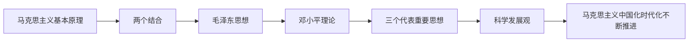

# 毛概课程笔记

> 本索引汇总现有毛概课件对应的九篇章节笔记，按马克思主义中国化时代化的历史进程组织知识。它既提供章节入口，也用理论问题和高频关键词串联毛泽东思想、邓小平理论、“三个代表”重要思想和科学发展观。

## 主要内容

- 马克思主义中国化时代化的课程主线
- 毛概章节笔记目录
- 各理论成果的核心问题与高频框架
- 当前课件覆盖范围与笔记使用说明

---

## 一、课程主线

上述理论成果形成于不同历史条件，回答不同重大时代课题，但都坚持马克思主义立场、观点和方法，服务于中国革命、建设、改革和民族复兴实践。

---

## 二、笔记目录

| 模块 | 笔记 | 核心内容 |
| --- | --- | --- |
| 导论 | [[毛概/笔记/0.1 导论——马克思主义中国化时代化的历史进程与理论成果]] | 提出、内涵、历史进程、成果关系与学习方法 |
| 毛泽东思想 | [[毛概/笔记/1.3 毛泽东思想的历史地位]] | 第一次历史性飞跃、科学指南、精神财富与科学评价 |
| 新民主主义革命 | [[毛概/笔记/2.2 新民主主义革命的总路线和基本纲领]] | 对象、动力、领导、性质、前途及政治经济文化纲领 |
| 新民主主义革命 | [[毛概/笔记/2.3 新民主主义革命的道路和基本经验]] | 农村包围城市、武装夺取政权与三大法宝 |
| 邓小平理论 | [[毛概/笔记/6.1 邓小平理论首要的基本的理论问题和精髓]] | 社会主义本质、解放思想、实事求是 |
| 邓小平理论 | [[毛概/笔记/6.2 邓小平理论的主要内容]] | 初级阶段、基本路线、改革开放、市场经济、一国两制等 |
| “三个代表”重要思想 | [[毛概/笔记/7.1 三个代表重要思想的核心观点]] | 先进生产力、先进文化、最广大人民根本利益 |
| “三个代表”重要思想 | [[毛概/笔记/7.2 三个代表重要思想的主要内容]] | 第一要务、市场经济、小康社会、政治文明、开放与党建 |
| 科学发展观 | [[毛概/笔记/8.1 科学发展观的科学内涵]] | 第一要义、核心立场、基本要求和根本方法 |

---

## 三、高频框架

| 理论 | 首要或核心问题 | 高频关键词 |
| --- | --- | --- |
| 毛泽东思想 | 中国革命和建设道路 | 实事求是、群众路线、独立自主；新民主主义革命；三大法宝 |
| 邓小平理论 | 什么是社会主义、怎样建设社会主义 | 社会主义本质、初级阶段、一个中心两个基本点、改革开放、市场经济 |
| “三个代表”重要思想 | 建设什么样的党、怎样建设党 | 先进生产力、先进文化、人民根本利益、发展第一要务、执政能力 |
| 科学发展观 | 实现什么样的发展、怎样发展 | 发展、以人为本、全面协调可持续、统筹兼顾 |

---

## 四、使用说明

- 当前目录严格依据 `毛概/课件` 中现有九份 Markdown 课件整理。
- 课件未提供的章节和小节没有凭空补写；后续加入新课件时，可沿现有编号继续扩充。
- 所有图示均为 Obsidian 原生 Mermaid 代码块，所有表格均为 Markdown 管道表格，笔记正文不包含图片。
- 复习时可先阅读导论和本索引，再按毛泽东思想、邓小平理论、“三个代表”重要思想、科学发展观的顺序进入章节笔记。

---

## 本章小结

- 当前九份课件均已建立一一对应的章节笔记，并由本索引统一链接。
- 各篇笔记使用相同的 Obsidian 原生结构、表格和 Mermaid 规范。
- 课程知识主线是马克思主义基本原理同中国具体实际、中华优秀传统文化相结合并不断实现理论创新。
