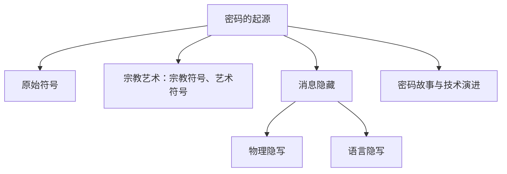
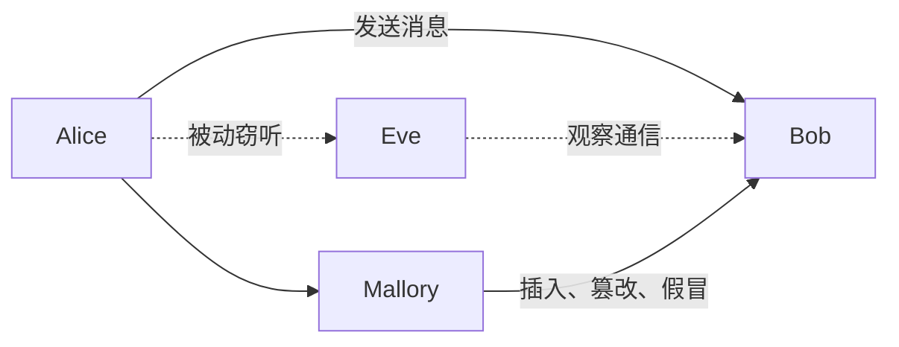
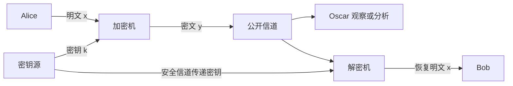
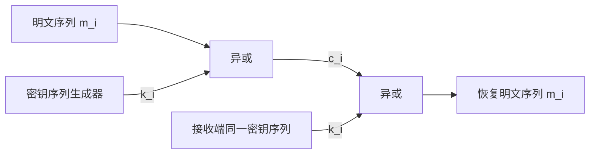
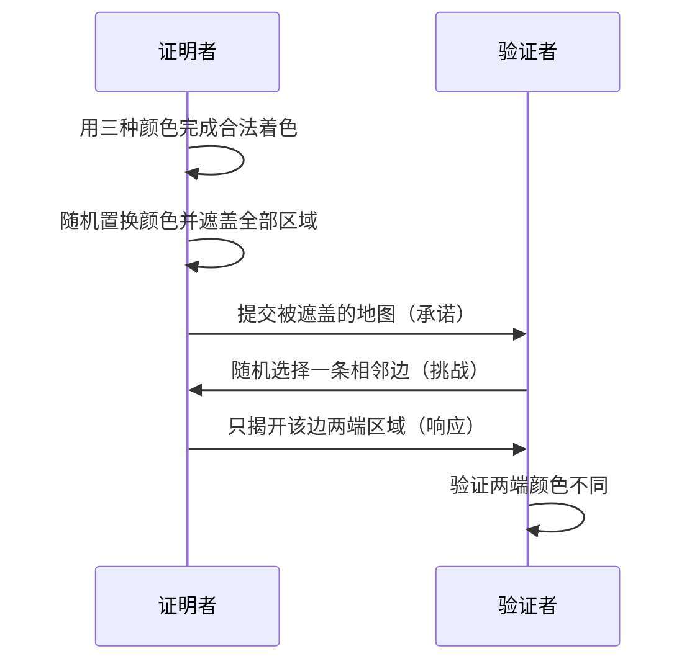

# 1.1 现代密码学概述

> 本笔记整理现代密码学第一讲，从课程安排出发，回顾密码的起源、隐写与历史应用，说明密码技术的发展阶段、信息安全目标、基本概念、体制分类和研究问题。课件中的历史图片、攻击示意图、模型图和零知识证明地图均已转为文字、表格或 Mermaid。

## 主要内容

- 课程安排、考核方式与参考书目
- 密码的起源、隐藏术和历史应用
- 古典、机械、现代与未来密码的发展
- 密码学的安全目标
- 明文、密文、加密、解密与密钥
- 保密通信系统模型与密码分类
- 密码编码学、密码分析学与安全性程度
- 零知识证明、密码体制定义与实用条件

---

## 一、课程说明

### 1. 课程安排与信息

| 项目   | 内容                      |
| ---- | ----------------------- |
| 课程名称 | 现代密码学                   |
| 性质   | 必修课、考试课程                |
| 周数   | 16 周                    |
| 任课教师 | 徐洁                      |
| 时间   | 周四下午 13:00—15:30        |
| 地点   | 沙河校区教学实验综合楼 S104        |
| 学生班级 | 2024 级网络空间安全专业          |

课程内容依次包括：密码学概述、古典密码学、密码学基础简介、分组密码、伪随机生成器与流密码、Hash 函数和消息鉴别码、公钥密码、数字签名、密钥管理、身份鉴别、密码协议、新型与密码应用。

### 2. 作业与考核

1. 共 6—8 次作业。
2. 作业在教学云平台发布；完成后以图片格式上传。
3. 文件名格式为 `第*讲_*姓名*_*学号*`。

| 考核项目 | 比例 |
|---|---:|
| 平时成绩 | 20%—30% |
| 期中考试 | 20%—30% |
| 期末闭卷考试 | 50% |

### 3. 参考书目

1. 谷利泽等，《现代密码学教程》，北邮出版社，2015。
2. 冯登国、裴定一编著，《密码学导引》，科学出版社，1999。
3. Bruce Schneier, *Applied Cryptography*, 2nd Edition, Wiley, 1996, ISBN 0-471-11709-9。
4. A. J. Menezes, P. C. van Oorschot, S. A. Vanstone, *Handbook of Applied Cryptography*, 1996, ISBN 0-8493-8523-7。
5. Mao Wenbo, *Modern Cryptography Theory and Practice*, ISBN 0-13-066943-1。
6. Douglas Stinson, *Cryptography: Theory and Practice*, ISBN 1-58488-508-4。
7. Jonathan Katz, Yehuda Lindell, *Introduction to Modern Cryptography*, CRC Press。
8. Christof Paar, Jan Pelzl, *Understanding Cryptography: A Textbook for Students and Practitioners*, Springer, ISBN 978-3-642-04100-6。

---

## 二、密码的产生与起源

### 1. 古老而现代的技术

“密码学”（Cryptology）来自希腊文 *kryptos*（隐蔽、隐藏、受保护）和 *logos*（字、言语）。人类使用密码的历史几乎与使用文字一样长；在有部落、宗教和外交之后便有密码，古代密码主要服务于军事与外交，自古以来常是决定战争胜负的关键。

课件把密码起源概括为：



### 2. 原始符号与斐斯托斯圆盘

人类先有符号，随后经历早期结绳、数字形成、斐斯托斯圆盘等阶段。斐斯托斯圆盘直径约 160 毫米，始于公元前 17 世纪；表面有螺旋排列的符号。1908 年在克里特岛斐斯托斯皇宫遗址发现，现存于希腊伊拉克利翁考古博物馆。盘上符号以字印模压在湿黏土上，正反两面共 241 个表形符号、61 个词组，包含 45 种不同符号；课件指出迄今仍没有人能确定解读其意义。圆盘正反面照片仅用于展示实物。

### 3. 宗教符号

随着人类社会发展，专制政治下人们借助宗教符号表达信仰。基督教产生于公元 1 世纪，在罗马帝国受压迫时，信徒以图形表达宗教观念。课件展示墓室壁画、鱼形、鸽子、十字等符号；这些历史图片说明宗教群体会借约定符号隐蔽交流，未提供新的算法步骤。

---

## 三、消息隐藏与文字隐写

### 1. 古希腊战争中的隐写

隐写术强调隐藏“存在消息”这一事实。课件讲述两则古希腊战争故事：

1. 公元前 440 年，希斯提奥斯为安全传递军事情报，把消息刺在奴隶剃光的头皮上，待头发长出后再派送，接收方剃发读取。
2. 古代留守妻子给外出工作的丈夫送信时，可把字写在物件、衣物或身体隐蔽位置，使普通观察者难以发现。

这些方法的保密性依赖消息载体未被怀疑，而非加密算法。

### 2. 隐形墨水

隐形墨水包括物理变化和化学变化两类。

1. 牛奶等受热显色：用牛奶写在纸上，晾干后字迹不明显；在烛火或热源附近加热，含有机物的部分受热变色显现。课件强调防火安全。
2. 白色蜡笔抗水：用白色蜡笔写字，再刷涂水彩，蜡层排斥水性颜料，使字迹显现。
3. 淀粉—碘酒反应：使用淀粉液书写，干燥后无色；涂碘酒后淀粉区域呈蓝色。
4. 不用墨水：在叠放的纸上用力书写，借压痕或后续处理显出下层信息。

课件中的操作照片是对上述步骤的演示，人物与年份水印不增加知识信息。

### 3. 蜡封、吞服与掩藏卡片法

公元前 480 年，波斯王薛西斯准备进攻希腊。流亡波斯的希腊人得知后，将情报刻在木板上，再覆盖蜡层伪装成空白书写板，送回希腊；接收方刮去石蜡读出密信。另一方法是把信条吞服或藏于身体内部，利用载体隐藏。

掩藏卡片法使用带孔的遮蔽卡片：

1. 发送者把卡片覆盖在纸上，经孔写入秘密消息。
2. 移去卡片，在空白处补上普通文字，形成自然的公开信。
3. 接收者用相同卡片覆盖公开信，从孔中读出秘密字符。

这种方法依赖双方拥有相同孔位的卡片。

### 4. 叠痕法

1. 把信纸上下左右折叠若干次并铺平。
2. 按顺序在折痕交叉点写入秘密字符。
3. 在空白处填入普通通信文本，使公开文本与秘密文本连成合理语句。
4. 为避免被察觉，可在秘密信息上再施加语言密码。

### 5. 藏头、字体下沉与语言隐写

藏头诗利用句首或特定位置字符传递另一层信息。课件展示《七律诗传》中的“我没钱啦”以及《唐诗律》例句；其核心是从约定位置依次提取字符。

字体下沉法把选定字母相对同一行略微下移。课件例中，正文被特意下沉的字母依次拼成 `rendezvous`，说明排版本身也可承载隐蔽消息。

语言隐写包括暗号与暗语，例如：

```text
凤栖梧桐鸟飞去，马踏芦边草不生。
日落香炉，含去凡心一点。
炉熄火尽，务把意马牢栓。
谜底：XXXXXXXX
```

### 6. 隐藏术的优缺点

| 方面   | 内容                      |
| ---- | ----------------------- |
| 优点   | 能让某些人使用而不易被发现，适合秘密通信    |
| 缺点   | 一旦构造方法被发现，秘密会完全暴露       |
| 改进方向 | 构造简单但传递量大、分析困难、破译代价高的方法 |


### 7. 达·芬奇的方法

达·芬奇常使用镜像书写：文字从右向左书写，需要对着镜子阅读。课件推测这种做法可能用于左手书写便利、保护笔记内容或作为身份标记；相关手稿照片用于展示效果。

他还设计密码筒：多个可转动圆盘构成筒体，只有将各盘调到正确位置才能打开。课件左右两幅筒体图说明“多盘组合形成密钥”的物理思想。

---

## 四、密码的历史运用

### 1. 腰带密码与斯巴达棒

在加密技术出现前，通信双方必须先约定加密方法。古希腊斯巴达人用腰带／皮条缠绕在指定直径的棍上沿轴书写，拆下后字符顺序混乱；接收方用相同直径棍子还原。该方法后来发展为 Scytale，详见 [[现代密码学/笔记/2.1 古典密码体制]]。

### 2. 军事密码本

北宋曾公亮（999—1078）的军事密码本把 40 个军情项目编号，并用一首 40 字五言诗的相应字作为解密钥匙。发送者先查军情对应序号，再从诗中取该字；接收者由字反查军情。课件示例把第 18 号军情编码为诗中第 18 字。

明朝抗倭名将戚继光发明反切密码，也称“戚继光密码本”。每个汉字的读音被分解为声母、韵母和声调，分别按编号查表组合。课件以“使用方法”示例说明：先查韵母编号，再查声母编号并附声调，就能恢复汉字。

### 3. Enigma

Enigma 是二战时期德国使用的转轮密码机。英格玛调换 3 个转子的方向，使其具有大量可能状态；每输入一个字符，转轮状态改变。盟军在 Bletchley Park 集中不同背景人才破译，参与者超过一万人，包含数学家、语言学家、象棋高手、填字游戏专家和专门查错者。

军事科学界估计，成功破译 Enigma 使二战至少提前两年结束。战后英国没有立即透露秘密，许多国家仍继续使用相关机器，直到约 20 世纪 70 年代。Alan Mathison Turing 在其中发挥关键作用；电影《模仿游戏》（2015）以此为背景。人物、机器和电影画面为历史说明，不增加算法细节。

### 4. 现代战争

海湾战争（1990—1991）中，美军广泛使用数字加密、卫星通信和精确制导等现代密码技术；电子战与网络战破坏伊拉克通信，并保持本方指挥控制能力。阿富汗战争（2001—2021）中使用 AES 等先进加密技术保护军事通信、防止塔利班和基地组织截获；网络战还用于破解通信密码、获取恐怖分子线索。

俄乌冲突（2022 年至课件编写时）的网络攻防特点包括：

1. 持续网络攻防成为冲突常态，网络被用于军事辅助、舆论宣传与军情误导。
2. 通过攻击军事、政府、金融机构及伪造命令和政府文件窃取情报。
3. 使用 DDoS、APT、钓鱼、漏洞利用、供应链攻击和恶意数据擦除等手段。
4. 破坏网络基础设施造成断网断电；课件举乌克兰第二大城市哈尔科夫断网事件。

### 5. 商业与文化领域

山西平遥票号博物馆保存的商业加密实例包括：

1. 用汉字代表月份：如 `谨防假票冒取，勿忘细视书章`。
2. 用汉字代表日期：如 `堪笑世情薄，天道最公平，昧心图自利，阴谋害他人，善恶终有报，到头必分明`。
3. 用汉字代表数字：如 `壹二拾：生客多察看，斟酌而后行；万千百十：国宝流通`。

课件给出的编码例为：十一月初五签发壹万肆千叁百两银票，写作 `书薄 生国察宝多流`。

课件列出影视与文学中的密码故事：福尔摩斯《舞动的小人》以小人图形替代字母；《暗算》涉及听风、看风与捕风；《风语者》涉及二战初期纳瓦霍族密码；《对手》涉及紫密密码、普林斯顿数学系和密码破译。海报与剧照为文化案例。

### 6. 网络、数据与移动通信

密码技术是网络与数据安全的基石：

1. 网络安全：IPSec 与 SSL 在保护数据机密性时采用对称加密；IPSec 中的 IKE 和 SSL 握手协议具备密钥协商功能，协商出的密钥也用于计算数据完整性保护的 MAC 值。
2. 电子邮件：应用层安全协议 S/MIME 使用数字信封，先用非对称算法加密对称密钥，再用对称密钥加密传输数据。
3. 数据安全：传统对称与非对称加密保障机密性；属性加密在保障机密性的同时实现细粒度访问控制；函数加密、同态加密提供密态计算能力。
4. 验证与协作：数字签名验证消息来源与消息本身；秘密共享等多方安全计算技术把秘密分给多个参与者共同保护和计算，防止信息丢失、篡改与破坏。
5. 移动通信：3GPP 标准把密码算法用于空口机密性和完整性保护、网络与终端双向认证及网络域保护；5G-AKA 在对称加密和密钥派生基础上，引入公钥加密隐藏用户 SUPI，提高移动用户隐私。

---

## 五、密码技术的发展

### 1. 从手工到现代

随着信息社会到来，大量信息需要加密，密码技术开始系统研究。20 世纪出现加密机与密码研究文献。1949 年 Shannon 发表“保密通信的信息理论”，奠定密码学理论基础；但当时研究主要在军事领域，密码人员严格保密，1949—1976 年理论与技术公开进展不大。

20 世纪 70 年代发生两件重大事件：

1. Diffie 与 Hellman 发表“密码学的新方向”，提出公开密钥密码体制。
2. 1977 年美国正式公布数据加密标准 DES，算法完全公开并广泛用于商业数据加密。

此后密码研究进入高潮。1997 年 4 月 15 日，美国 NIST 发起征集高级加密标准 AES；美国和欧洲先后制定自己的高级密码标准。

发展阶段可概括为：

1. 手工密码：埃及人、希伯来人、亚述人、希腊人使用的 Scytale、凯撒密码、维吉尼亚密码等。
2. 机械密码：Enigma、转轮机。
3. 现代密码：电子芯片与计算机支持的 DES、AES、RSA、MD、SHA 等。
4. 未来密码：量子密码、混沌密码、DNA 密码等。

### 2. 国产密码策略与算法

我国密码产品由国家密码管理局统一管理，按对社会开放程度分为：

1. 核密：对涉及国家核心秘密信息加密，最高密级。
2. 普密：对涉及国家普通秘密信息加密。
3. 商密：对不涉及国家秘密的信息加密，用于普通商业机构。

密码相关企业须具备研发、生产、销售资质；密码产品由国家统一鉴定、命名。课件指出，以前密码算法管理原则不公开、完全硬件化，现已有部分商密算法公开。

课件表列算法信息如下：

| 算法  | 类型／用途      | 公开时间 |
| --- | ---------- | ---: |
| ZUC | 祖冲之序列密码    | 2011 |
| SM1 | 分组密码，算法不公开 | 2010 |
| SM4 | 分组密码       | 2012 |
| SM7 | 分组密码       | 2012 |
| SM2 | 椭圆曲线公钥密码   | 2010 |
| SM9 | 标识密码       | 2012 |
| SM3 | 密码杂凑算法     | 2010 |

### 3. 近现代与后量子

古典密码计算手工、算法简单、密钥短，密码技术的发展受数学理论和攻击能力制约。近现代密码受 Shannon 信息论影响；只有密钥长度与明文长度一样的一次一密才具有绝对安全性。现代典型算法包括 DES、AES、RSA、MD 与 SHA。

后量子时代需抵御量子计算威胁，课件列举量子密码（信息论安全）与格密码（针对 Shor 算法等量子算法安全）作为方向。

---

## 六、密码学的目的与安全属性

### 1. 典型威胁

课件用 Alice、Bob、Eve、Mallory 描述威胁：



窃听是被动获取内容；插入和篡改改变通信；假冒由 Mallory 冒充 Alice；数字签名用于证明数字信息的来源与责任。

### 2. 安全目标

密码学是保障信息安全的核心，信息安全是密码学研究与发展的目的。安全属性包括：

1. 机密性（Confidentiality）：信息不泄露给非授权实体。
2. 认证性（Authentication）：消息来源或实体身份得到正确标识。
3. 完整性（Integrity）：未经授权不能篡改信息。
4. 不可否认性（Non-repudiation）：用户不能在事后否认信息生成行为。
5. 可用性（Availability）：保障资源随时可提供服务。

---

## 七、密码学基本概念

### 1. 明文、密文、加密与解密

> **基本概念**
> 要发送的消息称为明文，一般用 $M$ 或 $P$ 表示；加密后的消息称为密文，一般用 $C$ 表示。把明文变成密文称为加密（Encryption），把密文还原为明文称为解密（Decryption）。

加密算法记为 $E$，解密算法记为 $D$：

$$
E(M)=C,\qquad D(C)=M,\qquad D(E(M))=M.
$$

早期算法与解密算法本身保密，但产生问题：

1. 保密性已远远不够。
2. 大量用户组织难以使用，一人离开或泄漏就需更换算法。
3. 不利于标准化，不同组织自行实现，无法使用通用硬件。

解决方法是引入密钥 $K$。算法在密钥控制下运行，

$$
E_{K_1}(M)=C,\qquad D_{K_2}(C)=M,
$$

并满足

$$
D_{K_2}(E_{K_1}(M))=M.
$$

现代密码体制中算法公开，安全性完全取决于密钥。

### 2. 一般保密通信模型

课件中的 Alice—Oscar—Bob 模型可重构为：



Oscar 可以看到公开信道中的密文，但不能得到安全信道传送的密钥。

### 3. 密码体制定义

> **定义：密码体制**
> 一个密码体制是五元组 $(P,C,K,E,D)$，满足：
> 1. $P$ 是所有可能明文组成的有限集。
> 2. $C$ 是所有可能密文组成的有限集。
> 3. $K$ 是所有可能密钥组成的有限集。
> 4. 对任意 $K\in K$，存在加密法则 $e_K\in E$ 和相应解密法则 $d_K\in D$，其中 $e_K:P\to C$、$d_K:C\to P$。
> 5. 对任意 $x\in P$，均有 $d_K(e_K(x))=x$。

### 4. 实用密码体制的条件

1. 每个加密函数 $e_K$ 和解密函数 $d_K$ 都能有效计算。
2. 即使看到密文 $y$，窃听者 Oscar 要确定密钥 $k$ 或明文 $x$ 也应不可行。

---

## 八、密码学分类与研究分支

### 1. 按密钥关系分类

| 类型    | 密钥关系               | 优点                | 缺点                   |
| ----- | ------------------ | ----------------- | -------------------- |
| 对称密码  | 加密密钥与解密密钥相同或易相互推出  | 效率高、算法简单，适合大量数据   | 需要安全密钥交换；用户多时密钥量大    |
| 非对称密码 | 加密密钥与解密密钥不同，其中一个公开 | 不需安全密钥交换，解决密钥管理问题 | 效率较低，不适合大量数据；密钥产生较麻烦 |
| 混合系统  | 非对称密码分发密钥，对称密码加密数据 | 兼顾密钥管理与高效率        | 需组合两类机制              |

### 2. 按加密方式分类

对称密码分为序列密码与分组密码。

1. 序列密码：把明文消息逐位加密，也称流密码。密钥序列生成器由密钥源和秘密信道控制，明文序列与密钥序列逐位异或产生密文；接收方用同一密钥序列异或恢复明文。
2. 分组密码：把明文消息分成固定长度分组，逐组加密。课件中的模型为多轮结构，每轮使用子密钥和轮函数，解密按相应逆过程进行。



### 3. 两大研究分支

密码学包括：

1. 密码编码学：寻找隐藏信息，即把明文变成密文的方法。
2. 密码分析学：研究如何破译秘密信息或伪造信息。

两者相互对立又相互促进，密码学在编码与分析的持续竞争中发展。

密码编码的安全性程度包括：

- 绝对不可破译：无论获得多少密文、使用何种方法都不能破译。
- 计算上不可破译：依据可利用资源，破解时间极长或成本高于明文价值。

密码分析按资料分为：唯密文、已知明文、选择明文与选择密文攻击，详见 [[现代密码学/笔记/2.2 密码分析]]。

### 4. 密码学研究的基本问题

课件列出：

1. 密码体制相关概念。
2. 单向函数与伪随机序列生成器。
3. 数字签名与杂凑（Hash）函数。
4. 消息认证与身份识别。
5. 密钥分发、秘密共享、零知识证明等密码协议。

---

## 九、零知识证明示例

### 1. 定义

> **零知识证明（Zero-Knowledge Proof）**：证明者能够在不向验证者提供任何有用秘密信息的情况下，使验证者相信某个论断正确。

### 2. 地图三色问题

问题是用三种颜色给地图着色，保证任意相邻地区颜色不同，并让验证者确认“证明者知道答案”，但不泄露完整着色。



一次验证只能说明被抽查边满足条件；重复多轮、每轮重新随机置换颜色并承诺，可使作弊成功概率不断降低，同时验证者始终只看到少量局部颜色，无法获得完整答案。

课件地图照片与人物图标用于演示承诺、挑战、响应和验证四步，其连线与信息均由上述时序图承接。

---

## 本章小结

| 主题 | 核心结论 |
|---|---|
| 起源 | 密码伴随符号、宗教、战争和外交产生，既包含加密也包含隐写 |
| 历史应用 | 腰带、军事密码本、反切、Enigma 展现从手工到机械密码的演进 |
| 现代发展 | Shannon 理论、公开密钥思想、DES 与 AES 推动密码学公开化和系统化 |
| 安全目标 | 机密性、认证性、完整性、不可否认性、可用性 |
| 基本模型 | 算法公开，密钥保密；加密与解密满足正确性 |
| 分类 | 对称、非对称、混合；序列与分组 |
| 研究分支 | 密码编码学与密码分析学相互对立、相互促进 |
| 零知识证明 | 通过承诺—挑战—响应反复验证知识而不泄露秘密 |

> **逐图覆盖说明**：66 页课件中的封面叶片、历史人物、书信、圆盘、宗教艺术、战争照片、电影海报和“谢谢”页已判断为历史例证或装饰；其中具有技术含义的隐写步骤、通信模型、攻击关系、分类关系、流密码模型、地图三色证明及五元组体制均已转为文字、表格、公式或 Mermaid。
