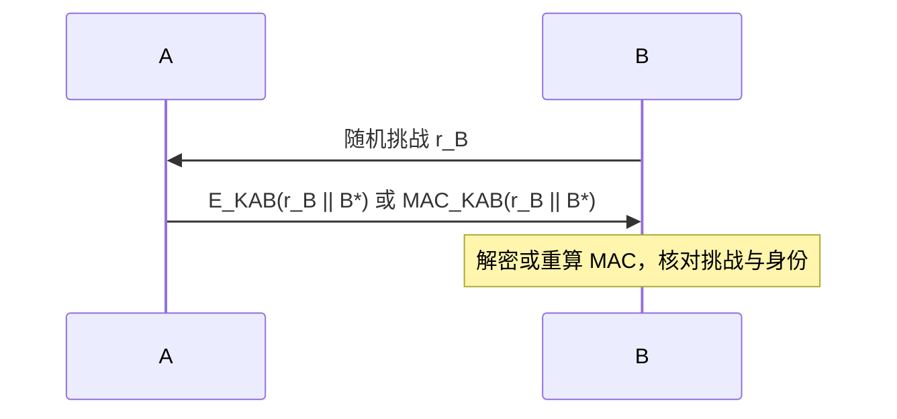
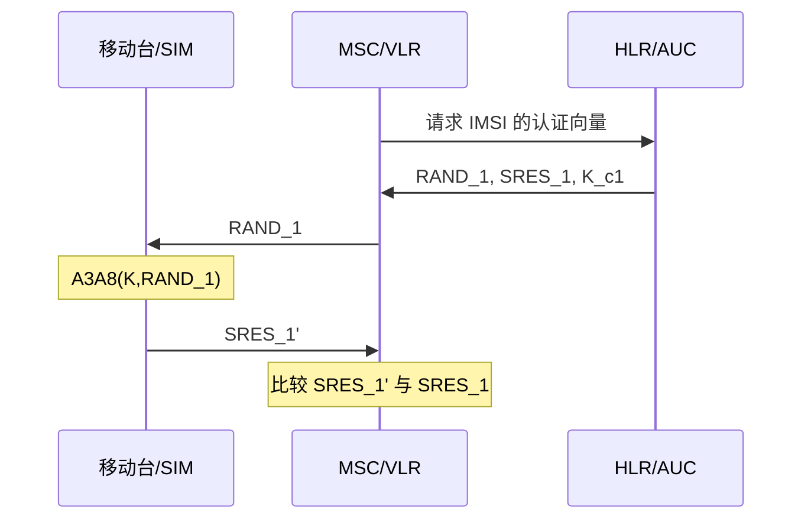
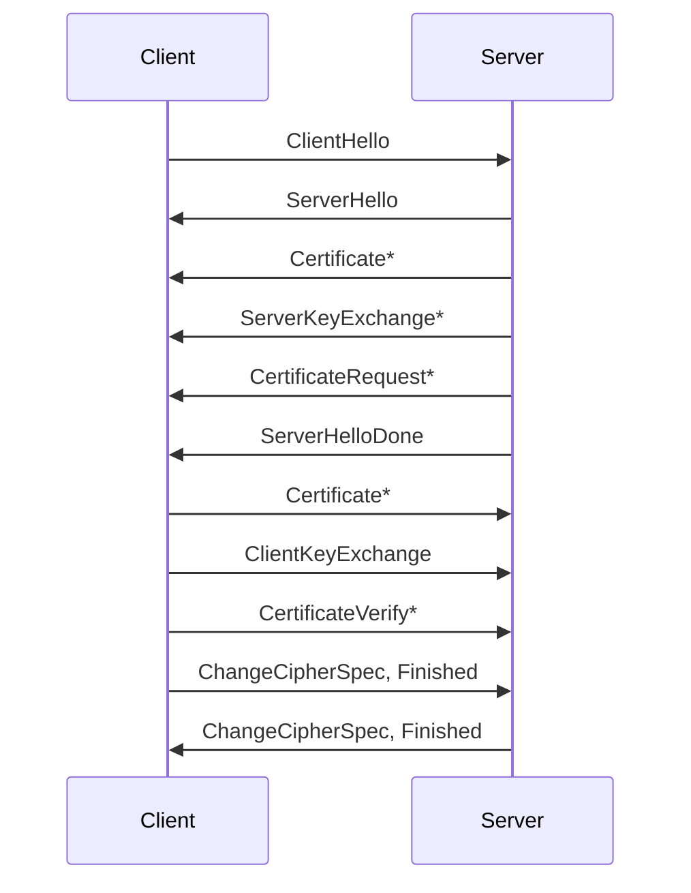
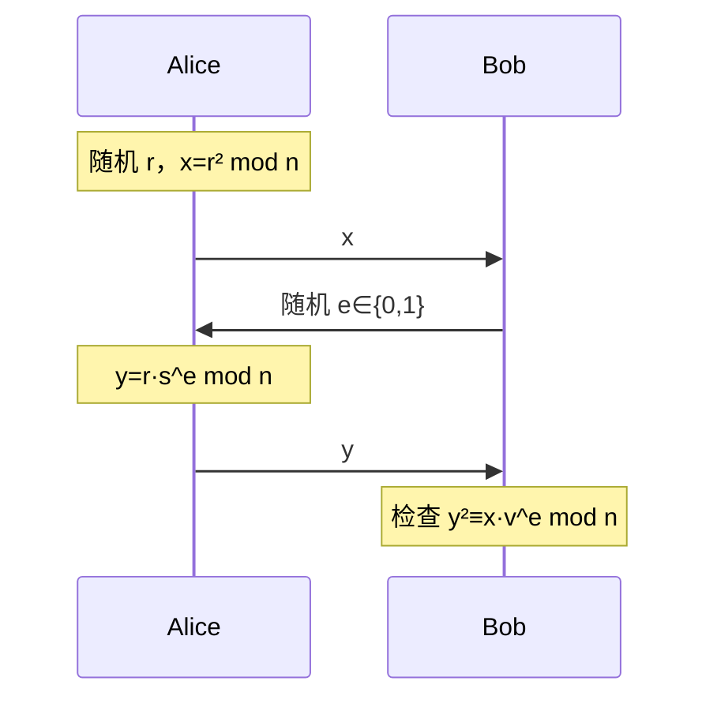
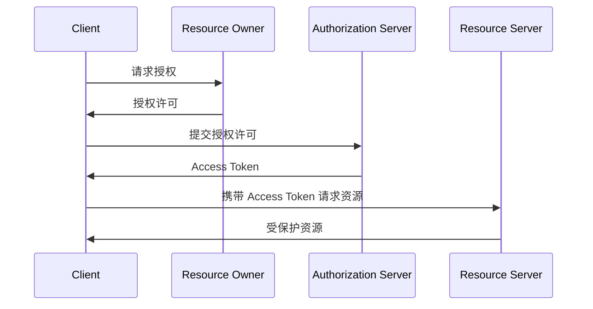
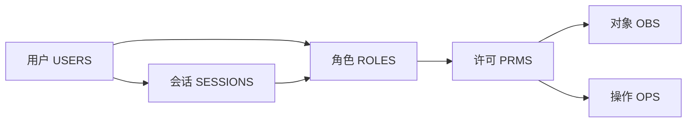
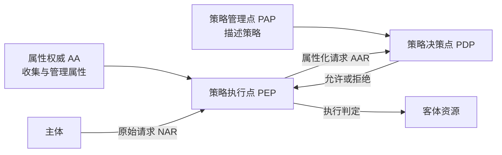
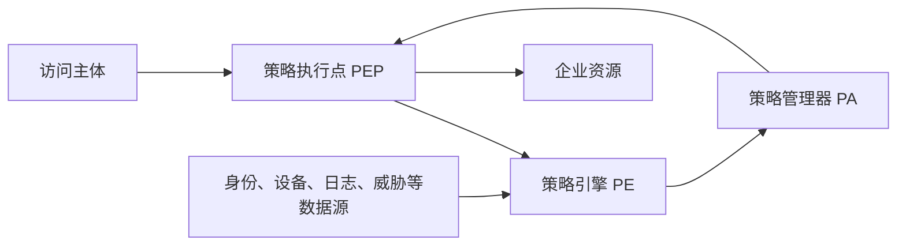
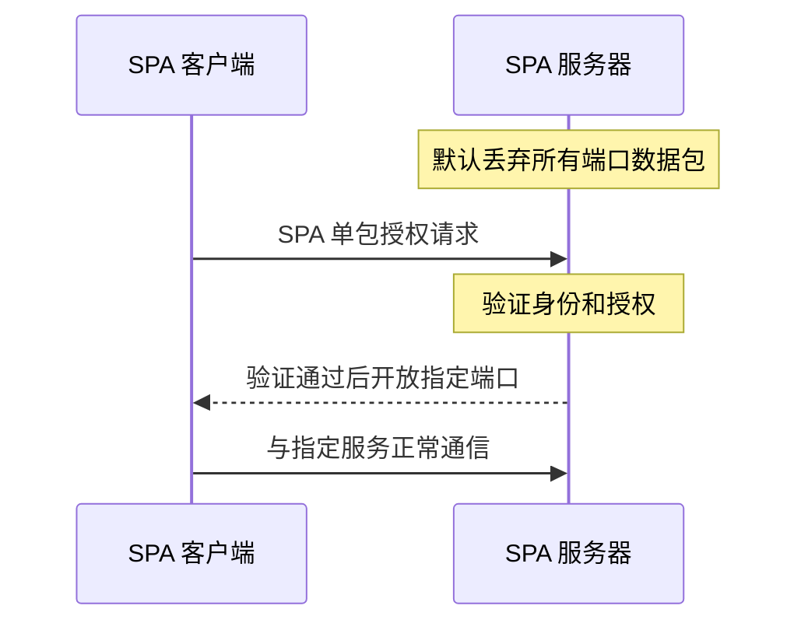

# 10.1 身份鉴别与访问控制协议

> 本笔记依据“第 10 章 密码协议”课件整理，覆盖身份鉴别、固定与一次口令、挑战—应答、零知识证明、Fiat-Shamir 协议、OAuth、DAC/MAC/RBAC/ABAC 以及基于密码技术的零信任架构。课件中的协议时序、访问控制关系和零信任组件图均已用 Mermaid、表格、公式或完整文字重构。

## 主要内容

- 身份鉴别的定义、威胁场景与三类鉴别因素
- 固定口令、口令散列、加盐和双因子认证
- 共享列表、顺序更新与 Lamport 一次口令
- 对称密码和公钥密码的挑战—应答协议
- 移动网络认证与 TLS 握手示例
- 零知识证明思想与 Fiat-Shamir 身份鉴别协议
- OAuth 参与实体及四种授权方式
- DAC、MAC、RBAC 与 ABAC 访问控制模型
- 零信任原则、架构、SPA、IAM、MSG 与 VPN 对比

---

## 一、身份鉴别基础

### 1. 定义

> **身份鉴别**又称身份识别、身份认证，是证实客户的真实身份与其所声称身份是否相符的过程。

身份鉴别常依据三类因素：

| 因素 | 含义 | 课件示例 |
|---|---|---|
| 已拥有的事物 | 用户持有的物理配件 | 磁卡、智能卡、IC 卡、证件 |
| 固有事物 | 人的生理特征或无意行为 | 手写签名、指纹、声音、视网膜模式、手部几何 |
| 已知事物 | 用户掌握的秘密知识 | 口令、PIN、挑战—应答秘密、私钥 |

### 2. 两个威胁场景

1. 国际象棋大师问题：  
   不懂象棋的 Alice 同时挑战分处两个房间的 Bob 和 Carol，并把一方的着法转给另一方；她并未获得棋艺，却可能让双方误判其能力。该场景说明“按正确格式回应”不必然证明响应者真正拥有所声称能力。
2. 黑手党骗局：  
   Alice 在 Bob 的餐厅认证，Carol 同时在 Dave 的商场冒充 Alice；Bob 与 Carol 通过无线电实时转发挑战和响应，使 Dave 把 Alice 对 Bob 的认证误认为 Alice 在向自己认证。该场景体现中继/距离欺骗风险。

---

## 二、口令身份鉴别

### 1. 口令生命周期

口令管理包括生成、分配/注册、保存、使用/登录、备份或恢复、撤销或更新以及销毁。

### 2. 固定口令与散列保存

最简单的固定口令方式由服务端直接保存 $(ID_A,PW)$ 并在登录时比较。这会使口令数据库直接暴露明文秘密。改进方法只保存口令散列：

$$
h_A=h(PW).
$$

登录时服务端对输入口令重新散列并比较 $h(PW)$ 与 $h_A$。然而若口令空间很小，攻击者窃取散列表后仍可离线枚举。例如六位数字口令只有 $10^6$ 种候选，攻击者可预先计算全部候选的散列并查表匹配。

### 3. 口令加盐

注册阶段：

1. 接收用户口令 $pw$。
2. 随机产生盐值 $D_{salt}=A_{random}()$。
3. 计算口令信息 $s=A_{gen}(D_{salt},pw)$。
4. 仅保存 $D_{salt}$ 与 $s$。

登录阶段：

1. 根据账户名取出 $D_{salt}$ 与 $s$。
2. 对输入口令计算 $s_r=A_{gen}(D_{salt},pw)$。
3. 当且仅当 $s_r=s$ 时通过认证。

课件给出的慢速口令映射示例先以盐和口令构造密钥，再对 64 位全零块反复加密 25 次，最后把数据块编码为字符串。其步骤为：

$$
D_{pw}=A_{salt}(D_{salt},pw),\qquad K=D_{pw}.
$$

初始化 $D_p=0^{64}$、$i=0$，循环执行 $D_c=A_{crypt}(K,D_p)$、$D_p\leftarrow D_c$、$i\leftarrow i+1$，直到 $i=25$，再输出 $s=A_{trans}(D_c)$。

若六位口令再加入四位盐，攻击者预计算表的候选组合由 $10^6$ 扩展到 $10^{10}$；不同用户的相同口令也会得到不同存储值。

### 4. 双因子认证

双因子认证同时使用不同类别的因素。课件以 ATM 为例：银行卡属于“拥有的事物”，PIN 属于“已知事物”。仅丢失卡但不知道 PIN，或仅窥见 PIN 但没有卡，都不足以完成认证。

加强固定口令安全性的措施包括：

1. 避免弱口令。
2. 把口令扩展为更长的通行短语。
3. 为口令加入随机盐值。
4. 使用双因子认证。
5. 放慢口令映射计算。
6. 限制失败尝试次数。

### 5. 共享列表一次口令

注册时用户提交口令列表 $\{pw_1,pw_2,\ldots,pw_t\}$，服务器保存：

$$
s_i=F(pw_i),\qquad i=1,2,\ldots,t.
$$

第 $i$ 次登录时验证 $F(pw_i)=s_i$；成功后立即删除 $s_i$，使该口令不能再次使用。

### 6. 顺序更新一次口令

服务器初始保存 $pw_1$。第 $i$ 次登录时，用户同时发送当前口令 $pw_i$ 与下一口令的密文：

$$
c_{i+1}=E_{pw_i}(pw_{i+1}).
$$

服务器验证当前口令后计算 $pw_{i+1}=D_{pw_i}(c_{i+1})$，并用它覆盖数据库中的 $pw_i$。因当前口令用后即被替换，重放旧登录信息不能再次通过。

### 7. Lamport 一次口令

用户选择初始口令 $w$ 和计数器 $t$，计算散列链：

$$
w,h(w),h^2(w),\ldots,h^t(w).
$$

注册时服务器保存 $h^t(w)$。第一次登录发送 $h^{t-1}(w)$，服务端验证：

$$
h(h^{t-1}(w))=h^t(w),
$$

并用 $h^{t-1}(w)$ 覆盖原存储值。以后沿散列链反向逐次提交。单向性使观察者难以从当前值计算出下一次所需的前像。

---

## 三、挑战—应答身份鉴别

### 1. 协议与基本目标

> **协议是一系列由两方或多方依次执行的步骤，其目的是共同完成一项预定任务。**

身份鉴别协议应使 Alice 证明自己掌握与身份相关的秘密，但不在协议中直接泄露秘密本身。

### 2. 基于对称密码的挑战—应答

若 A、B 预共享密钥 $K_{AB}$，B 发送随机挑战 $r_B$，A 可用两种方式证明持有密钥：

1. 返回 $E_{K_{AB}}(r_B\parallel B^*)$。
2. 返回消息认证码 $h_{K_{AB}}(r_B\parallel B^*)$。

随机挑战提供新鲜性，把实体标识 $B^*$ 纳入响应可限制协议消息被转用于其他对象。

### 3. 基于公钥密码的挑战—应答

Alice 持有公私钥对 $(pk_A,sk_A)$ 及 CA 对公钥的证书。她可通过以下方式证明自己持有 $sk_A$：

1. B 用 $pk_A$ 加密随机挑战，Alice 解密并返回明文挑战。
2. B 发送明文随机挑战，Alice 返回证书与 $\operatorname{Sig}_{sk_A}(r_B\parallel B^*)$，B 用 $pk_A$ 验证。

公钥证书把身份与 $pk_A$ 绑定，挑战的新鲜性阻止直接重放旧响应。

### 4. 移动网络认证示例

课件以 SIM 系统说明共享密钥挑战—应答。注册时 AUC/HLR 保存用户标识 IMSI 与密钥 $K$；认证中心对随机挑战 $RAND_1$ 用 A3A8 算法计算期望响应 $SRES_1$ 和会话密钥 $K_{c1}$。移动台 SIM 使用同一 $K$ 与 $RAND_1$ 计算响应，MSC/VLR 比较 $SRES_1$，一致则通过认证。

### 5. TLS 握手示例

课件给出带可选客户端证书的 TLS 握手顺序：

星号表示取决于密码套件或是否要求客户端认证的可选消息。该时序展示证书认证、密钥交换与 Finished 完整性确认的组合。

---

## 四、零知识证明与 Fiat-Shamir 协议

### 1. 零知识思想

> **零知识证明使证明者向验证者证明“自己知道某个秘密”，而不泄露秘密本身，也不让验证者获得可用于冒充证明者的有效信息。**

洞穴故事中，Alice 若掌握打开 C、D 之间秘密门的咒语，就能按 Bob 的随机要求从左或右出口返回；若不知道咒语，每轮只有 $1/2$ 概率猜中。重复 $n$ 轮全部通过的欺骗概率为：

$$
2^{-n}.
$$

当 $n=16$ 时，欺骗概率为 $1/65536$。录像无法说服第三方，因为 Bob 与 Alice 可以预先配合模拟一段成功录像；因此交互没有形成可转移证明，也没有泄露咒语。

身份鉴别型零知识协议应满足：

1. 完备性：诚实且掌握秘密的 Alice 能让诚实 Bob 接受。
2. 可靠性：不掌握秘密的实体冒充 Alice 成功的概率可忽略。
3. 零知识性：Bob 不得到可用于恢复秘密或向第三方冒充 Alice 的有效信息。

### 2. Fiat-Shamir 参数生成

可信中心选择素数 $p,q$，计算并公开：

$$
n=pq,
$$

随后销毁 $p,q$。证明者选择与 $n$ 互素的秘密 $s$，$1\le s<n$，计算公钥：

$$
v=s^2\pmod n.
$$

证明者向可信中心注册 $v$，秘密保存 $s$。

### 3. 交互协议

协议独立执行 $t$ 轮，每轮如下：

1. Alice 随机选 $r<n$，计算 $x=r^2\bmod n$ 并发送给 Bob。
2. Bob 随机选择挑战比特 $e\in\{0,1\}$。
3. Alice 返回 $y=r s^e\bmod n$；即 $e=0$ 时返回 $r$，$e=1$ 时返回 $rs\bmod n$。
4. 若 $y=0$ 则拒绝，否则验证：

$$
y^2\equiv xv^e\pmod n.
$$

正确性来自：

$$
y^2=(rs^e)^2\equiv r^2(s^2)^e\equiv xv^e\pmod n.
$$

不知道 $s$ 的冒充者只能预先准备适合其中一个挑战的承诺，每轮欺骗概率为 $1/2$，连续 $t$ 轮成功的概率为 $2^{-t}$。

---

## 五、OAuth 开放授权

### 1. 目标与参与实体

OAuth 2.0 通过标准化授权流程和权限委派机制，使第三方应用在资源所有者授权后访问受限资源，而不必把资源所有者的账户口令直接交给第三方应用。

| 实体 | 缩写 | 作用 |
|---|---|---|
| 资源所有者 | RO | 拥有资源并能授予访问权限，通常是用户 |
| 客户端 | Client | 获得 RO 授权后访问资源的第三方应用 |
| 授权服务器 | AS | 认证 RO、执行授权审批并签发访问令牌 |
| 资源服务器 | RS | 存储资源并根据令牌处理访问请求 |

AS 与 RS 是逻辑角色，物理上可由同一服务器承担。

### 2. 抽象流程

### 3. 四种实现方式

| 方式 | 核心流程 | 课件给出的适用场景 |
|---|---|---|
| 授权码 | 浏览器获得授权码，客户端后端再以授权码和重定向 URI 换取令牌 | Web 服务器应用、长期访问、重要 API，令牌不经过浏览器脚本 |
| 隐式授权 | 授权后直接把 Access Token 作为回调地址参数返回浏览器 | 临时访问、浏览器端应用且客户端环境可信 |
| 用户密码凭证 | 用户把账号口令交给高度可信客户端，客户端换取令牌 | 仅限官方应用，并辅以 SSL、证书、U 盾等保护 |
| 客户端凭证 | 客户端以自身身份获取令牌，不涉及具体用户登录 | 客户端自有资源、内部应用或已有其他安全保障的场景 |

错误使用 OAuth 可能导致授权码、令牌、重定向 URI 或客户端身份绑定不足。课件引用 2016 年研究作为警示：协议本身之外，第三方应用的错误实现也会使用户在不知情时被远程利用。

---

## 六、访问控制模型

### 1. 访问控制原理

> **访问控制是在鉴别用户合法身份后，依据策略显式允许或限制主体对资源的操作能力与范围。**

四个基本实体为：

1. 主体（Subject）：发出访问请求的用户、进程或终端。
2. 客体（Object）：被访问的程序、数据、文件、设备或网络资源。
3. 访问操作（Access Permission）：读、写、执行、创建、搜索、修改、添加、删除等。
4. 访问控制策略（Access Control Policy）：约束主体对客体操作的一组规则。

常用三元组 $(S,O,P)$ 表示主体、客体和访问操作。

### 2. 自主访问控制 DAC

> **DAC**允许拥有或控制客体的主体自主授予、回收其他主体对该客体的一种或多种权限。

DAC 常用访问控制矩阵（ACM）和访问控制列表（ACL）记录权限。其优点是简单、灵活，便于管理与查询；缺点是在大型分布式系统中矩阵规模大、链式授权复杂，难以限制主体间接获得权限，也不利于统一全局控制。

### 3. 强制访问控制 MAC

> **MAC**依据安全标识和信息分级实施访问控制，主体不能自行转授权限。

多级安全系统把资源分为有层次的 TS（绝密）、S（秘密）、C（机密）、RS（限制）、U（无级别）等安全级别，也可使用无层次安全类别。

| 模型 | 课件给出的规则 | 保护目标 |
|---|---|---|
| Bell-LaPadula | 向下读、向上写 | 防止机密信息向低级别泄露 |
| Biba | 无下读、无上写 | 保护高完整性数据不受低完整性信息污染 |

### 4. 基于角色的访问控制 RBAC

RBAC 的基本元素为用户 USERS、角色 ROLES、许可 PRMS 和会话 SESSIONS；许可又包含对象 OBS 与操作 OPS。权限授予角色，角色授予用户，用户在会话中激活角色，用户不与权限直接关联。

RBAC 实现最小特权和职责分离。RBAC96 包含：

| 模型 | 特点 |
|---|---|
| RBAC0 | 最小核心元素集合 |
| RBAC1 | 在 RBAC0 上加入角色继承 |
| RBAC2 | 在 RBAC0 上加入约束条件 |
| RBAC3 | 综合 RBAC1 与 RBAC2 |

传统 RBAC 以用户—角色为中心，难以充分表达资源关系、时间变化、请求动作与环境上下文，也难满足跨管理域的开放授权。

### 5. 基于属性的访问控制 ABAC

ABAC 以四元组 $(S,O,P,E)$ 描述主体属性、客体属性、权限属性和环境属性。系统分为准备与执行两个阶段：

准备阶段由 AA 管理属性及属性—权限关系，PAP 形式化描述策略。执行阶段中，PEP 接收 NAR、向 AA 取得属性并构造 AAR；PDP 根据属性和 PAP 策略作出决定，再由 PEP 执行。

---

## 七、基于密码技术的零信任架构

### 1. 核心理念与原则

> **零信任以资源保护为核心，默认企业内外的人、设备、应用和网络流量均不可信，必须持续认证、授权和评估。**

课件归纳的基本认识是：网络始终可能处于危险环境；内外部威胁始终存在；网络位置不能决定可信程度；所有设备、用户与流量都应认证授权；安全策略必须动态并基于尽可能多的数据源。

零信任原则包括：

1. 把数字身份作为访问控制基础。
2. 只授予完成任务所需的最小权限，并限制资源可见性。
3. 实时计算并在条件变化时更新访问决策。
4. 对每次资源请求执行强制身份识别与授权，连接均应加密。
5. 依据身份、权限、访问日志等多源数据持续评估信任等级。

### 2. 总体架构

| 组件 | 作用 |
|---|---|
| 策略引擎 PE | 最终决定是否允许特定主体访问资源 |
| 策略管理器 PA | 建立或切断主体—资源通信路径，并生成会话令牌或凭证 |
| 策略执行点 PEP | 启用、监控并结束主体与资源之间的连接 |

### 3. SIM 三类关键技术

课件用 “SIM” 概括三类关键技术：

| 字母 | 技术 | 作用 |
|---|---|---|
| S | SDP，软件定义边界 | 隐藏服务并在认证授权后建立按需访问通道 |
| I | IAM，身份与访问管理 | 管理身份、认证、权限、审计与人员生命周期 |
| M | MSG，微隔离 | 把网络和工作负载细分，限制横向移动 |

### 4. SPA 单包授权

SPA 服务器默认丢弃所有端口访问包；客户端发送单个授权包，服务器验证通过后才临时开放指定端口，使未授权用户看不到服务。

课件给出的 SPA 数据包保护过程为：双方预共享 256 bit AES 密钥 $K_1$ 与 512 bit HMAC-SHA-256 密钥 $K_2$；前端生成包含摘要的原始包，用 $K_1$ 加密，再用 $K_2$ 对密文计算 HMAC，将 HMAC 拼接到密文后经 UDP 发送。后端先验证 HMAC，再进行后续处理。

### 5. IAM 与 MSG

IAM 关注认证、权限、审计和人员生命周期，强调统一权限管理、身份变化记录和事后审计；其特征是动态、实时、无密码、分布、自主，以及持续动态认证和持续动态授权。

MSG 微隔离又称软件定义隔离或微分段，把数据中心与工作负载细分为更小安全区域。课件列出的主要技术路线为云原生控制、第三方防火墙、混合模式和基于主机代理模式。

### 6. 零信任与 VPN 对比

| 方面 | VPN | 零信任/SPA |
|---|---|---|
| 端口暴露 | SSL VPN 等会暴露服务端口 | SPA 认证端口对未授权探测不响应，服务隐身 |
| 内网权限 | 登录后可能获得较大范围内网访问能力 | 每次访问都按身份与最小权限认证授权，并持续评估 |
| 边界观念 | 依赖内外网边界 | 按身份和资源重构动态边界 |
| 抗拒绝服务 | 常依赖 TCP 建连 | 课件指出基于 UDP 的 SPA 具有更强抗 DDoS 能力 |

---

## 本章小结

| 主题 | 核心结论 |
|---|---|
| 身份鉴别 | 用拥有、固有或已知因素证明真实身份与声称身份一致 |
| 固定口令 | 应采用加盐、慢速映射、强口令、失败限制和多因素认证 |
| 一次口令 | 共享列表、顺序更新和散列链都通过“一次一变”降低重放风险 |
| 挑战—应答 | 随机挑战保证新鲜性，对称 MAC/加密或公钥签名证明秘密持有 |
| 零知识 | 证明“知道秘密”而不泄露秘密，重复轮次使冒充概率指数下降 |
| OAuth | 以授权令牌实现第三方受限访问，安全性依赖正确的流程和绑定 |
| 访问控制 | DAC 强调所有者自主，MAC 强调安全级别，RBAC 按角色，ABAC 按多维属性 |
| 零信任 | 默认不信任、最小权限、持续评估，并由 PE、PA、PEP 与 SIM 技术支撑 |

上一章：[[现代密码学/笔记/9.2 密钥管理（二）|9.2 密钥管理（二）]]。
