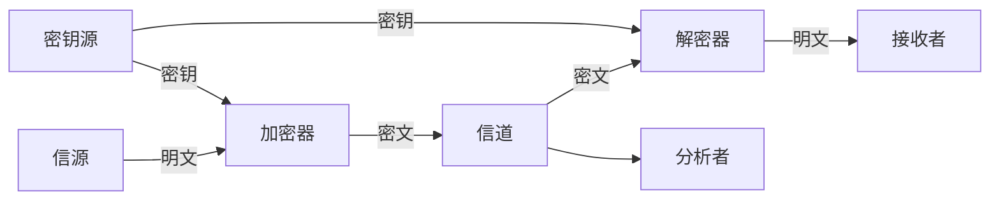

# 3.1 密码学基础——Shannon 理论

> 本笔记整理自 Shannon 理论课件，系统说明密码体制的安全性准则、完善保密性、一次一密、信息熵、伪密钥与唯一解距离、复杂度理论、计算安全性和乘积密码体制。公式、证明、例题与课后证明题均按课件重构为可检索文本。

## 主要内容

- 安全性准则
- 完善保密性与一次一密
- 熵、条件熵、联合熵和互信息
- 伪密钥、自然语言多余度与唯一解距离
- 复杂度理论基础
- 计算安全性与实际安全
- 乘积密码体制

---

## 一、安全性准则

### 1. Shannon 理论与三类准则

1949 年，Claude Shannon 在 *Bell Systems Technical Journal* 发表论文 *Communication Theory of Secrecy Systems*。课件采用 Shannon 的思想，从以下角度评价密码体制：

- 计算安全性（computational security）
- 可证明安全性（provable security）
- 无条件安全性（unconditional security）

### 2. 计算安全性

核心思想是考虑攻破密码体制所需付出的计算代价。若使用最好的算法攻破一个密码体制至少需要 $N$ 次操作，其中 $N$ 是某个特定的、非常大的数，则称该密码体制是计算安全的。

这一准则的不足是：没有一个已知的实际密码体制能够在该定义下被证明安全。实践中通常只针对某种攻击类型研究计算安全性；对一种攻击安全，不代表对其他攻击也安全。

### 3. 可证明安全性

核心思想是把密码体制的安全性归结为某个经过深入研究的数学难题。例如，若整数 $n$ 不可分解，则某密码体制不可破解，便称其为可证明安全。

这种途径只说明安全性与另一个问题相关，并未完全证明安全，因为作为基础的数学问题本身可能仍未被证明困难。课件以“判定合数是否具有非平凡因子”与 NP 完全问题的关系说明这种局限。

### 4. 无条件安全性与语义安全性

> **无条件安全性**：即使攻击者 Oscar 获得无穷的计算资源，也无法成功攻击的密码体制。

一次一密是典型例子。

> **语义安全性**：允许敌手具有多项式有界的计算能力；无论敌手在多项式时间内能从密文计算出多少有关明文的信息，他也能在没有密文时计算出这些信息。换言之，拥有密文不能帮助敌手获得关于明文的任何有用信息。

讨论安全性时必须明确攻击类型。例如，移位密码、代换密码和维吉尼亚密码对足够长密文的唯密文攻击都不是计算安全的；但若仅用一个密钥字加密一个明文字母，移位与代换密码具有完善保密性。密钥长度为 $m$ 的维吉尼亚密码用于加密一个由 $m$ 个字母组成的单位明文时，也具有无条件安全性。

---

## 二、完善保密性

### 1. 概率模型

设 $(P,C,K,E,D)$ 是一个特定密码体制，密钥 $K\in\mathcal K$ 只用于一次加密。明文空间 $\mathcal P$ 上存在先验概率分布，用随机变量 $X$ 表示明文，$\Pr[X=x]$ 表示明文 $x$ 发生的先验概率。Alice 和 Bob 按固定概率分布选择密钥，用随机变量 $K$ 表示密钥，$\Pr[K=k]$ 表示选择 $k$ 的概率；密钥是在 Alice 知道明文前选取的，因此可合理假设 $X$ 与 $K$ 独立。

$X$ 和 $K$ 的概率分布共同决定密文随机变量 $Y$ 的分布。对密钥 $k\in\mathcal K$，定义

$$
C(k)=\{e_k(x):x\in\mathcal P\},
$$

即密钥 $k$ 可产生的全部密文。对任意 $y\in\mathcal C$，

$$
\Pr[Y=y]=\sum_{\{k:y\in C(k)\}}\Pr[K=k]\Pr[X=d_k(y)].
$$

对任意 $y\in\mathcal C$ 和 $x\in\mathcal P$，条件概率为

$$
\Pr[Y=y\mid X=x]=\sum_{\{k:e_k(x)=y\}}\Pr[K=k].
$$

由 Bayes 公式，

$$
\Pr[X=x\mid Y=y]
=\frac{\sum_{\{k:x=d_k(y)\}}\Pr[K=k]\Pr[X=d_k(y)]}
{\sum_{\{k:y\in C(k)\}}\Pr[K=k]\Pr[X=d_k(y)]}.
$$

### 2. 定义与判别

> **定义：完善保密性**
> 一个密码体制具有完善保密性，如果对任意 $x\in\mathcal P$ 和 $y\in\mathcal C$，均有
> $$
> \Pr[X=x\mid Y=y]=\Pr[X=x].
> $$
> 即观察到密文后，明文的后验概率仍等于其先验概率。

等价地，

$$
\Pr[Y=y\mid X=x]=\Pr[Y=y].
$$

### 3. 非均匀例子

设 $\mathcal P=\{a,b\}$，$\Pr[a]=1/4$，$\Pr[b]=3/4$；$\mathcal K=\{K_1,K_2,K_3\}$，$\Pr[K_1]=1/2$，$\Pr[K_2]=\Pr[K_3]=1/4$；$\mathcal C=\{1,2,3,4\}$，加密矩阵为：

| 密钥 | $a$ | $b$ |
|---|---:|---:|
| $K_1$ | 1 | 2 |
| $K_2$ | 2 | 3 |
| $K_3$ | 3 | 4 |

密文概率为 $\Pr[1]=1/8$、$\Pr[2]=7/16$、$\Pr[3]=1/4$、$\Pr[4]=3/16$。例如给定密文 2，

$$
\Pr[a\mid 2]=\frac17,\qquad \Pr[b\mid 2]=\frac67,
$$

与先验概率不同，所以该体制不具有完善保密性；课件指出，密文 $y=3$ 满足定义，但其他密文不满足。

### 4. 单字母移位密码

> **定理**：移位密码的 26 个密钥都以相同概率 $1/26$ 使用时，对任意明文概率分布，单字母移位密码具有完善保密性。

证明要点如下。令 $\mathcal P=\mathcal C=\mathcal K=\mathbb Z_{26}$，$e_k(x)=(x+k)\bmod 26$。对任意 $y$，映射 $(y-k)\bmod 26$ 构成 $\mathbb Z_{26}$ 的置换，因此

$$
\Pr[Y=y]=\sum_{k\in\mathbb Z_{26}}\frac1{26}\Pr[X=y-k]=\frac1{26}.
$$

对任意 $x,y$，恰有一个密钥 $k=(y-x)\bmod 26$ 满足 $e_k(x)=y$，故

$$
\Pr[Y=y\mid X=x]=\frac1{26}.
$$

由 Bayes 定理，$\Pr[X=x\mid Y=y]=\Pr[X=x]$。

> **结论**：如果用新的随机密钥加密每个明文字母，移位密码是“不可攻破的”。

### 5. Shannon 的密钥空间下界

> **定理**：设密码体制 $(\mathcal P,\mathcal C,\mathcal K,E,D)$ 满足 $|\mathcal K|=|\mathcal C|=|\mathcal P|$。若它具有完善保密性，当且仅当每个密钥以概率 $1/|\mathcal K|$ 使用，且对任意 $x\in\mathcal P$、$y\in\mathcal C$，存在唯一密钥 $k$ 使 $e_k(x)=y$。

一般地，对所有 $x\in\mathcal P$ 和 $y\in\mathcal C$，完善保密性与正概率条件保证至少存在一个密钥 $k$ 使 $e_k(x)=y$，因此 $|\mathcal C|\le |\mathcal K|$。又因为每个加密函数是单射，所以 $|\mathcal C|\ge|\mathcal P|$。当 $|\mathcal K|=|\mathcal P|$ 时，唯一性和均匀选钥随之得到。

---

## 三、一次一密

### 1. 密码体制

> **密码体制：一次一密**
> 设 $n\ge1$，$\mathcal P=\mathcal C=\mathcal K=(\mathbb Z_2)^n$。对 $K=(K_1,\ldots,K_n)$，定义
> $$
> e_K(x_1,\ldots,x_n)=(x_1+K_1,\ldots,x_n+K_n)\pmod 2,
> $$
> $$
> d_K(y_1,\ldots,y_n)=(y_1+K_1,\ldots,y_n+K_n)\pmod 2.
> $$

加密与解密相同。由上一节定理，一次一密在密钥均匀随机、与明文等长且每个密钥只使用一次时提供完善保密性。该体制由 Gilbert Vernam 于 1917 年提出，Shannon 约 30 年后给出其完善保密性的数学证明。

### 2. 优势与限制

一次一密算法与解密都很容易，但存在明显限制：

1. $|\mathcal K|\ge|\mathcal P|$，密钥数量至少与明文数量相同。
2. 同一密钥不能加密不同消息；复用密钥会产生严重安全问题。
3. 每次传送新消息前，双方都必须通过安全方式共享新的密钥，密钥分配与管理困难。
4. 已知明文攻击很脆弱，因为可由 $K=x+e_K(x)$ 直接得到密钥。

因此，一次一密在要求无条件安全的军事和外交环境中很重要，但商业应用受到限制。密码学发展中，人们转而设计密钥较短、可加密较长消息且仍能保障一定计算安全性的体制，数据加密标准 DES 是后续课程的例子。

---

## 四、熵及其性质

### 1. 信息量与熵

从概率测度看，事件 $x_i$ 发生概率为 $p(x_i)$ 时，其自信息量为

$$
I(x_i)=-\log_2 p(x_i).
$$

> **定义：熵**
> 随机变量 $X$ 取值于 $\{x_i\mid i=1,\ldots,n\}$，且 $p(x_i)=p_i$。$X$ 的信息熵为
> $$
> H(X)=\sum_{i=1}^{n}p(x_i)I(x_i)=-\sum_{i=1}^{n}p(x_i)\log_2p(x_i).
> $$

### 2. 条件熵、联合熵与链式法则

> **定义：条件熵**
> $$
> H(X\mid Y)=\sum_{x,y}p(x,y)I(x\mid y)
> =-\sum_{x,y}p(x,y)\log_2p(x\mid y).
> $$

> **定义：联合熵**
> $$
> H(X,Y)=\sum_{x,y}p(x,y)I(x,y)
> =-\sum_{x,y}p(x,y)\log_2p(x,y).
> $$

> **链式法则**
> $$
> H(X,Y)=H(X)+H(Y\mid X).
> $$

### 3. 互信息

> **定义：互信息**
> $$
> I(X;Y)=\sum_{x,y}p(x,y)\log\frac{p(x,y)}{p(x)p(y)}.
> $$

互信息与熵满足

$$
I(X;Y)=H(X)+H(Y)-H(X,Y),
$$

且 $I(X;Y)\ge0$，当且仅当 $X$ 与 $Y$ 相互独立时等号成立。在通信系统中，$X$ 表示输入空间，$Y$ 表示输出空间；通常称 $H(X\mid Y)$ 为含糊度，$H(Y\mid X)$ 为散布度，平均互信息还可写成

$$
I(X;Y)=H(X)-H(X\mid Y).
$$

---

## 五、伪密钥和唯一解距离

### 1. 条件熵与密钥不确定性

> **定义：密钥含糊度**
> $H(K\mid C)$ 度量给定密文时密钥的不确定性。

对密码体制有

> **定理**
> $$
> H(K\mid C)=H(K)+H(P)-H(C).
> $$

证明中利用 $K$ 与 $P$ 独立，以及密钥和密文唯一决定明文、密钥和明文唯一决定密文，故 $H(C\mid K,P)=0$、$H(P\mid K,C)=0$。

例如，若 $H(P)\approx0.81$、$H(K)\approx1.5$、$H(C)\approx1.85$，则

$$
H(K\mid C)\approx1.5+0.81-1.85=0.46.
$$

### 2. 伪密钥

密码分析的基本目标是确定密钥。攻击者面对密文时，可能得到多个可产生有意义明文的候选密钥；其中只有一个正确，其余称为**伪密钥**。课件以移位密文 `WNAJW` 为例：仅有两个有意义的候选明文 `river` 与 `alive`，对应密钥 $F=5$ 和 $M=22$，一真一伪。

> **思考**：攻击者得到的密文越长，通常越容易确定正确密钥。

### 3. 自然语言的熵与多余度

对长度为 $n$ 的明文，定义 $P^n$ 为所有 $n$ 字母序列的概率分布。以英语为例：零阶近似假定字母均匀独立，得 $H(P)\approx\log_2 26\approx4.70$；一阶近似利用单字母频率。一般地，定义英语的熵为

$$
H_L=\lim_{n\to\infty}\frac{H(P^n)}{n}.
$$

> **定义：语言多余度**
> $$
> R_L=1-\frac{H_L}{\log_2|P|}.
> $$

$H_L$ 度量每个字母的平均熵，$R_L$ 度量“多余字母”比例。实验经验值为 $1.0\le H_L\le1.5$，课件取 $H_L\approx1.25$，则英语多余度约为 $0.75$；这表示充分大的英语文本理论上可用 Huffman 编码压缩到原长约四分之一。

### 4. 长密文、可能密钥与期望伪密钥数

给定 $K$ 和 $P^n$ 的概率分布，可推出 $C^n$ 的分布。对 $y\in C^n$，定义

$$
K(y)=\{K\in\mathcal K:\exists x\in P^n,\Pr[x]>0, e_K(x)=y\}.
$$

$K(y)$ 是密文 $y$ 的可能密钥集合。若观察密文 $y$，伪密钥数为 $|K(y)|-1$；在所有长度为 $n$ 的密文上的期望伪密钥数记为

$$
\bar s_n=\sum_{y\in C^n}\Pr[y](|K(y)|-1).
$$

由课件定理与 Jensen 不等式可得

$$
H(K\mid C^n)\ge H(K)-nR_L\log_2|P|,
$$

$$
H(K\mid C^n)\le\log_2(\bar s_n+1),
$$

从而

$$
\log_2(\bar s_n+1)\ge H(K)-nR_L\log_2|P|.
$$

均匀选钥时，

$$
\bar s_n\ge\frac{|K|}{|P|^{nR_L}}-1.
$$

### 5. 唯一解距离

> **定义：唯一解距离**
> 使期望伪密钥数为零的密文长度记为 $n_0$。即在给定足够计算时间时，分析者能唯一计算出密钥所需密文的平均量。

令 $\bar s_n=0$，得到近似估计

$$
n_0\approx\frac{\log_2|K|}{R_L\log_2|P|}.
$$

**例**：代换密码有 $|P|=26$、$|K|=26!$。若 $R_L=0.75$，则

$$
n_0\approx\frac{\log_2(26!)}{0.75\log_2 26}\approx25.
$$

即密文长度至少约为 25 时，通常才可能唯一确定密钥。

---

## 六、复杂度理论基础

### 1. 问题的定义与分类

课件用背包向量 $A=(a_1,\ldots,a_n)$、目标和 $S$ 说明问题实例：求子集 $A'\subseteq A$ 使 $\sum_{a_i\in A'}a_i=S$。例如 $A=(1,2,5,10,20,50,100)$、$S=177$，一个解是所有元素之和。

问题用于描述参量及答案应满足的性质；参量取具体数值时称为问题的一个实例。问题分为：

1. 判定问题：回答仅为 Yes 或 No。
2. 计算问题：从可行解集合中搜索最优解。

课件还列出：判定整数 $N$ 是否为素数、判断 77 或 79 是否为素数、求 $N$ 或 177 的素分解等实例。

### 2. 算法与复杂度

> **定义：算法**
> 解题方案的准确而完整的描述；从一个初始状态和输入开始，经过有限、定义清楚的状态，产生输出并停止于终态。

确定算法写为 $A(u)=v$；概率算法写为 $A(u,r)=v$，其中 $r$ 是 $\{0,1\}^n$ 上的均匀随机变量。

时间复杂性考虑主要操作步骤与总操作次数；空间复杂性考虑执行所需存储单元数目；数据复杂性表示计算资源。运行时间可理解为

$$
\text{运行时间}=\frac{\text{基本操作数量}}{\text{机器速度}}.
$$

**例：试除判素数**。对小于 100 的整数 $x$，方法一试除 $2\sim\sqrt x$，最坏试除次数为 $\lfloor\sqrt x\rfloor$，存储空间为 0；方法二预存小于 100 的素数，再逐个试除，最坏比较次数为 $100/\ln100$，存储空间也为 $100/\ln100$。

> **定义：多项式时间算法**
> 若算法计算复杂度为 $O(n^t)$，$t$ 为常数、$n$ 为输入长度，则称其复杂度为多项式的，算法为多项式时间算法。

若不存在常数 $c>0$ 和 $n_0>0$ 使 $|g(n)|\le c|n|^t$ 对所有 $n>n_0$ 成立，则为非多项式时间算法。

按时间或空间，算法可分为多项式时间 $O(n^t)$、指数时间 $O(t^{f(n)})$ 和亚指数时间（介于二者之间）。

### 3. 问题复杂性、P、NP、NPC 与 NP-hard

一个问题的复杂性由确定型图灵机上解决该问题的最难实例所需最少时间与空间决定。

- P 问题：确定型图灵机上可用多项式时间解决，称易处理（tractable）。
- 非确定型多项式时间可解的问题称 NP；其求解过程可概括为“猜测—验证”，猜中的解可在多项式时间内验证。
- $P\subseteq NP$，是否 $P=NP$ 尚未知。

课件给出的 NP 例子包括：

1. 背包／子集和问题：判定是否存在 $A'\subseteq A$ 满足 $\sum_{x\in A'}x=S$。
2. 可满足性问题 SAT：判定布尔函数 $f(x_1,\ldots,x_n)$ 是否存在赋值使 $f=1$。

> **NP 完全问题（NPC）**：问题属于 NP，且 NP 中任一问题都可在多项式时间转化为它；例如 SAT、子集和。NPC 被称为 NP 中“最难”的问题。

> **NP-hard 问题**：NP 中任一问题都能多项式时间转化为它；它不必属于 NP。例如最短向量问题。课件随后分别介绍 P、NP、NPC 与 NP-hard，并以“最难”或“求解难度”说明后两类问题的地位。

---

## 七、计算安全性与实际安全

### 1. 增长速度与可行性

课件比较二次、三次与 $2^x$ 函数：多项式增长较慢，指数函数随输入长度迅速爆炸。假设计算机每秒执行一百万次操作：

| 输入长度 $n$ | 10 | 30 | 50 | 60 |
|---|---:|---:|---:|---:|
| $T(n)=n^2$ | 0.0001 s | 0.0009 s | 0.0025 s | 0.0036 s |
| $T(n)=2^n$ | 0.001 s | 17.9 min | 35.7 年 | 366 世纪 |

当输入长度足够大、分析算法复杂度足够高时，有限计算能力内破解不再可行，这就是计算安全性思想。

### 2. 实际安全

> **实际安全**：密码系统满足以下准则之一：
> 1. 破译成本超过被加密信息本身的价值。
> 2. 破译所需时间超过被加密信息的有效生命周期。

---

## 八、乘积密码体制

### 1. 定义

Shannon 在 1949 年论文中提出通过“乘积”组合密码体制。设

$$
S_1=(P,P,K_1,E_1,D_1),\qquad S_2=(P,P,K_2,E_2,D_2),
$$

二者有相同的明文／密文空间，则乘积密码体制 $S_1\times S_2$ 定义为

$$
(P,P,K_1\times K_2,E,D).
$$

密钥为 $K=(K_1,K_2)$，加密和解密为

$$
e_{(K_1,K_2)}(x)=e_{K_2}(e_{K_1}(x)),
$$

$$
d_{(K_1,K_2)}(y)=d_{K_1}(d_{K_2}(y)).
$$

解密必须按加密的相反顺序进行。若密钥独立选择，

$$
\Pr[(K_1,K_2)]=\Pr[K_1]\Pr[K_2].
$$

仿射密码可看作乘法密码与加法密码的乘积。乘法密码体制为：

> $P=C=\mathbb Z_{26}$，$K=\{a\in\mathbb Z_{26}:\gcd(a,26)=1\}$，
> $$e_a(x)=ax\pmod{26},\qquad d_a(y)=a^{-1}y\pmod{26}.$$

### 2. 结合性、幂与幂等性

乘积运算满足结合律：

$$
(S_1\times S_2)\times S_3=S_1\times(S_2\times S_3).
$$

$S\times S$ 记为 $S^2$，$n$ 重乘积记为 $S^n$。若 $S^2=S$，称密码体制 $S$ 幂等；移位、代换、仿射、Hill 密码等都是幂等的，因此对它们重复使用同类体制没有意义，只需要多余的密钥交换而不提供更强安全性。

若体制不幂等，多次迭代可能提高安全性，DES 的 16 轮迭代体现这一思想。构造简单非幂等体制的一种方法，是对两种不同的简单密码体制做乘积。

> **定理**：若 $S_1$、$S_2$ 均为幂等且可交换，则 $S_1\times S_2$ 也是幂等的。

课件证明利用结合律与幂等性重排并化简：

$$
(S_1\times S_2)^2
=S_1\times S_2\times S_1\times S_2
=S_1\times S_1\times S_2\times S_2
=S_1\times S_2.
$$

课件最后指出，很多简单密码体制适合这种构造，通常使用代换密码和置换密码的乘积；DES 中也能看到这种技术。

### 3. 保密系统数学模型

课件末页图可重构为：

信源产生明文，密钥源向加密器与解密器提供密钥，密文经信道送达解密器，同时可能被分析者观察。

---

## 本章小结

| 主题    | 核心结论                                 |
| ----- | ------------------------------------ |
| 安全性准则 | 计算安全、可证明安全、无条件安全与语义安全从不同假设衡量安全性      |
| 完善保密性 | 观察密文后明文的后验分布不变；通常要求密钥空间至少与明文空间一样大    |
| 一次一密  | 等长、均匀随机、只用一次的密钥提供完善保密性，但密钥分配困难       |
| 熵与互信息 | 熵衡量不确定性，条件熵衡量已知条件后的剩余不确定性，互信息衡量共享信息  |
| 伪密钥   | 密文越长，期望伪密钥数通常越小；唯一解距离估计确定密钥所需的平均密文长度 |
| 复杂度   | P、NP、NPC 与 NP-hard 描述问题的可解性与相对困难程度   |
| 计算安全性 | 当破解成本或时间不可接受时，密码体制具有实际意义上的安全性        |
| 乘积密码  | 组合简单变换构造复杂体制，结合律、幂等性与可交换性决定重复组合的效果   |

---

## 课后作业

证明：

$$
H(X,Y)\le H(X)+H(Y),
$$

且当且仅当 $X$ 和 $Y$ 统计独立时等号成立。
