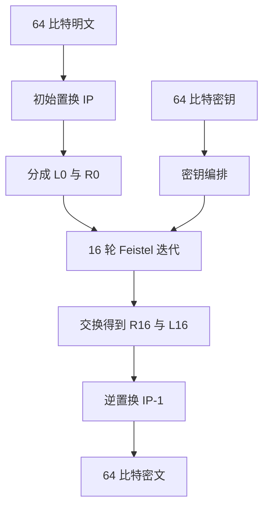
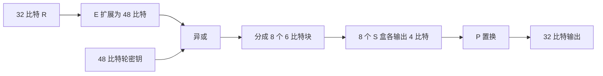

# 4.3 分组密码（二）

> 本笔记依据“第4章 分组密码（二）”课件整理，完整说明 DES 的总体结构、轮函数、密钥编排、解密、安全性和 Triple-DES。原课件中的结构图与固定置换表已重建为 Mermaid、公式和原生表格；重复 OCR 副本未使用。

## 主要内容

- DES 的总体结构与 16 轮 Feistel 迭代
- 初始置换与逆初始置换
- E 扩展、密钥加、S 盒和 P 置换
- DES 的密钥编排算法
- 解密与互补性质
- 弱密钥、半弱密钥、S 盒准则与穷举攻击
- Triple-DES

---

## 一、DES 总体结构

### 1. 参数

> **DES 密码体制**：明文和密文分组均为 64 比特；输入密钥为 64 比特，其中每 8 比特的最后一位是奇偶校验位，因此有效密钥长度为 56 比特。DES 采用 16 轮 Feistel 结构，每轮使用一个 48 比特子密钥。



### 2. 初始置换与逆置换

IP 按下表顺序重新排列输入位：

| IP | 1 | 2 | 3 | 4 | 5 | 6 | 7 | 8 |
|---|---:|---:|---:|---:|---:|---:|---:|---:|
| 第1行 | 58 | 50 | 42 | 34 | 26 | 18 | 10 | 2 |
| 第2行 | 60 | 52 | 44 | 36 | 28 | 20 | 12 | 4 |
| 第3行 | 62 | 54 | 46 | 38 | 30 | 22 | 14 | 6 |
| 第4行 | 64 | 56 | 48 | 40 | 32 | 24 | 16 | 8 |
| 第5行 | 57 | 49 | 41 | 33 | 25 | 17 | 9 | 1 |
| 第6行 | 59 | 51 | 43 | 35 | 27 | 19 | 11 | 3 |
| 第7行 | 61 | 53 | 45 | 37 | 29 | 21 | 13 | 5 |
| 第8行 | 63 | 55 | 47 | 39 | 31 | 23 | 15 | 7 |

逆置换 $IP^{-1}$：

| $IP^{-1}$ | 1 | 2 | 3 | 4 | 5 | 6 | 7 | 8 |
|---|---:|---:|---:|---:|---:|---:|---:|---:|
| 第1行 | 40 | 8 | 48 | 16 | 56 | 24 | 64 | 32 |
| 第2行 | 39 | 7 | 47 | 15 | 55 | 23 | 63 | 31 |
| 第3行 | 38 | 6 | 46 | 14 | 54 | 22 | 62 | 30 |
| 第4行 | 37 | 5 | 45 | 13 | 53 | 21 | 61 | 29 |
| 第5行 | 36 | 4 | 44 | 12 | 52 | 20 | 60 | 28 |
| 第6行 | 35 | 3 | 43 | 11 | 51 | 19 | 59 | 27 |
| 第7行 | 34 | 2 | 42 | 10 | 50 | 18 | 58 | 26 |
| 第8行 | 33 | 1 | 41 | 9 | 49 | 17 | 57 | 25 |

### 3. 轮迭代与解密

> 第 $i$ 轮满足
> $$
> L_i=R_{i-1},\qquad R_i=L_{i-1}\oplus f(R_{i-1},K_i),\quad1\le i\le16.
> $$

加密输出为 $IP^{-1}(R_{16}\|L_{16})$。解密与加密使用同一算法结构，只把子密钥按 $K_{16},K_{15},\ldots,K_1$ 的顺序使用。Feistel 的可逆性不要求轮函数 $f$ 本身可逆。

---

## 二、DES 轮函数

### 1. 轮函数流程

> $f$ 的输入为 32 比特 $R_{i-1}$ 和 48 比特 $K_i$，输出 32 比特：
> $$
> f(R,K)=P\bigl(S(E(R)\oplus K)\bigr).
> $$



### 2. E 扩展

| E | 1 | 2 | 3 | 4 | 5 | 6 |
|---|---:|---:|---:|---:|---:|---:|
| 第1组 | 32 | 1 | 2 | 3 | 4 | 5 |
| 第2组 | 4 | 5 | 6 | 7 | 8 | 9 |
| 第3组 | 8 | 9 | 10 | 11 | 12 | 13 |
| 第4组 | 12 | 13 | 14 | 15 | 16 | 17 |
| 第5组 | 16 | 17 | 18 | 19 | 20 | 21 |
| 第6组 | 20 | 21 | 22 | 23 | 24 | 25 |
| 第7组 | 24 | 25 | 26 | 27 | 28 | 29 |
| 第8组 | 28 | 29 | 30 | 31 | 32 | 1 |

### 3. S 盒查表规则

将 48 比特分为 $B_1,\ldots,B_8$。对 $B_i=b_1b_2b_3b_4b_5b_6$，行号由 $b_1b_6$ 的二进制值给出，列号由 $b_2b_3b_4b_5$ 给出，$S_i$ 输出相应整数的 4 比特表示。

下表每个单元格按“第 0 行；第 1 行；第 2 行；第 3 行”给出 16 个值：

| S 盒 | 四行取值 |
|---|---|
| $S_1$ | 14 4 13 1 2 15 11 8 3 10 6 12 5 9 0 7；0 15 7 4 14 2 13 1 10 6 12 11 9 5 3 8；4 1 14 8 13 6 2 11 15 12 9 7 3 10 5 0；15 12 8 2 4 9 1 7 5 11 3 14 10 0 6 13 |
| $S_2$ | 15 1 8 14 6 11 3 4 9 7 2 13 12 0 5 10；3 13 4 7 15 2 8 14 12 0 1 10 6 9 11 5；0 14 7 11 10 4 13 1 5 8 12 6 9 3 2 15；13 8 10 1 3 15 4 2 11 6 7 12 0 5 14 9 |
| $S_3$ | 10 0 9 14 6 3 15 5 1 13 12 7 11 4 2 8；13 7 0 9 3 4 6 10 2 8 5 14 12 11 15 1；13 6 4 9 8 15 3 0 11 1 2 12 5 10 14 7；1 10 13 0 6 9 8 7 4 15 14 3 11 5 2 12 |
| $S_4$ | 7 13 14 3 0 6 9 10 1 2 8 5 11 12 4 15；13 8 11 5 6 15 0 3 4 7 2 12 1 10 14 9；10 6 9 0 12 11 7 13 15 1 3 14 5 2 8 4；3 15 0 6 10 1 13 8 9 4 5 11 12 7 2 14 |
| $S_5$ | 2 12 4 1 7 10 11 6 8 5 3 15 13 0 14 9；14 11 2 12 4 7 13 1 5 0 15 10 3 9 8 6；4 2 1 11 10 13 7 8 15 9 12 5 6 3 0 14；11 8 12 7 1 14 2 13 6 15 0 9 10 4 5 3 |
| $S_6$ | 12 1 10 15 9 2 6 8 0 13 3 4 14 7 5 11；10 15 4 2 7 12 9 5 6 1 13 14 0 11 3 8；9 14 15 5 2 8 12 3 7 0 4 10 1 13 11 6；4 3 2 12 9 5 15 10 11 14 1 7 6 0 8 13 |
| $S_7$ | 4 11 2 14 15 0 8 13 3 12 9 7 5 10 6 1；13 0 11 7 4 9 1 10 14 3 5 12 2 15 8 6；1 4 11 13 12 3 7 14 10 15 6 8 0 5 9 2；6 11 13 8 1 4 10 7 9 5 0 15 14 2 3 12 |
| $S_8$ | 13 2 8 4 6 15 11 1 10 9 3 14 5 0 12 7；1 15 13 8 10 3 7 4 12 5 6 11 0 14 9 2；7 11 4 1 9 12 14 2 0 6 10 13 15 3 5 8；2 1 14 7 4 10 8 13 15 12 9 0 3 5 6 11 |

### 4. P 置换

| P | 1 | 2 | 3 | 4 |
|---|---:|---:|---:|---:|
| 第1行 | 16 | 7 | 20 | 21 |
| 第2行 | 29 | 12 | 28 | 17 |
| 第3行 | 1 | 15 | 23 | 26 |
| 第4行 | 5 | 18 | 31 | 10 |
| 第5行 | 2 | 8 | 24 | 14 |
| 第6行 | 32 | 27 | 3 | 9 |
| 第7行 | 19 | 13 | 30 | 6 |
| 第8行 | 22 | 11 | 4 | 25 |

---

## 三、密钥编排

### 1. 生成步骤

1. 对 64 比特输入密钥施加 PC-1，去除位置 $8,16,\ldots,64$ 的校验位，得到 56 比特。
2. 分成两个 28 比特寄存器 $C_0,D_0$。
3. 第 $i$ 轮分别循环左移 $s_i$ 位，得到 $C_i,D_i$。
4. 对 $C_i\|D_i$ 施加 PC-2，选出 48 比特轮密钥 $K_i$。

移位量为：

| 轮次 | 1 | 2 | 3 | 4 | 5 | 6 | 7 | 8 | 9 | 10 | 11 | 12 | 13 | 14 | 15 | 16 |
|---|---:|---:|---:|---:|---:|---:|---:|---:|---:|---:|---:|---:|---:|---:|---:|---:|
| 左移 | 1 | 1 | 2 | 2 | 2 | 2 | 2 | 2 | 1 | 2 | 2 | 2 | 2 | 2 | 2 | 1 |

### 2. PC-1 与 PC-2

| PC-1（前 28 位 $C_0$） | 1 | 2 | 3 | 4 | 5 | 6 | 7 |
|---|---:|---:|---:|---:|---:|---:|---:|
| 第1行 | 57 | 49 | 41 | 33 | 25 | 17 | 9 |
| 第2行 | 1 | 58 | 50 | 42 | 34 | 26 | 18 |
| 第3行 | 10 | 2 | 59 | 51 | 43 | 35 | 27 |
| 第4行 | 19 | 11 | 3 | 60 | 52 | 44 | 36 |

| PC-1（后 28 位 $D_0$） | 1 | 2 | 3 | 4 | 5 | 6 | 7 |
|---|---:|---:|---:|---:|---:|---:|---:|
| 第1行 | 63 | 55 | 47 | 39 | 31 | 23 | 15 |
| 第2行 | 7 | 62 | 54 | 46 | 38 | 30 | 22 |
| 第3行 | 14 | 6 | 61 | 53 | 45 | 37 | 29 |
| 第4行 | 21 | 13 | 5 | 28 | 20 | 12 | 4 |

| PC-2 | 1 | 2 | 3 | 4 | 5 | 6 |
|---|---:|---:|---:|---:|---:|---:|
| 第1行 | 14 | 17 | 11 | 24 | 1 | 5 |
| 第2行 | 3 | 28 | 15 | 6 | 21 | 10 |
| 第3行 | 23 | 19 | 12 | 4 | 26 | 8 |
| 第4行 | 16 | 7 | 27 | 20 | 13 | 2 |
| 第5行 | 41 | 52 | 31 | 37 | 47 | 55 |
| 第6行 | 30 | 40 | 51 | 45 | 33 | 48 |
| 第7行 | 44 | 49 | 39 | 56 | 34 | 53 |
| 第8行 | 46 | 42 | 50 | 36 | 29 | 32 |

PC-2 不选取 $9,18,22,25,35,38,43,54$ 这些位置。

---

## 四、安全性与增强

### 1. 期望性质与互补性

期望的分组密码性质包括：密文每一比特依赖密钥和明文的全部比特；明文之间无明显统计关联；改变任意一个明文或密钥比特，会使约一半输出比特改变。

DES 具有互补性质。若 $y=E_k(x)$，则

$$
\overline y=E_{\overline k}(\overline x).
$$

因此在选择明文攻击下，若同时获得互补的样本，穷举搜索量可约减半，但并未从根本上解决 56 比特密钥过短问题。

### 2. 弱密钥与半弱密钥

> **弱密钥**：若对所有明文 $x$ 都有 $E_k(E_k(x))=x$，即 $E_k=D_k$，则 $k$ 为弱密钥。

四个 DES 弱密钥（十六进制，含校验位）为：

```text
0101010101010101
FEFEFEFEFEFEFEFE
E0E0E0E0F1F1F1F1
1F1F1F1F0E0E0E0E
```

> **半弱密钥对**：若 $(k,k')$ 满足 $E_k(E_{k'}(x))=x$，则两者为半弱密钥对。DES 有 6 对半弱密钥。课件指出弱密钥与半弱密钥所占比例极小，不构成 DES 的主要安全威胁。

### 3. S 盒设计原则

课件列出的 S 盒准则包括：
1. 每行是 $0$ 至 $15$ 的一个置换。
2. 输出不能是输入的线性或仿射函数。
3. 输入异或 `001100` 时，输出至少有 2 比特不同。
4. 对 $e,f\in\{0,1\}$，$S(x)\ne S(x\oplus11ef00)$。
5. 固定一个输入位而改变其余五位时，各输出位的 $0$、$1$ 总数应接近均衡。

### 4. 穷举攻击与 Triple-DES

课件记录了 DES 穷举进展：1997 年分布式搜索约 96 天；Wiener 估计专用机约 1.5 天；1998 年 EFF 以 25 万美元设备在 56 小时完成搜索。其他威胁还包括差分、线性、相关密钥与侧信道攻击。

课件列出的软件性能参考为 [Crypto++ Benchmarks](http://www.cryptopp.com/benchmarks.html)。

> **Triple-DES**：若 $E:K\times M\to M$ 是分组密码，三重加密定义为
> $$
> 3E((k_1,k_2,k_3),m)=E_{k_3}\bigl(E_{k_2}(E_{k_1}(m))\bigr).
> $$
> 三个独立 DES 密钥时名义密钥长度为 $3\times56=168$ 比特。

---

## 本章小结

| 主题 | 核心结论 |
|---|---|
| DES 结构 | 64 比特分组、56 比特有效密钥、16 轮 Feistel |
| 轮函数 | $P(S(E(R)\oplus K))$ |
| 密钥编排 | PC-1、循环左移、PC-2 产生 16 个 48 比特子密钥 |
| 解密 | 同一结构，子密钥顺序反转 |
| 主要弱点 | 密钥空间过小，已可被专用硬件穷举 |
| 安全增强 | Triple-DES 通过多重加密延长有效密钥 |


