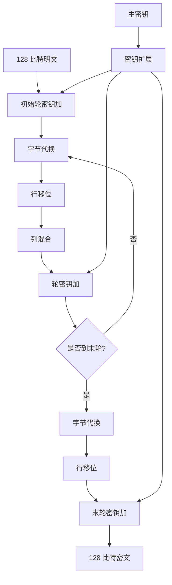
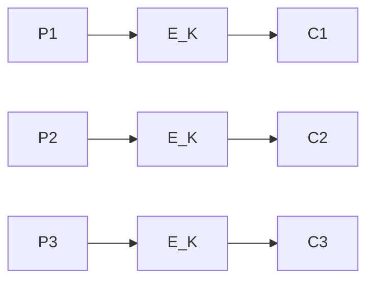
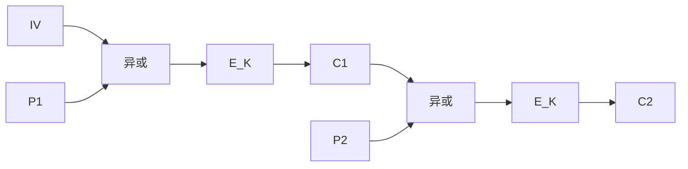

# 4.4 分组密码（三）

> 本笔记依据“第4章 分组密码（三）”课件整理，系统说明 AES 的状态结构、四种轮变换、密钥扩展与逆变换，并概述 IDEA、RC5、轻量级密码和 SM4。最后将 ECB、CBC、CFB、OFB、CTR 五种工作模式的流程图完整转写为公式、Mermaid 与对比表。

## 主要内容

- AES 的参数、整体结构与 S 盒
- 字节代换、行移位、列混合和轮密钥加
- AES 密钥扩展与解密
- AES 的雪崩效应与安全分析
- IDEA、RC5、轻量级分组密码与 SM4
- ECB、CBC、CFB、OFB、CTR 工作模式

---

## 一、AES 总体结构

### 1. 形成与参数

AES 征集始于 1997 年；1998 年收到 21 个算法并公布 15 个候选；1999 年选出 MARS、RC6、Rijndael、Serpent、Twofish；2000 年选定 Rijndael；2001 年以 FIPS 197 发布。Rijndael 由 Joan Daemen 与 Vincent Rijmen 设计。

> **AES 密码体制**：明文与密文分组均为 128 比特。密钥长度为 128、192、256 比特，分别使用 $N_r=10,12,14$ 轮。记 $N_b=4$，$N_k=4,6,8$。

输入 16 字节按列装入状态矩阵：

$$
S=\begin{pmatrix}
s_{0,0}&s_{0,1}&s_{0,2}&s_{0,3}\\
s_{1,0}&s_{1,1}&s_{1,2}&s_{1,3}\\
s_{2,0}&s_{2,1}&s_{2,2}&s_{2,3}\\
s_{3,0}&s_{3,1}&s_{3,2}&s_{3,3}
\end{pmatrix}.
$$

### 2. 加密流程

> 初始执行一次 `AddRoundKey`；前 $N_r-1$ 轮执行 `SubBytes → ShiftRows → MixColumns → AddRoundKey`；末轮省略 `MixColumns`。



---

## 二、AES 轮函数

### 1. 字节代换

> **SubBytes**：对状态中的每个字节独立施加同一个非线性 S 盒。

S 盒构造分两步：把字节视为 $GF(2^8)$ 元素，`00` 映射为 `00`，其余字节先求乘法逆元；再施加 $GF(2)$ 上的仿射变换

$$
b'_i=b_i\oplus b_{i+4}\oplus b_{i+5}\oplus b_{i+6}\oplus b_{i+7}\oplus c_i,
$$

下标模 $8$，常数为 `63`。课件示例：`95` 的域逆元为 `8A`，经仿射变换得到 `2A`。

### 2. 行移位

> **ShiftRows**：第 0 行不移；第 1、2、3 行分别循环左移 1、2、3 个字节。

$$
\begin{pmatrix}
a_{00}&a_{01}&a_{02}&a_{03}\\
a_{10}&a_{11}&a_{12}&a_{13}\\
a_{20}&a_{21}&a_{22}&a_{23}\\
a_{30}&a_{31}&a_{32}&a_{33}
\end{pmatrix}
\mapsto
\begin{pmatrix}
a_{00}&a_{01}&a_{02}&a_{03}\\
a_{11}&a_{12}&a_{13}&a_{10}\\
a_{22}&a_{23}&a_{20}&a_{21}\\
a_{33}&a_{30}&a_{31}&a_{32}
\end{pmatrix}.
$$

### 3. 列混合

> **MixColumns**：每列作为 $GF(2^8)$ 上的四字节向量，左乘固定可逆矩阵：

$$
\begin{pmatrix}
s'_{0,c}\\s'_{1,c}\\s'_{2,c}\\s'_{3,c}
\end{pmatrix}
=
\begin{pmatrix}
02&03&01&01\\
01&02&03&01\\
01&01&02&03\\
03&01&01&02
\end{pmatrix}
\begin{pmatrix}
s_{0,c}\\s_{1,c}\\s_{2,c}\\s_{3,c}
\end{pmatrix}.
$$

例如

$$
s'_{0,c}=\texttt{02}\cdot s_{0,c}\oplus\texttt{03}\cdot s_{1,c}\oplus s_{2,c}\oplus s_{3,c}.
$$

域乘法对 $m(x)=x^8+x^4+x^3+x+1$ 取模。快速实现利用

$$
\texttt{03}\cdot a=(\texttt{02}\cdot a)\oplus a
$$

与 [[现代密码学/笔记/4.1 有限域基础]] 中的 `xtime`。

### 4. 轮密钥加

> **AddRoundKey**：状态的 16 个字节与本轮 16 字节轮密钥逐字节异或。该变换自身即为逆变换。

---

## 三、AES 密钥编排

### 1. 字扩展

密钥扩展以 4 字节字为单位。输入密钥含 $N_k$ 个字，扩展为 $N_b(N_r+1)$ 个字 $w_i$。每四个连续字构成一轮密钥。

> 对 $i\ge N_k$，令 $temp=w_{i-1}$：
> $$
> \begin{cases}
> temp=\operatorname{SubWord}(\operatorname{RotWord}(temp))\oplus Rcon_{i/N_k},&i\equiv0\pmod{N_k},\\
> temp=\operatorname{SubWord}(temp),&N_k>6\text{ 且 }i\equiv4\pmod{N_k},\\
> temp=temp,&\text{其他}.
> \end{cases}
> $$
> 然后 $w_i=w_{i-N_k}\oplus temp$。

`RotWord` 将四字节循环左移一字节，`SubWord` 对每字节施加 AES S 盒。

### 2. 轮常数

$$
Rcon_i=(RC_i,\texttt{00},\texttt{00},\texttt{00}),
$$

其中 $RC_1=\texttt{01}$，$RC_i=\texttt{02}\cdot RC_{i-1}$，乘法在 $GF(2^8)$ 中进行。课件给出的前 10 个首字节为：

```text
01 02 04 08 10 20 40 80 1B 36
```

---

## 四、AES 解密与安全性

### 1. 逆变换

- `InvShiftRows`：第 1、2、3 行分别循环右移 1、2、3 字节。
- `InvSubBytes`：使用逆 S 盒。
- `AddRoundKey`：仍为异或。
- `InvMixColumns`：左乘

$$
\begin{pmatrix}
0E&0B&0D&09\\
09&0E&0B&0D\\
0D&09&0E&0B\\
0B&0D&09&0E
\end{pmatrix}.
$$

解密按轮密钥逆序执行。通过把中间轮密钥先施加逆列混合，可把解密组织成与加密相近的结构。

### 2. 雪崩效应

课件用表格比较改变明文一个比特或密钥一个比特后，各轮状态中不同位数量。结论是差异经过数轮迅速接近 128 位的一半，体现良好的扩散与雪崩效应。

### 3. 课件列出的分析结果

课件指出：当时已知攻击都未威胁完整轮 AES。相关密钥攻击对 AES-192 可达 8 轮、AES-256 可达 10 轮；针对 AES-256 的工作在特定相关密钥模型中使用极高的数据与时间复杂度。完整 AES-128、AES-192、AES-256 分别有 10、12、14 轮，因此这些结果不构成对完整算法的实用破译。

---

## 五、其他分组密码

### 1. IDEA

IDEA 由 Xuejia Lai 与 James Massey 于 1990 年提出，应用于 PGP。它采用 64 比特分组、128 比特密钥，8 轮加一个输出变换；每轮输入为四个 16 比特字，使用三种运算混合：

- 逐位异或；
- 模 $2^{16}$ 加法；
- 模 $2^{16}+1$ 乘法，其中全零字解释为 $2^{16}$。

密钥编排把 128 比特密钥依次分为 16 比特子密钥，再循环左移 25 位继续产生，共需 52 个子密钥。

### 2. RC5 与轻量级密码

RC5 由 Ronald Rivest 于 1994 年提出，是参数化算法：字长 $w$ 可为 16、32、64，比特分组为 $2w$；密钥长度可变；轮数可变。它混合异或、模 $2^w$ 加法和数据相关循环移位：

$$
x\lll y=x\text{ 循环左移 }(y\bmod w)\text{ 位}.
$$

轻量级分组密码面向智能卡、RFID 等资源受限设备，课件列举 PRESENT、PRINCE、SIMON、CLEFIA，常见分组长度 32 或 64 比特、密钥长度 64、80 或 128 比特。

### 3. SM4

> **SM4 参数**：128 比特分组、128 比特密钥、32 轮。四个 32 比特字 $(X_0,X_1,X_2,X_3)$ 经广义 Feistel 迭代，最后逆序输出：
> $$
> X_{i+4}=F(X_i,X_{i+1},X_{i+2},X_{i+3},rk_i),
> $$
> $$
> (Y_0,Y_1,Y_2,Y_3)=(X_{35},X_{34},X_{33},X_{32}).
> $$

轮函数为

$$
X_{i+4}=X_i\oplus T(X_{i+1}\oplus X_{i+2}\oplus X_{i+3}\oplus rk_i),
$$

其中 $T=L\circ\tau$，$\tau$ 对 32 比特字的四个字节分别施加 SM4 S 盒，线性变换为

$$
L(B)=B\oplus(B\lll2)\oplus(B\lll10)\oplus(B\lll18)\oplus(B\lll24).
$$

密钥编排先令

$$
(K_0,K_1,K_2,K_3)=MK\oplus(FK_0,FK_1,FK_2,FK_3),
$$

其中

```text
FK0=A3B1BAC6  FK1=56AA3350  FK2=677D9197  FK3=B27022DC
```

再计算

$$
rk_i=K_{i+4}=K_i\oplus T'(K_{i+1}\oplus K_{i+2}\oplus K_{i+3}\oplus CK_i),
$$

$$
T'=L'\circ\tau,\qquad L'(B)=B\oplus(B\lll13)\oplus(B\lll23).
$$

32 个 $CK_i$ 为：

```text
00070e15 1c232a31 383f464d 545b6269
70777e85 8c939aa1 a8afb6bd c4cbd2d9
e0e7eef5 fc030a11 181f262d 343b4249
50575e65 6c737a81 888f969d a4abb2b9
c0c7ced5 dce3eaf1 f8ff060d 141b2229
30373e45 4c535a61 686f767d 848b9299
a0a7aeb5 bcc3cad1 d8dfe6ed f4fb0209
10171e25 2c333a41 484f565d 646b7279
```

SM4 解密与加密结构相同，仅轮密钥按 $(rk_{31},\ldots,rk_0)$ 使用。

---

## 六、分组密码工作模式

设分组密码加密、解密为 $E_K,D_K$，消息分组为 $P_i$，密文为 $C_i$。

 ### 1. ECB

> $C_i=E_K(P_i)$，$P_i=D_K(C_i)$。



各分组独立，可并行、随机访问；但相同明文分组产生相同密文，暴露数据模式，剪切或替换分组也不易发现。

### 2. CBC

> $C_0=IV$，
> $$
> C_i=E_K(P_i\oplus C_{i-1}),\qquad P_i=D_K(C_i)\oplus C_{i-1}.
> $$



加密串行、解密可并行；相同明文分组因前序密文不同而不同。一个密文分组错误会破坏本分组明文，并翻转下一明文分组的对应位。IV 必须正确生成和传递。

### 3. CFB

以全分组 CFB 为例：

$$
C_i=P_i\oplus E_K(C_{i-1}),\qquad C_0=IV,
$$

$$
P_i=C_i\oplus E_K(C_{i-1}).
$$

CFB 把分组密码变成自同步流密码；一个密文错误会影响当前分组对应位和下一分组，但之后恢复同步。

### 4. OFB

$$
O_0=IV,\qquad O_i=E_K(O_{i-1}),
$$

$$
C_i=P_i\oplus O_i,\qquad P_i=C_i\oplus O_i.
$$

OFB 是同步流方式，密钥流与明文、密文无关；传输位错误只翻转对应明文位，但不会自同步。IV/nonce 在同一密钥下不得复用，否则会复用密钥流。

### 5. CTR

$$
S_i=E_K(\operatorname{Ctr}_i),\qquad C_i=P_i\oplus S_i.
$$

计数器逐块递增。CTR 可完全并行、可预计算、可随机访问，无需使用解密算法；同一密钥下计数器序列绝不能重复。

### 6. 模式对比

| 模式 | 加密并行 | 错误传播 | 模式泄露 | 关键要求 |
|---|---|---|---|---|
| ECB | 是 | 仅当前块 | 严重 | 不适合有结构的多块数据 |
| CBC | 否 | 当前块全乱、下一块对应位翻转 | 较弱 | IV 正确且不可预测 |
| CFB | 否 | 当前与后续有限范围 | 较弱 | IV 唯一，具自同步性 |
| OFB | 密钥流可预生成 | 仅对应位 | 无直接分组模式 | IV/nonce 不复用 |
| CTR | 是 | 仅对应位 | 无直接分组模式 | 计数器序列不复用 |

课件强调这些模式本身主要提供保密性，不保证完整性；CBC、CFB 等可与 MAC 配合，而不能把错误传播误当作认证。

课件模式示意所附参考链接为 [分组密码工作模式说明](https://blog.csdn.net/KXue0703/article/details/120095804)；本笔记已将其中课件实际采用的流程改写为上述公式与 Mermaid，不依赖网页图片。

---

## 本章小结

| 主题 | 核心结论 |
|---|---|
| AES | 128 比特分组，128/192/256 比特密钥，10/12/14 轮 |
| 轮函数 | SubBytes、ShiftRows、MixColumns、AddRoundKey |
| 密钥扩展 | RotWord、SubWord、Rcon 与异或递推 |
| SM4 | 128 比特分组与密钥，32 轮广义 Feistel |
| 工作模式 | ECB 泄露模式；CBC 链接；CFB/OFB/CTR 将分组密码用于流式处理 |
| 完整性 | 五种模式主要提供保密性，需另配认证机制 |
