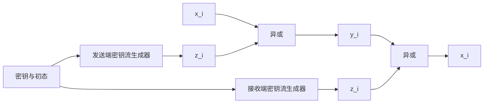
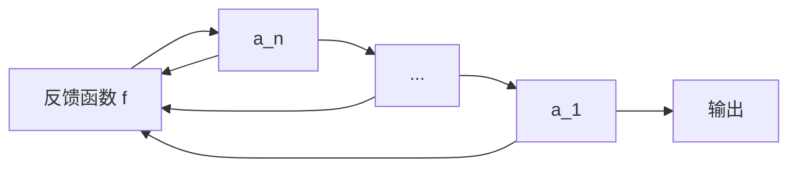

# 5.1 流密码（一）

> 本笔记依据“第5章 流密码（一）”课件整理，介绍同步与自同步流密码、反馈移位寄存器、LFSR 特征多项式与 $m$ 序列，并讨论线性递推攻击和多类非线性序列生成器。课件中的寄存器、组合器和算法流程均已转写为 Mermaid、公式、表格与伪代码。

## 主要内容

- 流密码的定义、同步与自同步模型
- 密钥流的安全要求
- 反馈移位寄存器与 LFSR
- 特征多项式、周期与 $m$ 序列
- $m$ 序列的伪随机性与破译
- Geffe、J-K、Pless 与钟控生成器
- RC4 的 KSA 与 PRGA
- 祖冲之算法的结构、安全与性能

---
## 一、流密码的基本概念
### 1. 密码体制

> **定义**：流密码又称序列密码。利用密钥 $k$ 和初始状态 $\sigma_0$ 产生密钥流
> $$
> z=z_0z_1z_2\cdots,\qquad z_i=f(k,\sigma_i).
> $$
> 二元加法流密码按
> $$
> y_i=x_i\oplus z_i,\qquad x_i=y_i\oplus z_i
> $$
> 加解密。

流密码含有记忆状态；与无记忆的普通分组变换相比，后续密钥流可能依赖此前状态或输入。

### 2. 同步流密码

> **同步流密码**：状态更新与密钥流只依赖密钥和内部状态，与明文、密文无关：
> $$
> \sigma_{i+1}=g(k,\sigma_i),\qquad z_i=f(k,\sigma_i).
> $$

发送端和接收端从相同密钥与初态产生同一密钥流。二元情形下：



同步流密码的加密函数只要可逆即可；二元异或最常见。若比特丢失或插入，收发密钥流将失步，必须重新同步。

### 3. 自同步流密码

> **自同步流密码**：密钥流由密钥和此前有限个密文符号决定，例如
> $$
> z_i=f(k,y_{i-t},\ldots,y_{i-1}),\qquad y_i=x_i\oplus z_i.
> $$

接收端连续收到足够多密文后会自动恢复同步。其优点是不需额外同步信号；缺点是密文错误会在有限范围内传播，分析通常也更复杂。

### 4. 对密钥流的要求

理想二元密钥流应接近真随机的一次一密，但实际序列由有限密钥和算法产生，因此是确定的。课件列出以下要求：

1. 极大周期：  
   在可实现的状态规模下尽量延长重复周期。
2. 良好统计特性：  
   $0$、$1$ 均衡，游程分布接近随机，并有良好自相关。
3. 高线性复杂度：  
   不能由短 LFSR 复现。
4. 不可预测性：  
   已知有限前缀不能有效推断后续比特。

密钥流生成器还应兼顾密钥分发、保管、更换的便利和软硬件实现效率。课件作业提示：研究布尔组合函数的选择。

---

## 二、反馈移位寄存器

### 1. 一般反馈移位寄存器

GF(2) 上的 $n$ 级反馈移位寄存器由 $n$ 个二元存储器和反馈函数 $f(a_1,\ldots,a_n)$ 构成。时刻状态为

$$
(a_1,a_2,\ldots,a_n).
$$

每次时钟到来时，$a_1$ 作为输出，各级向输出方向移位，新输入为 $f(a_1,\ldots,a_n)$。反馈函数是 $n$ 元布尔函数。



### 2. 三级例子

课件例子取初态 $(a_1,a_2,a_3)=(1,0,1)$，反馈 $f=a_2\oplus a_3$。状态与输出为：

| 状态 $(a_3,a_2,a_1)$ | 输出 |
|---|---:|
| 101 | 1 |
| 110 | 0 |
| 111 | 1 |
| 011 | 1 |
| 101 | 1 |
| 110 | 0 |

输出为 `101110111011...`，周期为 4。

---

## 三、线性反馈移位寄存器

### 1. 定义与递推

> 若反馈函数为线性函数
> $$
> f(a_1,\ldots,a_n)=c_n a_1\oplus c_{n-1}a_2\oplus\cdots\oplus c_1a_n,
> $$
> 则称为 $n$ 级 LFSR，其中 $c_i\in GF(2)$。

输出序列满足

$$
a_{n+k}=c_1a_{n+k-1}\oplus c_2a_{n+k-2}\oplus\cdots\oplus c_na_k,\qquad k\ge1.
$$

通常要求至少一个反馈系数非零；若全零，状态最终进入全零并永久停留。为避免退化，一般取 $c_n=1$。

### 2. 周期上界与五级例子

$n$ 级寄存器最多有 $2^n$ 个状态；全零状态单独成环，所以非零序列周期不超过 $2^n-1$。周期达到最大值的序列称为 $m$ 序列。

课件五级例子初态为 $(1,0,0,1,1)$，反馈抽头产生输出：

```text
1001101001000010101110110001111100110...
```

周期为 $31=2^5-1$。

---

## 四、特征多项式与 $m$ 序列

### 1. 一元多项式表示

> LFSR 的特征多项式为
> $$
> p(x)=1+c_1x+c_2x^2+\cdots+c_nx^n.
> $$

GF(2) 上所有非零次数小于 $n$ 的多项式在模 $p(x)$ 乘法下形成的轨道，刻画 LFSR 状态转移。若 $p(x)$ 的周期为 $m$，相应序列周期整除 $m$。

> **定理**：$n$ 级 LFSR 产生最大周期 $2^n-1$ 的充要条件是特征多项式 $p(x)$ 为本原多项式。

若 $p(x)$ 不可约但非本原，输出周期可能是 $2^n-1$ 的真因子。

### 2. 原根、阶与欧拉定理

**阶**用于描述一个元素经过多少次乘方后首次回到单位元。若 $\gcd(a,m)=1$，则 $a$ 模 $m$ 的阶定义为

$$
\operatorname{ord}_m(a)=\min\{r\ge 1:a^r\equiv 1\pmod m\}.
$$

若 $\operatorname{ord}_m(g)=\varphi(m)$，则称 $g$ 是模 $m$ 的**原根**。原根不一定对每个模数都存在；一旦存在，它可以生成模 $m$ 的全部可逆剩余类。

> **欧拉定理**：若 $\gcd(a,m)=1$，则
> $$
> a^{\varphi(m)}\equiv 1\pmod m,
> $$
> 其中 $\varphi(m)$ 是与 $m$ 互素且不大于 $m$ 的正整数个数。

由欧拉定理可知，$\operatorname{ord}_m(a)$ 必须整除 $\varphi(m)$。因此，判断 $g$ 是否为模 $m$ 的原根，本质上就是判断其阶是否达到可达到的最大值 $\varphi(m)$。

有限域中的情形与此完全对应。$GF(2^n)$ 的非零元素在乘法下构成一个阶为 $2^n-1$ 的循环群。若元素 $\alpha$ 满足

$$
\operatorname{ord}(\alpha)=2^n-1,
$$

则 $\alpha$ 能生成 $GF(2^n)$ 的全部非零元素，称为该有限域的**本原元**，也可理解为有限域乘法群的原根。任意非零元素 $\beta\in GF(2^n)$ 都满足

$$
\beta^{2^n-1}=1,
$$

这是欧拉定理在有限域乘法群中的对应结论。

设 $p(x)$ 是 $GF(2)$ 上次数为 $n$、常数项非零的不可约多项式，$\alpha$ 是它在 $GF(2^n)$ 中的一个根。多项式 $p(x)$ 的阶定义为

$$
\operatorname{ord}(p)=\min\{r\ge 1:p(x)\mid x^r-1\}.
$$

此时 $\operatorname{ord}(p)=\operatorname{ord}(\alpha)$，并且

$$
p(x)\text{ 为本原多项式}
\iff \operatorname{ord}(p)=2^n-1
\iff \alpha\text{ 为本原元}.
$$

令 $N=2^n-1$。由于元素的阶整除 $N$，判断不可约多项式 $p(x)$ 是否本原，只需对 $N$ 的每个不同素因子 $q$ 检验

$$
x^{N/q}\not\equiv 1\pmod{p(x)}.
$$

若所有检验都成立，则 $x$ 在商域 $GF(2)[x]/(p(x))$ 中的阶为 $N$，所以 $p(x)$ 是本原多项式。

例如，对 $p(x)=x^4+x+1$，有 $N=2^4-1=15=3\times 5$。在模 $p(x)$ 意义下，

$$
x^3\not\equiv 1,
\qquad
x^5\equiv x^2+x\not\equiv 1,
$$

所以 $x$ 的阶不是 $15$ 的任何真因子，其阶为 15，故 $p(x)$ 是本原多项式。

### 3. 课件例子

$f(x)=x^4+x^3+x^2+x+1$ 在 $GF(2)$ 上不可约，但可由

$$
x^5+1=(x+1)f(x)
$$

看出其周期为 5。以 $f(x)$ 为特征多项式、初态 `0001` 时，输出 `000110001100...`，周期 5，不是 $m$ 序列。

另一个例子取 $p(x)=x^4+x+1$，其周期为 15；初态 `1001` 的输出周期为 $2^4-1=15$，是 $m$ 序列。

### 4. 本原多项式数量

GF(2) 上 $n$ 次本原多项式的个数为

$$
\frac{\varphi(2^n-1)}{n},
$$

其中 $\varphi$ 为欧拉函数。对任意正整数 $n$，至少存在一个 $n$ 次本原多项式，因而至少存在一种连接方式产生 $m$ 序列。

---

## 五、$m$ 序列的伪随机性

### 1. 游程与自相关

游程是连续相同比特的极大段。例如 `00110111` 有 `00`、`11`、`0`、`111` 四个游程。

对周期为 $T$ 的二元序列 $\{a_i\}$，周期自相关定义为

$$
R(\tau)=\sum_{i=1}^{T}(-1)^{a_i-a_{i+\tau}},\qquad0\le\tau\le T-1.
$$

当 $\tau=0$ 时 $R(0)=T$。

### 2. Golomb 三条随机性公设

1. 一个周期内 $0$ 与 $1$ 的个数相差至多 1。
2. 长为 $n$ 的游程约占游程总数的 $2^{-n}$；同长度的 $0$ 游程与 $1$ 游程数量尽量相等。
3. 异相自相关为常数。

> **定理**：GF(2) 上的 $n$ 级 $m$ 序列在一个周期中含 $2^{n-1}$ 个 $1$ 和 $2^{n-1}-1$ 个 $0$；总游程数为 $2^{n-1}$，其中长为 $i$ 的 $0$、$1$ 游程按课件给出的幂次规律分布；自相关为
> $$
> R(\tau)=
> \begin{cases}
> 2^n-1,&\tau=0,\\
> -1,&0<\tau<2^n-1.
> \end{cases}
> $$

这说明 $m$ 序列满足 Golomb 的三条公设，但“统计性质良好”不等于密码学不可预测。

### 3. 自相关结论的课件证明思路

对非零移位 $\tau$，序列 $\{b_i\}$ 定义为 $b_i=a_i\oplus a_{i+\tau}$。由线性递推可知 $\{b_i\}$ 仍是同一 LFSR 产生的 $m$ 序列。一个周期中 $b_i=0$ 有 $2^{n-1}-1$ 个，$b_i=1$ 有 $2^{n-1}$ 个，故

$$
R(\tau)=(2^{n-1}-1)-2^{n-1}=-1.
$$

---

## 六、$m$ 序列密码的破译

### 1. 已知明文恢复密钥流

对二元加法流密码，若攻击者知道连续 $2n$ 比特明文与密文，则得到

$$
z_i=x_i\oplus y_i,\qquad i=1,\ldots,2n.
$$

设密钥流满足

$$
z_{i+n}=c_1z_{i+n-1}\oplus\cdots\oplus c_nz_i.
$$

用 $n$ 个连续方程可构造线性方程组，若系数矩阵可逆，即可求得反馈系数 $(c_1,\ldots,c_n)$，再由前 $n$ 位作为状态预测全部密钥流。

### 2. 课件算例

课件给出一段密文 `101101011110010` 及相应明文 `011001111111001`，得到密钥流 `110100100001011`。假定密钥流由 5 级 LFSR 生成，由前 10 位建立方程后求得

$$
(c_5,c_4,c_3,c_2,c_1)=(1,0,0,1,0).
$$

因此递推为

$$
a_{i+5}=a_i\oplus a_{i+3}.
$$

该攻击说明单个 LFSR 的线性结构不适合直接作为安全密钥流生成器。

---

## 七、非线性序列生成器

### 1. 设计目标与线性复杂度

常用方法是让多个 LFSR 作为驱动序列，再用非线性组合函数、选择器或不规则钟控产生输出。输出周期通常希望接近各驱动周期的乘积，线性复杂度也应尽可能接近周期量级。

> **线性复杂度**：能够产生给定序列的最短 LFSR 级数；等价地，是其最小特征多项式的次数。

### 2. Geffe 生成器

Geffe 生成器由三个 LFSR 构成，LFSR2 为选择控制：

$$
b_k=a_k^{(1)}a_k^{(2)}\oplus a_k^{(3)}(1\oplus a_k^{(2)}).
$$

即控制位为 1 时输出 LFSR1，为 0 时输出 LFSR3。若三个特征多项式两两互素且次数为 $n_1,n_2,n_3$，周期可达到

$$
\prod_{i=1}^{3}(2^{n_i}-1),
$$

线性复杂度为 $(n_1+n_3)n_2+n_3$。课件也指出该结构存在明显相关性，不能仅凭长周期判断安全。

### 3. J-K 触发器生成器

J-K 触发器两个输入分别由驱动序列 $\{a_k\},\{b_k\}$ 提供，输出满足

$$
c_k=(a_k+b_k)c_{k-1}+a_k
$$

（运算在 GF(2) 上）。若 $c_{-1}=0$，则

$$
c_0=a_0,\quad
c_1=(a_1+b_1+1)a_0+a_1,\ldots
$$

当两个 $m$ 序列级数为 $m,n$ 且初态满足条件时，周期可为 $(2^m-1)(2^n-1)$。

课件例：$m=2,n=3$，$\{a_k\}=0,1,1,\ldots$，$\{b_k\}=1,0,0,1,0,1,1,\ldots$，取 $c_{-1}=0$，输出

```text
0,1,1,0,1,0,0,1,1,1,0,1,0,0,1,0,0,1,0,...
```

周期为 $(2^2-1)(2^3-1)=21$。其缺点是当 $c_{k-1}=0$ 时 $c_k=a_k$，当 $c_{k-1}=1$ 时 $c_k=b_k$，泄露驱动序列的局部信息。

### 4. Pless 与钟控生成器

Pless 生成器由 8 个 LFSR、4 个 J-K 触发器和一个模 4 计数器构成，计数器选择当前输出支路，并把寄存器输出反馈给相应触发器，以减少简单相关关系。

钟控生成器用一个 LFSR 控制另一个 LFSR 是否移位。课件最简单模型中：控制序列为 1 时，被控 LFSR 时钟生效；为 0 时状态保持。若两个驱动周期为 $p_1,p_2$，控制序列一个周期内 $1$ 的个数为

$$
w_1=\sum_{i=0}^{p_1-1}a_i,
$$

则输出周期满足

$$
p=\frac{p_1p_2}{\gcd(w_1,p_2)}.
$$

当两者是级数 $m,n$ 的 $m$ 序列且 $m,n$ 互素时，$w_1=2^{m-1}$，故周期为 $(2^m-1)(2^n-1)$。

---

## 八、RC4

### 1. 结构

RC4 由 Rivest 于 1987 年设计，使用 256 字节状态置换表 $S$、密钥调度 KSA 和伪随机生成 PRGA。课件指出 RC4 曾广泛用于软件和协议，但密钥流存在统计弱点，早期协议中的使用已不再安全。

### 2. KSA

若密钥长度为 $l$ 字节，先令 $S[i]=i$，并以 $K[i]=key[i\bmod l]$ 重复密钥：

```text
j := 0
for i := 0 to 255:
    j := (j + S[i] + K[i]) mod 256
    swap(S[i], S[j])
```

### 3. PRGA

```text
i := 0; j := 0
while 需要输出:
    i := (i + 1) mod 256
    j := (j + S[i]) mod 256
    swap(S[i], S[j])
    z := S[(S[i] + S[j]) mod 256]
```

课件用规模 8、密钥 `K=(6,1,2)` 演示 KSA 与 PRGA 的交换过程，得到第一个密钥字为 6（二进制 `110`），再与明文异或。

---

## 九、祖冲之算法

祖冲之（ZUC）是面向字的流密码，主要部件为 16 级 31 比特 LFSR、比特重组 BR 和非线性函数 $F$。LFSR 输出经 BR 形成四个 32 比特字，送入 $F$ 与 S 盒、线性变换；$F$ 的结果又反馈影响状态。

课件时间线指出：ZUC 经国内外公开评估后用于 3GPP LTE，并形成 GM/T 0001-2012、GB/T 33133.1-2016 等标准。课件列举的公开分析包括弱密钥、代数、线性、差分/选择 IV、猜测确定和 SAT 求解等；截至课件形成时，没有找到安全弱点。700 MHz Hexagon DSP 的测试表显示，消息越长，摊销后的字节周期数越低，体现良好吞吐性能。

---

## 本章小结

| 主题 | 核心结论 |
|---|---|
| 同步流密码 | 密钥流与明密文无关，失步后需重同步 |
| 自同步流密码 | 由此前密文驱动，有限长度后自动恢复同步 |
| LFSR | 结构简单高效，但线性结构易被恢复 |
| $m$ 序列 | 周期 $2^n-1$，满足 Golomb 公设，但不等于密码学安全 |
| 非线性生成器 | 组合、选择和钟控可提升复杂度，但须防相关攻击 |
| RC4 | KSA 初始化置换，PRGA 逐字节输出密钥流 |
| ZUC | LFSR、比特重组与非线性函数结合的字导向流密码 |
