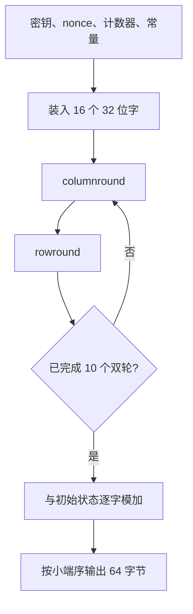
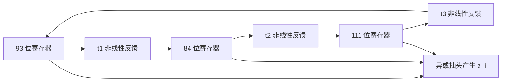

# 5.2 流密码（二）

> 本笔记依据“第5章 流密码（二）”课件整理，选取 eSTREAM 软件算法 Salsa20 与硬件算法 Trivium，说明其输入、内部状态、轮函数、初始化和密钥流输出。所有课件中的函数映射和状态更新图均已转写为公式与伪代码。

## 主要内容

- eSTREAM 算法分类
- Salsa20 的输入、状态布局与核心函数
- `littleendian`、`quarterround`、`rowround` 与 `columnround`
- Salsa20 的 20 轮变换与输出
- Trivium 的 288 比特状态
- Trivium 的初始化与密钥流生成

---

## 一、eSTREAM 示例

课件把 eSTREAM 算法示例分为软件算法 Salsa20 与硬件算法 Trivium。前者以 32 位字的加法、异或和循环移位为核心，面向高效软件实现；后者用 288 比特移位状态和少量与、异或门实现，面向硬件。

---

## 二、Salsa20

### 1. 参数与输出

Salsa20 由 Daniel J. Bernstein 设计。

> **输入**：256 比特或 128 比特密钥 $k$，8 字节 nonce $v$，以及分组序号；**输出**：64 字节密钥流块。课件将输出范围写为可产生长度至约 $2^{70}$ 字节的序列。

对 32 字节密钥，使用常数字节串

```text
σ = "expand 32-byte k"
```

其四个 32 位小端字为：

$$
\sigma_0=(101,120,112,97),\quad
\sigma_1=(110,100,32,51),
$$

$$
\sigma_2=(50,45,98,121),\quad
\sigma_3=(116,101,32,107).
$$

对 16 字节密钥，常量为 `"expand 16-byte k"`，对应四字 $\tau_0,\ldots,\tau_3$。

### 2. 状态布局

Salsa20 的 64 字节输入映射为 16 个 32 位小端字，状态矩阵按课件布局为：

$$
\begin{pmatrix}
\sigma_0&k_0&k_1&k_2\\
k_3&\sigma_1&n_0&n_1\\
c_0&c_1&\sigma_2&k_4\\
k_5&k_6&k_7&\sigma_3
\end{pmatrix},
$$

其中 $n_0,n_1$ 来自 8 字节 nonce，$c_0,c_1$ 是 64 位块计数器。128 比特密钥版本重复使用四个密钥字并改用 $\tau$ 常量。

### 3. 小端函数

> 对四字节 $b=(b_0,b_1,b_2,b_3)$，
> $$
> \operatorname{littleendian}(b)=b_0+2^8b_1+2^{16}b_2+2^{24}b_3.
> $$

64 字节输入 $x[0],\ldots,x[63]$ 依次转成

$$
x_i=\operatorname{littleendian}(x[4i],x[4i+1],x[4i+2],x[4i+3]),\quad0\le i<16.
$$

### 4. `quarterround`

> 对四个 32 位字 $(a_0,a_1,a_2,a_3)$，所有加法均模 $2^{32}$：
> $$
> \begin{aligned}
> b_1&=a_1\oplus((a_0+a_3)\lll7),\\
> b_2&=a_2\oplus((b_1+a_0)\lll9),\\
> b_3&=a_3\oplus((b_2+b_1)\lll13),\\
> b_0&=a_0\oplus((b_3+b_2)\lll18).
> \end{aligned}
> $$

循环移位、模加与异或共同提供扩散和非线性。

### 5. `rowround`

对 $y=(y_0,\ldots,y_{15})$：

$$
\begin{aligned}
(z_0,z_1,z_2,z_3)&=QR(y_0,y_1,y_2,y_3),\\
(z_5,z_6,z_7,z_4)&=QR(y_5,y_6,y_7,y_4),\\
(z_{10},z_{11},z_8,z_9)&=QR(y_{10},y_{11},y_8,y_9),\\
(z_{15},z_{12},z_{13},z_{14})&=QR(y_{15},y_{12},y_{13},y_{14}).
\end{aligned}
$$

### 6. `columnround`

对 $x=(x_0,\ldots,x_{15})$：

$$
\begin{aligned}
(y_0,y_4,y_8,y_{12})&=QR(x_0,x_4,x_8,x_{12}),\\
(y_5,y_9,y_{13},y_1)&=QR(x_5,x_9,x_{13},x_1),\\
(y_{10},y_{14},y_2,y_6)&=QR(x_{10},x_{14},x_2,x_6),\\
(y_{15},y_3,y_7,y_{11})&=QR(x_{15},x_3,x_7,x_{11}).
\end{aligned}
$$

### 7. 双轮与 Salsa20 核心

> $$
> \operatorname{doubleround}(x)
> =\operatorname{rowround}(\operatorname{columnround}(x)).
> $$

Salsa20 执行 10 个双轮，即 20 轮，再与初始状态逐字模 $2^{32}$ 相加：

$$
z=x+\operatorname{doubleround}^{10}(x).
$$

最后将每个 $z_i$ 转回四个小端字节，连接为 64 字节输出：

$$
\operatorname{littleendian}^{-1}(z_0),\ldots,\operatorname{littleendian}^{-1}(z_{15}).
$$



---

## 三、Trivium

### 1. 参数与状态

Trivium 由 Christophe De Cannière 和 Bart Preneel 设计。

> 输入 80 比特密钥 $K_1,\ldots,K_{80}$ 和 80 比特 IV $IV_1,\ldots,IV_{80}$，内部状态为 288 比特 $s_1,\ldots,s_{288}$，可产生最长约 $2^{64}$ 比特的密钥流。

状态分成三个寄存器：

- $(s_1,\ldots,s_{93})$
- $(s_{94},\ldots,s_{177})$
- $(s_{178},\ldots,s_{288})$

### 2. 初始装载

课件给出的装载为：

$$
(s_1,\ldots,s_{93})=(K_1,\ldots,K_{80},0,\ldots,0),
$$

$$
(s_{94},\ldots,s_{177})=(IV_1,\ldots,IV_{80},0,0,0,0),
$$

$$
(s_{178},\ldots,s_{288})=(0,\ldots,0,1,1,1).
$$

### 3. 预热初始化

内部状态执行 $4\times288=1152$ 次更新而不输出。每次先计算

$$
\begin{aligned}
t_1&=s_{66}\oplus(s_{91}\land s_{92})\oplus s_{93}\oplus s_{171},\\
t_2&=s_{162}\oplus(s_{175}\land s_{176})\oplus s_{177}\oplus s_{264},\\
t_3&=s_{243}\oplus(s_{286}\land s_{287})\oplus s_{288}\oplus s_{69},
\end{aligned}
$$

其中课件用加号表示 GF(2) 异或；含相邻状态乘积的项是布尔与。随后移位：

$$
(s_1,\ldots,s_{93})\leftarrow(t_3,s_1,\ldots,s_{92}),
$$

$$
(s_{94},\ldots,s_{177})\leftarrow(t_1,s_{94},\ldots,s_{176}),
$$

$$
(s_{178},\ldots,s_{288})\leftarrow(t_2,s_{178},\ldots,s_{287}).
$$

### 4. 密钥流输出

预热后，每生成一位，先计算输出：

$$
z_i=s_{66}\oplus s_{93}\oplus s_{162}\oplus s_{177}\oplus s_{243}\oplus s_{288},
$$

再计算反馈：

$$
\begin{aligned}
t_1&=s_{66}\oplus s_{93}\oplus(s_{91}\land s_{92})\oplus s_{171},\\
t_2&=s_{162}\oplus s_{177}\oplus(s_{175}\land s_{176})\oplus s_{264},\\
t_3&=s_{243}\oplus s_{288}\oplus(s_{286}\land s_{287})\oplus s_{69},
\end{aligned}
$$

并按与初始化相同方式移位三个寄存器。



该结构用三个互相耦合的非线性反馈寄存器，在较小硬件面积下产生高速密钥流。

---

## 本章小结

| 算法 | 面向 | 状态与核心运算 | 初始化 |
|---|---|---|---|
| Salsa20 | 软件 | 16 个 32 位字；模加、异或、循环移位 | 密钥、nonce、计数器与常量装入，执行 20 轮并前馈相加 |
| Trivium | 硬件 | 288 比特状态；异或、与、移位 | 装入 80 位密钥和 80 位 IV，预热 1152 次 |

Salsa20 依靠 ARX 运算和行列双轮扩散；Trivium 依靠三个耦合寄存器的非线性反馈。两者都要求 nonce/IV 使用满足算法约束，避免在同一密钥下重复密钥流。
