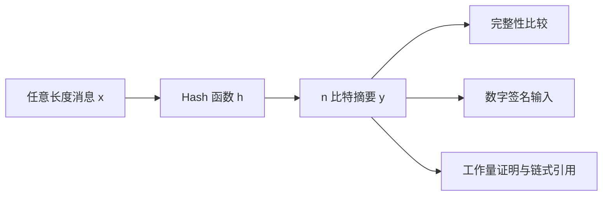
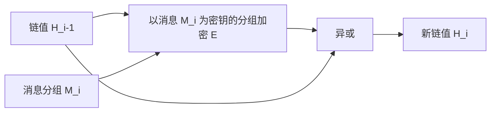
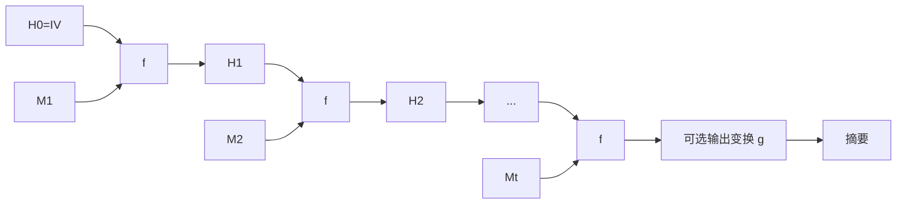
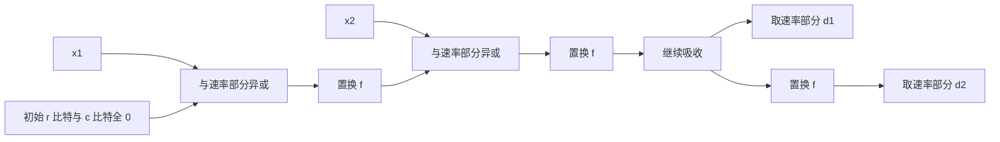

# 6.1 Hash 函数和 MAC（一）

> 本笔记依据“Hash 函数和 MAC（一）”课件整理，覆盖 Hash 函数的定义、安全目标、生日攻击、发展与碰撞研究、主要构造，以及 MD4、MD5、SHA-1、SHA-256、SM3 和 Keccak。课件全部 96 页已结合 Paddle 转写、PDF 文字层和逐页渲染核查；证书、区块网页、结构框图和轮函数图均已转换为原生表格、公式、流程图或完整文字。

## 主要内容

- Hash 函数的定义、应用和基本属性
- 抗原像、抗第二原像、抗碰撞与理想安全强度
- 生日问题和通用碰撞攻击
- Hash 标准与碰撞研究的发展
- 数学困难问题、分组密码和定制 Hash 构造
- Merkle-Damgård、宽管道、双管道、HAIFA 与海绵结构
- MD4、MD5、SHA-1 和 SHA-256
- SM3 压缩框架与 Keccak-f 轮函数

---

## 一、Hash 函数的定义与应用

# 1. 定义

> Hash 函数（杂凑函数）把任意长度输入 $x$ 压缩为固定长度输出 $y$：
> $$
> y=h(x),\qquad h:\{0,1\}^*\to\{0,1\}^n.
> $$

输出又称杂凑值、消息摘要或“指纹”。除压缩外，密码杂凑还要求从给定输出寻找原像，以及寻找两个碰撞输入都非常困难。

### 2. 功能与应用

1. 检测消息完整性：  
   保存或传输摘要，之后重算并比较。
2. 提高数字签名速度：  
   DSS、RSA 等签名方案通常签名定长摘要，而不是直接签名任意长消息。
3. 证书指纹：  
   课件证书截图包含 SHA-1 指纹字段，用摘要帮助人工比对证书。
4. Bitcoin 工作量证明和区块链接：  
   区块头 Hash 需满足目标条件，`Previous Block` 把当前区块链接到前一区块，Merkle Root 汇总交易。

课件展示的区块样例数据为：

| 字段 | 值 |
|---|---|
| 交易数 | 238 |
| 输出总额 | 718.88005642 BTC |
| 估计交易量 | 129.34467492 BTC |
| 手续费 | 0.04018015 BTC |
| 高度 | 523043（主链） |
| 时间戳 | 2018-05-17 01:02:38 |
| 区块 Hash | `0000000000000000017d9f2299089e2a9cffa20ce44d423f3d2443fb99c7c02` |
| 前一区块 | `0000000000000000070d623eb8c0a4cf9e7f8abfe8c3a6845fb838f443e121` |
| 后一区块 | `00000000000000000235a266bca10d609615051eb19d12106e6ade1df16f32f` |
| Merkle Root | `8317e82d7d0cf4d6b28291eb55a56c871a9c60a5ea6b5bb52013cb96d845e1756` |



---

## 二、基本属性与安全目标

# 1. 基本属性

| 属性 | 含义 |
|---|---|
| 压缩性 | 任意长度数据块产生固定长度输出 |
| 有效性 | 给定 $x$，计算 $h(x)$ 容易 |
| 确定性 | 同一输入得到同一输出 |
| 安全性 | 满足抗原像、抗第二原像和抗碰撞要求 |

# 2. 三种安全属性

> **抗原像性（单向性）**：给定 $y$，寻找 $x$ 使 $h(x)=y$ 在计算上不可行。

> **抗第二原像性**：给定 $x$，寻找 $x'\neq x$ 使 $h(x')=h(x)$ 在计算上不可行。

> **抗碰撞性**：寻找任意 $x\neq x'$ 使 $h(x)=h(x')$ 在计算上不可行。

若找到碰撞，攻击者可能构造两个不同文件却具有同一“指纹”，从而把对良性文件的签名迁移到恶意文件。

### 3. 通用攻击

通用碰撞攻击寻找

$$
x\neq x',\qquad h(x)=h(x').
$$

攻击方法包括不依赖内部结构的生日攻击，以及针对具体算法结构的专用密码分析。

---

## 三、生日攻击

# 1. 生日问题

从大小为 $N$ 的均匀空间独立抽取 $m$ 次，所有结果互不相同的概率为

$$
\overline{p(m)}=\prod_{i=1}^{m-1}\left(1-\frac{i}{N}\right).
$$

利用 $1-x\approx e^{-x}$：

$$
\overline{p(m)}\approx
e^{-m(m-1)/(2N)},
$$

$$
p(m)\approx1-e^{-m(m-1)/(2N)}
\approx1-e^{-m^2/(2N)}.
$$

因而

$$
m\approx\sqrt{2N\ln\frac1{1-p(m)}}.
$$

当 $p(m)=1/2$ 时，

$$
m\approx\sqrt{2N\ln2}\approx1.17\sqrt N.
$$

取 $N=365$，得到 $m\approx23$。

# 2. 对 Hash 的影响

> 若 Hash 输出 $n$ 比特，则输出空间大小为 $N=2^n$。约作
> $$
> 2^{n/2}
> $$
> 次 Hash 运算，就能以超过 $1/2$ 的概率找到碰撞。

理想安全强度为：

| 目标   | 理想复杂度     |
| ---- | --------- |
| 碰撞   | $2^{n/2}$ |
| 原像   | $2^n$     |
| 第二原像 | $2^n$     |

若专用分析以显著小于 $2^{n/2}$ 的复杂度找到碰撞，就认为抗碰撞安全性被破坏。

---

## 四、发展与标准化

### 1. 发展脉络

| 时间 | 事件 |
|---|---|
| 1956 | Dumey 用 Hash 解决符号表问题，使插入、删除、查询平均为常数时间 |
| 1978 | Merkle 与 Damgård 分别独立设计迭代结构 |
| 1983 | Davies 提出使用 DES 构造压缩函数 |
| 1984 | Winternitz 首次研究 Davies-Meyer 安全性 |
| 1989 | Rivest 开发 MD2 |
| 1990 | Rivest 开发 MD4 |
| 1991 | Rivest 开发 MD5 |
| 1994 | NIST 发布 SHA-1 |
| 2007-2012 | NIST 举办 SHA-3 公开征集 |
| 2010/2012 | 我国发布 SM3 算法并形成 GM/T 0004-2012 |

MD2、MD4、MD5 均输出 128 比特；RIPEMD 家族由欧洲研究组织设计。SHA 系列由 NIST 基于 MD4/MD5 思路发展：SHA-0 很快发现弱点；SHA-1 输出 160 比特；SHA-2 包括 SHA-224、SHA-256、SHA-384、SHA-512。

### 2. SHA 家族参数

| 算法 | 输出/状态（比特） | 分组（比特） | 最大消息长度 | 字长 | 轮数 | 课件碰撞状态 |
|---|---|---|---|---|---|---|
| SHA-0 | 160/160 | 512 | $2^{64}-1$ | 32 | 80 | 已有碰撞 |
| SHA-1 | 160/160 | 512 | $2^{64}-1$ | 32 | 80 | 课件列 $2^{63}$ 攻击 |
| SHA-224/256 | 224 或 256/256 | 512 | $2^{64}-1$ | 32 | 64 | 未列完整轮碰撞 |
| SHA-384/512 | 384 或 512/512 | 1024 | $2^{128}-1$ | 64 | 80 | 未列完整轮碰撞 |

### 3. 课件列举的密码分析进展

| 算法 | 攻击 | 复杂度 | 年份 |
|---|---|---|---|
| MD4 | 碰撞 | $2^{22}$、$2^8$、2 | 1996、2005、2007 |
| MD4 | 原像 | $2^{102}$ | 2007 |
| MD4 | 弱消息第二原像 | $2^{56}$ | 2005 |
| MD5 | 碰撞 | $2^{37}$、$2^{16}$ | 2005、2009 |
| MD5 | 原像 | $2^{123.4}$ | 2009 |
| RIPEMD | 碰撞 | $2^{18}$ | 2005 |
| SHA-0 | 碰撞 | $2^{61}$、$2^{61}$、$2^{39}$ | 1997、1998、2005 |
| SHA-0 | 52 轮原像 | $2^{156.6}$ | 2009 |
| SHA-1 | 碰撞 | $2^{69}$、$2^{61}$ | 2005、2006 |
| SHA-1 | 48 轮原像 | $2^{159.3}$ | 2009 |
| HAVAL-128 | 碰撞 | $2^7$ | 2005 |
| 3-pass HAVAL | 碰撞、第二原像、原像 | $2^{29}$、$2^{114}$、$2^{224}$ | 2003、2006、2008 |
| 4-pass HAVAL | 碰撞 | $2^{43}$ | 2006 |
| 5-pass HAVAL | 碰撞 | $2^{123}$ | 2006 |

### 4. 碰撞危害：Flame

课件以 2012 年发现的 Flame（Flamer、sKyWIper、Skywiper）恶意软件为例。攻击者利用仍允许代码签名且使用弱 MD5 的 Microsoft Terminal Server Licensing Service 证书，通过选择前缀碰撞伪造证书，并签署恶意组件，使其看似来自 Microsoft。该事件说明碰撞攻击可直接破坏证书与代码签名信任。

### 5. 标准征集

| 工程 | 时间/组织 | 目标 |
|---|---|---|
| RIPE | 1988-1992，European Community | 身份识别、Hash、MAC、数字签名 |
| NESSIE | 2000-2002，European Community | 数字签名、Hash、分组密码等 |
| SHA-3 | 2007-2012，NIST | 新一代 Hash 标准 |

SHA-3 过程：2005、2006 年举办研讨会；2007 年制定需求并于 11 月公开征集；2008 年 10 月截止；64 个提交中 51 个进入第一轮，14 个进入第二轮；最终候选为 BLAKE、Grøstl、JH、Keccak、Skein；NIST 于 2012 年 10 月 2 日宣布 Keccak 获胜。设计团队为 Guido Bertoni、Joan Daemen、Michaël Peeters 和 Gilles Van Assche。课件中的团队照片和 NIST 网页截图用于记录人物与宣布时间，不增加算法参数。

SM3 标准为 GM/T 0004-2012，适用于数字签名与验证、MAC 生成与验证、随机数生成，并用于提高商用密码产品的可信性与互操作性。

---

## 五、Hash 函数的构造路线

### 1. 三类主要构造

1. 基于数学困难问题：离散对数、格困难问题等。
2. 基于分组密码：输出等于或大于分组长度。
3. 定制 Hash：MD、SHA、RIPEMD、Tiger、Whirlpool 等。

基于离散对数的 Chaum-van Heijst-Pfitzmann 形式为

$$
h(x_1,x_2)=\alpha^{x_1}\beta^{x_2}\bmod p.
$$

课件列出基于格的形式

$$
y=A_{n\times m}x_{m\times1}\bmod p.
$$

### 2. 基于分组密码的压缩函数

Bart Preneel 给出杂凑值等于分组长度的 12 种安全结构。课件重点列出：

| 结构 | 压缩函数形式（$E$ 为分组密码） |
|---|---|
| Davies-Meyer | $H_i=E_{M_i}(H_{i-1})\oplus H_{i-1}$ |
| Matyas-Meyer-Oseas | $H_i=E_{g(H_{i-1})}(M_i)\oplus M_i$ |
| Miyaguchi-Preneel | $H_i=E_{g(H_{i-1})}(M_i)\oplus M_i\oplus H_{i-1}$ |

1988 年 IBM 设计 MDC-2（ANSI、ISO）与 MDC-4（RIPE）；1990 年来学嘉和 Massey 提出并联、串联 Davies-Meyer；1994 年俄罗斯制定 GOST Hash 标准。MDC-2 用两条不同密钥/链值并行处理输入，MDC-4 再串接两级 MDC-2 压缩以产生大于分组长度的摘要。



基于分组密码构造的优点：可复用成熟分组密码技术，安全性经时间检验；缺点：密钥编排与消息扩展不匹配，通常慢于专用 Hash。

### 3. 定制 Hash 的结构

定制 Hash 可针对摘要计算优化扩散层、S 盒与基本操作，速度高；但安全性通常不是数学证明所得，且相对传统私钥密码发展较晚。

主要结构包括：

- Merkle-Damgård（MD）
- 宽管道（wide pipe）与双管道（double pipe）
- HAIFA
- 海绵（sponge）

---

## 六、迭代结构及其攻击

### 1. Merkle-Damgård 结构

> Merkle 与 Damgård 在 1989 年分别证明，可由定长压缩函数构造处理任意长消息的 Hash。消息经填充并附加长度后分组，令 $H_0=IV$，递推
> $$
> H_i=f(H_{i-1},M_i),
> $$
> 最终输出 $g(H_t)$ 或 $H_t$。



MDx 家族关系：MD4 衍生出 MD5、HAVAL、SHA-0；SHA-0 发展为 SHA-1 再发展到 SHA-224/256/384/512；扩展 MD4 经 RIPEMD-0 发展出 RIPEMD-128/160/256/320。

### 2. 长度扩展与其他攻击

若已知 $H(IV,M)$ 和 $|M|$，可把它当作新初值继续处理 $M'$：

$$
H'=H(IV,M\|\operatorname{pad}^M\|M').
$$

这就是长度扩展攻击。课件同时列出多碰撞、不动点攻击，以及针对超长消息的第二原像攻击。

### 3. 宽管道、双管道、HAIFA 和海绵

宽管道由 Stefan Lucks 于 ASIACRYPT 2005 提出，内部链值宽度 $w$ 大于最终摘要 $n$：

$$
f:\{0,1\}^w\times\{0,1\}^p\to\{0,1\}^w,
$$

$$
f':\{0,1\}^w\to\{0,1\}^n.
$$

消息经宽状态迭代后，仅在末端压缩到 $n$ 比特。

双管道使用两条 $n$ 比特链并行，压缩函数输入包含两条链与消息：

$$
f:\{0,1\}^n\times\{0,1\}^{n+p}\to\{0,1\}^n.
$$

HAIFA 由 Biham、Dunkelman 于 2006 Hash Workshop 提出。海绵结构把状态分为速率 $r$ 和容量 $c$，先吸收消息，再挤出输出：



容量部分不直接吸收或输出，用于提供安全裕量。

---

## 七、MD4 与 MD5

### 1. MD4 参数与填充

MD4 由 Rivest 于 1990 年提出，输出 128 比特，处理 512 比特分组，采用 3 轮共 48 步。对原消息 $x$，填充为

$$
M=x\|1\|0^d\|l,
$$

其中 $l$ 是 $|x|\bmod2^{64}$ 的 64 比特表示，

$$
d\equiv447-|x|\pmod{512}.
$$

填充后按 32 比特字 $X[0],\ldots,X[15]$ 处理。

初值：

```text
A = 67452301
B = efcdab89
C = 98badcfe
D = 10325476
```

每个 512 比特分组开始保存 `AA=A, BB=B, CC=C, DD=D`，执行三轮后作前馈：

$$
A\leftarrow A+AA,\ B\leftarrow B+BB,\ C\leftarrow C+CC,\ D\leftarrow D+DD\pmod{2^{32}}.
$$

最终输出 $A\|B\|C\|D$。

### 2. MD4 三轮

| 轮 | 布尔函数 | 消息字顺序 | 循环左移 | 加法常数 |
|---|---|---|---|---|
| 1 | $F=(X\land Y)\lor(\neg X\land Z)$ | $0,1,\ldots,15$ | $3,7,11,19$ | 0 |
| 2 | $G=(X\land Y)\lor(X\land Z)\lor(Y\land Z)$ | $0,4,8,12,1,5,9,13,2,6,10,14,3,7,11,15$ | $3,5,9,13$ | `5A827999` |
| 3 | $H=X\oplus Y\oplus Z$ | $0,8,4,12,2,10,6,14,1,9,5,13,3,11,7,15$ | $3,9,11,15$ | `6ED9EBA1` |

每四步依次更新 $A,D,C,B$。一般步为

$$
A\leftarrow(A+\Phi(B,C,D)+X[k]+K)\lll s
$$

并循环置换寄存器角色；加法模 $2^{32}$，$\lll$ 表示循环左移。

课件还列出 $F$ 的比特性质：$F(x,y,z)=F(\neg x,y,z)$ 当且仅当 $y=z$；翻转 $y$ 不影响输出当且仅当 $x=0$；翻转 $z$ 不影响输出当且仅当 $x=1$。

### 3. MD5

MD5 由 Rivest 于 1991 年提出，仍输出 128 比特、处理 512 比特分组，但增加为 4 轮 64 步。单步更新可写为

$$
b_i=b_{i-1}+\big(a_{i-1}+f_r(b_{i-1},c_{i-1},d_{i-1})+X[k]+T[i]\big)\lll s,
$$

并令

$$
a_i=d_{i-1},\quad c_i=b_{i-1},\quad d_i=c_{i-1}.
$$

四个布尔函数：

$$
F(X,Y,Z)=(X\land Y)\lor(\neg X\land Z),
$$

$$
G(X,Y,Z)=(X\land Z)\lor(Y\land\neg Z),
$$

$$
H(X,Y,Z)=X\oplus Y\oplus Z,
$$

$$
I(X,Y,Z)=(X\lor\neg Z)\oplus Y.
$$

常数

$$
T[i]=\left\lfloor2^{32}|\sin i|\right\rfloor.
$$

| 轮 | 消息索引模式 | 移位量 |
|---|---|---|
| 1 | $0,1,\ldots,15$ | $7,12,17,22$ |
| 2 | $1,6,11,0,5,10,15,4,9,14,3,8,13,2,7,12$ | $5,9,14,20$ |
| 3 | $5,8,11,14,1,4,7,10,13,0,3,6,9,12,15,2$ | $4,11,16,23$ |
| 4 | $0,7,14,5,12,3,10,1,8,15,6,13,4,11,2,9$ | $6,10,15,21$ |

MD5 相对 MD4 的改变：增加第四轮；修改第二轮函数以减弱对称性；改变第二、三轮消息顺序；调整且区分各轮移位量；每步使用唯一常数；每步加上上一步结果以增强雪崩效应。

---

## 八、SHA-1

### 1. 参数与消息扩展

SHA-1 由 NIST 与 NSA 设计，与 DSS/DSA 配合使用。它采用 5 个 32 比特链变量，输出 160 比特，处理 512 比特消息块，共 80 步。

消息扩展：

$$
w_t=
\begin{cases}
X_t,&0\leq t\leq15,\\
(w_{t-3}\oplus w_{t-8}\oplus w_{t-14}\oplus w_{t-16})\lll1,&16\leq t\leq79.
\end{cases}
$$

### 2. 轮函数与步更新

| 轮 | $t$ | $f_t(x,y,z)$ |
|---|---|---|
| 1 | 0-19 | $(x\land y)\lor(\neg x\land z)$ |
| 2 | 20-39 | $x\oplus y\oplus z$ |
| 3 | 40-59 | $(x\land y)\lor(x\land z)\lor(y\land z)$ |
| 4 | 60-79 | $x\oplus y\oplus z$ |

每步：

$$
T=(a\lll5)+f_t(b,c,d)+e+w_t+k_t\pmod{2^{32}},
$$

$$
e\leftarrow d,\quad d\leftarrow c,\quad c\leftarrow b\lll30,\quad b\leftarrow a,\quad a\leftarrow T.
$$

80 步后将工作变量分别与输入链值模 $2^{32}$ 相加，得到下一链值。

---

## 九、SHA-256

### 1. 填充与初值

设原消息长 $l$ 比特。先附加 `1`，再附加最少的 $k$ 个 `0` 使

$$
l+1+k\equiv448\pmod{512},
$$

最后附加 $l$ 的 64 比特二进制表示。填充后长度为 512 的倍数。

初值为：

```text
H0 = 6a09e667    H4 = 510e527f
H1 = bb67ae85    H5 = 9b05688c
H2 = 3c6ef372    H6 = 1f83d9ab
H3 = a54ff53a    H7 = 5be0cd19
```

这些值来自前 8 个素数平方根小数部分的前 32 位。

### 2. 消息编排

$$
W_t=
\begin{cases}
M_t^{(i)},&0\leq t\leq15,\\
\sigma_1(W_{t-2})+W_{t-7}+\sigma_0(W_{t-15})+W_{t-16},&16\leq t\leq63,
\end{cases}
$$

所有加法模 $2^{32}$。

### 3. 六个逻辑函数

$$
\operatorname{Ch}(x,y,z)=(x\land y)\oplus(\neg x\land z),
$$

$$
\operatorname{Maj}(x,y,z)=(x\land y)\oplus(x\land z)\oplus(y\land z),
$$

$$
\Sigma_0(x)=\operatorname{ROTR}^2x\oplus\operatorname{ROTR}^{13}x\oplus\operatorname{ROTR}^{22}x,
$$

$$
\Sigma_1(x)=\operatorname{ROTR}^6x\oplus\operatorname{ROTR}^{11}x\oplus\operatorname{ROTR}^{25}x,
$$

$$
\sigma_0(x)=\operatorname{ROTR}^7x\oplus\operatorname{ROTR}^{18}x\oplus\operatorname{SHR}^3x,
$$

$$
\sigma_1(x)=\operatorname{ROTR}^{17}x\oplus\operatorname{ROTR}^{19}x\oplus\operatorname{SHR}^{10}x.
$$

### 4. 64 步压缩

初始化 $(a,b,c,d,e,f,g,h)$ 为当前链值。对 $t=0,\ldots,63$：

$$
T_1=h+\Sigma_1(e)+\operatorname{Ch}(e,f,g)+K_t+W_t,
$$

$$
T_2=\Sigma_0(a)+\operatorname{Maj}(a,b,c),
$$

$$
h\leftarrow g,\ g\leftarrow f,\ f\leftarrow e,\ e\leftarrow d+T_1,
$$

$$
d\leftarrow c,\ c\leftarrow b,\ b\leftarrow a,\ a\leftarrow T_1+T_2.
$$

最后将 $a,\ldots,h$ 分别加到输入链值。64 个常数来自前 64 个素数立方根小数部分的前 32 位：

```text
428a2f98 71374491 b5c0fbcf e9b5dba5 3956c25b 59f111f1 923f82a4 ab1c5ed5
d807aa98 12835b01 243185be 550c7dc3 72be5d74 80deb1fe 9bdc06a7 c19bf174
e49b69c1 efbe4786 0fc19dc6 240ca1cc 2de92c6f 4a7484aa 5cb0a9dc 76f988da
983e5152 a831c66d b00327c8 bf597fc7 c6e00bf3 d5a79147 06ca6351 14292967
27b70a85 2e1b2138 4d2c6dfc 53380d13 650a7354 766a0abb 81c2c92e 92722c85
a2bfe8a1 a81a664b c24b8b70 c76c51a3 d192e819 d6990624 f40e3585 106aa070
19a4c116 1e376c08 2748774c 34b0bcb5 391c0cb3 4ed8aa4a 5b9cca4f 682e6ff3
748f82ee 78a5636f 84c87814 8cc70208 90befffa a4506ceb bef9a3f7 c67178f2
```

SHA-224 与 SHA-256 流程基本相同，但初值不同，并截取最终 $H^{(N)}$ 左侧 224 比特。

### 5. 实例

消息 `abc` 的二进制为 `01100001 01100010 01100011`，长度为 24 比特。首字节填充结果以 `61626380` 开始，长度字段以 `0000000000000018` 结束。输出：

```text
ba7816bf 8f01cfea 414140de 5dae2223
b00361a3 96177a9c b410ff61 f20015ad
```

消息 `cbc` 的输出为：

```text
f1454f67 6ceb2558 7d73dec3 e5f5e5bb
a4cb8f07 5d9478f8 7e66ae9f 11068e2d
```

---

## 十、SM3

### 1. 轮函数

课件在 SHA-256 实例后给出 SM3 的布尔函数、置换函数与压缩伪代码。对 $0\leq j\leq63$：

$$
FF_j(X,Y,Z)=
\begin{cases}
X\oplus Y\oplus Z,&0\leq j\leq15,\\
(X\land Y)\lor(X\land Z)\lor(Y\land Z),&16\leq j\leq63,
\end{cases}
$$

$$
GG_j(X,Y,Z)=
\begin{cases}
X\oplus Y\oplus Z,&0\leq j\leq15,\\
(X\land Y)\lor(\neg X\land Z),&16\leq j\leq63.
\end{cases}
$$

置换：

$$
P_0(X)=X\oplus(X\lll9)\oplus(X\lll17),
$$

$$
P_1(X)=X\oplus(X\lll15)\oplus(X\lll23).
$$

### 2. 压缩过程

置 $A\|B\|C\|D\|E\|F\|G\|H\leftarrow V^{(i)}$。对 $j=0,\ldots,63$：

$$
SS_1=((A\lll12)+E+(T_j\lll j))\lll7,
$$

$$
SS_2=SS_1\oplus(A\lll12),
$$

$$
TT_1=FF_j(A,B,C)+D+SS_2+W'_j,
$$

$$
TT_2=GG_j(E,F,G)+H+SS_1+W_j.
$$

更新：

$$
D\leftarrow C,\ C\leftarrow B\lll9,\ B\leftarrow A,\ A\leftarrow TT_1,
$$

$$
H\leftarrow G,\ G\leftarrow F\lll19,\ F\leftarrow E,\ E\leftarrow P_0(TT_2).
$$

最后作异或前馈：

$$
V^{(i+1)}=(A\|B\|C\|D\|E\|F\|G\|H)\oplus V^{(i)}.
$$

---

## 十一、Keccak 与 SHA-3

### 1. 海绵参数

Keccak 可处理任意长输入并产生任意长输出。置换宽度

$$
b=r+c=25\times2^\ell=25w,
$$

其中 $0\leq\ell\leq6$，

$$
b\in\{25,50,100,200,400,800,1600\},
$$

$$
w\in\{1,2,4,8,16,32,64\}.
$$

轮数为

$$
n_r=12+2\ell.
$$

对 Keccak-f[1600]，$\ell=6$，故 24 轮。

### 2. 五步轮函数

> 每轮依次执行 $\theta,\rho,\pi,\chi,\iota$：
> $$
> R=\iota\circ\chi\circ\pi\circ\rho\circ\theta.
> $$

状态表示为 $a[x][y][z]$，坐标模 5 或模 $w$。

1. $\theta$：每一位与相邻两列的列奇偶信息异或，

$$
a[x][y][z]\leftarrow a[x][y][z]
\oplus\bigoplus_{y'=0}^4a[x-1][y'][z]
\oplus\bigoplus_{y'=0}^4a[x+1][y'][z-1].
$$

2. $\rho$：按与坐标有关的偏移旋转每条 lane，

$$
a[x][y][z]\leftarrow a[x][y][z-(t+1)(t+2)/2],
$$

其中 $t$ 由课件给出的 $GF(5)$ 坐标递推确定；$(0,0)$ 对应 $t=-1$。
3. $\pi$：重排 lane 位置，

$$
\binom{x}{y}=
\begin{pmatrix}0&1\\2&3\end{pmatrix}
\binom{x'}{y'}.
$$

4. $\chi$：对每行作非线性变换，

$$
a[x]\leftarrow a[x]\oplus(\neg a[x+1]\land a[x+2]).
$$

5. $\iota$：向 $a[0][0]$ 异或轮常数 $RC[i_r]$。

课件说明上述加法与乘法均在 $GF(2)$ 中进行。轮常数由 LFSR 多项式

$$
x^8+x^6+x^5+x^4+1
$$

生成。

### 3. Keccak-f[1600] 轮常数

| 轮 | 常数 | 轮 | 常数 |
|---|---|---|---|
| 0 | `0000000000000001` | 12 | `000000008000808B` |
| 1 | `0000000000008082` | 13 | `800000000000008B` |
| 2 | `800000000000808A` | 14 | `8000000000008089` |
| 3 | `8000000080008000` | 15 | `8000000000008003` |
| 4 | `000000000000808B` | 16 | `8000000000008002` |
| 5 | `0000000080000001` | 17 | `8000000000000080` |
| 6 | `8000000080008081` | 18 | `000000000000800A` |
| 7 | `8000000000008009` | 19 | `800000008000000A` |
| 8 | `000000000000008A` | 20 | `8000000080008081` |
| 9 | `0000000000000088` | 21 | `8000000000008080` |
| 10 | `0000000080008009` | 22 | `0000000080000001` |
| 11 | `000000008000000A` | 23 | `8000000080008008` |

---

## 本章小结

| 主题 | 核心结论 |
|---|---|
| 安全目标 | 原像/第二原像理想复杂度 $2^n$，碰撞为 $2^{n/2}$ |
| 生日攻击 | 输出空间开平方决定通用碰撞复杂度 |
| 分组密码构造 | Davies-Meyer 等通过分组密码与前馈构造压缩函数 |
| MD 结构 | 定长压缩函数迭代处理任意长消息，但有长度扩展等结构风险 |
| MD4/MD5/SHA-1 | 都属于 MDx 风格迭代 Hash，轮数和状态规模依次增强 |
| SHA-256 | 8 个 32 比特链变量，64 步，输出 256 比特 |
| SM3 | 64 步、异或前馈，使用 $FF/GG$ 与 $P_0/P_1$ |
| SHA-3 | Keccak 海绵结构，Keccak-f[1600] 每轮含五个步骤 |
