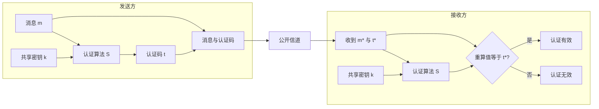
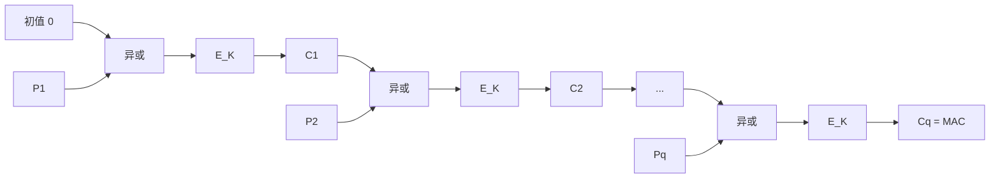
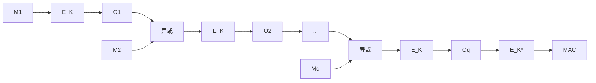
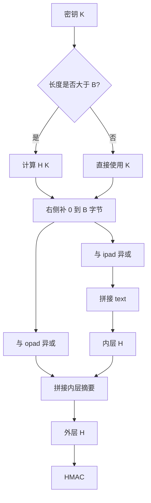
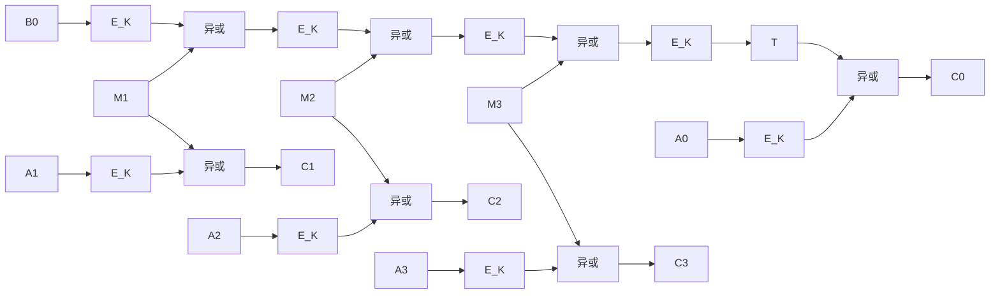

# 6.2 Hash 函数和 MAC（二）

> 本笔记依据“HASH 函数和 MAC（二）”课件整理，重点讨论消息认证码的定义、安全目标、攻击模型、CBC-MAC、ECBC-MAC、HMAC 与认证加密模式。课件全部 28 页均已结合 PDF 文字层与逐页渲染核查，原图中的认证流程、迭代结构和 CCM 结构均已转换为可检索的原生图表与文字。

## 主要内容

- 消息认证码的定义、工作流程与安全目标
- 密钥恢复、存在性伪造与选择性伪造
- 被动、非自适应和自适应选择消息攻击
- CBC-MAC、拼接攻击、消息填充与 ECBC-MAC
- HMAC 的参数、公式与计算步骤
- 认证加密的定义、安全性与组合顺序
- CCM 的 CBC-MAC 与计数器模式组合

---

## 一、消息认证码的定义与流程

### 1. MAC 密码体制

> 消息认证码（Message Authentication Code，MAC）是定义在密钥空间 $\mathcal K$、消息空间 $\mathcal M$ 和认证码空间 $\mathcal T$ 上的算法组。发送方和接收方共享密钥 $k\in\mathcal K$；发送方对消息 $m\in\mathcal M$ 计算 $t=S(k,m)\in\mathcal T$，接收方对收到的 $(m^*,t^*)$ 计算 $V(k,m^*,t^*)\in\{\mathrm{Accept},\mathrm{Reject}\}$。

$S$ 利用密钥和任意长度消息生成固定长度短数据块。若验证结果为 `Accept`，接收方可以相信消息未被修改，并确信消息来自持有共享密钥的真正发送方。

### 2. MAC 提供的保证

MAC 主要保证消息来源认证和完整性。由于通信双方共同持有同一秘密密钥，它不能像数字签名那样向第三方提供不可抵赖性。

---

# 二、安全目标与攻击模型

### 1. 攻击目的

1. 密钥恢复攻击：  
   攻击者找到合法用户的密钥 $k$。
2. 伪造攻击：  
   攻击者在不知道 $k$ 的情况下构造可通过验证的、未经认证的 $(m,t)$ 对。
3. 存在性伪造：  
   攻击者能够对至少一个不由其控制的消息完成伪造。
4. 选择性伪造：  
   攻击者能够对自己选定的消息 $m^*$ 产生合法的 $(m^*,t^*)$。

### 2. 攻击能力

| 攻击种类       | 攻击者可获得的信息或能力                    |
| ---------- | ------------------------------- |
| 被动的已知消息攻击  | 通过窃听获得若干消息及同一密钥下对应的认证码          |
| 非自适应选择消息攻击 | 在使用 MAC 设备前一次性选定待查询消息，再向认证预言机查询 |
| 自适应选择消息攻击  | 根据前一次 MAC 设备输出，继续选择下一条查询消息      |

---

## 三、CBC-MAC

### 1. 基本构造

设分组密码为 $E_K$，分组长度为 $L$，消息空间为 $\mathcal P^{\leq L}$。把消息划分为 $q$ 个等长分组 $P_1,\ldots,P_q$，令 $C_0=0$，依次计算

$$
C_i=E_K(P_i\oplus C_{i-1}),\qquad 1\leq i\leq q,
$$

并以末分组 $C_q$ 或其截断值作为 MAC。

### 2. 拼接攻击

以下讨论假定消息恰好为分组长度的整数倍，暂不考虑填充。

**攻击一**：若 $t_1=E_K(D_1)$，令 $D_2=D_1\oplus t_1$，则

$$
\operatorname{CBCMAC}_K(D_1\|D_2)
=E_K(E_K(D_1)\oplus D_2)
=E_K(D_1)=t_1.
$$

因而 $t_1$ 同时是单分组消息 $D_1$ 和双分组消息 $D_1\|D_2$ 的合法认证值。这是 **cut-and-paste（剪切与粘贴）攻击**。

**攻击二**：攻击者要伪造单分组消息 $D$ 的 MAC。

1. 选取 $D_1$ 向认证者查询，得到 $t_1=E_K(D_1)$。
2. 计算 $D_2=D\oplus t_1$，再查询消息 $D_1\|D_2$。
3. 认证者返回

$$
t_2=E_K(E_K(D_1)\oplus D_2)=E_K(D),
$$

故 $t_2$ 就是消息 $D$ 的合法认证值。

### 3. 三种填充方法

设分组长度为 $n$ 比特。

1. 方法 1：  
   在数据右侧填充若干个或零个 `0`，使总长度成为 $n$ 的整数倍。
2. 方法 2：  
   先填充一个 `1`，再填充若干个或零个 `0`，使总长度成为 $n$ 的整数倍。
3. 方法 3：  
   先在右侧补 `0` 到分组边界，再在最左侧增加一个 $n$ 比特长度分组，其中写入原始数据比特长度的二进制表示，左侧用 `0` 补齐。

课件练习结论如下：

| 填充方法 | 攻击一是否仍存在 |
|---|---|
| 方法 1 | 存在 |
| 方法 2 | 不存在 |
| 方法 3 | 不存在 |

### 4. 标准计算过程

1. 填充数据，形成 $n$ 比特分组 $M_1,M_2,\ldots,M_q$。
2. 置 $I_1=M_1$，计算 $O_1=E_K(I_1)$。
3. 对 $i=2,3,\ldots,q$，计算

$$
I_i=O_{i-1}\oplus M_i,\qquad O_i=E_K(I_i).
$$

4. 对 $O_q$ 作选择处理，并在 $m<n$ 时截取最左侧 $m$ 比特作为 MAC。

---

## 四、ECBC-MAC

### 1. 结构

ECBC-MAC 先用密钥 $K$ 完成 CBC 链，再用独立密钥 $K^*$ 对末状态处理：

$$
\operatorname{ECBCMAC}_{K,K^*}(M)=E_{K^*}(O_q).
$$

### 2. 选择处理

标准给出两种处理方法：

1. $\mathrm{MAC}=E_{K^*}(O_q)$。
2. $\mathrm{MAC}=E_{K^*}(D_K(O_q))$。

选择处理增加了密码分析者穷举密钥的难度；处理完成后，再取 $n$ 比特结果最左侧的 $m$ 比特作为 MAC。

---

## 五、*HMAC*

### 1. 定义与参数

HMAC 由 Mihir Bellare、Ran Canetti 和 Hugo Krawczyk 于 1996 年提出。NIST 于 2002 年发布 HMAC 标准，用于认证消息来源及完整性，该算法也用于 ANSI X9.71。

> HMAC 的计算公式为
> $$
> \operatorname{HMAC}_K(\text{text})
> =H\big((K^+\oplus\mathrm{opad})\|H((K^+\oplus\mathrm{ipad})\|\text{text})\big).
> $$

| 符号 | 含义 |
|---|---|
| $H$ | 底层 Hash 函数 |
| $K$ | 输入密钥 |
| $B$ | Hash 消息分组字节数；课件给出 MD5、SHA-1 均为 64 字节（512 比特） |
| $L$ | 输出摘要字节数；MD5 为 16 字节 |
| $\mathrm{ipad}$ | `0x36` 重复 $B$ 次 |
| $\mathrm{opad}$ | `0x5c` 重复 $B$ 次 |
| $K^+$ | 把处理后的密钥右侧补 `0` 到 $B$ 字节所得结果 |

$K$ 可取不超过 $B$ 字节的任意长度，一般建议不短于 $L$。若密钥长于 $B$，先计算 $H(K)$，以得到的 $L$ 字节摘要作为真正密钥，再补零到 $B$ 字节。

### 2. 计算步骤

1. 在 $K$ 后补足够的 `0`，得到 $B$ 字节串 $K^+$。
2. 计算 $K^+\oplus\mathrm{ipad}$。
3. 把数据流 `text` 接在步骤 2 的结果后。
4. 对步骤 3 的比特串计算 $H$，得到内层摘要。
5. 计算 $K^+\oplus\mathrm{opad}$。
6. 把内层摘要接在步骤 5 的结果后。
7. 对步骤 6 的比特串计算 $H$，得到 HMAC。

HMAC 的预计算结构可预先计算 $H(IV,K^+\oplus\mathrm{ipad})$ 和 $H(IV,K^+\oplus\mathrm{opad})$ 两个链值；对每条消息只需从这两个预计算状态继续处理消息与内层摘要。

---

## 六、认证加密

### 1. 定义与安全性

约在 2000 年形成认证加密（Authenticated Encryption，AE）系统的思想。

> 认证加密系统 $(E,D)$ 定义为
> $$
> E:\mathcal K\times\mathcal M\times\mathcal N\to\mathcal C,
> $$
> $$
> D:\mathcal K\times\mathcal C\times\mathcal N\to\mathcal M\cup\{\perp\}.
> $$

其中 $\mathcal N$ 为 nonce 空间，$\perp$ 表示认证失败。课件给出的安全目标为：

- CPA 攻击下明文不可区分
- 密文完整性

### 2. 三种组合顺序

| 组合 | 顺序 | 课件列举的应用 |
|---|---|---|
| Encrypt-then-MAC（EtM） | 先加密，再对密文计算 MAC | IPSec |
| Encrypt-and-MAC（E&M） | 分别加密消息和计算消息 MAC | SSH |
| MAC-then-Encrypt（MtE） | 先对消息计算 MAC，再一并加密 | SSL/TLS |

### 3. CCM 模式

CCM 把 CBC-MAC 的认证与 Counter 模式的加密结合。课件结构中，$B_0,M_1,M_2,M_3$ 进入 CBC-MAC 链，得到认证值 $T$；计数器分组 $A_0,A_1,A_2,A_3$ 分别加密，$E_K(A_0)$ 用于掩蔽 $T$ 得到 $C_0$，$E_K(A_i)$ 与 $M_i$ 异或得到 $C_i$。

---

## 本章小结

| 主题 | 核心结论 |
|---|---|
| MAC | 共享密钥下为消息提供来源认证和完整性 |
| 安全目标 | 防止密钥恢复与未知密钥条件下的消息伪造 |
| CBC-MAC | 以 CBC 末状态为认证码；长度处理不当会遭拼接攻击 |
| ECBC-MAC | 以独立密钥对 CBC 末状态再加密 |
| HMAC | 内外两层 Hash，分别使用 `ipad` 和 `opad` |
| AE | 同时要求 CPA 下保密性和密文完整性 |
| CCM | CBC-MAC 负责认证，Counter 模式负责加密 |
