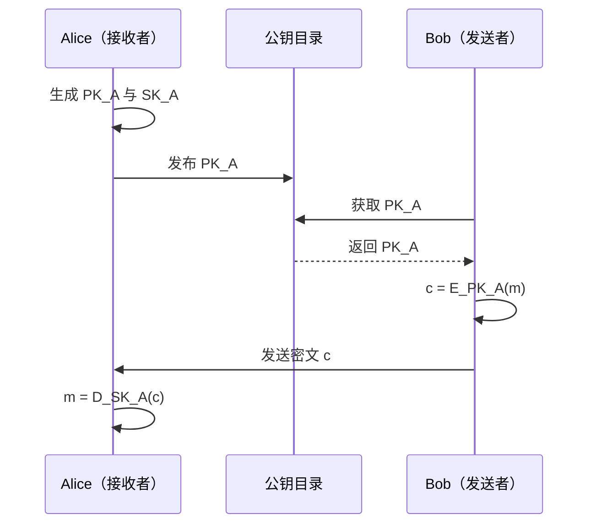
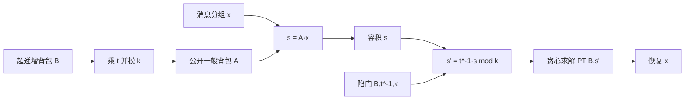

# 7.1 公钥密码学（一）

> 本笔记依据“公钥密码学 1”课件整理，介绍公钥密码产生的动因、加密模型、发展脉络、单向陷门函数以及 Merkle-Hellman 背包构造。课件 32 页中的公钥通信模型、人物照片和背包运算示意均已逐页核查；知识性图示已转为流程图，人物照片属于历史人物展示，其文字信息已完整保留。

## 主要内容

- 对称密码的初始密钥分配、密钥管理与不可抵赖问题
- 公钥加密的密钥生成、加密与解密模型
- 公钥密码体制的发展历程
- 单向陷门函数的定义、正确性与安全性
- 一般背包问题与超递增背包的求解
- Merkle-Hellman 背包单向陷门函数
- “SAUNA AND HEALTH”加解密实例与背包体制的破译

---

## 一、公钥密码的产生

### 1. 对称密码面临的问题

1. 初始密钥分配：  
   发送方指定种子密钥后，必须把密钥告知接收方，但“告知过程”本身需要防止泄露。
2. 密钥管理：  
   有 $n$ 个用户且任意两人需要独立共享密钥时，网络需管理

$$
\frac{n(n-1)}{2}
$$

个秘密密钥。
3. 不可抵赖性：  
   主体 A 收到主体 B 的电子文档后，无法仅凭共享密钥向第三方证明该文档确实来自 B。

### 2. 公钥加密模型

> 公钥加密系统为每个接收者生成一对密钥 $(PK_A,SK_A)$。$PK_A$ 是公开的加密密钥，$SK_A$ 是仅由接收者保存的解密密钥，并满足
> $$
> D_{SK_A}(E_{PK_A}(m))=m.
> $$

1. 密钥生成：Alice 生成 $(PK_A,SK_A)$，公开 $PK_A$ 并保密 $SK_A$。
2. 加密：Bob 获取 Alice 的公钥，计算

$$
c=E_{PK_A}(m).
$$

3. 解密：Alice 收到 $c$ 后计算

$$
m=D_{SK_A}(c).
$$



---

## 二、公钥密码体制的发展

### 1. 主要里程碑

| 时间 | 人物或成果 | 课件内容 |
|---|---|---|
| 1976 | Diffie、Hellman | 在《密码学的新方向》中首次公开提出非对称密码思想；给出密钥协商协议，未实现加密方案 |
| 1978 | Rivest、Shamir、Adleman | 提出广泛应用的 RSA 算法 |
| 1984 | Shamir | 提出基于身份密码体制的思想，并给出基于身份的数字签名算法 |
| 1996 | Hoffstein、Pipher、Silverman | NTRU 格密码体制 |
| 1997 | Goldreich、Goldwasser、Halevi | 从格约化问题构造公钥密码体制 |
| 2001 | Boneh-Franklin、Cocks | 分别独立提出基于身份的加密算法 |
| 2003 | Al-Riyami | 提出无证书密码体制 |
| 2005 | Sahai、Waters | 模糊身份加密 |
| 2009 | Gentry | 基于理想格的全同态加密 |
| 2011 | Boneh、Sahai、Waters | 函数加密的定义与挑战 |
| 2013 | Gorbunov、Wee、Vaikuntanathan | 面向电路的属性加密 |

课件展示了 Diffie、Hellman、Rivest、Shamir 和 Adleman 的人物照片；这些照片用于标识历史人物，不额外承载算法信息。

---

## 三、单向陷门函数

### 1. 定义

> 定义在 $(X,Y)$ 上的单向陷门函数（One-way Trapdoor Function，OTF）由三个有效算法 $(G,F,F^{-1})$ 组成：
> - $G(\cdot)$：随机密钥生成算法，输出 $(pk,sk)$；
> - $F(pk,\cdot)$：确定算法，定义从 $X$ 到 $Y$ 的映射；
> - $F^{-1}(sk,\cdot)$：利用陷门 $sk$ 实现从 $Y$ 到 $X$ 的逆运算。

### 2. 正确性与单向性

对任意 $G$ 生成的 $(pk,sk)$，正确性要求

$$
\forall x\in X,\qquad F^{-1}(sk,F(pk,x))=x.
$$

> 若对所有有效算法 $A$，由公开密钥和函数值恢复原像的成功概率均可忽略，则 $(G,F,F^{-1})$ 是安全的单向陷门函数：
> $$
> \operatorname{Adv}_{\mathrm{OW}}[A,F]
> =\Pr[A(pk,F(pk,x))=x]<\text{可忽略量}.
> $$

公开方向 $F(pk,x)$ 必须易算；不知道 $sk$ 时求逆必须计算不可行；知道陷门 $sk$ 时则能有效求逆。

---

## 四、背包问题

### 1. 一般背包问题

> 给定背包向量 $A=(a_1,a_2,\ldots,a_n)$ 和容积 $s$，求其子集 $A'$，使 $A'$ 中元素之和恰等于 $s$。

等价地，寻找 $x=(x_1,\ldots,x_n)\in\{0,1\}^n$ 使

$$
f(A,x)=A\cdot x=\sum_{i=1}^{n}x_i a_i=s.
$$

**例**：

$$
A=(43,129,215,473,903,302,561,1165,697,1523),\quad s=3231.
$$

因为

$$
3231=129+473+903+561+1165,
$$

故

$$
A'=\{129,473,903,561,1165\}.
$$

课件把函数定义为 $f:\{0,1\}^{10}\to S$，其中 $S$ 是所有可能容积的集合，并列出：

$$
f(364_{10})=f(0101101100)=3231,
$$

$$
f(609)=2942,\quad f(686)=3584,\quad f(32)=903,
$$

$$
f(46)=3326,\quad f(128)=215,\quad f(261)=2817.
$$

原则上可检查 $A$ 的全部 $2^n$ 个子集。例中 $n=10$，连空集共有 $2^{10}=1024$ 个子集；当 $n$ 足够大时穷举计算不可行。

### 2. 超递增背包

> 若背包向量 $B=(b_1,b_2,\ldots,b_n)$ 满足
> $$
> b_j>\sum_{i=1}^{j-1}b_i,\qquad j=2,\ldots,n,
> $$
> 则称 $B$ 为超递增背包。

超递增背包可用多项式时间贪心算法 $PT(B,s)$ 求解：

1. 从 $b_n$ 起逆序检查。若 $s\geq b_n$，置 $x_n=1$ 并令 $s\leftarrow s-b_n$；否则置 $x_n=0$。
2. 对 $b_{n-1},\ldots,b_1$ 重复该过程。
3. 检查 $Bx=s$ 的原始等式是否成立；成立则输出 $x$，否则判定无解。

更新可写为

$$
s\leftarrow
\begin{cases}
s,&s<b_j,\\
s-b_j,&s\geq b_j.
\end{cases}
$$

---

## 五、Merkle-Hellman 背包陷门构造

### 1. 密钥生成

> 背包 OTF 的密钥生成算法 $G(n)$：

1. 生成长度为 $n$ 的超递增背包

$$
B=(b_1,b_2,\ldots,b_n).
$$

2. 选择整数 $k,t$，满足

$$
k>\sum_i b_i,\qquad \gcd(t,k)=1.
$$

3. 计算

$$
a_i\equiv t b_i\pmod{k},\qquad i=1,\ldots,n,
$$

得到一般背包 $A=(a_1,\ldots,a_n)$。
4. 公开密钥为 $A$；$B,t,t^{-1},k$ 构成陷门信息。

### 2. 正向函数与消息分组

把二进制消息按 $n$ 比特分组：

$$
m=x^{(1)}\|x^{(2)}\|x^{(3)}\|\cdots.
$$

对每组计算

$$
s_i=f(A,x^{(i)})=A\cdot x^{(i)}
=\sum_{j=1}^{n}x_j^{(i)}a_j.
$$

### 3. 利用陷门求逆

1. 对每个 $s_i$ 计算

$$
s_i'=t^{-1}s_i\bmod k.
$$

2. 求解超递增背包

$$
x^{(i)}=PT(B,s_i').
$$

正确性来自

$$
s_i'\equiv t^{-1}Ax^{(i)}
\equiv t^{-1}tBx^{(i)}
\equiv Bx^{(i)}\pmod{k}.
$$

又因 $k>\sum b_i$ 且 $x_i\in\{0,1\}$，有 $Bx^{(i)}<k$，故模 $k$ 后的 $s_i'$ 就是唯一的超递增背包容积。



---

## 六、完整实例

### 1. 生成密钥

取

$$
B=(1,3,5,11,21,44,87,175,349,701),
$$

$$
k=1590,\qquad t=43,
$$

满足 $k>\sum b_i$ 且 $\gcd(43,1590)=1$。计算

$$
A\equiv43B\pmod{1590}
=(43,129,215,473,903,302,561,1165,697,1523).
$$

模逆为

$$
t^{-1}\equiv37\pmod{1590}.
$$

公钥为 $A$，私钥陷门为 $(B,37,1590)$。

### 2. 编码与加密

消息为 `SAUNA AND HEALTH`，每个英文字符用 5 比特编码，每两个字符组成一个 10 比特分组：

```text
SA || UN || A  || AN || D  || HE || AL || TH
1001100001 || 1010101110 || 0000100000 || 0000101110 ||
0010000000 || 0100000101 || 0000101100 || 1010001000
```

各分组函数值为

$$
s_1=2942,\ s_2=3584,\ s_3=903,\ s_4=3326,
$$

$$
s_5=215,\ s_6=2817,\ s_7=2629,\ s_8=819.
$$

### 3. 解密

计算 $s_i'=37s_i\bmod1590$：

$$
s_1'=734,\ s_2'=638,\ s_3'=21,\ s_4'=632,
$$

$$
s_5'=5,\ s_6'=879,\ s_7'=283,\ s_8'=93.
$$

逐一运行 $PT(B,s_i')$，恢复：

```text
1001100001 || 1010101110 || 0000100000 || 0000101110 ||
0010000000 || 0100000101 || 0000101100 || 1010001000
```

译码得到原消息：

```text
SA || UN || A || AN || D || HE || AL || TH
```

### 4. 安全性结局

背包密码体制是 Diffie 和 Hellman 1976 年提出公钥密码设想之后的第一个公钥密码算法，由 Merkle 和 Hellman 于 1978 年提出。两年后该体制被破译：攻击的基本思想是寻找另一组模数 $k'$ 和乘数 $t'$，使它们作用于公开背包 $A$ 后也能产生超递增背包；攻击者不必恢复原始陷门，只需找到任意等价陷门即可。

---

## 本章小结

| 主题 | 核心结论 |
|---|---|
| 公钥动因 | 缓解对称密码初始密钥分配和大规模密钥管理问题 |
| 公钥模型 | 公钥加密、私钥解密，密钥成对生成 |
| OTF | 正向易算，无陷门求逆困难，有陷门求逆有效 |
| 一般背包 | 求解依赖组合搜索 |
| 超递增背包 | 可从大到小贪心求解 |
| Merkle-Hellman | 用模乘把易解超递增背包伪装成一般背包 |
| 安全性 | 原方案可被等价陷门攻击破译 |
