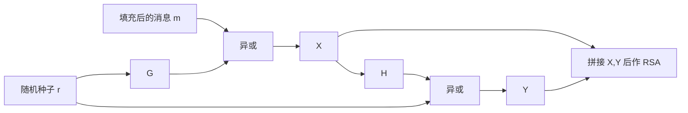

# 7.2 公钥密码学（二）

> 本笔记依据“公钥密码学 2”课件整理，完整梳理费马小定理、欧拉定理、RSA 的密钥生成与正确性、参数攻击、Miller-Rabin 检测、快速模幂、CRT 解密和 OAEP。课件全部 47 页已逐页核查，人物照片与网页截图只提供历史背景；算法框图、表格和 OAEP 视觉结构均已转写为原生文本、表格或流程图。

## 主要内容

- 费马小定理与欧拉定理及其证明
- RSA 密钥生成、加密、解密和正确性
- RSA 实例与整数分解安全基础
- Fermat 分解、重复加密、小指数和同模攻击
- Wiener 连分数攻击与安全参数要求
- Miller-Rabin 素性检测
- 平方-乘快速模幂与 CRT 加速解密
- 选择密文攻击与 OAEP 填充

---

## 一、数论基础

### 1. 费马小定理

> **费马小定理**：设 $p$ 为素数，$a$ 为整数且 $\gcd(a,p)=1$，则
> $$
> a^{p-1}\equiv1\pmod p.
> $$
> 等价形式为
> $$
> a^p\equiv a\pmod p,
> $$
> 后一形式对任意整数 $a$ 都成立。

**证明**：模 $p$ 的非零剩余类是 $1,2,\ldots,p-1$。把它们分别乘以 $a$，得到

$$
a,2a,\ldots,(p-1)a.
$$

因为 $\gcd(a,p)=1$，这些数模 $p$ 均非零。若 $ia\equiv ja\pmod p$，则可约去 $a$ 得 $i\equiv j\pmod p$；而 $1\leq i,j\leq p-1$，所以 $i=j$。因此上述数列是非零剩余类的一个排列，故

$$
a\cdot2a\cdots(p-1)a\equiv1\cdot2\cdots(p-1)\pmod p.
$$

即

$$
a^{p-1}(p-1)!\equiv(p-1)!\pmod p.
$$

由于 $\gcd((p-1)!,p)=1$，约去 $(p-1)!$，得到 $a^{p-1}\equiv1\pmod p$。

### 2. 欧拉定理

> **欧拉定理**：设 $n$ 为正整数，$a$ 为整数且 $\gcd(a,n)=1$，则
> $$
> a^{\varphi(n)}\equiv1\pmod n,
> $$
> 其中 $\varphi(n)$ 表示 $1$ 到 $n$ 中与 $n$ 互素的整数个数。

例如 $\varphi(10)=4$，因为 $1,3,7,9$ 与 10 互素。

**证明思路**：设模 $n$ 的既约剩余系为

$$
r_1,r_2,\ldots,r_{\varphi(n)}.
$$

把每一项乘以 $a$。与费马小定理同理，可证明 $ar_i$ 模 $n$ 仍两两不同且都与 $n$ 互素，因而只是原既约剩余系的重新排列。两边连乘并约去 $\prod r_i$，即得结论。

当 $n=p$ 且 $p$ 为素数时，$\varphi(p)=p-1$，欧拉定理退化为费马小定理。

### 3. 与 RSA 有关的推论

若 $\gcd(a,n)=1$，则

$$
a^{k\varphi(n)}\equiv1\pmod n,
$$

$$
a^{k\varphi(n)+1}\equiv a\pmod n.
$$

若 $ed\equiv1\pmod{\varphi(n)}$，则存在整数 $k$ 使 $ed=k\varphi(n)+1$，从而

$$
a^{ed}\equiv a\pmod n.
$$

---

## 二、RSA 密码体制

### 1. 定义与历史

RSA 由 R. Rivest、A. Shamir 和 L. Adleman 于 1978 年提出，论文题为 *On Digital Signatures and Public Key Cryptosystems*。三人因 RSA 公钥算法获得 2002 年 ACM 图灵奖。

> **RSA 密码体制**：公钥为 $(n,e)$，私钥为 $(n,d)$；对 $0\leq m<n$，
> $$
> c\equiv m^e\pmod n,
> $$
> $$
> m\equiv c^d\pmod n.
> $$

### 2. 密钥生成

1. 选取两个安全大素数 $p,q$。
2. 计算

$$
n=pq,\qquad \varphi(n)=(p-1)(q-1).
$$

3. 选取 $e$，满足

$$
1<e<\varphi(n),\qquad \gcd(e,\varphi(n))=1.
$$

4. 求 $e$ 模 $\varphi(n)$ 的逆元 $d$：

$$
de\equiv1\pmod{\varphi(n)}.
$$

5. 公开 $(n,e)$，保密 $(n,d)$ 以及因子 $p,q$。

### 3. 加密与解密

先将明文分组，使每组数值 $m<n$，即每组长度小于 $\log_2n$。对各组分别计算：

$$
c=m^e\bmod n,
$$

$$
m=c^d\bmod n.
$$

```mermaid
flowchart LR
  P[p,q] --> N[n=pq]
  P --> PHI[φ n=(p-1)(q-1)]
  PHI --> E[选择 e 与 φ n 互素]
  E --> D[求 d=e^-1 mod φ n]
  N --> PUB[公钥 n,e]
  E --> PUB
  N --> PRI[私钥 n,d]
  D --> PRI
  M[明文 m] --> ENC[c=m^e mod n]
  PUB --> ENC
  ENC --> DEC[m=c^d mod n]
  PRI --> DEC
```

---

## 三、RSA 正确性

### 1. $\gcd(m,n)=1$ 的情形

由 $ed=k\varphi(n)+1$ 与欧拉定理，

$$
c^d\equiv m^{ed}
=m^{k\varphi(n)+1}
\equiv m\pmod n.
$$

### 2. $\gcd(m,n)\neq1$ 的情形

设 $n=pq$ 且 $0<m<n$。若 $m$ 与 $n$ 不互素，不妨令 $m=tp$。此时必有 $\gcd(m,q)=1$，否则 $m$ 同时为 $p,q$ 的倍数，从而 $m\geq pq=n$，与 $m<n$ 矛盾。

由欧拉定理，

$$
m^{\varphi(q)}\equiv1\pmod q.
$$

进而

$$
m^{k\varphi(n)}
=m^{k\varphi(p)\varphi(q)}\equiv1\pmod q.
$$

故存在整数 $r$ 使

$$
m^{k\varphi(n)}=1+rq.
$$

两边乘 $m=tp$：

$$
m^{k\varphi(n)+1}=m+rtpq=m+rtn\equiv m\pmod n.
$$

所以任意 $0\leq m<n$ 都满足 $c^d\equiv m\pmod n$。

---

## 四、RSA 计算实例

### 1. 密钥生成

Bob 选取 $p=7,q=17$：

$$
n=119,\qquad\varphi(n)=6\times16=96.
$$

取 $e=5$。因为

$$
77\times5=385=4\times96+1,
$$

所以 $d=77$。公钥为 $(119,5)$，私钥为 $(119,77)$。

### 2. 加密与解密

Alice 要发送 $m=19$：

$$
c\equiv19^5\equiv66\pmod{119}.
$$

Bob 解密：

$$
66^{77}\equiv19\pmod{119}.
$$

---

## 五、安全基础与整数分解

### 1. 安全基础

> RSA 的直接安全基础是整数分解问题：已知 $n=pq$ 是两个大素数的乘积，求 $p,q$。

若攻击者分解 $n$，即可计算 $\varphi(n)=(p-1)(q-1)$，进而由

$$
d\equiv e^{-1}\pmod{\varphi(n)}
$$

恢复私钥。课件同时强调：尚未证明大整数分解是 NP 完全问题，也不能排除存在尚未发现的多项式时间算法。

### 2. RSA-768 事件

课件列举 RSA-768：768 比特、232 位十进制数，于 2009 年 12 月被 T. Kleinjung 等组成的六机构团队分解。提交者估计消耗约 2000 个 2.2 GHz Opteron CPU 年，实际日历时间接近三年。该事件说明安全参数必须随计算与算法能力提高而增长。

---

## 六、RSA 参数攻击

### 1. $|p-q|$ 过小：Fermat 分解

因为

$$
\frac{(p+q)^2}{4}-n=\frac{(p-q)^2}{4},
$$

若 $|p-q|$ 很小，则 $(p+q)/2$ 仅略大于 $\sqrt n$。攻击方法为：

1. 从大于 $\sqrt n$ 的整数开始依次检查 $x$，直到 $x^2-n=y^2$ 为完全平方数。
2. 由

$$
n=x^2-y^2=(x+y)(x-y)
$$

得到因子分解。

因此 $p,q$ 应足够大且相距较远。

### 2. $p-1,q-1$ 缺少大素因子

攻击者可对密文反复作公开指数运算：

$$
c^e\equiv m^{e^2},\quad
c^{e^2}\equiv m^{e^3},\quad\ldots\pmod n.
$$

若某个较小的 $t$ 使 $c^{e^t}\equiv c\pmod n$，则前一步可能恢复 $m$。课件由

$$
\gcd(e^t-1,(p-1)(q-1))>1
$$

说明要使周期 $t$ 足够大，$p-1$ 和 $q-1$ 都应含大素因子。

### 3. 加密指数过小

若 $e$ 很小，如 $e=3$，且明文满足

$$
m<n^{1/e},
$$

则 $m^e<n$，模约简并未发生，密文就是普通整数 $c=m^e$。攻击者直接求整数 $e$ 次根即可恢复 $m$。

### 4. 同模攻击

同一消息 $m$ 在同一模数 $n$ 下分别用互素指数 $e_1,e_2$ 加密：

$$
c_1=m^{e_1}\bmod n,\qquad c_2=m^{e_2}\bmod n.
$$

由扩展 Euclid 算法求 $r,s$ 使

$$
re_1+se_2=1.
$$

于是

$$
c_1^r c_2^s
\equiv m^{re_1+se_2}
\equiv m\pmod n.
$$

负指数通过模逆计算。不同用户不得共用模数 $n$。课件引用 2012 年 Lenstra 等对 660 万份 X.509 证书与 PGP 密钥的研究：约 4% 的用户共享 RSA 模数，另有部分模数共享大素因子，暴露了随机数和密钥生成质量问题。

### 5. Wiener 小私钥攻击

连分数写为

$$
x=a_0+\cfrac1{a_1+\cfrac1{a_2+\cfrac1{a_3+\ddots}}}.
$$

若有理数 $s/r$ 满足

$$
\left|\frac sr-\phi\right|\leq\frac1{2r^2},
$$

则 $s/r$ 是 $\phi$ 的一个连分数渐近分数。RSA 中若

$$
d\leq\frac{N^{0.25}}3,
$$

则

$$
\left|\frac kd-\frac eN\right|\leq\frac1{2d^2},
$$

其中 $ed=k\varphi(N)+1$。因此可枚举 $e/N$ 的渐近分数 $k/d$，从而恢复过小的 $d$。

**课件实例**：$N=5025043,e=717223$。

1. $e/N$ 的首个非零渐近分数为 $1/7$，令 $k=1,d=7$。
2. 计算

$$
\varphi(N)=ed-1=5020560.
$$

3. 由 $\varphi(N)=N-p-q+1$ 得 $p+q=4484$，又 $pq=N$。
4. 解得 $p=2203,q=2281$，验证乘积为 $5025043$。

**课堂练习参数**：

$$
p=223,\quad q=229,\quad N=51067,
$$

$$
\varphi(N)=50616,\quad d=5,\quad e=40493.
$$

课件要求验证 $e/N$ 的渐近分数 $1,3/4,4/5$，其中 $4/5$ 泄露 $d=5$。

### 6. 参数要求汇总

- 选取足够大的素数 $p,q$。
- $|p-q|$ 应较大。
- $p-1,q-1$ 应含大素因子。
- 课件建议公开指数取 $e=2^{16}-1=65535$。
- 解密指数 $d$ 应足够大。
- 不同用户不得共用模数 $n$。

---

## 七、素性检测

### 1. Miller-Rabin 算法

> 输入奇数 $n$，写成
> $$
> n-1=2^kq,
> $$
> 其中 $q$ 为奇数。随机选取 $1<a<n-1$，检测 $a^q$ 以及连续平方是否出现 $1$ 或 $-1\equiv n-1\pmod n$。

算法：

1. 求 $k>0$ 和奇数 $q$ 使 $n-1=2^kq$。
2. 随机选 $a$，$1<a<n-1$。
3. 若 $a^q\bmod n=1$，返回“不能确定”。
4. 对 $j=0,1,\ldots,k-1$，若

$$
a^{2^jq}\bmod n=n-1,
$$

返回“不能确定”。
5. 否则返回“合数”。

### 2. 复杂度与错误概率

课件给出的时间复杂度为 $O((\log n)^3)$。它是对合数问题的 Yes-biased Monte Carlo 算法，单轮把合数误判为“不能确定”的概率至多为 $1/4$；重复独立测试可降低错误概率。课件还提到 2002 年 Agrawal、Kayal、Saxena 的 AKS 算法证明素数判定属于 P。

---

## 八、快速模幂与 CRT 解密

### 1. 平方-乘算法

利用

$$
(ab)\bmod n=[(a\bmod n)(b\bmod n)]\bmod n
$$

控制中间结果。若

$$
t=(b_kb_{k-1}\cdots b_0)_2,
$$

则从最高位到最低位不断“平方”，在 $b_i=1$ 时再“乘 $a$”。

```text
d = 1
for i = k downto 0:
    d = d^2 mod n
    if b_i = 1:
        d = d * a mod n
return d
```

例如 $19=(10011)_2$，故

$$
a^{19}=((((a^1)^2a^0)^2a^0)^2a^1)^2a^1.
$$

**课件表例**：计算 $7^{560}\bmod561$，$560=(1000110000)_2$。

| 位 $i$ | 初值 | 9 | 8 | 7 | 6 | 5 | 4 | 3 | 2 | 1 | 0 |
|---|---|---|---|---|---|---|---|---|---|---|---|
| $b_i$ |  | 1 | 0 | 0 | 0 | 1 | 1 | 0 | 0 | 0 | 0 |
| 部分指数 $c$ | 0 | 1 | 2 | 4 | 8 | 17 | 35 | 70 | 140 | 280 | 560 |
| 余数 $d$ | 1 | 7 | 49 | 157 | 526 | 160 | 241 | 298 | 166 | 67 | 1 |

因此

$$
7^{560}\equiv1\pmod{561}.
$$

### 2. CRT 加速 RSA 解密

加密指数通常较小，加密较快；解密指数较大，可用中国剩余定理并行计算：

$$
M_1=(C\bmod p)^{d\bmod(p-1)}\bmod p,
$$

$$
M_2=(C\bmod q)^{d\bmod(q-1)}\bmod q.
$$

求满足

$$
M\equiv M_1\pmod p,\qquad M\equiv M_2\pmod q
$$

的唯一解。课件给出的合并式为

$$
M=\big[(M_2+q-M_1)u\bmod q\big]p+M_1,
$$

其中 $pu\equiv1\pmod q$。

---

## 九、选择密文攻击与 OAEP

### 1. 教科书 RSA 的乘法性攻击

攻击者把目标密文 $C$ 伪装为 $r^eC$ 并请求拥有私钥者解密：

$$
(r^eC)^d\equiv r^{ed}C^d\equiv rM\pmod n.
$$

取得结果后计算

$$
M\equiv(r^eC)^d r^{-1}\pmod n.
$$

这说明不带随机填充的教科书 RSA 不抵抗选择密文攻击。

### 2. OAEP 结构

PKCS #1 v2.0 使用 OAEP。令 $G,H$ 为掩码生成所用函数，课件说明通常可使用 SHA-256。编码核心为：

1. 生成随机种子 $r$。
2. 用 $G(r)$ 掩蔽填充后的消息块 $m$：

$$
X=m\oplus G(r).
$$

3. 用 $H(X)$ 掩蔽种子：

$$
Y=r\oplus H(X).
$$

4. 将 $(X,Y)$ 作为 RSA 的编码输入。解密时逆序恢复，并严格检查填充格式；若检查失败则拒绝解密。



---

## 本章小结

| 主题 | 核心结论 |
|---|---|
| 数论基础 | 欧拉定理使 $m^{ed}\equiv m\pmod n$ 成立 |
| RSA | $c=m^e\bmod n$，$m=c^d\bmod n$ |
| 安全基础 | 分解 $n$ 即可恢复 $\varphi(n)$ 和 $d$ |
| 参数攻击 | 防范近素数、光滑 $p-1$、小 $e$、小 $d$ 与共模 |
| 素数检测 | Miller-Rabin 是可重复降低错误率的概率检测 |
| 模幂 | 平方-乘算法逐位处理指数 |
| CRT | 分别模 $p,q$ 解密后合并可加速 RSA |
| OAEP | 以随机掩码和填充检查抵抗教科书 RSA 的结构性攻击 |

---

## 课后作业

1. RSA 公钥为 $e=5,n=35$，截获密文 $C=10$，求明文。
2. 计算 $3^{201}\bmod11$。

前后关联：[[现代密码学/笔记/7.1 公钥密码学（一）]] ← 本节 → [[现代密码学/笔记/7.3 公钥密码学（三）]]
